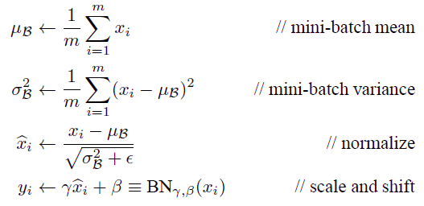
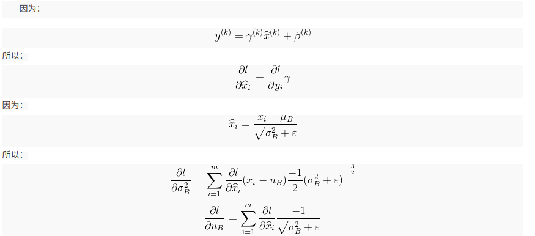
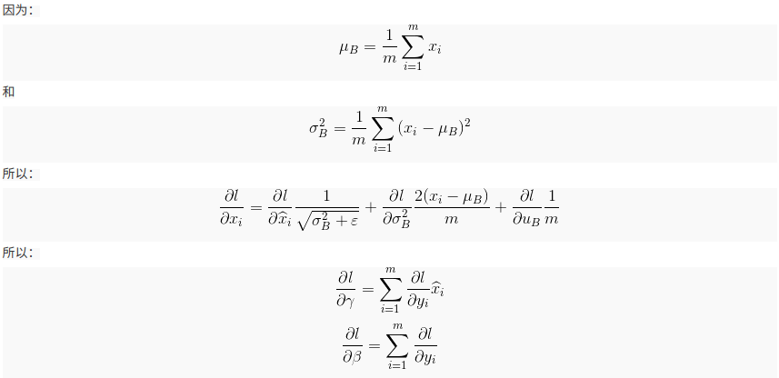

# Batch Normalization

> https://blog.csdn.net/hjimce/article/details/50866313

## 强大之处

尽管随机梯度下降法对于训练深度网络简单高效，但是它有个毛病，就是需要我们人为的去选择参数，比如学习率、参数初始化、权重衰减系数、Dropout比例等。这些参数的选择对训练结果至关重要，以至于我们很多时间都浪费在这些的调参上。那么学完这篇文献之后，你可以不需要那么刻意的慢慢调整参数。BN算法（Batch Normalization）其强大之处如下：

1. 你可以选择**比较大的初始学习率**，让你的训练速度飙涨。以前还需要慢慢调整学习率，甚至在网络训练到一半的时候，还需要想着学习率进一步调小的比例选择多少比较合适，现在我们可以采用初始很大的学习率，然后学习率的衰减速度也很大，因为这个算法收敛很快。当然这个算法即使你选择了较小的学习率，也比以前的收敛速度快，因为它**具有快速训练收敛的特性**；

2. 你再也不用去理会过拟合中dropout、L2正则项参数的选择问题，采用BN算法后，你可以移除这两项了参数，或者可以选择更小的L2正则约束参数了，因为BN**具有提高网络泛化能力的特性**；

3. 再也不需要使用使用局部响应归一化层了（局部响应归一化是Alexnet网络用到的方法，搞视觉的估计比较熟悉），因为**BN本身就是一个归一化网络层**；

4. **可以把训练数据彻底打乱**（防止每批训练的时候，某一个样本都经常被挑选到，文献说这个可以提高1%的精度，这句话我也是百思不得其解啊）。

开始讲解算法前，先来思考一个问题：我们知道在神经网络训练开始前，都要对输入数据做一个归一化处理，那么**具体为什么需要归一化呢？归一化后有什么好处呢？**

原因在于神经网络学习过程**本质就是为了学习数据分布**，<u>一旦训练数据与测试数据的分布不同，那么网络的泛化能力也大大降低</u>；另外一方面，一旦每批训练数据的分布各不相同(batch 梯度下降)，<u>那么网络就要在每次迭代都去学习适应不同的分布，这样将会大大降低网络的训练速度</u>，这也正是为什么我们需要对数据都要做一个归一化预处理的原因。

对于深度网络的训练是一个复杂的过程，只要网络的前面几层发生微小的改变，那么后面几层就会被累积放大下去。一旦网络某一层的输入数据的分布发生改变，那么这一层网络就需要去适应学习这个新的数据分布，所以如果训练过程中，训练数据的分布一直在发生变化，那么将会影响网络的训练速度。

我们知道网络一旦train起来，那么参数就要发生更新，除了输入层的数据外(因为输入层数据，我们已经人为的为每个样本归一化)，*后面网络每一层的输入数据分布是一直在发生变化的*，因为在训练的时候，**前面层训练参数的更新将导致后面层输入数据分布的变化**。

以网络第二层为例：网络的第二层输入，是由第一层的参数和input计算得到的，而第一层的参数在整个训练过程中一直在变化，因此必然会引起后面每一层输入数据分布的改变。

我们把网络中间层在训练过程中，数据分布的改变称之为：“Internal  Covariate Shift”。Paper所提出的算法，就是要**解决在训练过程中，中间层数据分布发生改变的情况**，于是就有了Batch  Normalization，这个牛逼算法的诞生。

## BN概述

就像激活函数层、卷积层、全连接层、池化层一样，BN(Batch Normalization)也属于网络的一层。在前面我们提到网络除了输出层外，其它层因为低层网络在训练的时候更新了参数，而引起后面层输入数据分布的变化。这个时候我们可能就会想，如果**在每一层输入的时候，再加个预处理操作那该有多好啊**，比如网络第三层输入数据X3(X3表示网络第三层的输入数据)把它归一化至：均值0、方差为1，然后再输入第三层计算，这样我们就可以解决前面所提到的“Internal Covariate Shift”的问题了。

而事实上，paper的算法本质原理就是这样：**在网络的每一层输入的时候，又插入了一个归一化层，也就是先做一个归一化处理，然后再进入网络的下一层**。不过文献归一化层，可不像我们想象的那么简单，**它是一个可学习、有参数的网络层**。既然说到数据预处理，下面就先来复习一下最强的预处理方法：白化。

### 预处理操作选择

说到神经网络输入数据预处理，最好的算法莫过于白化预处理。

然而**白化计算量太大**了，很不划算，还有就是**白化不是处处可微**的，所以在深度学习中，其实很少用到白化。

经过白化预处理后，数据满足条件：

* 特征之间的相关性降低，这个就相当于pca；
* 数据均值、标准差归一化，也就是使得每一维特征均值为0，标准差为1。

如果数据特征维数比较大，要进行PCA，也就是实现白化的第1个要求，是需要计算特征向量，计算量非常大，于是为了简化计算，作者忽略了第1个要求，仅仅使用了下面的公式进行预处理，也就是**近似白化预处理**：


公式简单粗糙，但是依旧很牛逼。因此后面我们也将用这个公式，对某一个层网络的输入数据做一个归一化处理。需要注意的是，我们训练过程中采用batch 随机梯度下降，上面的$E(x^{(k)})$指的是每一批训练数据神经元$x^{(k)}$的平均值；然后分母就是每一批数据神经元$x^{(k)}$激活度的一个标准差了。

### BN算法概述

经过前面简单介绍，这个时候可能我们会想当然的以为：好像很简单的样子，不就是在网络中间层数据做一个归一化处理嘛，这么简单的想法，为什么之前没人用呢？然而其实实现起来并不是那么简单的。

其实**如果是仅仅使用上面的归一化公式，对网络某一层A的输出数据做归一化，然后送入网络下一层B，这样是会影响到本层网络A所学习到的特征的**。

打个比方，比如我网络中间某一层学习到特征数据本身就分布在S型激活函数的两侧，你强制把它给我归一化处理、标准差也限制在了1，把数据变换成分布于s函数的中间部分，这样就相当于我这一层网络所学习到的特征分布被你搞坏了，这可怎么办？于是文献使出了一招惊天地泣鬼神的招式：**变换重构，引入了可学习参数γ、β**，这就是算法关键之处：


每一个神经元$x^{(k)}$都会有一对这样的**参数γ、β**。

这样其实当：


是可以恢复出原始的某一层所学到的特征的。因此我们引入了这个**可学习重构参数γ、β**，让我们的网络可以学习恢复出原始网络所要学习的特征分布。

最后Batch Normalization网络层的前向传导过程公式就是：(公式中m指的是mini-batch size)




### 源码实现

```python
m = K.mean(X, axis=-1, keepdims=True)#计算均值
std = K.std(X, axis=-1, keepdims=True)#计算标准差
X_normed = (X - m) / (std + self.epsilon)#归一化
out = self.gamma * X_normed + self.beta#重构变换
```

上面的x是一个二维矩阵，对于源码的实现就几行代码而已，轻轻松松。

## 实战使用

可能学完了上面的算法，你只是知道它的一个训练过程，一个网络一旦训练完了，就没有了min-batch这个概念了。

**测试阶段**我们一般只输入一个测试样本，看看结果而已。**因此测试样本，前向传导的时候，上面的均值u、标准差σ 要哪里来？**其实网络一旦训练完毕，参数都是固定的，这个时候即使是每批训练样本进入网络，那么**BN层计算的均值u、和标准差都是固定不变的**。我们可以采用这些数值来作为测试样本所需要的均值、标准差，于是最后测试阶段的u和σ 计算公式如下：


上面简单理解就是：对于均值来说直接计算所有batch $\mu$值的平均值；然后对于标准偏差采用每个batch$ σ_B$的无偏估计。最后测试阶段，BN的使用公式就是：


```python
x_normed = (x - bn_param['running_mean']) / np.sqrt(bn_param['running_var'] + eps)
# 变换重构
out = gamma * x_normed + beta
# 实际上这里就是一个直接的求解归一化后变换重构
```
根据文献说，**BN可以应用于一个神经网络的任何神经元上**。文献主要是把BN变换，置于网络激活函数层的前面。在没有采用BN的时候，激活函数层是这样的：$z=g(Wu+b)$

也就是我们希望一个激活函数，比如s型函数s(x)的自变量x是经过BN处理后的结果。因此前向传导的计算公式就应该是：$ z=g(BN(Wu+b)) $

其实因为<u>偏置参数b经过BN层后其实是没有用的，最后也会被均值归一化，当然BN层后面还有个β参数作为偏置项，所以b这个参数就可以不用了</u>。因此最后把**BN层+激活函数层**就变成了：$z=g(BN(Wu))$

## Batch Normalization在CNN中的使用

通过上面的学习，我们知道BN层是对于每个神经元做归一化处理，甚至只需要对某一个神经元进行归一化，而不是对一整层网络的神经元进行归一化。

既然BN是对单个神经元的运算，那么在CNN中卷积层上要怎么搞？假如某一层卷积层有6个特征图，每个特征图的大小是100×100，这样就相当于这一层网络有6×100×100个神经元（特征），如果采用BN，就会有6×100×100个参数γ、β，这样岂不是太恐怖了。

因此**卷积层上的BN使用，其实也是使用了类似权值共享的策略，把一整张特征图当做一个神经元进行处理**。

卷积神经网络经过卷积后得到的是一系列的特征图，如果min-batch sizes为m，那么网络某一层输入数据可以表示为四维矩阵(m,f,p,q)，m为min-batch sizes，f为特征图个数，p、q分别为特征图的宽高。

在cnn中我们可以**把每个特征图看成是一个特征处理（一个神经元）**，因此在使用Batch Normalization，mini-batch size 的大小就是：m×p×q，于是**对于每个特征图都只有一对可学习参数：γ、β**。说白了吧，这就是**相当于求取所有样本所对应的一个特征图的所有神经元的平均值、方差，然后对这个特征图神经元做归一化**。

下面是来自于keras卷积层的BN实现一小段主要源码：

```python
input_shape = self.input_shape
reduction_axes = list(range(len(input_shape)))
del reduction_axes[self.axis]
broadcast_shape = [1] * len(input_shape)
broadcast_shape[self.axis] = input_shape[self.axis]
if train:
    # 计算均值
    m = K.mean(X, axis=reduction_axes)
    brodcast_m = K.reshape(m, broadcast_shape)
    # 计算标准差（这之中使用了参数epsilon
    std = K.mean(K.square(X - brodcast_m) + self.epsilon, axis=reduction_axes)
    std = K.sqrt(std)
    brodcast_std = K.reshape(std, broadcast_shape)
    # 动量方式滑动更新策略
    mean_update = self.momentum * self.running_mean + (1-self.momentum) * m
    std_update = self.momentum * self.running_std + (1-self.momentum) * std
    self.updates = [(self.running_mean, mean_update),
                    (self.running_std, std_update)]
    # 计算归一化值
    X_normed = (X - brodcast_m) / (brodcast_std + self.epsilon)
else:
    # 可以认为是测试阶段
    brodcast_m = K.reshape(self.running_mean, broadcast_shape)
    brodcast_std = K.reshape(self.running_std, broadcast_shape)
    X_normed = ((X - brodcast_m) / (brodcast_std + self.epsilon))
    out = K.reshape(self.gamma, broadcast_shape) * X_normed + K.reshape(self.beta, broadcast_shape)
```

## 反向传播求解梯度



> 这里对于**均值求偏导数有问题**，改正为：
> $$
> \frac{\partial l}{\partial \mu_B}=\sum^m_{i=1}\frac{\partial l}{\partial \hat{x}_i}
> \frac{-1}{\sqrt{\sigma^2_B+\epsilon}}+\frac{\partial l}{\partial \sigma^2}\frac{-2}{m}\cdot\sum^m_{i=1}(x_i-\mu_B)
> $$
> 因为有两条路径，分子分母都有$\mu_B​$

（上图中的$u$即是下图中的$\mu$）



相关的代码：

```python
x, gamma, beta, x_normed, sample_mean, sample_var, eps = cache
# 罗列计算
# dout实际上就是dl/dy
# 对于beta，gamma求导，实际上是一个特征有一个beta，gamma，这导致求导是多个分支相加
dbeta = np.sum(dout, axis=0)
dgamma = np.sum(dout * x_normed, axis=0)

# 先计算出对归一化的x偏导
dx_normed = dout * gamma.reshape([1, -1])

# dy/dx有三条路径，一条是对归一化公式里的x，另外就是对均值里的和标准差里的x
# dl/dvar
dvar = -0.5 * np.sum(dx_normed * (x - sample_mean), axis=0) * \
    ((sample_var + eps)**(-1.5))
# dl/dmean
dmean = -np.sum(dx_normed / np.sqrt(sample_var + eps), axis=0) \
    - 2 * dvar / x.shape[0] * np.sum(x - sample_mean, axis=0)
# dl/dx
dx = dx_normed / np.sqrt(sample_var + eps) + 2 * dvar * (x - sample_mean) / \
    x.shape[0] + dmean / x.shape[0]
```
## 训练效果

