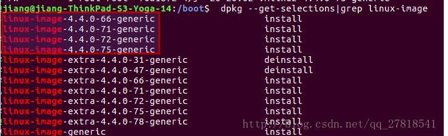
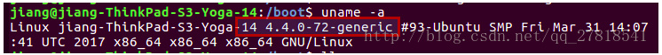
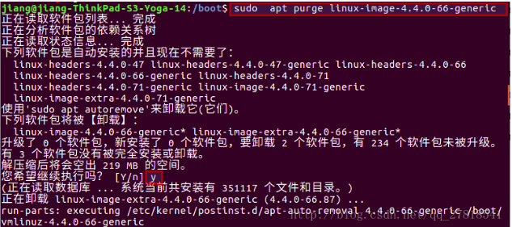
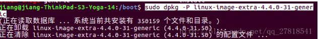
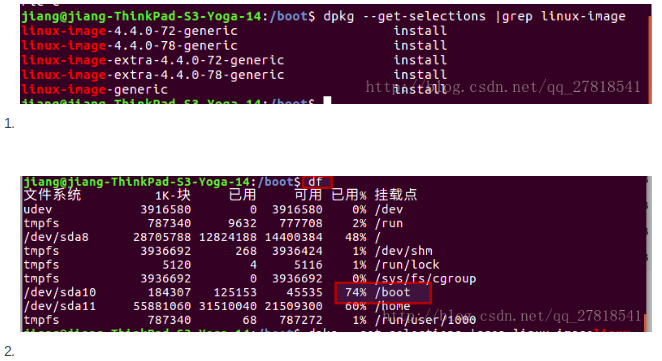
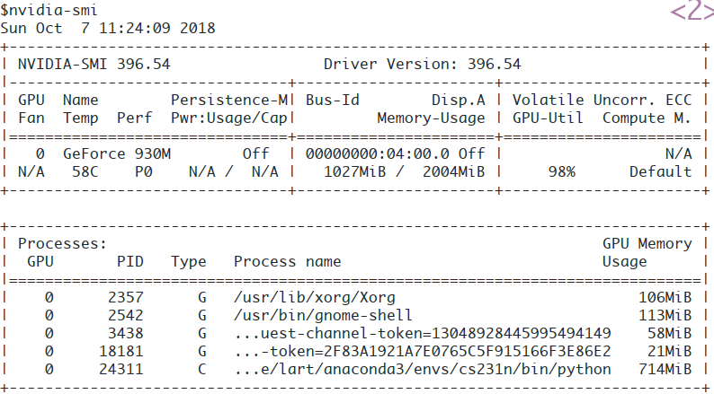

# 一些linux常识

## 关于开源许可证(默认最高版本)


## 几个配置文件

### 全局

* /etc/profile
  * 此文件为系统的每个用户设置环境信息, 全局(公有)配置, 不管是哪个用户, 登录时都会读取该文件
  * 当用户第一次登录时, 该文件被执行, 并从/etc/profile.d目录的配置文件中收集shell的设置
  * /etc/profile中设定的变量(全局)的可以作用于任何用户, 而~/.bashrc等中设定的变量(局部)只能继承/etc/profile中的变量, 他们是“父子”关系
* /etc/bashrc
  * 为每一个运行bash shell的用户执行此文件, 当bash shell被打开时, 该文件被读取
  * Ubuntu下没有此文件, 与之对应的是/etc/bash.bashrc, 它也是全局的；bash执行时, 不管是何种方式, 都会读取此文件

### 局部

* ~/.profile
  * 若bash是以**login方式**执行时, 读取`~/.bash_profile`
  * 若它不存在, 则读取`~/.bash_login`
  * 若前两者不存在, 读取`~/.profile`
  * 另外, <u>**图形模式**登录时, 此文件将被读取, 即使存在`~/.bash_profile` 和 `~/.bash_login`</u>

* ~/.bash_profile
  * 每个用户都可使用该文件输入专用于自己使用的shell信息, 当用户登录时, 该文件仅仅执行一次
  * 默认情况下, 它设置一些环境变量, 执行用户的`.bashrc`文件, 是**交互式、login方式**进入bash运行的, 通常二者设置大致相同, 所以通常前者会调用后者
* ~/.bash_login
  * bash是以**login方式**执行时, 读取`~/.bash_profile`
  * 若它不存在, 则读取`~/.bash_login`
  * 若前两者都不存在, 则读取`~/.profile`
* ~/.bash_profile
  * <u>Ubuntu默认没有此文件</u>, 可新建
  * 只有bash是以**login形式**执行时, 才会读取此文件
  * 通常该配置文件还会配置成去读取`~/.bashrc`
* ~/.bashrc
  * 该文件包含用于你的bash shell的bash信息, 当登录时以及每次打开新的shell时, 该文件被读取
  * 当bash是以**交互式、non-login**形式执行时, 读取此文件
* ~/.bash_logout
  * 当每次退出系统(退出bash shell)时, 执行该文件
  * **注销时, 且是login形式**, 此文件才会读取。<u>也就是说, 在文本模式注销时, 此文件会被读取, 图形模式注销时, 此文件不会被读取</u>

### 下面是在本机的例子

1. 图形模式登录时, 顺序读取：`/etc/profile`和`~/.profile`

2. 图形模式登录后, 打开终端时, 顺序读取：`/etc/bash.bashrc`和`~/.bashrc`

3. 文本模式登录时, 顺序读取：`/etc/bash.bashrc`, `/etc/profile`和`~/.bash_profile`

4. 从其它用户su到该用户, 则分两种情况：
   1. 如果带-l参数（或-参数, --login参数）, 如：su -l username, 则bash是login的, 它将顺序读取以下配置文件：`/etc/bash.bashrc`, `/etc/profile`和`~ /.bash_profile`.
   2. 如果没有带-l参数, 则bash是non-login的, 它将顺序读取：`/etc/bash.bashrc`和`~/.bashrc`

5. 注销时, 或退出su登录的用户, 如果是longin方式, 那么bash会读取：`~/.bash_logout`

6. 执行自定义的shell文件时, 若使用“bash -l a.sh”的方式, 则bash会读取行：`/etc/profile`和`~/.bash_profile`, 若使用其它方式, 如：bash a.sh,  ./a.sh, sh a.sh（这个不属于bash shell）, 则不会读取上面的任何文件.

7. 上面的例子凡是读取到`~/.bash_profile`的, 若该文件不存在, 则读取`~/.bash_login`, 若前两者不存在, 读取`~/.profile`.

## bash美化配置

> https://www.cnblogs.com/heqiuyu/articles/5624694.html

对于终端的美化,可以通过对PS1变量进行赋值来进行.奶牛查阅了一些资料,DIY了如下的效果:


分享下奶牛的修改方法:

```sh
vim .bashrc #添加下行
export PS1="Time:\[\033[1;35m\]\T     \[\033[0m\]User:\[\033[1;33m\]\u     \[\033[0m\]Dir:\[\033[1;32m\]\w\[\033[0m\]\n\$"
# 退出vim
source .bashrc
```

解释下具体含义:

颜色配置:

> \[\033[ 1 ; 31 m\]

* 底线 ：ANSI 色彩控制语法. \033 声明了转义序列的开始, 然后是 [ 开始定义颜色.
* 第一组数字 ：亮度 (普通0, 高亮度1, 闪烁2).
* 第二组数字 ：顏色代码.
* 颜色: 30=black 31=red 32=green 33=yellow 34=blue 35=magenta 36=cyan 37=white

> \[\033[0m\]

* 关闭 ANSI 色彩控制, 通常置于尾端.

显示内容配置:

* \a     ASCII响铃字符 (07)
* \d     “周 月 日”格式的日期
* \D{format}   参数format被传递给strftime(3)来构造自定格式的时间并插入提示符中；该参数为空时根据本地化设置自动生成格式.
* \e     ASCII转义字符（ESC) (033)
* \h     主机名在第一个点号前的内容
* \H     完全主机名
* \j     shell当前管理的任务数
* \l     shell终端设备的基本名称
* \n     新行
* \r     回车
* \s     shell的名称, $0的基本名称
* \t     当前时间（24小时） HH:MM:SS
* \T     当前时间（12小时） HH:MM:SS
* \@     当前时间（12小时） am/pm
* \A     当前时间（24小时） HH:MM
* \u     当前用户名称
* \v     bash版本(如"2.00")
* \V     bash版本+补丁号(如"2.00.0")
* \w     当前工作目录
* \W     当前工作目录的基本名称
* \!     该命令的历史数（在历史文件中的位置）
* \#     该命令的命令数（当前shell中执行的序列位置）
* \$     根用户为"#", 其它用户为"$"
* \nnn   8进制数
* \\     反斜杠
* \[     表示跟在后面的是非打印字符, 可用于shell的颜色控制
* \]     表示非打印字符结束

## [emacs] error: (error "Fontset `tty' does not exist")

```lisp
(cond ((display-graphic-p)
            (set-fontset-font ...)
                       ...                    )
           (t 0))
```


## dpkg

```sh
//查询deb包的详细信息, 没有指定包则显示全部已安装包
dpkg –l
dpkg -l |grep vim
//查看已经安装的指定软件包的详细信息
dpkg -s vim
//列出一个包安装的所有文件清单
dpkg -L vim
//查看系统中的某个文件属于那个软件包
dpkg -S vimrc
//所有deb文件的安装
dpkg -i
//所有deb文件的卸载
dpkg -r
//彻底的卸载, 包括软件的配置文件
dpkg -P
//查询deb包文件中所包含的文件
dpkg -c
//查看系统中安装包的的详细清单, 同时执行 -c
dpkg -L
```

## boot空间不足解决办法

> https://blog.csdn.net/qq_27818541/article/details/72675954

### 前言

在安装ubuntu的时候, 根据网上教程给其分配了单独的物理分区, 大小为200M. 然而每当系统升级的时候, 旧的内核版本并不会被清理, 升级几次就提示boot内存不足了. 思路就是卸载旧的版本内核, 腾出空间, 记录下自己尝试过的命令.

### 正常的删除步骤

1. 查看系统已经安装的内核版本

   > dpkg --get-selections | grep linux-image

   

2. 查看系统当前使用的内核版本(我的是`4.4.0-72-generic`)

   > uname -a

   

3. sudo apt purge linux-image-4.4.0-66-generic删除旧的内核版本(分别针对不同标识)

   * install`说明：系统已经安装了相应的内核, 使用purge命令删除相应的内核`

     > sudo apt purge linux-image-4.4.0-66-generic

     

   * deinstall`说明：系统没有安装此内核, 但是在配置文件中还残留它的信息（有可能是以前卸载的时候不彻底）`

     > sudo dpkg -P linux-image-extra-4.4.0-31-generic

     

4. 最后看下效果

   

### 执行过程中可能出现的错误以及解决办法

这个依据个人实际情况而定, 有的人按照上面的步骤就成功了. 如果出现错误请继续往下看.

1. 执行卸载命令**（sudo apt purge linux-image-4.4.0-66-generic）**时报错:
    ```shell
    正在读取软件包列表... 完成
    正在分析软件包的依赖关系树
    正在读取状态信息... 完成
    您可能需要运行“apt-get -f install”来纠正下列错误：
    下列软件包有未满足的依赖关系：
    linux-image-extra-4.4.0-66-generic : 依赖: linux-image-4.4.0-66-generic 但是它将不会被安装
    linux-image-extra-4.4.0-78-generic : 依赖: linux-image-4.4.0-78-generic 但是它将不会被安装
    linux-image-generic : 依赖: linux-image-4.4.0-78-generic 但是它将不会被安装
    E: 有未能满足的依赖关系. 请尝试不指明软件包的名字来运行“apt-get -f install”(也可以指定一个解决办法). 123456789
    ```

    修复办法:

    > 错误提示很明显了, 有的软件包缺少依赖关系, 建议我们修复.
    > 那我们就执行命令：**sudo apt -f install**

2. 执行修复命令（**sudo apt -f install**）时报错:

    ```shell
    正在读取软件包列表... 完成
    正在分析软件包的依赖关系树
    正在读取状态信息... 完成
     .......
    gzip: stdout: No space left on device
    E: mkinitramfs failure find 141 cpio 141 gzip 1
    update-initramfs: failed for /boot/initrd.img-4.4.0-75-generic with 1.
    run-parts: /etc/kernel/postinst.d/initramfs-tools exited with return code 1
    dpkg: 处理软件包 linux-image-extra-4.4.0-75-generic (--configure)时出错：
     子进程 已安装 post-installation 脚本 返回错误状态 1
    在处理时有错误发生：
     linux-image-extra-4.4.0-71-generic
     linux-image-extra-4.4.0-72-generic
     linux-image-extra-4.4.0-75-generic
    E: Sub-process /usr/bin/dpkg returned an error code (1)123456789101112131415
    ```

    解决办法：

    > gzip: stdout: No space left on device 这句话是说在/boot空间下没有足够的空间了. why?？？？
    >
    > 原因是这样：在修复的时候需要下载依赖包, 然而在/boot下本来就没有多余的空间了, 所以无法修复依赖的问题. 这就产生死循环了, 为了省出更多boot空间需要删除旧的内核, 删除旧的内核时又需要修复一些依赖, 修复依赖就需要下载依赖包, 而boot空间下本来就满了, （⊙ｏ⊙）…
    >
    > **解决办法**就是先把boot空间下几个比较大的文件暂存到别的文件夹, 腾出来足够的空间来修复依赖, 等依赖修复好了并且删除了旧的内核后再迁移回来（如果文件没什么用处就不用迁移回来了）.
    >
    > 修复好了, 再次执行卸载命令**（sudo apt purge linux-image-xxx）**, 把没用的旧内核都删掉, 一切都OK了.

## git排除大文件

```sh
find . -size +1G | cat >> .gitignore
```

> 大于号：将一条命令执行结果（标准输出, 或者错误输出, 本来都要打印到屏幕上面的）重定向其它输出设备（文件, 打开文件操作符, 或打印机等等）
>
> 小于号：命令默认从键盘获得的输入, 改成从文件, 或者其它打开文件以及设备输入
>
> `>>` 是追加内容
>
> `>` 是覆盖原有内容

## Nvidia-smi

> ​	watch -n -9 nvidia-smi
>
> 连续观察 0.1s刷新一次
>
> ​	export CUDA_VISIBLE_DEVICES=0 python test.py
>
> 表示运行test.py文件时, 使用编号为0的GPU卡
>
> ​	export CUDA_VISIBLE_DEVICES=0,2 python test.py
>
> 表示运行test.py文件时, 使用编号为0和2的GPU卡
>
> ---------------------
> 作者：shuangyumelody
> 来源：CSDN
> 原文：https://blog.csdn.net/qq_36427732/article/details/79017835?utm_source=copy
> 版权声明：本文为博主原创文章, 转载请附上博文链接！



上面的表格中：

*  第一栏的Fan：N/A是风扇转速, 从0到100%之间变动, 这个速度是计算机期望的风扇转速, 实际情况下如果风扇堵转, 可能打不到显示的转速. 有的设备不会返回转速, 因为它不依赖风扇冷却而是通过其他外设保持低温）.
*  第二栏的Temp：是温度, 单位摄氏度.
*  第三栏的Perf：是性能状态, 从P0到P12, P0表示最大性能, P12表示状态最小性能.
*  第四栏下方的Pwr：是能耗, 上方的Persistence-M：是持续模式的状态, 持续模式虽然耗能大, 但是在新的GPU应用启动时, 花费的时间更少, 这里显示的是off的状态.
*  第五栏的Bus-Id是涉及GPU总线的东西, domain:bus:device.function
*  第六栏的Disp.A是Display Active, 表示GPU的显示是否初始化.
*  第五第六栏下方的Memory Usage是显存使用率.
*  第七栏是浮动的GPU利用率.
*  第八栏上方是关于ECC的东西.
*  第八栏下方Compute M是计算模式.
*  下面一张表示每个进程占用的显存使用率.

**显存占用和GPU占用是两个不一样的东西**, 显卡是由GPU和显存等组成的, 显存和GPU的关系有点类似于内存和CPU的关系.

  ---------------------  本文来自 天岚1993_量产机 的CSDN 博客 , 全文地址请点击：https://blog.csdn.net/sallyxyl1993/article/details/62220424?utm_source=copy

## Ubuntu&Win双系统时间调整问题

在 Ubuntu 16.04 版本以前, 关闭UTC的方法是编辑/etc/default/rcS, 将UTC=yes改成UTC=no,  但在Ubuntu 16.04使用systemd启动之后, 时间改成了由timedatectl来管理, 所以更改方法是

```sh
timedatectl set-local-rtc 1 --adjust-system-clock
```

执行后重启Ubuntu, 应该就没有问题了.

2.修改 Windows对硬件时间的对待方式, 让 Windows把硬件时间当作UTC.

打开命令行程序, 在命令行中输入下面命令并回车

```bat
Reg add HKLM\SYSTEM\CurrentControlSet\Control\TimeZoneInformation /v RealTimeIsUniversal /t REG_DWORD /d 1
```

应该就没有问题了.

作者：滑稽

链接：https://www.zhihu.com/question/46525639/answer/157272414

来源：知乎

著作权归作者所有. 商业转载请联系作者获得授权, 非商业转载请注明出处.
