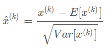
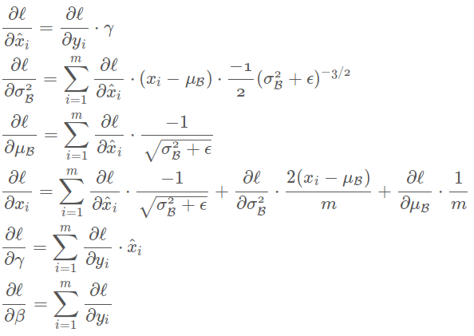

# BN-GoogLeNet

## 前言

2015年2月Google又发表了新的文章, 在googLeNet中加入一个[Batch-normalized](http://arxiv.org/abs/1502.03167)层。

Batch-normalized层归一化计算图层输出处所有特征图的平均值和标准差,并使用这些值对其响应进行归一化。这对应于“白化”数据非常有效,并且使得所有神经层具有相同范围并且具有零均值的响应。

这有助于训练,因为下一层不必学习输入数据中的偏移,并且可以专注于如何最好地组合特征。

## 新意

训练深度神经网络的复杂性在于,**每层输入的分布在训练过程中会发生变化**,因为前面的层的参数会发生变化。

通过要求*较低的学习率*和*仔细的参数初始化*减慢了训练,并且使具有饱和非线性的模型训练起来非常困难。我们将这种现象称为*内部协变量转移*,并通过标准化层输入来解决这个问题。

我们的方法力图使标准化成为模型架构的一部分,并为*每个训练小批量数据*执行标准化。

* 批标准化使我们能够使用**更高的学习率**,并且**不用太注意初始化**。

  在传统的深度网络中,学习率过高可能会导致梯度爆炸或梯度消失,以及陷入差的局部最小值。批标准化有助于解决这些问题。通过标准化整个网络的激活值,在数据通过深度网络传播时,它可以防止层参数的微小变化被放大。

  例如,这使sigmoid非线性更容易保持在它们的非饱和状态,这对训练深度sigmoid网络至关重要,但在传统上很难实现。

* 批标准化也使训练对参数的缩放更有弹性。

  通常,大的学习率可能会增加层参数的缩放,这会在反向传播中放大梯度并导致模型爆炸。然而,通过批标准化,通过层的反向传播不受其参数缩放的影响。实际上,对于标量a,.

  * ：标量不影响层的雅可比行列式，从而不影响梯度传播。
  * ：**更大的权重会导致更小的梯度**，并且批标准化会稳定参数的增长。

* 它也作为一个**正则化项**,在某些情况下**不需要Dropout**.

将批量标准化应用到最先进的图像分类模型上,批标准化在取得相同的精度的情况下,**减少了14倍的训练步骤**,并以显著的差距击败了原始模型。

## 构思

### 直接使用SGD存在的问题

使用SGD,训练将逐步进行,在每一步中,我们考虑一个大小为m的*小批量数据*$x_{1…m}$。通过计算$1/m∑_{m_i=1}∂ℓ(xi,Θ)/∂Θ​$,使用小批量数据来近似损失函数关于参数的梯度。

使用小批量样本,而不是一次一个样本,在一些方面是有帮助的。

* 首先,小批量数据的梯度损失是训练集上的梯度估计,其质量随着批量增加而改善。

* 第二,由于现代计算平台提供的并行性,对一个批次的计算比单个样本计算m次效率更高。

> 存在问题: 虽然随机梯度是简单有效的,但它需要仔细调整模型的超参数,特别是优化中使用的学习速率以及模型参数的初始值。
>
> 训练的复杂性在于**每层的输入受到前面所有层的参数的影响**——因此当网络变得更深时,网络参数的微小变化就会被放大。
>
> 层输入的分布变化是一个问题,因为这些层需要不断适应新的分布。

当一个学习系统的输入分布是变化的时,即训练集的样本分布和测试集的样本分布不一致,训练的模型就很难有较好的泛化能力. **当学习系统的输入分布发生变化时,据说会经历 协变量转移（Shimodaira,2000）。这通常是通过域适应（Jiang,2008）来处理的。**

然而,协变量漂移的概念可以扩展到整个学习系统之外,应用到学习系统的一部分,例如子网络或一层。

### 解决的方向

考虑网络计算$ ℓ=F_2(F_1(u,Θ_1),Θ_2)$,  $F_1$和$F_2$是任意变换, 学习参数 $Θ_1,Θ_2$, 以便最小化损失$ℓ$。

*学习$Θ_2$可以看作输入$x=F_1(u,Θ_1)$送入到子网络$ℓ=F_2(x,Θ_2)$。*

例如,梯度下降步骤
$$
Θ_2←Θ_2−α/m∑_{i=1m}∂F_2(x_i,Θ_2)/∂Θ_2
$$
（对于批大小m和学习率α）与输入为x的单独网络$F_2$完全等价。

因此,输入分布特性使训练更有效——例如训练数据和测试数据之间有相同的分布——也适用于训练子网络。

> 考虑固定输入分布

### 固定输入分布好处

1. 因此**x的分布在时间上保持固定是有利**的。然后,$Θ_2$不必重新调整来补偿x分布的变化。

2. 子网络输入的固定分布对于子网络外的层也有积极的影响。

   > 考虑一个激活函数为$g(x)=1/(1+exp(−x))$的层,u是层输入,权重矩阵W和偏置向量b是要学习的层参数,$g(x)=1/(1+exp(−x))$。
   >
   > 随着$|x|$的增加,$g′(x)$趋向于0。这意味着对于$x=Wu+b$的所有维度,除了那些具有小的绝对值之外,流向u的**梯度将会消失**,模型将缓慢的进行训练。
   >
   > 然而,由于**x受W,b和下面所有层的参数的影响**,训练期间那些参数的改变可能会将x的许多维度移动到非线性的饱和状态并减慢收敛。这个影响随着网络深度的增加而放大。
   >
   > 在实践中,饱和问题和由此产生的梯度消失通常通过使用**修正线性单元(Nair & Hinton, 2010) $ReLU(x)=max(x,0)$,仔细的初始化(Bengio & Glorot, 2010; Saxe et al., 2013)和小的学习率**来解决。
   >
   > 然而,如果我们能**保证非线性输入的分布在网络训练时保持更稳定,那么优化器将不太可能陷入饱和状态,训练将加速**。

### 解决方案--BN

由于训练过程中网络参数的变化,我们将*内部协变量转移*定义为网络激活分布的变化。消除它可以保证更快的训练。为了改善训练,我们寻求减少内部协变量转移的方法。固定层输入x的分布, 就是最直接的思路.

随着训练的进行,通过固定层输入x的分布,我们期望提高训练速度。众所周知(LeCun et al., 1998b; Wiesler & Ney, 2011)**如果对网络的输入进行白化,网络训练将会收敛的更快**——即输入线性变换为具有零均值和单位方差,并去相关。

> 输入x集中在0周围,sigmoid更可能在其未饱和区域,梯度相对更大一些,收敛更快。

**通过白化每一层的输入,我们将采取措施实现输入的固定分布,消除内部协变量转移的不良影响。**

我们提出了一种新的机制,我们称为**批标准化**,它是减少内部协变量转移的一个步骤,这样做可以显著加速深度神经网络的训练。

它通过标准化步骤来实现,标准化步骤**修正了层输入的均值和方差**。

* 批标准化**减少了梯度对参数或其初始值尺度上的依赖**, 对通过网络的梯度流动有好的影响, 这允许我们使用更高的学习率而没有发散的风险。
* 批标准化**使模型正则化**并减少了对Dropout(Srivastava et al., 2014)的需求。

* 批标准化通过**阻止网络陷入饱和模式**让使用饱和非线性成为可能。

### 实际尝试

我们考虑在每个训练步骤或在某些间隔来白化激活值,通过**直接修改网络或根据网络激活值来更改优化方法的参数**(Wiesler et al., 2014; Raiko et al., 2012; Povey et al., 2014; Desjardins & Kavukcuoglu)。

然而,如果这些修改分散在优化步骤中,那么梯度下降步骤可能会试图**以要求标准化进行更新的方式来更新参数**,这会降低梯度下降步骤的影响力。

> 例如,考虑一个层,其输入u加上学习到的偏置b,通过减去在训练集上计算的激活值的均值对结果进行归一化：$\hat{x} = x−E[x],x=u+b, X=x_{1…N}$是训练集上x值的集合,$E[x]=1/N∑^N_{i=1}x_i$。
>
> 如果梯度下降步骤忽略了$E[x]$对b的依赖,那它将更新$b←b+Δb$,其中$Δb∝−∂ℓ/∂\hat x$。
>
> 然后$u+(b+Δb)−E[u+(b+Δb)]=u+b−E[u+b]$。
>
> 因此,结合**b的更新**和接下来**标准化中的改变**会导致层的输出没有变化(原本带标准化的前向输出就是$u+(b+Δb)−E[u+(b+Δb)]=u+b−E[u+b]$),从而导致损失没有变化。
>
> 随着训练的继续,*b将无限增长而损失保持不变*。
>
> 如果标准化不仅中心化而且缩放了激活值,问题会变得更糟糕。
>
> > :question:
> >
> > 这里指的是对u的处理? 为什么会更糟?
>
> 我们在最初的实验中已经观察到了这一点,当标准化参数在梯度下降步骤之外计算时,模型会爆炸。

上述方法的问题是梯度下降优化没有考虑到标准化中发生的事实。

为了解决这个问题,我们希望确保对于任何参数值,网络*总是*产生具有所需分布的激活值。这样做将允许关于模型参数损失的梯度来解释标准化,以及它对模型参数Θ的依赖。

设x为层的输入,将其看作向量,X是这些输入在训练集上的集合。标准化可以写为变换$\hat x=Norm(x,X)$ . 它不仅依赖于给定的训练样本x而且依赖于所有样本X——它们中的每一个都依赖于Θ,如果x是由另一层生成的。

对于反向传播,我们将需要计算雅可比行列式$∂Norm(x,X)/∂x$ 和 $∂Norm(x,X)/∂X$；忽略后一项会导致上面描述的爆炸。

> :question:
>
> 为什么会略最后一项会导致梯度爆炸?

在这个框架中,白化层输入是昂贵的,因为它要求计算协方差矩阵$Cov[x]=E_{x∈X}[xx^T]−E[x]E[x]^T$和它的平方根倒数,从而生成白化的激活$Cov[x]^{−1/2}(x−E[x])$和这些变换进行反向传播的偏导数。

这促使我们寻求一种替代方案,**以可微分的方式执行输入标准化,并且在每次参数更新后不需要对整个训练集进行分析。**

以前的一些方法（例如（Lyu＆Simoncelli,2008））使用通过单个训练样本计算的统计信息,或者在图像网络的情况下,使用给定位置处不同特征图上的统计。然而,通过丢弃激活值绝对尺度改变了网络的表示能力。

我们希望通过对相对于整个训练数据统计信息的单个训练样本的激活值进行归一化来保留网络中的信息。

## 最终方案

由于每一层输入的整个白化是代价昂贵的并且不是到处可微分的,因此我们做了两个必要的简化。

### 简化白化: 零均值和单位方差

首先是我们将单独标准化每个标量特征,从而代替在层输入输出对特征进行共同白化,使其具有零均值和单位方差。对于具有d维输入$x=(x(1)…x(d))$的层,我们将标准化每一维

其中期望和方差在整个训练数据集上计算。如(LeCun et al., 1998b)中所示,这种标准化**加速了收敛**,即使特征没有去相关。

> 输入x集中在0周围,sigmoid更可能在其未饱和区域,梯度相对更大一些,收敛更快。

注意简单标准化层的每一个输入可能会改变层的表示能力。

例如,标准化sigmoid的输入会将它们约束到非线性的线性状态。

为了解决这个问题,我们要确保*插入到网络中的变换可以表示恒等变换*。

> :question:
>
> 为什么要这么保持?
>
> 标准化sigmoid的输入会将它们约束到非线性的线性状态 这句话什么意思?

为了实现这个,对于每一个激活值x(k),我们引入成对的参数γ(k),β(k),它们会归一化和移动标准化值：

这些参数与原始的模型参数一起学习,并恢复网络的表示能力。

实际上,通过设置, 我们可以重新获得原始的激活值,如果这是要做的最优的事。

### 简化白化: 小批量处理

每个训练步骤的批处理设置是基于整个训练集的,我们将使用整个训练集来标准化激活值。然而,当使用随机优化时,这是不切实际的。

因此,我们做了第二个简化：由于我们在随机梯度训练中使用**小批量**,*每个小批量产生每次激活平均值和方差*的估计。这样,用于标准化的统计信息可以完全参与梯度反向传播。

注意,通过**计算每一维的方差而不是联合协方差**,可以实现小批量的使用；在联合情况下,将需要正则化,因为小批量大小可能小于白化的激活值的数量,从而导致单个协方差矩阵。

### BN计算公式

### BN反向传播

> 因此,BN变换是将标准化激活引入到网络中的可微变换。这确保了在模型训练时,层可以继续学习输入分布,表现出更少的内部协变量转移,从而加快训练。
>
> 此外,应用于这些标准化的激活上的学习到的仿射变换**允许BN变换表示恒等变换并保留网络的能力**。

### 训练推断流程

### 加速BN网络

将批标准化简单添加到网络中不能充分利用我们方法的优势。为此，我们进行了以下修改：

* 提高学习率

  在批标准化模型中，我们已经能够从高学习率中实现训练加速，没有不良的副作用

* 删除dropout

  我们发现从BN-Inception中删除丢弃可以使网络实现更高的验证准确率。我们推测，批标准化提供了类似丢弃的正则化收益，因为对于训练样本观察到的激活受到了同一小批量数据中样本随机选择的影响

* *更彻底地搅乱训练样本*

  我们启用了分布内部搅乱训练数据，这样可以*防止同一个例子一起出现在小批量数据中*。

  这导致验证准确率提高了约1％，这与批标准化作为正则化项的观点是一致的：它每次被看到时都会影响一个样本，在我们的方法中内在的随机化应该是最有益的。

* *减少L2权重正则化*

  虽然在Inception中模型参数的L2损失会控制过拟合，但在修改的BN-Inception中，损失的权重减少了5倍。我们发现这提高了在提供的验证数据上的准确性。

* *加速学习率衰减*

  在训练Inception时，*学习率呈指数衰减*。因为我们的网络训练速度比Inception更快，所以我们将学习速度降低加快6倍。

* *删除局部响应归一化*

  虽然Inception和其它网络（Srivastava等人，2014）从中受益，但是我们发现使用批标准化它是不必要的。

* *减少光照扭曲*

  因为批标准化网络训练更快，并且观察每个训练样本更少的次数，所以通过更少地扭曲它们，我们让训练器关注更多的“真实”图像。