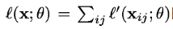
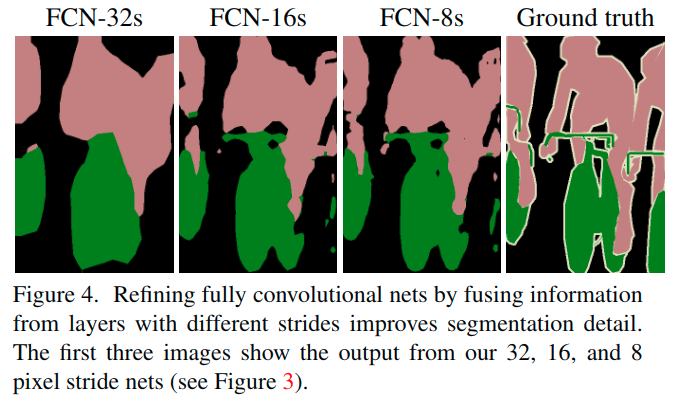
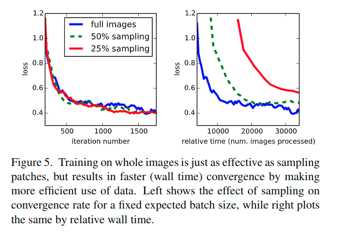
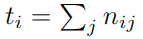

# FCN总结

## 前言

我们展示了卷积网络本身, 经过端到端像素像素的训练, 超过了语义分割的最新水平。

我们的主要见解是**建立“完全卷积”网络**，它可以输入任意大小的数据，并通过有效的推理和学习产生相应大小的输出。

我们**定义和详细说明完全卷积网络空间**，解释它们在空间密集预测任务中的应用，并且绘制与先前模型的连接。

我们将当代分类网络（AlexNet [19]，VGG网络[31]和GoogLeNet [32]）适应于完全卷积网络，并通过微调[4]将它们的学习表示**迁移到分割任务**。

然后，我们定义一种新颖的架构，它**将来自深层粗略层的语义信息与来自浅的细致层的外观信息相结合**，以生成准确和详细的分割。我们的完全卷积网络实现了PASCAL VOC（2012年相对于平均IU提高20％至2012年平均IU为62.2％），NYUDv2和SIFT Flow的最先进的分割，而对于典型图像，推断的推理时间不到0.2秒钟。

> 初看引导:
>
> 1. 要解决什么问题？
>
> 2. - 使用深度学习解决图像分割问题。
>
> 3. 用了什么方法解决？
>
> 4. - 使用图像分类模型（如AlexNet VGGNet等pre-trained model）做迁移学习。
>     - 使用转置卷积结构做dense prediction。
>     - 使用skip layer提高精度。
>
> 5. 效果如何？
>
> 6. - 在VOC数据集上，mean IU达到了62.2%，比之前的最优方法提高了20个百分点。
>     - 每张图片的处理时间只需要0.2s。
>
> 7. 还存在什么问题？
>
> 8. - 本文是深度学习解决图像分割问题的开山之作，提出了一种新的思路，但年代久远，效果一般。
>     - 对细节不敏感，没有充分考虑像素之间的关系，缺乏空间一致性。

## 背景

卷积网络正在推动识别上的优势.卷积网络正在推动识别。Convnets不仅改进了整体图像分类[19,31,32]，而且在具有结构化输出的局部任务上取得了进展。这些包括边界框对象检测[29,12,17]，部分和关键点预测[39,24]以及局部对应[24,9]方面的进展。

从粗糙到细致推理的下一步自然是对每个像素进行预测。先前的方法已经将卷积网络用于语义分割[27,2,8,28,16,14,11]，其中**每个像素用其封闭对象或区域的类标记**，但是具有一些缺点,而我们的工作却解决了这个。

> 完全卷积网络可以有效地学习如像语义分割一样对像素任务进行密集预测。

* 我们展示了一个完全卷积网络（FCN），在语义分割上进行端到端, 像素到像素训练，超过了最新的技术水平，而无需其他机器。

    据我们所知，**这是第一项针对像素点预测和监督学习的进行端到端训练FCNs的工作.**

    现有网络的完全卷积版本**预测来自任意大小输入的密集输出**。

    学习和推理都是通过密集的前馈计算和反向传播在整个图像上进行的。网络内部上采样层通过Pooling实现网络中的像素预测和学习。这种方法是有效的，无论是渐近的还是绝对的，并且不需要其他工作中的复杂性。

    分批训练是常见的[27,2,8,28,11]，但缺乏完全卷积训练的效率。我们的方法不利用预处理和后处理的复杂性，包括超像素[8,16]，建议[16,14]，或随机场或局部分类的事后补充[8,16]。

* 我们的模型通过将分类网络重新解释为完全卷积, 和从他们学习的表示中进行微调, 来将分类中最近的成功[19,31,32]转化为密集预测。相比之下，之前的作品在没有受过监督的预训练的情况下应用了小型卷积网络[8,28,27]。

* 语义分割面临语义和位置之间固有的紧张关系：全局信息解决了局部信息在何处解决的问题(Semantic segmentation faces an inherent tension between semantics and location: global information resolves what while local information resolves where)。

    深度要素层次结构共同编码局部全局金字塔中的位置和语义。我们定义了一种新颖的“跳过”架构，将4.2节的深度粗糙的语义信息和浅的细致的外观信息结合起来（见图）。

    

## 新意

### 完全卷积网络

### 上采样

是一种向后步进的卷积. 

另一汇总关联粗略的输出到密集像素的方法是插值(interpolation), 例如简单的双线性插值等等.

从某种意义来讲, 采用因子为f的上采样就是一种分数步进(stride = 1/f < 1)的卷积, 只要f是一个整数, 也就是, 有着输出stride为f的反向卷积(backwards convolution/deconvolution).

这样的操作很容易实现,因为他只是简单的交换了卷及操作的前后向传递.

反向卷积的滤波器并不需要被固定, 它可以被学习得到. 一个反向卷积层和激活函数的堆叠, 甚至可以学习一个非线性的上采样.

在我们的实验中, 上采样对于学习密集预测, 表现的快速有效. 我们最好的分割架构使用了这些层来学习上采样来优化预测.

### Skip layer

## 构思

### 其他人的工作

完全卷积网络据我们所知，Matan等人首先提出了将一个卷积网络扩展到任意大小(arbitrary-sized)的输入的想法。

* [25]它扩展了经典的LeNet [21]以识别数字串。因为他们的网络仅限于一维输入字符串，Matan等人使用Viterbi解码来获得它们的输出。

* 沃尔夫和普拉特[37]将卷积网络的输出扩展为邮政地址块四个角的检测分数的二维图。

这两个历史工作都是**为了检测而进行推理和学习的完全卷积**。

* 宁等人[27]利用完全卷积推理对线虫组织的粗多类分割定义了一个网络。

* Sermanet等人的滑动窗口检测[29]
* Pinheiro和Collobert [28]的语义分割
* Eigen等人的图像恢复.
* [5]做完全卷积推理。

**完全卷积训练是很少见的**。

* 但是Tompson等人有效地使用[35]来学习端到端的部件检测器和姿态估计的空间模型，尽管他们不解释或分析这种方法。

或者

* He等人[17]丢弃分类网络的非卷积部分来制作特征提取器。他们将建议和空间金字塔聚合合并在一起，以产生一个用于分类的局部的固定长度的特征。虽然快速有效，但这种混合模式无法端到端学习。

**用卷积网络的密集预测**。

* 最近的一些作品已经将密码学应用于密集预测问题，其中包括Ning等人的语义分割[27]，Farabet et al[8]，Pinheiro和Collobert [28]
* Ciresan等人对电子显微镜的边界预测[2]
* Ganin和Lempitsky的混合神经网络/最近邻模型的自然图像[11]边界预测。
* Eigen等人的图像恢复和深度估计[5，6]。

这些方法的共同要素包括以下几点：

* 限制容量和感受野的小模型; 
* 拼凑式训练(patchwise training)[27,2,8,28,11]; 
* 超像素投影/随机场正则化/滤波/局部分类后处理[8,2,11]; 
* OverFeat [29]介绍的对于密集输出[28,11]的输入移位和输出交错; 
* 多尺度金字塔处理[8,28,11]; 
* 饱和tanh非线性激活函数[8,5,28];
* 集成方法(Ensemble Method)[2，11]，

而我们的方法没有这个机制。但是，我们从**FCN的角度来研究拼凑式训练和“移位-拼接(shift-and-stitch)”密集输出**。我们还**讨论了网络内上采样**.

* 而Eigen等人全连接预测[6]是这种情况一个特例。

与现有的方法不同，我们适应并扩展了深度分类架构, 使用图像分类作为监督式预训练，并完全卷积式的微调, 以便从整个图像输入和整个图像真是标签中简单而有效地进行学习。

* Hariharan等人[16]和Gupta等人[14]同样将深层分类网络适用于语义分割，但是在混合建议分类模型(hybrid proposal-classifier models)中也是如此。

这些方法微调一个R-CNN系统, 通过为检测/语义分割/实例分割(detection, semantic segmentation, and instance segmentation)进行采样边界框 和/或 区域建议。

**这两种方法都不是端对端学习的。**

### 一些分析

Convnets建立在平移不变性(translation invariance)的基础上。它们的基本组件（卷积，汇聚和激活函数）在局部输入区域上运行，并且仅依赖于相对空间坐标。为特定层中的(i,j)位置处的数据矢量写入xij，并为下一层写入yij，这些函数通过以下方式计算输出yij：

其中k是核大小,s是步长或者采样因子.f决定了层的类型:卷积,汇聚(平均,空间最大,最大),非线性激活等等操作.

这种函数形式在这种组合下维护，内核大小和步幅服从转换规则.

> 这是什么玩意?

虽然一般深网络计算一般非线性函数，但只有这种形式的层的网络计算非线性滤波器，我们称之为深层滤波器或完全卷积网络。

> 一般非线性函数是什么?
>
> (While a general deep net computes a general nonlinear function, a net with only layers of this form computes a nonlinear filter)?

FCN自然地对任何大小的输入进行操作，并产生相应的（可能重新采样的）空间维度的输出。

一个由FCN组成的实值损失函数定义一个任务。如果损失函数是最终层的空间维数的总和，, 它的梯度将是每个空间分量梯度的总和。因此，在整幅图像上计算出l的随机梯度下降与l'上的随机梯度下降相同，将最后一层所有的感受野作为一个小批次。

当这些接收域显著重叠(overlap significantly)时，在整个图像上逐层计算而不是独立地逐个补丁时，前馈计算和反向传播都更加高效。

> 为什么会更加高效?

典型的识别网络，包括LeNet [21]，AlexNet [19]及其更深层次的继承者[31,32]，表面上采用固定大小的输入并产生非空间输出。这些网的完全连接层**具有固定尺寸并丢弃空间坐标**。然而，**这些完全连接的层也可以被视为与覆盖整个输入区域的内核的卷积**。这样做将它们转换为完全卷积网络，可以输入任意大小和输出分类图。

> 将完全连接的层转换成卷积层使分类网络能够输出热图。添加图层和空间损失（如图1所示）为端到端密集学习提供了一个有效的工具。

此外，虽然得到的结果图相当于对特定输入补丁的原始网络的评估，计算量在这些补丁的重叠区域高度分摊。

例如，尽管AlexNet需要1.2 ms（在典型的GPU上）产生227x227图像的分类得分，但完全卷积版本需要22 ms来从500x500图像产生10x10网格输出，速度比原始方法提高了5倍以上。

> Assuming efficient batching of single image inputs. The classification scores for a single image by itself take 5.4 ms to produce, which is nearly 25 times slower than the fully convolutional version.
>
> 假定一个有效的单图输入, 单个图像的分类评分本身需要5.4 ms才能生成, 这几乎是比全卷积版本慢了25倍.
>
> 怎么理解?

**这些卷积模型的空间输出映射使它们成为像语义分割这样的密集问题的自然选择**。在每个输出单元都有真实标签情况下，前向和后向通道都很直接，并且都利用了卷积固有的计算效率(take advantage of the inherent computational efficiency)（和积极的优化）。

尽管我们将分类网络重新解释为完全卷积产生任意大小输入的输出映射，但输出维度通常通过下采样来减少。分类网络下采样以保持滤波器的小型化和计算要求的合理性。这会粗化这些网络的完全卷积版本的输出，将其从输入大小减小一个等于输出单元的接收字段的像素跨度的因子。

### Shift-and-stitch is filter rarefaction(实在不知道怎么翻译)

通过OverFeat引入的输入移位和输出交错(Input shifting and output interlacing)是一种技巧，可以从粗略输出产生密集预测而无需插值.

如果以f为下采样因子，则输入向右（左侧和顶部填充）移动x个像素，向下移动y个像素，每个(x, y)值处理一次。

这些fxf个输入每个都通过convnet运行，并且输出交错，以便预测对应于其接受场中心的像素。

只更改滤波器和图层跨度可以产生与此Shift-and-stitch技巧相同的输出。考虑一个具有输入步幅s的图层（卷积或合并），以及一个带滤波器权重fij的后续卷积图层（删除特征尺寸，这里与此无关）。将低层的输入步幅设置为1，通过上采样因子s来采样输出，就像Shift-and-stitch一样。然而，将原始滤波器与上采样输出进行卷积并不会产生与这个技巧相同的结果，因为原始滤波器只能看到其（现在上采样）输入的缩减部分。

为了重现这个技巧，通过吧滤波器扩大为如下形式,来稀疏滤波器.

> 这里的i,j都是从0开始.
>
> 空洞卷积?

重新产生基于这个点子(包括重复这个逐层增大的滤波器直到所有的下采样被移除)的整个网络的输出.

简单的减少网络内部的下采样是一种权衡: 这些滤波器可以看到更为细致的一些信息, 但是有更小的感受野和更长的时间去计算.

> 空洞卷积不是扩大了感受野么?

尽管我们已经做了使用了shift-and-stitch初始的实验, 但是并没有用在我们的模型里.我们发现通过上采样学习, 正如后面描述的, 是更为有效的和有效率的, 尤其是与跳跃层融合进行组合的时候.

在随机优化中，梯度计算是由训练分布支配的。

patchwise 训练和全卷积训练能被用来产生任意分布，尽管他们相对的计算效率依赖于重叠域和minibatch的大小。在由所有单元的感受野组成的每一个批次, 基于一幅图的损失之下（或图像的集合）, 整张图像的全卷积训练等同于patchwise训练。

> https://stats.stackexchange.com/questions/266075/patch-wise-training-and-fully-convolutional-training-in-fully-convolutional-neur
>
> Basically, fully convolutional training takes the whole MxM image and produces outputs for all subimages in a **single ConvNet forward pass**. 
>
> Patchwise training explicitly crops out the subimages and produces outputs for each subimage in **independent forward passes**. 
>
> Therefore, fully convolutional training is usually substantially faster than patchwise training.
>
> So, for fully convolutional training, you make updates like this:
>
> 1. Input whole MxM image (or multiple images)
> 2. Push through ConvNet -> get an entire map of outputs (maximum size MxM per image, possibly smaller)
> 3. Make updates using the loss of all outputs
>
> Now while this is quite fast, it **restricts** your training sampling process compared to patchwise training: You are forced to make a lot of updates **on the same image** (actually, all possible updates for all subimages) during one step of your training. 
>
> That's why they write that fully convolutional training is only identical to patchwise training, if each receptive field (aka subimage) of an image is contained in a training batch of the patchwise training procedure (for patchwise training, you also could have two of ten possible subimages from image A, three of eight possible subimages from image B, etc. in one batch). Then, they argue that by not using all outputs during fully convolutional training, you get closer to patchwise training again (since you are not making all possible updates for all subimages of an image in a single training step). However, you waste some of the computation. Also, in Section 4.4/Figure 5, they describe that making all possible updates works just fine and there is no need to ignore some outputs.

尽管这种方式比对补丁的均匀取样更加高效，但它减少了可能的批次数量。然而在一张图片中进行随机选择, 可能更容易被重新找到。限制基于它的空间位置随机取样子集产生的损失（或者可以说应用输入和输出之间的DropConnect mask [https://www.cnblogs.com/tornadomeet/p/3430312.html 类似于dropout的一种操作] ）排除来自梯度计算的patches。

如果保存下来的patches依然有重要的重叠，全卷积计算依然将加速训练。如果梯度在多次反向传播中被积累，batches能包含来自几张图的patches。patcheswise训练中的采样能纠正分类失衡 [30,9,3] 和减弱dense patches空间相关性[31,17]。在全卷积训练中，分类平衡也能通过给损失赋权重实现，对损失采样能被用来解决空间相关性问题。

patchwise training在实验中发现并没有产生更好的效果, 对于密集预测而言. 整图预测是更为有效和有效率的.

我们将ILSVRC分类器投射到FCN中，并通过网内上采样和像素级别的损失来增强它们的密集预测。我们通过fine-tuning训练细分。

接下来，我们构建了一个新的跳过架构，它结合了粗糙，语义和局部的外观信息来重新预测

## 架构

1. 基于AlexNet以及VGG(16/19在这个任务上差别不大), GoogLeNet(对于GoogLeNet，我们仅使用最终损失层，并通过丢弃最终平均池层来提高性能)
2. 丢弃最终分类器层来处理每个网络，并转换所有全连接层为卷积层
3. 为每个PASCAL类别, 在每个粗糙的输出定位, **添加了一个1x1x21的卷积层**来预测得分, 并跟随了**一个转置卷积层**来实现双线性上采样粗糙的输出到像素密集输出

从分类到分割的微调为每个网络提供了可靠的预测。甚至最糟的模型都可以实现大约百分之七十五的卓越表现.

我们为分割定义了一个新的完全卷积网络（FCN），它结合了特征层次结构的各层并改善了输出的空间精度。

> 
>
> https://blog.csdn.net/u014593748/article/details/71698246

虽然完全卷积分类器可以微调到以适应分割任务，甚至在标准度量上得分很高，但它们的输出却不满意.

> 过融合来自不同步长层的信息来完全卷积网络改善了分割细节。前三张图像显示了我们的32,16和8像素跨步的输出

我们通过添加链接来解决这个问题，这些链接将最终预测层与较低层相结合。

将线拓扑转换为DAG，其边缘从较低层跳到较高层（图3）。由于他们看到的像素较少，精细尺度预测应该只需要较少的图层，因此从较浅的输出中制作它们是有意义的。

组合细致层和粗糙层让模型进行局部预测，从而尊重全局结构。

通过类似于Florack等人的the multiscale local jet， [10]，我们称我们的非线性局部特征层次为 the deep jet。

* 我们首先通过预测16像素跨度层来将输出跨度减半。

* 我们在pool4的顶部添加一个1x1卷积层来产生额外的类别预测。
* 我们通过添加2x上采样层和求和两种预测, 将此输出与在步幅32的conv7顶部（卷积化的fc7）上计算的预测相融合。
* 我们将2x上采样初始化为双线性插值，但允许按照3.3节所述学习参数。
* 最后，在跨步16的上采样上预测图像。我们称之为FCN-16s。

FCN-16是端到端学习的，用一个更粗糙的网络（我们现在称为FCN-32s）的参数进行初始化。作用于pool4的新参数是零初始化的，因此网络以未经修改的预测开始。

学习率降低了100倍。

这个效果的改进是很明显的.可以从上图中看到.之后又进行了进一步的调整.得到了FCN-8s.效果越来越好.	

我们获得了62.7 mean IU的小幅进一步改善，并且发现我们的输出的平滑性和细节略有改善

此时可以看出，我们的融合改进已经面临了收益递减(diminishing returns)，无论是在强调大规模正确性的IU度量方面，还是在可见性方面. 所以我们不会继续融合更低层。

尝试其他方法.

通过减少stride of pooling是获得更为细致的预测的直接方法. 但是，对于我们基于VGG16的网络来说，这样做是有问题的。将pool5图层设置为步幅1要求我们的卷积化fc6具有14x14的大小的滤波器以保持其感受野大小。除了计算成本之外，我们难以学习如此大的滤波器。我们尝试用较小的过滤器重新构建pool5上的层，但未能实现可比较的性能;一种可能的解释是上层使用ImageNet训练的权重来初始化非常重要。

获得更好预测的另一种方法是使用shift-and-stitch技巧。在有限的实验中，我们发现这种方法对于成本的提升率比层融合更差。

### 优化

* SGD with momentum 0.9
* minibatch = 20
* lr = 1e-3, 1e-4, 5^(-5) for FCN-AlexNet, FCN_VGG16 and FCN-GoogLeNet 线性搜索更新.
* weight decay of 5^(-4) or 2^(-4)
* 将bias学习率加倍
* 0初始化卷积层类得分, 寻找随机初始化以产生更好的性能和更快的收敛性
* Dropout 被使用在初始分类网络

### 微调

* 我们通过全网反向传播对所有图层进行微调
* 单独对输出分类器进行微调只会产生完整的网络性能的70％
* 考虑到学习基本分类网所需的时间，从头开始(from scratch)训是不可行的(Note that the VGG net is trained in stages, while we initialize from the full 16-layer version. 分段训练, 从完整的16层版本进行了初始化)
* 对于粗糙的FCN-32版本，在单个GPU上进行微调需要三天，每个版本需要一天左右升级到FCN-16和FCN-8s版本。

### Patch抽样

* 我们发现，与整幅图像训练相比，**采样对收敛速度没有显着影响，但由于每批需要考虑更多数量的图像，因此花费的时间会显着增加**。
* 因此，我们在其他实验中选择未采样的整体图像训练。

### 类别平衡

卷积训练可以通过对损失进行加权或抽样来平衡类别。虽然我们的标签是轻微不平衡的（大约3/4是背景），但我们发现课堂平衡是不必要的。

### 密集预测

* 通过网络内的反向卷积层将分数上采样到输入维度。

* 最终层反向卷积滤波器固定为双线性插值, 而中间上采样层初始化为双线性上采样，然后学习。
* 不使用shift-and-stitch或滤波器稀疏等效。

### 数据增强

我们试图通过随机镜像和“抖动”图像，通过将图像转化为每个方向上的32像素（最粗糙的预测尺度）来增强训练数据。

这没有得到明显的改善。

### 更多数据

使用了更多的训练数据.

### 实现

所有模型都经过Caffe训练和测试，使用单个NVIDIA Tesla K40c。

## 测试

### 度量指标

我们报告了来自常见语义分割和场景分析评估的四个度量标准，这些评估是关于像素精度和区域交集的变化。设nij为预测属于类j的第i类像素的数量，其中有ncl个不同的类别，令第i类像素的总数。我们计算：

