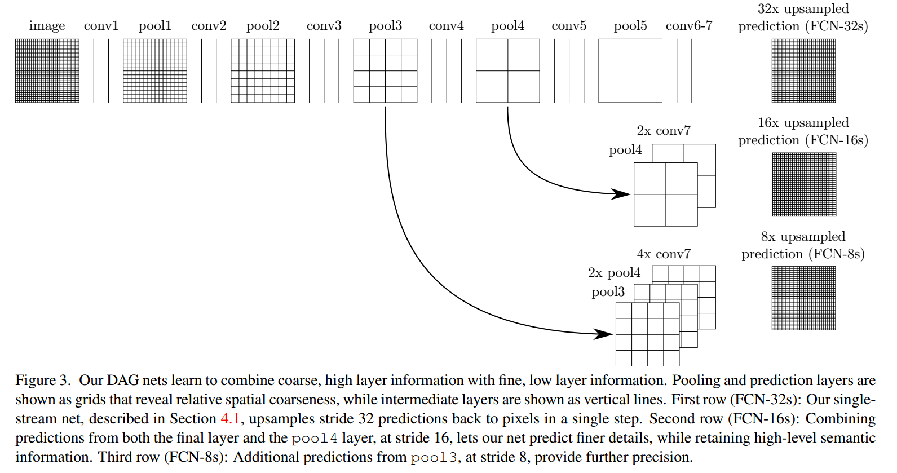

# FCN总结

## 前言

我们展示了卷积网络本身, 经过端到端像素像素的训练, 超过了语义分割的最新水平。

我们的主要见解是**建立“完全卷积”网络**，它可以输入任意大小的数据，并通过有效的推理和学习产生相应大小的输出。

我们**定义和详细说明完全卷积网络空间**，解释它们在空间密集预测任务中的应用，并且绘制与先前模型的连接。

我们将当代分类网络（AlexNet [19]，VGG网络[31]和GoogLeNet [32]）适应于完全卷积网络，并通过微调[4]将它们的学习表示**迁移到分割任务**。

然后，我们定义一种新颖的架构，它**将来自深层粗略层的语义信息与来自浅的细致层的外观信息相结合**，以生成准确和详细的分割。我们的完全卷积网络实现了PASCAL VOC（2012年相对于平均IU提高20％至2012年平均IU为62.2％），NYUDv2和SIFT Flow的最先进的分割，而对于典型图像，推断的推理时间不到0.2秒钟。

> 初看引导:
>
> 1. FCN主要提出的针对任务是图像分割任务?
> 2. 图像分割任务的流程/评判标准?
> 3. FCN的主要优势是可以输入任意大小的数据. 
> 4. 如何"有效的推理和学习产生相应大小的输出"?
> 5. 如此设计的动机/启发?
> 6. FCN的未来?

## 背景

卷积网络正在推动识别上的优势.卷积网络正在推动识别。Convnets不仅改进了整体图像分类[19,31,32]，而且在具有结构化输出的局部任务上取得了进展。这些包括边界框对象检测[29,12,17]，部分和关键点预测[39,24]以及局部对应[24,9]方面的进展。

从粗糙到细致推理的下一步自然是对每个像素进行预测。先前的方法已经将卷积网络用于语义分割[27,2,8,28,16,14,11]，其中**每个像素用其封闭对象或区域的类标记**，但是具有一些缺点,而我们的工作却解决了这个。

> 完全卷积网络可以有效地学习如像语义分割一样对像素任务进行密集预测。

* 我们展示了一个完全卷积网络（FCN），在语义分割上进行端到端, 像素到像素训练，超过了最新的技术水平，而无需其他机器。

    据我们所知，**这是第一项针对像素点预测和监督学习的进行端到端训练FCNs的工作.**

    现有网络的完全卷积版本**预测来自任意大小输入的密集输出**。

    学习和推理都是通过密集的前馈计算和反向传播在整个图像上进行的。网络内部上采样层通过Pooling实现网络中的像素预测和学习。这种方法是有效的，无论是渐近的还是绝对的，并且不需要其他工作中的复杂性。

    分批训练是常见的[27,2,8,28,11]，但缺乏完全卷积训练的效率。我们的方法不利用预处理和后处理的复杂性，包括超像素[8,16]，建议[16,14]，或随机场或局部分类的事后补充[8,16]。

* 我们的模型通过将分类网络重新解释为完全卷积, 和从他们学习的表示中进行微调, 来将分类中最近的成功[19,31,32]转化为密集预测。相比之下，之前的作品在没有受过监督的预训练的情况下应用了小型卷积网络[8,28,27]。

* 语义分割面临语义和位置之间固有的紧张关系：全局信息解决了局部信息在何处解决的问题(Semantic segmentation faces an inherent tension between semantics and location: global information resolves what while local information resolves where)。

    深度要素层次结构共同编码局部全局金字塔中的位置和语义。我们定义了一种新颖的“跳过”架构，将4.2节的深度粗糙的语义信息和浅的细致的外观信息结合起来（见图）。

    

## 新意

### 完全卷积网络

#### 其他人的工作

完全卷积网络据我们所知，Matan等人首先提出了将一个卷积网络扩展到任意大小(arbitrary-sized)的输入的想法。

* [25]它扩展了经典的LeNet [21]以识别数字串。因为他们的网络仅限于一维输入字符串，Matan等人使用Viterbi解码来获得它们的输出。

* 沃尔夫和普拉特[37]将卷积网络的输出扩展为邮政地址块四个角的检测分数的二维图。

这两个历史工作都是**为了检测而进行推理和学习的完全卷积**。

* 宁等人[27]利用完全卷积推理对线虫组织的粗多类分割定义了一个网络。

* Sermanet等人的滑动窗口检测[29]
* Pinheiro和Collobert [28]的语义分割
* Eigen等人的图像恢复.
* [5]做完全卷积推理。

**完全卷积训练是很少见的**。

* 但是Tompson等人有效地使用[35]来学习端到端的部件检测器和姿态估计的空间模型，尽管他们不解释或分析这种方法。

或者

* He等人[17]丢弃分类网络的非卷积部分来制作特征提取器。他们将建议和空间金字塔聚合合并在一起，以产生一个用于分类的局部的固定长度的特征。虽然快速有效，但这种混合模式无法端到端学习。

**用卷积网络的密集预测**。

* 最近的一些作品已经将密码学应用于密集预测问题，其中包括Ning等人的语义分割[27]，Farabet et al[8]，Pinheiro和Collobert [28]
* Ciresan等人对电子显微镜的边界预测[2]
* Ganin和Lempitsky的混合神经网络/最近邻模型的自然图像[11]边界预测。
* Eigen等人的图像恢复和深度估计[5，6]。

这些方法的共同要素包括以下几点：

* 限制容量和感受野的小模型; 
* 拼凑式训练(patchwise training)[27,2,8,28,11]; 
* 超像素投影/随机场正则化/滤波/局部分类后处理[8,2,11]; 
* OverFeat [29]介绍的对于密集输出[28,11]的输入移位和输出交错; 
* 多尺度金字塔处理[8,28,11]; 
* 饱和tanh非线性激活函数[8,5,28];
* 集成方法(Ensemble Method)[2，11]，

而我们的方法没有这个机制。但是，我们从**FCN的角度来研究拼凑式训练和“移位-拼接(shift-and-stitch)”密集输出**。我们还**讨论了网络内上采样**.

* 而Eigen等人全连接预测[6]是这种情况一个特例。

与现有的方法不同，我们适应并扩展了深度分类架构, 使用图像分类作为监督式预训练，并完全卷积式的微调, 以便从整个图像输入和整个图像真是标签中简单而有效地进行学习。

* Hariharan等人[16]和Gupta等人[14]同样将深层分类网络适用于语义分割，但是在混合建议分类模型(hybrid proposal-classifier models)中也是如此。

这些方法微调一个R-CNN系统, 通过为检测/语义分割/实例分割(detection, semantic segmentation, and instance segmentation)进行采样边界框 和/或 区域建议。

**这两种方法都不是端对端学习的。**

### 详细构造

Convnet中的每一层数据都是尺寸为h×w×d的三维数组，其中h和w是空间维度，d是特征或通道维度。第一层是图像，像素大小hxw，以及d个颜色通道。更高层的位置对应于它们路径连接的图像中的位置，称为它们的感受野。

Convnets建立在平移不变性(translation invariance)的基础上。它们的基本组件（卷积，汇聚和激活函数）在局部输入区域上运行，并且仅依赖于相对空间坐标。为特定层中的(i,j)位置处的数据矢量写入xij，并为下一层写入yij，这些函数通过以下方式计算输出yij：

其中k是核大小,s是步长或者采样因子.f决定了层的类型:卷积,汇聚(平均,空间最大,最大),非线性激活等等操作.

这种函数形式在这种组合下维护，内核大小和步幅服从转换规则.

> 这是什么玩意?

虽然一般深网络计算一般非线性函数，但只有这种形式的层的网络计算非线性滤波器，我们称之为深层滤波器或完全卷积网络。

> 一般非线性函数是什么?
>
> (While a general deep net computes a general nonlinear function, a net with only layers of this form computes a nonlinear filter)?

FCN自然地对任何大小的输入进行操作，并产生相应的（可能重新采样的）空间维度的输出。

