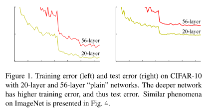

# ResNet

## 前言

2015年12月[ResNet](https://arxiv.org/pdf/1512.03385v1.pdf)发表了，时间上大概与Inception v3网络一起发表的。

## 概要

更深的神经网络更难训练。我们提出了一种残差学习框架来减轻网络训练，这些网络比以前使用的网络更深。我们明确地**将层变为学习关于层输入的残差函数，而不是学习未参考的函数**。我们提供了全面的经验证据说明这些**残差网络很容易优化，并可以显著增加深度来提高准确性**。在ImageNet数据集上我们评估了深度高达152层的残差网络——比VGG[40]深8倍但仍具有较低的复杂度。

## 构思

### 深度

深度网络自然地将低/中/高级特征[49]和分类器以端到端多层方式进行集成，特征的“级别”可以通过堆叠层的数量（深度）来丰富。

> 在深度重要性的推动下，出现了一个问题：学些更好的网络是否像堆叠更多的层一样容易？

### 收敛

回答这个问题的一个障碍是**梯度消失/爆炸[14, 1, 8]**这个众所周知的问题，它从一开始就阻碍了收敛。然而，这个问题**通过标准初始化[23, 8, 36, 12]和中间标准化层[16]**在很大程度上已经解决，这使得数十层的网络能通过具有反向传播的随机梯度下降（SGD）开始收敛。

> 当更深的网络能够开始收敛时，暴露了一个退化问题：随着网络深度的增加，准确率达到饱和（这可能并不奇怪）然后迅速下降。

意外的是，**这种下降不是由过拟合引起的(因为训练误差和测试误差都很高)，并且在适当的深度模型上添加更多的层会导致更高的训练误差**，正如[10, 41]中报告的那样，并且由我们的实验完全证实。上图显示了一个典型的例子。

### 退化

退化（训练准确率）表明**不是所有的系统都很容易优化**。

让我们考虑一个较浅的架构及其更深层次的对象，为其添加更多的层。存在通过构建得到更深层模型的解决方案：**添加的层是恒等映射，其他层是从学习到的较浅模型的拷贝**。

> 对任意[集合](https://baike.baidu.com/item/%E9%9B%86%E5%90%88/2908117)A，如果[映射](https://baike.baidu.com/item/%E6%98%A0%E5%B0%84/20402621)$f:A→A$定义为$f(a)=a$，即规定A中每个元素a与自身对应，则称f为A上的**恒等映射**(identical [identity] mapping)。

这种构造解决方案的存在表明，较深的模型不应该产生比其对应的较浅模型更高的训练误差。

> 但是实验表明，我们目前现有的解决方案无法找到与构建的解决方案相比相对不错或更好的解决方案（或在合理的时间内无法实现）。

### 解决

在本文中，我们通过引入*深度残差学习*框架解决了退化问题。

我们明确地让这些层**拟合残差映射**，而不是希望每几个堆叠的层直接拟合**期望的基础映射**。

> 让残差块里的层去拟合残差映射,也就是最终的块的输出的总的映射(期望的基础映射)减去输入的部分所得的部分.

形式上的表示:

* **期望的基础映射**表示为$H(x)$
* **堆叠的非线性层**拟合另一个映射$F(x):=H(x)−x$
* **原始的映射**重写为$F(x)+x$

我们**假设残差映射比原始的、未参考的映射更容易优化**。

在极端情况下，如果一个恒等映射是最优的，那么**将残差置为零比通过一堆非线性层来拟合恒等映射更容易**。

> 原问题就转化为 *使残差函数（F(x)=H(x)-x）逼近0值*，而不用直接去拟合一个恒等函数H’(x)(这在实际中是非常难的), 而转化为优化残差函数的优势可见前文叙述.

公式F(x)+x可以通过带有“快捷连接”的前向神经网络来实现。快捷连接[2,33,48]是那些跳过一层或更多层的连接。在我们的案例中，快捷连接简单地执行恒等映射，并将其输出添加到堆叠层的输出。

恒等快捷连接既不增加额外的参数也不增加计算复杂度。整个网络仍然可以由带有反向传播的SGD进行端到端的训练.

我们在ImageNet[35]上进行了综合实验来显示退化问题并评估我们的方法。我们发现：1）我们极深的残差网络**易于优化**，但当深度增加时，对应的“简单”网络（简单堆叠层）表现出更高的训练误差；2）我们的深度残差网络可以**从大大增加的深度中轻松获得准确性收益**，生成的结果实质上比以前的网络更好。

> 关于退化问题的反直觉现象激发了这种重构。正如我们前面讨论的那样，**如果添加的层可以被构建为恒等映射，更深模型的训练误差应该不大于它对应的更浅版本**。
>
> 退化问题表明求解器**通过多个非线性层来近似恒等映射可能有困难**。
>
> 通过残差学习的重构，如果恒等映射是最优的，求解器可能**简单地将多个非线性连接的权重推向零来接近恒等映射**。
>
> 在实际情况下，恒等映射不太可能是最优的，但是我们的重构可能有助于对问题进行预处理。
>
> *如果最优函数比零映射更接近于恒等映射，则求解器应该更容易找到关于恒等映射的抖动，而不是将该函数作为新函数来学习。*

### 相关工作

#### 残差表示

* 在图像识别中，VLAD[18]**是一种通过关于字典的残差向量进行编码的表示形式**，Fisher矢量[30]可以表示为VLAD的概率版本[18]。

  它们都是图像检索和图像分类[4,47]中强大的浅层表示。对于矢量量化，**编码残差矢量[17]被证明比编码原始矢量更有效**。

* 在低级视觉和计算机图形学中，为了求解偏微分方程（PDE），广泛使用的Multigrid方法[3]将系统重构为在多个尺度上的子问题，其中**每个子问题负责较粗尺度和较细尺度的残差解**。

  Multigrid的替代方法是层次化基础预处理[44,45]，它依赖于表示两个**尺度之间残差向量**的变量。

  已经被证明[3,44,45]**这些求解器比不知道解的残差性质的标准求解器收敛得更快**。

这些方法表明，良好的重构或预处理可以简化优化。

#### 快捷链接

导致快捷连接[2,33,48]的实践和理论已经被研究了很长时间。

* 训练多层感知机（MLP）的早期实践是**添加一个线性层来连接网络的输入和输出**[33,48]。

* 在[43,24]中，**一些中间层直接连接到辅助分类器，用于解决梯度消失/爆炸**。

* 论文[38,37,31,46]提出了**通过快捷连接实现层间响应，梯度和传播误差的方法**。

* 在[43]中，一个“inception”层由**一个快捷分支和一些更深的分支**组成。

* 和我们同时进行的工作，“highway networks” [41, 42]提出了门功能[15]的快捷连接。

  这些门是数据相关且有参数的，与我们不具有参数的恒等快捷连接相反。当门控快捷连接“关闭”（接近零）时，highway networks中的层表示非残差函数。

  > 此时输出即为**期望的基础映射**,而非残差.

  相反，我们的公式总是学习残差函数；我们的恒等快捷连接永远不会关闭，所有的信息总是通过，还有额外的残差函数要学习。

  此外，highway networks还没有证实极度增加的深度（例如，超过100个层）带来的准确性收益。

## **新意**

### 差异

残差网络主要存在三点与传统卷积网络不同的地方：

> https://zhuanlan.zhihu.com/p/32173684

1. 残差网络Shortcut  Connections的引入实现了**恒等映射**，使得数据流可以跨层流动。

2. Idendity mapping的出现使网络相对传统结构而言变得更深。

3. 从残差网络结构中移除一层后并不会对网络的性能产生大的影响，对于传统网络如VGG-16,VGG-19，删除任何一层都会大幅降低网络性能。

   这可能与网络多路径的叠加有关，这样的叠加实现了较好的正则化。

   > 关于这里的表述,个人理解为对于网络的具体依赖减弱, 类似于dropout被认为是一种正则化手段的理解方式来理解.

### 结构

其中ResNet的一个重要的思想是：输出的是两个连续的卷积层，并且输入时绕到下一层去。这句话不太好理解可以看下图。

> 我们每隔几个堆叠层采用残差学习。构建块如图所示。
>
> 在本文中我们考虑构建块正式定义为：$y=F(x,W_i)+x.$ $x$和$y$是考虑的层的输入和输出向量。函数$F(x,W_i)$表示要学习的残差映射。
>
> 图中的例子有两层，$F=W_2 σ(W_1  x)$中$σ$表示$ReLU$[29]，为了简化写法忽略偏置项。$F+x$操作通过快捷连接和各个元素相加来执行。在相加之后我们采纳了第二种非线性(即$σ(y)$).
>
> **上述方程中$x$和$F$的维度必须是相等的。**
>
> 如果不是这种情况（例如，当更改输入/输出通道时），我们可以通过快捷连接执行线性投影$W_s$来匹配维度：$y=F(x,W_i)+W_sx$.
>
> 尽管上述符号是关于全连接层的，但它们同样适用于卷积层. 
>
> 函数$F(x，W_i)$可以表示多个卷积层。元素加法在两个特征图上**逐通道**进行.
>
> > :question:
> >
> > 这里也就是说, 输出的F的H,W参数也要和x一致?

在2层之后绕过是一个关键，因为绕过单层的话实践上表明并没有太多的帮助，然而**绕过2层可以看做是在网络中的一个小分类器**！

> 残差函数F的形式是可变的。本文中的实验包括有两层或三层的函数F，同时可能有更多的层。但如果F只有一层，方程类似于线性层：$y=W_1x+x$，我们没有看到优势。

看上去好像没什么感觉，但这是很致命的一种架构，因为通过这种架构最后实现了神经网络超过1000层。

### 例子

* 该层首先使用1x1卷积然后输出原来特征数的1/4，然后使用3×3的卷积核，然后再次使用1x1的卷积核.

  但是这次**输出的特征数为原来输入的大小**。如果原来输入的是256个特征，输出的也是256个特征.

  这样的结构, 就像Bottleneck Layer那样说的**大量地减少了计算量，但是却保留了丰富的高维特征信息**。

* ResNet一开始的时候是使用一个7x7大小的卷积核，然后跟一个pooling层。

* 最后的分类器跟GoogleNet一样是一个pooling层加上一个softmax作为分类器。

### 总结

* ResNet可以被看作并行和串行多个模块的结合
* ResNet上部分的输入和输出一样，所以看上去有点像RNN，因此可以看做是一个更好的生物神经网络的模型

## 架构

下图左边是VGG19拥有190万个参数，右图是34层的ResNet只需要36万个参数, 有更少的滤波器和更低的复杂度。

我们的34层基准有36亿FLOP(乘加)，仅是VGG-19（196亿FLOP）的18%。

**网络架构图**

**网络细节图**

上图中,第一行的"xx-layer"表示不同类型的resnet架构对应的结构参数.与前面图对应的是"34-layer".

#### 简单网络

我们简单网络的基准（图中间）主要受到VGG网络[40]（图左）的哲学启发。卷积层主要有3×3的滤波器，并遵循两个简单的设计规则：

* 对于相同的输出特征图尺寸的层, 具有相同数量的滤波器；	
* 如果特征图尺寸减半，则滤波器数量加倍，以便保持每层的时间复杂度。

我们通过步长为2的卷积层直接执行下采样。网络以**全局平均池化层**和具有**softmax的1000维全连接层**结束。

#### 残差网络

基于上述的简单网络，我们插入快捷连接（图右），将网络转换为其对应的残差版本。

当输入和输出具有相同的维度时（图右中的实线快捷连接）时，可以直接使用恒等快捷连接（方程（1））。

当维度增加（图右中的虚线快捷连接）时，我们考虑两个选项：

1. 快捷连接仍然执行恒等映射，额外填充零输入以增加维度。此选项不会引入额外的参数；
2. 使用方程（2）中的投影快捷连接, 使用匹配维度（由1×1卷积完成）。

对于这两个选项，当快捷连接跨越两种尺寸的特征图时，它们执行时步长为2。

## 实际

### 预处理

1. 调整图像大小，其**较短的边在[256,480]之间进行随机采样**，用于尺度增强[40]。
2. **224×224裁剪**是从图像或其水平翻转中随机采样，并**逐像素减去均值[21]**。
3. 使用了[21]中的**标准颜色增强**。
4. 在每个*卷积之后和激活之前*，我们采用**批量归一化**（BN）[16]。
5. 我们按照[12]的方法初始化权重，从零开始训练所有的简单/残差网络。
6. 我们使用批大小为256的**SGD方法**。
7. 学习速度从0.1开始，当**误差稳定时学习率除以10**，并且模型训练高达60×104次迭代。
8. 我们使用的**权重衰减为0.0001，动量为0.9**。
9. 根据[16]的实践，我们不使用Dropout[13]。

### ImageNet分类

1. 较深的34层简单网络比较浅的18层简单网络有更高的验证误差

2. 18层的简单/残差网络同样地准确，但18层ResNet收敛更快。

   > 当网络“不过度深”时（18层）,目前的SGD求解器仍能在简单网络中找到好的解。在这种情况下，ResNet通过在早期提供更快的收敛简便了优化。

3. 34层ResNet比18层ResNet更好（2.8％）,50/101/152层ResNet比34层ResNet的准确性要高得多（表3和4）。

4. 34层ResNet显示出较低的训练误差，并且可以泛化到验证数据

   > 退化问题得到了很好的解决，我们从增加的深度中设法获得了准确性收益

5. 没有参数的恒等快捷连接有助于训练
6. 投影快捷连接对于解决退化问题不是至关重要的
7. 恒等快捷连接对于不增加瓶颈结构的复杂性尤为重要
8. 尽管深度显著增加，但152层ResNet（113亿FLOP）仍然比VGG-16/19网络（153/196亿FLOP）具有更低的复杂度。

### CIFAR-10和分析

1. ResNet的响应比其对应的简单网络的响应更小

   > 这些结果支持了我们的基本动机（第3.1节），残差函数通常具有比非残差函数更接近零。我们还注意到，更深的ResNet具有较小的响应幅度，如图7中ResNet-20，56和110之间的比较所证明的。
   >
   > 当层数更多时，单层ResNet趋向于更少地修改信号。

2. 1202层的网络，其训练表现不错。

   > 我们的方法显示没有优化困难，这个1000层网络能够实现训练误差<0.1％（图6，右图）。其测试误差仍然很好（7.93％，表6）。
   >
   > 这种极深的模型仍然存在着开放的问题。
   >
   > 这个1202层网络的测试结果比我们的110层网络的测试结果更差，虽然两者都具有类似的训练误差。我们认为这是因为**过拟合**。对于这种小型数据集，1202层网络可能是不必要的大（19.4M）。
