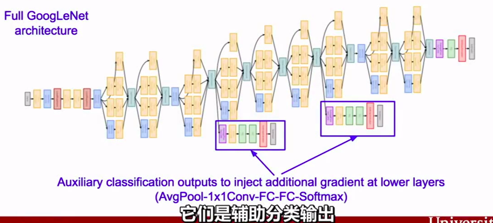

# GoogLeNet(InceptionV1)(2014)

## 前言

2014年, 在google工作的Christian Szegedy为了找到一个深度神经网络结构**能够有效地减少计算资源**, 于是有了这个[GoogleNet](https://arxiv.org/abs/1409.4842)了（也叫做Inception V1）.

## 概要

架构的主要特点是提高了网络内部计算资源的利用率. 通过精心的手工设计, 我们在**增加了网络深度和广度的同时保持了计算预算不变**. 为了优化质量, 架构的设计以赫布理论和多尺度处理直觉为基础.

在某种意义上, 我们以“Inception module”的形式引入了一种新层次的组织方式, 在更直接的意义上增加了网络的深度. 一般来说, 可以把Inception模型看作论文[12]的逻辑顶点同时从Arora等人[2]的理论工作中受到了鼓舞和引导.

目前最好的目标检测是Girshick等人[6]的基于区域的卷积神经网络(R-CNN)方法. R-CNN将整个检测问题分解为两个子问题：利用低层次的信号例如颜色, 纹理以跨类别的方式来产生目标位置候选区域, 然后用CNN分类器来识别那些位置上的对象类别. 这样一种两个阶段的方法利用了低层特征分割边界框的准确性, 也利用了目前的CNN非常强大的分类能力. 我们在我们的检测提交中采用了类似的方式, 但探索增强这两个阶段, 例如对于更高的目标边界框召回使用多盒[5]预测, 并融合了更好的边界框候选区域分类方法.

## 新意

#### Inception module

Christian在思**考如何才能够减少深度神经网络的计算量, 同时获得比较好的性能的框架**. 即使不能两全其美, 退而求其次能够保持在相同的计算成本下, 能够有更好的性能提升这样的框架也行. 于是后面Christian和他的team在google想出了这个模型：


其乍一看基本上是1×1,3×3和5×5卷积核的并行合并. 但是, 最重要的是使用了1×1卷积核(NiN)来减少后续并行操作的特征数量. 这个思想现在叫做“bottleneck layer”.

#### Bottleneck layer

> Network-in-Network是Lin等人为了增加神经网络表现能力而提出的一种方法. 在他们的模型中, 网络中添加了额外的1 × 1卷积层, 增加了网络的深度. 我们的架构中大量的使用了这个方法.
>
> 但是, 在我们的设置中, 1 × 1卷积有两个目的：最关键的是, 它们主要是用来作为**降维模块来移除卷积瓶颈**, 否则将会限制我们网络的大小. 这不仅允许了深度的增加, 而且允许我们网络的宽度(卷积核种类数量)增加但没有明显的性能损失.

受NiN的启发, googleNet的Bottleneck layer**减少了特征的数量, 从而减少了每一层的操作复杂度**, 因此可以加快推理时间. 在将数据传递到下一层卷积之前, 特征的数量减少了4左右. 因此这种设计架构因为大量节省计算成本而名声大噪.

假设输入时256个feature map进来, 256个feature map输出, 假设Inception层**只执行3x3的卷积**, 那么这就需要执行 (256x256) x (3x3) 次乘法(大约589,000次计算操作).

现在Bottleneck layer的思想是先来减少特征的数量, 我们首先执行256 -> 64 的1×1卷积, 然后在所有Bottleneck layer的分支上对64大小的feature map进行卷积, 最后再64 -> 256 1x1卷积.  操作量是：

* 256×64 × 1×1 = 16,384  	64x1x1卷积核对上一层输出卷积计算
* 64×64   × 3×3 = 36,864        64x3x3卷积核对1x1卷积输出进行卷积计算
* 64×256 × 1×1 = 16,384        256x1x1卷积核对3x3卷积输出进行卷积计算

总共约70,000, 而我们以前有近600,000. 几乎减少10倍的操作！

虽然我们做的操作较少, 但我们并没有失去这一层特征. 实际上, Bottleneck layer已经在ImageNet数据集上表现非常出色, 并且也将在稍后的架构例如ResNet中使用到.

成功的原因是**输入特征是相关的, 因此可以通过适当地与1x1卷积组合来去除冗余**. 然后, 在卷积具有较少数目的特征之后, 它们可以再次扩展并作用于下一层输入.

#### 辅助分类器



添加到这些中间层. 深度相对较大的网络, 有效传播梯度反向通过所有层的能力是一个问题.

在这个任务上, 更浅网络的强大性能表明网络中部层产生的特征应该是非常有识别力的. **通过将辅助分类器添加到这些中间层, 可以期望较低阶段分类器的判别力**.

这被认为是在**提供正则化的同时克服梯度消失问题**.

这些分类器采用较小卷积网络的形式, 放置在Inception (4a)和Inception (4b)模块的输出之上. 在训练期间, 它们的损失以折扣权重(辅助分类器损失的权重是0.3)加到网络的整个损失上. 在推断时, 这些辅助网络被丢弃. 后面的控制实验表明**辅助网络的影响相对较小(约0.5), 只需要其中一个就能取得同样的效果**.

> 可以在前面的几个层得到更多的梯度训练. 这些辅助分类输出, 并不是为了让类获得更好的分类性能所需要的, 这是一种可以将额外的梯度直接注入到网络下层的方法, 这是在批量标准化出现之前. 一旦网络有了BN, 就不需要这样技巧来让这些深层的模型收敛.

## 构思

提高深度神经网络性能**最直接的方式是增加它们的尺寸**. 这不仅包括增加深度——网络层次的数目——也包括它的宽度：每一层的单元数目. 这是一种训练更高质量模型容易且安全的方法, 尤其是在可获得大量标注的训练数据的情况下. 但是这个简单方案有两个主要的缺点.

* 更大的尺寸通常意味着更多的参数, **这会使增大的网络更容易过拟合**, 尤其是在训练集的标注样本有限的情况下. 这是一个主要的瓶颈, 因为*要获得强标注数据集费时费力且代价昂贵*, 经常需要专家评委在各种细粒度的视觉类别进行区分.

* 均匀增加网络尺寸的另一个缺点是**计算资源使用的显著增加**. 例如, 在一个深度视觉网络中, 如果两个卷积层相连, 它们的滤波器数目的任何均匀增加都会引起计算量平方式的增加. 如果增加的能力使用时效率低下(例如, 如果大多数权重结束时接近于0), 那么会浪费大量的计算能力.

  由于计算预算总是有限的, 有效地分配计算资源优于不加区分地增加大小, 即使主要目标是增加性能的质量.

**解决这两个问题的一个基本的方式就是引入稀疏性并将全连接层替换为稀疏的全连接层, 甚至是在卷积层中也是如此**.

在现实中, 生物的神经系统则是稀疏的, 因此**研究者认为大型神经网络的合理连接方式也应该是稀疏的**.

受生物学上的Hebbian定理的启发, 《Provable Bounds for Learning Some Deep Representations》文章指出：**如果数据集的概率分布可以被一个很大很稀疏的神经网络的神经网络所表达, 那么构筑这个网络的最佳方法是逐层构筑网络：将上一层高度相关的结点聚类, 并将聚类出来的每一个小簇连接到一起. **

> 赫布理论
>
> **我们可以假定, 反射活动的持续与重复会导致神经元稳定性的持久性提升……当神经元A的轴突与神经元B很近并参与了对B的重复持续的兴奋时, 这两个神经元或其中一个便会发生某些生长过程或代谢变化, 致使A作为能使B兴奋的细胞之一, 它的效能增强了**.
>
> 这一理论经常会被总结为“一起激发的神经元连在一起”(*Cells that fire together, wire together*). 但是, 这个解释并不完整, 赫布强调说, 神经元"A"必须对神经元"B"的激发“作出了一定贡献”, 因此, 神经元"A"的激发必须在神经元"B"之先, 而不能同时激发. 赫布理论中的这一部分研究, 后来被称作[STDP](https://zh.wikipedia.org/w/index.php?title=STDP&action=edit&redlink=1), 表明突触可塑性需要一定的时间延迟.

然而文章指出：今天的计算架构在计算非均匀稀疏数据的时候效率很低. 尽管使用稀疏矩阵, 并且将算术操作降低100倍, 但是在计算的时候可能并不能得到pay off. 原因是目前的CPU和GPU所使用的底层计算库更偏向于密集矩阵的高性能计算.

这样就提出了一个问题：是否有一种方法, 既能保持网络结构的稀疏性质, 又能利用密集矩阵的高计算性能.

大量的文献表明可以**将稀疏矩阵聚类为较为密集的子矩阵**来提高计算性能, 据此论文提出了名为Inception 的结构来实现此目的. (增强深度宽度, 但是参数又少).

## 架构

Inception架构的**主要想法是考虑怎样近似卷积视觉网络的最优稀疏结构并用容易获得的密集组件进行覆盖**. 注意假设转换不变性, 这意味着我们的网络将以卷积构建块为基础. 我们所需要做的是**找到最优的局部构造并在空间上重复它**.

> **Inception** 结构的主要思路是怎样用密集成分来近似最优的局部稀疏结构.

为了避免块校正的问题, 目前Inception架构形式的滤波器的尺寸仅限于1×1、3×3、5×5, 这个决定更多的是基于便易性而不是必要性. 这也意味着提出的架构是所有这些层的组合, 其输出滤波器组连接成单个输出向量形成了下一阶段的输入. 另外, 由于池化操作对于目前卷积网络的成功至关重要, 因此建议在每个这样的阶段添加一个替代的并行池化路径应该也应该具有额外的有益效果(看图2(a)).


关于上面的最终结构b:

1. 采用不同大小的卷积核意味着不同大小的感受野, 最后拼接意味着**不同尺度特征的融合**；

2. 之所以卷积核大小采用1、3和5, 主要是**为了方便对齐**. 设定卷积步长stride=1之后, 只要分别设定pad=0、1、2, 那么卷积之后便可以得到相同维度的特征, 然后这些特征就可以直接拼接在一起了；

3. 文章说很多地方都表明pooling挺有效, 所以Inception里面也嵌入了.

4. 由于这些“Inception模块”在彼此的顶部堆叠, 其输出相关统计必然有变化：由于较高层会捕获较高的抽象特征, 其空间集中度预计会减少, 而且每个特征所**涉及的感受野也更大**了, 因此随着层数的增加, 3x3和5x5卷积的比例也要增加.

5. 采用了1x1结构, 除了用来**降维**之外, 它们也包括使用**线性修正单元**使其两用.

   > 上述模块的一个大问题是在具有大量滤波器的卷积层之上, 即使适量的5×5卷积也可能是非常昂贵的, 至少在这种朴素形式中有这个问题. 一旦池化单元添加到混合中, 这个问题甚至会变得更明显：输出滤波器的数量等于前一阶段滤波器的数量. 池化层输出和卷积层输出的合并会导致这一阶段到下一阶段输出数量不可避免的增加. 虽然这种架构可能会覆盖最优稀疏结构, 但它会非常低效, 导致在几个阶段内**计算量爆炸**.
   >
   > 这导致了Inception架构的第二个想法：在计算要求会增加太多的地方, 明智地**减少维度**. 这是基于嵌入的成功：甚至低维嵌入可能包含大量关于较大图像块的信息. 然而嵌入以密集、压缩形式表示信息并且压缩信息更难处理. **这种表示应该在大多数地方保持稀疏(根据[2]中条件的要求)并且仅在它们必须汇总时才压缩信号**. 也就是说, 在昂贵的3×3和5×5卷积之前, 1×1卷积用来计算降维.

通常, Inception网络是一个由上述类型的模块互相堆叠组成的网络, 偶尔会有步长为2的最大池化层将网络分辨率减半.

该架构的一个有用的方面是**它允许显著增加每个阶段的单元数量**, 而不会在后面的阶段出现计算复杂度不受控制的爆炸. 这是在尺寸较大的块进行昂贵的卷积之前通过**普遍使用降维**实现的.

此外, 设计遵循了实践直觉, 即视**觉信息应该在不同的尺度上处理然后聚合**, 为的是下一阶段可以从不同尺度同时抽象特征.

我们发现所有可用的控制允许计算资源的受控平衡, 导致网络比没有Inception结构的类似执行网络快3—10倍(We have found that all the available knobs and levers allow for a controlled balancing of computational resources resulting in networks that are 3—10× faster than similarly performing networks with non-Inception architecture), 但是在这一点上需要仔细的手动设计.

#### 结构参数表

表1说明了竞赛中使用的最常见的Inception实例. 这个网络(用不同的图像块采样方法训练的)使用了我们组合中7个模型中的6个.


* 所有的卷积都使用了**修正线性激活**, 包括Inception模块内部的卷积.

* 在我们的网络中感受野是在均值为0的RGB颜色空间中, 大小是224×224.

* “#3×3 reduce”和“#5×5 reduce”表示在3×3和5×5卷积之前的降维层使用的1×1滤波器的数量. 而"1x1"表示单独的1x1卷积层.

* 在pool proj列可以看到内置的最大池化之后, 投影层中1×1滤波器的数量. 所有的这些降维/投影层也都使用了**线性修正激活**.

* 分类器之前的平均池化是基于[12]的, 尽管我们的实现有一个额外的线性层. 线性层使我们的网络能很容易地适应其它的标签集, 但它主要是为了方便使用, 我们不期望它有重大的影响.

* 网络最后采用了average pooling来代替全连接层, 想法来自NIN, 事实证明可以将TOP1 accuracy提高0.6%.

  但是, 实际在最后还是加了一个全连接层, 主要是为了方便以后大家finetune； (但是不是全局平均池化)

* 然而即使在移除了全连接层之后, dropout的使用还是必不可少的.

* 显然GoogLeNet采用了模块化的结构, 方便增添和修改；

#### 完整网络架构图


#### 附加网络结构

包括辅助分类器在内的**附加网络**的具体结构如下：

* 一个滤波器大小5×5, 步长为3的平均池化层, 导致(4a)阶段的输出为4×4×512, (4d)的输出为4×4×528.

* 具有128个滤波器的1×1卷积, 用于**降维和修正线性激活**.

* 一个全连接层, 具有1024个单元和**修正线性激活**.

* 丢弃70%输出的dropout层.

* 为了避免梯度消失, 使用2个带有softmax损失的线性层作为分类器(作为主分类器预测同样的1000类). 文章中说这两个辅助的分类器的loss应该加一个衰减系数, 但看caffe中的model也没有加任何衰减.

  此外, 实际测试的时候, 这两个额外的softmax会被去掉.

## 实践

* 我们的训练异步随机梯度下降, 动量参数为0.9.

* 固定的学习率计划(每8次遍历下降学习率4%).

* Polyak平均[13]在推断时用来创建最终的模型.

  > 类似于指数平滑的方法(随机优化中的Polyak Averaging), 不再是若干步执行更新而是每一步都做一个小变动：. 实践中效果不错.

* 一个经过验证的方案在竞赛后工作地很好, 包括各种尺寸的图像块的采样, 它的尺寸均匀分布在图像区域的8%-00%之间, 方向角限制为[3/4,4/3]之间.

* 另外, 我们发现Andrew Howard[8]的光度扭曲对于克服训练数据成像条件的过拟合是有用的.

### ILSVRC 2014分类挑战赛

ILSVRC 2014分类挑战赛包括将图像分类到ImageNet层级中1000个叶子结点类别的任务. 训练图像大约有120万张, 验证图像有5万张, 测试图像有10万张. 每一张图像与一个实际类别相关联, 性能度量基于分类器预测的最高分.

通常报告两个数字：top-1准确率, 比较实际类别和第一个预测类别, top-5错误率, 比较实际类别与前5个预测类别：如果图像实际类别在top-5中, 则认为图像分类正确, 不管它在top-5中的排名. 挑战赛使用top-5错误率来进行排名.

我们参加竞赛时没有使用外部数据来训练. 除了本文中前面提到的训练技术之外, 我们在获得更高性能的测试中采用了一系列技巧, 描述如下.

1. 我们独立训练了7个版本的相同的GoogLeNet模型(包括一个更广泛的版本), 并用它们进行了整体预测. 这些模型的训练具有相同的初始化(甚至具有相同的初始权重, 由于监督)和学习率策略. 它们仅在**采样方法和随机输入的图像顺序**方面不同.

2. 在测试中, 我们采用比Krizhevsky等人[9]更积极的裁剪方法.

   具体来说:

   * 我们**将图像归一化为四个尺度**, 其中较短维度(高度或宽度)分别为256, 288, 320和352

   * 取这些**归一化的图像的左, 中, 右方块(在肖像图片中, 我们采用顶部, 中心和底部方块)**

   * 对于每个方块, 我们将采用

     * **4个角**延伸的
     * 从**中心**延伸的224×224裁剪图像
     * **重塑形**到224×224方块的图像
     * 以上图像的**镜像**版本

     这导致每张图像会得到 4(四个尺度)×3(三个原始块)×6(六种调整结果)×2(镜像处理)  = 144 的裁剪图像.

     前一年的输入中, Andrew  Howard[8]采用了类似的方法, 经过我们实证验证, 其方法略差于我们提出的方案. 我们注意到, 在实际应用中, **这种积极裁剪可能是不必要的, 因为存在合理数量的裁剪图像后, 更多裁剪图像的好处会变得很微小**(正如我们后面展示的那样).

3. softmax概率**在多个裁剪图像上和所有单个分类器上进行平均**, 然后获得最终预测. 在我们的实验中, 我们分析了验证数据的替代方法, 例如裁剪图像上的最大池化和分类器的平均, 但是它们比简单平均的性能略逊.

### ILSVRC 2014检测挑战赛

ILSVRC检测任务是为了在200个可能的类别中生成图像中目标的边界框. 如果检测到的对象匹配的它们实际类别并且它们的边界框重叠至少50%(使用Jaccard索引(交集比并集)), 则将检测到的对象记为正确.

> **雅卡尔指数**(英语：Jaccard index), 又称为**并交比**(Intersection over Union)、**雅卡尔相似系数**(Jaccard similarity coefficient), 是用于比较[样本](https://zh.wikipedia.org/wiki/%E6%A8%A3%E6%9C%AC)集的相似性与[多样性](https://zh.wikipedia.org/wiki/%E5%A4%9A%E6%A0%B7%E6%80%A7%E6%8C%87%E6%95%B0)的统计量. 雅卡尔系数能够量度有限样本集合的相似度, 其定义为两个集合[交集](https://zh.wikipedia.org/wiki/%E4%BA%A4%E9%9B%86)大小与[并集](https://zh.wikipedia.org/wiki/%E5%B9%B6%E9%9B%86)大小之间的比例

无关的检测记为假阳性且被惩罚. 与分类任务相反, 每张图像可能包含多个对象或没有对象, 并且它们的尺度可能是变化的.

报告的结果使用**平均精度均值(mAP)**.

GoogLeNet检测采用的方法类似于R-CNN[6], 但**用Inception模块作为区域分类器进行了增强**.

此外, 为了更高的目标边界框召回率, 通过选择搜索[20]方法和多箱[5]预测相结合改进了区域生成步骤.

为了减少假阳性的数量, 超分辨率的尺寸增加了2倍.

> 超像素(superpixel)最大的功能之一, 便是作为图像处理其他算法的预处理, 在不牺牲太大精确度的情况下 **降维**！
>
> 超像素最直观的解释, 便是把一些具有相似特性的像素“聚合”起来, 形成一个更具有代表性的大“元素”. 而这个新的元素, 将作为其他图像处理算法的基本单位. 一来大大降低了维度；二来可以剔除一些异常像素点. 至于根据什么特性把一个个像素点聚集起来, 可以是颜色、纹理、类别等.

这将选择搜索算法的区域生成减少了一半.

我们总共补充了200个来自多盒结果的区域生成, 大约60%的区域生成用于[6], 同时将覆盖率从92%提高到93%. 减少区域生成的数量, 增加覆盖率的整体影响是对于单个模型的情况平均精度均值增加了1%.

最后, 等分类单个区域时, 我们使用了6个GoogLeNets的组合. 这导致准确率从40%提高到43.9%. 注意, 与R-CNN相反, 由于缺少时间我们没有**使用边界框回归**.

一些团队也提到使用定位数据. 由于定位任务的边界框很大一部分不在检测数据集中, 所以可以用该数据预训练一般的边界框回归器, 这与分类预训练的方式相同. GoogLeNet输入没有使用定位数据进行预训练.

> 这里"由于定位任务的边界框很大一部分不在检测数据集中"指的是什么?
>
> 检测任务的数据集的形式是什么样的?这里提到的检测数据集指的是训练集,有框的标签么?测试集又是什么样的?

## 结论

我们的结果取得了可靠的证据, 即**通过易获得的密集构造块来近似期望的最优稀疏结果是改善计算机视觉神经网络的一种可行方法**.

> 怎么是最优的?
>
> 从效果来看差不多是当前效果最好的. :smile:

相比于较浅且较窄的架构, 这个方法的主要优势是在计算需求适度增加的情况下有显著的质量收益.

我们的目标检测工作虽然没有利用上下文, 也没有执行边界框回归, 但仍然具有竞争力, 这进一步显示了Inception架构优势的证据.

对于分类和检测, 预期通过更昂贵的类似深度和宽度的非Inception类型网络可以实现类似质量的结果.

然而, 我们的方法取得了可靠的证据, 即转向更稀疏的结构一般来说是可行有用的想法. 这表明未来的工作将在[2]的基础上以自动化方式创建更稀疏更精细的结构, 以及将Inception架构的思考应用到其他领域.

## 代码

> 个人感觉值得关注的地方:
>
> * 如何实现多个卷积层模块的并联
> * 如何进行预处理
> * 图像检测任务的实现流程

1. Inception module实现

    ```python
    end_point = 'Mixed_3b'
    with tf.variable_scope(end_point):
      with tf.variable_scope('Branch_0'):
        branch_0 = slim.conv2d(net, 64, [1, 1], scope='Conv2d_0a_1x1')
      with tf.variable_scope('Branch_1'):
        branch_1 = slim.conv2d(net, 96, [1, 1], scope='Conv2d_0a_1x1')
        branch_1 = slim.conv2d(
          branch_1, 128, [3, 3], scope='Conv2d_0b_3x3')
      with tf.variable_scope('Branch_2'):
        branch_2 = slim.conv2d(net, 16, [1, 1], scope='Conv2d_0a_1x1')
        branch_2 = slim.conv2d(branch_2, 32, [3, 3], scope='Conv2d_0b_3x3')
      with tf.variable_scope('Branch_3'):
        branch_3 = slim.max_pool2d(net, [3, 3], scope='MaxPool_0a_3x3')
        branch_3 = slim.conv2d(branch_3, 32, [1, 1], scope='Conv2d_0b_1x1')
      # 沿一个维度连接张量. here is along the channel
      net = tf.concat(
          axis=3, values=[branch_0, branch_1, branch_2, branch_3])
    end_points[end_point] = net
    if final_endpoint == end_point:
      return net, end_points
    ```

2. 顶层的分类部分

   ```python
   net, end_points = inception_v1_base(inputs, scope=scope)
   with tf.variable_scope('Logits'):
     # 这里可以选择使用全局平均池化亦或固定核的平均池化,但是前者灵活性更高,对输入没有要求.
     if global_pool:
       # Global average pooling.
       net = tf.reduce_mean(net, [1, 2], keep_dims=True, name='global_pool')
       end_points['global_pool'] = net
     else:
       # Pooling with a fixed kernel size.
       net = slim.avg_pool2d(net, [7, 7], stride=1, scope='AvgPool_0a_7x7')
       end_points['AvgPool_0a_7x7'] = net
     if not num_classes:
       return net, end_points
     # 即使在移除了全连接层之后, dropout的使用还是必不可少的.
     net = slim.dropout(net, dropout_keep_prob, scope='Dropout_0b')
     logits = slim.conv2d(net, num_classes, [1, 1], activation_fn=None,
                          normalizer_fn=None, scope='Conv2d_0c_1x1')
     if spatial_squeeze:
       logits = tf.squeeze(logits, [1, 2], name='SpatialSqueeze')

     end_points['Logits'] = logits
     # prediction_fn=slim.softmax,
     end_points['Predictions'] = prediction_fn(logits, scope='Predictions')
   ```

3. 如何进行预处理

   * 裁剪
   * 伸缩调整
   * 随机左右翻转
   * 随机调整颜色

   > 并没有完全按照论文的描述进行预处理.

   ```python
   def preprocess_for_train(image, height, width, bbox,
                            fast_mode=True,
                            scope=None,
                            add_image_summaries=True):
     """Distort one image for training a network.

     Distorting images provides a useful technique for augmenting the data
     set during training in order to make the network invariant to aspects
     of the image that do not effect the label.

     Additionally it would create image_summaries to display the different
     transformations applied to the image.

     Args:
       image: 3-D Tensor of image. If dtype is tf.float32 then the range should be
         [0, 1], otherwise it would converted to tf.float32 assuming that the range
         is [0, MAX], where MAX is largest positive representable number for
         int(8/16/32) data type (see `tf.image.convert_image_dtype` for details).
       height: integer
       width: integer
       bbox: 3-D float Tensor of bounding boxes arranged [1, num_boxes, coords]
         where each coordinate is [0, 1) and the coordinates are arranged
         as [ymin, xmin, ymax, xmax].
       fast_mode: Optional boolean, if True avoids slower transformations (i.e.
         bi-cubic resizing, random_hue or random_contrast).
       scope: Optional scope for name_scope.
       add_image_summaries: Enable image summaries.
     Returns:
       3-D float Tensor of distorted image used for training with range [-1, 1].
     """
     with tf.name_scope(scope, 'distort_image', [image, height, width, bbox]):
       # 获取bbox, 默认为整张图片
       if bbox is None:
         bbox = tf.constant([0.0, 0.0, 1.0, 1.0],
                            dtype=tf.float32,
                            shape=[1, 1, 4])

       # 后续的图像操作, 很多只接受浮点图像数据, 有些先把图像转成浮点,
       # 处理完成后再转为原来的数据类型；如果有多个图像处理操作, 来回在 uint8 和 float32
       # 之间的转换会导致精度损失, 因此建议在图像处理之前先统一转换成 float32 类型
       if image.dtype != tf.float32:
         image = tf.image.convert_image_dtype(image, dtype=tf.float32)

       # Each bounding box has shape [1, num_boxes, box coords] and
       # the coordinates are ordered [ymin, xmin, ymax, xmax].
       # 在图上画标注框. 输出: 带框的图像.
       image_with_box = tf.image.draw_bounding_boxes(tf.expand_dims(image, 0),
                                                     bbox)
       if add_image_summaries:
         tf.summary.image('image_with_bounding_boxes', image_with_box)

       # Generate a slice from the image with bbox
       distorted_image, distorted_bbox = distorted_bounding_box_crop(image, bbox)
       # Restore the shape since the dynamic slice based upon the bbox_size loses
       # the third dimension.
       distorted_image.set_shape([None, None, 3])
       image_with_distorted_box = tf.image.draw_bounding_boxes(
           tf.expand_dims(image, 0), distorted_bbox)
       if add_image_summaries:
         tf.summary.image('images_with_distorted_bounding_box',
                          image_with_distorted_box)

       # This resizing operation may distort the images because the aspect
       # ratio is not respected. We select a resize method in a round robin
       # fashion based on the thread number.
       # Note that ResizeMethod contains 4 enumerated resizing methods.
       # 此调整大小操作可能会使图像失真, 因为不考虑纵横比.
       # 我们根据线程编号以循环方式选择resize方法.
       # 请注意, ResizeMethod包含4个枚举的大小调整方法.

       # We select only 1 case for fast_mode bilinear.
       # 快速模式下: resize 采取双线性插值, 否则是选择随机方法插值.
       num_resize_cases = 1 if fast_mode else 4
       distorted_image = apply_with_random_selector(
           distorted_image,
           lambda x, method: tf.image.resize_images(x, [height, width], method),
           num_cases=num_resize_cases)

       if add_image_summaries:
         tf.summary.image('cropped_resized_image',
                          tf.expand_dims(distorted_image, 0))

       # Randomly flip the image horizontally.
       # 随机左右翻转
       distorted_image = tf.image.random_flip_left_right(distorted_image)

       # 扭曲Tensor图像的颜色.
       # 每种颜色失真都是非可交换的, 因此颜色操作的排序很重要.
       # 理想情况下, 我们会随机置换颜色操作的顺序.
       # 而不是添加那种复杂程度, 我们为每个预处理线程选择不同的颜色操作顺序.
       # Randomly distort the colors. There are 1 or 4 ways to do it.
       num_distort_cases = 1 if fast_mode else 4
       distorted_image = apply_with_random_selector(
           distorted_image,
           lambda x, ordering: distort_color(x, ordering, fast_mode),
           num_cases=num_distort_cases)

       if add_image_summaries:
         tf.summary.image('final_distorted_image',
                          tf.expand_dims(distorted_image, 0))

       # [0, 1] 之间的图, 变为 [-1, 1] 之间.
       distorted_image = tf.subtract(distorted_image, 0.5)
       distorted_image = tf.multiply(distorted_image, 2.0)
       return distorted_image
   ```

4. 图像检测任务的实现流程

    > 待寻找
