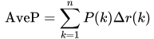

# R-CNN(2014)

## 针对任务: 目标检测

### 目标检测任务概述

> https://blog.csdn.net/u012538490/article/details/55259984
>
> https://blog.csdn.net/Katherine_hsr/article/details/79266880

给定一个图像，**找到其中的目标，找到它们的位置，并且对目标进行分类**。目标检测模型通常是在一组固定的类上进行训练的，所以模型只能定位和分类图像中的那些类。此外，目标的位置通常是边界矩阵的形式。所以，目标检测需要涉及图像中目标的位置信息和对目标进行分类。

> https://zhuanlan.zhihu.com/p/33981103

在深度学习正式介入之前，传统的「目标检测」方法都是 `区域选择`、`提取特征`、`分类回归` 三部曲，这样就有两个难以解决的问题；其一是区域选择的策略效果差、时间复杂度高；其二是手工提取的特征鲁棒性较差。

云计算时代来临后，「目标检测」算法大家族主要划分为两大派系，一个是 `R-CNN` 系两刀流，另一个则是以 `YOLO` 为代表的一刀流派。下面分别解释一下 `两刀流` 和 `一刀流`。

**两刀流** 顾名思义，两刀解决问题：

1. 生成可能区域（Region Proposal） & CNN 提取特征
2. 放入分类器分类并修正位置

这一流派的算法都离不开 `Region Proposal` ，即是优点也是缺点，主要代表就是 `R-CNN`系。

**一刀流** 顾名思义，一刀解决问题，直接对**预测的目标物体进行回归**。
回归解决问题简单快速，但是太粗暴了，主要代表是 `YOLO` 和 `SSD` 。

#### 性能指标

目标检测问题同时是一个回归和分类问题。

首先，为了评估定位精度，需要计算IoU（Intersection over Union，介于0到1之间），其表示预测框与真实框（ground-truth box）之间的重叠程度。IoU越高，预测框的位置越准确。因而，在评估预测框时，通常会设置一个IoU阈值（如0.5），只有当预测框与真实框的IoU值大于这个阈值时，**该预测框才被认定为真阳性（True Positive, TP），反之就是假阳性（False Positive，FP）**。

对于二分类，AP（Average Precision）是一个重要的指标，这是信息检索中的一个概念，基于precision-recall曲线计算出来，详情见(https://en.wikipedia.org/w/index.php?title=Information_retrieval&oldid=793358396#Average_precision)。

> AP的计算公式: 
>
> 可用近似

**对于目标检测，首先要单独计算各个类别的AP值**，这是评估检测效果的重要指标。取各个类别的AP的平均值，就得到一个综合指标mAP（Mean Average Precision），mAP指标可以避免某些类别比较极端化而弱化其它类别的性能这个问题。

对于目标检测，mAP一般在某个固定的IoU阈值上计算，但是不同的IoU阈值会改变TP和FP的比例，从而造成mAP的差异。COCO数据集提供了[官方的评估指标](https://github.com/cocodataset/cocoapi)，它的AP是计算一系列IoU下（0.5:0.05:0.9，见(http://cocodataset.org/#detection-eval)）AP的平均值，这样可以消除IoU导致的AP波动。其实对于PASCAL VOC数据集也是这样，Facebook的Detection上的有比较清晰的实现(https://github.com/facebookresearch/Detectron/blob/05d04d3a024f0991339de45872d02f2f50669b3d/lib/datasets/voc_eval.py#L54)。

除了检测准确度，目标检测算法的另外一个重要性能指标是速度，只有速度快，才能实现实时检测，这对一些应用场景极其重要。评估速度的常用指标是每秒帧率（Frame Per Second，FPS），即每秒内可以处理的图片数量。当然要对比FPS，你需要在同一硬件上进行。另外也可以使用处理一张图片所需时间来评估检测速度，时间越短，速度越快。

### 对于目标检测任务的疑惑

最终结果上有类别, 有框, 有实例, 有置信度. 所以问题就来了, 如何输出这些内容?

类别可以依赖于分类网络来处理, 那框怎么画? 实例如何区分? 置信度又是哪里来?

如果将一幅图像或者一个图像块送到这个regressor network中，那么，这个 regressor network **输出一个相对于这个图像或者图像块的区域，这个区域中包含感兴趣的物体**。这个 regressor network 的最后一层是class specific的，也就是说，**对于每一个class，都需要训练单独最后一层。**这样，假设类别数有1000，则这个 regressor network 输出1000个 bounding box ，每一个bounding box 对应一类。

对于每一个尺度来说， classification network 给出了图像块的类别的概率分布，regressor network 进一步为每一类给出了一个 bounding box, 这样，对于每一个 bounding box，就有一个置信度与之对应。

针对每一类来检测图像中的所有目标, 确定各个目标对于不同类别的各自的置信度. 对于置信度最高的物体标出其自己的回归得到的框, 以及判定的类别与置信度.

## 架构流程

