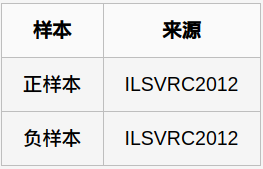
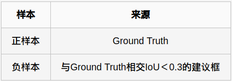
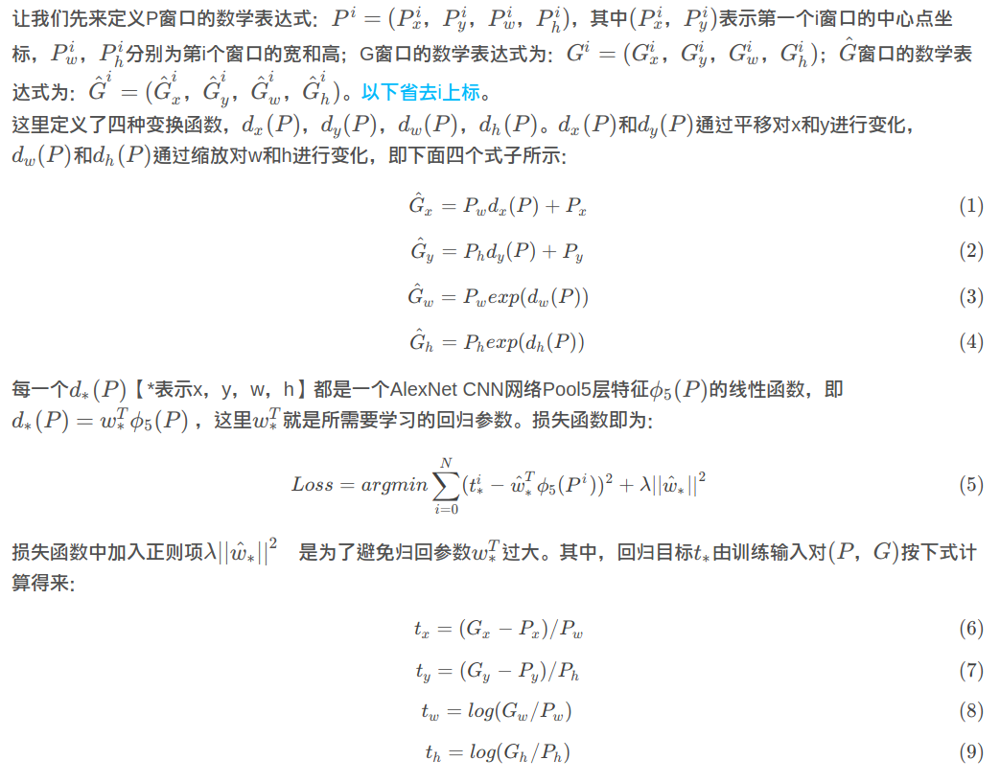

# R-CNN(2014)

## 针对任务: 目标检测

### 目标检测任务概述

> https://blog.csdn.net/u012538490/article/details/55259984
>
> https://blog.csdn.net/Katherine_hsr/article/details/79266880

给定一个图像，**找到其中的目标，找到它们的位置，并且对目标进行分类**。目标检测模型通常是在一组固定的类上进行训练的，所以模型只能定位和分类图像中的那些类。此外，目标的位置通常是边界矩阵的形式。所以，目标检测需要涉及图像中目标的位置信息和对目标进行分类。


> https://zhuanlan.zhihu.com/p/33981103

在深度学习正式介入之前，传统的「目标检测」方法都是 `区域选择`、`提取特征`、`分类回归` 三部曲，这样就有两个难以解决的问题；其一是区域选择的策略效果差、时间复杂度高；其二是手工提取的特征鲁棒性较差。

云计算时代来临后，「目标检测」算法大家族主要划分为两大派系，一个是 `R-CNN` 系两刀流，另一个则是以 `YOLO` 为代表的一刀流派。下面分别解释一下 `两刀流` 和 `一刀流`。

**两刀流** 顾名思义，两刀解决问题：

1. 生成可能区域（Region Proposal） & CNN 提取特征
2. 放入分类器分类并修正位置

这一流派的算法都离不开 `Region Proposal` ，即是优点也是缺点，主要代表就是 `R-CNN`系。

**一刀流** 顾名思义，一刀解决问题，直接对**预测的目标物体进行回归**。
回归解决问题简单快速，但是太粗暴了，主要代表是 `YOLO` 和 `SSD` 。

### 性能指标: mAP/速度

#### mAP

目标检测问题同时是一个回归和分类问题。

对于二分类，AP（Average Precision）是一个重要的指标，这是信息检索中的一个概念，基于precision-recall曲线计算出来，详情见(https://en.wikipedia.org/w/index.php?title=Information_retrieval&oldid=793358396#Average_precision)。

> 计算AP/mAP的流程.
>
> > https://blog.csdn.net/u011447369/article/details/78206057
> >
> > 这篇文章中介绍了多标签图像分类任务的评价方法
> >
> > https://zhuanlan.zhihu.com/p/37910324
> >
> > 这篇文章详细介绍了目标检测任务的mAP的计算过程
>
> 1. 目标检测任务按照RCNN的套路, 先要分类, 再做回归.
>
>     > 尚不够肯定, 待完善
>
> 2. 对于任何算法，评估指标需要知道ground truth（真实标签）数据。我们只知道训练、验证和测试数据集的ground truth。对于目标检测问题，ground truth包括图像中**物体的类别以及实际物体数量以及该图像中每个物体的真实边界框**。
>
> 3. 下面让我们动一下手，去看如何计算mAP。这里我们不谈论不同的目标检测算法，假定我们已经有了一个**训练好的模型**，现在只需要在验证集上评估其性能。
>
> 4. 训练好的目标检测模型会**给出大量的预测结果**，但是其中大多数的预测值都会有非常低的**置信度（confidence score）**，因此我们只考虑那些**置信度高于某个阈值的预测结果**。
>
>     > 这里的置信度指的是什么?
>     >
>     > **分类网络对于确定的框内预测目标的类别预测概率/得分**.
>     >
>     > 一张图片上的不同框内的目标部分对于不同类别有着不同的概率, 也就是不同的置信度.
>
> 5. 将原始图片送入训练好的模型，在经过置信度阈值筛选之后，目标检测算法给出带有边界框的预测结果(此时保留下来的边界是认为positive结果)
>
> 6. 现在，由于我们人类是目标检测专家，我们可以知道这些检测结果大致正确。但我们如何量化呢？我们首先需要判断每个检测的正确性。**这里采用IoU（Intersection over Union），它可以作为评价边界框正确性的度量指标(确定True&False的依据)**。
>
> 7. 计算precision和recall，与所有机器学习问题一样，我们必须鉴别出**TPs**（真正例）、**FPs**（假正例）、**TN**（真负例）和 **FN**（假负例）。为了获得TPs and FPs，我们需要使用IoU。
>
> 8. **使用IoU来确定一个检测结果（Positive）是正确的（True）还是错误的（False）**。最常用的阈值是0.5，即如果IoU > 0.5，则认为它是TP，否则认为是FP。
>
> 9. 计算Recall(TP, FN):
>
>     TP即为IoU大于阈值的预测框结果(同一个目标的应该算一个)
>
>     FN即为真实框中, 我们没有框出来的目标的数目
>
>     > 由于图片中我们**没有预测到物体的每个部分都被视为Negative**，因此计算TN(我们没有框到, 而真是"非该类目标"的部分)比较难办。
>     >
>     > 但是我们可以只计算FN，即ground truth中的目标, 我们没有检测到的没有框到的。
>
> 10. 计算Precision(TP, FP):
>
>     TP即为IoU大于阈值的预测框结果(同一个目标的应该算一个)
>
>     FP即为IoU小于阈值的预测框结果(同一个目标的应该算一个)
>
>     
>
>     > 圆圈内（TPs + FPs）是我们选出的元素,它对应于分类任务中我们取出的结果, 也就是我们预测为真(positives)的样本
>
>     >二元混淆矩阵(实际描述的就是预测值与真实值的相符问题):
>     >
>     >
>     >
>     >预测与实际相符: True; 不符: False
>     >
>     >预测为真: Positive; 预测为假: Negative
>     >
>     >Precision: 预测为真的**确实为真的比例**, 所谓准确率, 也就是**预测为真的正确比例**
>     >
>     >Recall: 真实为真的样本实际**被预测为真的比例**, 所谓召回率, 也就是真是为**真的样本在预测中被召回的比例**
>
> 11. 另外一个需要考虑的因素是**模型所给出的各个检测结果的置信度**。通过改变置信度阈值，我们可以改变一个预测框是Positive还是Negative(即对于该类框的一个过滤, 再送到处理IoU的部分)，即改变预测值的正负性(不是box的真实正负性，**是预测正负性**)。
>
>       基本上，阈值以上的所有预测（Box + Class）都被认为是Positives，并且低于该值的都是Negatives。
>
> 12. 我们可以计算每个Positive预测框与ground truth的IoU值，**并取最大的IoU值，认为该预测框检测到了那个IoU最大的ground truth**。
>
> 13. 然后根据IoU阈值，我们可以计算出一张图片中各个类别的正确检测值（True Positives, TP）数量以及错误检测值数量（False Positives, FP）。
>
>       > 根据Ground truth可以得知没有检测出来的目标的数量FN
>
> 14. 为了得到precision-recall曲线，首先要对模型预测结果进行排序（ranked output，按照各个预测值**置信度**降序排列）。那么给定一个rank，**Recall和Precision仅在高于该rank值的预测结果中计算**，改变rank值会改变recall值。
>
>      这里共选择11个不同的recall（[0, 0.1, ..., 0.9, 1.0]），可以认为是选择了11个rank，由于按照置信度排序，所以实际上**等于选择了11个不同的置信度阈值**。那么，AP就定义为在这11个recall下precision的平均值，其可以表征整个precision-recall曲线（曲线下面积）。
>
> 15. 另外，在计算precision时采用一种插值方法（interpolate）, 及对于某个recall值r，precision值取所有recall>=r中的最大值（这样保证了p-r曲线是单调递减的，避免曲线出现摇摆）
>
>      不过这里VOC数据集在2007年提出的mAP计算方法，而在2010之后却使用了所有数据点，而不是仅使用11个recall值来计算AP
>
> 16. 对于各个类别，分别按照上述方式计算AP，取所有类别的AP平均值就是mAP。这就是在目标检测问题中mAP的计算方法。
>
> 17. 下面是部分代码: https://raw.githubusercontent.com/facebookresearch/Detectron/master/detectron/datasets/voc_eval.py
>
> ```python
> # Copyright (c) 2017-present, Facebook, Inc.
> #
> # Licensed under the Apache License, Version 2.0 (the "License");
> # you may not use this file except in compliance with the License.
> # You may obtain a copy of the License at
> #
> #     http://www.apache.org/licenses/LICENSE-2.0
> #
> # Unless required by applicable law or agreed to in writing, software
> # distributed under the License is distributed on an "AS IS" BASIS,
> # WITHOUT WARRANTIES OR CONDITIONS OF ANY KIND, either express or implied.
> # See the License for the specific language governing permissions and
> # limitations under the License.
> ##############################################################################
> #
> # Based on:
> # --------------------------------------------------------
> # Fast/er R-CNN
> # Licensed under The MIT License [see LICENSE for details]
> # Written by Bharath Hariharan
> # --------------------------------------------------------
> 
> """Python implementation of the PASCAL VOC devkit's AP evaluation code."""
> 
> import cPickle
> import logging
> import numpy as np
> import os
> import xml.etree.ElementTree as ET
> 
> logger = logging.getLogger(__name__)
> 
> 
> def parse_rec(filename):
>     """Parse a PASCAL VOC xml file."""
>     tree = ET.parse(filename)
>     objects = []
>     for obj in tree.findall('object'):
>         obj_struct = {}
>         obj_struct['name'] = obj.find('name').text
>         obj_struct['pose'] = obj.find('pose').text
>         obj_struct['truncated'] = int(obj.find('truncated').text)
>         obj_struct['difficult'] = int(obj.find('difficult').text)
>         bbox = obj.find('bndbox')
>         obj_struct['bbox'] = [int(bbox.find('xmin').text),
>                               int(bbox.find('ymin').text),
>                               int(bbox.find('xmax').text),
>                               int(bbox.find('ymax').text)]
>         objects.append(obj_struct)
> 
>     return objects
> 
> # 这里最终得到一系列的precision和recall值，并且这些值是按照置信度降低排列统计的
> # 可以认为是取不同的置信度阈值（或者rank值）得到的。然后据此可以计算AP
> def voc_ap(rec, prec, use_07_metric=False):
>     """
>     Compute VOC AP given precision and recall. 
>     If use_07_metric is true, uses
>     the VOC 07 11-point method (default:False).
>     """
>     if use_07_metric:  # 使用07年方法
>         # 11 个点
>         ap = 0.
>         for t in np.arange(0., 1.1, 0.1):
>             # 这里rec存放的是各阈值下的对应的Recall
>             if np.sum(rec >= t) == 0:
>                 p = 0
>             else:
>                 p = np.max(prec[rec >= t])  # 插值
>             ap = ap + p / 11.
>     else:  
>         # 新方式，计算所有点
>         # correct AP calculation
>         # first append sentinel values at the end
>         mrec = np.concatenate(([0.], rec, [1.]))
>         mpre = np.concatenate(([0.], prec, [0.]))
> 
>         # compute the precision 曲线值（也用了插值）
>         for i in range(mpre.size - 1, 0, -1):
>             mpre[i - 1] = np.maximum(mpre[i - 1], mpre[i])
> 
>         # to calculate area under PR curve, look for points
>         # where X axis (recall) changes value
>         i = np.where(mrec[1:] != mrec[:-1])[0]
> 
>         # and sum (\Delta recall) * prec
>         ap = np.sum((mrec[i + 1] - mrec[i]) * mpre[i + 1])
>     return ap
> 
> def voc_eval(detpath,
>              annopath,
>              imagesetfile,
>              classname,
>              cachedir,
>              ovthresh=0.5,
>              use_07_metric=False):
>     """rec, prec, ap = voc_eval(detpath,
>                                 annopath,
>                                 imagesetfile,
>                                 classname, # 这里一次只处理一类的数据
>                                 [ovthresh],
>                                 [use_07_metric])
>                             
>     Top level function that does the PASCAL VOC evaluation.
> 
>     detpath: Path to detections
>         detpath.format(classname) should produce the detection results file.
>     annopath: Path to annotations
>         annopath.format(imagename) should be the xml annotations file.
>     imagesetfile: Text file containing the list of images, one image per line.
>     classname: Category name (duh)
>     cachedir: Directory for caching the annotations
>     [ovthresh]: Overlap threshold (default = 0.5)
>     [use_07_metric]: Whether to use VOC07's 11 point AP computation
>         (default False)
>     """
>     # assumes detections are in detpath.format(classname)
>     # assumes annotations are in annopath.format(imagename)
>     # assumes imagesetfile is a text file with each line an image name
>     # cachedir caches the annotations in a pickle file
> 
>     # first load gt
>     if not os.path.isdir(cachedir):
>         os.mkdir(cachedir)
>     imageset = os.path.splitext(os.path.basename(imagesetfile))[0]
>     cachefile = os.path.join(cachedir, imageset + '_annots.pkl')
>     # read list of images
>     with open(imagesetfile, 'r') as f:
>         lines = f.readlines()
>     imagenames = [x.strip() for x in lines]
> 
>     if not os.path.isfile(cachefile):
>         # load annots
>         recs = {}
>         for i, imagename in enumerate(imagenames):
>             recs[imagename] = parse_rec(annopath.format(imagename))
>             if i % 100 == 0:
>                 logger.info(
>                     'Reading annotation for {:d}/{:d}'.format(
>                         i + 1, len(imagenames)))
>         # save
>         logger.info('Saving cached annotations to {:s}'.format(cachefile))
>         with open(cachefile, 'w') as f:
>             cPickle.dump(recs, f)
>     else:
>         # load
>         with open(cachefile, 'r') as f:
>             recs = cPickle.load(f)
> 
>     # extract gt objects for this class
>     class_recs = {}
>     npos = 0
>     for imagename in imagenames:
>         R = [obj for obj in recs[imagename] if obj['name'] == classname]
>         bbox = np.array([x['bbox'] for x in R])
>         difficult = np.array([x['difficult'] for x in R]).astype(np.bool)
>         det = [False] * len(R)
>         npos = npos + sum(~difficult)
>         class_recs[imagename] = {'bbox': bbox,
>                                  'difficult': difficult,
>                                  'det': det}
> 
>     # read dets
>     detfile = detpath.format(classname)
>     with open(detfile, 'r') as f:
>         lines = f.readlines()
> 
>     splitlines = [x.strip().split(' ') for x in lines]
>     image_ids = [x[0] for x in splitlines]
>     confidence = np.array([float(x[1]) for x in splitlines])
>     BB = np.array([[float(z) for z in x[2:]] for x in splitlines])
> 
>     # (这里是按照批量样本进行处理)所有提案对某一类的预测结果, 按照置信度降序排序
>     sorted_ind = np.argsort(-confidence)
>     # 这里可见, 预测框和对应的提案区域图片都有保存
>     BB = BB[sorted_ind, :]   # 预测框坐标
>     image_ids = [image_ids[x] for x in sorted_ind] # 各个预测框的对应图片id
> 
>     # 遍历预测框，并统计TPs和FPs
>     nd = len(image_ids)
>     tp = np.zeros(nd)
>     fp = np.zeros(nd)
>     for d in range(nd):
>         # 对应的原始图片中的真实类框
>         R = class_recs[image_ids[d]]
>         # 预测框坐标
>         bb = BB[d, :].astype(float) 
>         ovmax = -np.inf
>         # 对应的原始图片中的真实类框
>         BBGT = R['bbox'].astype(float)
> 
>         # 计算第d个预测框和所有真实框的IoU
>         # 找到各个预测框最接近的一个真实框的索引.
>         if BBGT.size > 0:
>             # intersection
>             ixmin = np.maximum(BBGT[:, 0], bb[0])
>             iymin = np.maximum(BBGT[:, 1], bb[1])
>             ixmax = np.minimum(BBGT[:, 2], bb[2])
>             iymax = np.minimum(BBGT[:, 3], bb[3])
>             iw = np.maximum(ixmax - ixmin + 1., 0.)
>             ih = np.maximum(iymax - iymin + 1., 0.)
>             inters = iw * ih
>             # union
>             uni = ((bb[2] - bb[0] + 1.) * (bb[3] - bb[1] + 1.) +
>                    (BBGT[:, 2] - BBGT[:, 0] + 1.) *
>                    (BBGT[:, 3] - BBGT[:, 1] + 1.) - inters)
>             overlaps = inters / uni
> 
>             # 取最大的IoU
>             ovmax = np.max(overlaps)
>             # 最大iou对应的真实框的索引, 也就是认为这预测框对应于这个索引对应的目标
>             jmax = np.argmax(overlaps)
> 
>         # 对于"最接近"的程度进行判定, 超过阈值就判断这框可以看作是这个对应的真实目标
>         if ovmax > ovthresh:  # 是否大于阈值
>             if not R['difficult'][jmax]:  # 非difficult物体
>                 if not R['det'][jmax]:    # 未被检测
>                     tp[d] = 1.
>                     R['det'][jmax] = 1    # 标记已被检测
>                 else:
>                     fp[d] = 1.
>         else:
>             fp[d] = 1.
> 
>     # 到这里时, 已经得到了对于所有预测框(提案)对所有真实标签相似程度的一个盘点.
>     # 这里的正样本就是真实值. 所有重复的, 不准的预测, 都被认为是假阳性(FP).
>     # 这里的tp/fp存放的是各个提案框是否能预测为一个真实的样本的一个逻辑判断的结果.
>     
>     # 计算precision recall
>     # 按照所给定的轴参数返回元素的梯形累计和，axis=0，按照行累加。axis=1，按照列累加。axis不给定具体值，就把numpy数组当成一个一维数组。
>     # 这里计算P和R需要使用这样的梯形累和, 因为随着"阈值"不断地放松, fp, tp对应的值是前面所有的情况的累和
>     # 这里并没有手动调节置信度阈值, 而是利用了一个不断累和的过程, 计算了各个类下所有预测结果的准确率和召回率
>     fp = np.cumsum(fp)
>     tp = np.cumsum(tp)
>     # rec就表示总的正样本(所有的真实框)召回的概率
>     rec = tp / float(npos)
>     # avoid divide by zero in case the first detection matches a difficult
>     # ground truth
>     prec = tp / np.maximum(tp + fp, np.finfo(np.float64).eps)
>     
>     # 这里只计算了一类的对应的AP
>     ap = voc_ap(rec, prec, use_07_metric)
> 
>     return rec, prec, ap
> ```
>
> 这里可以看出来, 先对于某一类别置信度进行排序, 排好序后, 遍历计算所有的预测框各自对于所有真实框的一个IoU.
>
> 选择每个预测框中对于的所有真实框中IoU最大的, 判定这个预测框预测的是这个真实框对应的目标.
>
> 判定IoU阈值, **若是大于阈值(这里忽略了"difficult"目标), 则认为这个预测结果是TP**的(这里只对一个目标计算一次, **多个满足要求的预测框对应同一个目标时, 则只算一次, 其余的都算在FP里. 当然, 小于阈值的也算在FP里**).
>
> 这样得到了针对某一类别的TP, FP, 可得到Precision. 再利用TP与真实框的数目进而可以得到Recall.

对于目标检测，mAP一般在某个固定的IoU阈值上计算，但是不同的IoU阈值会改变TP和FP的比例，从而造成mAP的差异。COCO数据集提供了[官方的评估指标](https://github.com/cocodataset/cocoapi)，它的AP是计算一系列IoU下（0.5:0.05:0.9，见(http://cocodataset.org/#detection-eval)）AP的平均值，这样可以消除IoU导致的AP波动。其实对于PASCAL VOC数据集也是这样，Facebook的Detection上的有比较清晰的实现(https://github.com/facebookresearch/Detectron/blob/05d04d3a024f0991339de45872d02f2f50669b3d/lib/datasets/voc_eval.py#L54)。

> 根据训练数据中各个类的分布情况，mAP值可能在某些类（具有良好的训练数据）非常高，而其他类（具有较少/不良数据）却比较低。所以你的mAP可能是中等的，但是你的模型可能对某些类非常好，对某些类非常不好。因此，建议在分析模型结果时查看各个类的AP值。这些值也许暗示你需要添加更多的训练样本。

#### 速度

除了检测准确度，目标检测算法的另外一个重要性能指标是速度，只有速度快，才能实现实时检测，这对一些应用场景极其重要。评估速度的常用指标是每秒帧率（Frame Per Second，FPS），即每秒内可以处理的图片数量。当然要对比FPS，你需要在同一硬件上进行。另外也可以使用处理一张图片所需时间来评估检测速度，时间越短，速度越快。

## 论文翻译

不想只做论文的搬运工, 有的翻译我就不搬了.

翻译: https://alvinzhu.xyz/2017/10/09/r-cnn/

## 理解框架

R-CNN虽然细节颇多, 较为繁琐, 但是实际上还是一个框架网络, 所以可以从最直观的角度来去理解认知.

先放出R-CNN的结构图. 该图表示的是R-CNN模型在测试(test)阶段的过程.


> https://blog.csdn.net/m0_37537898/article/details/81542889
>
> 这个图做的很好, 非常细致全面


> 对象检测系统概述。
>
> 1. 采用输入图像
> 2. 提取大约2000个自下而上区域提议
> 3. 使用大卷积神经网络（CNN）计算每个提议的特征
> 4. 每个区域提取到的特征送到k(k的取值与类别数相等)个svm分类器中识别, 进行分类使**用特定于类的线性SVM**, 将k个SVM分类器中得分最高的类作为分类结果，将所有得分都不高的region作为背景
>
> 5. 以及送到一个回归器中去调节检测框的位置
> 6. 通过回归器调整之后的结果即为检测到的位置。

---

这里就要考虑这样的流程:

1. 输入图像有何预处理?
2. 如何进行区域提议?
3. 为什么叫做"自下而上"的区域提议?
4. CNN网络使用的是怎样的结构以及如何训练?
5. 对于训练好的CNN又有怎样的处理?
6. 对于SVM分类训练的细节是怎样的?
7. 怎样得到精准的框预测?
8. 怎样得到最终的有框,有类别,有置信度的结果标注?

所以下面主要从这些问题入手开始思考与理解.

论文中有些操作是关于测试还是训练的细节没有详细说清, 只能按自己的理解, 尽可能合理解释了.

---

### (训练+测试)输入图像有何预处理?

并没有提到什么特定的预处理.

### (训练+测试)如何进行区域提议?

使用的是selective search算法, 它通过在像素级的标注，把颜色、边界、纹理等信息作为合并条件，多尺度的综合采样方法，划分出一系列的区域，这些区域要远远少于传统的滑动窗口的穷举法产生的候选区域。

这个算法的作用是给定一张图片，输出一系列的可能包含物体的矩形框，这些矩形框我们称之为检测建议(detection proposals)，一般而言，这些检测建议随后会被送入分类器进行类别的判定。

一篇介绍性的文章: https://blog.csdn.net/xbcreal/article/details/76014600

> selective search算法主要基于以下三个方面的考虑：
>
> 1. 能够捕捉所有的尺度。这个算法主要通过图像分割算法中的层次性来达到这个目的。 
> 2. 多样性。划分区域的策略必须是多样性的，尽可能考虑到所有的情况，如颜色、纹理、亮度等等。 
> 3. 能够快速计算。速度快了可以实时处理图片，再快一点可以处理视频流，总之快比慢好得多。 

---

#### 层次性

**层次性聚类算法是selective search算法的基础**，因为有了层次性，就可以捕捉低尺度到高尺度范围内的所有物体。算法流程如下： 


这个算法的输入是一张图片，输出的是物体可能所在位置的假设集合L。

1. 首先使用[Efficient Graph-Based Image Segmentation]算法将图像分成许许多多的小区域的集合R
2. 令表示相似性的集合S初始化为空集。
3. 对于R中的两两相邻的区域，计算他们的相似性，并把计算得到的结果加入到表示相似性的集合S中去。
4. 完成这个步骤之后，进行一个while循环，循环停止的条件是S变成了空集，对于每一次循环，做以下几件事情: 
    1. 首先获取集合S中相似性最高的两个区域ri,rj
    2. 然后将ri和rj进行融合为rt
    3. 然后把所有ri、rj和其它所有区域的相似性的值从S中除去
    4. 然后计算所有和rt相邻区域的相似性(也就是说之前的ri,rj都用rt来表示了，因为rt是它俩的并集)，构成一个小的集合St
    5. 把S和St代表的集合进行求并操作得到新的S
    6. R和rt求并集得到新的R
5. 最后直到S变成了空集，则不再继续循环，而此时得到的集合R就是我们想要的物体可能所在位置的假设集合L。 

> [Efficient Graph-Based Image Segmentation]算法:
>
> https://blog.csdn.net/xbcreal/article/details/75897836
>
> 选择性搜索算法第一步需要一个图像分割算法Efficient Graph- Based Image Segmentation
>
> 这篇论文的思想是把图像看作为一个图(graph)，图中的节点就是图像中的像素，而权重就是相邻像素之间的差异性。然后通过贪心算法**不断融合差异性小的像素或者区域为一个区域**，将图最后划分为数个区域(regions或者是components)，从而完成对图像的分割。
>
> > 如何衡量差异性?
> >
> > 见下方描述
>
> 让G=（V，E）成为一个无向图（graph），其中V是图像（图像指的是图片，图指的是一种数据结构）中的每一个像素构成的顶点集合，E是V中连接相邻的顶点的边构成的边的集合，E中的每一个边edge(vi,vj)都有一个对应的权重w((vi,vj))，这个权重衡量的是vi和vj节点的差异性。
>
> **衡量这种差异性的方法有很多，比如可以用两个节点之间的距离来表达这种差异性，或者用两个节点所代表的像素的颜色的差异来表达这种差异性。**
>
> 在基于图的图像分割方法中，对一个图的分割S表示的意思是将顶点集合V分割为许多组件(components)，S中的每一个component都对应于新的图G’=（V，E’）中的一个连接上的component。(注意**graph中的component就对应于图片中的region**) . 
>
> 我们可以思考一件很直观的事情，两个区域之所以成为两个区域，而没有融合成为一个区域，是不是就是意味着这个区域内部元素的差异性要小于两个区域之间的差异性呢？换言之，如果区域之间的差异性比区域内部的差异性还要小的话，那实际上这两个区域就应该融合成为一个区域，因为比它们差异性大的都成为了一个区域了，那这两个区域也应该成为一个区域才对。这便是作者提出的判断两个区域是否应该融合为一个区域的标准，也是这篇文章的一个重要的思想。

---

#### 多样性

这里首先对**颜色空间采用了多样性**，作者采用了8种不同的颜色方式，主要是为了考虑场景以及光照条件等。这个策略主要应用于Efficient Graph-Based Image Segmentation图像分割算法中**原始区域的生成**以及selective search算法中**衡量两个区域的相似性**的时候用到。主要使用的颜色空间有：（1）RGB，（2）灰度I，（3）Lab，（4）rgI（归一化的rg通道加上灰度）（5）HSV，（6）rgb（归一化的RGB），（7）C，（8）H（HSV的H通道）

除了颜色的多样性以外，还对**相似性的衡量采用了多样性**。总共采用了4个不同的相似性度量的方式，包括**颜色的相似性度量、纹理的相似性度量、尺寸的相似性度量以及吻合度的相似性度量**.最后将这四种相似性按照一定权重加权求和就得到两个区域之间的相似性了，这在Algorithm1中是必须用到的一步。 

除了以上的多样性，文章还用到了**初始区域的多样性**。初始区域是指通过Efficient Graph-Based Image Segmentation获得的初始区域集合R，由于采用不同的颜色空间，所以我们会获得不同的初始区域，另外，改变该图像分割算法中的阈值k，也可以获得不同的初始区域，且k越大，获得的初始区域的数量越小，每个区域的面积会越大，具体原因还是参考Efficient Graph-Based Image Segmentation。 

使用不同的策略来进行层次性聚类算法会得到不同的集合R，但是我们*想把所有的R中的区域(论文中称为locations)都放在一起并进行一个排序*，排序的目的是说让更有可能是物体的location先送入分类器。

1. 由于在一个策略下的层次性聚类算法是有层次的，比如说，<u>最底层就是通过图像分割算法得到的初始区域</u>，随着区域的不断融合，最后达到层次的顶层，也就是<u>整个图片融合为一个区域</u>，我们把顶层在层次性中的坐标i标为1，它的下一层就是图像被分割为少数几个区域的那一层。

2. 然后对于每一个层次坐标i，都乘以一个范围在[0,1]之间的随机数RND，得到i’，这样**对于每一个策略下的不同层次坐标下的区域就按照其得到的i’的大小从小到大排序，将不同策略下的i’都放在一起进行升序排序，i’小的具有优先被后续比如分类器处理的权力。**

    > 这里实际上就是随机排序咯?

3. 在这一步排序之后，我们又进一步筛选出i’很小，但是重复数很多的区域，意思就是**多种策略下都分割出同样的区域的话，那么这些区域更有可能是物体存在的区域**。

4. 至此，Selective Search for Object Recognition算法就结束了。

### 为什么叫做"自下而上"的区域提议?

个人理解: 在最开始输入网络的时候, 就已经准备好了很多的提议, 网络知识进一步的筛选调整而已.

> 有自上而下的方式么?

### (训练+测试)提议完后如何处理?


利用R-CNN之前的准备：Selective Search for Object Recognition方法，给定一张图片，从中提取出大约2k的可能是物体的位置(理解为locations、proposals、regions都可)，即上图中1到2的步骤。

在测试时，我们对测试图像进行选择性搜索，以提取大约2000个区域提案（我们在所有实验中使用选择性搜索的“快速模式”）。然后缩放每个区域，并通过CNN向前传播，以计算特征。

> https://www.cnblogs.com/zf-blog/p/6740736.html
>
> https://zhuanlan.zhihu.com/p/23006190

本文采用AlexNet CNN网络进行CNN特征提取，为了适应AlexNet网络的输入图像大小：227×227，故将所有建议框变形为227×227。那么问题来了，如何进行变形操作呢？作者在补充材料中给出了四种变形方式：

1. 考虑context【图像中context指RoI周边像素】的**各向同性变形**，也就是先扩充后裁剪：直接在原始图片中，把bounding box的边界进行扩展延伸成正方形227×227，如果已经延伸到了原始图片的外边界，那么就用原始图片被框住的部分的颜色均值填充；如图(B)所示
2. 不考虑context的**各向同性变形**，也就是先裁剪后扩充：先把初始的RoI图片区域裁剪出来，然后用固定的背景颜色填充成正方形227×227图片(背景颜色也是采用RoI部分的像素颜色均值), 如图(C)所示
3. **各向异性变形**，简单粗暴对图像就行缩放至227×227，如图(D)
4. 变形前先进行边界像素填充【padding】处理，即向外扩展建议框边界，以上三种方法中分别采用padding=0(下图第一行)，padding=16(下图第二行)进行处理；

经过作者一系列实验表明采用padding=16的各向异性变形即下图第二行第三列效果最好，能使mAP提升3-5%。 


每一个输入图像, 经过如此流程便得到了CNN需求的大约2K个标准输入图像.


也就是对每一个可能是物体位置的图片都进行warp，即将尺寸缩放到固定的尺寸，这个尺寸是满足深度网络输入的尺寸要求的，并从中提取出固定长度的特征向量。因此输出是大约2k个固定长度的特征向量。即完成了结构图中2到3的步骤。 

### (训练)CNN网络使用的是怎样的结构以及如何训练?

> https://zhuanlan.zhihu.com/p/23006190

网络架构两个可选方案：第一选择经典的Alexnet；第二选择VGG16。经过测试Alexnet精度为58.5%，VGG16精度为66%。VGG这个模型的特点是选择比较小的卷积核、选择较小的跨步，这个网络的精度高，不过计算量是Alexnet的7倍。后面为了简单起见，我们就直接选用Alexnet.

**有监督预训练阶段**



参数初始化部分：物体检测的一个难点在于，物体标签训练数据少，如果要直接采用随机初始化CNN参数的方法，那么目前的训练数据量是远远不够的。这种情况下，最好的是采用某些方法，把参数初始化了，然后在进行有监督的参数微调，这里文献采用的是有监督的预训练。所以paper在设计网络结构的时候，是直接用Alexnet的网络，然后连参数也是直接采用它的参数，作为初始的参数值，然后再fine-tuning训练。

网络优化求解时采用随机梯度下降法，学习率大小为0.001；

**fine-tuning阶段** 


PASCAL VOC 2007样本集上既有图像中物体类别标签，也有图像中物体位置标签. **该网络输入为建议框【由selective search而来】变形后的227×227的图像**, 继续对上面预训练的CNN模型进行fine-tuning训练。**假设要检测的物体类别有N类，那么我们就需要把上面预训练阶段的CNN模型的最后一层给替换掉，替换成N+1个输出的神经元(加1，表示还有一个背景) (20 + 1 = 21)，然后这一层直接采用参数随机初始化的方法，其它网络层的参数不变**；接着就可以开始继续SGD训练了。

> 前面的参数不动是指在参数初始化的时候不动。
>
> fine tuning之前把预训练的最后一层替换成了（N+1）长的层，这一层是没有初始权重的，需要随机初始化；前面的层保持预训练的权重不变。
>
> 然后开始进行fine tuning，**在检测数据集上所有层进行权重更新**。

开始的时候，SGD学习率选择0.001，在每次训练的时候，我们batch size大小选择128，其中32个正样本、96个负样本【由于正样本太少】。

> 这里还是softmax分类器来进行的训练
>
> 要注意, 这里使用的是提案区域作为输入来进行训练, 相当于一个样本只有一个类别.

> 这里又可以考虑: 可以不进行特定样本下的微调吗？可以直接采用AlexNet CNN网络的特征进行SVM训练吗？
>
> 文中设计了没有进行微调的对比实验，分别就AlexNet CNN网络的pool5、fc6、fc7层进行特征提取，输入SVM进行训练，这相当于把AlexNet CNN网络当做万精油使用，类似HOG、SIFT等做特征提取一样，不针对特征任务。实验结果发现f6层提取的特征比f7层的mAP还高，pool5层提取的特征与f6、f7层相比mAP差不多； 
> 在PASCAL VOC 2007数据集上采取了微调后fc6、fc7层特征较pool5层特征用于SVM训练提升mAP十分明显； 
>
> 由此作者得出结论：不针对特定任务进行微调，而将CNN当成特征提取器，pool5层得到的特征是基础特征，类似于HOG、SIFT，类似于只学习到了人脸共性特征；从fc6和fc7等全连接层中所学习到的特征是针对特征任务特定样本的特征，类似于学习到了分类性别分类年龄的个性特征。
>
> 原文：https://blog.csdn.net/wopawn/article/details/52133338 

**关于微调时的正负样本**

一张照片我们得到了2K左右个候选框。然而人工标注的数据一张图片中就只标注了正确的bounding box，我们搜索出来的2K个矩形框也不可能会出现一个与人工标注完全匹配的候选框。因此**在CNN阶段我们需要用IoU为2000个bounding box打标签**。

如果用selective search挑选出来的**候选框与物体的人工标注矩形框（PASCAL VOC的图片都有人工标注）的重叠区域IoU大于0.5，那么我们就把这个候选框标注成物体类别（正样本），否则我们就把它当做背景类别（负样本）**。

> 这里标注类别是只区分物体与背景?
>
> 还是在确定为物体的时候是直接标注好对应的物体所属类别?
>
> 按下面的流程图来讲, 是赋予"该类别"到提议框


> 如果不针对特定任务进行fine-tuning，而是把CNN当做特征提取器，**卷积层所学到的特征其实就是基础的共享特征提取层**，就类似于SIFT算法一样，可以用于提取各种图片的特征，而**f6、f7所学习到的特征是用于针对特定任务的特征**。
>
> 打个比方：对于人脸性别识别来说，一个CNN模型前面的卷积层所学习到的特征就类似于学习人脸共性特征，然后全连接层所学习的特征就是针对性别分类的特征了

这事就算是基本确定了CNN的用于检测任务的参数。从而完成了前面图中3到4的步骤。

### (训练)对于训练好的CNN又有怎样的处理?

在调优之后，网络便可以对PASCAL数据集上的数据提取到有效的特征，因此有了正负样本，可以通过调整后的AlexNet进行特征提取，从而可以得到特征向量和其类别的对应关系.

对CNN网络去掉原始的21类分类层, 将fc7的输出特征用于训练21个SVM分类器.

> 这里就有个问题, 为什么不直接使用微调后的AlexNet的softmax进行21分类?
>
> 因为微调时和训练SVM时所采用的正负样本阈值不同，微调阶段正样本定义并不强调精准的位置，而**SVM正样本只有Ground Truth**；并且微调阶段的负样本是随机抽样的，而**SVM的负样本是经过hard negative mining方法筛选的**；导致在采用SoftMax会使PSACAL VOC 2007测试集上mAP从54.2%降低到50.9%。
>
> 原文：https://blog.csdn.net/wopawn/article/details/52133338 

### (训练)对于SVM分类训练的细节是怎样的?



一旦CNN f7层特征被提取出来，那么我们将为每个物体类训练一个svm分类器。

> 这里对于前面的CNN不再进行训练, 而是直接使用对应的输出特征(这些特征都是与要求的正负样本对应)输入SVM进行训练.

当我们用CNN提取2000个候选框，可以得到2000\*4096这样的特征向量矩阵，然后我们只需要把这样的一个矩阵与svm权值矩阵4096\*21点乘，就可以得到结果了。训练21个svm分类器，分别对每一类做一个二分类. 看看这个feature vector所对应的region proposal是需要的物体还是无关的实物(background) 。

> 对于21分类而言, 有一类是背景, 也就是无关的实物.
>
> 最终的结果就是2000\*21这样的一个大小的矩阵. 分别表示了各个感兴趣的提议框, (为了更方便理解, 可以看做是2000个网络在处理, 因为是矩阵的运算, 所以各个提议都是可以兼顾到的, 实际的运算与2000个网络单独计算分析各自的一个输入样本的效果是一样的.) 所对应的各类的概率. 

因为softmax的负样本（也可以理解为背景样本）是随机选择的即在整个网络中是共享的，而svm的负样本是相互独立的，每个类别都分别有自己的负样本，svm的负样本更加的“hard”，所以svm的分类的准确率更高。从上表中的描述也可以知道, 正负样本的限制更多.

> 这里可以看出来, 训练SVM的时候, 是将整个网络的输入重新设定了IoU的阈值, 来重新划分正负样本. 输入网络重新训练最后的新的分类层.

**得到的特征输入到SVM进行分类**看看这个feature vector所对应的region proposal是需要的物体还是无关的实物(background) 。 

### (训练)怎样得到精准的框预测?

**Boundingbox Regression**

这一部分，作者是通过训练一个回归器来对region的范围进行一个调整，毕竟region最开始只是用selective search的方法粗略得到的，通过调整之后得到更精确的位置。

训练样本为$(P, G)$，其中$P=(P_x, P_y, P_w, P_h)$为候选区域，而$G=(G_x, G_y, G_w, G_h)$为真实框，$G$是与$P$的IoU最大的真实框（只使用**IoU大于0.6的样本**$P$）.

该部分的训练:


> 为什么要采用回归器？回归器是什么有什么用？如何进行操作？ 
>
> 首先要明确目标检测不仅是要对目标进行识别，还要完成定位任务，所以最终获得的bounding-box也决定了目标检测的精度。
>
> 这里先解释一下什么叫定位精度：**定位精度可以用算法得出的物体检测框与实际标注的物体边界框的IoU值来近似表示**。
>
> 采用回归器是为了对建议框进行校正，**使得校正后的Region Proposal与Ground Truth更接近，以提高最终的检测精度**。论文中采用bounding-box回归使mAP提高了3~4%。 
>
> 回归器如何设计呢？ 
>
> 
>
> 如上图，黄色框口P表示建议框Region Proposal，绿色窗口G表示实际框Ground Truth，红色窗口G^表示Region Proposal进行回归后的预测窗口，现在的目标是找到P到G^的线性变换【当Region Proposal与Ground Truth的IoU>0.6时可以认为是线性变换】，使得G^与G越相近，这就相当于一个简单的可以用最小二乘法解决的线性回归问题.
>
> 
>
> 
>
> 原文：https://blog.csdn.net/wopawn/article/details/52133338 

### (测试)怎样得到最终的有框,有类别,有置信度的结果标注?

主要是三个内容: 框/类别/置信度

先说类别, 这个在分类网的SVM的输出, 根据得到的各类的置信度, 可以获得对应区域的类别判定, 保留下来的是得分较大的几个不相邻的框. 每个框都是标有对应的类别, 以及各自的置信度.

对于框, 需要在SVM输出的基础上再进一步的进行框回归. 得到每个类别的修正后的得分最高的bounding box.

这边对于置信度若是设定一个阈值(各个类的正样本与负样本的界限), 随着其变化, 对应的Precision&Recall也会随着改变, 为了计算AP, 我们需要计算这样可以来计算对应的AP.这个阈值可以实际上并不需要设定, 可以看前面的代码里, 并没有直接改变阈值, 而是针对每一类的所有预测, 将预测按照置信度排好序后, 逐步统计每一个预测及其之前的预测结果中的fp和tp的数量(fp+tp=所有的预测框), 这个过程就是等价于不同的阈值划分的过程. 但是细细思考, 这个过程实际上就是描述P(R)曲线的一个绘制的过程, 随着tp的增加, R在逐渐增大, R的增大, 主要是前面的tp的不断累加. 而P的变化, 同时还受fp的累加的影响, 总体还是下降的.

#### 总体测试流程

* 使用selective search的方法在测试图片上提取2000个region propasals 

* 先在每个提案区域图像周围加上16个像素值(0)为提议区域图像的边框，再直接变形为227×227的大小；

* 先将所有变形后的提案区域图像像素减去自己的像素平均值后【预处理操作】，再依次将每个227×227的建议框输入AlexNet CNN网络获取4096维的特征【比以前的人工经验特征低两个数量级】，2000个建议框的CNN特征组合成2000×4096维矩阵；

* 将2000×4096维特征与21个SVM组成的权值矩阵4096×21相乘【21种分类，SVM是二分类器，则有21个SVM】，获得2000×21维矩阵表示每个建议框是某个物体类别的得分

* 分别对上述2000×21维矩阵中每一列即每一类进行**非极大值抑制剔除重叠建议框**，得到该列即该类中得分最高的一些(若一个类下有多个剩余, 可以认为有多个同类目标, 只是不相邻)建议框

    > 非极大值抑制（NMS）
    >
    > 先计算出每一个bounding box的score，然后根据score进行排序，把score最大的bounding box作为选定的框，计算其余bounding box与当前最大score与box的IoU，去除IoU大于设定的阈值的bounding box。(理由是两个框相近, 可以合为一个框)
    >
    > 然后重复上面的过程，**直至候选bounding box为空，然后再将score小于一定阈值的选定框删除得到这一类的结果**（然后继续进行下一个分类）
    >
    > 这样, 每个类保留下来的是得分较大的几个不相邻的框. 也就是较大概率属于该类别的几个"独立的"样本(候选区域). 

* **分别用20个回归器对上述20个类别中剩余的建议框进行回归操作**，最终得到每个类别的修正后的得分最高的bounding box, 利用上述公式可以反求出预测框的修正位置。

    > 这里, 使用的应该**剩下的提案输入对应的池化层5的输出**.

## 总结

R-CNN对每个类别都训练了单独的回归器，采用最小均方差损失函数进行训练。

R-CNN模型的训练是多管道的，CNN模型首先使用2012 ImageNet中的图像分类竞赛数据集进行预训练。

然后在检测数据集上对CNN模型进行fine-tuning，其中那些与真实框的IoU大于0.5的候选区域作为正样本，剩余的候选区域是负样本（背景）。

最后，对数据集中的各个类别训练SVM分类器（注意SVM训练样本与CNN模型的funetuning不太一样，只有IoU小于0.3的才被看成负样本）。

总体来看，R-CNN是非常直观的，就是把**检测问题转化为了分类问题**，并且采用了CNN模型进行分类，但是效果却很好。最好的R-CNN模型在2012 PASCAL VOC数据集的mAP为62.4%（比第二名高出了22个百分点），在2013 ImageNet上的mAP为31.4%（比第二名高出7.1个百分点）。

### 不足

> https://alvinzhu.xyz/2017/10/10/fast-r-cnn/

基于区域的卷积网络方法（RCNN）通过使用深度卷积网络来分类目标候选框，获得了很高的目标检测精度。然而，R-CNN具有显着的缺点：

1. **训练过程是多级流水线。**R-CNN首先使用目标候选框对卷积神经网络使用log损失进行微调。然后，它将卷积神经网络得到的特征送入SVM。 这些SVM作为目标检测器，替代通过微调学习的softmax分类器。 在第三个训练阶段，学习检测框回归。
2. **训练在时间和空间上是的开销很大。**对于SVM和检测框回归训练，从每个图像中的每个目标候选框提取特征，并写入磁盘。对于非常深的网络，如VGG16，这个过程在单个GPU上需要2.5天（VOC07 trainval上的5k个图像）。这些特征需要数百GB的存储空间。
3. **目标检测速度很慢。**在测试时，从每个测试图像中的每个目标候选框提取特征。用VGG16网络检测目标每个图像需要47秒（在GPU上）。