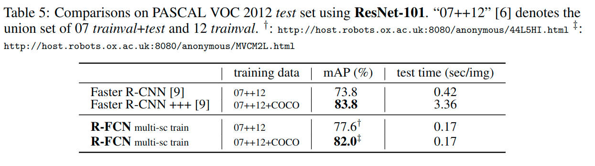
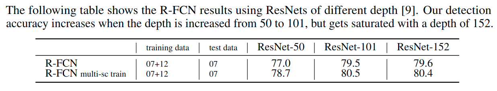
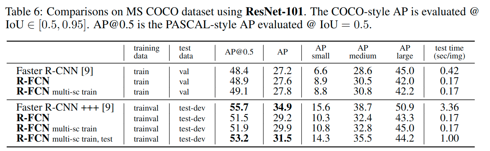

# R-FCN(2016)

> 论文链接: https://arxiv.org/abs/1605.06409
>
> 论文翻译: http://noahsnail.com/2018/01/22/2018-01-22-R-FCN%E8%AE%BA%E6%96%87%E7%BF%BB%E8%AF%91%E2%80%94%E2%80%94%E4%B8%AD%E8%8B%B1%E6%96%87%E5%AF%B9%E7%85%A7/
>
> 详细介绍: https://zhuanlan.zhihu.com/p/30867916

## 面对问题

我们认为, 前述的非自然设计**是由于增加图像分类的变换不变性与目标检测的平移可变性而导致的两难境地**. (**分类网络的位置不敏感性**（translation-invariance in image classification）与**检测网络的位置敏感性**（translation-variance in object detection）)

- 一方面, 图像级别的分类任务有利于平移不变性——图像内目标的移动应该是无差别的. 因此, 深度（全）卷积架构尽可能保持平移不变, 这一点可以从ImageNet分类[9, 24, 26]的主要结果中得到证实.
- 另一方面, 目标检测任务的定位表示需要一定程度上的平移可变性. 例如, 在候选框内目标变换应该产生有意义的响应, *用于描述候选框与目标的重叠程度*.

---

流行的目标检测深度网络家族[SPP-Net, Fast/Faster R-CNN]通过感兴趣区域（RoI）池化层可以划分成两个子网络：

* 独立于RoI的共享“全卷积”子网络
* 不共享计算的RoI子网络

这种分解[8]以往是由开创性的分类架构产生的, 例如AlexNet[10]和VGG Nets[23]等, 在设计上它由两个子网络组成——一个卷积子网络以空间池化层结束, 后面是几个全连接（fc）层. 因此, 图像分类网络中的（最后一个）空间池化层在目标检测网络中[8, 6, 18]自然地变成了RoI池化层.

但是最近最先进的图像分类网络, 如ResNets和GoogLeNets是全卷积的. 通过类比, **在目标检测架构中使用所有卷积层来构建共享的卷积子网络似乎是很自然的**, 使得*RoI的子网络没有隐藏层*. (因为本身这些网络就没有全连接). 然而, 在这项工作中通过经验性的调查发现, 这个天真的解决方案有相当差的检测精度, 不符合网络的优秀分类精度. .

为了解决这个困境, ResNet论文的检测流程(这里应该指的是ResNet结构的Faster R-CNN)将*RoI池化层插入到卷积*中——**特定区域的操作打破了平移不变性**, 当在不同区域进行评估时, RoI后卷积层不再是平移不变的.

> 这里怎么就打破了平移不变性?
>
> 个人理解, 原本认为在没有插入RoI池化操作的时候, 较深的卷积层对于平移不是太感兴趣, 具有一定的平移不变性, 这里主要可以考虑在网络的构建过程中, 中间存在了大量的滑动操作, 以及更高层次的特征提取, 这些对于平移不变性都有一定的促进(但是2018年的一篇论文的观点提出, 即使是很小的输入的偏移也会造成分类网络的很大的误差, 具体可见https://github.com/lartpang/LifeofThinking/blob/master/Works/%E5%85%B3%E4%BA%8ECNN%E7%9A%84%E5%B9%B3%E7%A7%BB%E4%B8%8D%E5%8F%98%E6%80%A7.md, 这里做了个小的摘要, 不过暂先这样理解), 而添加了这个RoI池化, 这个使得后面的操作是针对于前面输出特征图的局部的操作, 这必然导致后续操作不再是平以不变的了.

所以这种方法创建了更深的RoI子网络, 其改善了精度, 由于非共享的RoI计算(它们是针对每个RoI进行特征提取的), 这样做牺牲了测试速度, **因为所有RoIs都要经过若干层卷积计算**, 训练和测试效率.

那么到底怎么办？要精度还是要速度？R-FCN的回答是：都要！！！

## 主要贡献

> Instance-sensitive fully convolutional networks. arXiv:1603.08678
>
> 位置敏感分数图的概念部分受到了上文的启发, 它开发了用于实例级语义分割的FCN. 我们进一步介绍了位置敏感的RoI池化层, 它可以让学习的分数图用于目标检测.
>
> RoI层之后没有可学习的层, 使得区域计算几乎是零成本的, 并加速训练和推断.

> R-FCN的总体架构. 区域建议网络（RPN）[18]提出了候选RoI, 然后将其应用于评分图上. 所有可学习的权重层都是卷积的, 并在整个图像上计算；每个RoI的计算成本可以忽略不计, 可以说也提升了检测速度.

### 位置敏感的分数图

为了将平移可变性并入FCN, 我们通过*使用一组专门的卷积层作为FCN输出来构建一组位置敏感的分数图*. (强行添加平移可变性, 也就是这里要提到的所谓"位置敏感")

这些分数图中的每一层(通道)都**对于相对空间位置的位置信息进行了编码**. 例如“在目标的左边”. 输出特征图上的位置也表示了空间的位置.

> 真的是对应了空间上的位置?
>
> 这里可以认为是通过学习的手段, **让对应的输出的位置和输入的对应位置建立隐含的关联**, 更为重点的关注输入的这些空间的位置.

关于为什么要做到"位置敏感", 这里介绍的很直观, 以供参考理解:

> https://zhuanlan.zhihu.com/p/30867916
>
> 如果一个RoI含有一个类别c的物体, 那么作者将该RoI划分为  个区域, 分别表示该物体的各个部位, 比如假设该RoI中含有人这个物体, k=3, 那么就将“人”划分为了9个子区域, top-center区域毫无疑问应该是人的头部, 而bottom-center应该是人的脚部, 而将RoI划分为  个区域是**希望这个RoI在其中的每一个区域都应该含有该类别c的物体的各个部位**, 即如果是人, 那么RoI的top-center区域就必须含有人的头部. 而**当这所有子区域都含有各自对应的该物体的相应部位后, 那么分类器才会将该RoI判断为该类别**. 物体的各个部位和RoI的这些子区域是“一一映射”的对应关系. （这就像《游戏王》中的对黑暗大法师的召唤一样, 要集齐5张被封印的部位才能召唤出黑暗大法师）

### 位置敏感的RoI池化

在这个FCN之上, 我们**添加了一个位置敏感的RoI池化层**, 它从这些分数图中获取信息, 并且**后面没有权重（卷积/fc）层**. 整个架构是端到端的学习. **所有可学习的层都是卷积的**, 并在整个图像上共享, 但对目标检测所需的空间信息进行编码.

基于位置敏感的得分图, 我们可以开始计算对应的RoI结果, 这里可以看出来, 对于输入的特征图而言, 先进行卷积, 将通道数转化为合适的量, 针对特征图上的某一个RoI区域, 要划分为kxk个格子, 来进行RoI池化, 但是这里**对各个格子分别使用了一层对应序号的特征层, 来代表具体某一类**.

所以说, 对于*每一类*而言, 输出的这个特征图里有**kxk个特征层是分别对应于这kxk个格子**的.

在针对*这一类*进行计算(也就是要得到上图后面的那个看上去形似(C+1)x3x3的特征图的一层)的时候, 计算的过程是: **对于RoI的kxk个格子中第i个格子, 对应与这一类对应的多个得分图层中的第i层, 对这个格子对应的区域进行平均池化后的结果作为最后那个针对这一类的输出的kxk个位置上的第i个位置上的值, 对所有的格子对应的结果计算完成后, 得到最终的那一层上的kxk个结果**.

> 这样理解的依据可以看https://github.com/lartpang/ML_markdown/blob/master/Paper/Deformable%20Convolutional%20Networks%E6%80%BB%E7%BB%93(2017).md#%E4%BD%8D%E7%BD%AE%E6%95%8F%E6%84%9Fps%E7%9A%84roi%E6%B1%A0%E5%8C%96这里的介绍, 这里提到的是同一作者的提出的一种关于卷积的改进, 而且这里是针对自己提出的结构--位置敏感的RoI池化--的改进.

下一步就是, 再针对每一类计算这kxk个值的和, 作为最后的针对这个类别的得分, 得到最终的C+1个值, softmax再进行计算, 得到针对各个类别的概率.

而图层的排列顺序, 上图中也画了出来, 一个格子(区域)针对各类别的得分图层都是放在一起的, C+1层之后再叠加下一个C+1层, 也就是下一个格子(区域)对应的各类别的得分图层.

> ?
>
> 这里要考虑, 这个顺序有影响么, 对于最终的结果? 如果使用的顺序是:
>
> 对于一类对应的所有的格子(区域)对应的所有图层先叠放在一起, 在叠放下一类的图层...
>
> 这里记录了这个问题, 有待解答:
>
> https://github.com/lartpang/ML_markdown/issues/20#issue-386522219

对于得到的位置敏感得分图和对应的RoIPooling的一个可视化:

> 当k×k=3×3时, 我们可视化R-FCN学习的位置敏感分数图. 期望这些专门的分数图将在目标特定的相对位置被强烈激活.
>
> 例如, “顶部中心敏感”分数图大致在目标的顶部中心位置附近呈现高分数. 如果一个候选框与一个真实目标精确重叠, 则RoI中的大部分$k^2$组块都被强烈地激活, 并且他们的投票导致高分. 相反, 如果一个候选框与一个真实的目标没有正确的重叠, 那么RoI中的一些$k^2$组块没有被激活, 投票分数也很低.

### 位置敏感的回归

以类似的方法解决回归预测问题. 除了上面的 维的卷积层, 还附加一个 维度的相邻卷积层. 在这组 维映射上执行位置敏感的RoI池化, 为每个RoI生成一个 维的向量. 然后通过平均投票聚合到4维向量中. 这个4维向量将边界框参数化为 .

我们注意到**为简单起见, 我们执行类别不可知的边界框回归**, 但类别特定的对应部分（即, 具有维输出层）是适用的.

RoI层之后没有可学习的层, 使得区域计算几乎是零成本的, 并加速训练和推断.

## 关于训练

### 损失函数

我们定义的损失函数是每个RoI的交叉熵损失和边界框回归损失的总和:

0]&space;L_{reg}(t,&space;t^*)" title="L(s, t_{x,y,w,h}) = L_{cls}(s_{c^{*}}) + \lambda [c^{*}>0] L_{reg}(t, t^*)" />

这里是RoI的真实标签（ 表示背景）. 是分类的交叉熵损失, 是Fast R-CNN中定义的边界框回归损失, 表示真实的边界框.

0]" title="[c^*>0]" /> 是一个指标, 如果参数为true, 则等于1, 否则为0. 我们将平衡权重设置为  , 如Fast R-CNN中所示.

我们将**正样本定义为与真实边界框重叠的交并比（IoU）至少为0.5的ROI, 否则为负样本**.

### 难例挖掘

我们的方法很容易在训练期间采用在线难例挖掘（OHEM）. 我们可忽略的每个RoI计算使得几乎零成本的样例挖掘成为可能.

假设每张图像有N个提议, 在前向传播中, 我们评估所有N个提议的损失. 然后, 我们按损失对所有的RoI（正例和负例）进行分类, 并选择具有最高损失的B个RoI.

反向传播[11]是基于选定的样例进行的. 由于我们每个RoI的计算可以忽略不计, 所以前向传播时间几乎不受N的影响, 与[22]中的OHEM Fast R-CNN相比, 这可能使训练时间加倍.

### 参数配置

* 我们使用0.0005的权重衰减和0.9的动量

* 默认情况下, 我们使用单尺度训练：调整图像的大小, 使得尺度（图像的较短边）为600像素[6, 18]

* 每个GPU拥有1张图像, 并为反向传播选择B=128个RoI

* 我们用8个GPU来训练模型（所以有效的最小批数据大小是8×）
* 在VOC上我们对R-FCN进行微调, 使用**0.001学习率进行2万次迭代和使用0.0001学习率进行1万次迭代**.
* 为了使R-FCN与RPN共享特征, 我们采用[18]中的四步交替训练, 交替训练RPN和R-FCN.

### 推断过程

在RPN和R-FCN之间计算共享的特征映射（在一个单一尺度的图像上）. 然后, RPN部分提出RoI, R-FCN部分**在其上评估类别分数并回归边界框**.

在推断过程中, 我们评估了300个RoI进行公平比较, 如[18]中那样.

作为标准实践, 使用0.3的IoU阈值[7], 通过非极大值抑制（NMS）对结果进行后处理.

### 空洞与步长设定

我们的全卷积架构享有FCN广泛使用的语义分割的网络修改的好处[15, 2].

特别的是:

- 我们将ResNet-101的**有效步长从32像素降低到了16像素, 增加了分数图的分辨率**.
- conv4阶段[9]（stride = 16）之前和之后的所有层都保持不变
- 第一个conv5块中的stride=2操作被修改为stride=1
- conv5阶段的所有卷积滤波器都被“hole algorithm”[15,2]（“Algorithm atrous”[16]）修改来弥补减少的步幅

为了进行公平的比较, RPN是在conv4阶段（与R-FCN共享）之上计算的, 就像[9]中Faster R-CNN的情况那样, 所以RPN不会受空洞行为的影响. 下表显示了R-FCN的消融结果（k×k=7×7, 没有难例挖掘）.

这个空洞窍门提高了2.6点的mAP.

## 相关工作

* R-CNN[7]已经证明了在深度网络中使用区域提议[27, 28]的有效性.
    * R-CNN评估裁剪区域和变形区域的卷积网络, 计算不在区域之间共享（表1）.
    * SPPnet[8]Fast R-CNN[6]和Faster R-CNN[18]是“半卷积”的, 卷积子网络在整张图像上进行共享计算, 另一个子网络评估单个区域.

* 有可以被认为是“全卷积”模型的目标检测器.

    * OverFeat[21]通过在共享卷积特征映射上滑动多尺度窗口来检测目标；

    * 同样地, 在Fast R-CNN[6]和[12]中, 研究了用滑动窗口替代区域提议. 在这些情况下, 可以将一个单尺度的滑动窗口重新设计为单个卷积层.

    * Faster R-CNN [18]中的RPN组件是一个全卷积检测器, 它可以相对于多个尺寸的参考框（锚点）预测边界框.

        最初的RPN在[18]中是类不可知的, 但是它的类特定的对应部分也是适用的（参见[14]）.

* 另一个目标检测器家族采用全连接（fc）层来在整张图像上生成整体的目标检测结果, 如这三篇:
    * Scalable Object Detection using Deep Neural Networks https://blog.csdn.net/xiaozhi_chen/article/details/20943123
        * 将物体检测问题定义为输出为多个bounding box 的回归问题. 每个bounding box 同时输出坐标和置信度, 使得模型更加紧凑和高效.
        * 利用DNN 同时学习数据的表示和bounding box 检测器.
        * 在无类别监督的条件下训练box 检测器, 使得该方法的计算复杂度几乎不受物体类别的影响, 因此适合于大规模物体检测问题. 该方法还可以推广到未知的类别.
    * YOLO: https://github.com/lartpang/ML_markdown/blob/master/Paper/YOLOV1%E6%80%BB%E7%BB%93(2015).md
    * Deep Neural Networks for Object Detection（基于DNN的对象检测）https://blog.csdn.net/qingqingdeaini/article/details/53099468
        * 本文中作者把目标检测看做一个回归问题, 回归目标窗口（BoundingBox）的位置,
            寻找一张图片当中目标类别和目标出现的位置.

## 测试结果

### PASCAL VOC

#### 与其它全卷积策略的比较

虽然全卷积检测器是可用的, 但是实验表明, 它们要达到良好的精度是复杂的. 我们使用ResNet-101研究以下全卷积策略（或“几乎”全卷积策略, 每个RoI只有一个分类器全连接层）:

**Naïve Faster R-CNN**. 如介绍中所讨论的, 可以使用ResNet-101中的所有卷积层来计算共享特征映射, 并且在最后的卷积层（conv5之后）之后采用RoI池化. 在每个RoI上评估一个廉价的21类全连接层（所以这个变体是“几乎”全卷积的）. 空洞窍门是用来进行公平比较的.

**类别特定的RPN**. 这个RPN按照[18]进行训练, 除了两类（是目标或不是）卷积分类器层被替换为21类卷积分类器层. 为了公平的比较, 对于这个类别特定的RPN, 我们使用具有空洞窍门的ResNet-101的conv5层来处理.

**没有位置灵敏度的R-FCN**. 通过设置k=1k=1, 我们移除了R-FCN的位置灵敏度. 这相当于在每个RoI内进行全局池化.

> 位置灵敏度的重要性通过设置k=1来进一步证明, 其中R-FCN不能收敛.
>
> 在这种退化的情况下, 在RoI内不能显式捕获空间信息. 此外, 我们还报告了, 如果简单Faster R-CNN的ROI池化输出分辨率为1×1, 其能够收敛, 但是mAP进一步下降到61.7%.

**与使用ResNet-101的Faster R-CNN的比较**

> 此外, 难例挖掘[22]没有增加R-FCN的训练成本. 当从2000个RoI挖掘时训练R-FCN是可行的, 在这种情况下, Faster R-CNN慢了6倍（2.9s vs. 0.46s）. 但是实验表明, 从更大的候选集（例如2000）中进行挖掘**没有好处**. 所以我们在本文的其他部分使用了300个RoI来进行训练和推断.

> 在[8]中的多尺度训练之后, 我们在每次训练迭代中调整图像大小, 使得尺度从{400,500,600,700,800}像素中进行随机地采样.
>
> 我们仍然测试600像素的单尺度, 所以不添加测试时间成本. mAP是80.5%80.5%.
>
> 此外, 我们在MS COCO [13]训练验证集上训练我们的模型, 然后在PASCAL VOC数据集上对其进行微调. R-FCN达到83.6%83.6%mAP（表4）, 接近也使用ResNet-101的[9]中的“Faster R-CNN +++”系统. 我们注意到, 我们的竞争结果是在每张图像0.17秒的测试速度下获得的, 比花费3.36秒的Faster R-CNN +++快20倍, 因为它进一步结合了迭代边界框回归, 上下文和多尺度测试[9]. 这些比较也可以在PASCAL VOC 2012测试集上观察到（表5）.

**关于深度的影响**

> 显示了使用不同深度的ResNets的R-FCN结果[9]. 当深度从50增加到101时, 我们的检测精度增加了, 但是深度达到了152.

**关于区域提议的影响**

> R-FCN可以很容易地应用于其它的区域提议方法, 如选择性搜索（SS）[27]和边缘框（EB）[28]. 下表显示了使用不同提议的结果（使用ResNet-101）. R-FCN使用SS或EB运行, 竞争性地展示了我们方法的泛化性.

### MS COCO

> 使用ResNet-101在MS COCO数据集上比较.
>
> COCO式的AP在IoU∈[0.5, 0.95]处评估. AP@0.5是PASCAL式的AP, 在IoU=0.5处评估.

我们单尺度训练的R-FCN基准模型的验证结果为48.9%/27.6%. 这与Faster R-CNN的基准模型相当（48.4%/27.2%）, 但我们的测试速度是Faster R-CNN的2.5倍.

值得注意的是, 我们的方法在小尺寸的目标上表现更好（由[13]定义）. 我们的**多尺度训练**（但是仍是**单一尺度测试**）的R-FCN在验证集上的结果为49.1%/27.8%, 在测试开发集上的结果是51.5%/29.2%.

考虑到COCO广泛的目标尺度, 按照[9]我们进一步评估多尺度的测试变种, 并使用{200, 400, 600, 800, 1000}的测试尺度. mAP是53.2%/31.5%. 这个结果在MS COCO 2015比赛中接近第一名的成绩（Faster R-CNN+++和ResNet-101, 55.7%/34.9%）. 尽管如此, 我们的方法更简单, 并没有添加[9]中所使用的多样功能例如上下文或迭代边界框回归, 并且在训练和测试中都更快.
