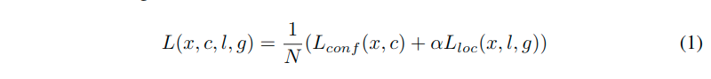
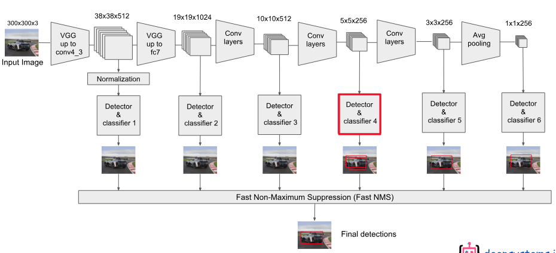
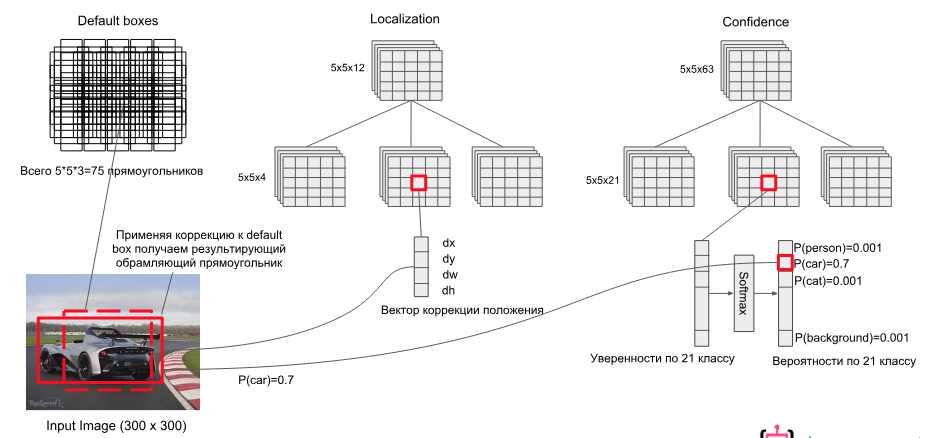
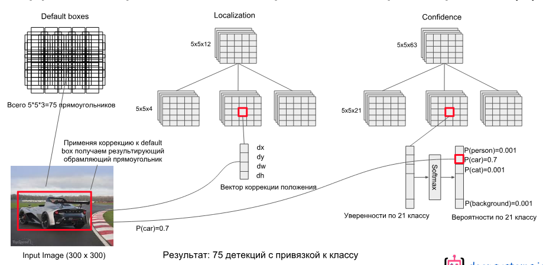
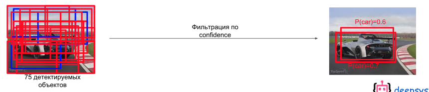
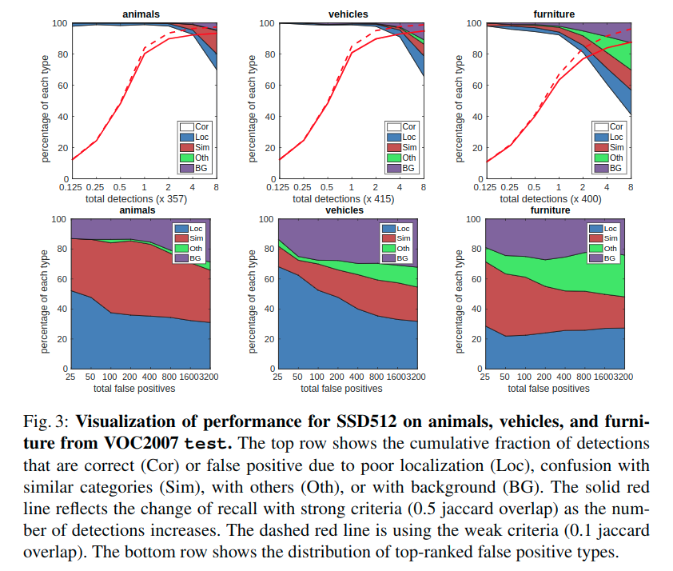
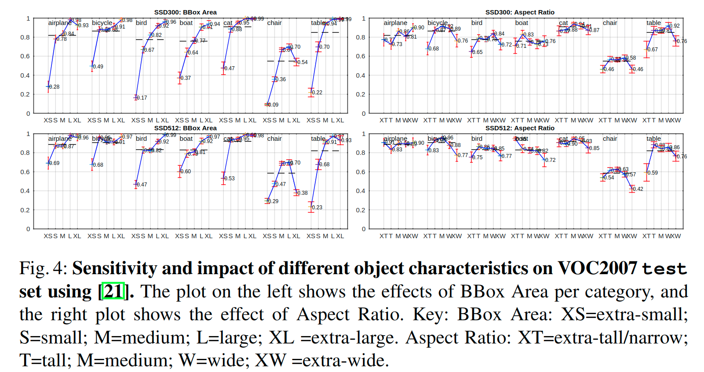

# SSD(2015)

> 论文链接：[https://arxiv.org/pdf/1512.02325.pdf](https://link.zhihu.com/?target=https%3A//link.jianshu.com/%3Ft%3Dhttps%253A%252F%252Farxiv.org%252Fpdf%252F1512.02325.pdf)
>
> tensorflow源码链接：[https://github.com/balancap/SSD-Tensorflow](https://link.zhihu.com/?target=https%3A//link.jianshu.com/%3Ft%3Dhttps%253A%252F%252Fgithub.com%252Fbalancap%252FSSD-Tensorflow)
>
> 论文翻译: http://noahsnail.com/2017/12/11/2017-12-11-Single%20Shot%20MultiBox%20Detector%E8%AE%BA%E6%96%87%E7%BF%BB%E8%AF%91%E2%80%94%E2%80%94%E4%B8%AD%E8%8B%B1%E6%96%87%E5%AF%B9%E7%85%A7/

SSD是YOLO之后又一个引人注目的目标检测结构，它沿用了YOLO中直接回归 bbox和分类概率的方法，同时又参考了Faster R-CNN，大量使用anchor来提升识别准确度。通过把这两种结构相结合，SSD保持了很高的识别速度，还能把mAP提升到较高的水平。

文章贡献:

- 我们引入了SSD，这是一种针对多个类别的单次检测器，比先前的先进的单次检测器（YOLO）更快，并且准确得多，事实上，与执行显式区域提出和池化的更慢的技术具有相同的精度（包括Faster R-CNN）。
- SSD的核心是**预测固定的一系列默认边界框的类别分数和边界框偏移**，使用更小的卷积滤波器应用到特征映射上。
- 为了实现高检测精度，我们根据不同尺度的特征映射生成不同尺度的预测，并通过纵横比明确分开预测。
- 这些设计功能使得**即使在低分辨率输入图像上也能实现简单的端到端训练和高精度**，从而进一步提高速度与精度之间的权衡。
- 实验包括在PASCAL VOC，COCO和ILSVRC上评估具有不同输入大小的模型的时间和精度分析，并与最近的一系列最新方法进行比较。

## 基本结构

原作者给了两种SSD结构，SSD 300和SSD 512，用于不同输入尺寸的图像识别。

本文中以SSD 300为例.

下图上半部分就是SSD 300，下半部分是YOLO，可以对比来看。

* SSD 300中输入图像的大小是300x300.

* 特征提取部分使用了VGG16的卷积层，并将VGG16的`fc6`和`fc7`转换为卷积层（图中conv6和conv7）
* 将pool5从$2\times 2-s2$更改为$3\times 3-s1$，并使用空洞算法[18]来填补这个“小洞”
* 我们删除所有的dropout层和`fc8`层
* 之后又接了多个卷积（conv8_2，conv9_2，conv10_2）
* 最后用一个Global Average Pool来变成1x1的输出（conv11_2）


下面是对于keras版本的实现:

```python
    input_layer = Input(shape=input_shape)

    # Block 1
    conv1_1 = Conv2D(64, (3, 3),
                     name='conv1_1',
                     padding='same',
                     activation='relu')(input_layer)

    conv1_2 = Conv2D(64, (3, 3),
                     name='conv1_2',
                     padding='same',
                     activation='relu')(conv1_1)
    pool1 = MaxPooling2D(name='pool1',
                         pool_size=(2, 2),
                         strides=(2, 2),
                         padding='same', )(conv1_2)

    # Block 2
    conv2_1 = Conv2D(128, (3, 3),
                     name='conv2_1',
                     padding='same',
                     activation='relu')(pool1)
    conv2_2 = Conv2D(128, (3, 3),
                     name='conv2_2',
                     padding='same',
                     activation='relu')(conv2_1)
    pool2 = MaxPooling2D(name='pool2',
                         pool_size=(2, 2),
                         strides=(2, 2),
                         padding='same')(conv2_2)

    # Block 3
    conv3_1 = Conv2D(256, (3, 3),
                     name='conv3_1',
                     padding='same',
                     activation='relu')(pool2)
    conv3_2 = Conv2D(256, (3, 3),
                     name='conv3_2',
                     padding='same',
                     activation='relu')(conv3_1)
    conv3_3 = Conv2D(256, (3, 3),
                     name='conv3_3',
                     padding='same',
                     activation='relu')(conv3_2)
    pool3 = MaxPooling2D(name='pool3',
                         pool_size=(2, 2),
                         strides=(2, 2),
                         padding='same')(conv3_3)

    # Block 4
    conv4_1 = Conv2D(512, (3, 3),
                     name='conv4_1',
                     padding='same',
                     activation='relu')(pool3)
    conv4_2 = Conv2D(512, (3, 3),
                     name='conv4_2',
                     padding='same',
                     activation='relu')(conv4_1)
    conv4_3 = Conv2D(512, (3, 3),
                     name='conv4_3',
                     padding='same',
                     activation='relu')(conv4_2)
    pool4 = MaxPooling2D(name='pool4',
                         pool_size=(2, 2),
                         strides=(2, 2),
                         padding='same')(conv4_3)

    # Block 5
    conv5_1 = Conv2D(512, (3, 3),
                     name='conv5_1',
                     padding='same',
                     activation='relu')(pool4)
    conv5_2 = Conv2D(512, (3, 3),
                     name='conv5_2',
                     padding='same',
                     activation='relu')(conv5_1)
    conv5_3 = Conv2D(512, (3, 3),
                     name='conv5_3',
                     padding='same',
                     activation='relu')(conv5_2)
    pool5 = MaxPooling2D(name='pool5',
                         pool_size=(3, 3),
                         strides=(1, 1),
                         padding='same')(conv5_3)

    # FC6
    fc6 = Conv2D(1024, (3, 3),
                 name='fc6',
                 dilation_rate=(6, 6),
                 padding='same',
                 activation='relu'
                 )(pool5)

    # x = Dropout(0.5, name='drop6')(x)
    # FC7
    fc7 = Conv2D(1024, (1, 1),
                 name='fc7',
                 padding='same',
                 activation='relu'
                 )(fc6)
    # x = Dropout(0.5, name='drop7')(x)

    # Block 6
    conv6_1 = Conv2D(256, (1, 1),
                     name='conv6_1',
                     padding='same',
                     activation='relu')(fc7)
    conv6_2 = Conv2D(512, (3, 3),
                     name='conv6_2',
                     strides=(2, 2),
                     padding='same',
                     activation='relu')(conv6_1)

    # Block 7
    conv7_1 = Conv2D(128, (1, 1),
                     name='conv7_1',
                     padding='same',
                     activation='relu')(conv6_2)
    conv7_1z = ZeroPadding2D(name='conv7_1z')(conv7_1)
    conv7_2 = Conv2D(256, (3, 3),
                     name='conv7_2',
                     padding='valid',
                     strides=(2, 2),
                     activation='relu')(conv7_1z)

    # Block 8
    conv8_1 = Conv2D(128, (1, 1),
                     name='conv8_1',
                     padding='same',
                     activation='relu')(conv7_2)
    conv8_2 = Conv2D(256, (3, 3),
                     name='conv8_2',
                     padding='same',
                     strides=(2, 2),
                     activation='relu')(conv8_1)

    # Last Pool
    pool6 = GlobalAveragePooling2D(name='pool6')(conv8_2)
```

## 结构特点

SSD方法基于前馈卷积网络，该网络**产生固定大小的边界框集合**，并对这些边界框中存在的**目标类别实例进行评分**，然后进行**非极大值抑制**步骤来产生最终的检测结果。

早期的网络层基于用于高质量图像分类的标准架构（在任何分类层之前被截断），我们将其称为基础网络。然后，我们将辅助结构添加到网络中.

### 同时使用多个卷积层的输出做分类和回归


> SSD使用VGG-16-Atrous作为基础网络，其中黄色部分为在VGG-16基础网络上填加的特征提取层。
>
> SSD与yolo不同之处是除了在最终特征图上做目标检测之外，还在之前选取的5个特特征图上进行预测。

可以看出，检测过程不仅在附加网络部分的特征图(conv8_2, conv9_2, conv_10_2, pool_11)上进行，为了保证网络对小目标有很好检测效果，检测过程也在基础网络部分的特征图(conv4_3, conv_7)上进行。

**SSD这么做有什么好处呢？**

> 训练SSD和训练使用区域提出的典型检测器之间的关键区别在于，需要将真实信息分配给固定的检测器输出集合中的特定输出。
>
> 一旦确定了这个分配，损失函数和反向传播就可以应用端到端了。训练也涉及选择默认边界框集合和缩放进行检测，以及难例挖掘和数据增强策略。

要回答这个问题得先回顾下YOLO的结构，YOLO在训练时ground truth和bbox是一一对应的关系（**ground truth对应到其中心位置所在区域中IOU最大的那个bbox来计算loss**），如果有两个ground truth的尺寸和位置都比较相近，就很有可能对应到同一个区域的同一个bbox，这种场景下必然会有一个目标无法识别。

为了解决这个问题SSD的作者把YOLO的结构做了如下优化：

1. 重新启用了Faster R-CNN中anchor的结构

    在SSD中如果有多个ground truth，每个anchor（原文中称作default box，取名不同而已）会选择**对应到IOU最大的那个ground truth**(以anchors为起始考虑)。

    一个anchor只会对应一个ground truth，但**一个ground truth都可以对应到大量anchor**，这样无论两个ground truth靠的有多近，都不会出现YOLO中bbox冲突的情况。

2. 同时使用多个层级上的anchor来进行回归

    作者认为仅仅靠同一层上的多个anchor来回归，还远远不够。因为有很大可能这层上所有anchor的IOU都比较小，就是说**所有anchor离ground truth都比较远**，用这种anchor来训练误差会很大。

    > 例如下图中，左边较低的层级因为feature map尺寸比较大，anchor覆盖的范围就比较小，远小于ground truth的尺寸，所以这层上所有anchor对应的IOU都比较小；右边较高的层级因为feature map尺寸比较小，anchor覆盖的范围就比较大，远超过ground truth的尺寸，所以IOU也同样比较小；只有中间的anchor才有较大的IOU。
    >
    > 通过同时对多个层级上的anchor计算IOU，就能**找到与ground truth的尺寸、位置最接近（即IOU最大）的一批anchor**，在训练时也就能达到最好的准确度。
    >
    > 
    >
    > 不同层级输出的feature map上anchor的IOU差异会比较大

### anchor尺寸的选择

下面来看下SSD选择anchor的方法。在SSD框架内，default boxes/anchors不需要对应于每层的实际感受野。


> 这是特征图上的框, 具体对应于原始图像, 还需要将和这个min_size*(input_scale / feature_map_scale)?

1. 我们将每个默认边界框的中心设置为$(\frac{i+0.5}{|f_k|}, \frac{j+0.5}{|f_k|})$，其中$|f_k|$是第k个方形特征映射的大小(特征图的边长)，$i, j\in [0, |f_k|)$

2. 我们为默认边界框添加不同的**长宽比**，并将它们表示为$a_r \in {1, 2, 3, \frac{1}{2}, \frac{1}{3}}$。我们可以计算每个边界框的宽度$width=(w_k^a = s_k\sqrt{a_r})$和高度$height=(h_k^a = s_k / \sqrt{a_r})$。

    同时还有多个长方形的anchor，长方形anchor的数目在不同层级会有差异. 

    对于长宽比为1，我们还添加了一个默认边界框，其尺度为$s’_k = \sqrt{s_k s_{k+1}}$

    在每个特征映射位置得到**6个默认边界框**

3. 上面的min_size和max_size由下面公式计算得到，$s_{min}=0.2, s_{max}=0.9$.

    m代表全部用于回归的层数，比如在SSD 300中m就是6

    第k层的$min_{size}=s_k$，第k层的$max_{size}=s_{k+1}$

    

### loss的计算

SSD包含三部分的loss：前景分类的loss、背景分类的loss、位置回归的loss。



> 总体目标损失函数是定位损失（loc）和置信度损失（conf）的加权和

* N是匹配的默认边界框的数量, 如果N=0，则将损失设为0
* α是分类loss和回归loss的调节比例，论文中α=1

> 
>
> 对于每个特征图的一点, 预测C个类别得分，以及相对于Default Bounding Box的4个偏移值

* $L_{conf}(x,c)$是**前景(p)的分类loss和背景(0)的分类loss的和**, 是在多类别置信度(c)上的softmax损失

* $L_{loc}(x,l,g)$是所有用于**前景分类的anchor的位置坐标的回归loss**, $L_{loc}(x,l,g)$位置回归仍采用Smooth L1方法, 类似于faster-rcnn, 回归默认边界框(d)的中心偏移量(cx, cy)和其宽度(w),高度(h)的偏移量

    

    > 在源码中把IOU>0.5的anchor都用于前景分类，在IOU<0.5的anchor中选择部分用作背景分类。
    >
    > 只选择部分的原因是背景anchor的数目一般远远大于前景anchor，如果都选为背景，就会弱化前景loss的值，造成定位不准确。
    >
    > 在论文中"难例挖掘"一节提到, 背景分类的anchor数目至多为前景分类anchor数的**三倍**, 来保持它们的平衡, 而且也发现这会导致更快的优化和更稳定的训练。

* $x^p_{ij}$表示第i个anchor/default box与类别p的第j个ground truth相匹配，$x^p_{ij}$不是1(匹配)就是0。有$\sum_i x_{ij}^p \geq 1$, 即对于类别p的第j个真实框至少有一个anchor与之匹配

---

整个loss的选取如下图，这只是个示意图，每个点的anchor被定死成了6个来方便演示，实际应用时不同层级是不一样的：


> SSD在6个层级上进行回归

## 处理流程

### 总体结构图



### 分类检测器结构图


这里会生成75个默认框, 每个特征点3个默认框.

> ?
>
> 也就k=4的时候, 得到sk=0.2+0.7/5\*3=0.62, 那这里如何得出对应的min_size? 
>
> 还需要计算缩放比例, 这里相对与输入的300而言, 大小为5的特征图边长相当于缩小了60倍, 所以有结果min_size=0.62\*300=186

### 默认框生成器

有min_size=168, aspect_ratio=2


### 结果汇总


确定默认框


在默认框基础上利用定位网络进行调整



对调整结果进行类别确定



确定该框的预测结果



对所有结果进行处理筛选,保留得到最终结果

### 详细结构


> 38这里, 默认框是3个么?

### NMS

考虑到我们的方法产生大量边界框，在推断期间执行非最大值抑制（nms）是必要的。

* 通过使用**0.01的置信度阈值**，我们可以过滤大部分边界框。

* 然后，我们应用nms在每个类别0.45的Jaccard重叠阈值，并保留每张图像的前200个检测。

对于SSD300和20个VOC类别，这个步骤每张图像花费大约1.7毫秒，接近在所有新增层上花费的总时间（2.4毫秒）。我们使用Titan X、cuDNN v4、Intel Xeon E5-2667v3@3.20GHz以及批大小为8来测量速度。


> **Pascal VOC2007 test上的结果**。
>
> SSD300是唯一可以取得$70\%$以上mAP的实时检测方法。通过使用更大的输入图像，SSD512在精度上超过了所有方法同时保持近似实时的速度。

## 实际效果

* 具体结构如开头"基本结构"一节所述
* 我们在conv4_3上设置了尺度为0.1的默认边界框
* 对于conv4_3，conv10_2和conv11_2，我们只在每个特征映射位置上关联了**4个默认边界框**——忽略$\frac {1} {3}$和3的长宽比
* 对于所有其它层，放置了**6个默认边界框**
* 由于conv4_3具有不同的特征尺度，我们使用[12]中介绍的L2归一化技术将特征映射中每个位置的特征范数缩放到20，并在反向传播过程中学习这个尺度

### PASCAL VOC2007 test检测结果


* 显示了我们的低分辨率SSD300模型已经比Fast R-CNN更准确

* 当我们用更大的$512\times 512$输入图像上训练SSD时，它更加准确，超过了Faster R-CNN 1.7%的mAP
* 如果我们用更多的（即07+12）数据来训练SSD，我们看到SSD300已经比Faster R-CNN好1.1%，SSD512比Faster R-CNN好3.6%
* 如果我们将SSD512用$COCO \texttt{trainval35k}$来训练模型并在07+12数据集上进行微调，我们获得了最好的结果：81.6%的mAP

### 性能分析



> **SSD512在VOC2007 test中的动物，车辆和家具上的性能可视化**。
>
> 第一行显示由于定位不佳（Loc），与相似类别（Sim）混淆，与其它（Oth）或背景（BG）相关的正确检测（Cor）或假阳性的累积分数。
>
> 红色的实线表示随着检测次数的增加，强标准（0.5 Jaccard重叠）下的召回变化。
>
> 红色虚线是使用弱标准（0.1 Jaccard重叠）。
>
> 最下面一行显示了排名靠前的假阳性类型的分布。

显示了SSD可以检测到高质量（大白色区域）的各种目标类别。它大部分的确信检测是正确的。召回约为85-90%，而“弱”（0.1 Jaccard重叠）标准则要高得多。

与R-CNN[22]相比，SSD具有更小的定位误差，表明**SSD可以更好地定位目标**，因为它**直接学习回归目标形状和分类目标类别**，而不是使用两个解耦步骤。

然而，**SSD对类似的目标类别（特别是对于动物）有更多的混淆**，部分原因是我们共享多个类别的位置。



> **使用[21]在VOC2007 test设置上不同目标特性的灵敏度和影响**。
>
> 左边的图显示了BBox面积对每个类别的影响，右边的图显示了长宽比的影响。
>
> BBox区域：XS=超小；S=小；M=中等；L=大；XL=超大。
>
> 长宽比：XT=超高/窄；T=高；M=中等；W=宽；XW =超宽。

图4显示**SSD对边界框大小非常敏感**。

换句话说，它**在较小目标上比在较大目标上的性能要差得多**。这并不奇怪，因为这些小目标甚至可能在顶层没有任何信息。增加输入尺寸（例如从300×300到512×512）可以帮助改进检测小目标，但仍然有很大的改进空间。积极的一面，我们可以清楚地看到**SSD在大型目标上的表现非常好**。而且**对于不同长宽比的目标，它是非常鲁棒的**，因为我们使用每个特征映射位置的各种长宽比的默认框。

### 模型分析


* 数据增强至关重要, Fast和Faster R-CNN使用原始图像和水平翻转来训练。我们使用更广泛的抽样策略，类似于YOLO[5]

* 更多的默认边界框形状会更好, 使用各种默认边界框形状似乎使网络预测边界框的任务更容易
* 使用空洞卷积是的网络更快, 我们根据DeepLab-LargeFOV[17]使用子采样的VGG16的空洞版本
* 多个不同分辨率的输出层更好, SSD的主要贡献是在不同的输出层上使用不同尺度的默认边界框


> 当我们在一层上堆叠多尺度的边界框时，很多边界框在图像边界上需要小心处理。我们尝试了在Faster R-CNN[2]中使用这个策略，忽略("No")在边界上的边界框。
>
> 例如，如果我们使用非常粗糙的特征映射（例如conv11_2（1×1）或conv10_2（3×3）），它会大大伤害性能。原因可能是修剪后我们没有足够大的边界框来覆盖大的目标。
>
> 当我们主要使用更高分辨率的特征映射时，性能开始再次上升，因为即使在修剪之后仍然有足够数量的大边界框。
>
> 如果我们只使用conv7进行预测，那么性能是最糟糕的，这就强化了**在不同层上扩展不同尺度的边界框是非常关键的信息**。
>
> 此外，由于我们的预测不像[6]那样依赖于ROI池化，所以我们在低分辨率特征映射中没有折叠组块的问题[23]。
>
> SSD架构将来自各种分辨率的特征映射的预测结合起来，以达到与Faster R-CNN相当的精确度，同时使用较低分辨率的输入图像。

### PASCAL VOC2012


> **PASCAL VOC2012 test上的检测结果**. Fast和Faster R-CNN使用最小维度为600的图像，而YOLO的图像大小为448× 48。数据：“07++12”：VOC2007 `trainval`，`test`和VOC2012 `trainval`。“07++12+COCO”：先在COCO `trainval135k`上训练然后在07++12上微调。

### COCO

为了进一步验证SSD框架，我们在COCO数据集上对SSD300和SSD512架构进行了训练。由于COCO中的目标往往比PASCAL VOC中的更小，因此我们对所有层使用较小的默认边界框。

现在我们最小的默认边界框尺度是0.15而不是0.2，并且conv4_3上的默认边界框尺度是0.07（例如，300×300图像中的21(=300\*0.07)个像素）.


与Faster相比较, 512版本的对于大型目标，$AP（4.8\%）$和$AR（4.6\%）$的效果要好得多，但对于小目标，$AP（1.3\%）$和$AR（2.0\%）$有相对更少的改进。与ION相比，大型和小型目标的AR改进更为相似$（5.4\%和3.9\%）$。我们推测Faster R-CNN在较小的目标上比SSD更具竞争力，因为它在RPN部分和Fast R-CNN部分都执行了两个边界框细化步骤。

## 优缺点

### 优点

通过在不同层级选用不同尺寸、不同比例的anchor，能够找到与ground truth匹配最好的anchor来进行训练，从而使整个结构的精确度更高。

### 缺点

是对小尺寸的目标识别仍比较差，还达不到Faster R-CNN的水准。

这主要是因为小尺寸的目标多用较低层级的anchor来训练(因为**小尺寸目标在较低层级IOU较大**)，较低层级的特征非线性程度不够，无法训练到足够的精确度。

下图是各种目标识别结构在mAP和训练速度上的比较，可以看到SSD在其中的位置：


> 各种目标检测结构的比较

## 疑惑

如何计算anchars的真实大小?

在测试的时候是如何改变边界框大小和长宽比的? 直接修改smin, smax, 或者长宽比的比例?

如何计算loss?

## 参考资料

《论文研读系列》SSD-Single Shot Multibox Detector https://zhuanlan.zhihu.com/p/33386939

http://lanbing510.info/2017/08/28/YOLO-SSD.html

https://docs.google.com/presentation/d/1rtfeV_VmdGdZD5ObVVpPDPIODSDxKnFSU0bsN_rgZXc/pub?start=false&loop=false&delayms=3000&slide=id.g179f601b72_0_51

http://noahsnail.com/2017/12/11/2017-12-11-Single%20Shot%20MultiBox%20Detector%E8%AE%BA%E6%96%87%E7%BF%BB%E8%AF%91%E2%80%94%E2%80%94%E4%B8%AD%E8%8B%B1%E6%96%87%E5%AF%B9%E7%85%A7/

SSD 系列论文总结 https://zhuanlan.zhihu.com/p/35642094