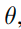
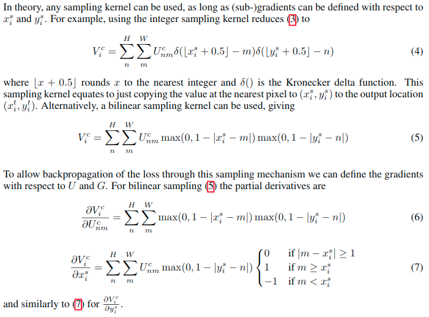

# STN(2015)

> Spatial Transformer Networks 论文: https://arxiv.org/abs/1506.02025
>
> 详细解读Spatial Transformer Networks: https://blog.csdn.net/qq_39422642/article/details/78870629
>
> 本文主要基于这篇文章和原论文进行做摘录.

## STN作用

普通的CNN能够显示的学习平移不变性, 以及隐式的学习旋转不变性, 但attention model 告诉我们, 与其让网络隐式的学习到某种能力, 不如为网络设计一个显式的处理模块, 专门处理以上的各种变换。因此, DeepMind就设计了Spatial Transformer Layer, 简称STL来完成这样的功能。

> 关于平移不变性 , 对于CNN来说, 如果移动一张图片中的物体, 那应该是不太一样的. 假设物体在图像的左上角, 我们做卷积, 采样都不会改变特征的位置, 糟糕的事情在我们把特征平滑后后接入了全连接层, 而全连接层本身并不具备 平移不变性 的特征. 但是 CNN 有一个采样层, 假设某个物体移动了很小的范围, 经过采样后, 它的输出可能和没有移动的时候是一样的, 这是 CNN 可以有小范围的平移不变性 的原因. 
>
> 但是这篇最新的论文提到, 当小尺寸图像发生平移后, CNN会出现识别错误的现象, 而且这一现象是普遍的.
>
> > https://zhuanlan.zhihu.com/p/38024868
> >
> > https://arxiv.org/pdf/1805.12177.pdf

## STN架构

如图是Spatial Transformer Networks的结构, 主要的部分一共有三个, 它们的功能和名称如下：

- 参数预测：Localisation net
- 坐标映射：Grid generator
- 像素的采集：Sampler

## STN流程

### Localisation Network

输入特征图为, 和输出 所以这个网络结构就是实现了一个这样的映射, 可以使用任何形式实现, 例如全连接或卷积网络, 但是要包含最后的回归层, 要产生转换参数.

### Grid generator

如图所示旋转缩放操作, 我们把像素点看成是坐标中的一个小方格, 输入的图片$U∈R^{H \times W \times C}$可以是一张图片, 或者feature map, 其中H表示高, W表示宽, C表示通道.

经过变换$T_θ(G)$, **$θ$是Localisation net生成的参数**, 生成了图片$V∈R^{H′ \times W′ \times C}$, 它的像素相当于被贴在了图片的固定位置上, 用$G=\{G_i\}$表示, 像素点的位置可以表示为$G_i=(x^t_i,y^t_i)$.

这就是我们在这一阶段要确定的坐标.

这里的$(x_i^t, y_i^t)$表示的是输出的目标图片的坐标, 而$x_i^s,y_i^s$是原图片的坐标, $A_\theta$表示一个仿射关系.

> 这样的放射关系是可以表述裁剪, 平移, 旋转, 缩放和倾斜等操作的, 具体解释可见文章.
>
> > 我们发现所有的这些操作, 只需要六个参数[2X3]控制就可以了, 所以我们可以把feature map U作为输入, 过连续若干层计算（如卷积、FC等）, 回归出参数θ, 在我们的例子中就是一个[2, 3]大小的6维仿射变换参数, 用于下一步计算.

但仔细一点, 这有一个非常重要的知识点,千万别混淆, 我们的坐标映射关系是：目标图片 => 原图片

也就是说, 坐标的映射关系是从目标图片映射到输入图片上的, 为什么这样呢？

其实是让目标图片在原图片上采样, 每次从原图片的不同坐标上采集像素到目标图片上, 而且要把目标图片贴满, 每次**目标图片的坐标都要遍历一遍, 是固定的**, 而采集的原图片的坐标是不固定的, 因此用这样的映射.

### Sampler

这里是根据上一步得出的采样点, 来对原始输入进行采样.

上面的公式给出了从原始图像上的坐标来得到输出$V$上指定的像素值的过程. 这里的图像插值采样核$k()$里';'后的是其参数. 而这里的$U_{nm}^c$是输入在位置(n,m)在c通道的值, 这里的$V_i^c$是在输出通道$c$的位置$(x_i^t,y_i^t)$的像素i的值. 请注意, 对于输入的每个通道, 采样是完全相同的, 因此每个通道都以相同的方式进行转换（这保留了通道之间的空间一致性）.

为了保证反向传播, 这里使用双线性插值核来进行处理. (详细解释参考博文)

## 总结

将这三个组块结合起来, 就构成了完整STN网络结构了.

这个网络可以加入到CNN的任意位置, 而且相应的计算量也很少.

将 spatial transformers 模块集成到 cnn 网络中, **允许网络自动地学习如何进行 feature map 的转变, 从而有助于降低网络训练中整体的代价**. 定位网络中输出的值, 指明了如何对 每个训练数据进行转化.

> 这是在深度学习框架下从数据中学习空间变换的第一个工作. 它通过**全局参数变换扭曲特征映射**, 例如仿射变换. 这种扭曲是昂贵的, 学习变换参数是困难的. STN在小规模图像分类问题上取得了成功. 反STN方法[37]通过**有效的变换参数传播来代替昂贵的特征扭曲**.
>
> 可变形卷积很容易集成到任何CNN架构中. 它的训练很简单. 对于要求密集(例如语义分割)或半密集(例如目标检测)预测的复杂视觉任务来说, 它是有效的. 这些任务对于STN来说是困难的(如果不是不可行的话)[26,37].

这里提示了我们, 这个STN学习的是一个针对输入的所有坐标的的一个映射, 这样明显增加了计算负担, 并且不够灵活. 同时对于"密集/半密集"任务来说, 这样的全局操作是很不合适的, 这时候应该更注意局部的处理. (个人理解)

> 可变形卷积中的偏移学习可以被认为是STN中极轻的空间变换器[26]. 然而, 可变形卷积不采用全局参数变换和特征扭曲.
>
> 相反, **它以局部密集的方式对特征映射进行采样. 为了生成新的特征映射, 它有加权求和步骤, STN中不存在.**

STN中只是直接的对于数据进行了一个映射变换, 没有加权的操作.
