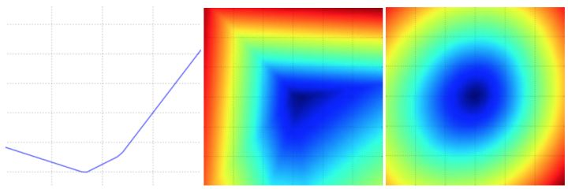

# 优化问题

## 损失函数可视化

本课中讨论的损失函数一般都是定义在高维度的空间中（比如, 在CIFAR-10中一个线性分类器的权重矩阵大小是[10x3073], 就有30730个参数）, 这样要将其可视化就很困难。然而办法还是有的, 在1个维度或者2个维度的方向上对高维空间进行切片, 就能得到一些直观感受。

例如, 随机生成一个权重矩阵, 该矩阵就与高维空间中的一个点对应. 然后**沿着某个维度方向前进的同时记录损失函数值的变化**.

换句话说, 就是生成一个随机的方向并且沿着此方向计算损失值, 计算方法是根据不同的值来计算. 这个过程将生成一个图表, 其x轴是值, y轴是损失函数值.

同样的方法还可以用在两个维度上, 通过改变来计算损失值, 从而给出二维的图像. 在图像中, 可以分别用x和y轴表示, 而损失函数的值可以用颜色变化表示：



一个无正则化的多类SVM的损失函数的图示. 左边和中间只有一个样本数据, 右边是CIFAR-10中的100个数据. **左**：a值变化在某个维度方向上对应的的损失值变化. **中和右**：两个维度方向上的损失值切片图, 蓝色部分是低损失值区域, 红色部分是高损失值区域. 注意**损失函数的分段线性结构**.

**多个样本的损失值是总体的平均值**, 所以右边的碗状结构是很多的分段线性结构的平均(比如中间这个就是其中之一).

### 损失函数的分段线性结构

我们可以通过数学公式来解释损失函数的分段线性结构. 对于一个单独的数据, 有损失函数的计算公式如下：

![Li=\sum_{j\not=y_i}[max(assets/equation-1536286267897)]](https://www.zhihu.com/equation?tex=Li%3D%5Csum_%7Bj%5Cnot%3Dy_i%7D%5Bmax%280%2Cw%5ET_jx_i-w%5ET_%7By_i%7Dx_i%2B1%29%5D)

通过公式可见, 每个样本的数据损失值是以为参数的线性函数的总和(零阈值来源于函数). 的每一行(即), 有时候它前面是一个正号(比如当它对应错误分类的时候), 有时候它前面是一个负号(比如当它是是正确分类的时候).

为进一步阐明, 假设有一个简单的数据集, 其中包含有3个只有1个维度的点, 数据集数据点有3个类别. 那么完整的无正则化SVM的损失值计算如下：


因为这些例子都是**一维**的, 所以数据和权重都是数字. 观察, 可以看到上面的式子中一些项是的线性函数, 且每一项都会与0比较, 取两者的最大值. 可作图如下：


从一个维度方向上对数据损失值的展示. x轴方向就是一个权重, y轴就是损失值. 数据损失是多个部分组合而成. 其中每个部分要么是某个权重的独立部分, 要么是该权重的线性函数与0阈值的比较. 完整的SVM数据损失就是这个形状的高维版本.

需要多说一句的是, 你可能根据SVM的损失函数的碗状外观猜出它是一个[凸函数](https://link.zhihu.com/?target=https%3A//en.wikipedia.org/wiki/Convex_function). 关于如何高效地最小化凸函数的论文有很多, 你也可以学习斯坦福大学关于([凸函数最优化](https://link.zhihu.com/?target=http%3A//stanford.edu/%7Eboyd/cvxbook/))的课程. 但是一旦我们<u>将函数扩展到神经网络, 目标函数就就不再是凸函数了</u>, 图像也不会像上面那样是个碗状, 而是凹凸不平的复杂地形形状.

*不可导的损失函数. *作为一个技术笔记, 你要注意到：由于max操作, 损失函数中存在一些*不可导点(kinks), *这些点使得损失函数不可微, 因为在这些不可导点, 梯度是没有定义的. 但是[次梯度(subgradient)](https://link.zhihu.com/?target=https%3A//en.wikipedia.org/wiki/Subderivative)依然存在且常常被使用. 在本课中, 我们将交换使用*次梯度*和*梯度*两个术语.

## 最优化

重申一下：损失函数可以量化某个具体权重集**W**的质量. 而**最优化的目标就是找到能够最小化损失函数值的W** . 我们现在就朝着这个目标前进, 实现一个能够最优化损失函数的方法. 对于有一些经验的同学, 这节课看起来有点奇怪, 因为使用的例子(SVM 损失函数)是一个凸函数问题. 但是要记得, 最终的目标是不仅仅对凸函数做最优化, 而是能够最优化一个神经网络, 而对于神经网络是不能简单的使用凸函数的最优化技巧的.

### 策略一：随机搜索

既然确认参数集**W**的好坏蛮简单的, 那第一个想到的(差劲)方法, 就是可以随机尝试很多不同的权重, 然后看其中哪个最好. 过程如下：

```python
# 假设X_train的每一列都是一个数据样本(比如3073 x 50000)
# 假设Y_train是数据样本的类别标签(比如一个长50000的一维数组)
# 假设函数L对损失函数进行评价

bestloss = float("inf") # Python assigns the highest possible float value
for num in xrange(1000):
    W = np.random.randn(10, 3073) * 0.0001 # generate random parameters
    loss = L(X_train, Y_train, W) # get the loss over the entire training set
    if loss < bestloss: # keep track of the best solution
      	bestloss = loss
    	bestW = W
  	print 'in attempt %d the loss was %f, best %f' % (num, loss, bestloss)

# 输出:
# in attempt 0 the loss was 9.401632, best 9.401632
# in attempt 1 the loss was 8.959668, best 8.959668
# in attempt 2 the loss was 9.044034, best 8.959668
# in attempt 3 the loss was 9.278948, best 8.959668
# in attempt 4 the loss was 8.857370, best 8.857370
# in attempt 5 the loss was 8.943151, best 8.857370
# in attempt 6 the loss was 8.605604, best 8.605604
# ... (trunctated: continues for 1000 lines)
```

在上面的代码中, 我们尝试了若干随机生成的权重矩阵**W**, 其中某些的损失值较小, 而另一些的损失值大些. 我们可以把这次随机搜索中找到的最好的权重**W**取出, 然后去跑测试集：

```python
# 假设X_test尺寸是[3073 x 10000], Y_test尺寸是[10000 x 1]
scores = Wbest.dot(Xte_cols) # 10 x 10000, the class scores for all test examples
# 找到在每列中评分值最大的索引(即预测的分类)
Yte_predict = np.argmax(scores, axis = 0)
# 以及计算准确率
np.mean(Yte_predict == Yte)
# 返回 0.1555
```

验证集上表现最好的权重**W**跑测试集的准确率是**15.5%, **而完全随机猜的准确率是10%, 如此看来, 这个准确率对于这样一个不经过大脑的策略来说, 还算不错嘛！

> 完全随即猜测的准确率是如何得出来的？
>
> 共有十类,猜对一种的概率为0.1.

**核心思路：迭代优化**. 当然, 我们肯定能做得更好些. 核心思路是：虽然找到最优的权重**W**非常困难, 甚至是不可能的(尤其当**W**中存的是整个神经网络的权重的时候), 但如果问题转化为：<u>对一个权重矩阵集**W**取优, 使其损失值稍微减少. 那么问题的难度就大大降低了</u>. 换句话说, 我们的方法从一个随机的**W**开始, 然后对其迭代取优, 每次都让它的损失值变得更小一点.

> 我们的策略是从随机权重开始, 然后迭代取优, 从而获得更低的损失值.

**蒙眼徒步者的比喻**：一个助于理解的比喻是把你自己想象成一个蒙着眼睛的徒步者, 正走在山地地形上, 目标是要慢慢走到山底. 在CIFAR-10的例子中, 这山是30730维的(因为**W**是3073x10). 我们在山上踩的每一点都对应一个的损失值, 该损失值可以看做该点的海拔高度.

### 策略二：随机本地搜索

第一个策略可以看做是每走一步都尝试几个随机方向, 如果某个方向是向山下的, 就向该方向走一步. 这次我们从一个随机开始, 然后生成一个随机的扰动 , 只有当的损失值变低, 我们才会更新. 这个过程的具体代码如下：

```python
W = np.random.randn(10, 3073) * 0.001 # 生成随机初始W
bestloss = float("inf")
for i in xrange(1000):
  	step_size = 0.0001
  	Wtry = W + np.random.randn(10, 3073) * step_size
  	loss = L(Xtr_cols, Ytr, Wtry)
  	if loss < bestloss:
    	W = Wtry
    	bestloss = loss
  	print 'iter %d loss is %f' % (i, bestloss)
```

使用同样的数据(1000), 这个方法可以得到**21.4%**的分类准确率. 这个比策略一好, 但是依然过于浪费计算资源.

### 策略三：跟随梯度

前两个策略中, 我们是尝试在权重空间中找到一个方向, 沿着该方向能降低损失函数的损失值. 其实不需要随机寻找方向, 因为可以直接计算出最好的方向, 这就是从数学上计算出最陡峭的方向. 这个方向就是损失函数的**梯度(gradient)**. 在蒙眼徒步者的比喻中, 这个方法就好比是感受我们脚下山体的倾斜程度, 然后向着最陡峭的下降方向下山.

在一维函数中, 斜率是函数在某一点的瞬时变化率. 梯度是函数的斜率的一般化表达, 它不是一个值, 而是一个向量. 在输入空间中, 梯度是各个维度的斜率组成的向量(或者称为导数**derivatives**). 对一维函数的求导公式如下：


当函数有多个参数的时候, 我们称导数为偏导数. 而梯度就是在每个维度上偏导数所形成的向量.

## 梯度计算

计算梯度有两种方法：一个是缓慢的近似方法(**数值梯度法**), 但实现相对简单. 另一个方法(**分析梯度法**)计算迅速, 结果精确, 但是实现时容易出错, 且需要使用微分. 现在对两种方法进行介绍：

**利用有限差值计算梯度**

上节中的公式已经给出数值计算梯度的方法. 下面代码是一个输入为函数**f**和向量**x, **计算**f**的梯度的通用函数, 它返回函数**f**在点**x处**的梯度：

```python
def eval_numerical_gradient(f, x):
    """
    一个f在x处的数值梯度法的简单实现
    - f是只有一个参数的函数
    - x是计算梯度的点
    """

    fx = f(x) # 在原点计算函数值
    grad = np.zeros(x.shape)
    h = 0.00001

    # 对x中所有的索引进行迭代
    it = np.nditer(x, flags=['multi_index'], op_flags=['readwrite'])
    while not it.finished:

        # 计算x+h处的函数值
        ix = it.multi_index
        old_value = x[ix]
        x[ix] = old_value + h # 增加h
        fxh = f(x) # 计算f(x + h)
        x[ix] = old_value # 存到前一个值中 (非常重要)

        # 计算偏导数
        grad[ix] = (fxh - fx) / h # 坡度
        it.iternext() # 到下个维度

    return grad
```

根据上面的梯度公式, 代码对所有维度进行迭代, 在每个维度上产生一个很小的变化h, 通过观察函数值变化, 计算函数在该维度上的偏导数. 最后, 所有的梯度存储在变量**grad**中.

**实践考量**：注意在数学公式中, **h**的取值是趋近于0的, 然而在实际中, 用一个很小的数值(比如例子中的1e-5)就足够了. 在不产生数值计算出错的理想前提下, 你会使用尽可能小的h. 还有, 实际中用**中心差值公式(centered difference formula)**![[f(x+h)-f(x-h)]/2h](https://www.zhihu.com/equation?tex=%5Bf%28x%2Bh%29-f%28x-h%29%5D%2F2h)效果较好. 细节可查看[wiki](https://link.zhihu.com/?target=https%3A//en.wikipedia.org/wiki/Numerical_differentiation).

可以使用上面这个公式来计算任意函数在任意点上的梯度. 下面计算权重空间中的某些随机点上, CIFAR-10损失函数的梯度：

```python
# 要使用上面的代码我们需要一个只有一个参数的函数
# (在这里参数就是权重)所以也包含了X_train和Y_train
def CIFAR10_loss_fun(W):
  	return L(X_train, Y_train, W)

W = np.random.rand(10, 3073) * 0.001 # 随机权重向量
df = eval_numerical_gradient(CIFAR10_loss_fun, W) # 得到梯度
```

梯度告诉我们损失函数在每个维度上的斜率, 以此来进行更新：

```python
loss_original = CIFAR10_loss_fun(W) # 初始损失值
print 'original loss: %f' % (loss_original, )

# 查看不同步长的效果
for step_size_log in [-10, -9, -8, -7, -6, -5,-4,-3,-2,-1]:
    step_size = 10 ** step_size_log
    W_new = W - step_size * df # 权重空间中的新位置
    loss_new = CIFAR10_loss_fun(W_new)
    print 'for step size %f new loss: %f' % (step_size, loss_new)

# 输出:
# original loss: 2.200718
# for step size 1.000000e-10 new loss: 2.200652
# for step size 1.000000e-09 new loss: 2.200057
# for step size 1.000000e-08 new loss: 2.194116
# for step size 1.000000e-07 new loss: 2.135493
# for step size 1.000000e-06 new loss: 1.647802
# for step size 1.000000e-05 new loss: 2.844355
# for step size 1.000000e-04 new loss: 25.558142
# for step size 1.000000e-03 new loss: 254.086573
# for step size 1.000000e-02 new loss: 2539.370888
# for step size 1.000000e-01 new loss: 25392.214036
```

**在梯度负方向上更新**：在上面的代码中, 为了计算**W_new**, 要注意我们是向着梯度**df**的负方向去更新, 这是因为我们希望损失函数值是降低而不是升高.

**步长的影响**：梯度指明了函数在哪个方向是变化率最大的, 但是没有指明在这个方向上应该走多远. 在后续的课程中可以看到, 选择步长(也叫作*学习率*)将会是神经网络训练中最重要(也是最头痛)的超参数设定之一.

还是用蒙眼徒步者下山的比喻, 这就好比我们可以感觉到脚朝向的不同方向上, 地形的倾斜程度不同. 但是该跨出多长的步长呢？不确定. 如果谨慎地小步走, 情况可能比较稳定但是进展较慢(这就是步长较小的情况). 相反, 如果想尽快下山, 那就大步走吧, 但结果也不一定尽如人意. 在上面的代码中就能看见反例, 在某些点如果步长过大, 反而可能越过最低点导致更高的损失值.


将步长效果视觉化的图例. 从某个具体的点W开始计算梯度(白箭头方向是负梯度方向), 梯度告诉了我们损失函数下降最陡峭的方向. 小步长下降稳定但进度慢, 大步长进展快但是风险更大. 采取大步长可能导致错过最优点, 让损失值上升. 步长(后面会称其为**学习率**)将会是我们在调参中最重要的超参数之一.

**效率问题**：你可能已经注意到, 计算数值梯度的复杂性和参数的量线性相关. 在本例中有30730个参数, 所以损失函数**每走一步**就需要计算30731次损失函数的梯度. 现代神经网络很容易就有上千万的参数, 因此这个问题只会越发严峻. 显然这个策略不适合大规模数据, 我们需要更好的策略.

> 所有的参数都要更新,所以所有的偏导都要计算一遍.而且这个偏导数是对于整个样本都要计算一遍.
>
> 小批量梯度下降/随机梯度下降

### 微分分析计算梯度

使用有限差值近似计算梯度比较简单, 但缺点在于终究只是近似(因为我们对于*h*值是选取了一个很小的数值, 但真正的梯度定义中*h*趋向0的极限), 且耗费计算资源太多. 第二个梯度计算方法是利用微分来分析, 能得到计算梯度的公式(不是近似), 用公式计算梯度速度很快, 唯一不好的就是实现的时候容易出错. 为了解决这个问题, 在实际操作时常常将分析梯度法的结果和数值梯度法的结果作比较, 以此来检查其实现的正确性, 这个步骤叫做**梯度检查**.

用SVM的损失函数在某个数据点上的计算来举例：

![L_i=\displaystyle\sum_{j\not =y_i}[max(0,w^T_jx_i-w^T_{y_i}x_i+\Delta)]](https://www.zhihu.com/equation?tex=L_i%3D%5Cdisplaystyle%5Csum_%7Bj%5Cnot+%3Dy_i%7D%5Bmax%280%2Cw%5ET_jx_i-w%5ET_%7By_i%7Dx_i%2B%5CDelta%29%5D)

可以对函数进行微分. 比如, 对进行微分得到：


其中是一个示性函数, 如果括号中的条件为真, 那么函数值为1, 如果为假, 则函数值为0. 虽然上述公式看起来复杂, 但在代码实现的时候比较简单：**只需要计算没有满足边界值的分类的数量(因此对损失函数产生了贡献), 然后乘以就是梯度了. **注意, 这个梯度只是对应正确分类的W的行向量的梯度, 那些行的梯度是：

一旦将梯度的公式微分出来, 代码实现公式并用于梯度更新就比较顺畅了.

### 梯度下降

现在可以计算损失函数的梯度了, 程序重复地计算梯度然后对参数进行更新, 这一过程称为*梯度下降*, 他的**普通**版本是这样的：

```python
# 普通的梯度下降

while True:
  	weights_grad = evaluate_gradient(loss_fun, data, weights)
  	weights += - step_size * weights_grad # 进行梯度更新
```

这个简单的循环在所有的神经网络核心库中都有. 虽然也有其他实现最优化的方法(比如LBFGS), 但是到目前为止, 梯度下降是对神经网络的损失函数最优化中最常用的方法. 课程中, 我们会在它的循环细节增加一些新的东西(比如更新的具体公式), 但是核心思想不变, 那就是我们一直跟着梯度走, 直到结果不再变化.

**小批量数据梯度下降(Mini-batch gradient descent)**：在大规模的应用中(比如ILSVRC挑战赛), 训练数据可以达到百万级量级.

如果像这样计算整个训练集, 来获得仅仅一个参数的更新就太浪费了. (**最终的损失函数是所有样本损失的平均**)一个常用的方法是计算训练集中的**小批量(batches)**数据.

例如, 在目前最高水平的卷积神经网络中, 一个典型的小批量包含256个例子, 而整个训练集是多少呢？一百二十万个. 这个小批量数据就用来实现一个参数更新：

```python
# 普通的小批量数据梯度下降
while True:
  	data_batch = sample_training_data(data, 256) # 256个数据
  	weights_grad = evaluate_gradient(loss_fun, data_batch, weights)
  	weights += - step_size * weights_grad # 参数更新
```

这个方法之所以效果不错, 是因为训练集中的数据都是相关的. 要理解这一点, 可以想象一个极端情况：在ILSVRC中的120万个图像是1000张不同图片的复制(每个类别1张图片, 每张图片有1200张复制). **那么显然计算这1200张复制图像的梯度就应该是一样的**. <u>对比120万张图片的数据损失的均值与只计算1000张的子集的数据损失均值时, 结果应该是一样的</u>.

实际情况中, 数据集肯定不会包含重复图像, 那么小批量数据的梯度就是对整个数据集梯度的一个近似. 因此, 在实践中通过计算小批量数据的梯度可以实现更快速地收敛, 并以此来进行更频繁的参数更新.

> 我们已知在梯度下降中需要对所有样本进行处理过后然后走一步, 那么如果我们的样本规模的特别大的话效率就会比较低. 假如有500万, 甚至5000万个样本(在我们的业务场景中, 一般有几千万行, 有些大数据有10亿行)的话走一轮迭代就会非常的耗时. 这个时候的梯度下降叫做full batch.
>
> 所以为了提高效率, 我们可以把样本分成等量的子集.  例如我们把100万样本分成1000份,  每份1000个样本,  这些子集就称为mini batch. 然后我们分别用一个for循环遍历这1000个子集.  针对每一个子集做一次梯度下降.  然后更新参数w和b的值. 接着到下一个子集中继续进行梯度下降.  这样在遍历完所有的mini batch之后我们相当于在梯度下降中做了1000次迭代.
>
> 我们将遍历一次所有样本的行为叫做一个 epoch, 也就是一个世代.  在mini batch下的梯度下降中做的事情其实跟full batch一样, 只不过我们训练的数据不再是所有的样本, 而是一个个的子集.  这样在mini batch我们在一个epoch中就能进行1000次的梯度下降, 而在full batch中只有一次.  这样就大大的提高了我们算法的运行速度.

小批量数据策略有个极端情况, 那就是每个批量中只有1个数据样本, 这种策略被称为**随机梯度下降(Stochastic Gradient Descent 简称SGD)**, 有时候也被称为**在线梯度下降**. 这种策略在实际情况中相对少见, 因为向量化操作的代码一次计算100个数据 比100次计算1个数据要高效很多. 即使SGD在技术上是指每次使用1个数据来计算梯度, 你还是会听到人们使用**SGD来指代小批量数据梯度下降**(或者用**MGD来指代小批量数据梯度下降**, 而BGD来指代则相对少见).

<u>小批量数据的大小(batch size)是一个超参数, 但是一般并不需要通过交叉验证来调参</u>. **它一般由存储器的限制来决定的, 或者干脆设置为同样大小, 比如32, 64, 128等. **之所以使用2的指数, 是因为在实际中许多向量化操作实现的时候, 如果输入数据量是2的倍数, 那么运算更快.

> 不能太大, 因为太大了会无限接近full batch的行为, 速度会慢.  也不能太小, 太小了以后可能算法永远不会收敛. 当然如果我们的数据比较小, 但也用不着mini batch了.
>
> full batch的效果是最好的.

### 小结


信息流的总结图例. 数据集中的(x,y)是给定的. 权重从一个随机数字开始, 且可以改变. 在前向传播时, 评分函数计算出类别的分类评分并存储在向量**f**中.

损失函数包含两个部分：数据损失和正则化损失. 其中, 数据损失计算的是分类评分f和实际标签y之间的差异, 正则化损失只是一个关于权重的函数.

在梯度下降过程中, 我们计算权重的梯度(如果愿意的话, 也可以计算数据上的梯度), 然后使用它们来实现参数的更新.

> 计算数据上的梯度又怎样理解？
>
> 可以反映出数据的变化, 对于最后损失的影响.

在本节课中：

* 将损失函数比作了一个**高维度的最优化地形**, 并尝试到达它的最底部. 最优化的工作过程可以看做一个蒙着眼睛的徒步者希望摸索着走到山的底部. 在例子中, 可见SVM的损失函数是分段线性的, 并且是碗状的.
* 提出了迭代优化的思想, 从一个随机的权重开始, 然后一步步地让损失值变小, 直到最小.
* 函数的**梯度**给出了该函数最陡峭的**上升方向**. 介绍了利用有限的差值来近似计算梯度的方法, 该方法实现简单但是效率较低(有限差值就是*h*, 用来计算数值梯度).
* 参数更新需要有技巧地设置**步长**. 也叫学习率. 如果步长太小, 进度稳定但是缓慢, 如果步长太大, 进度快但是可能有风险.
* 讨论权衡了数值梯度法和分析梯度法. 数值梯度法计算简单, 但结果只是近似且耗费计算资源. 分析梯度法计算准确迅速但是实现容易出错, 而且需要对梯度公式进行推导的数学基本功. 因此, 在实际中使用分析梯度法, 然后使用**梯度检查**来检查其实现正确与否, <u>其本质就是将分析梯度法的结果与数值梯度法的计算结果对比. </u>
* 介绍了**梯度下降**算法, 它在循环中迭代地计算梯度并更新参数.

**预告**：这节课的核心内容是：理解并能计算损失函数关于权重的梯度, 是设计、训练和理解神经网络的核心能力. 下节中, 将介绍如何使用链式法则来高效地计算梯度, 也就是通常所说的**反向传播(backpropagation)机制**. 该机制能够对包含卷积神经网络在内的几乎所有类型的神经网络的损失函数进行高效的最优化.
