## LeNet-5

## AlexNet

后来出现的[ZFNet][]，是对于AlexNet的在超参数上的一个改进。

## VGGNet

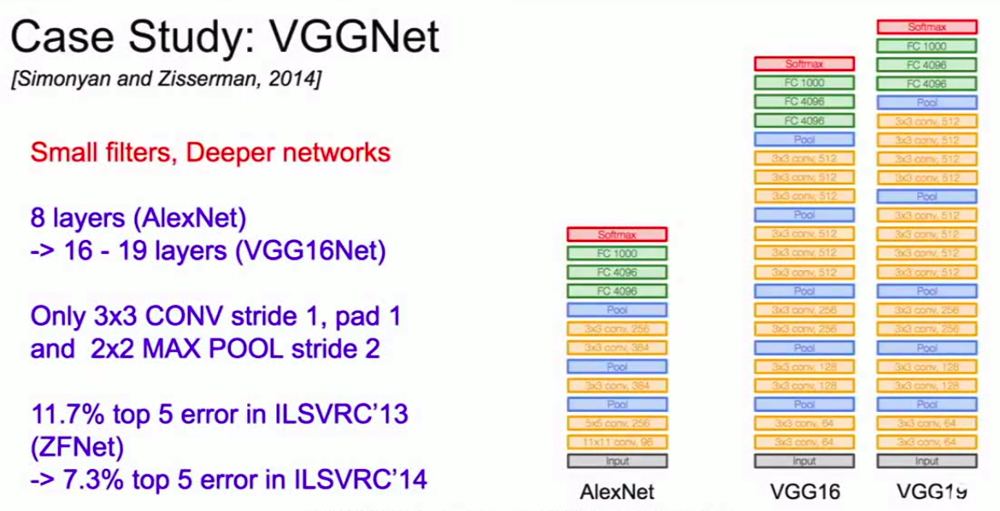

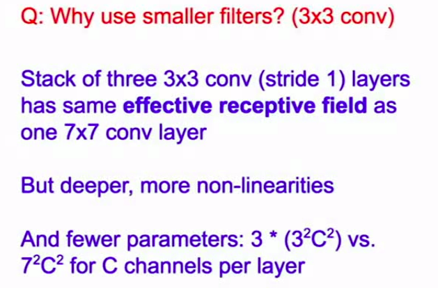

这里提到了三个3×3的卷积核的感受野和一个7×7的卷积核感受野是一致的。

在这个排列下，第一个卷积层中的每个神经元都对输入数据体有一个3x3的视野。**第二个卷积层上的神经元对第一个卷积层有一个3x3的视野**，也就是**对输入数据体有5x5的视野**。同样，在**第三个卷积层上的神经元对第二个卷积层有3x3的视野**，也就是**对输入数据体有7x7的视野**。

但是参数确实更少。对于一个3\*3\*C的卷积核，三个时所需要参数为3\*[(3\*3\*C)\*C]，因为为了保持前后深度的连贯性，每个卷积层都是有深度C，所以这里是`[(3*3*C)*C]`,类似的7\*7有$7^2C^2$.

## GoogLeNet

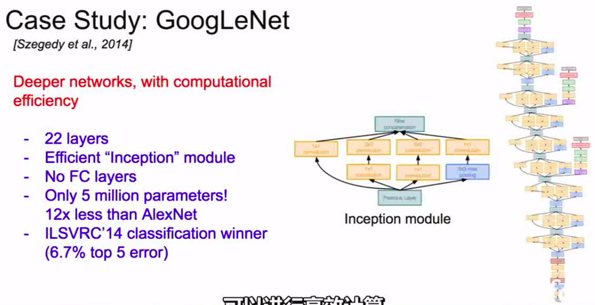

使用了Inception module，而且**不再使用全连接层**，降低了参数量，而且也并未受太大影响。

### Inception module

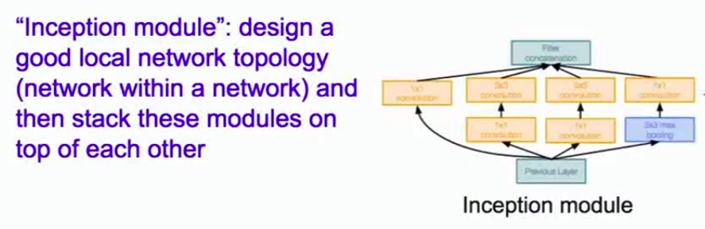

关键是对于同一个输入应用不同的滤波操作以及汇聚操作，提取不同的特征。权重不再共享了。

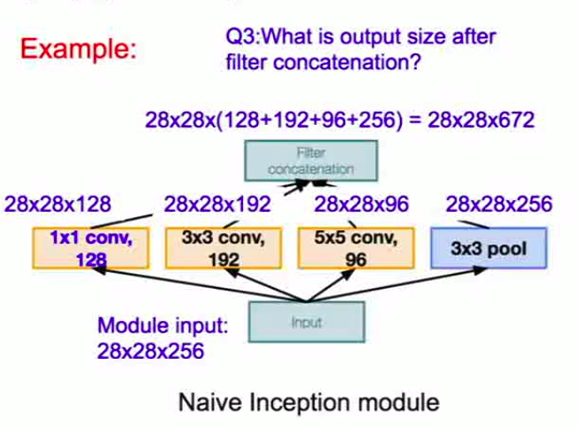

保证了相同的尺寸，主要通过padding来实现添加。

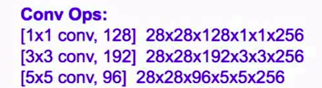

每个输出的元素，都经历了整个卷积核元素数量次乘法运算。但是计算资源耗用也是极大的。

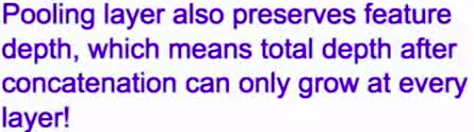

汇聚层可以用来保留原本的特征层的深度，所以在每一次，深度只能增加，将在汇聚层获得本层深度，在卷积层获得额外的深度。

### bottleneck layers

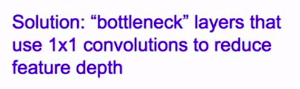

通过使用1*1的卷积核，但是深度更少的卷积层来降低特征深度，进而一定程度上降低运算复杂度。

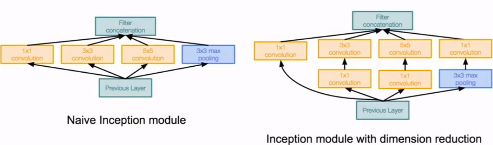

右图中的1*1卷积层就是添加进来的瓶颈层。

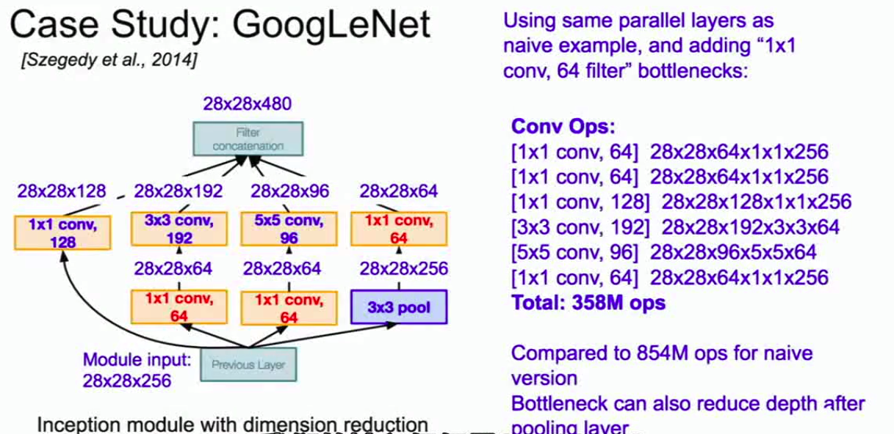

调整后，变成了这样的情况。一定程度上降低了运算复杂性。

### 辅助输出

结构上侧边有两个辅助分类输出。

可以在前面的几个层得到更多的梯度训练。

这些辅助分类输出，并不是为了让类获得更好的分类性能所需要的，这是一种可以将额外的梯度直接注入到网络下层的方法，这是在批量标准化出现之前。一旦网络有了BN，就不需要这样技巧来让这些深层的模型收敛。

## ResNet

是深度网络的一次革命。

它有两个很好的属性：

1. 如果将残差块的所有权值设定为0，那么所有残差块是恒等的。所以某种程度上而言，这种模型是更为容易训练的。并不需要添加额外的层。在神经网络中，使用L2正则化，将迫使所有的参数趋近于0，在残差网络中，将会促使模型不再使用它不需要的层，因为它只是促使残差块趋于同一性，也就不需要进行分类。

   > 怎么理解“也就不需要进行分类”？

2. 残差网络与反向路径中的梯度流有关。在反向传播时，经过一个加法门时，将会沿着两个不同的路径，所以上有梯度会通过这些卷积块，也会通过这些残差连接，直接连接到梯度，块堆叠在一起的时候，这些残差连接给梯度提供了一个“高速公路”，使得梯度在整个网络中，进行反向传播。这使得网络可以更快更容易得到训练。

   > 这里应该指的就是直接跨过来的线，可以使梯度抄近道，尽快的计算？

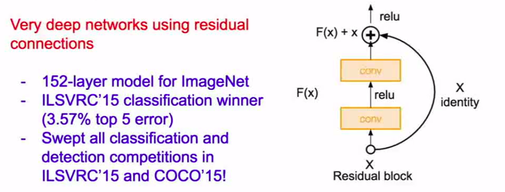

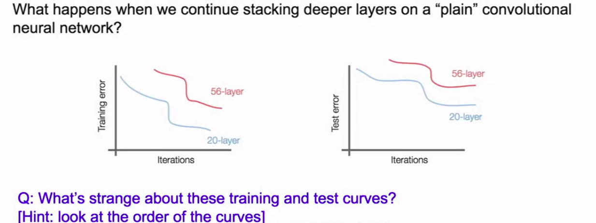

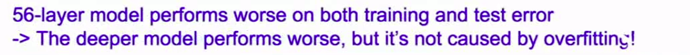

这并不是过拟合造成的问题。

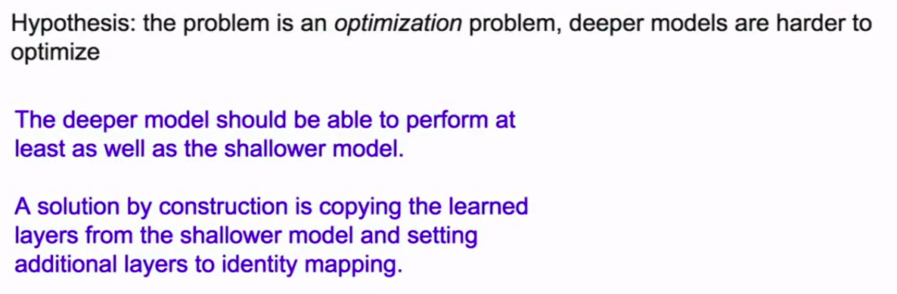

预先假设问题是一个优化问题，进而提出以了一些学习观点——通过复制浅层网络的已经学习好的层并且设定额外的层来实现恒等映射。

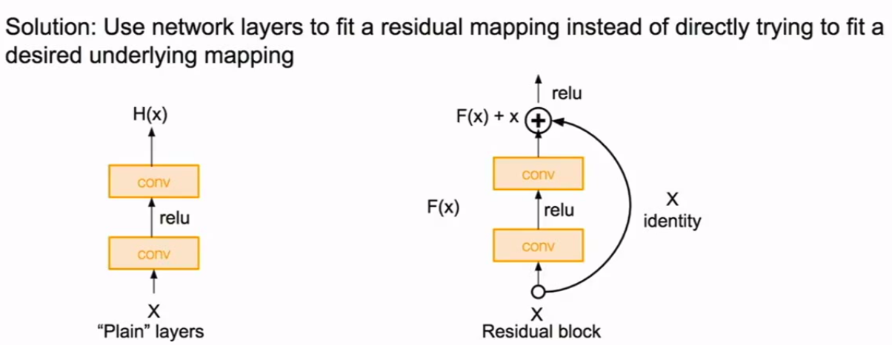

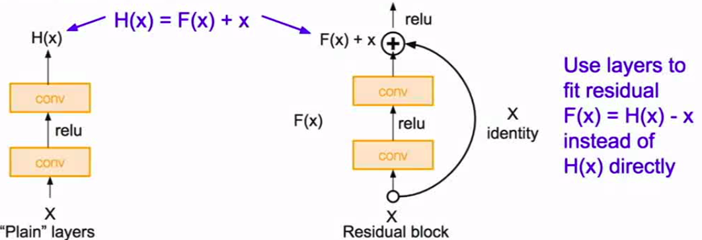

实际上，这里的F(x)就是指所谓的“残差”。

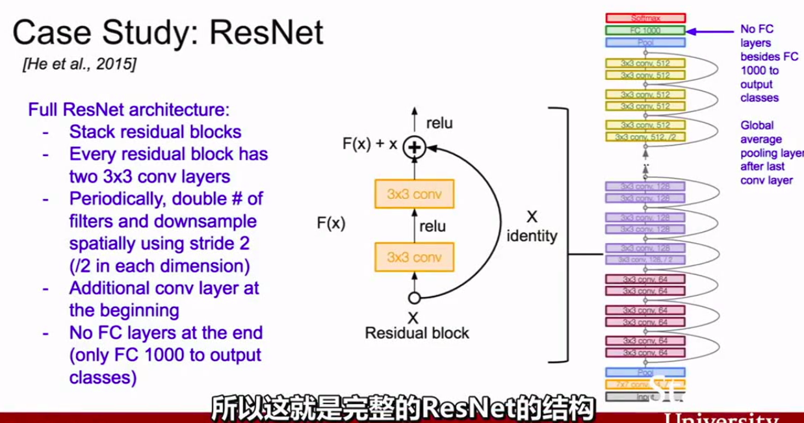

使用多次叠加的残差块，每个残差块都是有两个3*3的卷积层，只是不同块深度不同。并且使用步长为2的下采样。另外在开始有额外的卷积层，结尾没有全连接层，而是在最后一个卷积层后有一个全局的平均汇聚层。

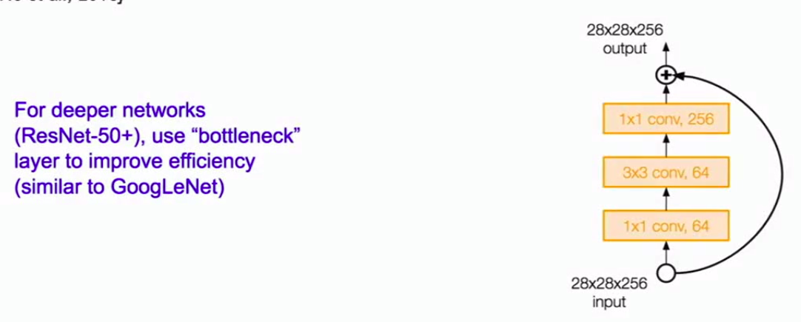

在很深的残差网络的时候，也会使用类似于GoogLeNet的瓶颈层来提升有效性。

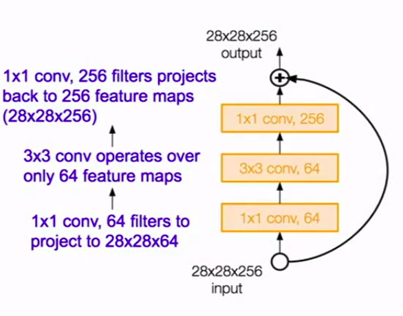

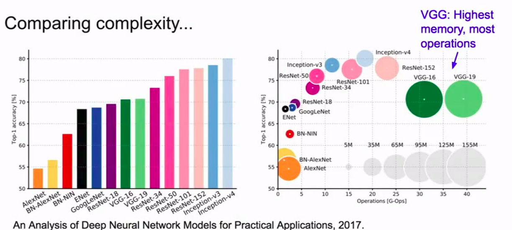

##  NiN

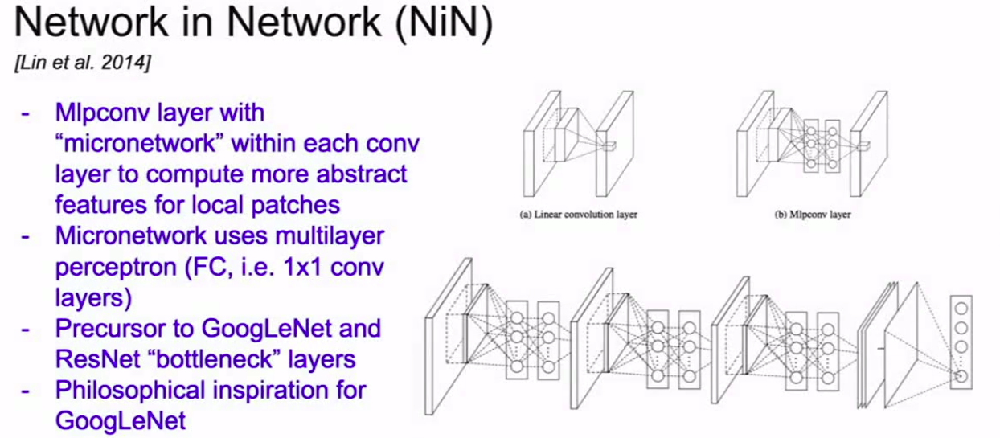

## Wide ResNet

让每层的块更宽。

## RwsNeXt

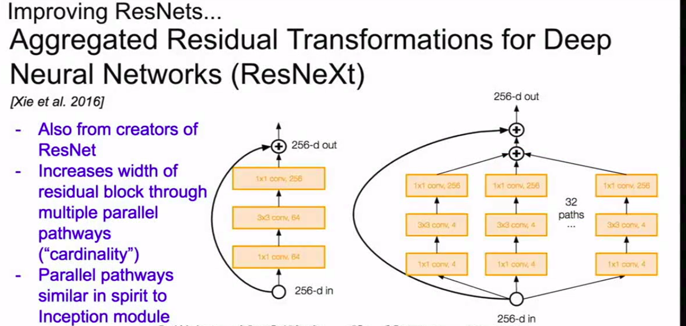

## Stochastic Depth

## FractalNet

> FractalNet&DenseNet使用了额外的拓扑结构（快捷或恒等连接），使得梯度从网络末端的损失层，更容易流向整个网络中的不同层。

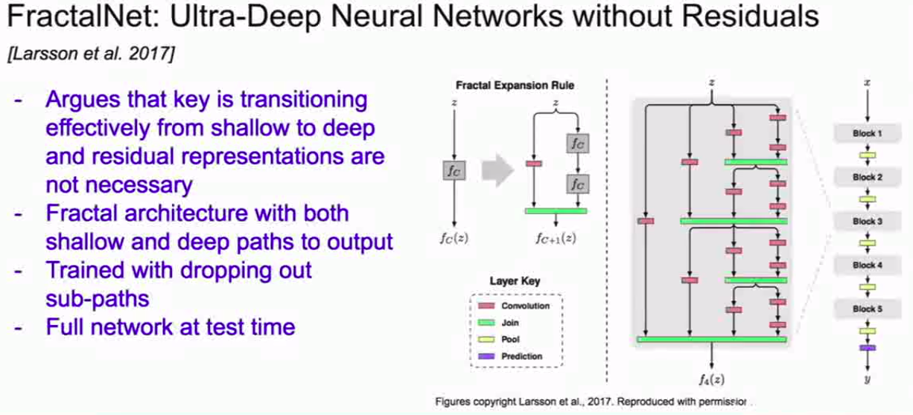

## DenseNet

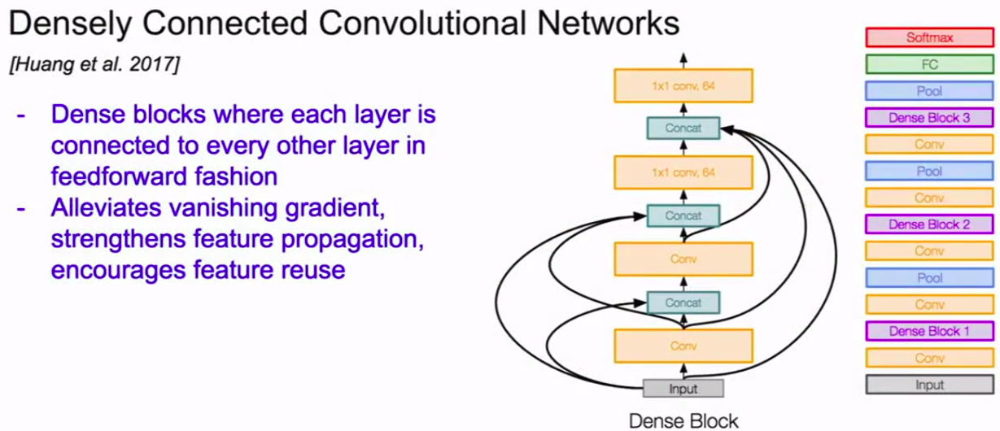

训练的每个输出都在为多层做输入。

## SqueezeNet

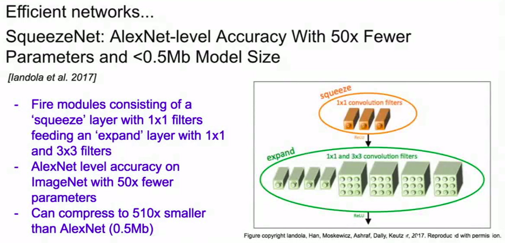

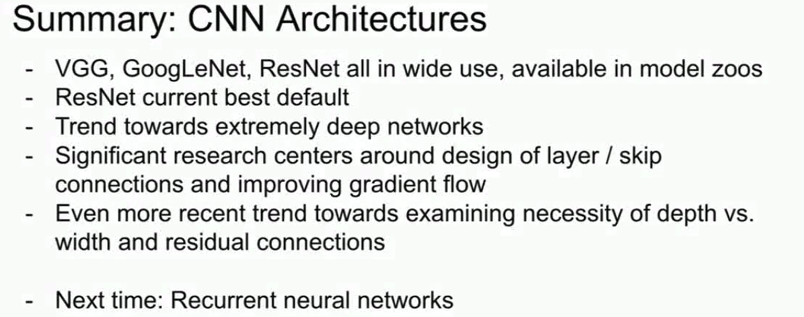

ResNet目前广泛使用，效果最好。趋势确实朝着更深的网络前进，目前的研究主要围绕layer/skip的链接设计并提升梯度流计算。