# 图像常见任务(待整理)

## 分割(segmentation)

如今，**语义分割**是计算机视觉领域的关键问题之一。纵观全局，语义分割是为完整场景理解铺平道路的高级任务之一。场景理解作为核心计算机视觉问题的重要性突出表现在越来越多的应用程序通过从图像推断知识而滋养。其中一些应用包括自动驾驶车辆，人机交互，虚拟现实等。随着近年来深度学习的普及，许多语义分割问题正在使用深层架构解决，最常见的是卷积神经网络，超越其他方法在准确性和效率方面有很大差距。

语义分割与目标检测的结合.现在有很多方法已经被人们所实现来解决物体分割的问题.效果比较好的是Mask R-CNN.

有些类似于Faster R-CNN,也包含了多步处理,将整张图送入**卷积网络**和**训练好的候选框生成网络**,得到训练好的候选框后,我们把这些候选框投射到卷积特征图上,就像是Fast R-CNN&Faster R-CNN所做的那样,但是这里不是在进行分类,或者回归预测边界框,而是对每个边界框预测出一个分割区域.

在每个我们从候选框生成网络中得到的候选框中,这更像是一个语义分割问题.

在我们将得到的候选框对齐到特征后,对应的候选框就有了正确的尺寸,然后我们就有了两个分支.

* 上图中上面的分支将会预测类别分数,告诉我们对应的候选框,属于哪个类或者是不是背景.我们也预测边界框的坐标,通过回归预测候选框的坐标.
* 右面的分支节本看起来更像是语义分割的微型网络,会对输入候选框的像素进行分类,确定这是不是输入某个物体.

> Mask R-CNN也可以做物体识别/姿态估计/物体分割.
>
> 速度非常快,因为相当于是Faster R-CNN的小改进,相当于是通过单次前向传播解决的.
>
> 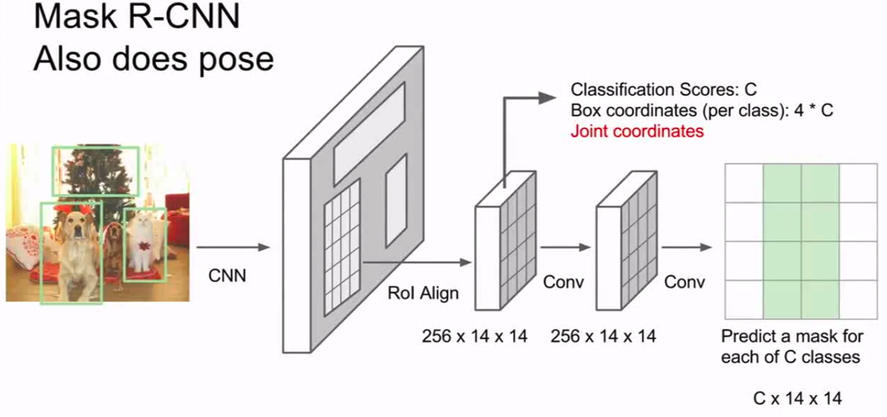

> https://www.zhihu.com/question/51704852
>
> 
>
> 这张图清楚说明了image classification, object detection, semantic segmentation, instance segmentation之间的关系

> 详细介绍了图像分割
>
> https://medium.com/nanonets/how-to-do-image-segmentation-using-deep-learning-c673cc5862ef
>
> 1. 基于区域的语义分割
> 2. 基于完全卷积网络的语义分割
> 3. 弱监督语义分割

## 分类(classification)&定位(localization)

### 常见流程

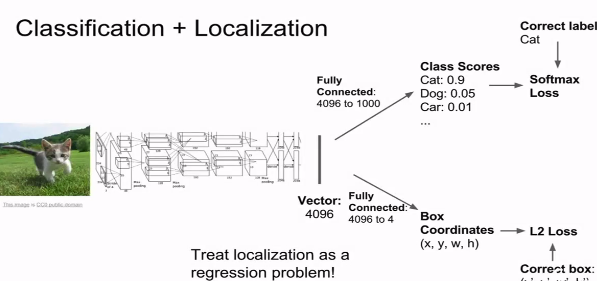

对于全监督模型:

1. 使用巨大的卷积网络处理图片,作为输入.获得一些向量总结图像内容.

2. 向量->全连接->Box Coordinates:(x,y,w,h)(输入图像的边界框坐标)

3. 从向量获得Class Scores(这里假定softmax分类)

4. 获得两组损失,对某类分类以及分类边界计算损失.->**多重任务损失**

5. 对于最终损失可以通过利用一些参数,将两者加权求和,来计算总的梯度.

   > 在这里,参数对于最后的损失值影响较大,合理选择参数也是一种挑战.
   >
   > 可以尝试用你所**关心的性能指标组成的矩阵**,来取代原本的损失值.实际上也就是在用最终的性能矩阵,做交叉验证,而不是仅盯着损失值来选择参数.

#### 姿态估计

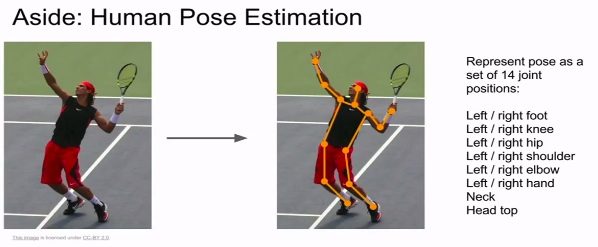

> 分类问题损失:交叉熵损失/softmax损失/SVM边界损失等
>
> 回归问题损失:L1/L2等

### Saliency Maps

(针对有监督问题)

遮挡可以用来判断图像中的哪部分对于分类来说是重要的.

Saliency Maps也是一种手段.从另一个角度解决这个问题的方法.

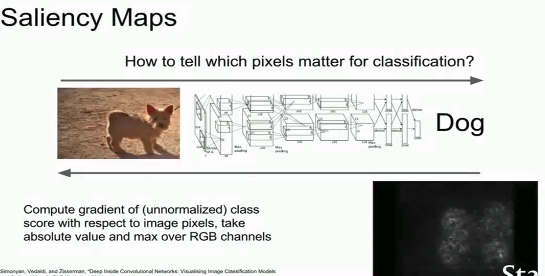

> 语义分割的时候也会用到显著图的方法,在没有任何直接的标签数据的情况下,来进行语义分割.
>
> 论文作者使用了Grabcut分割算法.
>
> 一般我们反向传播 CNN 的时候，是可以得到图片的梯度（Image Gradient）的，但是因为网络要学习的参数是权重 W，因此都不会用到这个梯度。
>
>  [Deep Inside Convolutional Networks: Visualising Image Classification Models and Saliency Maps](https://arxiv.org/abs/1312.6034) 这篇论文可视化了一下图片的梯度，称作是 saliency map，发现其实是**网络对不同处像素值关注的权重**。得到的结果甚至可以辅助做 segmentation 问题。
>
> 通俗来说就是，给定一张图片X，我们想要知道到底是图片中的哪些部分决定了该图片的最终分类结果，我们可以通过反向传播求出X关于loss function的偏导矩阵，这个偏导矩阵就是该图片的**图像梯度**，然后计算出**类显著度图**（class saliency map, csm）。
>
> [Karen Simonyan论文的3.1节](https://arxiv.org/pdf/1312.6034.pdf)给出了计算方法：
>
> * 如果图片是灰度图，那么csm就取图像梯度的绝对值；
> * 如果是RGB图，csm就取图像梯度3个通道中绝对值最大的那个通道。
>
> csm中元素值的大小表示对应位置的图片像素对最终分类结果的影响程度。

> 疑问:
>
> A friend of yours suggests that in order to find an image that maximizes the correct score, we can perform gradient ascent on the input image, but instead of the gradient we can actually use the saliency map in each step to update the image. Is this assertion true? Why or why not?

## 检测(detection)

因为在目标检测中,每张图像的对象数量是不定的,并且你无法预知具体的个数,因此把对象识别问题等同于回归问题考虑时,会十分棘手.

> 这里为什么是回归问题?因为输出的结果是坐标,是连续值.

因此,人们尝试使用另一种方式来解决对象识别问题,其中的一个广泛应用的想法是滑动窗口.

但是对于这种方法有个难点,就是窗口大小的问题.

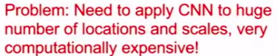

所以实际中,人们并不会用这种方法来解决基于CNN的对象识别问题.

### R-CNN

相反,人们会使用一种叫做**候选区域(Region Proposals)**的方法,深度学习种不常见,更像是传统的计算机视觉方法.

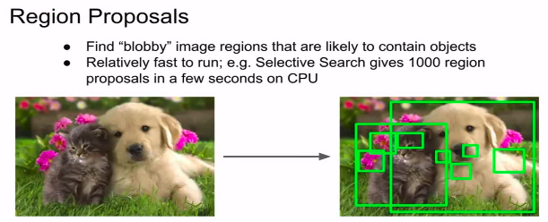

候选区域网络更多的采用了类似信号处理/图像处理等方法来建立候选清单,所以对给定的输入图像,候选区域网络会在对象周围给出上千个框,这时我们就可以进行定位,寻找图像边界,划定闭合边界的box.

候选区域网络会在图像中寻找点状的候选区域,也就是对象可能出现的区域,这样算法跑起来很快,一个常见的候选区域方法就是目标检测(Selective Search).

不同与使用分类网络,在凸显的歌各个位置各个范围进行搜索,先使用候选区域网络,找到物体可能存在的候选区域,再应用卷积神经网络对这些候选区域进行分类,这样比穷尽搜索杨来的更容易一些.

> 可见R-CNN论文

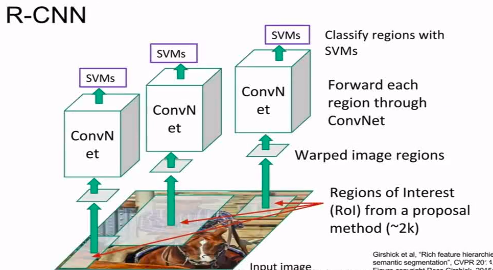

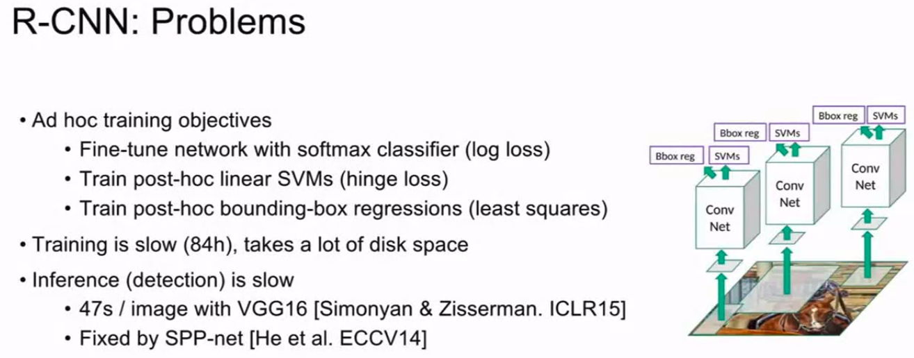

### Fast R-CNN

先不使用候选区域处理,而是通过一些卷积层,整个图像去运行,得到整个图像的高分辨率特征映射,仍旧要选用一些候选区域,但不是固定算法(如Selective Search),而是**切分图像的像素**,针对候选区域,我们现在基于候选区域投影到卷及特征的映射,之后**从卷积特征映射提取属于备选区域的卷积块,而不是直接截取候选区域,通过对整个图像进行处理,可以重用很多卷积计算**.

当我们有很多小块(crops),如果在下游还有很多的全连接层,这些全连接层的输入,应该是固定尺寸的,所以我们需要对从卷积映射提取的图像进行整形(用可微的方法,用兴趣区域池化层),当你通过卷积特征映射,得到这些小块.

可以通过全连接层,运行这些输入,预测分类结果.以及对包围盒的线性回归补偿.

当训练这个的时候,在反向传播,我们有一个多任务损失,要在这两个约束之间做取舍,我们可以基于全局反向传播同时学习.

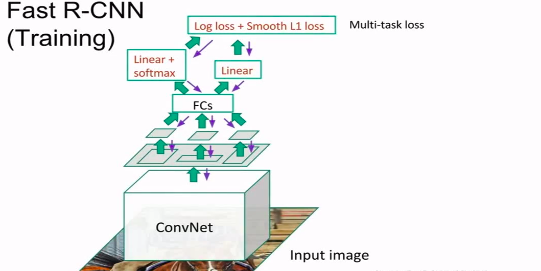

改进模型的瓶颈在于寻找候选区域上.

### Faster R-CNN

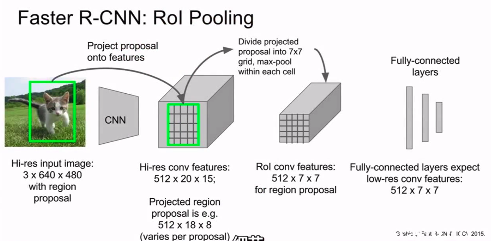

性能上效果速度更快,效果也好一些.

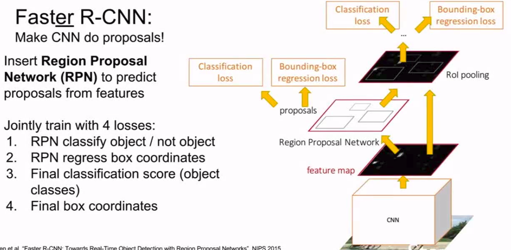

问题在于**使用固定函数计算备选区域成为瓶颈**,我们去让网络自身做这个预测.这里使用了一个独立的候选区域网络来工作于卷积特征的上层,在网络内部预测自己的备选区域,得到备选区域后,从这些备选区域和特征映射中取出块,作为输入传至下一层.

对于多任务损失,以及多任务训练网络去一次性做完这些,我们告诉神经网络四件事,同时做完,如何平衡这些事情,有些麻烦,因为区域选择网络需要做两件事,对于每个备选区域,他们是否是待识别物体,同时要对包围盒进行校正,最后网络还需要再做这两件事,来决定最终分类,也可以进行第二轮box回归,也可以进行第二轮参数校正,校正之前来源与区域选择阶段的错误.

1. 如何训练区域选择网络?
   
   解决方法是,设置区域选择网络与真值重叠的阈值,当大于这个阈值的时候,判断为正,就可以拿这个做区域选择.这里会涉及到很多较为魔幻的超参数,比较复杂.

2. 什么是区域选择模型的分类损失?
   
   就是简单的二分类损失.

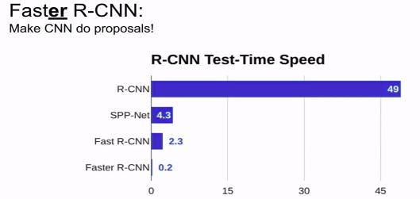

### YOLO/SSD

SSD不需要对于区域进行处理.速度相对较快.

## 总结

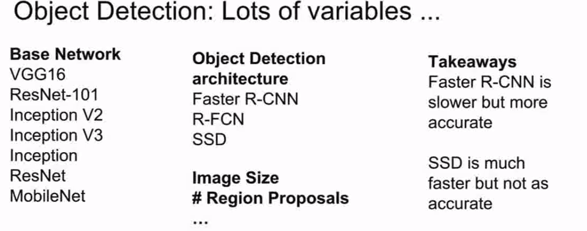

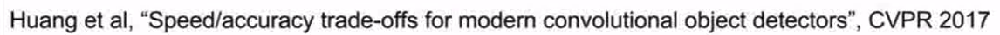

## Dense Captioning(密集检测)

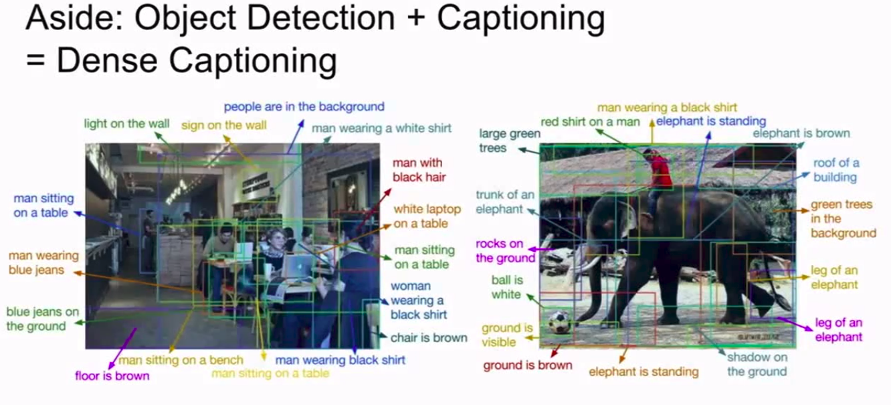

