# DAG-Recurrent Neural Networks For Scene Labeling(2015)

> 看完<Scene Parsing via Dense Recurrent Neural Networks with Attentional Selection(2018)>后, 再看这篇文章, 主要想要知道的是如何对于图像进行有向图的建模, 具体的"图像单元"指的是什么. 具体细节需要了解下.

## 关键点

* 引入RNN来利用长期上下文依赖
* 使用DAG-RNN来处理DAG结构化图像
* 提出了一种新的针对罕见类的类权重函数，显著提高了对非频繁类的识别精度
* 集成了卷积与反卷积网络

## 简介

场景标记是指将一个语义类与场景图像中的每个像素相关联。它通常被定义为基于其周围图像块的多类分类问题。但是，在特写视图(近距离拍摄的照片)中，某些类可能无法区分.

图中, 对于具有有限背景的人来说，“沙子”和“道路”像素难以区分。相比之下，当它们被考虑在全局场景中时，它们的差异变得显著。因此，如何**使局部特征具有更广泛的语境意识**是图像标注中的一个关键问题。

为了解决这一问题，本文**引入了递归神经网络(RNN)，通过对局部特征的上下文依赖关系的建模来解决这一问题**。特别地，我们**采用无向循环图(UCG)来模拟图像单元之间的相互作用**。由于UCG的循环特性，RNN不能直接适用于UCG结构的图像。因此，将UCG分解为几个有向无环图(在我们的实验中使用四个DAG)。换句话说，一个UCG结构的图像是由几个DAG结构图像的组合来近似的。

然后，开发了DAG-RNN，它是RNN的一种推广，用来处理DAG结构的图像。通过**将DAG-RNN应用于相应的DAG结构图像，独立地生成每个隐藏层，并将它们集成以生成上下文软件特征映射**。在这种情况下，局部表示可以嵌入图像的抽象主旨，从而显著增强了对图像的判别力。

**将DAG-RNN与卷积和反卷层相结合，从而形成端到端的可训练的全标签网络**。在功能上，卷积层将RGB原始像素转换为紧凑和可判别的本地表示, 基于这些, 提出的DAG-RNN模拟局部特征的上下文依赖，并输出改进的上下文感知表示。反卷积层对特征图进行上采样以匹配所需输出的维度。总体而言，全标记网络接受可变大小的图像，并在单个前馈网络传递中生成相应的密集标签预测映射。

此外，考虑到类频率分布是高度不平衡的自然场景图像，我们**提出了一种新的类权重函数**，可以用于罕见的类。

我们在三个流行和具有挑战性的场景标记基准上测试所提出的标记网络（SiftFlow，CamVid和巴塞罗那）。在这些数据集上，我们知道我们的DAG-RNN能够极大地增强局部表示的判别能力，从而导致基线（CNN，甚至是VGG16网络）的显着性能提升。同时，所**提出的类加权函数能够提高稀有类的识别准确度**。最重要的是，我们的完整标签网络明显优于当前最先进的方法。

## 相关工作

场景标记（也称为场景解析，语义分割）是计算机视觉中最具挑战性的问题之一。近年来它受到越来越多的关注。在这里，我们要强调和讨论与我们最相关的三行作品。

第一部分工作是探索上下文建模。

* 堆叠不同尺度的上下文窗口
* 增加输入窗口的大小
* 采用递归神经网络将全局上下文传播到局部区域

这些没有考虑任何图像单元的结构, 因此，它们的相关性没有得到有效捕获。相反，论文将图像解释为UCG，其中连接允许DAG-RNN明确地模拟图像单元之间的依赖。

另一种尝试是通过构建概率图形模型（PGM）将上下文传递给局部分类器

* 在二阶条件随机场（CRF）中形成unary and pairwise features
* 建立一个完全连通的图表来加强更高阶的标签一致性
* 在一个非参数框架里, 对全局顺序依赖进行建模, 消除局部混淆的歧义(...models the global-order dependencies in a non-parametric framework to disambiguate the local confusions.)

文中提出的内容不同于这些, 首先，标签依赖性是根据PGM中的兼容性函数定义的，而这种依赖性是通过RNN中的循环权重矩阵建模的。此外，PGM的推断是低效的，因为局部信念的收敛通常需要多次迭代。相比之下，RNN只需要一个前向传递来传播本地信息。

以前的一些工作以不同的方式利用“循环”的想法。它们通常指的是在不同的迭代（层）中反复应用标识模型。

* 将RGB原始数据与卷积神经网络（CNN）的输出相连接，为下一层中的相同CNN产生输入
* 使用分类器的输出增加patch特征作为下一次迭代的输入，并且在不同的迭代中共享分类参数
* 将条件随机场（CRF）转换为神经网络，因此CRF的推断等于反复应用相同的神经网络，直到达到某个固定点（收敛）

文章工作明显不同。他们以中间输出（通常是局部信念）的形式对上下文进行建模，隐含地对邻域信息进行编码。相比之下，通过循环连接传播信息，在DAG-RNN中, 明确地模拟了上下文依赖。

RNN已经在链结构化数据（例如自然语言和语音）的时间依赖性建模方面取得了很大成功。

* 应用1D-RNN来模拟图像分类中的弱上下文依赖性
* 将1D-RNN一般化为多维RNN（MDRNN），并将其应用于离线阿拉伯语手写识别
* 还采用2D-RNN进行真实世界的图像标注
* 最近也有考虑树形结构（句子的组成/解析树）有助于对句子的全局表示进行建模

我们提出的DAG-RNN是chain-RNN ，tree-RNN 和2D-RNN的演化, 它使网络能够对图结构图像模拟长距离语义依赖。和我们最相关的工作是[22]。比较如下:

* 论文将2D-RNN推广到DAG-RNN并在定量标记性能中显示出了益处
* 论文将卷积层，反卷积层与DAG-RNN整合到一个完整的标记网络
* 论文采用一种新的类加权函数来解决自然场景图像中极度不平衡的类分布问题

论文的工作是首次尝试将卷积层与RNN整合到端到端的可训练网络中，以进行真实的图像标记。此外，所提出的完整网络在各种场景标记基准下, 实现了最先进的表现。

## 网络结构

为了密集标记image I，图像由三个不同的功能层顺序处理：

* 卷积层产生相应的特征map x。每个特征向量都会对来自I中的局部区域的信息进行简要说明。
* DAG-RNN模拟元素inx之间的上下文依赖关系，并生成中间特征maph，其元素是一个特征向量，它隐含地嵌入了图像的抽象要点
* Deconvo-lution层对特征图进行上采样。从中导出密集标签预测图。我们首先介绍所提出的DAG-RNN，并在以下各节详细介绍了完整网络的细节
* 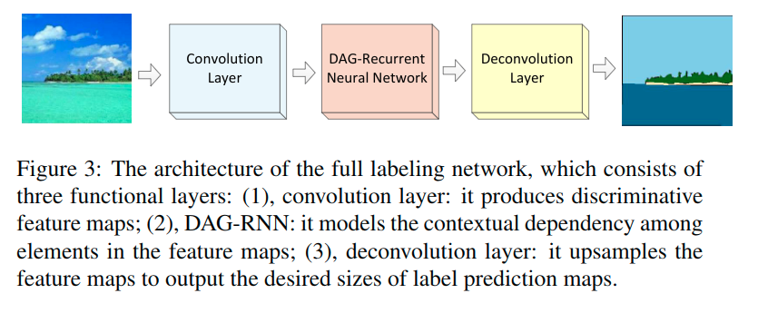

### DAG-RNN计算

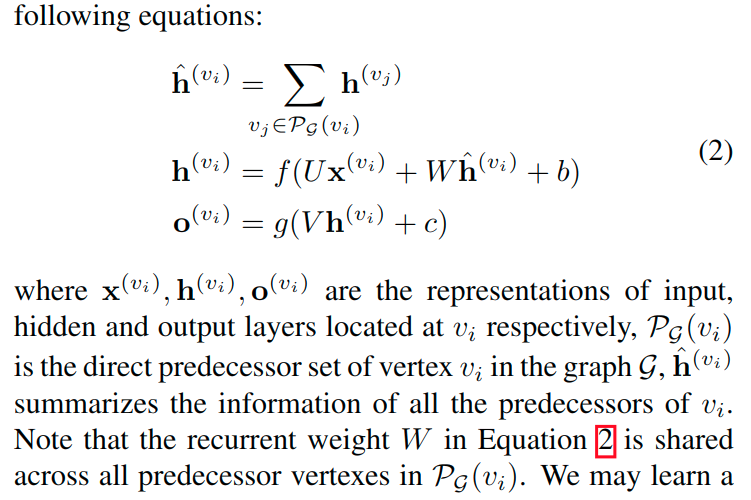

### 整体DAG-RNN

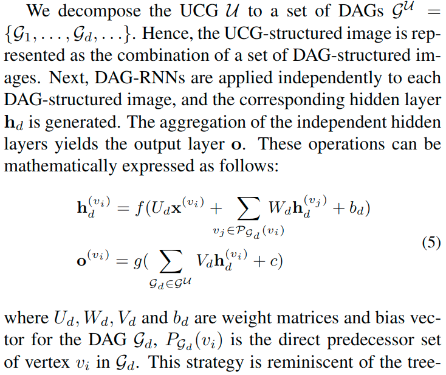

这里考虑以下关于分解的标准。拓扑上，DAG的组合应该与UCG等效，因此任何两个顶点都可以达到。此外，DAG的组合应该允许将本地信息路由到图像中的任何位置。在论文的实验中，使用了四个上下文传播方向（东南，西南，西北和东北）来分解UCG。在图2中示出了在东南方向上诱导的8邻域UCG的DAG的一个示例。

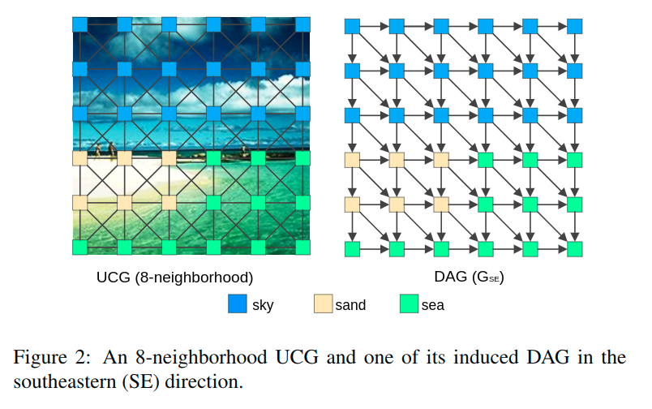

### 损失函数

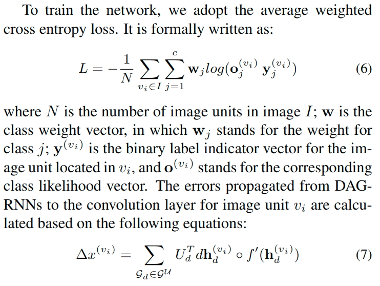

### 处理类别不平衡

在场景图像中，类分布非常不平衡。也就是说，很少的类别占图像中大百分比的像素。

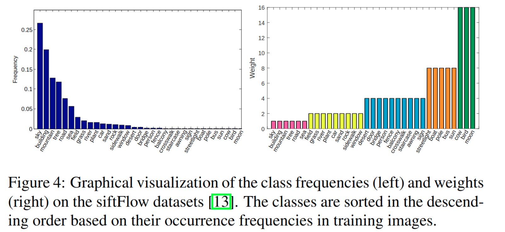

在图4中演示了一个例子。因此，为了提高他们的识别精度，通常会更多关注类别。在基于patch的CNN训练中，Farabet等人和Shuai等人过度采样罕见类别像素来解决这个问题。然而，在网络训练中采用这种策略是不合适的，这是一个复杂结构学习问题。同时，由于这些类在场景图像中被严重地不均衡分布，因此根据它们的反向频率来衡量它们也是有问题的。

例如，SiftFlow数据集中最常见（天空）和最罕见类（月亮）之间的频率比为$3.5 \times 10^4$。如果在[15]中采用上述类权重标准，那么频繁的类将会被低估。因此，我们定义加权函数w如下:

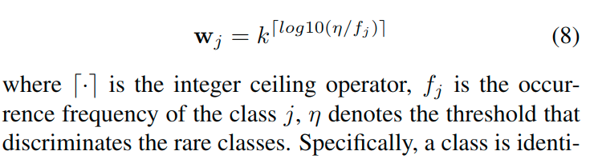

$f_j < \eta$ 则认定为罕见类, 否则为频繁类. $f_j < \eta$ 这样导致k的指数为正, 在实验中, k为2, 它控制着罕见类的重要程度.

有以下特性:

* 为罕见类赋予更高的权重
* 罕见类别的关注程度基于 *关于阈值的比率大小* 呈指数增长

用于确定值$\eta$的标准: 所有非罕见类的累计频率是85%, 这里称其为 *85%-15%规则*.

## 测试

### 基线模型

卷积神经网络（CNN），它共同学习特征和分类器，被用作我们的第一个基线。在这种情况下，参数被优化以最大化局部patch的独立预测精度。

另一个基线是与我们的DAG-RNN共享相同架构的网络，同时消除了循环连接。数学上，方程式5的Wd和bd固定为0。在这种情况下，DAG-RNN退化为四个普通双层神经网络（CNN-ENN）的集合。

这些基线和DAG-RNN之间的性能差异清楚地说明了我们的依赖建模方法的有效性.

### 实验使用的基本网络

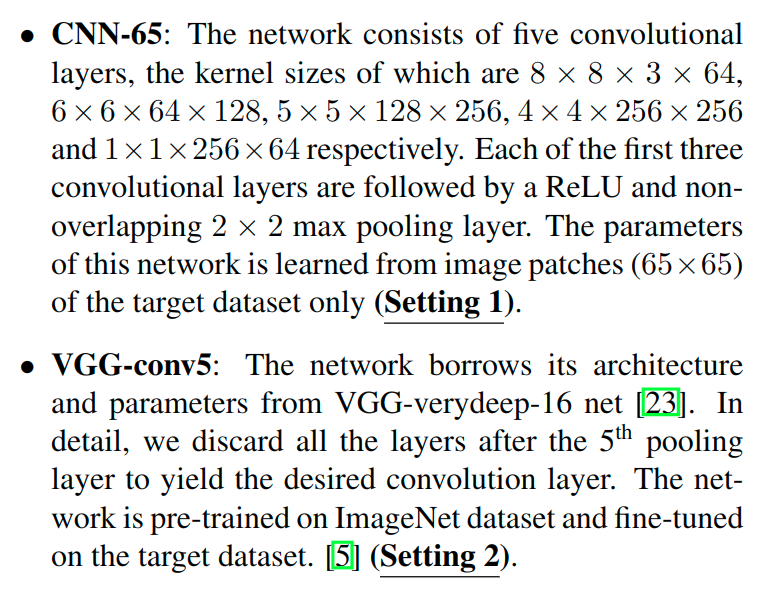

DAG-RNN在隐含层使用ReLU, 在反卷积输出g上使用softmax.

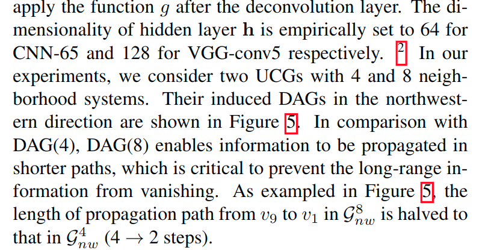

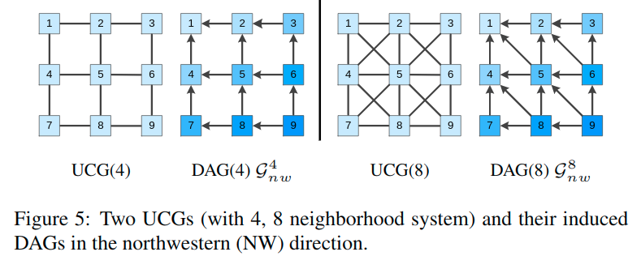

通过随机梯度下降与动量训练整个网络。一个图像完成前向和后向传递后，参数会更新。学习率初始化为0.001, 并且以10周期0.9的倍率指数衰减.报告的结果是基于35个epoches的.

###  SiftFlow Dataset

SiftFlow数据集通常从8个典型的室外场景中捕获2688个图像。每个图像有256个256像素，属于33个语义类之一。我们采用[13]提供的训练/测试分割方法（2488/200）来执行我们的实验。

按照85％-15％的标准，类频率阈值 $\eta = 0.05$。从33个类别来看，其中27个被认为是不常见的类别。图4描述了不同类别的权重的图形可视化。

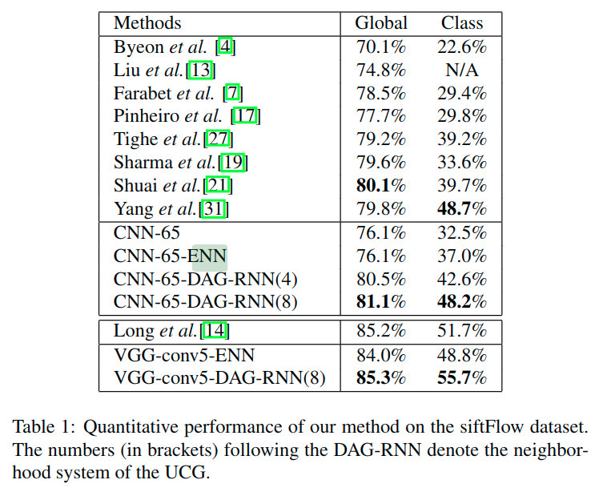

###  CamVid Dataset

CamVid数据集[2]包含来自白天和黄昏（3个白天和1个黄昏视频序列）4个驾驶视频的**701个高分辨率图像（960x720像素）**。图像密集标记为**32个语义类**。我们遵循通常的拆分协议(468/233)来获得训练/测试图像。与其他作品类似，我们仅报告最常见的11类别的结果。根据85％-15％规则，4个类别被识别为"罕见"，而$\eta$是0.1。

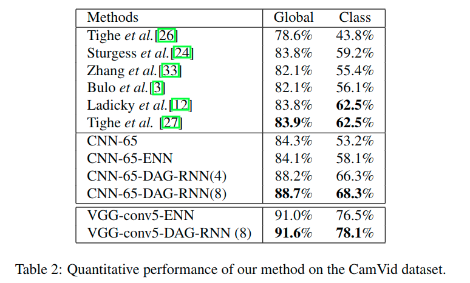

###  Barcelona Dataset

巴塞罗那数据集包括**14871张训练和279张测试图像**。图像的大小在不同的实例中变化，并且每个像素被标记为**170个语义类别**中的一个. 训练图像的范围从室内到室外场景，而测试图像仅限于巴塞罗那街景。这些问题使巴塞罗那成为一个非常具有挑战性的数据集。根据85％-15％规则，147个类被确定为罕见类，并且类频率阈值$\eta$为0.005。

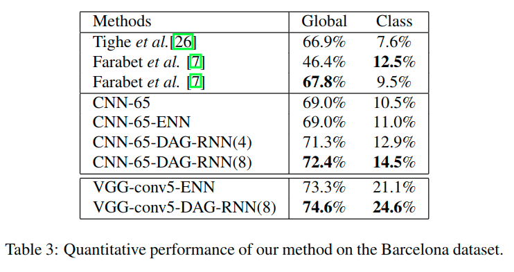

###  Effects of DAG-RNNs to Per-class Accuracy

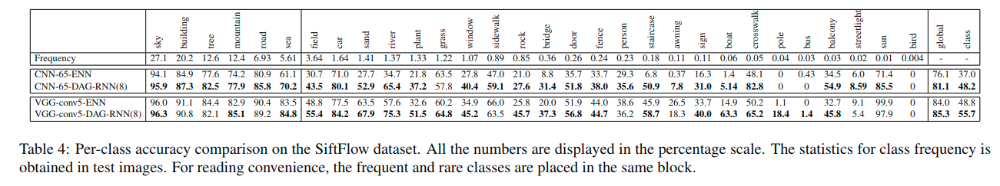

在本节中，我们将研究DAG-RNN对每个类别的影响。表4中列出了SpeedFlow数据集的详细的每类的精度。在设置1下，我们发现通过我们的DAG-RNN（8）编码的上下文信息对几乎所有类都有益。在这种情况下，(反映出来)CNN-65的局部表示不强，因此通过对其依赖性进行建模可以极大地提高它们的判别力。与此一致，我们观察到几乎所有类别的卓越绩效（+ 11.2％）。在设置2下，VGG-conv5网络在ImageNet上进行了预训练，它可以很好地识别大多数类。尽管局部表示在这种情况下具有高度辨别力，但我们的DAG-RNN（8）进一步极大地改善了他们对罕见类别的代表性能力。统计上，我们观察到罕见类的准确度增加了8.6％。在这两种设置下，**对本地特征的依赖关系进行建模使得分类能够进行上下文感知。因此，局部模糊性在很大程度上得到缓解**。然而，我们没有观察到极小的“对象”类（例如鸟类和公共汽车）的精确度提高，我们推测*弱的本地信息可能已被上下文所淹没*（例如图1中，一只小鸟被天空吞噬）。

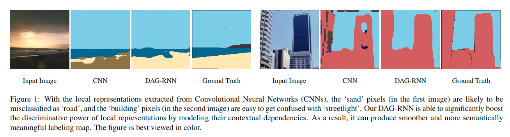

###  Discussion of Modeled Dependency

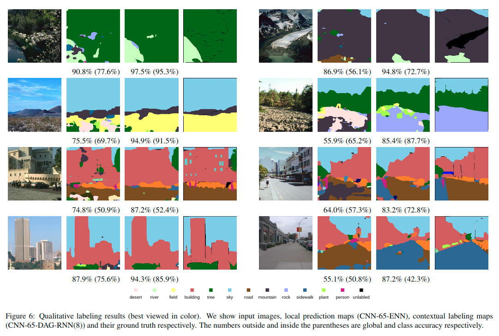

从上述结果可以反映出来, DAG-RNN能够

* 加强局部一致性：邻域像素可能使用相同标签标注

    在图6中，左侧面板示例显示使用我们的DAG-RNN可以一定程度上平滑混淆区域。

* 确保语义连贯性：在空间上很远的像素通常被赋予可以在有意义的场景中出现的标签

    例如，在“开阔的乡村”场景中，“沙漠”和“山峰”类通常不会与“树木”一起被看到，因此在右侧的第二个示例中，它们被更正为“石头”。右侧面板中显示了更多类似的例子。这些结果表明我们的DAG-RNN可能捕获了长短距离的上下文依赖。

## 总结

* 在本文中，提出DAG-RNN来处理DAG结构化数据，其中局部特征之间的相互作用在图形结构中被考虑。DAG-RNN能够将图像的抽象要素编码为局部表示，从而极大地增强了它们的判别能力。

* 此外，提出了一种新的分类函数来解决不平衡类分布问题，并且实验证明它对于罕见类的识别增强是有效的。

* DAG-RNN与卷积和反卷积层交织，在三个挑战的场景标记基准上实现了最先进的结果。
* 还证明了DAG-RNN捕获了有用的远距离上下文依赖，这有助于在实践中生成平滑而且语义敏感的标记映射。