# Automatic Portrait Segmentation for Image Stylization

> 项目: <http://xiaoyongshen.me/webpage_portrait/index.html>
> 论文: <http://xiaoyongshen.me/webpage_portrait/papers/portrait_eg16.pdf>
> 翻译: <https://liqiang311.github.io/%E6%B7%B1%E5%BA%A6%E5%AD%A6%E4%B9%A0/Automatic-Portrait-Segmentation-for-Image-Stylization-%E7%BF%BB%E8%AF%91%E5%AD%A6%E4%B9%A0/>

* [Automatic Portrait Segmentation for Image Stylization](#automatic-portrait-segmentation-for-image-stylization)
  * [Abstract](#abstract)
  * [引言](#引言)
  * [Related Work](#related-work)
    * [Interactive Image Selection](#interactive-image-selection)
    * [CNNs for Image segmentation](#cnns-for-image-segmentation)
    * [Image Matting](#image-matting)
    * [Semantic Stylization](#semantic-stylization)
  * [Our Motivation and Approach](#our-motivation-and-approach)
    * [Fully Convolutional Neutral Networks](#fully-convolutional-neutral-networks)
    * [Understandings for Our Task](#understandings-for-our-task)
    * [Our Approach](#our-approach)
      * [Position Channels](#position-channels)
      * [Shape Channel](#shape-channel)
  * [Data and Model Training](#data-and-model-training)
    * [Data Preparation](#data-preparation)
    * [Model Training](#model-training)
    * [Running Time for Training and Testing](#running-time-for-training-and-testing)
  * [Results and Applications](#results-and-applications)
    * [Quantitative and Visual Analysis](#quantitative-and-visual-analysis)
    * [Post-processing](#post-processing)
    * [User Study of Our Method](#user-study-of-our-method)
    * [Automatic Segmentation for Image Stylization](#automatic-segmentation-for-image-stylization)
    * [Other Applications](#other-applications)
  * [Conclusions and Future Work](#conclusions-and-future-work)
  * [补充资料](#补充资料)
    * [homography](#homography)

## Abstract

肖像是摄影和绘画的主要艺术形式。在大多数情况下，艺术家试图使主体从周围突出，例如，使其更亮或更锐利。在数字世界中，通过使用适合于图像语义的照相或绘画滤镜处理肖像图像，可以实现类似的效果。虽然存在用于描述主题的成功的用户引导方法，但缺乏全自动技术并且产生不令人满意的结果。我们的论文首先通过引入专用于肖像的新自动分割算法来解决这个问题。然后我们在此结果的基础上描述了几个利用我们的自动分割算法生成高质量肖像的肖像滤镜。

## 引言

随着相机智能手机的迅速普及，自拍肖像在数码摄影中变得非常丰富。三星英国的一项研究估计，大约30％的智能手机拍摄照片是自画像[Hal]，最近，HTC的成像专家Symon Whitehorn提到，在一些市场中，自拍肖像占智能手机照片的90％[Mic]。

这些肖像的大部分都是由休闲摄影师拍摄的，他们往往缺乏必要的技能，无法始终如一地拍摄好的照片，或成功地对其进行后期处理。即使是易于使用的是适合新手摄影师的易使用的自动图像滤镜, 良好的肖像后期处理需要将目标与背景分开，以便使得目标可以突出。有很多好的用户指导工具可用于创建有选择性地处理肖像主体的掩膜，但这些工具仍然很乏味且难以使用，并且对于希望他们的肖像看起来很好的休闲摄影师来说仍然是一个障碍。虽然很多图像滤镜操作, 当被选择性地用来处理肖像照片时，一些特别适用于肖像的照片包括背景替换，肖像风格转换[SPB*14]，色彩和色调增强(color and tone enhancement) [HSGL11]以及局部特征编辑[LCDL08]。虽然这些都可以用于很好的效果，几乎没有用户互动，但由于依赖于良好的选择，它们仍然对于休闲摄影师而言, 并不能很好的利用。

A fully automatic portrait segmentation method is required to make these techniques accessible to the masses(大众). Unfortunately, designing such an automatic portrait segmentation system is nontrivial. Even with access to robust facial feature detectors and smart selection techniques such as graph cuts, complicated backgrounds and backgrounds whose color statistics are similar to those of the subject readily lead to poor results. (即使能够访问强大的面部特征检测器和诸如图形切割的智能选择技术，复杂的背景和背景，其颜色统计与主题相似，容易导致差的结果。)

In this paper, we propose a fully automatic portrait segmentation technique that **takes a portrait image and produces a score map of equal resolution**. This score map indicates the **probability** that a given pixel belongs to the subject, and can be used directly as a softmask, or thresholded to a binary mask or trimap for use with image matting techniques.

To accomplish this, we take advantage of recent advances in deep convolutional neural networks (CNNs) which have set new performance standards for sematic segmentation tasks such as Pascal VOC [EGW∗10] and Microsoft COCO [LMB∗14]. We augment one such network with portrait-specific knowledge to achieve extremely high accuracy that is more than sufficient for most automatic portrait post-processing techniques, unlocking arange of portrait editing operations previously unavailable to the novice photographer, while simultaneously reducing the amount of work required to generate these selections for intermediate and advanced users.

为了实现这一目标，我们利用深度卷积神经网络（CNN）的最新进展，这些网络为诸如 Pascal VOC [EGW\*10] 和 Microsoft COCO [LMB\*14] 等语义分割任务设定了新的性能标准。我们通过肖像专用知识扩充一个这样的网络，以实现极高的准确性，这对于大多数自动肖像后处理技术来说已经足够了，解锁了新手摄影师以前无法获得的一系列肖像编辑操作，同时减少了所需的工作量为中级和高级用户生成这些选择。

To our knowledge, our method is the first one designed for automatic portrait segmentation. The main contributions of our approach are:

* We extend the FCN-8s framework [LSD14] to leverage do main specific knowledge by introducing new portrait position and shape input channels.
* We build a portrait image segmentation dataset and benchmark for our model training and testing.
* We augment several interactive portrait editing methods with ourmethod to make them fully automatic.

据我们所知，我们的方法是第一个设计用于自动肖像分割的方法。我们的方法的主要贡献是：

* 我们扩展了FCN-8s框架[LSD14]，通过引入新的肖像位置和形状输入渠道来利用领域特定知识。
* 我们为模型培训和测试构建了一个肖像图像分割数据集和基准。
* 我们使用我们的方法增强了几种交互式肖像编辑方法，使其完全自动化。

## Related Work

Our work is related to work in both image segmentation and image stylization. The following sections provide a brief overview on several main segmentation methodologies(方法) (interactive, learning based, and image matting), as well as some background on various portrait-specific stylization algorithms.

我们的工作与图像分割和图像风格化相关。以下部分简要介绍了几种主要的分割方法（交互式，基于学习的和图像matte），以及各种肖像特定风格化算法的背景知识。

### Interactive Image Selection

We divide interactive image segmentation methods into scribble-based, painting-based and boundary-based methods.

* In the scribble-based methods, the user specifies a number of foreground and background scribbles as boundary conditions for a variety of different optimizations including graph cut methods [BJ01,LSTS04,RKB04], geodesic distance scheme [BS07], random walks framework [Gra06] and the dense CRF method [KK11].
* Compared with scribble-based methods, the painting based method only needs to paint over the object the user wants to select. Popular methods and implementations include painting image selection [LSS09], and Adobe Photoshop quick selection [ADO].
* The object can also be selected by tracing along the boundary. For example, Snakes [KWT88] and Intelligent Scissors [MB95] compute the object boundary by tracking the user’s input rough boundaries. However, this requires accurate user interactions which can be very difficult, especially in the face of complicated boundaries.

* 在基于涂鸦的方法中，用户指定多个前景和背景涂鸦作为各种不同优化的边界条件，包括图形切割方法[BJ01，LSTS04，RKB04]，测地距离方案[BS07]，随机游走框架[Gra06]和密集的CRF方法[KK11]。
* 与基于scribble的方法相比，基于绘画的方法只需要绘制用户想要选择的对象。流行的方法和实现包括绘画图像选择[LSS09]和Adobe Photoshop快速选择[ADO]。
* 也可以通过沿边界追踪来选择对象。例如，Snakes [KWT88]和Intelligent Scissors [MB95]通过跟踪用户的输入粗略边界来计算对象边界。然而，这需要准确的用户交互，这可能非常困难，尤其是在面对复杂的边界时。

Although the interactive selection methods are prevalent in image processing software, their tedious and complicated interaction(繁琐复杂的互动) limits many potentially automatic image processing applications.

### CNNs for Image segmentation

A number of approaches based on deep convolutional neural networks (CNNs) have been proposed to tackle image segmentation tasks. They apply CNNs in two main ways.

1. The first one is **to learn the meaningful features and then apply classification methods to infer the pixel label**. Representative methods include [AHG∗12,MYS14,FCNL13], but they are optimized to work for a lot of different classes, rather than focusing specifically on portraits. As with our FCN-8s tests, one can use their “person class” for segmentation, but the results are not accurate enough on portraits to be used for stylization.
2. The second way is to **directly learn a nonlinear model from the images to the label map**. Long et al.[LSD14] introduce fully convolutional networks in which several well-known classification networks are “convolutionalized”. In their work, they also introduce a skip architecture in which connections from early layers to later layers were used to combine low-level and high-level featurecues. Following this framework, DeepLab [CPK∗14] and CRFas-RNN [ZJR∗15] apply dense CRF optimization to refine the CNNs predicted label map. Because *deep CNNs need large-scale training data to achieve good performance*, Dai et al.[DHS15] proposed the BoxSup which only requires easily obtained bounding box annotations instead of the pixel labeled data. It produced comparable results compared with the pixel labeled training data under the same CNNs settings.

These CNNs were designed for image segmentation tasks and the state-of-the-art accuracy for Pascal VOC is around 70%. Although they outperform other methods, the accuracy is still insufficient for inclusion in an automatic portrait processing system.

### Image Matting

*Image matting is the other important technique for image selection.*

For natural image matting, a thorough survey(彻底的调查) can be found in [WC07]. Here we review some popular works relevant to our technique.

*The matting problem is ill-posed and severely underconstrained.* These methods generally **require initial user defined foreground and background annotations, or alternatively a trimap which encodes the foreground, background and unknown matte values**.

According to different formulations, the matte’s unknown pixels can be estimated by Bayesian matting [CCSS01], Poisson matting [SJTS04], Closed-form matting [LLW08], KNN matting[CLT13], etc.

To evaluate the different methods, Rhemann et al.[RRW∗09] proposed a quantitative online benchmarks. For our purposes, the disadvantages of these methods is their reliance on the user to specify the trimap(在我们看来，这些方法的缺点是他们依赖于用户来指定trimap。).

### Semantic Stylization

Our portrait segmentation technique incorporates high level semantic understanding of portrait images to help it achieve state of the art segmentation results which can then be used for subject-aware portrait stylization.

我们的肖像分割技术结合了对肖像图像的高级语义理解，以帮助其实现最先进的分割结果，然后可用于主体感知的肖像风格化。

Here we highlight a sampling of other works which also take advantage of portrait-specific semantics for image processing and stylization.

* [SPB∗14] uses facial feature locations and sift flow to create robust dense mappings between user input portraits, and professional examples to allow for facial feature-accurate transfer of image style.
* In [LCODL08], a database of inter-facial-feature distance vectors and user attractiveness ratings is used to compute 2D warp fields which can take an input portrait, and automatically remap it to a more attractive pose and expression.
* And finally [CLR∗04] is able to generate high-quality non-photo relistic drawings by leveraging a semantic decomposition of the main face features and hair for generating artistic strokes.

在这里，我们重点介绍其他作品的样本，以便利用肖像特定的语义进行图像处理和风格化。

* [SPB * 14]使用面部特征位置和筛选流程在用户输入的特征之间创建稳健的密集映射，以及专业示例，以允许面部特征准确地传递图像样式。
* 在[LCODL08]中，使用面部特征距离矢量和用户吸引力等级的数据库来计算可以拍摄输入肖像的2D经线场，并且自动地将其重新映射到更具吸引力的姿势和表达。
* 最后，[CLR * 04]能够通过利用主要特征和头发的语义分解来生成艺术笔画，从而生成高质量的非照片级绘图。

## Our Motivation and Approach

Deep learning achieves state-of-the-art performance on semantic image segmentation tasks. Our automatic portrait segmentation method also applies deep learning to the problem of semantic segmentation, while leveraging portrait-specific features.

Our framework is shown in Figure3 and is detailed in Section3.3.

We start with a brief description of the fully convolutional neural network(FCN) [LSD14] upon which our technique is built.

深度学习在语义图像分割任务中实现了最先进的性能。我们的自动肖像分割方法还将深度学习应用于语义识别问题，同时利用特定于肖像的特征。我们的框架工作如图3所示，详见第3.3节。我们首先简要介绍完全卷积神经网络（FCN）[LSD14]，我们的技术建立在其上。

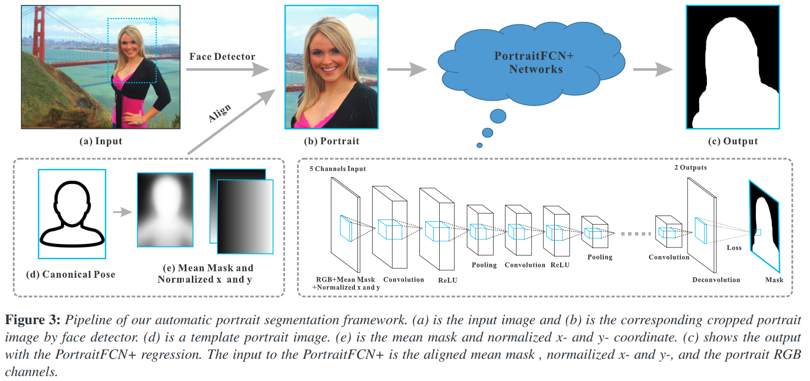

### Fully Convolutional Neutral Networks

As mentioned in the previous section, many modern semantic image segmentation frameworks are based on the fully convolutional neutral network (FCN) [LSD14] which replaces the fully connected layers of a classification network with convolutional layers. **The FCN uses a spatial loss function and is formulated as a pixel regression problem against the ground-truth labeled mask**.

如前一节所述，许多现代语义图像分割框架基于完全卷积神经网络（FCN）[LSD14]，它用卷积层代替分类网络的完全连接层。 **FCN使用空间损失函数，并且被制定为针对真实标记掩模的像素回归问题**。

The objective function can be written as

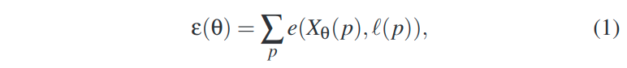

* $p$ is the pixel index of an image.
* $X_θ(p)$ is the FCN regression function in pixel $p$ with parameter $θ$.
* The loss function $e(., .)$ measures the error between the regression output and the ground truth $ℓ(p)$.

FCNs are typically composed of the following types of layers:

* Convolution Layers: This layer applies a number of convolution kernels to the previous layer. The convolution kernels are trained to **extract important features from the images such as edges, corners or other informative region representations**.
* ReLU Layers: The ReLU is a nonlinear activation to the input. The function is $f(x) = max(0, x)$. This nonlinearity helps the network compute nontrivial solutions on the training data.
* Pooling Layers: These layers compute the max or average value of a particular feature over a region in order to reduce the feature’s spatial variance.
* Deconvolution Layers: Deconvolution layers learn kernels to upsample the previous layers. This layer is central in making the output of the network match the size of the input image after previous pooling layers have downsampled the layer size.
* Loss Layer: This layer is used during training to measure the error (Equation 1) between the output of the network and the ground truth. For a segmentation labeling task, the loss layer is computed by the softmax function.

Weights for these layers are learned by backpropagation using stochastic gradient descent (SGD) solver.

### Understandings for Our Task

The fully convolutional network (FCN) used for this work is originally trained for semantic object segmentation on the Pascal VOC dataset for twenty class object segmentation.

Although the dataset includes a person class, it still suffers from poor segmentation accuracy on our portrait image dataset as shown in Figure 4 (b).

The reasons are mainly:

1. The low resolution of people in the Pascal VOC constrains the effectiveness of inference on our high resolution portrait image dataset. Pascal VOC中人的低分辨率限制了对我们的高分辨率肖像图像数据的推断的有效性。
2. The original model outputs multiple labels to indicate different object classes which introduces ambiguities in our task which only needs two labels. We address these two issues by labeling a new portrait segmentation dataset for fine-tuning the model and changing the label outputs to only the background and the foreground. We show results of this approach and refer to it in the paper as PortraitFCN. 原始模型输出多个标签以指示不同的对象类，这在我们的任务中引入了模糊，只需要两个标签。我们通过标记新的肖像分割数据集微调模型来解决这两个问题, 并将标签输出更改为仅背景和前景。我们展示了这种方法的结果，并在论文中将其称为PortraitFCN。

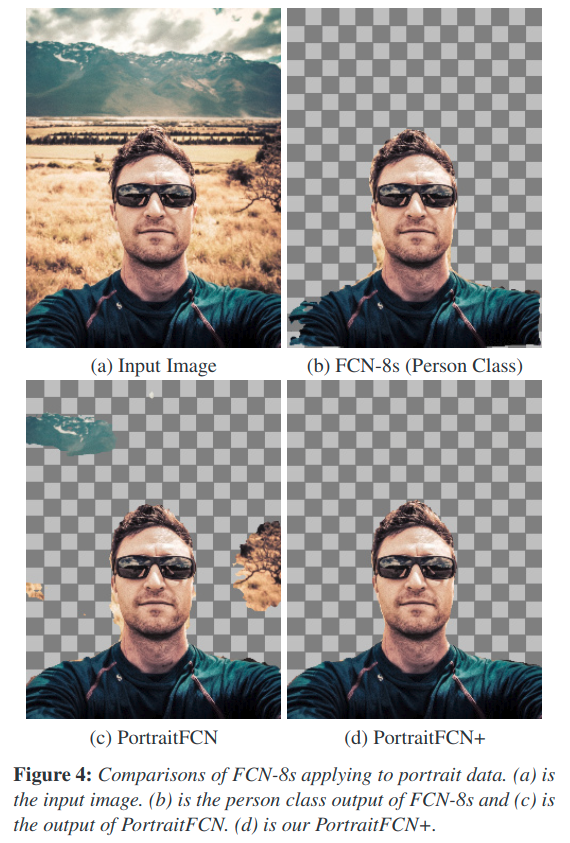

Although PortraitFCN improves the accuracy for our task as shown in Figure 4 (c), it is still has issues with clothing and background regions. A big reason for this is the translational invariance that is inherent in CNNs. Subsequent convolution and pooling layers incrementally trade spatial information for semantic information.

尽管PortraitFCN提高了我们任务的准确性，如图4（c）所示，但它仍然存在服装和背景区域的问题。其中一个重要原因是CNN固有的平移不变性。随后的卷积和池化层递增地交换空间信息以获得语义信息。

While this is desirable for tasks such as classification, it means that we lose information that allows the network to learn, for example, the pixels that are far above and to the right of the face in 4(c) are likely background. 虽然这对于诸如分类之类的任务是理想的，但这意味着我们丢失了允许网络学习的信息，例如，在4（c）中远高于和高于面部的像素可能是背景。(解释的好牵强)

To mitigate this, we propose the PortraitFCN+ model, described next, which injects spatial information extracted from the portrait, back into the FCN.

### Our Approach

Our approach incorporates portrait-specific knowledge into the model learned by our CNNs. To accomplish this, we **leverage robust facial feature detectors [SLC09] to generate auxiliary position(辅助位置) and shape channels**. These channels are then included as inputs along with the portrait color information into the first convolutional layer of our network.

#### Position Channels

*The objective of these channels is to encode the pixel positions relative to the face.*

The input image pixel position only gives limited information about the portrait because the subjects are framed differently in each picture. This motivates us to provide two additional channels to the network, the normalized x and y channels where x and y are the pixel coordinates.

输入图像像素位置仅提供关于肖像的有限信息，因为在每个图片中对象被不同地构图。这促使我们为网络提供两个额外的通道，标准化的x和y通道，其中x和y是像素坐标。

We define them by first detecting facial feature points [SLC09] and estimating a homography transform T between the fitted features and a canonical pose as shown in Figure 3 (d).

* We defined the normalized x channel as $T (x_{img})$ where **$x_{img}$ is the x coordinate of the pixels with its zero in face center in the image**.
* We define the normalized y channel similarly.

Intuitively, this procedure expresses the position of each pixel in a coordinate system centered on the face and scaled according to the face size.

我们通过首先检测面部特征点[SLC09]并估计拟合特征和规范姿势之间的单应变换T来定义它们，如图3（d）所示。我们将归一化的x通道定义为 $T(x_{img})$，其中$x_{img}$是像素的x坐标，其以图像面部中心为零点。我们类似地定义归一化的y通道。

直观地，该过程表示以面部为中心的坐标系中的每个像素的位置，并根据面部大小进行缩放。

#### Shape Channel

In addition to the position channel, we found that adding a shape channel further improves segmentation.

除了位置通道之外，我们还发现添加形状通道可以进一步改善分割。

A typical portrait includes the subject’s head and some amount of the shoulders, arms, and upper body. By including a channel in which a subject-shaped region is aligned with the actual portrait subject, we are explicitly providing a feature to the network which should be a reasonable initial estimate of the final solution.

典型的肖像包括受试者的头部和一些肩膀，手臂和上身。通过包括其中的目标形状区域与实际肖像目标对齐的通道，我们明确地向网络提供应该是最终解决方案的合理初始估计的特征。

To generate this channel, we first compute an aligned average mask from our training dataset. For each training portrait-mask pair ${P_i，M_i}$, we transform $M_i$ using a [homography](#homography) $T_i$ which is estimated from the facial feature points of Pi and a canonical pose.

要生成此通道，我们首先从训练数据集中计算对齐的平均值。对于每个训练肖像-掩膜对${P_i，M_i}$，我们使用从$P_i$的面部特征点和规范姿势估计的单应性$T_i$来变换$M_i$.

We compute the mean of these transformed masks as:

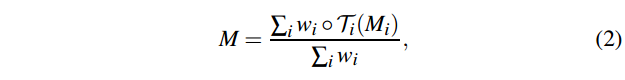

* where $w_i$ is a matrix indicating whether the pixel in $M_i$ is outside the image after the transform $T_i$. *The value will be 1 if the pixel is inside the image, otherwise, it is set as 0.*
* The operator $◦$ denotes element-wise multiplication.
* This mean mask $M$ which has been aligned to a canonical pose can then be similarly transformed to align with the facial feature points of the input portrait.

Figure 3 shows our PortraitFCN+ automatic portrait segmentation system including the additional position and shape input channels. As shown in Figure 4, our method outperforms all other tested approaches. We will quantify the importance of the position and shape channels in Section 5.1.

## Data and Model Training

Since there is no portrait image dataset for segmentation, we labeled a new one for our model training and testing. In this section we detail the data preparation and training schemes.

### Data Preparation

We collected 1800 portrait images from Flickr and manually labeled them with Photoshop quick selection. We captured a range of portrait types but biased the Flickr searches toward natural self portraits that were captured with mobile frontfacing cameras.

These are challenging images that represent the typical cases that we would like to handle. We then ran a face detector on each image, and automatically scaled and cropped the image to 600×800 according the bounding box of the face detection result as shown in Figure 3(a) and (b).

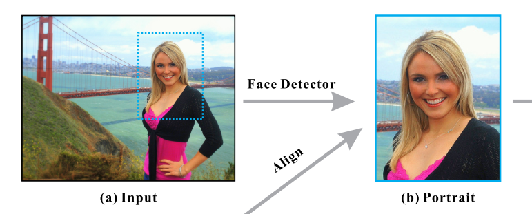

This process excludes images for which the face detector failed. Some of the portrait images in our dataset are shown in Figure 5 and display large variations in age, color, background, clothing, accessories, head position, hair style, etc. We include such large variations in our dataset to make our model more robust to challenging inputs.

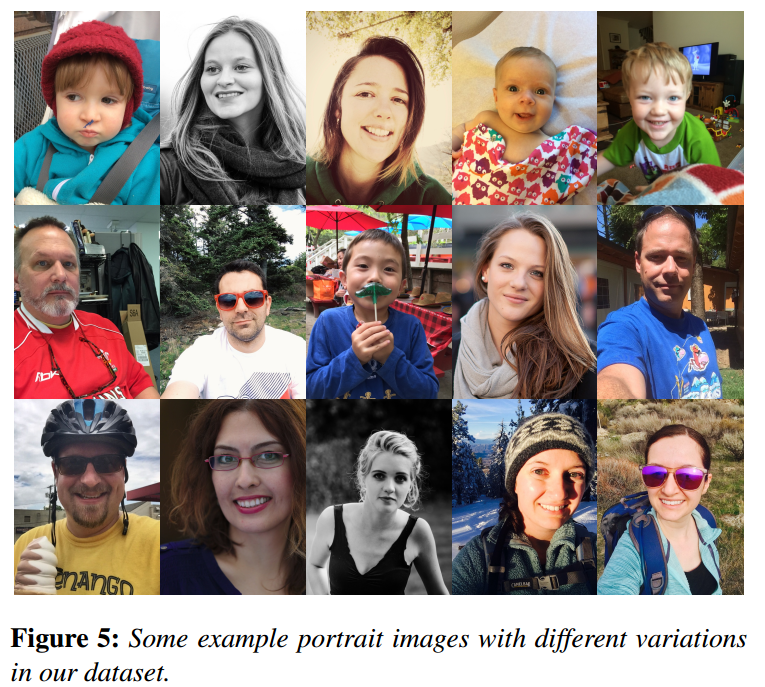

We *split the 1800 labeled images into a 1500 image training dataset and a 300 image testing/validation dataset*. Because more data tends to produce better results, we augmented our training dataset by perturbing the rotations and scales of our original training images.

* We synthesize **four new scales {0.6,0.8,1.2,1.5}** and **four new rotations {−45°,−22°,22°,45°}**.
* We also apply **four different gamma transforms** to get more color variation. The gamma values are {0.5,0.8,1.2,1.5}.

With these transforms, we generate **more than 19,000 training images**.

### Model Training

We setup our model training and testing experiment in Caffe [JSD∗14]. With the model illustrated in Figure 3, we use a stochastic gradient descent (SGD) solver with softmax loss function. We start with a FCN-8s model which pretrained on the PASCAL VOC 2010 20-class object segmentation dataset.

While it is preferable to incrementally fine-tune, starting with the top most layer and working backward, we have to fine-tune the entire network since our pre-trained model does not contain weights for the aligned mean mask and x and y channels in the first convolutional layer. We **initialize these unknown weights with random values** and **fine-tune with a learning rate of $10^{−4}$**.

我们在Caffe [JSD*14]中设置了模型训练和测试实验。使用图3所示的模型，我们使用具有softmax损失函数的随机梯度下降（SGD）求解器。我们从FCN-8s模型开始，该模型预先在PASCAL VOC 2010 20级对象分割数据集上进行。虽然最好逐步微调，从最顶层开始向后工作，但我们必须对整个网络进行微调，因为我们的预训练模型不包含第一个卷积层中的对齐平均掩模和x和y通道的权重。

As is common practice in fine-tuning neural networks, we select this learning rate by trying several rates and visually inspecting the loss as shown in Figure 6.

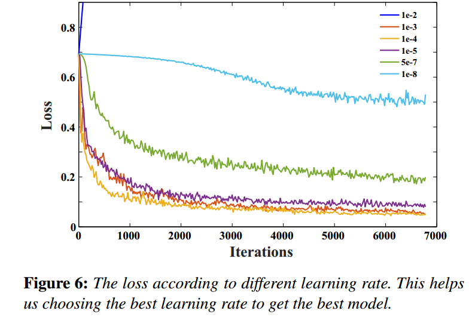

We found that too small and too large learning rate did not successfully converge or over fitting.

### Running Time for Training and Testing

We conduct training and testing on a single Nvidia Titan X GPU. Our model training
requires about one day to learn a good model with about 40,000 Caffe SGD iterations. For the testing phase, the running time on a 600×800 color image is only 0.2 second on the same GPU. We also run our experiment on the Intel Core i7-5930K CPU which takes 4 seconds using the MKL-optimized build of Caffe.

## Results and Applications

Our method achieved substantial performance improvements over other methods for the task of automatic portrait segmentation. We provide a detailed comparison to other approaches. A number of applications are also conducted because of the high performance segmentation accuracy.

与其他自动纵向分割任务的方法相比，我们的方法实现了显着的性能改进。我们提供了与其他方法的详细比较。由于高性能分割精度，还进行了许多应用。

### Quantitative and Visual Analysis

Based on our labeled 300 testing images, we quantitatively compare our method with previous methods. The segmentation error is measured by the standard metric Interaction-over-Union (IoU) accuracy which is computed as the area of intersection of the output with the ground truth, divided by the union of their areas as,

基于我们标记的300个测试图像，我们定量地将我们的方法与以前的方法进行比较。分割误差通过标准度量IoU准确度来衡量

We first compare our method with a standard graph-cut method [BJ01].

In our graph-cut method, we start with an aligned mean mask similar to the one in our shape channel. This soft mask is aligned with the detected facial features [SLC09] of the input image and is used to set the unary term in our graph cut optimization.

We also run the result of fully convolutional network (FCN-8s) from [LSD14]. We look only at the results of the person class and ignore the remaining 19 class object labels.

As reported in Table 1, the mean IoU accuracy in our testing dataset of graph-cut is 80.02% while the FCN-8s (Person Class) is only 73.09%.

In our testing data,

* the graph-cut fails for examples whose background and foreground color distribution is similar, or in which the content (texture, details, etc) is complex.
* As for the FCN-8s, it fails because it has no consideration of the portrait data knowledge.
* PortraitFCN+, on the other hand, achieves 95.91% IoU accuracy which is a significant improvement.

In order to verify the effectiveness of the proposed position and shape channels, we setup our PortraitFCN+ model only with the mean mask channel and only with the normalized x and y channels.

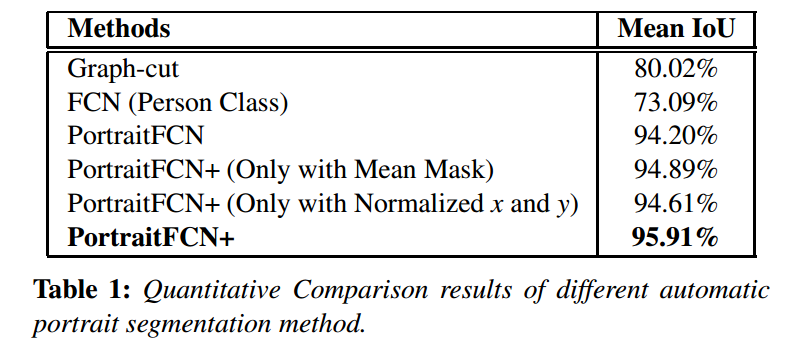

As shown in Table 1, considering the shape and position channels together achieves the best performance.

The reason is that **the position channels help to reduce the errors which are far from the face region while the shape channel helps to get the right label in the foreground portrait region**.

Figure 4 is an example of the type of highly distracting error corrected by the position and shape channels of PortraitFCN+.

In fact, running PortraitFCN on our test set produces 60 segmentations which exhibit this type of error, while that number drops to 6 when using PortraitFCN+.

Besides the quantitative analysis, we also show some visual comparison results in Figure 7 from our testing dataset which reinforces the quantitative analysis. More results are provided in our supplementary file.

**Our automatic portrait segmentation system is robust to the portrait scale, rotation, color and occlusion variations.** This is because our proposed position and shape channels allow the network to take these variations into account. Further, the consideration of these variations in our training dataset also helps. We show some examples in Figure 8.

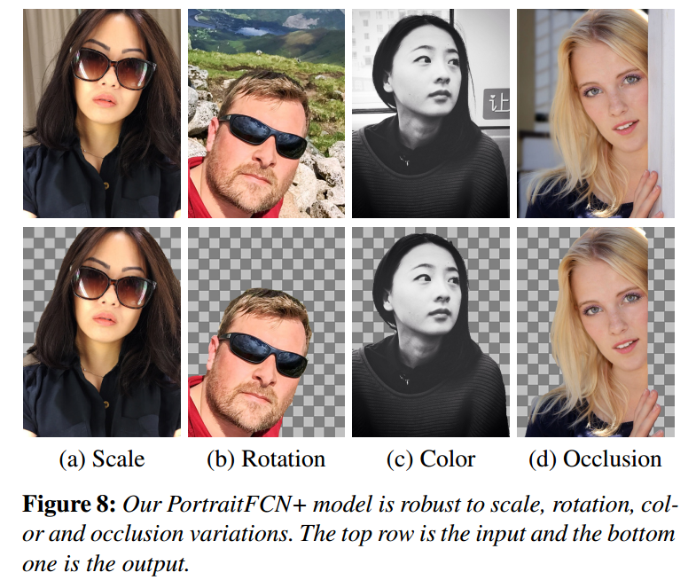

### Post-processing

Our estimated segmentation result provides a good trimap initialization for image matting.

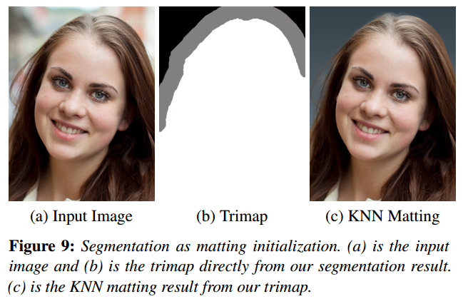

As shown in Figure 9, we **generate a trimap by setting the pixels within a 10-pixel radius of the segmentation boundary as the “unknown”**.

KNN matting [CLT13] is performed with the trimap shown in (b) and the result is shown in (c). The matting performs very well in part because our segmentation provides
an accurate initial segmentation boundary.

### User Study of Our Method

The average 95.9% IoU portrait segmentation accuracy means that most of our results are close to the ground truth.

平均95.9％的IoU纵向分割准确度意味着我们的大多数结果都接近于实际情况。

In the cases where there are small errors, they can be quickly corrected using interactive methods that are initialized with our method’s result. The corrections are very fast when compared with starting from scratch.

在存在小错误的情况下，可以使用使用我们的方法结果初始化的交互方法快速纠正它们。与从头开始相比，校正非常快。

In order to verify this, we collected the number of interactions and time taken for a user to get the foreground selection with different interactive selection methods. 40 users with different backgrounds conducted selections for the 50 images from our testing dataset.

为了验证这一点，我们收集了用户通过不同的交互选择方法获得前景选择所需的交互次数和时间。40位具有不同背景的用户对我们的测试数据集中的50张图像进行了选择。

We ask them to do the same thing using Photoshop quick selection [ADO] and lazy snapping [LSTS04] for each image. We also let the users do the quick selection initialized with our segmentation results. As shown in Figure 10, the number of interactions and time cost is largely reduced when compared with the quick selection and lazy snapping starting from only the original image.

我们要求他们使用Photoshop快速选择[ADO]和懒惰捕捉[LSTS04]为每个图像做同样的事情。我们还让用户使用我们的细分结果进行初始化快速选择。如图10所示，与仅从原始图像开始的快速选择和懒惰对齐相比，交互次数和时间成本大大降低。

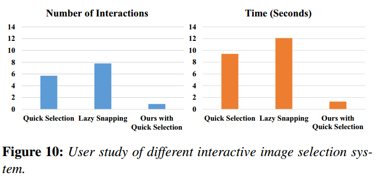

### Automatic Segmentation for Image Stylization

Due to the high performance of our automatic portrait segmentations, automatic portrait stylization schemes can be implemented in which the subject is considered independently of the background. Such approaches provide increased flexibility in letting the subject stand out while minimizing potentially distracting elements in the
background.

由于我们的自动肖像分割的高性能，可以实现自动肖像风格化方案，其中主体被认为独立于背景。这样的方法提供了增加的灵活性，使目标凸显，同时最小化可能分散注意力的元素
背景。

We show a number of examples in Figure 12, using the stylization methods of [SPB∗14] and [Win11], as well as several several Photoshop [ADO] filters with varying effects such as Palette Knife, Glass Smudge Stick and Fresco.

After applying the filters to the portrait subject, we either perform background replacement, or we reapply the method that was used on the subject, but with different settings to weaken the background’s detail and draw the viewer’s attention to the subject. Because of our segmentation accuracy, our results have no artifacts across the segmentation boundaries and allow for precise control of the relative amount of focus on the subject with minimal user interaction.

我们使用[SPB*14]和[Win11]的风格化方法，以及几个具有不同效果的Photoshop [ADO]滤镜，如Palette Knife，Glass Smudge Stick和Fresco，在图12中展示了许多示例。将滤镜应用于肖像主体后，我们要么执行背景替换，要么重新应用主题上使用的方法，但使用不同的设置来削弱背景的细节并吸引观众对主体的注意。由于我们的分割准确性，我们的结果在分割边界上没有伪影，并且允许以最小的用户交互精确控制对象的相对焦点量。

### Other Applications

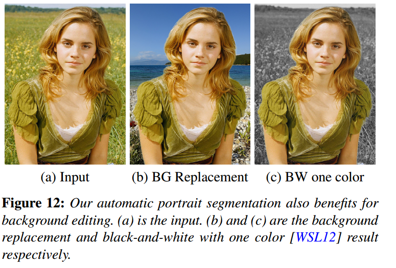

In addition to allowing for selective processing of foreground and background pixels, our approach also make background replacement trivial. As shown in Figure 12 (b), we automatically replace the portrait background. In (c), a black-and-white with one color [WSL12] is automatically generated. The ability to eliminate the background can also help with other computer graphics and vision tasks, for example by limiting distracting background information in applications such as 3D face reconstruction, face view synthesis, and portrait style transfer [SPB∗14].

除了允许选择性处理前景和背景像素之外，我们的方法还使背景替换变得更加容易。如图12（b）所示，我们自动替换肖像背景。在（c）中，自动生成具有一种颜色[WSL12]的黑白。消除背景的能力还可以帮助其他计算机图形和视觉任务，例如通过在诸如3D面部重建，面部视图合成和肖像风格迁移[SPB*14]的应用中限制分散注意力的背景信息。

## Conclusions and Future Work

In this paper we propose a high performance automatic portrait segmentation method. The system is built on deep convolutional neural network which is able to leverage portrait specific cues. We construct a large portrait image dataset with enough portrait segmentation and ground-truth data to enable effective training and testing of our model. Based on the efficient segmentation, a number of automatic portrait applications are demonstrated. Our system could fail when the background and foreground have very small contrast. We treat this as the limitation of our method. In the future, we will improve our model for higher accuracy and extend the framework to the portrait video segmentation.

在本文中，我们提出了一种高性能的自动肖像分割方法。该系统建立在深度卷积神经网络上，能够利用肖像特定的线索。

我们构建了一个大型肖像图像数据集，其中包含足够的肖像分割和真实数据，可以对我们的模型进行有效的训练和测试.

基于有效的分割，演示了许多自动肖像应用。当背景和前景具有非常小的对比度时，我们的系统可能会失败。我们将此视为我们方法的限制。在未来，我们将改进我们的模型以获得更高的准确性，并将框架扩展到纵向视频分割。

## 补充资料

### homography

Homography，译成中文叫“单应性“。

单应性是几何中的一个概念。单应性是一个**从实射影平面到射影平面的可逆变换**，直线在该变换下仍映射为直线。具有相同意义的词还包括直射变换、射影变换和射影性等，不过“直射变换”也在更广义的范围内使用。

形式化地说，射影变换是一种在射影几何中使用的变换：**它是一对透视投影的组合。它描述了当观察者视角改变时，被观察物体的感知位置会发生何种变化**。射影变换*并不保持大小和角度，但会保持重合关系和交比*——两个在射影几何中很重要的性质。射影变换形成了一个群。

对于更广义的射影空间——具有不同维度或不同的域——来说，**“单应性”代表射影线性变换（由其相关的向量空间的线性变换导出的可逆变换）**，而“直射变换”（意为“把直线映射为直线”）更为广义，它既包含了单应性，也包含了自同构直射变换（由域自同构导出的直射变换），或者是这两者的组合。

在计算机视觉领域中，**空间中同一平面的任意两幅图像通过单应性关联在一起**（假定是针孔相机）。比如,一个物体可以通过旋转相机镜头获取两张不同的照片(这两张照片的内容不一定要完全对应,部分对应即可),我们可以把单应性设为一个二维矩阵M,那么照片1乘以M就是照片2。

这有着很多实际应用，比如图像校正、图像对齐或两幅图像之间的相机运动计算（旋转和平移）等。一旦旋转和平移从所估计的单应性矩阵中提取出来，那么该信息将可被用来导航或是把3D物体模型插入到图像或视频中，使其可根据正确的透视来渲染，并且成为原始场景的一部分（请见增强现实）。

如果两幅图像之间的相机运动只有旋转而没有平移，那么这两幅图像通过单应性关联在一起（假定是针孔相机）。
