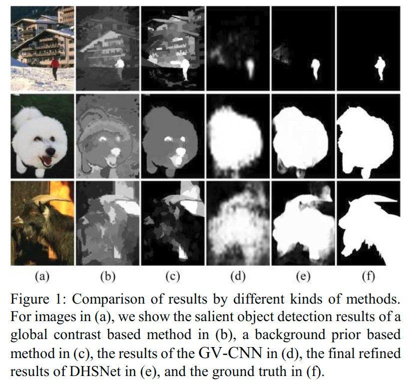
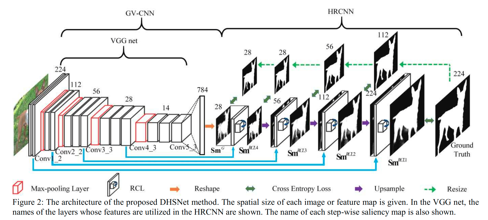
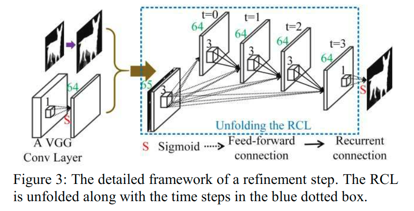
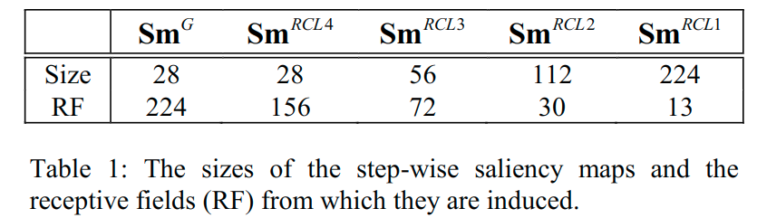
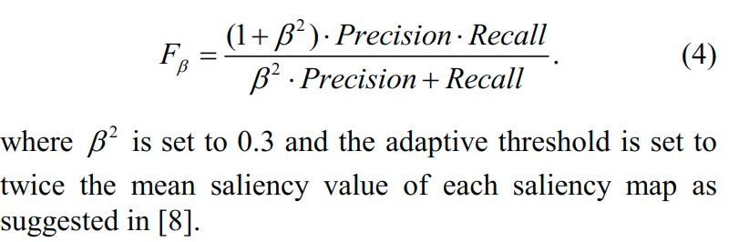
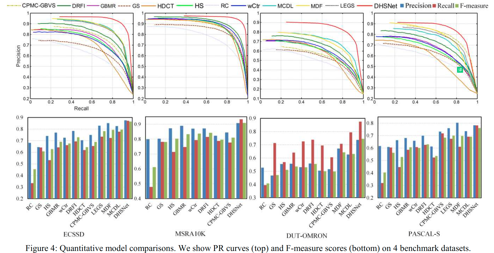
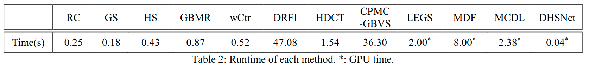
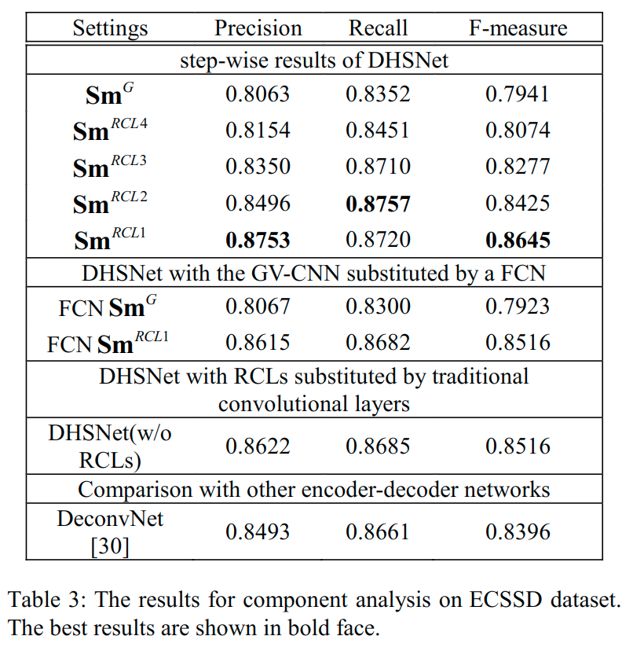

# DHSNet:Deep Hierarchical Saliency Network for Salient Object Detection(2016)

* [DHSNet:Deep Hierarchical Saliency Network for Salient Object Detection(2016)](#dhsnetdeep-hierarchical-saliency-network-for-salient-object-detection2016)
  * [概要](#概要)
  * [引言](#引言)
  * [相关工作](#相关工作)
    * [CNN](#cnn)
    * [Convolutional Neural Networks for Saliency Detection](#convolutional-neural-networks-for-saliency-detection)
  * [DHSNet for Salient Object Detection](#dhsnet-for-salient-object-detection)
    * [GV-CNN for Coarse Global Prediction](#gv-cnn-for-coarse-global-prediction)
    * [HRCNN for Hierarchical Saliency Map Refinement](#hrcnn-for-hierarchical-saliency-map-refinement)
      * [Recurrent Convolutional Layer](#recurrent-convolutional-layer)
      * [Hierarchical Saliency Map Refinement](#hierarchical-saliency-map-refinement)
  * [实验](#实验)
  * [结论](#结论)
  * [疑惑](#疑惑)

## 概要

传统的显着目标检测模型通常*使用手工制作的特征来形成对比和各种先验知识，然后人工组合它们*。在这项工作中，提出了一种基于卷积神经网络的新型端到端深层次显着性网络（DHSNet），用于检测显着目标。DHSNet首先通过自动学习各种*全局结构化显着性线索*（包括全局对比度，对象性，紧凑性及其最佳组合）来进行粗略的全局预测。然后采用一种新颖的分层递归卷积神经网络（HRCNN），通过整合局部上下文信息，逐步分层并进一步细化显着性图的细节。整个架构以全局到局部和由粗到精的方式工作。使用玩征图像和相应的真实的显着性掩模直接训练DHSNet。在测试时，可以通过网络直接有效地前馈测试图像来生成显着图，而无需依赖任何其他技术。对四个基准数据集的评估以及与其他11个最先进算法的比较表明，DHSNet不仅在性能方面显示出其显着的优势，而且在现代GPU上实现了23 FPS的实时速度。

## 引言

显著目标检测旨在准确且均匀地检测在图像中**吸引人类注意力**的目标。近年来，研究人员开发了许多用于显着目标检测的计算模型，并将其应用于许多其他应用，例如图像摘要，分割，检索和编辑(image summarization, segmentation, retrieval, and editing)。

传统的显着性检测方法依赖于各种显着性提示。最广泛探索的是对比度，旨在评估每个图像区域或者图像像素对应于局部上下文或者全局的独特性. **基于局部对比度的方法通常倾向于突出对象边界，同时经常错过对象内部**。相反，**基于全局对比度的方法能够均匀地突出对象内部**。这种方法更好，但仍然不能令人满意。

* 一方面，它们通常无法保留对象细节。
* 另一方面，它们通常难以检测具有大尺寸和复杂纹理的显着物体，尤其是当图像背景也混乱或具有与前景物体类似的外观时（参见图1b）。

此外，传统方法通常通过手工制作的特征（例如，强度，颜色和边缘方向）以及基于视觉注意力的有限人类知识的人类设计机制（例如，“高斯差异”（DoG）算子）来对对比度建模。因此，它们在不同情况下可能不会很好的泛化。

最近的一些作品还利用各种先验知识作为信息显着性线索。背景先验假设图像边界附近的区域可能是背景。然而，当显著性物体接触图像边界或和背景具有相似外观时，它经常失败(可见图1c).

* [紧凑先验 Saliency filters: Contrast based filtering for salient region detection]提倡显著性目标区域是紧凑的和感知上均匀(erceptually homogeneous)的元素。
* [目标先验 Fusing generic objectness and visual saliency for salient object detection&The secrets of salient object segmentation]倾向于突出显示可能包含某一类对象的图像区域。

虽然这些先验可以进一步提供有关显着性目标检测的信息性(informative)信息，但它们通常通过手工设计进行经验探索和建模。

在一些作品中还*结合了各种显着性线索以进行补充交互*。然而，这些工作通常采用简单的组合方案（例如，简单算术）或浅层学习模型（例如[learning to detect a salient object]中使用的CRF），这些模型很难挖掘不同显着性线索之间复杂的联合交互。此外，为了保留对象细节和细微结构，许多传统方法*采用图像的过分割*（例如，[9-11,16-19]中使用的超像素和[14]中使用的目标提案）**作为基本计算单元预测显着性或作为平滑显着性图的后处理方法**。虽然这些方法可以进一步提高显着性检测结果，但它们通常非常耗时，成为显着对象检测算法的计算效率的瓶颈。

通过上面的讨论，可以看到，如何*构建真正有意义的特征表示*，如何*同时探索所有潜在的显着性线索*，如何*找到最优的整合策略*，以及如何*有效地保存对象细节*, 这些问题成为进一步推广显着物体检测方法的最内在的问题(the most intrinsic problems)。

生成的$Sm^G$, 因为一些细节信息, 要比输入图像粗糙得多，例如精确的对象边界和细微(subtle)结构，在GV-CNN中逐渐被丢弃。为了解决这些问题，提出了一种新颖的端到端深层次显着性检测框架，即DHSNet，通过卷积神经网络（CNN）。DHSNet直接将整个图像作为输入并且输出显着性图，从全局视角到局部上下文，从粗到细，分层检测显着对象（参见图2）。细节上, 首先在全局视图（GV-CNN）上采用CNN来生成粗略的全局显着性图（$Sm^G$）以粗略地检测和定位显着对象。在全局结构化损失的监督下，GV-CNN可以自动学习特征表示和各种全局结构化显着性线索，例如全局对比度，对象性，紧凑性以及它们的最佳组合。因此，GV-CNN可以获得最佳的全局显着物体检测结果，对复杂的前景物体和杂乱的背景具有鲁棒性，即使它们在外观上非常相似（参见图1d）。为了解决这个问题, 进一步提出了采用一种新颖的分层递归卷积神经网络（HRCNN），通过结合局部上下文来细化显着性图。HRCNN由几个递归卷积层（RCL[Recurrent Convolutional Neural Network for Object Recognition]）和上采样层组成（见图2）。RCL将循环连接合并到每个卷积层中，从而增强了模型集成上下文信息的能力，这对于显着性检测模型非常重要。在HRCNN中，按层次和连续的几个步骤细化显着性图。在每个步骤中，**采用RCL通过集成在最后一步预测的上采样粗略显着图和来自GV-CNN的更精细的特征图来生成更精细的显着图**。每一步中的RCL都会提升前一步的细节，并为下一步提供良好的初始化。随着中间显着图的比例变得越来越精细，组合特征图的感受野变得越来越小，图像细节可以逐步呈现，而不依赖于图像过分割（参见图1e中的最终结果）。

本文的贡献可归纳如下：

1. 提出了一种新颖的*端到端*显着性检测模型，即**DHSNet**，用于检测显着对象。DHSNet可以同时学习强大的特征表示，信息显着性提示（例如，全局对比度，对象性和紧凑性），以及来自全局视角的最佳组合机制，并随后学习进一步细化显着性图详细信息。
2. 提出了一种新颖的*分层细化*模型，即**HRCNN**，它可以通过在不使用过分割方法的情况下整合局部上下文信息, 来分层地和逐步地细化显着性图以恢复图像细节。所提出的HRCNN可以显着且有效地提高显着性检测性能。此外，它还可以用于其他像素到像素的任务，如场景标记[22]，语义分割[23]，深度估计[epth map prediction from a single image using a multi-scale deep network]等。
3. 四个基准数据集的实验结果以及与其他11个最先进方法的比较, 证明了DHSNet对显着对象检测问题的巨大优势，特别是在复杂数据集上。此外，DHSNet在现代GPU上的速度非常快，实现了23 FPS的实时速度。

## 相关工作

### CNN

最近，CNN在许多计算机视觉任务中取得了巨大的成功，包括图像分类，物体检测和定位，人脸识别等。CNN在像素级预测任务上也有所应用.

许多作品采用多种深层体系结构来保留像素化任务中的细节。

* 对于深度图预测，[Depth map prediction from a single image using a multi-scale deep network]首先训练CNN基于整个图像进行粗略的全局预测，然后使用另一个CNN在局部改进该预测。
* 对于语义分割，[Learning deconvolution network for semantic segmentation]利用反卷积层和去池化层逐步扩大特征映射的分辨率，以预测精细的语义分割结果。类似地，[FlowNet: Learning Optical Flow with Convolutional Networks]利用了几个“上卷积”层，它们由去卷积层和去池化层组成，以逐层细化光流预测。这两个工作和文中使用了类似的想法，即逐步细化特征图或从粗到细的预测结果。然而，在他们的模型中采用的去池化层有选择地将信息从较粗层传送到更精细层，限制了传递的信息。此外，他们沉重的解码器架构引入了许多参数来学习并使网络难以训练。
* 最后但并非最不重要的是，文章在每个细化步骤中嵌入了RCLs，从而增强了模型将上下文信息与有限参数集成的能力。

### Convolutional Neural Networks for Saliency Detection

一些研究人员已经将深度神经网络应用于显着性检测，其中包括两个分支，即眼睛固定预测和显着对象检测。在这里，简要回顾一下与文中工作相关的后者的作品。

* 对于显着物体检测，[35]使用CNN纤维局部上下文的每个像素预测显著性得分, 然后在全局视野上, 细化每个目标提案的显著性得分.
* [34]通过使用多尺度CNN特征, 预测了每个超像素的显着性得分。
* 同样[36]通过在多上下文CNN中同时结合局部上下文和全局上下文来预测每个超像素的显着性得分。

这三种方法都比传统方法取得了更好的效果。但是，他们都*没有优先考虑全局背景*。此外，他们分别处理局部区域（超像素和对象提案），因此*没有利用不同空间位置的区域的相关性*。这两个弱点使得他们的网络难以学习足够的全局结构，因此他们的结果常常被杂乱背景中的局部显着性模式分散注意力，并且不能均匀地突出显着的对象。相反，DHSNet采用整个图像作为计算单元，并将层次和逐步地将全局上下文信息传播到局部上下文，能够感知全局属性并从一开始就避免局部干扰。最后但并非最不重要的是，所有这三种方法都依赖于图像过度分割(over-segmentations)，使得它们的算法非常耗时。而DHSNet只需要通过网络提供每个测试图像，因此速度更快。

## DHSNet for Salient Object Detection

如图2所示，DHSNet由GV-CNN和HRCNN组成。GV-CNN首先在全局视角中粗略地检测显着对象，然后HRCNN按层次逐步地逐步细化显着性图的细节。DHSNet受到端到端的训练。在测试时，我们只是前馈输入图像通过网络, 不需要使用任何的后处理和图像过分割方法, 因此这使得DHSNet不仅有效, 还很高效(not only effective, but also efficient).

### GV-CNN for Coarse Global Prediction

如图2所示，GV-CNN由VGG的13个卷积层，后续的全连接层和一个整形层组成。

* 对于224×224大小的输入图像，首先采用VGG16网络的13个卷积层来提取深度特征。
* 然后，在最后一个卷积层之上（即第五组卷积层中的第三个子层，表示为Conv5_3. VGG中的其他卷积层也可以用这个类比表示），大小为14×14×512，部署具有sigmoid激活功能的全连接层和784个节点。
* 最后，将该层重新整形为尺寸为28×28的粗糙全局显着图$Sm^G$。由全局结构化损失监督，即$Sm^G$与真实显着性掩模之间的平均像素级交叉熵损失，全连接层通过整合各种显着性线索来学习从前面的特征图中检测和定位输入图像的显着对象。

正如[37]所指出的那样，卷积网络特征可以比它们的感受野大小更精细地定位。因此，即使层Conv5_3的尺寸小（14×14），GV-CNN也可以生成相对大的显着图（28×28）。

尽管GV-CNN可以粗略地检测和定位显着对象，但是$Sm^G$中的图像细节, 例如，对象边界和细微结构仍然缺失。原因有两方面。

1. 首先，VGG网络中的4个最大池化层丢弃了一些空间信息，使得Conv5_3层难以保留局部细节。
2. 其次，全连接层中的参数量随着$Sm^G$的大小的增大而线性增加，使得训练变得困难。

因此，必须为$Sm^G$选择一个小尺寸。因此，$Sm^G$在数量和视觉上都不够令人满意，需要进一步改进。

### HRCNN for Hierarchical Saliency Map Refinement

为了进一步在细节上提升$Sm^G$，提出了一种新颖的架构，即HRCNN，以分层和逐步地渲染图像细节。

#### Recurrent Convolutional Layer

HRCNN的核心是[21]提出的RCL。RCL将循环连接合并到每个卷积层中。对于位于RCL中第k个特征图上（i，j）位置上的单元，它在时间步t的状态由下式给定: $x_{ijk}(t)=g(f(z_{ijk}(t))) \qquad (1)$, 这里的f是ReLU, g是局部相应归一化(LRN), 来防止状态爆炸:

$$
g(f_{ijk}(t))=\frac{f_{ijk}(t)}{(1+\frac{\alpha}{N}\sum^{min(K,k+N/2)}_{k'=max(0,k-N/2)}(f_{ijk'})^2)^\beta} \qquad (2)
$$

这里的$f(z_{ijk}(t)$被缩写为$f_{ijk}(t)$,$K$是总共的特征图的数量, $N$是局部相邻特征图的大小, 这些都参与到了归一化的运算中, $\alpha, \beta$是调整归一化的常量.

在式子(1)汇总, $z_{ijk}(t)$是单元输入, 它包含一个前馈连接和一个循环连接:

$$
z_{ijk}(t)=(\mathbf{w}_k^f)^T\mathbf{u}^{(i,j)}+(\mathbf{w}^r_k)^T\mathbf{x}^{(i,j)}(t-1)+b_k \qquad (3)
$$

> 注意, 这里相当于只是对于一个原始的$\mathbf{u}^{(i,j)}$和后面进一步处理的结果不断地加权结合, 重复处理.说是类似于残差链接, 也不同, 也不同于DenseNet那般的密集连接, 这里成为所谓"递归"结构, 但是也不同于原始的RNN结构, 只能说这个流程有"递归"的思想在里面, 当前步=之前步+原始输入, 这也是一个迭代的过程.
>
> 与最原始的RNN展开结构相比较:
>
> 
>
> 这里的若是输入的序列始终都是相同的$\mathbf{u}^{(i,j)}$, 而且隐藏状态也是由其计算而来, 那么就和RNN的过程比较相似了.

这里的$\mathbf{u}^{(i,j)}$和$\mathbf{x}^{(i,j)}(t-1)$是来自前一层的前馈输入, 和来自$(t-1)$时间步的递归层的输入. 而两个权重是前馈权重和递归权重(由于$K$也就是对应的特征图的通道数量, 在这个循环计算的过程中总的通道数量是不变的, 也就是说, 这里的权重也应该是固定不变的, 这一点类似于RNN), $b_k$是偏置项.

具有T个时间步长的RCL可以展开到深度为T+1的前馈子网络。按照[21]设置T=3并在图3中的蓝色虚线框中显示展开的RCL。可以看到多个循环连接使子网具有从输入层到输出层的多条路径，这有利于学习。

> 想法: RNN是否可以利用类似于DenseNet的结构形式的密集连接? 可以和早期的输出进行更为紧密的联系.

此外，当时间步长增加时，RCL单元的有效感受野扩展，使得单元能够“看到”越来越大的上下文而不增加网络参数的数量。因此，RCL可以帮助在HRCNN中有效地结合局部上下文以细化显着性图。第4.5节中的实验证明了RCL优于传统卷积层的优越性。

如图3所示，在每个RCL中使用64个特征图来节省计算成本并遵循[21]使用前馈和3x3的递归滤波器, LRN的超参数设定为$\aleph=0.001, \beta=0.75, N=7$, 不同于[21], 这里不在RCLs中使用dropout处理.

#### Hierarchical Saliency Map Refinement

* 大小为224x224的输入图像, 通过包含着13个卷积层的VGG卷积网络, 获得大小为14x14x512大小的特征图(没有后面那个最大池化操作).
* 后接一个sigmoid激活函数的全连接层, 这里有784=28x28个节点被设定, 最后经过整形得到了28x28的粗糙特征图$Sm^G$.
* 如图2所示:
  * 首先将$Sm^G$与VGG网络的Conv4_3[相结合](#疑惑)，并采用RCL生成更精细的显着性图（因为该显着性图是通过采用Conv4_3中的局部特征的在RCL上获得的，将其表示为$Sm^{RCL4}$, 并且随后进一步细化的显着性图, 以相同的方式表示)。
  * 由于$Sm^{RCL4}$与Conv3_3（56×56）相比具有更小的尺寸（28×28），首先将$Sm^{RCL4}$上采样(nearest-neighbor interpolation)到其尺寸的两倍，然后将上采样的$Sm^{RCL4}$与层Conv3_3组合以生成$Sm^{RCL3}$。
  * 通过做同样的事情，将上采样的$Sm^{RCL3}$与层Conv2_2组合以生成$Sm^{RCL2}$.
  * 并将上采样的$Sm^{RCL2}$与层Conv1_2组合以生成$Sm^{RCL1}$，这是最终的显着图。
* RCL的细节可见图3, 属于内部的迭代的一个过程, 可以看作是一个"白盒", 关注输入输出就好.
* 关于监督损失: 对各个$Sm$都会和对应大小的放缩后的真实标注进行计算像素级交叉熵损失(采用了**深度监督[Deeply-supervised nets]**方案, 以监督每个逐步显着性图的相应学习).

在图3示出了细化步骤的详细框架，即，**将粗略显着图与来自VGG网的卷积层组合以生成更精细的显着图**。首先使用具有64个1×1卷积核和sigmoid激活函数的卷积层来压缩VGG层的特征。

原因有两个:

* 首先，减少VGG层的特征图数量以节省计算成本。
* 其次，通过使用sigmoid激活函数，将神经元激活值的范围压缩为[0,1]，这与组合后的显着性图相同。如果不这样做，合并的显着性图将会被淹没，因为VGG网的每一层具有ReLU激活功能, 激活值通常非常大.

接下来，压缩的VGG层与上采样粗显着性图连接（除了$Sm^G$与层Conv4_3直接连接而不进行上采样），产生65个特征映射。然后采用RCL来组合VGG层中的粗显着性图和局部特征。最后，通过采用具有*1×1内核和S形激活函数*的卷积层，可以生成精细显着图。

表1显示了每个逐步显着图的大小以及它们的感受野的大小。从$Sm^G$到$Sm^{RCL1}$，逐步显着图的大小逐渐扩大，但感受野逐渐缩小（注意的$Sm^G$感受野是整个图像）。因此，HRCNN以粗略到精细以及从全局到本地的方式细化显着性图。因此，通过结合越来越精细的特征，可以逐步呈现图像细节。第4.5节中的实验也验证了分层细化方案的有效性。

为了便于学习，还采用了**深度监督[Deeply-supervised nets]**方案。具体而言，如图2所示，将真实显着性掩模的大小调整为224到28之间的大小，以监督每个逐步显着性图的相应学习。

## 实验

* 数据集: ECSSD, MSRA10K, DUT-OMRON, PASCAL-S
* 评估指标:
  * PR曲线, 显著性图使用0~1之间的阈值分别进行二值化处理, 与真实标注作为对比, 得到一些列的P&R值, 可获得PR曲线.
  * F-measure: 更为全面的考虑P&R值. 使用一个自适应阈值, 可以获得对应的P&R值, 进而得到F测度得分.
  
* 训练期间的数据增强: During training, we did image augmentation by *horizontal-flipping* and *image cropping* to relieve overfitting. In details, for each training image and the corresponding ground truth, we *cropped out the most top, bottom, left, right, and middle 9/10 image* as training samples. In addition to the original images and the horizontally-flipped ones, we *increased the training set by 12 times*(上/左/下/右/中间/原始, 再整体水平翻转一次, 这样就扩展了12倍). When fed into DHSNet, each image was first *wrapped to size 224×224* and *subtracted a mean pixel* provided by VGG net at each position.
* 上采样: The upsampling layers were simply implemented using the nearest-neighbor interpolation method.
* To facilitate training, we first trained the GV-CNN alone with the 13 convolutional layers initialized by the VGG net and the fully connected layer randomly initialized.
  * a minibatch size of 12
  * 40,000 iteration steps
  * set the learning rate to 0.015 in the last layer and a 1/10 smaller one in the VGG layers.
  * halved the learning rate every 4,000 iterations.
  * set momentum to 0.9
  * weight decay factor to 0.0005
* Then we trained the whole DHSNet with the GV-CNN part initialized by the pretrained model and the HRCNN part initialized randomly.
  * set the minibatch size to 5
  * kept the 40,000 iteration steps
  * set the learning rate to 0.03 in the HRCNN part and a 1/1000 smaller one in the GV-CNN layers.
  * The learning rate decay policy, the momentum and the weight decay factor were kept as the same as those when training GV-CNN.
* We tested the **cross entropy loss** on the validation set **every 2000 iteration steps** and selected a model **with the lowest validation loss** as the best model to do testing.

## 结论

在本文中，提出DHSNet作为一种新颖的端到端显着性对象检测模型。它首先从全局视图中粗略地检测到显着对象，然后通过集成局部上下文来分层逐步改进图像细节。

DHSNet不仅获得了最先进的结果，而且实现了实时速度。

## 疑惑

* 这里如何实现结合的操作呢?

按照代码<https://github.com/GuanWenlong/DHSNet-PyTorch/blob/98dff839b94a4968c9b357df68902f05db084c4b/model.py#L19>可以看出来, 这里使用的是`out = torch.cat((out1,out2),1)`, 是沿着通道进行堆叠的操作.
