# Deep Image Matting

> <http://arxiv.org/pdf/1703.03872v3.pdf>

* [Deep Image Matting](#deep-image-matting)
  * [Abstract](#abstract)
  * [Introduction](#introduction)
  * [Related works](#related-works)
  * [New matting dataset](#new-matting-dataset)
  * [Our method](#our-method)
    * [Matting encoder-decoder stage](#matting-encoder-decoder-stage)
      * [Network structure](#network-structure)
      * [Losses](#losses)
        * [alpha-prediction loss](#alpha-prediction-loss)
        * [compositional loss](#compositional-loss)
      * [Implementation](#implementation)
        * [Train](#train)
        * [Test](#test)
    * [Matting refinement stage](#matting-refinement-stage)
      * [Network structure](#network-structure-1)
      * [Implementation](#implementation-1)
  * [Experimental results](#experimental-results)
    * [The alphamatting.com dataset](#the-alphamattingcom-dataset)
    * [The Composition-1k testing dataset](#the-composition-1k-testing-dataset)
    * [The real image dataset](#the-real-image-dataset)
  * [Conclusion](#conclusion)

## Abstract

Image matting is a fundamental computer vision problem and has many applications. Previous algorithms have poor performance *when an image has similar foregroundand background colors or complicated textures*. The main reasons are prior methods

1. only use low-level features
2. lack high-level context

In this paper, we propose a novel deep learning based algorithm that can tackle both these problems. Our deep model has two parts.

* The first part is **a deep convolutional encoder-decoder network** that takes an image and the corresponding trimap as inputs and *predict the alpha matte of the image*.
* The second part is **a small convolutional network** that *refines the alpha matte predictions* of the first network to have more accurate alpha values and sharper edges.

In addition, we also create a large-scale image matting dataset including **49300 training images and 1000 testing images**. We evaluate our algorithm on the image matting benchmark, our testing set, and a wide variety of real images. Experimental results clearly demonstratethe superiority of our algorithm over previous methods.

## Introduction

Matting, the problem of accurate foreground estimationin images and videos, has significant practical importance. It is a key technology in image editing and film production and effective natural image matting methods can greatly improve current professional workflows. It necessitates(必要) methods that handle real world images in unconstrained scenes.

Unfortunately, current matting approaches do not generalize well to typical everyday scenes. This is partially due to the difficulty of the problem: as formulated the matting problem is underconstrained(欠约束) with 7 unknown values per pixel but only 3 known values:

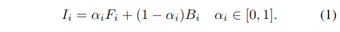

where the RGB color at pixel $i$, $I_i$, is known and the foreground color $F_i$, background color $B_i$ and matte estimation $α_i$ are unknown. However, current approaches are further limited in their approach.

1. The first limitation is due to current methods being designed to solve the matting equation (Eq.1). This equation formulates the matting problem as a linear combination of two colors, and consequently most current algorithms approach this largely as a color problem(因此，大多数现有算法在很大程度上将其作为颜色问题).

    The standard approaches include sampling foreground and back-ground colors [3,9], propagating the alpha values according to the matting equation [14,31,22], or a hybrid of the two [32,13,28,16].

    这些方法在很大程度上依赖于color作为区别特征（通常与像素的空间位置一起），使得它们在前景和背景颜色分布重叠的情况下非常敏感，不幸的是，对于这些方法, 这些问题是自然图像中的常见情况，通常导致依赖于该方法的低频“拖尾”或高频“厚实”伪影(所谓异常)（参见图1的顶行）。即使最近提出的深度学习方法也高度依赖于与颜色相关的传播方法 [8,29].

2. A second limitation is due to the focus on a very small dataset.

    * Generating ground truth for matting is very difficult, and the alphamatting.com dataset [25] made a significant contribution to matting research by providing ground-truth data. Unfortunately, it contains only 27 training images and 8 test images, most of which are objects in front of an image on a monitor. Due to its size and constraints(限制) of the dataset (e.g. indoor lab scenes, indoor lighting, no humans or animals), it is by its nature biased(它本质上是有偏见的), and methods are incentivized to fit to this data for publication purposes(为了发布目的，鼓励方法适合这些数据). As is the case with all datasets, especially small ones, at some point methods will overfit to the dataset and no longer generalize to real scenes.
    * A recent video matting dataset is available [10] with 3 training videos and 10 test videos, 5 of which were extracted from green screen footage(绿屏画面) and the rest using a similar method to [25].

In this work, we present an approach aimed to overcome these limitations. Our method uses deep learning to **directly compute the alpha matte given an input image and trimap**. Instead of relying primarily on color information, our network can **learn the natural structure that is present in alpha mattes**. For example, hair and fur (which usually require matting) possess strong structural and textural pat-terns. Other cases requiring matting (e.g. edges of objects, regions of optical or motion blur, or semitransparent regions) almost always have a common structure or alpha profile that can be expected. While low-level features will not capture this structure, deep networks are ideal for representing it. Our two-stage network includes **an encoder-decoder stage followed by a small residual network for refinement** and includes **a novel composition loss in addition to a loss on the alpha**. We are the first to demonstrate the ability to learn an alpha matte end-to-end given an image and trimap.

在这项工作中，我们提出了一种旨在克服这些局限性的方法。我们的方法**使用深度学习来直接计算输入图像和trimap的alpha遮罩**。我们的网络**不是主要依赖于颜色信息，而是可以学习alpha遮罩中存在的自然结构**。例如，头发和毛皮（通常需要消光）具有强烈的结构和纹理图案。需要消光的其他情况（例如，物体的边缘，光学或运动模糊区域或半透明区域）几乎总是具有可以预期的共同结构或α文件。虽然低级功能无法捕获此结构，但深度网络非常适合表示它。我们的两阶段网络包括编码器-解码阶段，后面是一个小的残差网络，用于细化，**并且除了在alpha上的损失之外, 还包括新的成分损失**。我们是第一个展示能够在给定图像和trimap的情况下端到端的alpha遮罩的能力。

To train a model that will excel in natural images of unconstrained scenes, we need a much larger dataset than currently available. Obtaining a ground truth dataset using the method of [25] would be very costly and cannot handle scenes with any degree of motion (and consequently cannot capture humans or animals). Instead, inspired by other synthetic datasets that have proven sufficient to train models for use in real images (e.g. [4]), we create a large-scale matting dataset using composition.

为了训练一个在无约束场景的自然图像中表现优异的模型，我们需要一个比现有更大的数据集。使用[25]的方法获得真实标注数据集将是非常昂贵的，并且无法处理任何程度的运动场景（因此无法捕获人类或动物）。**相反，受其他合成数据集的启发，这些数据集已被证明足以训练模型以用于真实图像（例如[4]），我们使用合成创建了一个大规模的消光数据集**。

Images with objects on simple backgrounds were carefully extracted and were composited onto new background images to create a dataset with 49300 training images and 1000 test images.

仔细提取具有简单背景上的对象的图像并将其合成到新的背景图像上以创建具有49300个训练图像和1000个测试图像的数据集。

We perform extensive evaluation to prove the effectiveness on our method. Not only does our method achieve first place on the alphamatting.com challenge, but we also greatly outperform prior methods on our synthetic test set. We show our learned model generalizes to natural images with a user study comparing many prior methods on 31 natural images featuring humans, animals, and other objects in varying scenes and under different lighting conditions. This study shows a strong preference for our results, but also shows that some methods which perform well on the alphamatting.com dataset actually perform worse compared to other methods when judged by humans, suggesting that methods are being to overfit on the alphamatting.com test set.

Finally, we also show that we are more robust to trimap placement than other methods. In fact, we can produce great results even when there is no known foreground and/or background in the trimap while most methods cannot return any result (see Fig1 bottom row ).

我们进行广泛的评估，以证明我们的方法的有效性。我们的方法不仅在alphamatting.com挑战中占据首位，而且我们在合成测试集上的表现也大大超过了先前的方法。我们展示了我们的学习模型推广到自然图像，研究比较了许多之前的方法在31种自然图像上的表现，这些图像以不同场景和不同光照条件下的人，动物和其他物体为特征。这项研究显示了对于我们的结果的强烈倾向，但也表明，当人类判断时, 与其他方法相比，某些在alphamatting.com数据集上表现良好的方法实际上表现更差，这表明这些方法在alphamatting.com的测试集上过度拟合了。

最后，我们还表明我们对trimap placement比其他方法更强大。实际上，即使在trimap中没有已知的前景和/或背景，我们也可以产生很好的结果，而大多数方法都不能返回任何结果（参见图1底行）。

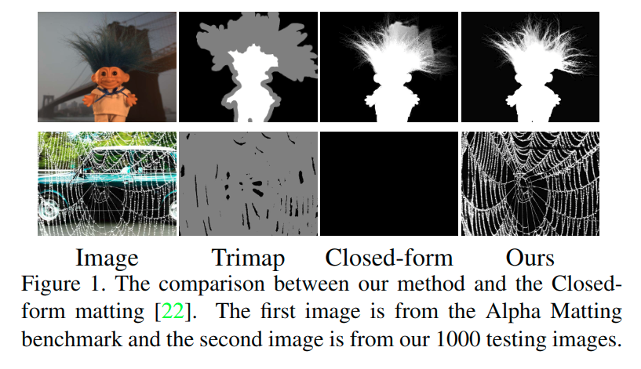

## Related works

Current matting methods rely primarily on color to determine the alpha matte, along with positional or other low-level features. They do so through **sampling, propagation, or a combination of the two**.

1. In sampling-based methods [3,9,32,13,28,16], **the known foreground and background regions are sampled to find candidate colors for a given pixel’s foreground and background**, then **a metric is used to determine the best foreground/background combination**.

    使用不同的采样方法，包括沿最接近给定像素的边界采样[32]，基于光线投射的采样[13]，搜索整个边界[16]，或从颜色聚类采样[28,12](sampling along the boundary nearest the given pixel [32], sampling based on ray casting [13], searching the entire boundary [16], or sampling from color clusters [28,12])。在采样候选者中决定的度量几乎总是包括消光方程重建误差(a matting equation reconstruction error)，可能包括测量来自给定像素的样本的距离[32,16]或前景和背景样本的相似性[32,28]，以及包括稀疏编码[12]和KL-散度方法[19,18]的公式。而纹理[27]等高阶特征很少使用，效果有限。

2. In propagation methods, Eq.1 is reformulated such that it allows **propagation of the alpha values from the known foreground and background regions into the unknown region**.

    * A popular approach is **Closed-form Matting [22] which is often used as a post-process after sampling** [32,16,28]. It derives a cost function from local smoothness assumption on foreground and background colors and finds the globally optimal alpha matte by solving a sparse linear system of equations(它从前景和背景颜色的局部平滑假设推导出成本函数，并通过求解稀疏线性方程组来找到全局最优alpha matte).
    * Other propagation methods include **random walks [14], solving Poisson equations [31], and nonlocal propagation methods [21,7, 5]** (随机游走[14]，求解泊松方程[31]和非局部传播方法[21,7,5]).

Recently, several deep learning works have been proposed for image matting. However, they do not directly learn an alpha matte given an image and trimap.

1. Shenet al. [29] **use deep learning for creating a trimap** of a person in a portrait image and **use [22] for matting** through which matting errors are backpropagated to the network.
2. Choet al.[8] **take the matting results of [22] and [5] and normalized RGB colors as inputs** and learn an end-to-end deep network to **predict a new alpha matte**.

Although both our algorithm and the two works leverage deep learning, our algorithm is quite different from theirs. Our algorithm **directly learns the alpha matte given an image and trimap** while the other two works **rely on existing algorithms to compute the actual matting**, making their methods vulnerable(弱势) to the same problems as previous matting methods

## New matting dataset

The matting benchmark on alphamatting.com [25] has been tremendously successful in accelerating the pace of research in matting. However, due to the carefully controlled setting required to obtain ground truth images, the dataset consists of only 27 training images and 8 testing images. Not only is this not enough images to train a neural network, but it is severely limited in its diversity(它的多样性受到严重限制), restricted to small-scale lab scenes with static objects.

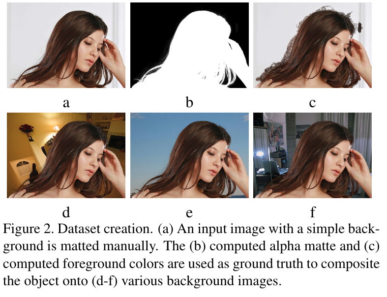

To train our matting network, **we create a larger dataset by compositing objects from real images onto new backgrounds**. We find images on simple or plain backgrounds(Fig.2a), including the 27 training images from [25] and every fifth frame from the videos from [26]. Using Photoshop, we carefully manually create an alpha matte (Fig.2b) and pure foreground colors (Fig.2c). Because these object shave simple backgrounds we can pull accurate mattes for them. We then **treat these as ground truth and for each alpha matte and foreground image, we randomly sample N background images in MS COCO [23] and Pascal VOC [11], and composite the object onto those background images**.

We create both a training and a testing dataset in the above way. Our **training dataset has 493 unique foreground objects and 49,300 images (N=100) while ourtesting dataset has 50 unique objects and 1000 images (N=20)**. The trimap for each image is randomly dilated from its ground truth alpha matte. In comparison to previous matting datasets, our new dataset has several advantages.

1. It has many more unique objects and coversvarious matting cases such as hair, fur, semi-transparency,etc.
2. Many composited images have similar foreground and background colors and complex background textures, making our dataset more challenging and practical.

An early concern is whether this process would create a bias due to the composited nature of the images, such that a network would learn to key on differences in the foreground and background lighting, noise levels, etc. However, we found experimentally that we achieved far superior resultson natural images compared to prior methods (see Sec.5.3).

一个早期的担心是这个过程是否会因图像的合成性质而产生偏差，这样网络就会学会关注前景和背景光照，噪声水平等方面的差异。但是，我们通过实验证明了与现有方法相比较, 我们在自然图像方面取得了卓越的成果。

## Our method

We address the image matting problem using deep learning. Given our new dataset, we train a neural network to fully utilize the data. The network consists of two stages(Fig.3).

1. The first stage is a deep convolutional encoder-decoder network which **takes an image patch and a trimap as input** and is **penalized by the alpha prediction loss and a novel compositional loss**.
2. The second stage is a small fully convolutional network which refines the alpha prediction from the first network with more accurate alpha values and sharper edges.

We will describe our algorithm with more details in the following sections.

### Matting encoder-decoder stage

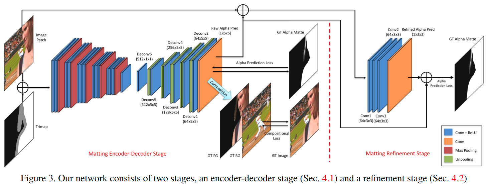

The first stage of our network is a deep encoder-decoder network (see Fig.3), which has achieved successes in many other computer vision tasks such as image segmentation [2], boundary prediction [33] and hole filling [24].

#### Network structure

The input to the network is an **image patch and the corresponding trimap** which are *concatenated along the channel dimension*, resulting in a 4-channel input. The whole network consists of an encoder network and a decoder network.

1. The input to the encoder network is transformed into downsampled feature maps by subsequent convolutional layers and max pooling layers. The decoder network in turn uses subsequent unpooling layers which reverse the max pooling operation and convolutional layers to upsample the feature maps and have the desired output, the alpha matte in our case. Specifically, our encoder net-work has **14 convolutional layers and 5 max-pooling layers**.
2. For the decoder network, we *use a smaller structure than the encoder network* to reduce the number of parametersand speed up the training process. Specifically, our decoder network has **6 convolutional layers, 5 unpooling layers followed by a final alpha prediction layer**.

#### Losses

Our network leverages two losses.

##### alpha-prediction loss

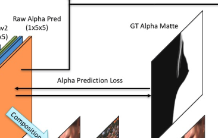

The first loss is called the **alpha-prediction loss**, which is the absolute difference *between the ground truth alpha values and the predicted alpha values at each pixel*. However, due to the non-differentiable property of absolute values, we use the following loss function to approximate it.

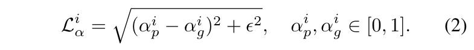

* $α^i_p$ is the output of the prediction layer at pixel $i$ thresholded between 0 and 1.
* $α^i_g$ is the ground truth alpha value at pixel $i$.
* $\epsilon$is a small value which is equal to $10^{−6}$ in our experiments.
* The derivative $∂L^i_α/∂α^i_p$ is straightforward(直截了当).

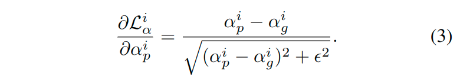

##### compositional loss

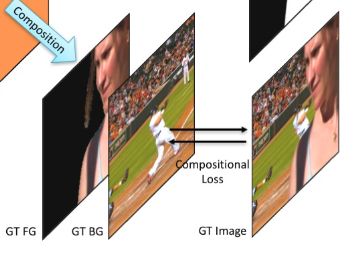

The second loss is called the **compositional loss**, which is the absolute difference *between the ground truth RGB colors and the predicted RGB colors* **composited by the ground truth foreground, the ground truth background and the predicted alpha mattes**. Similarly, we approximate it by usingthe following loss function.

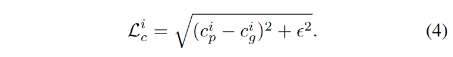

* $c$ denotes the RGB channel
* $p$ denotes the image composited by the predicted alpha
* $g$ denotes the image composited by the ground truth alphas

The compositional loss constrains the network to follow the compositional operation, leading to more accurate alpha predictions.

总损失是两个单独损失的加权总和, i.e., $L_{overall}=w_l·L_α+(1−w_l)·L_c$.

* $w$ lis set to 0.5 in our experiment.

In addition, since *only the alpha values inside the unknown regions of trimaps need to be inferred*, we therefore set additional weights on the two types of losses *according to the pixel locations*, which can help our network pay more attention on the important areas. (所谓注意力机制?)

Specifically, $w_i= 1$ if pixel $i$ is inside the unknown region of the trimap while $w_i= 0$ otherwise.

#### Implementation

##### Train

Although our training dataset has 49,300 images, there are **only 493 unique objects**. **To avoid overfitting as well as to leverage the training data more effectively**, we use several training strategies.

1. First, we **randomly crop 320×320 (image, trimap) pairs centered on pixels in the unknown regions**. This increases our sampling space.
2. Second, we also **crop training pairs with different sizes (e.g. 480×480, 640×640) and resize them to 320×320**. This makes our method more robust to scales and helps the network better learn context and semantics.
3. Third, **flipping is performed randomly on each *training pair*.
4. Fourth, the **trimaps are randomly dilated(随机扩张) from their ground truth alpha mattes**, helping our model to be more robust to the trimap placement.
5. Finally, **the training inputs are recreated randomly after each training epoch**.

The encoder portion of the network is initialized with the first 14 convolutional layers of VGG-16 [30] (*the 14th layeris the fully connected layer “fc6” which can be transformed to a convolutional layer*).

Since the network has 4-channel input, we initialize the one extra channel of the first-layer convolutional filters with zeros.

> 这里怎么实现? 针对一部分权重使用预训练模型, 剩余的零初始化?

All the decoder parameters are initialized with Xavier random variables.

##### Test

* the image and corresponding trimap are concatenated as the input.
* A forward pass of the network is performed to output the alpha matte prediction.
* When a GPU memory is in sufficient for large images, CPU testing can be performed.

### Matting refinement stage

Although the alpha predictions from the first part of our network are already much better than existing matting algorithms, because of the encoder-decoder structure, the results are sometimes overly smooth.

Therefore, we extend our network to further refine the results from the first part. This extended network usually predicts **more accurate alpha mattes and sharper edges**.

#### Network structure

* The input to the second stage of our network is **the concatenation of an image patch and its alpha prediction** from the first stage (scaled between 0 and 255), resulting in a 4-channel input.
* The output is the corresponding ground truth alpha matte.

The network is a **fully convolutional network which includes 4 convolutional layers. Each of the first 3 convolutional layers is followed by a nonlinear “ReLU” layer**. There are no downsampling layers since we want to keep very subtle(细微) structures missed inthe first stage.

In addition, we use a “skip-model” structure **where the 4-th channel of the input data is first scaled between 0 and 1 and then is added to the output of the network**.

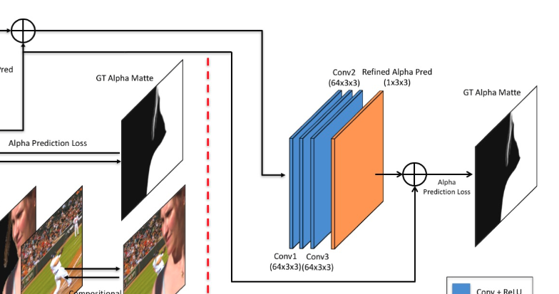

> 这里的描述和图上有些出入, 因为按照图上来看, 是这个4通道只是作为了输入, 而后期加上来的, 是一个预测出来的alpha matte. 应该是用哪个?

The detailed configuration is shown in Fig. 3. The effect of our refinement stage is illustrated in Fig. 4. Note that it does not make large-scale changes to the alphamatte, but rather just refines and sharpens the alpha values.

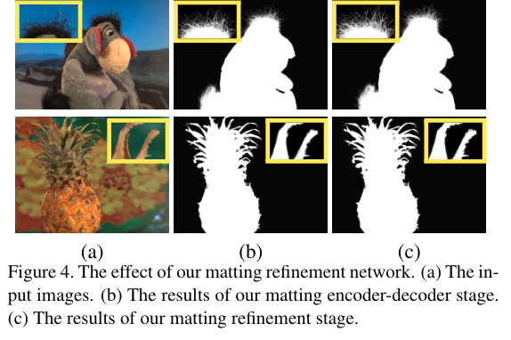

#### Implementation

1. During training, we first update the encoder-decoder part without the refinement part.
2. After the encoder-decoder part is converged(融合), we fix its parameters and then update the refinement part. Only the alpha prediction loss (Eqn.2) is used due to its simple structure. We also use all the training strategies of the $1^{st}$ stage except the $4^{th}$ one.
3. After the refinement part is also converged, finally we fine-tune the the whole network together. (分阶段训练)

We use Adam [20] to update both parts. A small learning rate $10^{−5}$ is set constantly during the training process.

During testing

1. first, given an image and a trimap, our algorithm first uses the matting encoder-decoder stage to get an initial alpha matte prediction.
2. then the image and the alph aprediction are concatenated as the input to the refinement stage to produce the final alpha matte prediction.

## Experimental results

In this section we evaluate our method on 3 datasets.

* We evaluate on the alphamatting.com dataset [25], which is the existing benchmark for image matting methods. It includes 8 testing images, each has 3 different trimaps, namely, “small”, “large” and “user”.
* Due to the limited size and range of objects in the alphamatting.com dataset, we propose the Composition-1k test set. Our composition-based dataset includes 1000 images and 50 unique foregrounds. This dataset has a wider range of object typesand background scenes.
* To measure our performance on natural images, we also collect a third dataset including 31 natural images. The natural images cover a wide range ofcommon matting foregrounds such as person, animals, etc.

### The alphamatting.com dataset

Our approach achieves the top results compared to all the other methods on the alphamatting.com benchmark. Specifically, our method ranks the 1st place in terms of the SAD metric. Our method also has the smallest SAD errors for 5 images with all the 3 trimaps (Fig. 5).

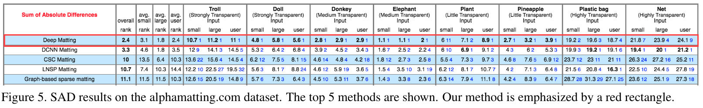

In addition, our method ranks the 2nd place in terms of both the MSE and Gradient metrics. Overall, our method is one of the best performers on this dataset.

A key reason for our success is our network’s ability to learn structure and semantics, which is important for the accurate estimation of alpha matte when **the background scene is complex or the background and foreground colors are similar**.

For example, in Fig6 the “Troll” examplehas very similar colors of the hair and the bridge while the “Doll” example has strong textured background.

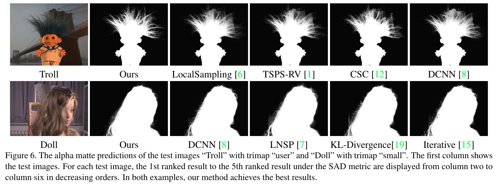

The best results of previous methods (from column 3 to column 6) all have very obvious mistakes in those hard regions.

In contrast, our method directly learns object structure and image context.

As a result, our method not only avoids the similar mistakes made by previous methods but also predicts more details. It is worth noting that although DCNN matting [8] is also a deep-learning based method, **it learns the non-linear combination of previous matting methods within small local patches**. Therefore the method cannot really understand semantics and thus has the same limitations as previous non-deep-learning-based methods.

### The Composition-1k testing dataset

We further evaluate 7 top performing prior methods and each component of our approach on the Composition-1k testing dataset. For all prior methods, the authors’ provided codes are used. The different variants of our approach include: the matting encoder-decoder network 1) with only the alpha prediction loss, 2) with both the alpha prediction loss and the compositional loss, the matting encoder-decoder network 3) post-processed by the Guided filter [17] and 4) post-processed by the matting refinement network.

The quantitative results under the SAD, MSE, Gradient and Connectivity errors proposed by [25] are displayed in Table 1.

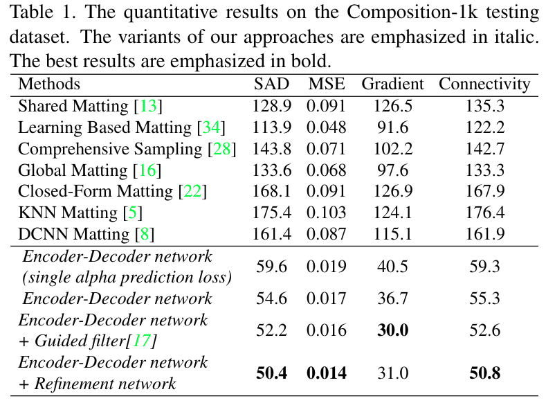

Clearly all variants of our approach have much better results than the other methods. The main reason is still the capability of our deep model understanding the complex context of images while the other methods cannot.

By comparing the variants of our approach, we can also validate the effectiveness of each component of our approach:

1. the compositional loss helps our model learn the compositional operation, and thus leads to better results
2. the results of our matting encoder-decoder network can be improved by combining with previous edge-preserving filters(与先前的边缘保留滤波器相结合) (e.g. Guided filter [17]) as well as our matting refinement network. But the latter one has more obvious improvement both visually and quantitatively since it is directly trained with the outputs of our encoder-decoder network.

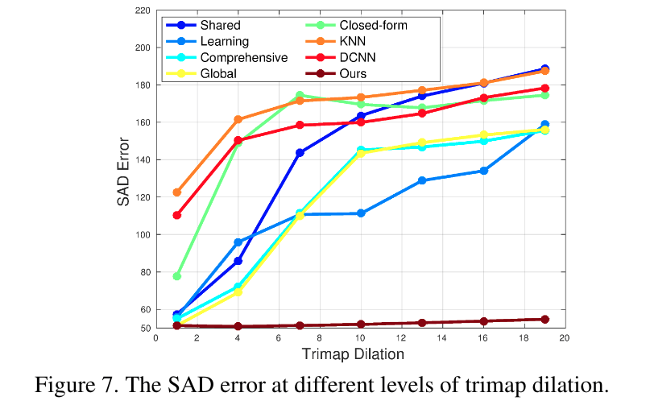

We test the sensitivity of our method to trimap placement in Fig. 7. We evaluate over a subset of our dataset that includes one randomly-chosen image for each unique object for a total of 50 images. To form the trimap, we dilate the ground truth alpha for each image by $d$ pixels for increasing values of $d$.

The SAD errors at a particular parameter $d$ are averaged over all images. The results of all the methods at parameters $d∈[1,4,7,10,13,16,19]$ are shown in Fig.7.

Clearly our method has a low and stable error rate with the increasing values of $d$ whiles the error rate of the other approaches increases rapidly.

Our good performance derives from both our training strategies as well as a good understanding of image context.

Some visual examples are shown in Fig.8 to demonstratethe good performance of our approach on different matting cases such as hair, holes and semi-transparency. Moreover, our approach can also handle objects with no pure foreground pixels, as shown in the last example in Fig.8.

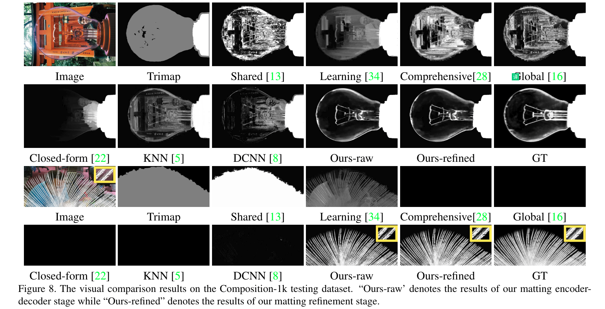

Since **previous sampling-based and propagation-based methods must leverage known foreground and background pixels, they cannot handle this case**, while our approach can learn the appearance of fine details directly from data.

### The real image dataset

Matting methods should generalize well to real-world images. To validate the performance of our approach and other methods on real images, we conduct a user study on the real image dataset. These images consist of images pulled from the internet as well as images provided by the ICCV 2013 tutorial on image matting.

Because our subjects may not be acquainted with alpha mattes, we instead evaluate the results of compositions. For each method, the computed alpha matte is used to blend the test image onto a black background and onto a white background.

For the user test, we present the image and the two composition results of two randomly selected approaches to an user and ask which results are more accurate and realistic especially in the regions of fine details (e.g. hair, edgesof object, and semi-transparent areas).

To avoid evaluation bias, we conduct the user study on the Amazon Mechanical Turk.

As a result, there are total 392 users participating the user study and each method pair on one image is evaluated by 5 to 6 unique users. The pairwise comparison results are displayed in Tbl.2, where each column presents the preference of one approach over the other methods.

For example, users preferred our result 83.7% of the time over [13].

Notably almost 4 out of 5 users prefer our method over the prior methods, which well demonstrates that our method indeed produces better visual results. See Fig.9 for some visual results.

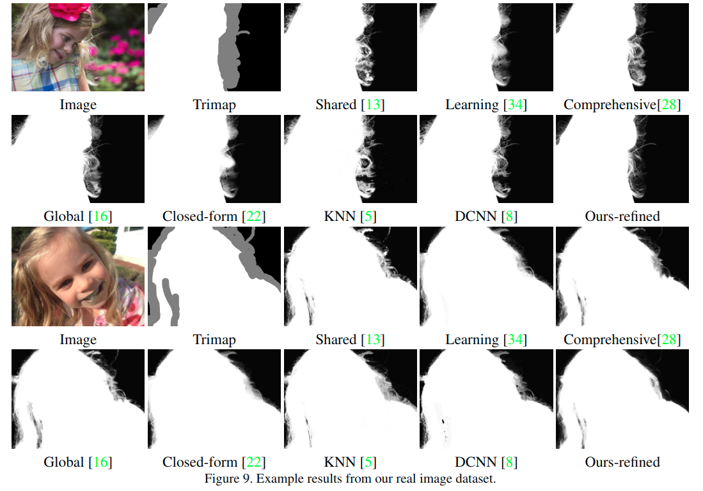

It is also worth noting that the ranking of other methods differs in this test compared to the other two experiments.

For example, Closed-Form Matting [22] is the lowest ranked method on alphamatting.com of the methods we compare here, yet to users it is preferable to all other methods except our own and [28].

On the other hand, while DCNN [8] is the prior state-of-the-art method on alphamatting.com, is only preferred over two methods on the real images. It is unclear whether this is due to methods overfitting the alphamatting.com dataset or whether the standard error metrics fail to accurately measure human perceptual judgment of alpha matting results.

## Conclusion

In order to generalize to natural images, matting algorithms must move beyond using color as a primary cue and leverage more structural and semantic features.

In this work, **we show that a neural network is capable of capturing such high-order features and applying them to compute improved matting results**.

Our experiments show that our method does not only outperform prior methods on the standard dataset, but that it generalizes to real images significantly better as well.
