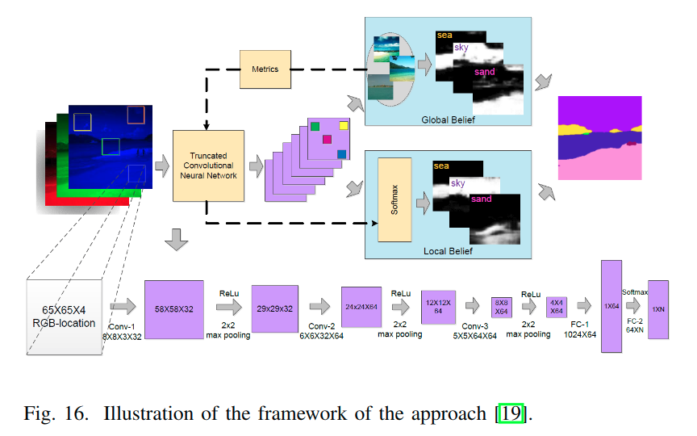
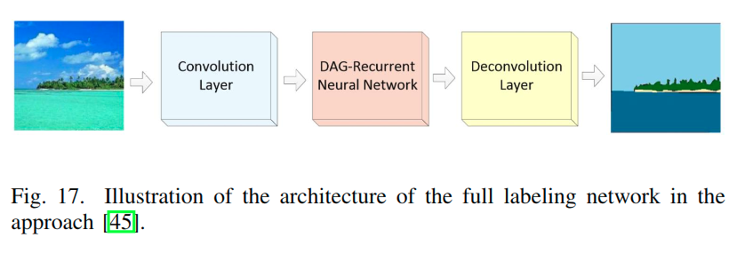
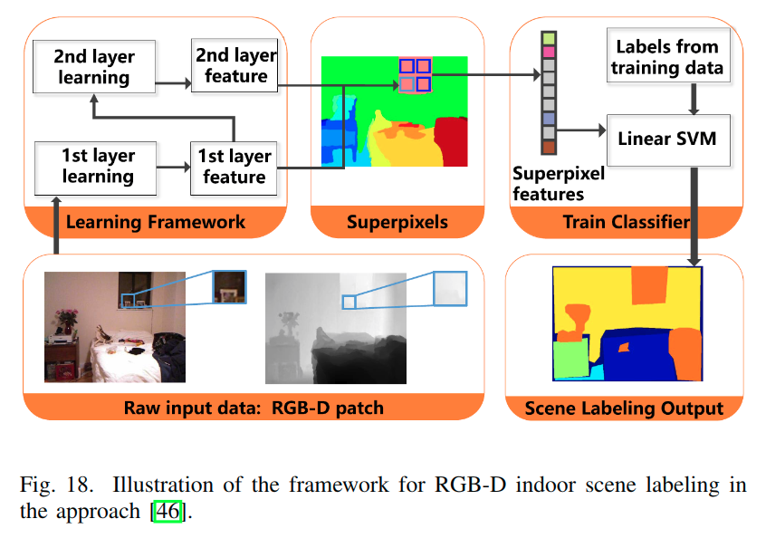

# Deep Learning Algorithms with Applications to Video Analytics for A Smart City: A Survey

> 关注点:
>
> * DAG-RNN
> * JFLE

## 场景标记

场景标记的目标是给场景图像的每一个像素分配一个语义标号. 着很有挑战性，因为很多情况下，一些类别无法区分. 一般来说，真实世界的“物体”的像素会由于尺寸、光照、姿态等变化而不同. 而基于深度学习的方法，对场景标记问题，给出了非常好的结果. 我们回顾其中的一些工作.

Shuai[19]提出把CNN当作一个参数模型，来学习判别特征(discriminative features)，用在场景标记的分类中. 图16是方法的框图. 首先，使用全局场景语义来去除局部上下文的模糊性, 通过传递类间依赖以及从相似例子中获得的先验. 然后，在像素级别，把全局势能和全局置信因子结合起来.

> 全局势能和全局置信因子是什么?

通过结合全局和局部的置信因子，可以得到标记结果. 最后，使用基于测度学习的大范围margin方法，来提高全局置信因子的精确性. 这个模型在SiftFlow和Stanford的数据集中，都取得了不错的效果.

Shuai[45]（又是这个人）提出了一个有向无环图结构的RNN（DAG-RNN），来对图像单元中的长距离语义依赖进行建模. 图17是提出的网络结构.

首先，使用**无向有环图(UCG)来对图像单元之间的依赖进行建模**，由于UCG的循环特性，RNN并不能直接处理UCG结构化的图.

> RNN是有向无环图

因此，一个**UCG被分解成几个有向无环图(DAG)**. 每一个DAG结构化图像，用相应的DAG-RNN进行处理，得到一个隐藏层. 用这些隐藏层来获得上下文关联的特征图. 这样一来，局部表达就可以嵌入到图像的抽象主旨中，效果大大增强. 论文称，DAG-RNNs在SiftFlow, CamVid和Barcelona等数据集上，效果不错.

Wang[46]针对RGB-D的场景标记问题，提出了非监督联合特征学习和编码的框架(JFLE). 图18展示了这个方法.

首先，用两层堆叠结构的网络进行特征学习和编码，这一步叫做JFLE(联合特征学习和编码). 为了让JFLE更加通用，对输入数据使用非线性堆叠层的深度模型建模，得到的模型叫JDFLE. 这个学习结构(JFLE或者JDFLE)的输入数据是从RGBD图片中密集采样得到的patches，学习的输出是对应路径的特征(corresponding path features)集合，这些特征接着产生超像素特征. 最后，使用线性SVM来把这些超像素特征对应到各个场景标签. 这个方法在NYU深度数据集中效果不错.

场景标记可以被用来理解监控相机的图像. 那是很重要的对于智能城市而言, 例如"路"和"建筑物"被需要来识别. 深度模型可以利用智能城市的大数据来学习层次化特征, 进而实现场景图像的标记.
