# Deep Propagation Based Image Matting

> 论文: <https://www.ijcai.org/proceedings/2018/0139.pdf>

## 概要

在本文中，我们通过将深度学习引入学习alpha matte传播原理, 来提出一种基于深度传播的图像matting框架。我们的深度学习架构是深度特征提取模块，亲和力学习模块(an affinity learning module)和matte传播模块的串联。这三个模块都是不同的，可以通过端到端的训练流程进行共同优化。我们的框架通过学习适合于matte传播的深度图像表示，对于传播而言, 生成在像素的语义级别的成对相似性。它结合了深度学习和matte传播的强大功能，因此可以在准确性和训练复杂性方面超越先前最先进的matting技术，这可以通过我们基于两个基准matting数据集创建的243K图像上的实验结果得到验证.

## 引言

Image matting aims to extract **a foreground object image F** together with its **alpha matte(taking values in [0, 1])** from **a given image I**. Techniques for achieving image matting are mostly founded on the following convex combination of F and a background image B:

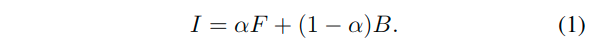

A follow-up composition process(后续组合过程) of image matting is to blend F with a new background image B by using Eq. (1) again for creating a new image. Image matting is critical for commercial television and film production due to its power to insert new elements seamlessly into a scene or transport an actor into a totally new environment[Wang and Cohen, 2007].

**Image matting is a highly ill-posed problem(病态问题) because it involves an estimation of seven unknowns (3 color components for each of F and B, plus the alpha value) from three equations for each pixel as shown in Eq. (1).**

> ill-posed problem
>
> ill-posed就是不well-posed. wellposedness的定义就是*解, 存在, 唯一以及稳定*。 前两个好理解，要理解稳定，先说一下什么是问题。
>
> 问题就是给一些input进入一个黑匣子，出来一些output。
>
> **稳定**是说如果input有少量的扰动，那output也只会有少量的扰动。**如果不是稳定的，这个问题就没有研究的意义**。
>
> <https://www.zhihu.com/question/63725426/answer/212347753>
>
> 又称为"病态问题"。病态，**简单来说就是结果不唯一**，比如a+b=5，求a和b就是病态问题。矩阵乘法如果是病态问题，通常是因为那个矩阵不满秩。零空间不为空，这样即使真实解发生很大的变化，仍然得到相同的管测量。

Among a large variety of matting techniques (as summarized in Sec. 2), *propagation-based image matting*[Levinet al., 2008; Chenet al., 2013;Zheng and Kambhamettu, 2009]constitutes(构成) one of the most prominent(突出) matting approaches in literature. The related techniques leverage *pixel similarities to propagate the alpha matte values from manually-drawn regions* where the alpha values are known to unknown regions. They model a complicated image structure simply by measuring pairwise similarity between pixels, resolve matte typically with a closed-form fashion, are easy to implement and can result a smooth matte.(他们简单地通过测量像素之间的成对相似性来模拟复杂的图像结构，通常使用封闭形式的方法来解析matte，易于实现并且可以产生平滑的matte)

However, most of the existing propagation-based image matting techniques deteriorate inevitably(不可避免地恶化) in practice considering the fact that they are built on a low-level pairwise similarity which is typically measured by using image color or other hand-designed visual features[Levinet al., 2008;Chenet al., 2013]. As widely known, image matting is of a high-level vision task and therefore **demands a semantic-level pairwise similarity[Liuet al., 2017]**.

In order to deal with this limitation, the ubiquitous(普及) deep learning techniques have been recently applied to achieving a semantic-level analysis of the image for matting[Choet al., 2016; Xuet al., 2017; Shenet al., 2016; Aksoyet al., 2017; Liuet al., 2017;Bertasiuset al., 2016].

They behave as learning an **alpha matte** or a **pairwise similarity** in an end-to-end fashion given an image plus a trimap.

* However, for the former, the propagation process is not involved and learning an alpha matte directly is well-known to be hard due to the high dimensionality of the parameter space to be specified during training, especially when considering the fact that the size of alph amatte dataset is usually very limited in practice[Xuet al.,2017].(然而，对于前者而言，并不涉及传播过程，并且由于在训练期间要指定的参数空间的高维度，因此众所周知地学习α是很难的，尤其是在考虑事实时, alpha matte数据集的大小在实践中通常非常有限)

* For the latter, the propagation process is treated as a followed but totally-independent procedure(程序). Therefore, the benefits of matting propagation can’t be combined with the power of deep learning, which limits the performances of the related approaches.

In this paper, we introduce a novel deep propagation based image matting framework with an motivation to deal with the above challenges by **propagating alpha matte values using a propagation principle learned via a deep learning architecture**.

Different from the existing deep learning based image matting techniques, our deep learning architecture is **a concatenation of a deep feature extraction module, an affinity learning module and an alpha matte propagation module**. These three modules are all differentiable(可微的) and can therefore be jointly trained using the stochastic gradient descent(SGD). They result in deep image representations adapted to matting propagation and semantic-level pairwise similarities.

The complete training pipeline is driven by the fact that the propagated alpha matte via the learned propagation principle should be as close as possible to the ground-truth.

The proposed deep propagation based framework is distinguished from many existing matting techniques for several of its strengths.

* First, *it can learn a semantic-level pairwise similarity for propagation* via a deep learning architecture in a data-driven manner. This is in contrast to **traditional hand-designed similarities which may not adequately(充分) describe pixel-pixel relationships for a high-level vision task**.
* Second, *the learned pairwise similarities are adapted to matte propagation*, which is superior to techniques of learning similarity directly.
* Third, *it combines both the power of deeplearning and propagation* by training the image representation and pairwise similarity jointly.
* Fourth, *the dimensionality of its parameter space to be specified during training is significantly smaller than learning an alpha matte directly*(在训练期间指定的参数空间的维度明显小于直接学习alpha matte).

Experimental results obtained from 243K images validate that our network obviously outperforms several representative state-of-the-art matting techniques.

## Related Work

There exist three main approaches to digital matting:

* sampling based techniques[Chuanget al., 2001; Fenget al.,2016]

    The sampling based techniques are founded on an assumption that two pixels with similar colors should be close in their alpha matte values(基于采样的技术是基于这样的假设：**具有相似颜色的两个像素应该在它们的alpha matte值中接近**).

* propagation based frameworks[Levinet al., 2008;Chenet al., 2013; Zheng and Kambhamettu, 2009]

    基于传播的框架将用户绘制的前景和背景涂鸦的alpha值传播到未知区域。它利用像素的成对相似性来表示复杂的图像结构。在文献中, 基于传播的技术构成了不仅仅是图像matting的一种突出方法[Levinet al。，2008; Chenet al。，2013; Zheng and Kamb-hamettu，2009]以及图像分割和编辑（与图像matting非常相似的问题）[Chenet al。，2012; Endoet al。，2016]。这得益于主要由像素间亲和力测量确定的明确数学公式的可用性，所述**像素间亲和力测量仅表征相邻像素之间的局部相互作用**。这种表示可以在封闭形式中解决, 并轻松实施[Levinet al。，2008]。然而，*大多数现有的基于传播的方法通过使用图像颜色来确定成对相似性，从而导致低级成对相似性测量*。

    这本质上等同于两个基本假设[Zheng and Kambhamettu，2009]：

    1. 线性 alpha-color 关系，意味着 alpha matte 值是每个像素颜色的线性函数;
    2. color-line(颜色线)模型，表示局部的图像颜色分布在颜色空间的一条线上

    These propagation based techniques deteriorate inevitably(不可避免地恶化) when the above assumptions are violated in practice(当上述假设在实践中被证实时), typically when image color is not good enough for characterizing each pixel. The violation may result in “smearing” or “chunky” artifacts in alpha matte as descried in[Chenet al., 2013; Choet al., 2016; Xuet al., 2017;Aksoyet al., 2017] (侵坏可能会在alpha matte中以“涂抹”或“粗糙”的瑕疵重新显示出来).

* a hybrid of these two[Zheng and Kambhamettu, 2009;Wang and Cohen, 2005]

A variety of solutions have been proposed to resolve the challenges in propagation based techniques, including

* relaxing the local color distribution by searching neighbors in a nonlocal domain**[Lee and Wu, 2011; Heet al., 2010;Chenet al., 2013]
* defining more complex affinity measurements by using a feature vector instead of only image color**[Chenet al., 2013; Choet al., 2016; Xuet al., 2017;Shenet al., 2016; Maireet al., 2016]
* adapting the measurement to different image regions[Aksoyet al., 2017]

However, these approaches cannot absolutely lead to obvious improvements because neither the specification of proper nonlocal neighbors nor the more effective features for better measuring affinity is a trivial[Choet al., 2016].(然而，这些方法不能绝对导致明显的改进，因为不论是适当的非局部邻域的规范还是更好的测量亲和力的有效特征都是微不足道的)

We noticed that the ubiquitous deep learning techniques have recently been exploited to learn a more advanced semantic-level pairwise similarity[Choet al., 2016; Xuet al.,2017; Shenet al., 2016; Aksoyet al., 2017; Liuet al., 2017; Bertasiuset al., 2016; Suiet al., 2017]. This seems to be apromising research direction to resolving the challenges of image matting.

However, they are accomplished as learning *the affinity of propagation* or *the matte/segmentation/edit end-to-end given an image plus a trimap/label/edit*(然而，它们是在*学习传播的亲和力* 或 *给出一个图像加上一个trimap/label/edit来进行端到端的学习matte/segmentation/edit* 的情况下完成的).

* The former treats the propagation process as a followed but independent part and therefore the benefits of deep learning andpropagation can’t be combined.
* The latter excludes the propagation process and is plagued with the high dimensionality of the parameter space during training, especially when considering the fact that the size of alpha matte dataset is usually very limited in practice[Xuet al., 2017].

## Method

We construct a DeepMattePropNet to **learn deep image representations with an adaption(适应) to alpha matte propagation, which results in a more effective pairwise similarity for propagation**.

Our motivation to design DeepMattePropNet arises from the need to reveal not only pixel-level description but also semantic-level coherence between pixels when measuring the pairwise similarity for matte propagation. As illustrated in Fig. 1, DeepMattePropNet connects a deep featureextraction module to an affinity learning module, followed by a matte propagation module. All modules are differentiable and can be trained jointly using SGD.

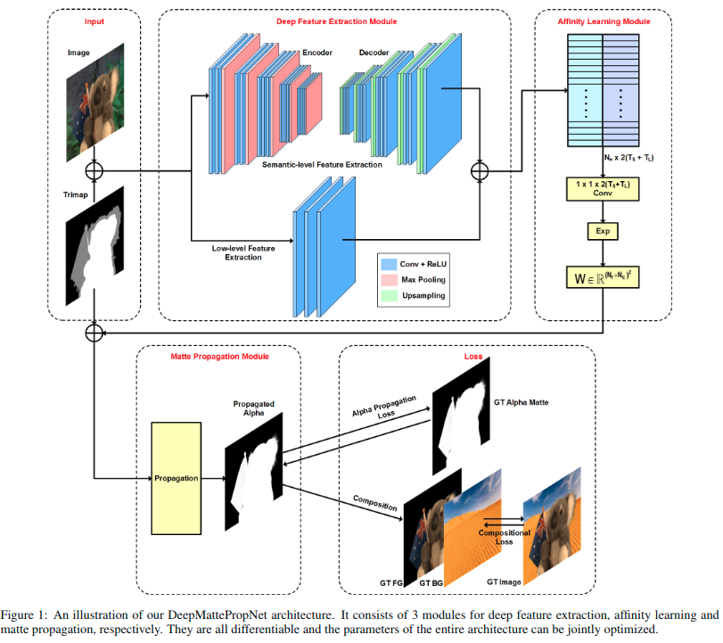

### Deep Feature Extraction Module

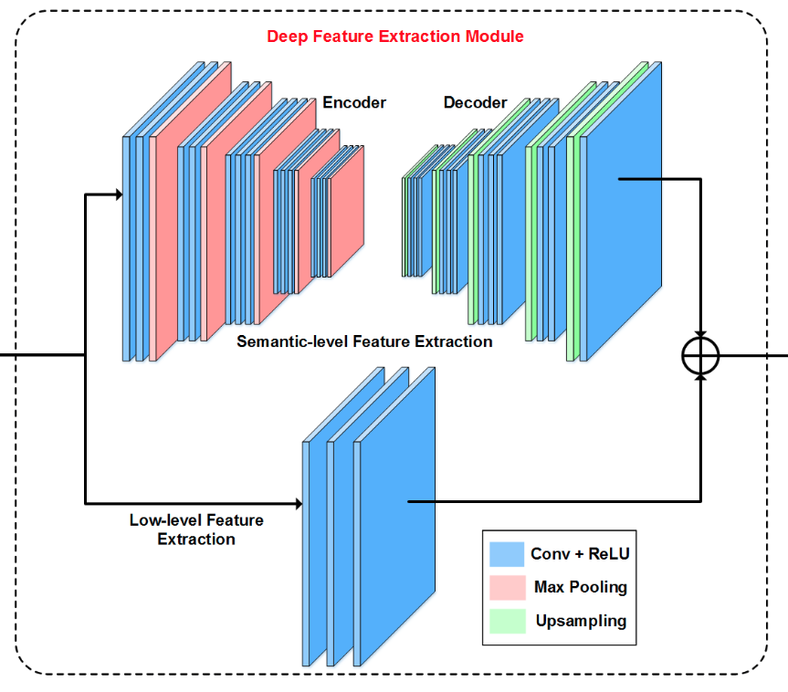

Our deep feature extraction module is comprised of two branches:

* a semantic-level feature extraction branch

    The network structure of the semantic-level feature extraction branch is identical to the SegNet[Badrinarayananet al.,2017]which consists in an encoder network and a corresponding decoder network. The encoder network transforms the input into downsampled feature maps through convolutional layers and max-pooling layers. Specifically, it consists in 13 “Conv+ReLU” layers and 5 max-pooling layers.The “Conv+ReLU” layers correspond to the first 13 convolu-tional layers of the VGG16 network[Simonyan and Zisser-man, 2014]and each of them performs convolution with a filter bank to produce a set of feature maps, batch-normalizes the feature maps and then applies an element-wise rectified-linear nonlinearity (ReLU) max(0;x). The max-pooling is carried out with a 2x2 window and stride 2. The followed decoder network semantically upsamples the features learnt by the encoder via unpooling layers and convolutional layers to get dense features for predicting pairwise similarities. It is structured in a fashion that each of its layers corresponds to one encoder layers (e.g. “Conv+ReLU” vs. “Conv+ReLU”, unpooling vs. max-pooling ). As in[Badrinarayananet al.,2017], the max-pooling indices are memorized and then resued in the upsampling process in the decoder network.

* a low-level feature extraction branch

    The branch for low-level features extraction is a network composed of 3 convolutional layers (with a 3x3 kernel), each of which is followed by a nonlinear “ReLU” layer. As shown in[Xuet al., 2017], low-level features can result in more matte details.

They learn deep image representations which will be used to *measure the pairwise similarity for the matte propagation module*. The input to these two branches is **both a 4-channel matrix** constructed by concatenating the original image and the corresponding manually-drawn trimap along the channel dimension.

> 输入都是四通道, RGB与一个trimap.

* The semantic-level feature extraction branch outputs $N_r \times N_c \times T_s$ features, where **$N_r, N_c$ and $T_s$ represent the number of rows of the original image, columns of the original image and features output by this branch, respectively**.
* The low-level feature extraction branch produces $N_r \times N_c \times T_l$ features, where **$T_l$ denotes the number of output features**.

> 之后两者直接拼接, 转化得到最后某一维度为$2(T_s+T_l)$的输出

### Affinity Learning Module

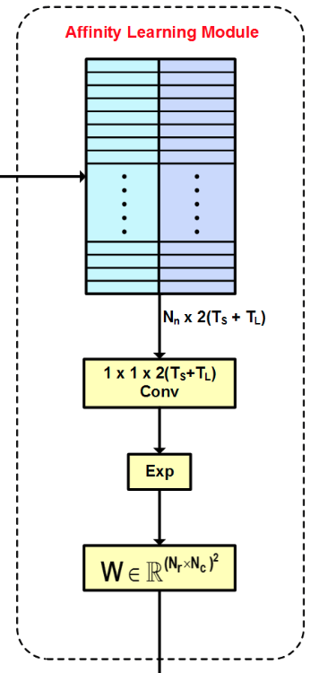

The affinity learning module learns pairwise affinity of pixels for propagation and is connected with the semantic-level feature extraction branch and the low-level feature extractionbranch of the deep feature extraction module.

* **The input to the affinity learning module is a $N_n \times 2(T_s+T_l)$ matrix** for which each row stores the learned $2(T_s+T_l)$ deep features for each pair of neighboring pixels.

    where $N_n$ denotes the total number of neighboring-pixel pairs. The **neighborhood can be defined as 4-connection** as in our paper.

* The affinity learning module consists of a *$1 \times 1 \times 2(T_s+T_l)$ convolutional layer* and an *exponential layer*.

    > 这里是怎么处理的? 原本是一个$N_n \times 2(T_s+T_l)$矩阵, 如何与$1 \times 1 \times 2(T_s+T_l)$ convolutional layer进行结合? 这里的exponential layer有什么用?

    **It predicts the affinity value for each pair of neighboring pixels.** (输出还是$N_n \times 2(T_s+T_l)$ , 只不过进行了空间的融合)

* All **affinity values output from this module form a $(N_rN_c) \times (N_rNc)$ symmetric and sparse(对称稀疏) affinity matrix $\mathbf{W}$** which will be then fed into the matte propagation module.

    > 这里是怎么由$N_n \times 2(T_s+T_l)$转化为$(N_rN_c) \times (N_rN_c)$的?

Note that these twos layers are both differentiable.

### Matte Propagation Module

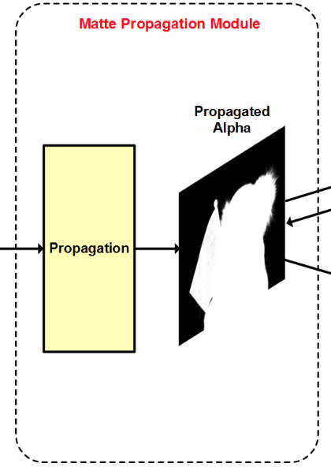

* The matte propagation module propagates **alpha matte specified by the input trimap based on the affinity matrix W**.
* It **generates a refined matte** which will be then attached to the loss module.

We provide below the mathematics related to matte propagation and prove that this module is differentiable.

From the affinity matrix W, we define **a diagonal matrix D for which each diagonal element equals to the sum of the corresponding row of W**. A typical alpha matte propagation module[Levinet al., 2008] can be expressed as

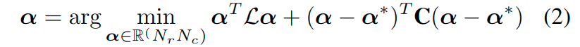

* where $\alpha$ denotes a vector (in length $N_rN_c$) of alpha matte values for all pixels
* $T$ means transpose
* $\alpha^*$ represents a vector (in length $N_rN_c$) **containing all alpha values known from the trimap**
* $L=D-W$, is a $(N_rN_c) \times (N_rN_c)$ Laplacian matrix
* $C$ stands for a $(N_rN_c) \times (N_rN_c)$ diagonal matrix for which a **diagonal element takes zero if the corresponding pixel belongs to unknown regions and a constant value c otherwise**. The value of $c$ adjusts the **importance of the labeled pixels** when propagating the alpha matte and is set as 0.8 in our paper.

> 一共对于一副$N_r \times N_c$的图像而言, 每个像素都有可能属于确知区域与未知区域, 所以这里制定了一个矩阵$C$来表示这种情况, 当属于未知区域的时候, 对应的像素的权重为0, 否则为常量$c$(以此调整已标记像素的重要性. 这里设定为0.8).
>
> $W$($(N_rN_c) \times (N_rN_c)$)表示图像中所有4连接相邻元素的成对相似性, 而$D$($(N_rN_c) \times (N_rN_c)$)以$W$中每一行的加和作为对应行的对角线元素, 构成了一个对角矩阵, $L=D-W$得到一个[拉普拉斯矩阵](#拉普拉斯矩阵).
>
> 这里的整体理解如何理解?

The solution to Eq. (2) is written as

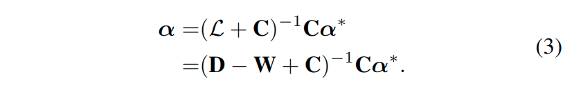

Taking the derivative of $\alpha$ relative to an element of $W_{ij}$ of $W$, where i and j index the row and column of $W$, respectively, we have

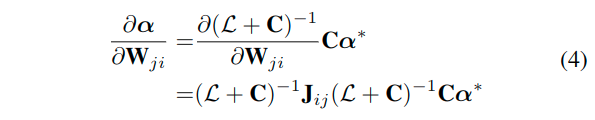

where $J_{ij}$ is a $(N_rN_c) \times (N_rN_c)$ matrix for which the element corresponding to the $i^{th}$ row and $j^{th}$ column is 1 and all other elements are zero.

In Eq. (4), the resulted matrix from $(L+C)$is huge and its inverse is hard to compute. As in[Bertasiuset al., 2016], we shrink this matrix using a simple but efficient technique in[Arbel ́aezet al., 2014].

The work in [Bertasiuset al.,2016] requires the inverse of a huge matrix to be computed for each random-walk step and demands a couple of random-walk steps for each image during training.

In contrast, ours cheme requests only one time of computation. Eq. (4) proves the differentiability of the propagation module.

**The dimensionality of the parameter space of DeepMattePropNet is significantly smaller than a network predicting per-pixel alpha matte value (e.g. the works in [Xuet al., 2017; Choet al., 2016]).** It is because the convolutional layer in this affinity learning module of DeepMattePropNet share the same weights across all pixel pairs, as shown in Fig. 1.

For example, the work in [Xuet al., 2017] requires a parameter space in a dimensionality equaling to the number of image pixels, e.g. $N_rN_c$. In contrast, our network **only needs to learn the $2(T_s+T_l)$ parameters of the convolutional kernels** plus the ones for the exponential layer in the affinity learning module, which are much fewer than the number of pixels.

> 这里为什么只用这个模块来和整体[Xuet al., 2017]作比较?
>
> 需要再看下[Xuet al., 2017]

### Losses

The average over the alpha prediction loss and composition loss in [Xuet al., 2017] is treated as the overall loss for training DeepMattePropNet. **These two losses measure the Euclidean distance between the ground-truth and the predicted one for the alpha matte and composited color image, respectively**, as shown by the following equation’s computation forone pixel:

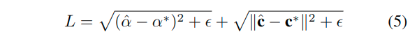

where **$\hat{a}$ and $\alpha^*$ denote the estimated and ground-truth alpha matte values**, respectively, is very small number (e.g. $10^{-12}$), and **$\hat{c}$ and $c^*$ represents the composited and ground-truth image colors**, respectively.

Note that the loss computation can involve only the pixels in the unknown regions inorder to reduce the computational complexity.

### Implementation Detail

We train the deep feature extraction module, affinity learning module and matte propagation module in the DeepMattePropNet jointly and hence they are integral parts of the network during testing.

The training is carried out in an end-to-end (original image plus trimap to alpha matte) fashion. We implement the DeepMattePropNet using Caffe and conduct training and testing on a NVIDIA Titan X graphics card.

* The training is carried out with a fixed learning rate of 0.1 and momentum of 0.9.
* The overall training phase requiresabout 20 epochs.

## Experimental Results

### Dataset

我们评估了DeepMattePropNet在两个matting任务上的表现，即基准alphamatting.com数据集[Rhemannet al.，2009]和我们自己的数据集。作为图像matting的基准挑战，alphamatting.com数据集可以在线提供原始图像和真实mattes（www.alphamatting.com）。**它包括27个用于训练的图像和8个用于测试的图像，并且每个图像都提供低分辨率trimap和高分辨率trimap**。我们在实验中仅使用更具挑战性的低分辨率trimap。

我们自己的数据集包括通过在显示室外场景的计算机监视器前拍摄46个目标对象而捕获的46个图像。为了获得它们的真实alpha matte，我们*首先在五个额外的恒定颜色背景前拍摄这些对象，然后通过使用奇异值求解组合方程的超定线性系统（如方程（1））来导出alphamatte分解（SVD）[Chuanget al。，2001]*。

对于46个图像中的每一个，我们手动绘制一个低分辨率三元组。因此，我们有81个原始图像(46+27+8)，其中有真实alpha matte和低分辨率trimap。所有图像和trimap像都调整为600x800。我们还通过使用相应的真实alpha matte来合成新图像, 来增强这些原始图像。

新的背景图像由从室内场景识别数据集[Quattoni和Torralba，2009]中随机选择的500个室内图像以及从Places数据集[Zhouetal。，2014]中随机选择的500个室外图像组成。所有室内和室外图像都调整为600x800。

此外，我们还在构图时利用前景和alpha matte的3种不同旋转。我们终于获得了总共243K(81x500x2x3)的图像。我们处理包括8个alphamatting.com测试图像的50个图像以及从其他73个原始图像中随机选择的42个图像以及作为训练集的所有合成图像以及作为测试集的所有左图像。

训练DeepMattePropNet大约需要3到4天。

对于测试阶段，600x800图像上的运行时间约为1.2秒（如果使用英特尔MKL优化的Caffe在aCPU上进行，则约为7.4秒）。

### Evaluation

We compare the  performances  of  our  DeepMattePropNet with  several state-of-the-art  techniques  including:

* the  deep image matting (DeepMatteNet) [Xu et al.,  2017]
* the CNNbased method (MatteCNN) in [Choet al., 2016]
* the closed-form (CF) matting [Levinet al., 2008]
* the CSC method proposed in [Feng et al., 2016]
* the regression algorithm in [Xiang et al., 2010]

All networks are carried out on the same training and testing images. We provide both quantitative assessments and visual evaluations.

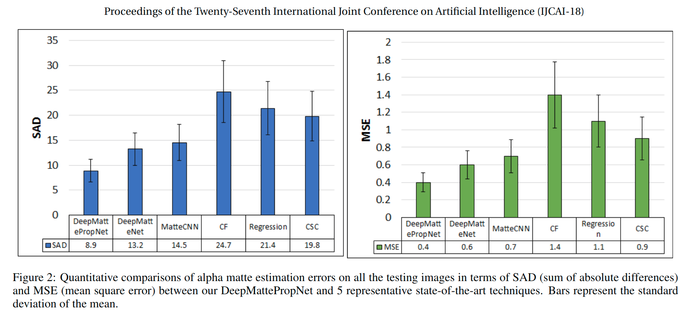

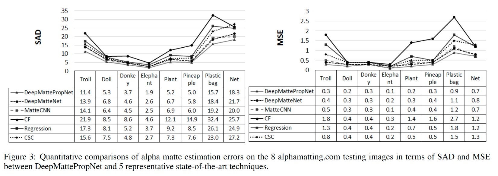

We  show  **SAD  (sum  of  absolute  differences)  and  MSE(mean square error)** values over all the testing images in our datasets  in  Fig. 2  and  the  ones  for  each  of  the  alphamatting.com testing images in Fig. 3. From these error statistics, we have at least two findings.

* First, deep learning based alpha matting techniques perform overwhelmingly better than traditional techniques. This may benefit from the superiority of deep image representations learned from a huge image dataset in contrast to the hand-designed features.
* Second, our deep matte propagation based method outperforms other two deep learning based matting techniques. This may arise from the fact that *our method learns deep image representations fora better matte propagation* **while others focus on learning the alpha matte directly**.

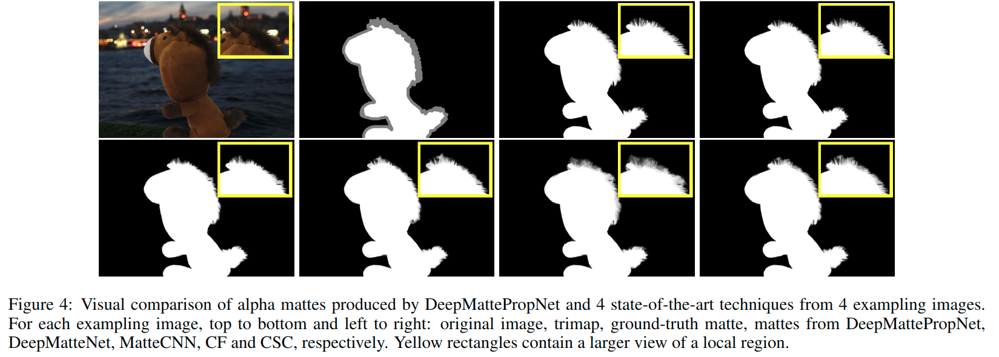

Our visual comparisons show that the DeepMattePropNet is more stable and visually pleasing for various structures of foreground object, including solid boundary, transparent areas,  overlapped  color  distribution  between  foreground  and background and long slim structures.   As shown by the results from the upper exampling image in Fig. 4, our network outperforms other techniques obviously especially at the region where the “purple hair” locates in front of the “purple book”.

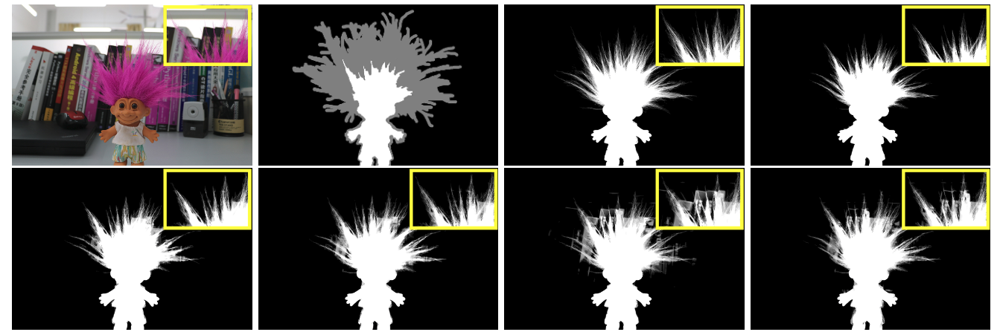

The power of our DeepMattePropNet comes from several of its advantages.

* First, it propagates matte based on not only low-level  but  also  semantic-level  image  features.   **The  former enables extraction of matte details** while **the latter may help to recognize objects and resolve problems such as the one caused by overlapped color distributions between foreground and background**.
* Second, our network predicts similarities instead of alpha matte. **This reduces significantly the dimensionality of the parameter space**.
* Third, it combines the strengths of deep learning and propagation.

## Conclusion

*Propagation based image matting techniques treat each pixel of an image as a graph’s node and connect each pair of neighboring pixels by the graph’s edge.*

边的权重测量像素之间的亲和度并反映图像matting任务的成对相似性。正如[Aksoy et al。，2017; Liu et al。，2017]，由于图像matting是一种高级视觉任务，基于传播的matting技术中使用的亲和力应该揭示语义级成对相似性。这可能是许多先前的图像matting技术在各种实际情况下可能失败的原因，因为它们主要基于低级成对相似性。

在本文中，我们表明，基于传播的图像matting的语义级成对相似性可以通过深度学习机制以纯数据驱动的方式学习。我们通过在特征学习和图像matte之间的操作序列中插入**相似性学习模块**和**matte传播模块**来执行我们的学习过程。**我们还证明这两个模块都是可微分的，因此可以使用反向传播和随机梯度下降（SGD）联合优化完整的深度学习架构。**

我们的框架比最先进的图像matting技术更有效，因为它结合了深度学习技术和基于传播的matting技术的深度图像表示的能力。此外，与大多数直接预测alphamatte的基于深度学习的matting技术不同，所提出的网络学习传播的相似性，这显着降低了参数空间的维数。来自公共alphamatting.com数据集和我们自己的数据集的实验结果显示了所提出的框架与几种具有代表性的最先进的matting技术的优越性。

特别是，我们表明，**当前景色与背景色重叠时，所提出的框架可以帮助解决matting中的困难.**

我们未来的工作包括：

1. DeepMattePropNet扩展到其他基于传播的图像编辑任务，例如图像着色和图像分割。
2. 扩展我们自己的matting评估数据集，以包含更多图像
3. 替换亲和力学习模块中的指数层，以消除潜在的梯度饱和问题。

## 重要参考

### 论文

* [A Closed Form Solution to Natural Image Matting](http://people.csail.mit.edu/alevin/papers/Matting-Levin-Lischinski-Weiss-CVPR06.pdf?)
* [Deep Image Matting](https://arxiv.org/abs/1703.03872)

### 拉普拉斯矩阵

> <https://blog.csdn.net/v_JULY_v/article/details/40738211>

#### 介绍

所谓聚类（Clustering），就是要把一堆样本合理地分成两份或者K份。从图论的角度来说，**聚类的问题就相当于一个图的分割问题**。即给定一个图$G = (V, E)$，顶点集V表示各个样本，*带权的边表示各个样本之间的相似度*，谱聚类的目的便是要*找到一种合理的分割图的方法*，使得分割后形成若干个子图，**连接不同子图的边的权重（相似度）尽可能低，同子图内的边的权重（相似度）尽可能高**。物以类聚，人以群分，相似的在一块儿，不相似的彼此远离。

为了更好的把谱聚类问题转换为图论问题，定义如下概念, 无向图$G=(V,E)$, 顶点集合V表示各个样本，带权的边表示各个样本之间的相似度.

* 与某结点邻接的所有边的权值和定义为该顶点的度d，多个d形成一个**度矩阵$D$**(对角阵).

    

* **邻接矩阵$W$**，A子图与B子图之间所有边的权值之和.

    

    其中，$w_{ij}$定义为*节点i到节点j的权值*，如果两个节点不是相连的，权值为零。

* **相似度矩阵s** 由权值矩阵得到，实践中一般用高斯核函数（也称径向基函数核）计算相似度，距离越大，代表其相似度越小。

    

* 子图A的指示向量

    

    表示顶点是否属于对应的子图.

谱聚类的基本思想便是**利用样本数据之间的相似矩阵（拉普拉斯矩阵）进行特征分解（ 通过Laplacian Eigenmap 的降维方式降维）**，然后将得到的特征向量进行 K-means聚类。

此外，谱聚类和传统的聚类方法（例如 K-means）相比，谱聚类只需要数据之间的相似度矩阵就可以了，而不必像K-means那样要求数据必须是 N 维欧氏空间中的向量。

#### 定义

给定一个有n个顶点的图G，它的拉普拉斯矩阵 $L=(l_{i,j})_{n \times n}$, 定义为: $L=D-A$, $D, A$分别表示对应的度矩阵与邻接矩阵, 二者形状是一致的.

* 若$i=j$, 则$l_{i,j}=deg(v_i)$, 表示定点$v_i$的度, 也就是邻接顶点的数量.
* 若$i \neq j$, 但是定点$v_i,v_j$相邻, 则$l_{i,j}=-1$.
* 其他情况, 则$l_{i,j}=0$

也可以将这三种值通过除以$\sqrt{deg(v_i)deg(v_j)}$进行标准化.

#### 性质

* 拉普拉斯矩阵是半正定矩阵
* 特征值中0出现的次数就是图连通区域的个数
* 最小特征值是0，因为拉普拉斯矩阵每一行的和均为0
* 最小非零特征值是图的代数连通度

#### 例子

* 图

    

* 度矩阵

    

* 邻接矩阵

    

* 拉普拉斯矩阵

    
