# DeepLab: Semantic Image Segmentation with Deep Convolutional Nets, Atrous Convolution, and Fully Connected CRFs(2016)

从论文题目, 可以看出来几个点:

1. Semantic Image Segmentation

    这个网络是适用于语义分割的作品. 对于已经知道的基础架构主要是FCN与U-Net, 这个网络里会不会提出来新的基础架构呢? 主要使用的是类似于FCN的架构(解码结构使用了直接的连接层), 但是没有跨层融合.

2. Deep Convolutional Nets

    特征提取部分用的还是深度卷积网络. 这是这个领域的探索的方向.

3. Atrous Convolution

    空洞卷积, 这里为什么要使用这样的结构呢?  是为了融合更为广泛的上下文信息.

4. Fully Connected CRFs

    CRF在这里的作用? CRF如何使用? CRF如何实现? CRF相关的概念?

    * 条件随机场(CRF)传统上被用于平滑分割图噪声. 一般模型耦合邻近节点, 有利于对空间邻近像素分配相同的标签. 定性地讲, 这些短距离CRF的主要功能是减弱基于局部手工设计特征的弱分类器的错误预测.
    * 对于双线性插值得到的特征图输出进行后处理: 通过全连接的CRF细化预测结果, 得到最终输出Final Output
    * 具体实现

---

* [DeepLab: Semantic Image Segmentation with Deep Convolutional Nets, Atrous Convolution, and Fully Connected CRFs(2016)](#deeplab-semantic-image-segmentation-with-deep-convolutional-nets-atrous-convolution-and-fully-connected-crfs2016)
  * [摘要](#摘要)
  * [介绍](#介绍)
    * [特征分辨率的下降 => atrous convolution](#特征分辨率的下降--atrous-convolution)
    * [多尺度目标共存问题 => Atrous Spatial Pyramid Pooling (ASPP)](#多尺度目标共存问题--atrous-spatial-pyramid-pooling-aspp)
    * [DCNN的不变形导致定位精度降低 => Conditional Random Field (CRF)](#dcnn的不变形导致定位精度降低--conditional-random-field-crf)
  * [模型结构](#模型结构)
  * [相关工作](#相关工作)
    * [hand-crafted features](#hand-crafted-features)
    * [DCNN提取特征](#dcnn提取特征)
      * [cascade of bottom-up image segmentation](#cascade-of-bottom-up-image-segmentation)
      * [DCNN features + segmentations](#dcnn-features--segmentations)
      * [directly provide dense category-level pixel label](#directly-provide-dense-category-level-pixel-label)
  * [技巧](#技巧)
    * [空洞卷积](#空洞卷积)
    * [ASPP](#aspp)
    * [全连接CRF](#全连接crf)
  * [实验](#实验)
    * [失败的模式](#失败的模式)
  * [结论](#结论)
  * [参考](#参考)

## 摘要

在这项工作中, 我们用深度学习来解决语义图像分割的任务, 并做出三个主要贡献, 这些贡献在实验上显示具有实质性的实用价值.

1. 首先, 我们使用上采样滤波器或“带洞的卷积(atrous convolution)”来强调卷积, 作为密集预测中的强大工具任务. Atrous卷积允许我们**明确地控制在深度卷积神经网络中计算特征响应的分辨率**. 它还允许我们**有效地扩大滤波器的视野以结合更大的上下文而不增加参数的数量或计算量**.
2. 其次, 我们提出了一个的带洞的空间金字塔池化（atrous spatial pyramid pooling ASPP）来在多个尺度上稳健地分割对象. ASPP使用多个采样率和有效视野(fields-of-view)的滤波器探测进入的卷积特征层, 从而在多个尺度上捕获对象以及图像上下文.
3. 第三, 我们通过组合来自DCNN和概率图形模型的方法来改进对象边界的定位. DCNN中通常部署的最大池化和下采样的组合实现了一定的不变性, 但是定位准确性有影响. 我们通过将最终DCNN层的响应与完全连接的Conditional Random Field(CRF)相结合来克服这个问题, CRF在定性和定量(both qualitatively and quantitatively)方面都有所提高, 以提高定位性能.

我们提出的“DeepLab”系统在PASCAL VOC-2012语义图像分割任务中, 是最先进技术, 在测试集中达到了79.7％mIOU, 并将结果推进到其他三个数据集：PASCAL-Context, PASCAL-Person-Part, 和Cityscapes. 我们所有的代码都在网上公开发布.

## 介绍

在分类与目标检测任务中, 深度卷积网络表现优异, 这种成功的关键在于DCNN对于局部图像变换的内置不变性, 这使得他们可以学习越来越抽象的数据表示, 这种不变性对于分类任务显然是理想的, 但是可能妨碍诸如语义分割的密集预测任务, 其中空间信息的抽象是不期望的. 特别考虑了在使用DCNN在语义分割中的三个困难:

1. 特征分辨率的的下降
2. 目标的多个尺度共存的问题
3. DCNN的不变形导致的定位精度的降低

下面主要讨论这几个问题.

### 特征分辨率的下降 => atrous convolution

因为重复的使用最大池化和下采样, 导致特征图空间分辨率的降低. 为了克服这个障碍并有效地生成密集的特征图,  论文的结构溢出了DCNN的最后的下采样操作, 而是在后续卷积层中对滤波器进行上采样, 从而得到以更高采样率计算的特征图. 滤波器的上采样的实现是在卷积滤波器中"插入孔", 这个技术在信号处理里有很长的历史, 最初被开发来有效计算未抽取的小波变换(也被称为"algorithme a trous"). 所以这里也使用术语"atrous  convolution"来表示这种卷积方式. 之前在DCNN中也使用过这样的想法.

实际中, 这样的的操作恢复了全分辨率的特征图, 通过带洞卷积的组合, 更为密集的计算了特征图, 然后是对特征特征图简单双线性插值, 以达到原始图像大小.

> 这里的是带洞卷积之后, 紧接着双线性插值么?

这个方案提供了一种简单但功能强大的替代方法, 可以在密集预测任务中使用反卷层. 与使用较大滤波器的常规卷积相比, atrous convolution允许有效地扩大滤波器的视野, 而不增加参数量或计算量(without increasing the number of parameters or the amount of computation).

### 多尺度目标共存问题 => Atrous Spatial Pyramid Pooling (ASPP)

解决这个问题的标准方法是对DCNN提供同一图像的不同缩放版本(图像金字塔), 然后聚合特征或得分图. 这种方法确实提升了系统的表现, 但是也带来了大量的计算损耗.

作为替代, 受空间金字塔池化所启发, 提出了一个计算上更有效的方案, 来**以多种比例重采样给出的特征图**. 这相当于使用具有互补有效视野的多个滤波器探测原始图像, 从而捕获对象以及多个尺度有用的图像内容. 我们使用具有不同采样率的多个并行的带洞卷积层, 而不是实际重新采样特征, 我们称这个技术为“带洞的空间金字塔池化”.

### DCNN的不变形导致定位精度降低 => Conditional Random Field (CRF)

第三个挑战涉及这样一个事实, 即物体中心分类器需要空间变换的不变性, 固有地限制了DCNN的空间精度. 缓解此问题的一种方法是在**计算最终分割结果时使用跳过层从多个网络层中提取“超列”特征**.

论文的工作探索了一种作者认为非常有效的替代方法. 通过**采用全连接的条件随机场(CRF)来提高模型捕获细节的能力**.

> CRF已被广泛用于语义分割, 以**将由多路分类器计算的类别分数与由像素和边缘或超像素的局部相互作用捕获的低级信息相结合**.

尽管已经提出了更复杂的工作来模拟层次依赖和/或分割的高阶依赖性, 论文使用完全连接的成对CRF(里面含有二元势函数项)进行高效计算, 并且能够捕获边缘细节, 同时还满足长距离依赖性. 该模型在[Efficient inference in fully connected crfs with gaussian edge potentials,” in NIPS, 2011]中表示可以改善基于增强的像素级分类器(a  boosting-based  pixel-level  classifier)的性能.

论文证明了当与基于DCNN的像素级分类器结合使用时, 它可以产生最先进的结果.

## 模型结构

所提出的DeepLab模型的高级图示如图1所示.

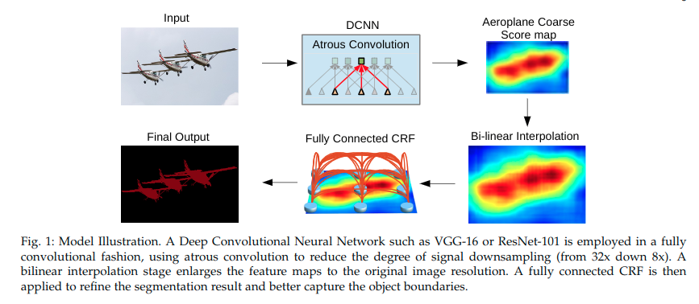

在图像分类任务中训练的深度卷积神经网络(VGG-16或ResNet-101)被重新用于语义分割的任务：

1. 完全卷积网络
2. 通过带洞卷积层增加特征分辨率, 允许计算每8个像素的特征响应, 而不是原始网络中的32个像素.
3. 采用双线性插值来对得分图进行x8上采样, 以达到原始图像分辨率, 从而产生全连接的CRF的输入, 从而确定分割结果.

从实用的角度来看, DeepLab系统的三个主要优点是：

1. 速度：凭借带洞的卷积, 论文的密集DCNN在NVidia Titan X GPU上以8 FPS运行, 而全连接CRF的平均场推断在CPU上需要0.5秒
2. 准确性：在几个具有挑战性的数据集上获得了目前最优秀的结果, 包括PASCAL VOC 2012 semantic  segmentation benchmark, PASCAL-Context, PASCAL-Person-Part, and Cityscapes
3. 简单性：系统由两个非常完善的模块DCNN和CRF组成

论文的新版本可以通过多尺度输入处理或提出的ASPP更好地分割多个尺度的对象. 我们通过调整最新的ResNet图像分类DCNN构建了DeepLab的残差网络变体, 与基于VGG-16的原始模型相比, 实现了更好的语义分割性能.

## 相关工作

### hand-crafted features

在过去十年中开发的大多数成功的语义分割系统都依赖于手工制作的特征, 结合了平坦分类器, 例如Boosting, Random Forests或支持向量机. 通过整合来自上下文和结构化预测技术的更丰富的信息, 已经取得了实质性的进展, 但这些系统的表现一直受到**特征表达能力有限**的影响.

### DCNN提取特征

在过去几年中, 深度学习在图像分类中的突破很快转移到了语义分割任务. 由于此任务涉及分割和分类, 因此一个核心问题是*如何组合这两个任务*.

#### cascade of bottom-up image segmentation

用于语义分割的第一类基于DCNN的系统通常**采用级联的自下而上的图像分割, 然后是基于DCNN的区域分类**.

- 例如, 被[Multiscale combinatorial grouping], [Selective search for object recognition]提供的边界框提议和掩膜区域被使用在[Rich feature hierarchies for accurate object detection and semantic segmentation]和[Simultaneous detection and segmentation]中, 作为DCNN输入, 来将形状信息纳入分类过程. .
- 同样, [Feed forward semantic segmentation with zoom-out features]的作者依赖于**超像素表示**. 尽管这些方法可以从良好的分割所带来的锐利边界中受益, 但它们也无法从其任何错误中恢复.

#### DCNN features + segmentations

第二类工作依赖于*卷积计算得到的DCNN特征*进行密集图像标记, 并将它们与独立获得的分割结合起来.

- 首先, [39]以多种图像分辨率应用DCNN, 然后使用分割树来平滑预测结果.
- 最近, [21]提出使用跳过层并将DCNN内的计算中间特征映射连接起来用于像素分类.
- 此外, [51]建议按区域提案汇集中间特征图.

这些工作仍采用与DCNN分类器结果分离的分割算法(分割算法与DCNN分类器的结果仍是解耦的), 从而可能导致过早做出错误决策(thus risking  commitment to premature decisions).

#### directly provide dense category-level pixel label

第三类作品使用DCNN直接提供密集的类别级像素标签, 这使得甚至可以完全丢弃分割.

[Fully convolutional networks for semantic segmentation, Predicting depth, surface normals and semantic labels with a common multi-scale convolutional architecture]的无分割方法以完全卷积的方式直接将DCNN应用于整个图像, 将DCNN的最后完全连接的层转换为卷积层. 为了处理引言中概述的空间定位问题, [FCN]对中间特征图的得分进行上采样和拼接, 而[Predicting depth, surface normals and semantic labels with a common multi-scale convolutional architecture]通过将粗略结果传播到另一个DCNN, 将预测结果从粗略细化到精细.

---

论文的工作建立在这些工作的基础上, 并且如引言中所述通过**对特征分辨率施加控制**来扩展它们, 引入**多尺度池化技术**并在DCNN之上集成全连接的CRF.

论文证明了这会导致明显更好的分割结果, 特别是沿着对象边界. DCNN和CRF的组合当然不是新的, 但以前的工作只尝试了局部连接的CRF模型.

* [53]使用CRF作为基于DCNN的重新排名系统的提议机制
* [39]将超像素视为局部成对CRF的节点, 并使用图形切割进行离散推理, 因此, 他们的模型受到超像素计算中的错误或忽略的远程依赖性的限制

相反, 论文的方法将每个像素视为由DCNN接收unary potentials的CRF节点. 至关重要的是, 论文采用的在全连接的CRF模型中的高斯CRF potentials可以捕获长程依赖性, 同时该模型适用于快速平均场推断.

注意到, 对于传统的图像分割任务, 已经广泛研究了平均场推断, 但是这些旧模型通常仅限于短距离连接.

* 在独立工作中, [57]使用非常相似的密集连接的CRF模型来改进DCNN的结果, 以解决材料分类问题. 然而, [57]的DCNN模块仅通过稀疏点监督而不是每个像素的密集监督来训练

由于这项工作的第一个版本已公开[38], 语义分割领域已经取得了巨大进展. 多个小组取得了重大进展, 显着提高了PASCAL VOC 2012语义分段基准的标准, 反映在[基准排行榜](<http://host.robots.ox.ac.uk:8080/leaderboard/displaylb.php?challengeid=11&compid=6>)的高水平活动中[58,59,60,61,62,40,17,63].

有趣的是, 大多数表现最佳的方法都采用了DeepLab系统的一个或两个关键要素：

* 高效密集特征提取的Atrous卷积
* 通过完全连接的CRF进行对原始DCNN得分的细化

下面概述了一些最重要和最有趣的进展.

最近在一些相关的工作中探索了结构化预测的端到端训练. 当论文使用CRF作为后处理方法, [59,64,65,62,40]已经成功地进行了DCNN和CRF的联合学习

* 特别是, [59,65]展开CRF平均场推断步骤, 将整个系统转换为端到端可训练的前馈网络,
* 而[62, 22]通过卷积层与可学习的过滤器近似密集CRF平均场推断的一次迭代
* [40,66]追求的另一个富有成效的方向是通过DCNN学习CRF的成对项, 以更大的计算代价显着提高性能
* 在一个不同的方向, [63]用更快的域变换模块[67]取代平均场推理中使用的双边滤波模块, 提高速度并降低整个系统的内存需求
* 而[68,18]结合语义分割边缘检测

在许多论文中都进行了较弱的监督, 放宽了像素级语义注释可用于整个训练集[69,58,70,71]的假设, 实现了比弱监督的前DCNN系统更好的结果, 如[72]. 在另一个研究领域, [49,73]追求实例分割, 共同解决对象检测和语义分割.

在这里所谓的带洞的卷积最初是为了有效计算未抽取的小波变换而开发的[A real-time algorithm for signal analysis with the help of the wavelet transform]. 带洞的卷积也与多速率信号处理中的“高贵身份”密切相关, 它基于输入信号和滤波器采样率的相同相互作用[75].

带洞的卷积是我们在[Modeling local and global deformations in deep learning: Epitomic convolution, multiple instance learning, and sliding window detection]中首次使用的术语. 同样的操作后来被称为扩张卷积(dilated convolution)[Multi-scale context aggregation by dilated convolutions], 他们创造的一个术语是由于操作对应于带有上采样(或在[15]术语中的扩张)滤波器的常规卷积操作的事实.

为了在DCNN中进行更密集的特征提取, 各种作者使用了相同的操作[16,3,6]. 除了单纯的分辨率增强之外, 带洞的卷积使扩大滤波器的视野以包含更大的上下文, 在[Semantic image segmentation with deep convolutional nets and fully connected crfs]中已经证明这是有益的.

[Multi-scale context aggregation by dilated convolutions]进一步推行了这种方法, 他们利用一系列带洞的卷积层, 以更高的速率聚合多尺度上下文信息.

这里提出的用于捕获多尺度对象和上下文的带洞空间金字塔池方案, 也采用具有不同采样率的多个空洞卷积层, 然而我们并行地而不是串行地布置(lay out in parallel instead of in serial). 有趣的是, 动态卷积技术也被用于更广泛的任务, 如目标检测[SSD, R-FCN], 实例分割[Instance-sensitive fully convolutional networks], 视觉问答和光流[Optical flow with semantic segmentation and localized layers].

正如预期的那样, 集成到DeepLab中的更高级的图像分类DCNN, 例如残差网络, 可以产生更好的结果. 这也是[High-performance semantic segmentation using very deep fully convolutional networks]独立观察到的.

## 技巧

### 空洞卷积

DCNN用于语义分割或其他密集预测任务已被证明可以通过以完全卷积方式部署DCNN来简单而成功地解决[3,14]. 然而, 在这些网络的连续层处的**最大池化和跨步的重复组合显着地降低了所得特征图的空间分辨率**, 通常在最近的DCNN中的每个方向上的因子为32倍. 部分补救措施是使用[FCN]中的“反卷积”层, 但这需要额外的内存和时间.

我们提倡使用带洞的卷积, 并且在[16, OverFeat, 6]中在DCNN上下文中使用. 该算法允许我们以任何所需的分辨率计算任何层的响应. 一旦网络经过训练, 它就可以在事后应用, 但也可以与训练无缝集成(seamlessly integrated).

下面是一维空洞卷积的例子. 途中提到了一个新的参数'rate', 这里设定为2.

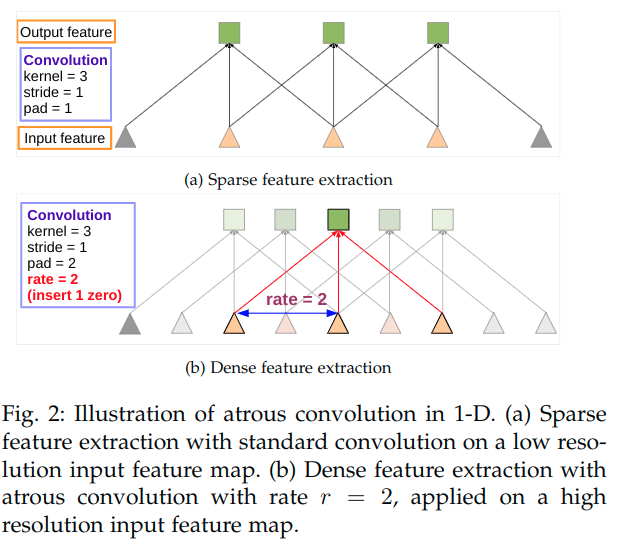

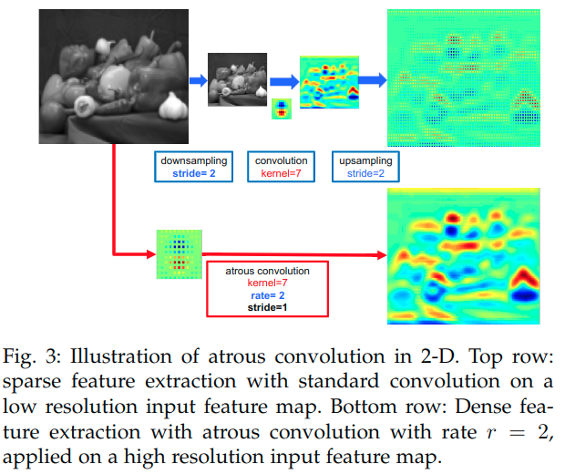

> 上分支：首先下采样将分辨率降低2倍, 做卷积. 再上采样得到结果. 本质上这只是在原图片的1/4内容上做卷积响应.
>
> 下分支：如果我们将全分辨率图像做空洞卷积(采样率为2, 核大小与上面卷积核相同), 直接得到结果. 这样可以计算出整张图像的响应, 如上图所示, 这样做效果更佳.

通过图3中的一个简单示例来说明算法在2-D中的操作：给定图像, 假设首先进行下采样操作, 将分辨率降低2倍, 然后使用垂直高斯导数内核执行卷积. 如果在原始图像坐标中植入生成的特征图, 这是仅在图像位置的1/4处获得了响应. 相反, 如果将全分辨率图像与带孔的滤波器进行卷积, 可以计算所有图像位置的响应, 其中将原始滤波器上采样2倍, 并在滤波器值之间引入零. 虽然有效滤波器尺寸增加, 但只需要考虑非零滤波器值, 因此滤波器参数的数量和每个位置的操作数量保持不变. 由此产生的方案使得能够轻松, 明确地控制神经网络特征响应的空间分辨率.

在DCNN的上下文中, 可以在层链中使用带洞卷积, 有效地允许以任意高的分辨率计算最终的DCNN网络响应. 例如, 为了使VGG-16或ResNet-101网络中计算出的特征响应的空间密度加倍, 论文发现最后一个降低分辨率的池化层或卷积层(分别为“pool5”或“conv5_1”), 设置其步幅为1, 为了避免信号抽取, 并用具有rate=2的带洞卷积层替换所有后续卷积层. **全网络使用这种方法可以以原始图像分辨率计算特征响应, 但这最终成本太高, 论文采用了混合方法, 该方法实现了良好的效率/准确性权衡**, 使用带洞卷积将计算特征图的密度增加4倍, 然后通过额外因子8快速双线性插值来恢复特征图在原始图像分辨率. 双线性插值在此设置中已足够, 因为类别得分图(对应于对数概率)非常平滑, 如图5所示.

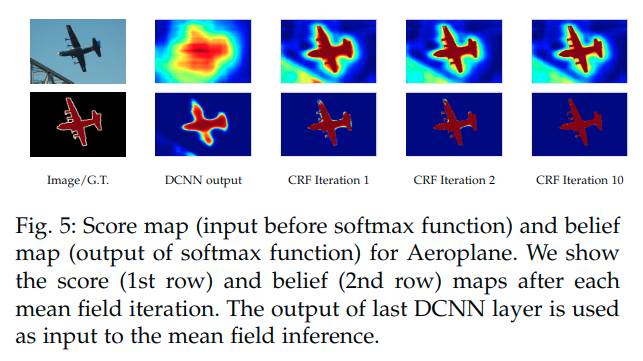

与[FCN]采用的反卷积方法不同, 所提出的方法**将图像分类网络转换为密集特征提取器无需学习任何额外参数**, 从而在实践中实现更快的DCNN训练.

Atrous卷积还允许在任何DCNN层任意放大滤波器的感受野. 最先进的DCNN通常采用空间上小的卷积核(通常3×3)以保持计算和包含的参数数量. rate=r的带洞卷积在滤波器值之间引入了r-1个连续的零, 有效地扩大了内核大小为k×k的滤波器到$k_e=k+(k-1)(r-1)$, 而不增加参数量或计算量. 因此, 它提供了一种有效的机制来控制感受野, 并找到精确定位(小感受野)和上下文一致性(大感受野)之间的最佳平衡. 论文已经成功地尝试了这种技术：DeepLab-LargeFOV模型变体在VGG-16的'fc6'层中采用了r=12的带洞卷积具有显着的性能增益.

转向实现方面, 有两种有效的方法来执行带洞卷积.

* 第一种是通过插入洞(零)来隐式地对过滤器进行上采样或者等效地稀疏地对输入要素图进行采样. 作者在之前的工作中实现了这一点, 然后在[Caffe: Convolutional architecture for fast feature embedding]中, 在Caffe框架中通过添加`im2col`函数(它从多通道特征图中提取矢量化补丁)实现了稀疏采样的选项.
* 最初由[The discrete wavelet transform: wedding the a trous and mallat algorithms]提出并在[OverFeat]中使用的第二种方法, 是通过等价于带洞卷积率r的因子对输入特征图进行下采样. 将其*隔行扫描*产生大小为$r^2$的降分辨率的图, 每个图有一个rxr可能的转变. 然后将标准卷积应用于这些中间特征图并将它们重新交换为原始图像分辨率. 通过将带洞卷积减少为常规卷积, 它允许用现成的(off-the-shelf)高度优化的卷积方式.

### ASPP

DCNN已显示出显着的隐式表示比例的能力, 只需在包含不同大小的对象的数据集上进行训练即可. 但是, 明确考虑目标规模可以提高DCNN成功处理大型和小型对象的能力.

作者已经尝试了两种处理语义分割中的尺度可变性的方法.

* 第一种方法相当于标准的多尺度处理. 使用共享相同参数的并行DCNN分支从多个(在作者的实验中)三个重新缩放版本的原始图像中提取DCNN得分图. 为了产生最终结果, 将并行DCNN分支的特征图, **双线性插值到原始图像分辨率并融合(fuse)它们**, 通过在每个位置获取不同尺度上的最大响应. 作者在训练和测试期间都这样做. 多尺度处理显着提高了性能, 但代价是在所有DCNN层计算特征响应以用于多种输入规模.

* 第二种方法的灵感来自Fast R-CNN空间金字塔合并方法的成功, 该方法表明, 通过重新采样在单一尺度上提取的卷积特征, 可以准确有效地对任意尺度的区域进行分类. 作者已经实现这个方案的变体, 其使用具有不同采样率的多个并行的带洞卷积层. **针对每个采样率提取的特征在单独的分支中进一步处理并融合以生成最终结果**. 提出的“带洞空间金字塔池化”(DeepLab-ASPP)方法概括了DeepLab-LargeFOV变体, 如图4所示.

    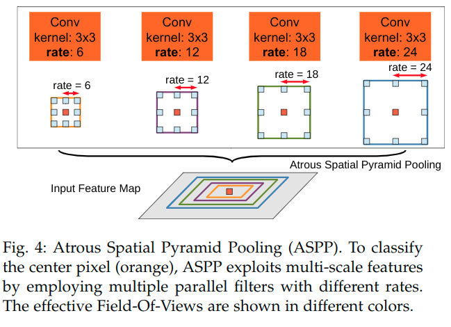

### 全连接CRF

在*定位精度和分类性能之间的权衡似乎是DCNN中固有的*：具有多个最大池层的更深层模型已经证明在分类任务中最成功, 但顶级节点的增加的不变性和大的接收域只能产生平滑的响应. 如图5所示, DCNN得分图可以预测对象的存在和粗略位置, 但不能真正描绘其边界.

以前的工作追求两个方向来解决这一本地化挑战.

* 第一种方法是利用卷积网络中多个层的信息(harness information from multiple layers), 以便更好地估计对象边界[FCN等]
* 第二种是采用超像素表示, 基本上将定位任务委托给低级分割方法[Feedforward semantic segmentation with zoom-out features].

论文基于耦合DCNN的识别能力和全连接的CRF的细粒度定位精度(fine-grained localization accuracy)来寻求替代方向, 并且表明它在解决定位挑战方面非常成功, 产生准确的语义分割结果并且在一定程度上恢复目标边界, 细节远远超出了现有方法的范围. 自第一版工作发表以来, 已经通过几篇后续文件[58,65,59,60,61,62,40,17,63]扩展了这一方向[38].

传统上, 条件随机场(CRF)已被用于平滑噪声分割图[23,31]. 通常, 这些模型**耦合相邻节点, 有利于相同标签分配到空间上近端像素**. 定性地说, 这些短距离CRF的主要功能是清理基于局部手工设计的特征构建的弱分类器的虚假预测(spurious predictions).

与这些较弱的分类器相比, 现代DCNN架构(例如论文在此工作中使用的架构)产生得分图和语义标签预测, 这些预测在本质上是不同的. 如图5所示, 得分图通常非常平滑并产生均匀的分类结果. 在这种情况下, 使用短程CRF可能是有害的, 因为**目标应该是恢复详细的局部结构而不是进一步平滑它**. 将对比度敏感势函数(contrast-sensitive potentials)与局部CRF结合使用可以潜在地改善定位, 但仍然缺少薄结构(thin-structures), 并且通常需要解决昂贵的离散优化问题.

为了克服短距离CRF的这些限制, 我们将[Efficient inference in fully connected crfs with gaussian edge potentials]的全连接的CRF模型集成到我们的系统中. 该模型采用能量函数

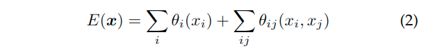

这里$x$是**像素的标签分配**. 我们用作一元势函数$\theta_i(x_i)=-log(P_i)$, 这里的$P(x_i)$是由**DCNN计算的像素i处的标签分配概率**. 二元势函数具有允许在使用全连接图时进行有效推断, 即当连接所有图像像素对$i,j$时.

特别是, 如[Efficient inference in fully connected crfs with gaussian edge potentials]中所述, 我们使用以下表达式：

这里$x$是像素的标签分配. 这里的$\mu(x_i, x_j)=1 \ if\ x_i \neq x_j \ else\ 0$.

> 这与Potts模型一样, 意味着只有具有不同标签的节点才会受到惩罚.

剩下的表达式在不同的特征空间中使用两个高斯核; 第一个“双边”核取决于*两个像素位置(表示为p)和RGB颜色(表示为$I$)*, 第二个核只取决于*像素位置*. 超参数$σ_α, σ_β和σ_γ$控制高斯核的规模.

**第一个核强制具有相似颜色和位置的像素具有相似的标签, 而第二个核仅在强制平滑时考虑空间接近度. **

> 从形式上理解, 对于指数项, 像素i与j之间的距离差距越大(以及色彩差异越大), 那么两者导致的取值位置偏离中心也就越远, 造成指数项更小. 这就是整个表达式取值越小. 也就是说, **差异越大的像素之间对应的整个表达式的值越小**.
>
> 按照上面这句话, "强制具有相似颜色和位置的像素具有相似的标签", 也就是说, 要使得式子趋于0, 使相似的像素具有相似的标签, 不相似的像素保留差异.

至关重要的是, 该模型适用于有效的近似概率推理[Efficient inference in fully connected crfs with gaussian edge potentials]. 消息在完全可分解的平均场近似下传递更新, $b(x)=Π_ib_i(x_i)$可以表示为双边空间(bilateral space)中的高斯卷积. 高维滤波算法[Fast high-dimensional filtering using the permutohedral lattice]显着加速了这种计算, 从而产生了一种在实践中非常快速的算法, 使用[Efficient inference in fully connected crfs with gaussian edge potentials]的公开实现, 对Pascal VOC图像平均需要少于0.5秒.

## 实验

关于几个变体:

- LargeFOV: 直接在网络的顶层部分的第一个卷积进行修改
- ASPP: 对顶层部分进行了多分支金字塔处理
    - S: r={2,  4,  8,  12}
    - L: r={6,  12,  18,  24}

---

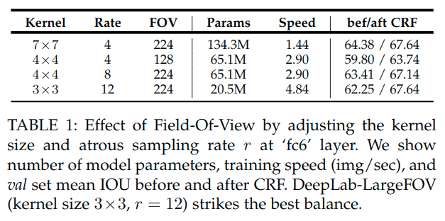

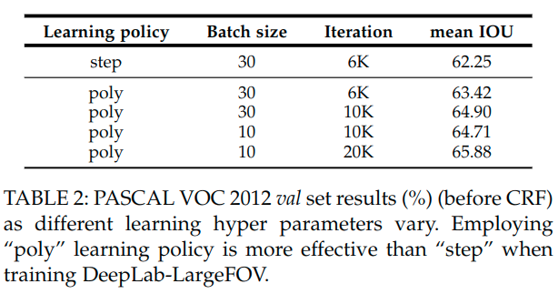

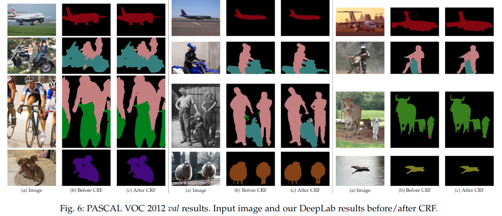

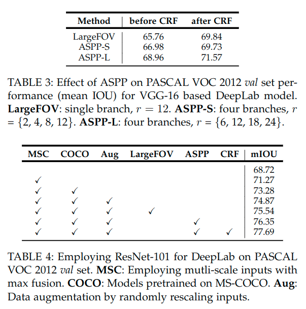

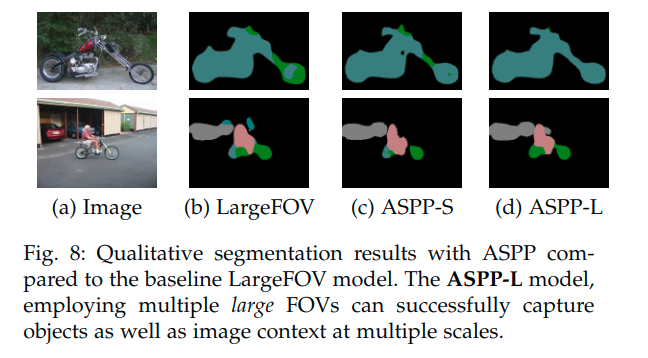

### 失败的模式

进一步定性分析最佳模式变体的一些在PASCAL VOC 2012 val set上的失效模式. 如图14所示, 提出的模型未能捕捉对象的微妙的界限, 如自行车和椅子. 细节甚至不能被CRF后加工恢复, 因为一元项不够自信.

假设[Segnet: A deep convolutional encoder-decoder architecture for image segmentation, U-net: Convolutional networks for biomedical image segmentation]的encoder-decoder结构在解码路径中利用高分辨率特征映射, 可能会缓解这个问题. 如何有效地合并这些方法作为未来的工作.

## 结论

> 总体流程:
>
> 1. 改造针对分类任务预训练好的DCNN(把全连接层换成卷积层, 加上空洞卷积和ASPP模块)得到粗略预测结果, 即Aeroplane Coarse Score map
> 2. 通过双线性插值扩大到原本大小, 即Bilinear Interpolation
> 3. 再通过全连接的CRF细化预测结果, 得到最终输出Final Output
>
> DeepLabv2是在DeepLabv1的基础上做了改进. 加上ASPP后新的版本可以更好的分割多尺度物体. 基础层由VGG16换成了更先进的ResNet, 可以获得更好的分割结果.

提出“DeepLab”系统通过应用的上采样滤波器组成的带洞卷积实现密集的特征提取, 进行网络训练的语义分割图像分类任务. 论文进一步扩展为带洞的空间金字塔池化、编码目标以及多尺度图像上下文. 为了产生语义准确的预测和详细的沿着目标边界的分割图, 也结合了深度卷积神经网络和全连接条件随机场的手段. 实验结果表明, 提出的方案显著提升了一些具有挑战性的数据集的效果.

## 参考

各种学习率改变策略: https://blog.csdn.net/Cheese_pop/article/details/52024479

* Fixed: 学习率不变
* Step: 固定步数减少gamma倍: $lr=lr×gamma$
* Polynomial: 多项式曲线下降: $LR(t)=base\_lr×(\frac{t}{T})^{power}$
* Inv: 随迭代次数增加而下降: $LR(t)=base\_lr×(1+gamma×iter)^{power}$

文中使用了多项式曲线下降.

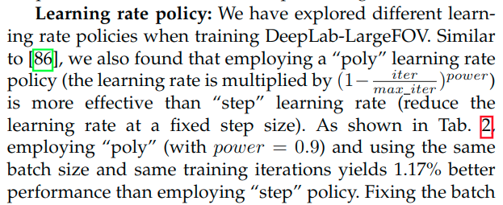
