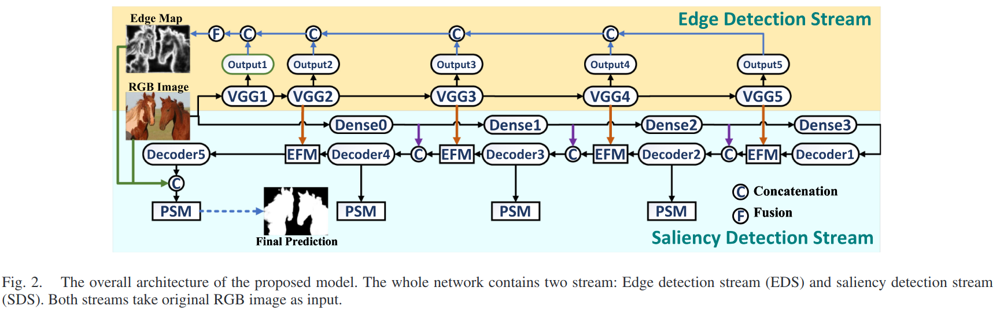
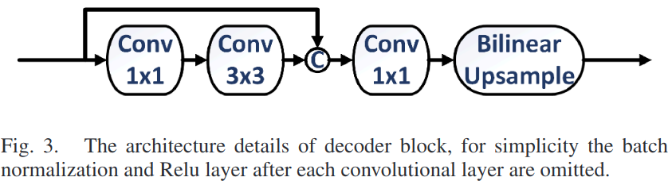
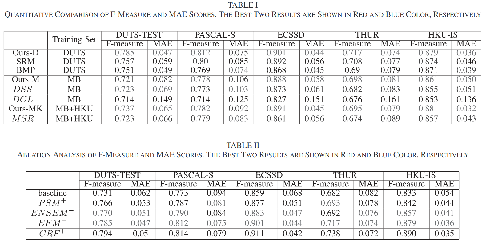
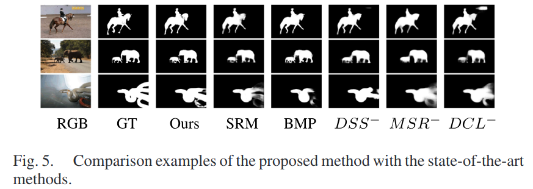
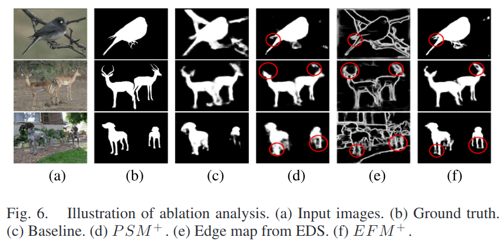

# Edge-Aware Convolution Neural Network Based Salient Object Detection

> Wenlong Guan, Tiantian Wang, Jinqing Qi, Lihe Zhang and Huchuan Lu, Edge-Aware Convolution Neural Network Based Salient Object Detection, IEEE Signal Processing Letters, Vol. 26, No. 1, P114-118,2019 [PDF(baidu)](https://pan.baidu.com/s/1RsgfISTe7MHprUtwtvYbvQ) [PDF(google)](https://drive.google.com/file/d/1vF4HqiKE7iapWPPmzvttbrz68PEspMuB/view?usp=sharing)

## 概要

近年来，目标检测受到了广泛的关注。在这篇论文中，提出了一种新颖的目标检测算法，该算法将全局信息信息与低级边缘特征相结合。

首先，我们基于目前最优的边缘检测模型HED训练边缘检测流，并从每个VGG块中提取层级边缘信息。

然后，边缘轮廓作为*互补边缘感知信息*，并与显着性检测流集成，以显示显着目标的连续边界。

最后，我们将具有辅助侧输出监督的金字塔池化模块组合在一起，形成基于金字塔的多尺度检测模块，为显著性检测网络提供多尺度的全局上下文信息。

与以前的方法相比，所提出的网络包含更明确的边缘感知特征，更有效地利用多尺度全局信息。实验证明了所提方法的有效性，该方法在五个流行的基准测试中实现了最先进的性能.

## 架构解释

### 整体结构

The structure of the proposed method is illustrated in Fig. 2, which consists of two streams. The EDS is based on the VGG-16 network, and the SDS is based on the DenseNet which composedof two components: EFM and PSM.

* EDS: edge detection stream
  * conv2-2 (128 channel)
  * conv3-3 (256 channel)
  * conv4-3 (512 channel)
  * conv5-3 (512 channel)
* SDS: saliency detection stream
* EFM: edge-aware fusing module
  * 直接连接 $F _ { i } = \operatorname { Cat } \left( X _ { i } , E _ { j } \right)$
  * fuse them respectively with the output of Decoder4, Decoder3, Decoder2 and Decoder1 blocks through concatenation operation
  * for Decoder5, which has the same spatial resolution as the input image, we additionally fuse the final edge detection result (1 channel) with the original RGB image (3channel) to form the strongest complementary details
* PSM: pyramid-based supervision module
  * 多尺度监督 $S _ { i } = \sigma \left( W _ { i } * \operatorname { Cat } \left( W _ { i , 1 } * P P _ { 1 } \left( X _ { i } \right) , \ldots , W _ { i , n } * P P _ { n } \left( X _ { i } \right) \right) \right)$
    * $X _ { i } ( i \in \{ 2,3,4,5 \} )$表示第i个Decoder的输出
    * $P P _ { n }$表示第n($n \in \{1, 2, 3, 4\}$)级上的金字塔池化操作
    * $W _ { i , n }$表示1x1卷积的权重
    * $\sigma$是sigmoid函数
    * $S _ { i } ( )$表示最终的第i个边输出的预测
  * At the training phase, each auxiliary prediction Si will be supervised by the ground truth saliency mask through pixel-wise cross entropy loss separately.
  * During the inference time, we only pick the output of S5, which has the same resolution asthe input image. (一种深监督的手段)
* PPM: pyramid pooling module

### 解码器结构

### 测试结果

#### 量化比较

Since our method do not have a post-process, so the non-CRF version of DCL(DCL−), DSS(DSS−), MSR(MSR−) are used for comparison. As shown in Table I. Our method outperforms the existing methods in most cases.

Qualitative Evaluation: Fig. 5 shows the visual comparison of the proposed method with other algorithms. As illustrated in the picture, our method **successfully preserves the boundary and suppress background noise simultaneously**, producing overall better prediction maps.

#### 消融实验

We first implement the encoder-decoder structure based on DenseNet121 as our baseline model, then apply PSM inthe decoder part, namely PSM+. On the basis of PSM+, Edge-aware Fusing Module is additionally integrated to generate our final network EFM+.

The F-measure and MAE scores are shown in Table II across all five datasets, here we use the results *trained on DUTS dataset*.

It can be seen that both modules can improve the performance by a relatively large margin.

To demonstrate that the improvement of EFM+ comes from the edge-aware ability instead of ensemble of the VGG and DenseNet, we train the EDS and SDS together with the saliency detection dataset, namely ENSEM+. The results show that ENSEM+ has a slight improvement compared with PSM+, but is not comparable with EFM+.

Since our EFM module mainly focus on refining the boundary area, so we also made a comparison with the widespread post-processing method DenseCRF by replacing EFM+ with
CRF+. The result shows that ourEFM+can still achieve comparable results in MAE.

But since CRF method is a post-processing method, **it is much less time-efficient, can only runat 3fps during inference**. Besides, **its performance highly rely on the original saliency map**, which makes it less robust than the learning-based method.

Fig. 6 shows the qualitative results. We find that the PSM helps highlight the salient objects and improve the spatial coherence of detected salient area, while the EFM produces sharp boundaries and help distinguish the partly overlapped objects. As illustrated in the figure, the edge map is able to emphasize the salient object boundary in most cases. Although it may also bring some noise into SDS, the supervised SDS can learn to leverage the emphasized boundary information while discard the unintended noise as the training processes.
