# PiCANet: Pixel-wise Contextual AttentionLearning for Accurate Saliency Detection

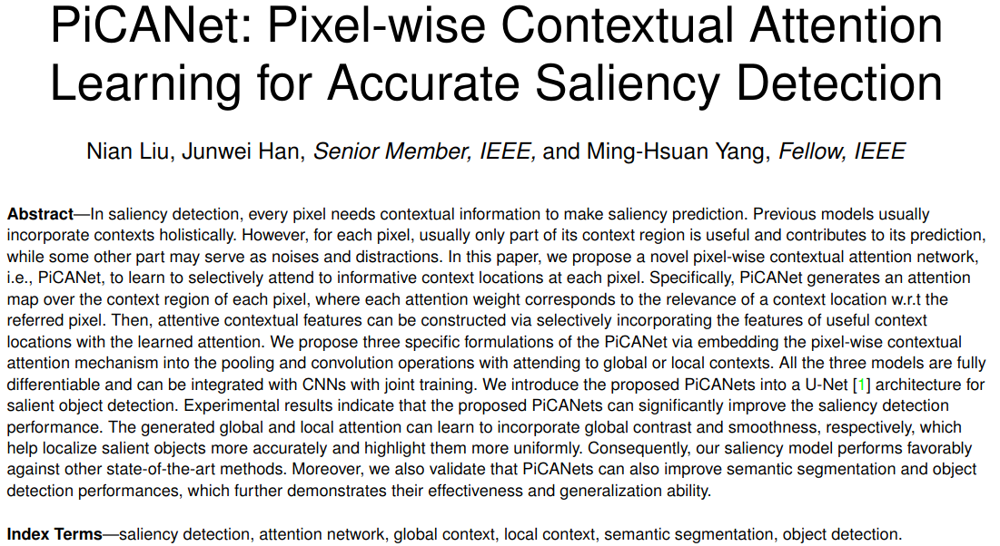

## 理论

**Contextual information plays a crucial role in saliency detection, which is typically reflected in the contrast mechanism**. In one of the earliest pioneering work [6], Itti et al. propose to compute *the  feature  difference  between  each  pixel  and  its  surrounding regions  in  a  Gaussian  pyramid  as  contrast*.  Following  this  idea, many  subsequent  models [Bttom-up saliency based on weighted sparse coding residual]，[**Globalcontrast  based  salient  region  detection**]，[Center-surround  divergence  of  featurestatistics for salient object detection]  also  employ  the  contrast mechanism  to  model  visual  saliency.  In  these  methods,  **local context  or  global  context  is  utilized  as  the  reference  to  evaluatethe  contrast  of  each  image  pixel**,  which  is  referred  as  the  local contrast  or  the  global  contrast,  respectively.  Generally,  a  feature representation  is  first  extracted  for  each  image  pixel.  Then  the features of all the referred contextual locations are aggregated into an overall representation as the contextual feature to infer contrast.

上下文信息在显着性检测中起着至关重要的作用，这通常反映在对比度机制中。在最早的开创性工作之一[A  model  of  saliency-based  visual  attention for rapid scene analysis]建议在高斯金字塔中计算每个像素与其周围区域之间的特征差异作为对比度。

根据这个想法，许多后续模型 [Bttom-up saliency based on weighted sparse coding residual]，[**Globalcontrast  based  salient  region  detection**]，[Center-surround  divergence  of  featurestatistics for salient object detection] 也采用对比度机制来模拟视觉显着性。在这些方法中，利用局部上下文或全局上下文作为评估每个图像像素的对比度的参考，其分别称为局部对比度或全局对比度。

通常，首先针对每个图像像素提取特征表示。然后将所有被引用的上下文位置的特征聚合到整体表示中作为用于推断对比度的上下文特征。

## 结构

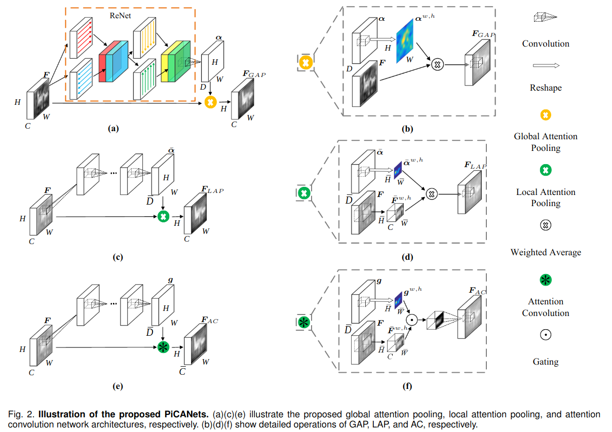

### 结构a, b(Global Attention Pooling GAP) => 获取全局注意力信息

对于输入的F(CxHxW)进行一个残差式结构, 在残差部分, 使用两组(左右与上下, 沿F的每一行/每一列部署双向LSTM, 然后将每个像素的两个隐藏状态连接起来，使每个像素都记忆它的上下文信息)双向LSTM勾连混合来自四个方向的上下文信息, 将每个像素的信息传播到所有的其他像素, 因此，全局背景被有效地结合在每个像素处.

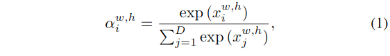

接下来, 利用卷积操作, 使得输出变为$\alpha=D \times H \times W$, 注意这里的$D = W \times H$.

这个认为是一个对原始F的HW平面上各个点的一个全局注意力权重信息的表示.

对于$\alpha$中的$(w,j)$处对应的D维向量, 表示对应于F中的$(w,j)$位置处的点所对应于全局($D = W \times H$)的注意力权重分布.

---

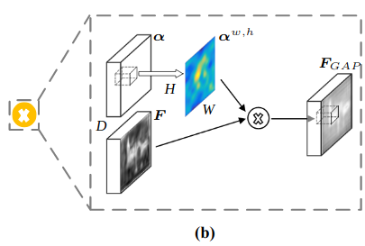

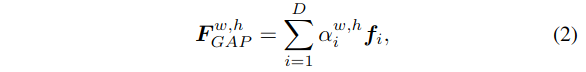

这里表示了残差块的输出计算方式. 针对输出的$(w, h)$位置, 用注意力权重图上对应的D维向量对整个原始的F的数据$f_i \in R^C$进行对应的加权, 求和得到该处的结果.

最终得到了和原始输入F一样的大小的$F_{gap}$.

### 结构c, d(Local Attention Pooling LAP) => 获取局部注意力信息

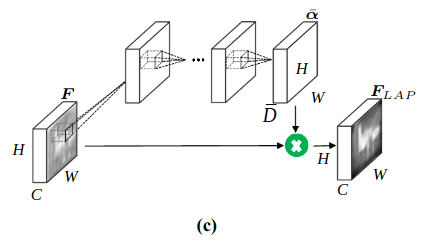

这里对于输入的F进行了类似的操作, 与获取全局注意力权重的流程不同, 这里的使用的是普通的卷积操作, 来获取局部范围内的信息, 在计算局部的注意力权重输出的时候, 这里的通道数是卷积核感受野的面积值.

---

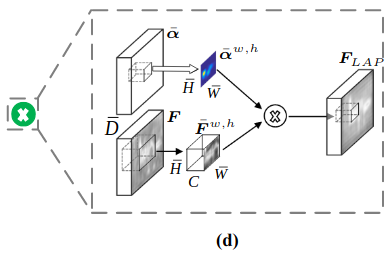

计算的方式和前面的一致.

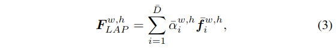

### 结构e, f(Attention Convolution AP) => 注意力卷积操作

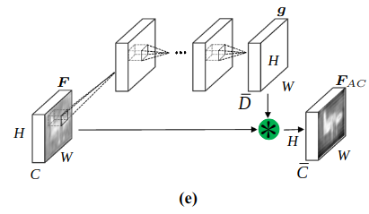

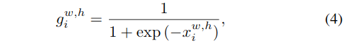

和LAP结构类似, AC模块也是生成并利用对于每个像素的局部注意力. 不同的是, AC生成的sigmoid注意力权重, 被用作"门"的机制, 来控制是否每个局部的上下文需要被考虑到对应的中心像素的卷积特征提取操作中, 确定其信息是否应该流到下一层来对$(w, j)$处进行特征提取.

这里使用sigmoid函数生成注意力权重, 当值为负就会小于0.5, 值为正, 就会大于0.5.

---

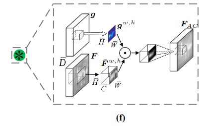

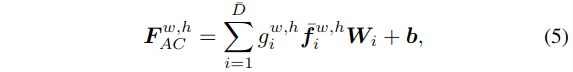

由于这里是门控的作用, 所以还是要计算一个特定的卷积计算, 这里公式中的W就是卷积核的权重, b是卷积的权重.

这里可以获得最终获得注意力特征图$F_{AC}$.

相较于LAP结构, AC部分在参加的功能之上引入了进一步的非线性转换. 这可能会导致更具辨别力的特征抽象，但需要学习更多参数.

### 整体架构

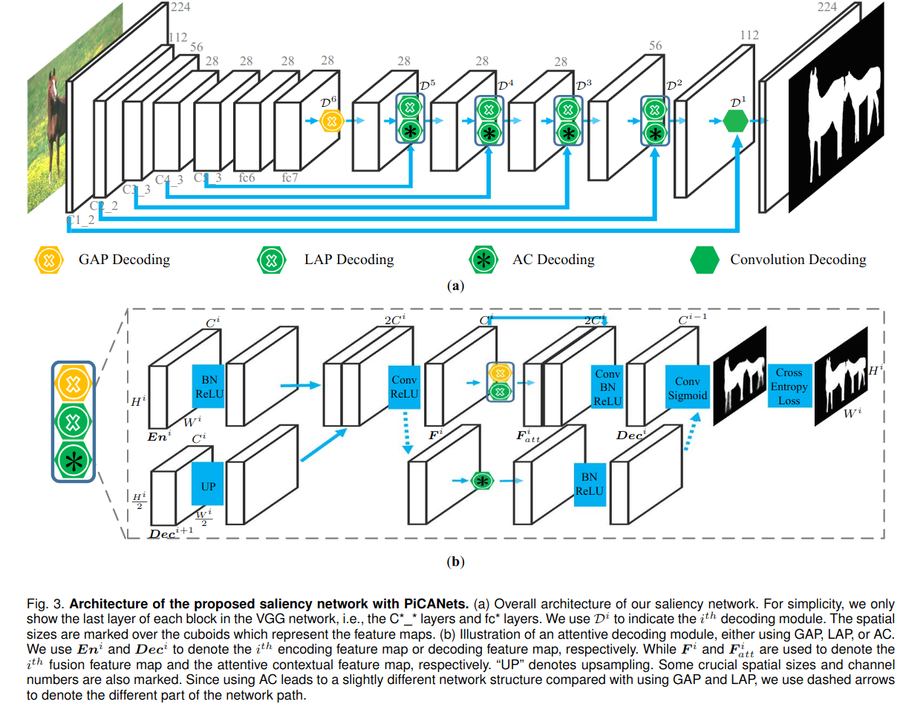

整个网络基于U-Net架构，如图3a所示。与原始实现不同，我们在编码器网络中使用dilation convolution来保留大尺寸的特征映射，以避免丢失太多的空间细节。解码器遵循U-Net的思想使用跳跃连接，但特别是我们提出的嵌入式PiCANet.

#### 编码器

考虑到GAP模块要求输入要素图具有固定大小，我们直接将图像大小调整为固定大小224x224作为网络输入。我们模型的编码器部分是具有预训练骨干网络的FCN，我们选择VGG16层网络进行公平比较。VGG-16网包含13个Conv层，5个最大池层和2个完全连接的层。

如图3a所示，为了在较高层保留相对较大的空间大小以进行精确的显着性检测，我们将pool4和pool5的步幅减小为1，并为Conv5块中的卷积核引入2的扩张。我们还遵循[14]将最后2个完全连接的层转换为Conv层，以保留在其中学习的丰富的高级特征。

具体来说，我们将**fc6层设置为1024个通道和3x3的Conv核，k扩张率为12，而fc7层设置为具有相同的通道数和1x1Conv内核**。因此，整个编码器网络的步幅减小到8，最终特征图的空间大小为28x28。

#### 解码器

注意几个标识:

* 解码器模块: $D_i$
* 编码器模块各块最后位置的ReLU激活之前的卷积输出特征图: $En_i$
* 解码器输出的特征图: $Dec^{i+1}$

$D^i$使用编码器特征图$En^i$来融合之前生成的$Dec^{i+1}$. 这里$En^i$的大小表示为$C^{i} \times H^{i} \times W^{i}$. 所有的六个选定的编码器特征图被标记在图3a中.

> 解码器输出特征图中有一个例外, $Dec^{6}$直接由$En^{6}$输入$D^6$后生成, 而没有利用多余的解码特征图, 并且$En^{6}$来自fc7层.

具体解码过程被综合绘制在图3b中, 特别的, 先传递$En^i$通过一个BN+ReLU(用于标准化和非线性转换)处理，在对双线性插值上采样为$En^i$大小的$Dec^{i+1}$进行拼接为$(2C^i \times H^i \times W^i)$, 之后进行Conv+ReLU处理, 生成了$(C^i \times H^i \times W^i)$大小的$F^i$, 之后再根据如图3a中不同位置的预设操作进行对应的处理, 这里对于GAP/LAP和AC的操作流程有些差异.

* 对于前两者, 由于获得的注意力上下文加权特征图在每个像素的$F^i_{att}$相当于就是对于$F^i$的一个简单的线性组合, 所以使用其作为原始特征$F^i$的一个补充信息, 这里将其拼接融合, 通过Conv+BN+ReLU来生成最终的$Dec^i$($C^{i-1} \times H^i \times W^i$).
* 对于后者(AC)而言, 因为它已经合并了注意力和卷及操作, 这里直接设定其通道数为$C^{i-1}$, 并在BN+ReLU之后生成$Dec^i$($C^{i-1} \times H^i \times W^i$).

这里为了最终的计算效率, 在$D^1$的位置并不是用任何的PiCANet模块, 也就是说, 在这里, $En^1$和$Dec^2$直接通过卷积层, 融合到$Dec^1$中.

## 损失

### 平均交叉熵显著性损失

为了促进训练, **对每个解码模块, 采用了深监督的策略**. 在$D^i$处, 使用只有一个输出通道并且使用sigmoid激活的卷积层来对$Dec^i$进行处理, 来生成一个显著性图$S^i$($H^i \times W^i$). 然后将真值放缩到相同大小, 这里表示为$G^i$, 来监督网络训练. 这个部分损失函数使用平均交叉熵损失$L^i_S$来表示:

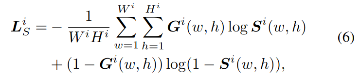

这里的$G ^ { i } ( w , h )$和$S ^ { i } ( w , h )$(在第i个解码模块($D^i$)输出的预测(从$Dec^i$经过Conv(channels=1)+sigmoid)得到的预测结果)表示$(w, h)$处的显著性值(真值/预测值).

使用交叉熵, 就是为了让真值与预测之间的距离更小, 预测更为接近真实值.

### 全局注意力损失

我们模拟全局对比机制，**从真实显著性图中提取前景和背景区域，分别监督全局注意力背景和前景像素的学习**。这里使用$D^6$为例, 首先生成针对每一个$\boldsymbol { F } ^ { \boldsymbol { 6 } }$中的像素$(w, h)$的归一化真值全局注意力图$\boldsymbol { A } ^ { w , h }$:

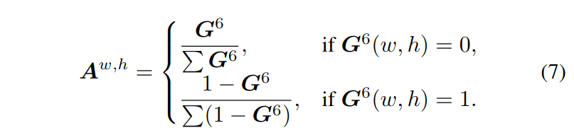

这里可以看出, 对于所有的$G ^ { 6 } ( w , h )$, 只要值相同, 那就对应的$A$相同. 这里的$A^{w, h}$应该表示的是一个$(w, h)$处的向量. 长度正好的针对与全图的, 也就是$G$的像素数量. 也就是说, 最真实的注意力权重就是这里设定的这样.

> 这样设定怎么理解呢?

然后使用每个像素上计算的$\boldsymbol { A } ^ { w , h }$和$\alpha ^ { w , h }$之间的KL散度来作为全局注意力损失$\boldsymbol { L } _ { G A } ^ { 6 }$:

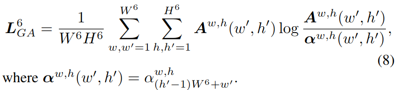

这里的公式中的$\alpha _ { \left( h ^ { \prime } - 1 \right) W ^ { 6 } + w ^ { \prime } } ^ { w , h }$表示全局注意力模块的输出的注意力权重图的$((h'-1)W^6+w', h, w)$位置上的值.

也就是二者之间距离越小越好.

### 总体损失

对于各处解码模块中的显著性损失和全局注意力损失损失的加权求和:

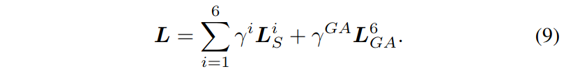

这里的全局注意力损失由于只在$D^6$处使用了全局注意力模块, 所以只需要计算一次即可. 而其他的交叉熵损失则需要六个模块都要计算一下.

## 数据集

We use six widely used saliency benchmark datasets to evaluateour method.

* SOD[54] contains 300 images with **complex backgrounds and multiple foreground objects**.
* ECSSD[55] has 1,000 **semantically meaningful and complex images**.
* The PASCAL-S[52] dataset consists of 850 images selected from the PASCALVOC 2010 segmentation dataset.
* DUT-O[51] includes 5,168 challenging images, each of which usually has **complicated background and one or two foreground objects**.
* HKU-IS[15] contains 4,447 images with **low color contrast and multiple foreground objects in each image**.
* The last one is the DUTS[53] dataset, which is **currently the largest salient object detection benchmark dataset**. It contains 10,553 images in the training set, i.e., DUTS-TR, and 5,019 images in the test set, i.e., DUTS-TE.

Most of these images have challenging scenarios(场景) for saliency detection.

## 指标

三个像素级误差, 几乎没有考虑任何结构信息:

* PR曲线(0~255 threshold)
* F-measure score(0~255 threshold => max F-measure)
* MAE(mean absolute error)

还采用了structure-meature metric $S_m$来评估$S$与$G$区域和目标的结构相似性. 这里使用和[58]相同的权重, 来计算两种相似性的平均值作为$S_m$得分.

## 实现细节

### 网络结构

* 在解码模块, 所有的卷积核被设定为1x1
* 在GAP模块中, 对ReNet使用256个隐藏单元, 使用1x1卷积层来生成D=100维度的注意力权重, 可以被整形成10x10的注意力图. 在其参与的操作中, 使用扩张率为3来考虑28x28的全局内容.
* 在每个LAP或AC模块, 首先使用一个7x7的扩张率为2的卷积层, 适当的padding, 并且ReLU激活函数生成一个有着128通道的中间特征图. 然后应用一个1x1卷积层来生成$\overline { D } = 49$维度的注意力权重, 从中可以获取7x7的注意力图. 因此可以使用扩张率为2和适当padding来考虑13x13的局部上下文区域.

### 训练与测试

We follow [25], [28], [29], [30] to usethe DUTS-TR set as our training set.

For data augmentation, we simply resize each image to 256x256 with random mirror-flipping and then randomly crop 224x224 image regions fortraining.

The whole network is trained end-to-end using stochastic gradient descent (SGD) with momentum.

对于各项损失的权重, 经验设定$\gamma ^ { 6 } , \gamma ^ { 5 } , \ldots , \gamma ^ { 1 }$ as 0.5, 0.5, 0.5, 0.8, 0.8, 1, 没有进一步的调整. 而$\gamma ^ { G A }$被设定为0.2(基于性能验证).

We train the decoder part with random initialization and the learning rate of 0.01 and finetune the encoder with a 0.1 times smaller learning rate.

We set the batchsize to 9, the maximum iteration step to 40,000, and use the “multistep” policy to decay the learning rates by a factor of 0.1 at the 20,000th and the 30,000th step. The momentum and the weight decay are set to 0.9 and 0.0005,respectively.

When testing, each image is directly resized to 224x224and fed into the network, then we can obtain its predicted saliency map from the network output without any post-processing.

The prediction process only costs 0.127s for each image.

## 性能评测

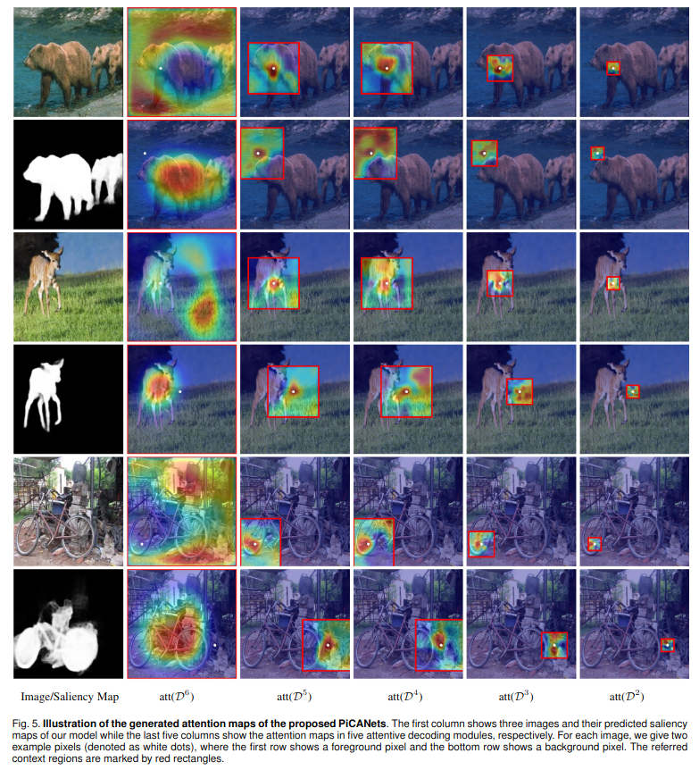

为了进一步理解为什么PiCANets可以实现这样的改进，我们在图5中的三个图像中可视化生成的背景和前景像素的注意力图。

在第二列中显示生成的全局注意力图。注意力图显示GAP模块连续学习全局对比以关注背景像素的前景对象并参与前景像素的背景区域。因此，GAP可以帮助我们的网络有效地区分显着对象和背景。

至于局部注意，由于我们对不同的解码模块使用固定的注意力大小（13x13），我们可以将多尺度的注意力从粗到细，大的上下文结合到小的，如图5中的后四列中的红色矩形所示。注意图表明，局部注意力主要在于与参考像素具有相似外观的区域，从而将显着图增强到均匀和平滑，如第一列所示。

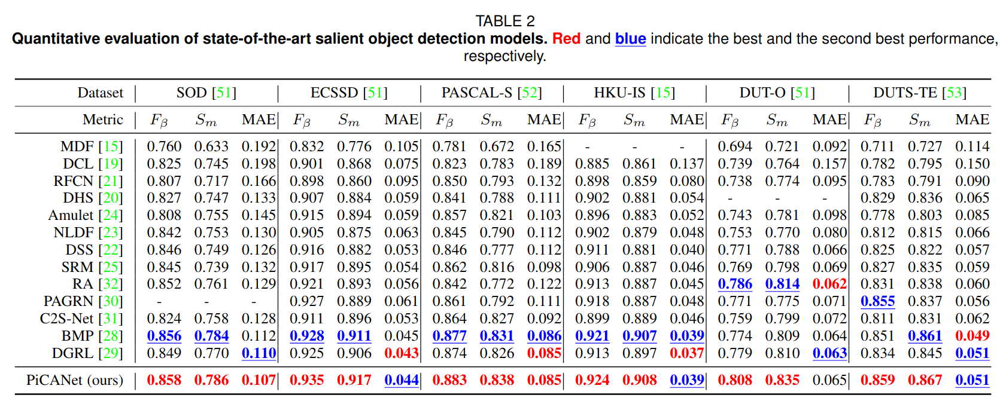
