# Pyramid Scene Parsing Network(2016)

## 概要

场景解析对于不受限制的开放式场景和多样化场景具有挑战性。在本文中，通过金字塔池化模块以及提出的金字塔场景解析网络（PSPNet）实现的, 通过基于不同区域的上下文聚合来利用全局上下文信息。

文中的全局先验表示对于在场景解析任务中产生高质量结果是有效的，而PSPNet为像素级预测提供了优越的框架。所提出的方法在各种数据集上实现了最先进的性能。它首先出现在ImgeNet scene parsing challenge 2016，PASCAL VOC 2012 benchmark 和 Cityscapes benchmark。单个PSPNetyield在PASCALVOC 2012上的mIoU准确率为85.4％，Cityscapes的准确率为80.2％

## 引言

基于语义分割的场景解析是计算机视觉中的一个有趣的主题。目标是为图像中的像素分配类别标签。场景解析提供了对场景的完整理解。它预测每个元素的标签，位置和形状。该主题对于自动驾驶，机器人传感等潜在应用具有广泛的兴趣，仅举几例。

场景解析的难度与场景和标签的多样性密切相关。

* pioneer scene parsing task[23]是在LMO数据集上为2688个图像分类33个场景[22].
* 更多PASCAL VOC语义分割和PASCAL context数据集[8,29]包括更多具有类似内容的标签，如椅子和沙发，马和牛等。
* 新的ADE20K数据集[43]是最具挑战性的，具有大而不受限制的开放词汇和更多的场景类别。一些代表性的图像显示在图1中。

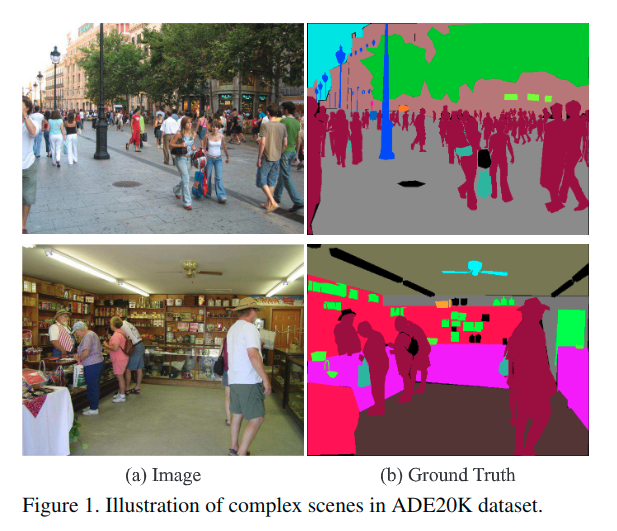

为这些数据集开发有效的算法需要克服一些困难。

最好的的场景分析框架是FCN. 基于DCNN的方法增强了动态目标理解并且仍然面对着挑战: 考虑不同的场景和不受限制的词汇. 图2的第一行就是个例子, 这里小船被误分类为小车. 这些错误是因为物体外观的相似性. 但是，在将场景描述为河流附近的船坞之前查看关于上下文的图像时，应该产生正确的预测。

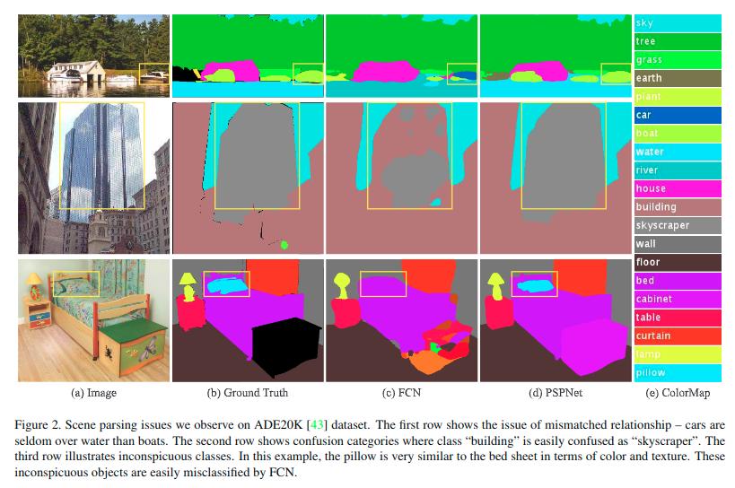

**为了准确的场景感知，知识图表依赖于场景上下文的先验信息**。作者发现当前基于FCN的模型的主要问题是缺乏利用全局场景类别线索的合适策略。对于典型的复杂场景理解，以前为了获得全局图像级特征，空间金字塔池被广泛应用, 其中空间统计提供了一个整体场景解读的好描述。空间金字塔网络一步增强了这种能力。

与这些方法不同，为了结合合适的全局特征，文章提出了金字塔场景解析网络（PSPNet）。除了用于像素预测的**传统扩展FCN**之外，还**将像素级特征扩展到特别设计的全局金字塔池化**中。局部和全局线索使得最终预测更加可靠。文章也提出了一个使用深度监督损失的优化策略.

> https://github.com/hszhao/PSPNet

文章的方法在所有可用数据集上实现了最先进的性能。它是ImageNet场景分析挑战2016的冠军，并且获得了PASCAL VOC 2012语义分割基准的第一名，以及城市场景城市景观数据的第一名。表明PSPNet为像素级预测任务提供了一个有前景的方向，这甚至可能有利于基于CNN的立体匹配，光流，深度估计(t CNN-based stereo matching, optical flow, depth estimation)等等。

主要贡献有以下三个方面:

* 提出了一个金字塔场景解析网络，以便在基于FCN的像素预测框架中嵌入困难的场景上下文特征
* 基于深度监督的损失为ResNet开发了一个有效的优化策略
* 建立了一个实用系统, 有着最先进的场景分析和语义分割水平，其中包括所有关键的实现细节

## 相关工作

在下文中，回顾了场景分析和语义分割任务的最新进展。在强大的深度神经网络[17,33,34,13]的驱动下，场景解析和语义分割之类的像素级预测任务通过用卷积层替换分类中的连接层来实现巨大的进步[26]。为了扩大神经网络的感受野，[3,40]的方法使用扩张卷积。Noh等人[30]提出了一种带有反卷积网络的粗到细结构来学习分割掩膜。基线网络是FCN和扩张网络[26,3].

其他工作主要是两个方向。

* 一个方向是[26,3,5,39,11]具有多尺度特征集成。在深度网络中，高层特征包含更多的语义和更少的位置信息。组合多尺度特征可以改善性能。
* 另一个方向是基于结构预测。早期工作[3]使用条件随机场（CRF）作为后处理来细化分割结果。后续的方法[25,41,1]通过端到端模型改进网络。

这两个方向都改善了场景解析的定位能力，其中预测的语义边界适应目标。然而，在复杂的场景中利用必要的信息仍有很大的改进空间。

为了充分利用全局图像级先验来进行不同的场景理解，[18,27]的方法用传统特征而不是深度神经网络来提取全局上下文信息。相似的改进在目标检测框架之下完成. [24]证明了FCN的全局平均池化可以改善语义分割结果。但是，文章的实验表明，这些全局描述符并不能代表具有挑战性的ADE20K数据。因此，与[24]中的全局汇集不同，文章通过金字塔场景解析网络利用基于区域的不同上下文聚合来利用全局上下文信息。

## Pyramid Scene Parsing Network

作者从对FCN方法应用于场景分析时对代表性失败案例的观察和分析开始。他们激励了文章金字塔池化模块作为有效的全局背景的提出。图3中所示的PSPNet被描述, 来提高复杂场景解析中的开放词汇目标和物件识别的性能。

### 重要观察

新的ADE20K数据集[43]包含150个物品/对象类别标签（例如墙，天空和树）和1,038个图像级场景描述符（例如航站楼，卧室和街道）。因此，存在大量标签和大量场景分布。通过检查[43]中提供的FCN基线的预测结果，作者总结了复杂场景解析的几个常见问题。

#### 匹配关系

上下文关系是非常重要的，尤其对于复杂的场景理解而言非常重要。存在共同的视觉模式。例如，飞机很可能在跑道上或在天空中飞行而不是在公路上飞行。对于图2中的第一行示例，FCN基于外观预测黄色框中的船作为“汽车”。但常识是汽车很少在河上。**缺乏收集情境信息的能力增加了错误分类的可能性**.

#### 混淆类别

ADE20K数据集[43]中有许多类标签对在分类中令人困惑。例如'field'&'earth', 'mountain'&'hill', 'wall'&'house', 'building'&'skyscraper'。它们具有相似的外观。如[43]中所述，标记了整个数据集的专家注释器仍然产生17.60％的像素误差。

在图2的第二行中，FCN预测框中的目标是'skyscraper'和'building'的一部分。应该排除这些结果，以便整个对象是'skyscraper'或者'building'，而不是都是。利用类别之间的关系可以解决这个问题。

#### 不显眼的类别

场景包含任意大小的目标/东西。几个小尺寸的东西，如路灯和标牌，很难找到，虽然它们可能非常重要。相反, **大目标或者东西可能会超过FCN的感受野, 因此造成不连续的预测**. 正如图2第三行显示的, 枕头与床架具有相似的外观。过度关注全局场景类别可能无法解析枕头。为了提高非常小或大的目标的解析性能，应该注意不同的子区域，这些子区域包含不显眼的类别。

#### 观察总结

总结这些观察结果，许多错误或多或少与不同感受野的上下文关系和全局信息相关。因此，具有**合适的全局场景级先验的深度网络**可以改善场景解析的性能。

### Pyramid Pooling Module

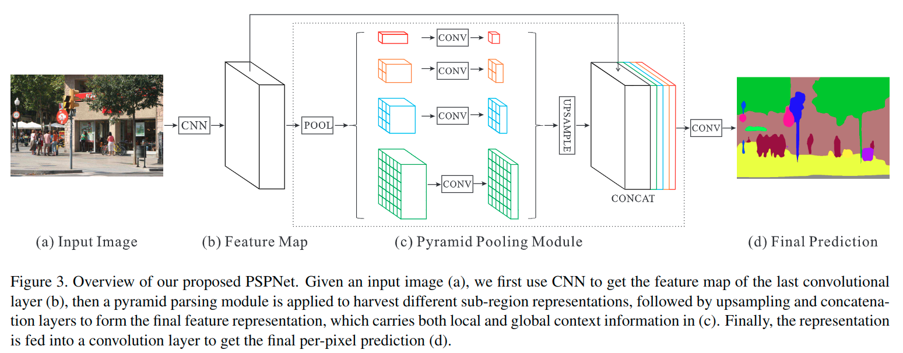

通过以上分析，在下文中引入了金字塔池模块，经验证明这是一个有效的全局上下文先验(global contextual prior).

在深度神经网络中，感受野的大小可以直观地表明使用上下文信息的程度。尽管理论上ResNet [13]的感受野已经比输入图像大，[42]显示**CNN的经验感受野(empirical receptive field)比理论领域小得多，尤其是对高等级的层。这造成许多网络并不能合适的合并之前的全局场景先验.** 文章通过提出一个有效的全局先验表示来解决这个问题.

全局平均池化是一个很好的基线模型，作为全局上下文先验，它通常用于图像分类任务[34,13]。在[24]中，它成功地应用于语义分割。但是对于ADE20K中的复杂场景图像[43]，这种策略还不足以提供必要的信息。这些场景图像中的像素被注释为许多东西和物体。**直接融合它们以形成单个向量可能会失去空间关系并导致模糊**。在这方面，沿着子区域上下文的全局上下文信息有助于区分不同类别。更强大的表示可以是来自不同子区域的信息与这些感受域的融合。类似的结论被呈现在场景/图像分类的经典工作[18,12]中。

在[12]中，由金字塔池化生成的不同层次的特征图最终被展平, 并连接馈送到全连接层以进行分类。此全局先验被设计设计来移除CNN固定大小的约束, 以进行图像分类。为了进一步减少不同子区域之间的上下文信息损失，文章提出了一种分层全局先验，包含具有不同尺度和不同子区域之间变化的信息。称之为"pyramid pooling module", 在深度神经网络的最终层特征图上的全局场景先验构造，如图3c所示.

金字塔池模块融合了四个不同金字塔尺度下的特征。红色高亮显示的是最粗糙的级别, 是生成单个bin输出的全局池化。后面的金字塔等级将特征图分成不同的子区域，并形成不同位置的池化表示。金字塔池化模块中不同级别的输出包含具有不同大小的特征映射。为了保持全局特征的权重，在每个金字塔等级之后使用1x1卷积层来降低上下文表示的维度(如果金字塔的等级为N，则将上下文表示的维数减少到1/N). **然后通过双线性插值直接对低维特征映射进行上采样，以获得与原始特征图相同的大小特征**。最后，不同级别的特征被连接为最终的金字塔池化全局特征。

注意金字塔等级和大小, 每个级别都可以修改。它们与馈入金字塔池化层的特征图大小有关。结构通过在几个步骤中采用变化尺寸的池化核来抽象不同的子区域。因此，多阶段核应该在表示上保持合理的差距。金字塔池化模块是一个四层的模块，其分别为1x1, 2x2, 3x3和6x6。对于使用最大迟化还是平均池化, 文章做了额外的实验来显示差异.

### Network Architecture

利用金字塔池化模块，提出了图3所示的金字塔场景解析网络（PSPNet）。

* 在图3a中给出了一个输入图像，使用预训练ResNet模型, 配合扩张卷积的策略来提取特征图。
* 输入图像的最终特征图尺寸(前期卷积网络的输出)为原始的1/8，如图3b所示。
* 在顶部, 使用3c中所示的金字塔池化模块来收集上下文信息。使用4级金字塔，池化核覆盖整个图像，一半和一小部分。它们融合为全局先验[>1]。然后将先验与最初的特征映射(前面卷积的输出特征图)在3c的最后部分连接起来。
* 接下来是卷积层以生成3d中的最终预测图[>2].

> 1: 这里是怎么融合的?如何进行的上采样?
>
> 2: 这里对于最后的卷积而言,实际上是输出的特征图大小和对应的最前面的基础卷积网络的输出特征图的小是一致的,但是这里再次变回到原始图像大小的过程是需要通过双线性插值放缩的.

为了解释结构，PSPNet为像素级场景解析提供了有效的全局上下文先验。金字塔池化模块可以收集信息级别，比全局池化更具代表性[24]。就计算成本而言，与原始扩张FCN网络相比，PSPNet并没有太大的增加。在端到端学习中，可以同时优化全局金字塔池模块和局部FCN功能。

## Deep Supervision for ResNet-Based FCN

深度预训练网络带来良好的性能[17,33,13]。然而，增加网络的深度可能引入额外的优化难度，如[32,19]所示，用于图像分类。ResNet通过每个块中的跳跃连接解决了这个问题。深度ResNet的后期层主要基于先前层来学习残差。

作者反而建议通过超视觉产生初始结果, 并产生额外损失，并在最后损失后学习残差。因此，深度网络的优化被分解为两个，每个都更容易解决。

深度监督的ResNet101模型的一个例子如图4所示。

除了主分支使用softmax损失训练最终分类器，另一个分类器在第四阶段之后应用[>3]，即`res4b22`残差块。与中继反向传播[Relay backpropagation foreffective learning of deep convolutional neural networks]不同，它阻止了辅助损失向后传播到几个浅层，让两个损失函数通过所有先前的层。**辅助丢失有助于优化学习过程，而主分支损失则需要最大的响应能力**。这里添加权重以平衡辅助损失。

在测试阶段，去掉这个辅助分支只使用优化良好的主分支进行最终预测。对于基于ResNet的FCN, 使用预训练ResNet模型, 这种深度监督的训练策略在不同的实验设置下有着普遍的效果。这体现了这种学习策略的普遍性。

> 3: 这里类似于GoogLeNet的辅助分支,同样也是只在训练时使用.按照UNet++论文作者讲解UNet++结构的思路的时候所提到的,如何充分利用多个层次的特征,里面提到了"深监督"的方法,也就是类似于这里的辅助损失.这种方法有个好处,是可以实现"剪枝"操作,训练的时候保留促进训练,测试的时候去掉,加速推断.不过那是对于UNnet++而言,对于这里的PSPNet而言,倒是似乎这些作用不明显.

## 实验

* 受DeepLab启发, 使用多项式学习率衰减策略: $lr_{current}=lr_{base} \times (1-\frac{iter}{max_{iter}})^{power},\ lr_{base}=0.01,\ power=0.9$.
* The performance can be improvedby increasing the iteration number, which is set to 150K forImageNet experiment, 30K for PASCAL VOC and 90K forCityscapes.
* Momentum and weight decay are set to 0.9 and0.0001 respectively
* For data augmentation, we adopt random mirror and random resize between 0.5 and 2 for all datasets, and additionally add random rotation between -10 and 10 degrees, and random Gaussian blur for ImageNet and PASCAL VOC. This comprehensive data augmentation scheme makes the network resist overfitting(抗过拟合). Our network contains dilated convolution following [DeepLab]
* During the course of experiments, we notice that an ap-propriately large “cropsize” can yield good performanceand “batchsize” in the batch normalization [14] layer isof great importance. Due to limited physical memory onGPU cards, we set the “batchsize” to 16 during training
* For theauxiliary loss, we set the weight to 0.4 in experiments

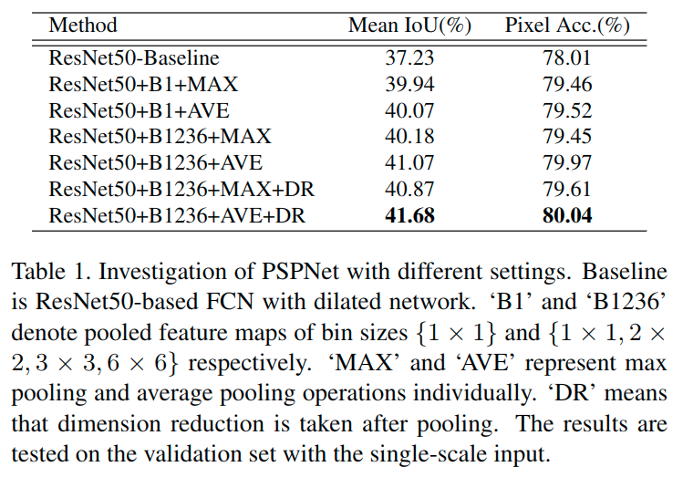

> The baseline uses ResNet50-based FCN with dilated network, with the master branch’ssoftmax loss for optimization.

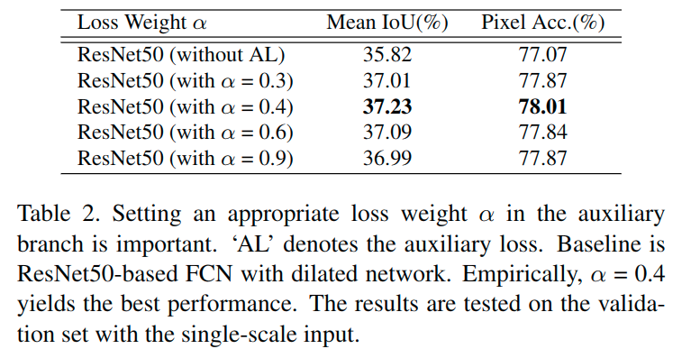

> The introduced aux-iliary loss helps optimize the learning process while not in-fluencing learning in the master branch. We experimentwith setting the auxiliary loss weightbetween 0 and 1 andshow the results in Table 2.

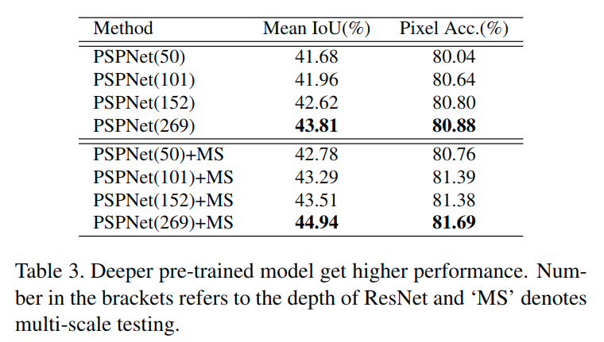

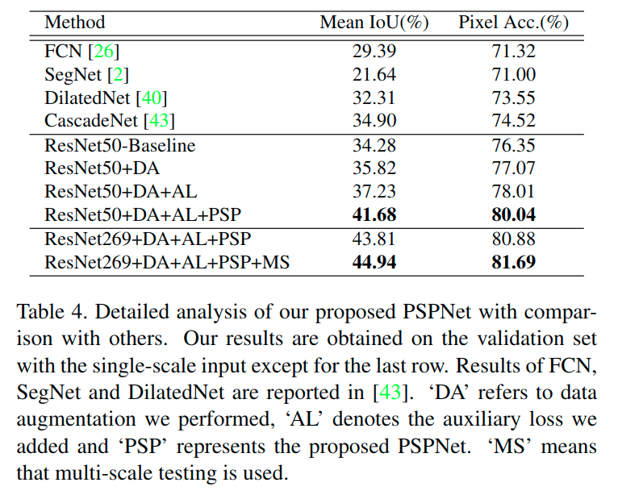

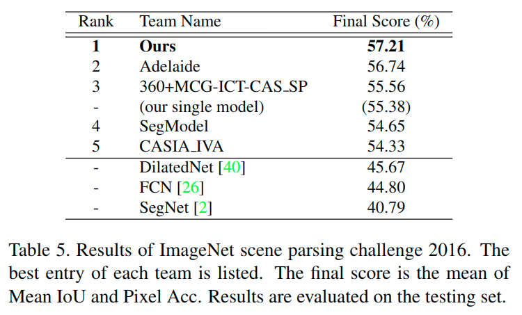

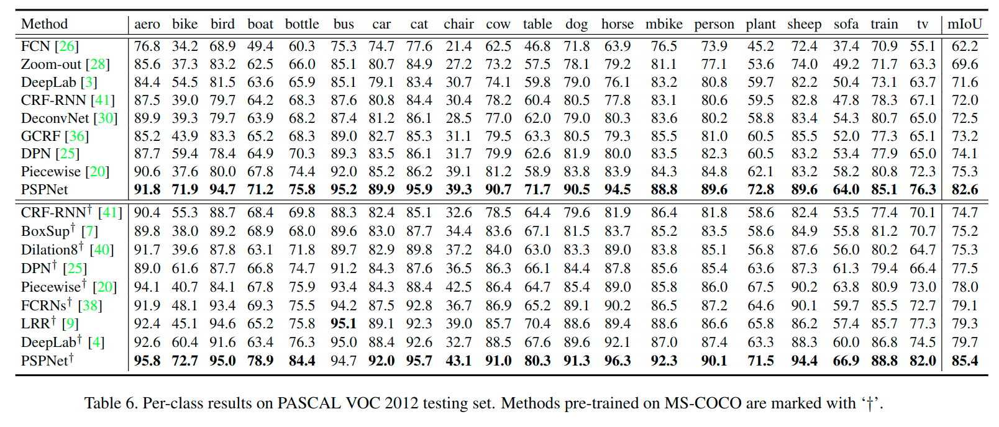

> For faircomparison with current ResNet based frameworks [38, 9,4] in scene parsing/semantic segmentation task, we buildour architecture based on ResNet101 while without post-processing like CRF. We evaluate PSPNet with several-scale input and use the average results following [3, 24].
>
> One may argue that our based classification model ismore powerful than several prior methods since ResNetwas recently proposed. To exhibit our unique contribu-tion, we show that our method also outperforms state-of-the-art frameworks that use the same model, includingFCRNs [38], LRR [9], and DeepLab [4]. In this process,we even do not employ time-consuming but effective post-processing, such as CRF, as that in [4, 9].

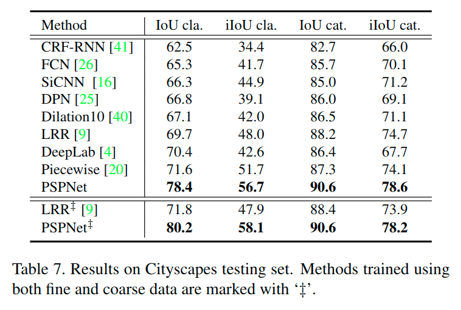

> Statistics in Table 7 show that PSPNet outperforms othermethods with notable advantage.

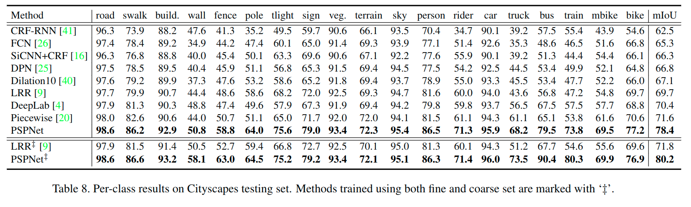

## 总结

提出了一种有效的金字塔场景解析网络，用于复杂的场景理解。全局金字塔池化特征提供额外的上下文信息。还为基于ResNet的FCN网络提供了深度监督的优化策略。希望公开的实现细节可以帮助社区采用这些有用的策略进行场景解析和语义分割以及推进相关技术。
