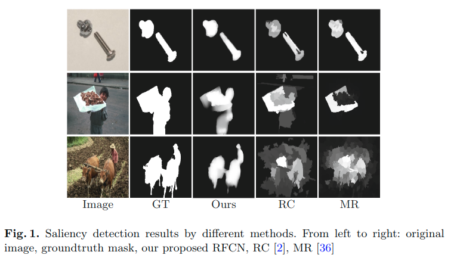
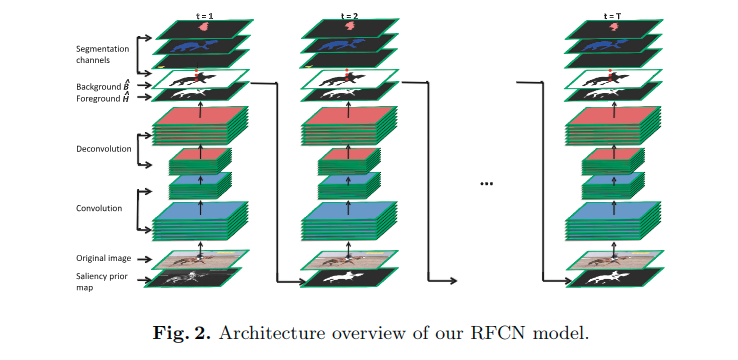
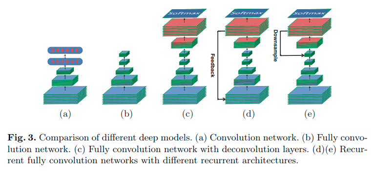
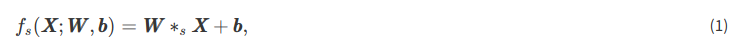
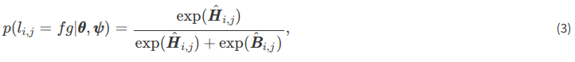
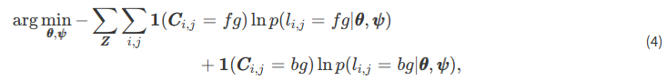
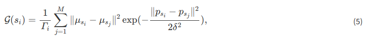
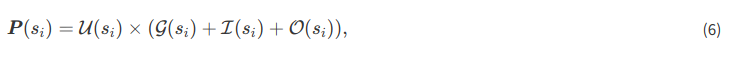

# Saliency Detection with Recurrent Fully Convolutional Networks(2016)

* [Saliency Detection with Recurrent Fully Convolutional Networks(2016)](#saliency-detection-with-recurrent-fully-convolutional-networks2016)
  * [Abstract](#abstract)
  * [Introduction](#introduction)
  * [Related Work](#related-work)
  * [Saliency Prediction by Recurrent Networks](#saliency-prediction-by-recurrent-networks)
    * [Fully Convolutional Networks for Saliency Detection](#fully-convolutional-networks-for-saliency-detection)
    * [Recurrent Network for Saliency Detection](#recurrent-network-for-saliency-detection)
      * [Saliency Prior Maps](#saliency-prior-maps)
      * [Recurrent Architecture](#recurrent-architecture)
      * [Training RFCN for Saliency Detection](#training-rfcn-for-saliency-detection)
      * [Post-processing](#post-processing)
  * [Experiments](#experiments)
    * [Experimental Setup](#experimental-setup)
    * [Performance Comparison with State-of-the-art](#performance-comparison-with-state-of-the-art)
    * [Ablation Studies](#ablation-studies)
  * [Conclusions](#conclusions)
  * [疑惑](#疑惑)

## Abstract

深度网络已经被证明可以编码高级语义特征，并在显着性检测中提供卓越的性能。在本文中，通过使用循环全卷积网络（RFCN）更进一步, 开发新的显着性模型。与现有的基于深度网络的方法相比，所提出的网络能够结合显着性先验知识以进行更准确的推理。此外，*循环体系结构使该方法能够通过更正其先前的错误来自动学习优化显着性图*。为了训练这样的具有多个参数的网络，提出了使用语义分割数据的预训练策略，其同时利用对分割任务的强监督以进行更好的训练，并使网络能够捕获目标的通用表示以用于显着性检测。通过广泛的实验评估，证明了所提出的方法优于最先进的方法，并且所提出的循环深度模型以及预训练方法可以显着提高性能。

## Introduction

显着性检测一般可分为两个子类别：显着对象分割和眼睛固定检测。本文主要关注显着目标分割，旨在突出图像中最引人注目和吸引眼球的对象区域。它已被用作预处理步骤，以促进广泛的视觉应用，并越来越受到社区的关注。尽管取得了很大进展，但开发能够处理现实世界不利情景的有效算法仍然是一项非常具有挑战性的任务。

大多数现有方法通过手工制作的模型和*启发式显着性先验*来解决显着性检测问题。例如:

* *对比度先验* 制定显着性检测作为中心周围的对比度分析，并捕获以全局稀有或从相邻局部突出为特征的显着区域。
* *边界先验* 将边界区域视为背景，并通过将背景信息传播到其余图像区域来检测前景对象。

虽然这些显着性先验已被证明在某些情况下是有效的（图1第一行），但它们不足以发现复杂场景中的显着物体（图1第二行）。此外，基于显着性先验的方法主要依赖于低级的手工制作的特征，这些特征无法捕目标的语义概念。如图1的第三行所示，在某些情况下，高级语义信息在区分前景对象与具有相似外观的背景中起着重要作用。

最近，深度卷积神经网络（CNN）在许多视觉任务中实现了创纪录的性能，例如，图像分类[15,28]，物体检测[5,27]，物体追踪[32,33]，语义分割[21,22]等。现有方法表明深层CNN也可以有益于显著性检测，并且通过准确识别语义上显着性目标来处理复杂的场景非常有效（图1第三行）。虽然已经实现了更好的性能，但是现有的基于CNN的显着性检测方法仍然存在三个主要问题。

* 首先，大多数基于CNN的方法完全抛弃了在以前的工作中有效的**显着性先验**。
* 其次，CNN仅考虑局部图像块的有限尺寸来预测像素的显着性标签。它们大多不能强制执行空间一致性，并且可能不可避免地做出不正确的预测。但是，**使用前馈架构，CNN很难细化输出预测**。
* 最后，显着性检测主要被公式化为二元分类问题，即前景或背景。*与具有数千个类别的图像分类任务相比，二进制标签的监督相对较弱，无法有效地训练具有大量参数的深度CNN*。

为了缓解上述问题，文章研究了用于显着性检测的循环全卷积网络（RFCN）。在每个时间步中，通过RFCN向前馈送输入RGB图像和显着性先验图，以获得预测显著性图，该预测显着性图又用作下一时间步中的显着性先前图。通过结合指示潜在显着区域的显着性先验来初始化第一时间步骤中的先验图。RFCN架构与现有的基于CNN的方法相比具有两个优势：

1. 利用显着性先验来使训练深度模型更容易并且产生更准确的预测
2. 与前馈网络相反，*RFCN网络的输出作为反馈信号被提供*，使得RFCN能够通过纠正其先前的错误来改进显着性预测，直到在最后时间步中产生最终预测。为了训练RFCN进行显着性检测，开发了一种新的预训练策略，该策略*利用语义分割数据的丰富属性信息进行监督*。图2演示了所提出的RFCN模型的架构概述。

总之，这项工作的贡献是:

1. 首先，提出了一种使用循环全卷积网络的显着性检测方法，该方法能够改进先前的预测。
2. 其次，将显着性先验纳入网络以促进培训和推理。
3. 第三，使用语义分割数据设计用于显着性检测的RFCN预训练方法，以*利用来自多目标类别的强监督*并捕获一般目标的内在表示。

提出的显着性检测方法能产生更准确的显着性图，并且在四个基准数据集上具有相当大的优势，优于最先进的方法。

## Related Work

现有的显着性检测方法可以主要分为两类，即手工制作的模型或基于学习的方法。

* 大多数手工制作的方法可以追溯到特征整合理论[30]，其中**选择重要的视觉特征并将其组合以模拟视觉注意力**。
* 后来，[8]建议通过颜色，强度和方向特征的中心-环绕对比度(center-surround contrast of color, intensity and orientation features)来测量显着性。
* [34]在贝叶斯框架中制定显着性检测，并通过似然概率估计视觉显着性。
* 在[Efficient salient region detection with soft image abstraction]中，通过考虑用于显着性测量的图像像素的外观相似性和空间分布来开发软(soft)图像抽象。
* 同时，背景先验也被许多手工制作的模型[6,10,36,38]使用，其中基本假设是图像边界区域更可能是背景。可以通过使用边界区域作为背景种子的标签传播来识别显著性区域。

**手工制作的显着性方法既高效又有效，但在处理复杂场景时却不够稳健**。最近，基于学习的方法受到了社区的更多关注。这些方法可以通过在具有注释的图像数据上训练检测器（例如，随机森林[12,19]，深度网络[17,13,37]等）来自动学习检测显着性。其中，基于深度网络的显着性模型表现出非常有竞争力的表现。例如:

* [31]建议分别通过训练DNN-L和DNN-G网络进行局部估计和全局搜索来检测显着性区域。
* 在[16]中，训练全连接的网络，通过采用周围区域的多尺度CNN特征来回归每个超像素的显着度。

两种方法都进行逐个patch扫描以获得输入图像的显着性图，计算十分昂贵。此外，他们**直接在显着性检测数据集上训练深层模型，忽略了二元标签存在的弱监督的问题**。为了解决上述问题，[17 Deepsaliency: multi-task deep neural network model for salient object detection]建议使用在多任务学习框架下训练的全卷积网络（FCN）来检测显着性。虽然具有相似的想法，但本文的方法在三个方面与[17]有显着的不同:

1. 首先，显着性先验被用于网络训练和推理，在[17]中被忽略。
2. 其次，设计了一种能够改进生成的预测的循环架构，而不是使用[17]中的前馈架构。
3. 第三，文章的深度网络预训练方法允许使用分割数据学习特定于类的特征和通用对象表示。相比之下，[17]仅针对区分不同类别的对象的任务训练网络分割数据，这与显着对象检测的任务本质上不同。

递归神经网络（RNN）已应用于许多视觉任务[20 Recurrent convolutional neural network for object recognition, 25 Recurrent convolutional neural networks for scene labeling]。文中分方法中的循环体系结构主要用作纠正先前错误的细化机制。**与强烈依赖上一步隐藏单元的现有RNN相比，RFCN仅将最后一步的最终输出作为先验**。因此，它需要更少的步骤来收敛并且更容易训练。

## Saliency Prediction by Recurrent Networks

用于图像分类的传统CNN包括卷积层，接着是全连接的层，其采用固定空间大小的图像作为输入，并产生指示输入图像的类别的标签矢量。对于需要空间标签的任务，例如分割，深度预测等，一些方法以逐个patch的扫描方式应用CNN进行密集预测。然而，patch之间的重叠导致冗余计算，因此显着增加了计算开销。与现有方法不同，考虑全卷积网络（FCN）架构[22]用于文中的循环模型，该模型生成具有相同大小的输入图像的预测。在3.1节，正式引入FCN网络进行显着性检测。第3.2节介绍了基于RFCN网络的显着性方法。最后，3.3节将展示如何训练RFCN网络以进行显着性检测。

### Fully Convolutional Networks for Saliency Detection

作为CNN的构建块的卷积层是在平移不变的基础(basis)上定义的，并且具有跨不同空间位置的共享权重。卷积层的输入和输出都是称为特征图的3维张量，其中输出特征图是通过将卷积核应用到输入特征图上:

其中$\mathbf{X}$是输入特征图; $\mathbf{W}$和$\mathbf{b}$分别表示卷积核和偏差;$*_s$表示使用步幅s的卷积运算。结果，输出特征图$f_s(\mathbf{X}; \mathbf{W}, b)$的分辨率使用因子s进行下采样。通常，卷积层与最大池化层和非线性单元（例如，ReLU）交织，以进一步改善平移不变性和表示能力。然后可以将最后一个卷积层的输出特征图馈送到全连接的层的堆栈中，该堆栈丢弃输入的空间坐标并为输入图像生成全局标签（参见图3a）。

对于有效的密集推理，[FCN]将CNN转换为完全卷积网络（FCN）（图3b），将全连接层转换为卷积层，覆盖整个输入区域的和。这允许网络获取任意大小的输入图像并通过一次前向传递产生空间输出。然而，由于卷积和池化层的步幅，最终输出特征图仍然是粗略的，并且从输入图以一个网络总步幅因子进行下采样。为了将粗糙特征图映射到输入图像的像素级预测，FCN通过一堆反卷积层对粗糙图进行上采样（图3c）

其中$\mathbf{I}$是输入图像;$F_s(.;\mathbf{\theta})$表示由FCN的卷积层生成的输出特征图，其总步幅为S，并由$θ$参数化; $U_S(⋅;ψ)$表示由$ψ$参数化的FCN网络的反卷积层，其将输入上采样S因子以确保输出预测与$\mathbf{\hat{Y}}$和输入图像$\mathbf{I}$。与简单的双线性插值不同，反卷层的参数$ψ$是共同学习的。为了探索输入图像的精细局部外观，跳跃架构[FCN]也可用于组合较低卷积层和最终卷积层的输出特征图，以进行更准确的推断。

在显着性检测内容中，作者感兴趣的是测量图像中每个像素的显着性程度。为此，FCN将尺寸为$h×w×3$的RGB图像作为输入，并生成输出特征图$\mathbf{\hat{Y}}=U_S(F_S(\mathbf{I};\mathbf{\theta});\mathbf{ψ})$大小为$h×w×2$。将$\mathbf{\hat{Y}}$的两个输出通道表示为背景图$\mathbf{\hat{B}}$和显着前景图$\mathbf{\hat{H}}$，分别表示所有像素为背景和前景的分数。通过应用softmax函数，将这两个分数转换为**前景概率**:

其中$l_{i,j}∈\{f_g,b_g\}$表示由$(i, j)$索引的像素的前景/背景标签。背景概率$p（l_{i，j} = bg|\mathbf{θ}，\mathbf{ψ}）$可以以类似的方式计算。

给定训练集$\{\mathbf{Z} =（\mathbf{I}，\mathbf{C}）\}^N_1$包含训练图像$\mathbf{I}$及其像素显着注释$\mathbf{C}$，FCN网络可以端到端训练以进行显着性检测通过最小化以下损失:

> 这里也就是说对于整个网路的权重进行优化更新, 直到的得到的参数使整体(求和的两项是在一起的)最小即可

其中$\mathbf {1(\cdot )}$是指标函数。然后可以使用随机梯度下降（SGD）算法迭代地更新网络参数$\mathbf {\theta}$和$\mathbf {\psi}$。

### Recurrent Network for Saliency Detection

训练上述FCN网络以近似从原始像素到显着性值的直接非线性映射，并忽略在现有方法中广泛使用的显着性先验。尽管启发式显着性先验(heuristic saliency priors)有其局限性，但它们易于计算并且在各种情况下显示出非常有效。因此，作者认为**利用显着性先验信息可以促进更快的培训和更准确的推理**。这已通过实验验证。还注意到FCN的输出预测可能非常嘈杂(noisy)并且缺乏标签一致性。但是，**FCN的前馈架构无法考虑反馈信息，这使得无法纠正预测错误**。基于这些观察，对FCN网络进行了两项改进，并通过以下方式设计RFCN：

1. 在训练和推理之前结合显着性
2. 循环改进输出预测（图4）。

> Saliency maps generated by our model. (a) Original images. (b) Ground truth. (c)(d) Saliency maps without and with prior maps, respectively.

#### Saliency Prior Maps

将先验知识编码为显着性先验图，其作为网络的输入。

1. 首先将输入图像切换为M个超像素，$\{s_i\}_1^M$, 对应的颜色对比度先验的计算方法是:

    

    * 这里的$\mu$和$p$表示RGB值的均值和超像素的中心位置
    * $\Gamma_i$是归一化因子
    * $\delta$是缩放参数, 固定为0.5

2. 显著性先验图${\mathbf{P}}$可以按照如下式子获取:

    

    * $\mathbf{P}(s_i)$表示超像素$s_i$的显著性先验值
    * 强度对比度$\mathcal {I}(s_i)$和方向特征对比$\mathcal {O}(s_i)$通过用相应的特征值替换（5）中的颜色值.
    * 中心先验[Automatic salient object segmentation based on context and shape prior]$\mathcal {U}(s_i)$对从超像素$s_i$到图像中心的距离进行惩罚

#### Recurrent Architecture

To incorporate the saliency prior maps into our approach, we consider two recurrent architectures for RFCN network. As in Sect. 3.1, we divide the network into two parts,

1. convolution part  $F(\cdot ,{\mathbf{\theta }})$
2. deconvolution part  $U(\cdot ,{\mathbf{\psi }})$

Our first recurrent architecture (Fig. 3d) *incorporates the saliency prior map  ${\mathbf{P}}$ into the convolution part* by modifying the first convolution layer as

$$\begin{aligned} f({\mathbf{I}}) = {\mathbf{W}}_{{\mathbf{I}}}*{\mathbf{I}} + {\mathbf{W}}_{{\mathbf{P}}}*{\mathbf{P}} + {\mathbf{b}}, \end{aligned}
\qquad (7)$$

where  ${\mathbf{I}}$ and  ${\mathbf{P}}$ denote **input image** and **saliency prior**,respectively;  ${\mathbf{W}}_{{\mathbf{I}}}$ and  ${\mathbf{W}}_{{\mathbf{P}}}$ represent corresponding **convolution kernels**;  ${\mathbf{b}}$ is **bias** parameter.

1. In the first time step, the RFCN network **takes the input image and saliency prior map as input** and produces the **final feature map  ${\hat{\mathbf{Y}}}^1=U\left( F({\mathbf{I}},{\mathbf{P}};{\mathbf{\theta }});{\mathbf{\psi }}\right)$** comprising both **foreground map  ${\hat{\mathbf{H}}}^1$** and **background map  ${\hat{\mathbf{B}}}^1$**.
2. In the following each time step, the **foreground map  ${\hat{\mathbf{H}}}^{t-1}$** generated in the last time step is fed back as **saliency prior map** to the input. The RFCN then refine the saliency prediction by considering both the input image and the last prediction as:

    $$\begin{aligned} {\hat{\mathbf{Y}}}^t=U\left( F({\mathbf{I}},{\hat{\mathbf{H}}}^{t-1};{\mathbf{\theta }});{\mathbf{\psi }}\right) . \end{aligned} \qquad (8)$$

For the above recurrent architecture, forward propagation of the whole network is conducted in every time step, which is *very expensive in terms of both computation and memory*. **An alternative recurrent architecture is to incorporate the saliency prior maps into the deconvolution part (Fig. 3e).**

Specifically:

1. in the first time step, we feed the **input image  ${\mathbf{I}}$** into the convolution part to obtain the **convolution feature map  $F({\mathbf{I}};{\mathbf{\theta }})$**.
2. The deconvolution part then takes the convolution feature map as well as **saliency prior map  ${\mathbf{P}}$** as input to infer the **saliency prediction  ${\hat{\mathbf{Y}}}^1=U\left( F({\mathbf{I}};{\mathbf{\theta }}),{\mathbf{P}};{\mathbf{\psi }}\right)$**.
3. **In the t-th time step**, the **predicted foreground map  ${\hat{\mathbf{H}}}^{t-1}$ in the last time step** serves as **saliency prior map**. The deconvolution part takes the **convolution feature map  $F({\mathbf{I}};{\mathbf{\theta }})$** as well as the **foreground map  ${\hat{\mathbf{H}}}^{t-1}$** to refine the saliency prediction  ${\hat{\mathbf{Y}}}^t$:

    $$\begin{aligned} {\hat{\mathbf{Y}}}^t=U\left( F({\mathbf{I}};{\mathbf{\theta }}),{\hat{\mathbf{H}}}^{t-1};{\mathbf{\psi }}\right) . \end{aligned} \qquad (9)$$

注意，对于每个输入图像，在每个时间步骤中重复进行去卷积部分的前向传播，而卷积部分仅需要在第一时间步骤中前馈一次。由于反卷积部分的参数比卷积部分少大约10倍，因此*这种循环结构可以有效地降低计算复杂度并节省存储*。

However, we find in our preliminary experiments that the second recurrent architecture can only achieve similar performance compared to the FCN based approach (i.e., without recurrent). This may be attributed to **the fact that the prior saliency map is severely downsampled to the same spatial size of the last convolution feature map  $F({\mathbf{I}};{\mathbf{\theta }})$ (downsampled by a factor of 1/32 from the input)**. With less prior information, the downsampled prior saliency map can hardly facilitate network inference. Therefore, we adopt the first recurrent architecture in this work.

> Saliency maps predicted by the proposed RFCN in different time steps. (a) Original images. (b) Ground truth. (c)–(e) Saliency maps predicted by RFCN in the 1st–3rd time step, respectively.

因此，在这项工作中采用了第一种循环架构。在实验中，观察到显着图的精确度在第二个时间步之后几乎收敛（比较图5a和e）。 Therefore, we set the total time step of the RFCN to  T=2.

#### Training RFCN for Saliency Detection

Our RFCN training approach consists of two stages: pre-training and fine-tuning.

**Pre-training** is conducted on the PASCAL VOC 2010 semantic segmentation data set. Saliency detection and semantic segmentation are highly correlated but essentially different in that saliency detection aims at separating generic salient objects from background, whereas semantic segmentation focuses on distinguishing objects of different categories. Our pre-training approach enjoys **strong supervision from segmentation data** and also enables the network to **learn general representation of foreground objects**. Specifically, for each **training pair  ${\mathbf{Z}}=({\mathbf{I}},{\mathbf{S}})$** containing **image  ${\mathbf{I}}$** and **pixelwise semantic annotation  ${\mathbf{S}}$**, we generate an **object map  ${\mathbf{G}}$** to label each pixel as either **foreground ( ${fg}$) or background ( ${bg}$)** as follow

$$\begin{aligned} {\mathbf{G}}_{i,j}= {\left\{ \begin{array}{ll} {bg} &{}\text{ if } {\mathbf{S}}_{i,j}=0 \\ {fg} &{}\text{ otherwise } \end{array}\right. }, \end{aligned} \qquad (10)$$

where  **${\mathbf{S}}_{i,j} \in \{0,1,\ldots ,C\}$ denotes the semantic class label of pixel $(i, j)$**, and  **${\mathbf{S}}_{i,j}=0$ indicates the pixel belonging to background**.

In the pre-training stage, the final feature map  ${\hat{\mathbf{Y}}}^{t}$ (Sect. 3.1) generated by the RFCN consists of  $C+3$ channels, where the **first  $C+1$ channels correspond to the class scores for semantic segmentation** and the **last 2 channels, i.e.,  ${\hat{\mathbf{H}}}^t$ and  ${\hat{\mathbf{B}}}^t$ (Sect. 3.1), denotes the foreground/background scores**.

By applying softmax function, we obtain the conditional probability  $p(c_{i,j}|{\mathbf{I}},{\hat{\mathbf{H}}}^{t-1},{\mathbf{\theta }},{\mathbf{\psi }})$ and  $p(l_{i,j}|{\mathbf{I}},{\hat{\mathbf{H}}}^{t-1},{\mathbf{\theta }},{\mathbf{\psi }})$ predicted by the RFCN for *segmentation and foreground detection*, respectively. The loss function for pre-training across all time steps is defined as

$$\begin{aligned} L({\mathbf{\theta }},{\mathbf{\psi }}) = -\sum _{t=1}^{T} \sum _{{\mathbf{Z}}} \sum _{i,j} \ln p(c_{i,j}={\mathbf{S}}_{i,j}|{\mathbf{I}}&,{\hat{\mathbf{H}}}^{t-1},{\mathbf{\theta }},{\mathbf{\psi }}) \\&+ \ln p(l_{i,j}={\mathbf{G}}_{i,j}|{\mathbf{I}},{\hat{\mathbf{H}}}^{t-1},{\mathbf{\theta }},{\mathbf{\psi }}), \end{aligned} \qquad (11)$$

where $T$ is the total time step and  ${\hat{\mathbf{H}}}^{0}$ is initialized by the **saliency prior map  ${\mathbf{P}}$** (Sect. 3.2).

Pre-training is conducted via back propagation through time.

After pre-training, we modify the RFCN network architecture by **removing the first  C+1 channels of the last feature map and only maintaining the last two channels**, i.e., the predicted foreground and background maps.

Finally, we **fine-tune the RFCN network on the saliency detection data set** as described in Sect. 3.2. As demonstrated in Fig. 6c, the pre-trained model, supervised by semantic labels of multiple object categories, **captures generic object features and can already discriminate foreground objects (of unseen categories in pre-training) from background**.

Fine-tuning on the saliency data set can further improve the performance of the RFCN network (Fig. 6d).

#### Post-processing

The trained RFCN network is able to accurately identify salient objects. To more precisely delineate the compact and boundary-preserving object regions, we adopt an efficient post-processing approach. Given the **final saliency score map  ${\hat{\mathbf{H}}}^{T}$** predicted by the RFCN, we first segment the image into foreground and background regions by thresholding  ${\hat{\mathbf{H}}}^{T}$ with its mean saliency score. A **spatial confidence  ${\mathbf{SC}}_{i,j}$** and a **color confidence  ${\mathbf{CC}}_{i,j}$** are computed for each pixel $(i, j)$.

* The spatial confidence is defined considering the spatial distance of the pixel to the center of the foreground region

    $$\begin{aligned} {\mathbf{SC}}_{i,j} = \exp (-\frac{\Vert loc_{i,j}-loc_s\Vert _2}{\sigma }), \end{aligned} \qquad (12)$$

    where  **$loc_{i,j}$ and  $loc_s$ denote the coordinates(坐标) the pixel $(i, j)$ and the center of foreground**, respectively;  **$\sigma$ is a scale parameter**.

* The color confidence is defined to measure the similarity of the pixel to foreground region in RGB color space

    $$\begin{aligned} {\mathbf{CC}}_{i,j} = \frac{N_{i,j}}{N_s}, \end{aligned} \qquad (13)$$

    where  **$N_{i,j}$ is the number of foreground pixels that have the same color feature with pixel (i, j)** and  **$N_s$ is the total number of foreground pixels**. 相同颜色的前景像素占总的前景像素的比例.

We then weight the predicted saliency scores by spatial and color confidences to dilate the foreground region

$$\begin{aligned} \mathbf{\tilde{{\mathbf{H}}}}_{i,j} = {\mathbf{SC}}_{i,j} \times {\mathbf{CC}}_{i,j} \times {\hat{\mathbf{H}}}^T. \end{aligned} \qquad (14)$$

After an edge-aware erosion procedure [4] on the **dilated(扩张) saliency score map  $\mathbf{\tilde{{\mathbf{H}}}}$**, we obtain the final saliency map.

> Saliency detection results on different stages. (a) Original images. (b) ground truth. (c) results of pre-trained RFCN. (d) results of fine-tuned RFCN. (e) result after post-processing.

As demonstrated in Fig. 6e, the post-processing step can improve the detection precision to a certain degree(可以在一定程度上提高检测精度).

## Experiments

### Experimental Setup

Detailed architecture of the proposed RFCN can be found in the supplementary materials1.

* We pre-train the RFCN on the PASCAL VOC 2010 semantic segmentation data set with 10103 training images belonging to 20 object classes. The pre-training is converged after 200k iterations of SGD.
* We then fine-tune the pre-trained model for saliency detection on the THUS10K [2] data set for 100k iterations.
* In the test stage, we apply the trained RFCN in three different scales and fuse all the results into the final saliency maps [12].
* Our method is implemented in MATLAB with the Caffe [9] wrapper and runs at 4.6 s per image on a PC with a 3.4 GHz CPU and a TITANX GPU.

We evaluate the proposed algorithm (RFCN) on five benchmark data sets: SOD [24], ECSSD [35], PASCAL-S [19], SED1 [1], and SED2 [1].

The evaluation result on SED2 and additional analysis on the impact of recurrent time step are included in the supplementary materials.

Three metrics are utilized to measure the performance, including **precision-recall (PR) curves, F-measure and area under ROC curve (AUC)**.

* The precision and recall are computed by thresholding the saliency map, and **comparing the binary map with the ground truth**.
* The PR curves demonstrate the mean precision and recall of saliency maps at **different thresholds**.
* The F-measure can be calculated by  $F_{\beta } = \frac{(1+\beta ^2)Precision\times Recall}{\beta ^2 \times Precision + Recall}$, where $Precision$ and $Recall$ are obtained using **twice the mean saliency value of saliency maps** as the threshold, and set  $\beta ^2=0.3$.

### Performance Comparison with State-of-the-art

We compare the proposed algorithm (RFCN) with twelve state-of-the-art methods, including MTDS [17], LEGS [31], MDF [16], BL [29], DRFI [12], UFO [13], PCA [23], HS [35], wCtr [38], MR [36], DSR [18] and HDCT [14]. We use either the implementations or the saliency maps provided by the authors for fair comparison.

* Note that MTDS, LEGS and MDF are deep learning based methods.
* Among others, MTDS exploits fully convolution network for saliency detection and leverages segmentation data for multi-task training.

> Performance of the proposed algorithm compared with other state-of-the-art methods on the SOD, ECSSD, PASCAL-S and SED1 databases, respectively.

As demonstrated in Fig. 8 and Table 1, 所提出的RFCN方法可以在几乎所有数据集中始终优于现有方法，在PR曲线，F测度以及AUC分数方面具有相当大的余量。与其他基于深度学习的方法相比，文中的方法的三个贡献（即，**显着性先验，循环架构和预训练方法的集成**）确保了更准确的显着性检测。图7显示我们的显着图可以可靠地突出显示各种挑战场景中的显着对象。

> Comparisons of saliency maps. Top, middle and bottom two rows are images from the SOD, ECSSD, PASCAL-S and SED1 data sets, respectively.(a) Original images, (b) ground truth, (c) our RFCN method, (d) LEGS, (e) MDF, (f) DRFI, (g) wCtr, (h) HDCT, (i) DSR, (j) MR, (k) HS.

### Ablation Studies

To analyze the relative contributions of different components of our methods, we evaluate four variants of the proposed RFCN method with different settings as demonstrated in Table 2. The performance in terms of F-measure and AUC are reported in Table 3.

* $FCN$ 和  $\mathrm{FCN}_{\mathrm{p}}$ 之间的比较表明，*现有基于深度学习的方法忽略的显着性先验确实有利于网络训练和推理*。
* $\mathrm{FCN}_{\mathrm{p}}$与$RFCN-A$之间的比较表明，所提出的循环架构能够*纠正先前的错误并改进输出显着性图*。
* 此外，**采用所提出的预训练策略的$RFCN-B$方法**可以明显优于**简单地预先训练分割的$RFCN-A$**方法，这证明提出的预训练方法可以*有效地利用强大的分割监督并同时使得网络捕获前景对象的通用特征表示*。
* 在提出的后处理步骤之后，RFCN方法在AUC分数方面比RFCN-B实现了相当大的改进，在F测量方面性能略有下降。

## Conclusions

在本文中，提出了一种基于全卷积网络的显着性检测方法。

* 启发式显着性先验被纳入网络以促进培训和推理。
* 循环体系结构使该方法能够根据先前的输出细化显着性映射，并产生更准确的预测。
* 还开发了预训练策略，以利用对分段数据集的强有力的监督，并明确地强制网络学习用于显着性检测的通用特征表示。

广泛的评估验证了上述三个贡献可以显着提高显着性检测的性能。在五个广泛采用的数据集中，所提出的方法已经实现了最先进的性能。.

## 疑惑

这里所谓的`prior`指的是什么?

从后面的内容来看, 就是获得的显著性预测, 但是最初的那个先验又是怎么得来的?
