# Semantic Human Matting

> <http://arxiv.org/abs/1809.01354v1>

## Abstract

Human matting, high quality extraction of humans from natural images, is crucial for a wide variety of applications. Since the matting problem is severely under-constrained, most previous methods require user interactions to take user designated trimaps or scribbles as constraints. This user-in-the-loop nature makes them difficult to be applied to large scale data or time-sensitive scenarios. In this paper, instead of using explicit user input constraints, we employ implicit semantic constraints learned from data and propose an automatic human matting algorithm Semantic Human Matting (SHM).

SHM is the first algorithm that learns to jointly fit both semantic information and high quality details with deep networks. In practice, simultaneously learning both coarse semantics and fine details is challenging. We propose a novel fusion strategy which naturally gives a probabilistic estimation of the alpha matte.

We also construct a very large dataset with **high quality annotations consisting of 35,513 unique foregrounds to facilitate the learning and evaluation of human matting. Extensive experiments on this dataset and plenty of real images show that SHM achieves comparable results with state-of-the-art interactive matting methods.

人体matting，高质量的人体从自然图像中提取，对于各种各样的应用至关重要。由于matting问题严重欠约束，大多数先前的方法需要用户交互以用户指定的trimaps或涂鸦作为约束。这种用户在环路性质使得它们难以应用于大规模数据或时间敏感的场景。在本文中，我们使用 *从数据中学习的隐式语义约束而不是使用显式用户输入约束*，并提出了一种自动人体matting算法"SHM"。SHM是第一个学习将语义信息和高质量细节与深度网络结合起来的算法。在实践中，同时学习粗略语义和精细细节是具有挑战性的。我们提出了一种新的融合策略，它自然地给出了alpha matte的概率估计。我们还构建了一个非常大的数据集，其中包含35,513个独特前景的高质量注释，以便于学习和评估人体matting。对该数据集和大量真实图像进行的大量实验表明，SHM获得了可与最先进的交互式matting方法比较的结果.

## Introduction

Human matting, which aims at extracting humans from natural images with high quality, has a wide variety of applications, such as mixed reality, smart creative composition, live streaming, film production, etc. For example, in an e-commerce website, smart creative composition provides personalized creative image to customers. This requires extracting fashion models from huge amount of original images and re-compositing them with new creative designes. In such a scenario, due to the huge volume of images to be processed and in pursuit of a better customer experience, it is critical to have an automatic high quality extraction method. Fig. 1 gives an example of smart creative composition with automatic human matting in a real-world e-commerce website.

Designing such an automatic method is not a trivial task. One may think of turning to either semantic segmentation or image matting techniques. However, neither of them can be used by itself to reach a satisfactory solution. On the one hand, semantic segmentation, which directly identifies the object category of each pixel, usually focuses on the coarse semantics and is prone to blurring structural details. On the other hand, image matting, widely adopted for fine detail extractions, usually requires user interactions and therefore is not suitable in data-intensive or time-sensitive scenarios such as smart creative composition. More specifically, for an input image $I$ , matting is formulated as a decomposition into foreground $F$, background $B$  and alpha matte $α$ with a linear blend assumption:

人体matting，旨在从高质量的自然图像中提取人类，具有广泛的应用，例如混合现实，智能创意构图，直播，电影制作等。例如，在电子商务网站中，智能创意构图为客户提供个性化的创意形象。这需要从大量原始图像中提取时装模型，并使用新的创意设计重新合成它们。在这种情况下，由于要处理的图像量很大并且为了追求更好的客户体验，因此拥有自动高质量的提取方法至关重要。图1给出了在现实世界的电子商务网站中具有自动人体matting的智能创意组合的示例。

设计这样一种自动方法并非易事。人们可能会想到转向语义分割或图像matting技术。但是，它们都不能单独用于达到令人满意的解决方案。

* 一方面，直接识别每个像素的对象类别的语义分割**通常关注粗略语义并且易于模糊结构细节**。
* 另一方面，广泛用于细节提取的图像matting通常需要用户交互，因此不适用于数据密集型或时间敏感的场景，例如智能创意合成。

更具体地，对于输入图像一世，matting被公式化为前景F， 背景B和alpha matte α的一个线性混合假设:

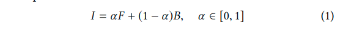

where for color images, there are 7 unknown variables but only 3 known variables, and thus, this decomposition is severely under-constrained (Levin et al., 2008).

Therefore, most matting algorithms (Levin et al., 2008; Chen et al., 2013; Aksoy et al., 2017; Xu et al., 2017) need to take user designated trimaps or scribbles as extra constraints.

对于彩色图像，有7个未知变量，但只有3个已知变量，因此，这种分解严重欠约束（Levin et al。，2008）。

因此，大多数matting算法（Levin等人，2008; Chen等人，2013; Aksoy等人，2017; Xu等人，2017）需要将用户指定的trimaps或涂鸦作为额外约束。

In this paper, we propose a unified method, Semantic Human Matting (SHM), which integrates a semantic segmentation module with a deep learning based matting module to automatically extract the alpha matte of humans. The learned semantic information distinguishing foreground and background is employed as an implicit constraint to a deep matting network which complements the capability of detail extraction. A straightforward way to implement such a method is to train these two modules separately and feed the segmentation results as trimaps into the matting network.

在本文中，我们提出了一种统一的方法，即语义人体消息（SHM），它将语义分割模块与基于深度学习的matting模块相结合，以自动提取人类的alphamatte。区分前景和背景的学习语义信息被用作深度网络的隐式约束，补充了细节提取的能力。实现这种方法的直接方法是分别训练这两个模块，并将分割结果作为trimaps输入到matting网络中。

However, this intuitive approach does not work well (Shen et al., 2016). The reason is that semantic segmentation aims at classifying each pixel and is able to roughly distinct humans from background, whereas the goal of matting is to assign to each pixel a more fine grained float opacity value of foreground without determining the semantics. They are responsible for recovering coarse segmentations and fine details respectively, and therefore they need to be carefully handled in order to cooperate properly towards high quality human matting. Shen et al. (Shen et al., 2016) use a closed form matting (Levin et al., 2008) layer through which the semantic information can directly propagate and constitute the final result. But with deep learning based matting, the matting module is highly nonlinear and trained to focus on structural patterns of details, thus the semantic information from input hardly retains. To combine the coarse semantics and fine matting details exquisitely, we propose a novel fusion strategy which naturally gives a probabilistic estimation of the alpha matte. It can be viewed as an adaptive ensemble of both high and low level results on each pixel. Further, with this strategy, the whole network automatically amounts the final training error to the coarse and the fine, and thus can be trained in an end-to-end fashion.

然而，这种直观的方法效果不佳（Shen et al。，2016）。

*原因在于语义分割旨在对每个像素进行分类，并且能够使人与背景区分出来，而matting的目的是为每个像素分配前景的更细粒度的浮动不透明度值而不确定语义。* 他们分别负责恢复粗分割和细节，因此需要仔细处理，以便合理地配合高质量的人体matting。（Shen et al。，2016）使用闭式matting（Levin et al。，2008）层，语义信息可以通过该层直接传播并构成最终结果。但是使用基于matting的深度学习，matting模块是高度非线性的并且训练成专注于细节的结构模式，因此来自输入的语义信息几乎不保留。

为了巧妙地结合粗糙语义和精细matting细节，我们**提出了一种新的融合策略，它自然地给出了alphamatte的概率估计**。它可以被视为每个像素上的高级和低级结果的自适应集合。

此外，利用该策略，整个网络自动将最终训练误差计算为粗略和精细，因此可以以端到端的方式进行训练。

We also constructed a very large dataset with high quality annotations for the human matting task. Since annotating details is difficult and time-consuming, high quality datasets for human matting are valuable and scarce. The most popular alphamatting.com dataset (Rhemann et al., 2009) has made significant contributions to the matting research. Unfortunately it only consists of 27 training images and 8 testing images. Shen et al. (Shen et al., 2016) created a dataset of 2,000 images, but it only contains portrait images. Besides, the groundtruth images of this dataset are generated with closed form matting (Rhemann et al., 2009) and KNN matting (Chen et al., 2013) and therefore can be potentially biased. Recently, Xu et al. (Xu et al., 2017) built a large high quality matting dataset, with 202 distinct human foregrounds. To increase the volume and diversity of human matting data that benefit the learning and evaluation of human matting, we collected another 35,311 distinct human images with fine matte annotations. All human foregrounds are composited with different backgrounds and the final dataset includes 52,511 images for training and 1,400 images for testing. More details of this dataset will be discussed in Section 3.

我们还构建了一个非常大的数据集，其中包含用于人体matting任务的高质量注释。由于注释细节是困难且耗时的，因此用于人体matting的高质量数据集是有价值且稀缺的。最受欢迎的alphamatting.com数据集（Rhemann et al.，2009）为matting研究做出了重要贡献。不幸的是，它只包含27个训练图像和8个测试图像。（Shen et al.，2016）创建了2000个图像的数据集，但它只包含肖像图像。

此外，该数据集的真实标注图像是通过闭式matting（Rhemann等人，2009）和KNNmatting（Chen等人，2013）生成的，因此可能存在偏差。最近，（Xu et al。，2017）构建了一个大型高质量的matting数据集，具有202个不同的人类前景。为了增加有益于人体matting学习和评估的人体matting数据的数量和多样性，我们收集了另外35,311个具有精细matte注释的不同人类图像。所有人类前景都由不同背景合成，最终**数据集包括52,511个用于训练的图像和1,400个用于测试的图像**。该数据集的更多细节将在第3节中讨论。

Extensive experiments are conducted on this dataset to empirically evaluate the effectiveness of our method. Under the commonly used metrics of matting performance, our method can achieve comparable results with the state-of-the-art interactive matting methods (Levin et al., 2008; Chen et al., 2013; Aksoy et al., 2017; Xu et al., 2017). Moreover, we demonstrate that our learned model generalizes to real images with justifying plenty of natural human images crawled from the Internet.

对该数据集进行了大量实验，以实证评估我们方法的有效性。在常用的matting性能指标下，我们的方法可以获得与使用最先进的交互式matting方法可比较的结果（Levin等，2008; Chen等，2013; Aksoy等，2017; Xu等，2017）。

此外，我们证明了我们的学习模型可以推广到真实的图像，并在互联网上爬行的大量自然人类图像熵证明是合理的。

To summarize, the main contributions of our work are three-fold:

1. To the best of our knowledge, SHM is the **first automatic matting algorithm that learns to jointly fit both semantic information and high quality details with deep networks**. Empirical studies show that SHM achieves comparable results with the state-of-the-art interactive matting methods.
2. **A novel fusion strategy**, which naturally gives a probabilistic estimation of the alpha matte, is proposed to make the entire network properly cooperate. It adaptively ensembles coarse semantic and fine detail results on each pixel which is crucial to enable end-to-end training. 提出了一种新的融合策略，它自然地给出了alphamatte的概率估计，以使整个网络适当地合作。它自适应地在每个像素上集成粗略的语义和精细细节结果，这对于实现端到端训练至关重要。
3. **A large scale high quality human matting dataset is created**. It contains 35,513 unique human images with corresponding alpha mattes. The dataset not only enables effective training of the deep network in SHM but also contributes with its volume and diversity to the human matting research.

## Related works

In this section, we will review semantic segmentation and image matting methods that most related to our works.

### semantic segmentation

* Since Long et al. (Long et al., 2015) use Fully Convolutional Network (FCN) to **predict pixel level label densely** and improve the segmentation accuracy by a large margin, FCN has became the main framework for semantic segmentation and kinds of techniques have been proposed by researchers to improve the performance.
* Yu et al. (Yu and Koltun, 2015) propose dilated convolutions to **increase the receptive filed of the network without spatial resolution decrease**, which is demonstrated effective for pixel level prediction.
* Chen et al. (Chen et al., 2016) add fully connected CRFs on the top of network as post processing to **alleviate the ”hole” phenomenon(缓解“漏洞”现象) of FCN**.
* In PSPNet (Zhao et al., 2017), network in pyramid pooling module is proposed to **acquire global contextual prior**.
* (Peng et al., 2017) state that using large convolutional kernels and boundary refinement block can **improve the pixel level classification accuracy while maintaining precise localization capacity**.

With the above improvements, FCN based models trained on large scale segmentation datasets, such as VOC (Everingham et al., [n. d.]) and COCO (Lin et al., 2014), have achieved the top performances in semantic segmentation.

However, these models can not be directly applied to semantic human matting for the following reasons.

1. *The annotations of current segmentation datasets are relative ”coarse” and ”hard” to matting task*. Models trained on these datasets do not satisfy the accuracy requirement of pixel level location and floating level alpha values for matting.
2. Pixel level classification accuracy is the only consideration during network architecture and loss design in semantic segmentation. **This leads the model prone to blurring complex structural details which is crucial for matting performance**. 像素级分类精度是网络体系结构和语义分割中损失设计的唯一考虑因素。 **这导致模型容易模糊复杂的结构细节，这对于matting性能至关重要**。

### image matting methods

In the past decades, researchers have developed variety of general matting methods for natural images.

* Most methods predict the alpha mattes through sampling (Chuang et al., 2001; Wang and Cohen, 2007; Gastal and Oliveira, 2010; He et al., 2011; Shahrian et al., 2013) or propagating (Sun et al., 2004; Grady et al., 2005; Levin et al., 2008; Chen et al., 2013; Aksoy et al., 2017) on color or low-level features.
* With the rise of deep learning in computer vision community, several CNN based methods (Cho et al., 2016; Xu et al., 2017) have been proposed for general image matting.
  * (Cho et al., 2016) design a convolutional neural network to **reconstruct the alpha matte by taking the results of the closed form matting (Levin et al., 2008) and KNN matting (Chen et al., 2013) along with the normalized RGB color image as inputs**.
  * (Xu et al., 2017) **directly predict the alpha matte with a pure encoder decoder network which takes the RGB image and trimap as inputs and achieve the state-of-the-art results**.

However, all the above general image matting methods need scribbles or trimap obtained from user interactions as constraints and so they can not be applied in automatic way.

### automatic matting system

Recently, several works (Shen et al., 2016; Zhu et al., 2017) have been proposed to make an automatic matting system.

* (Shen et al., 2016) use closed form matting (Levin et al., 2008) with CNN to automatically obtain the alpha mattes of portrait images and back propagate the errors to the deep convolutional network.
* (Zhu et al., 2017) follow the similar pipeline while designing a smaller network and a fast filter similar to guided filter (He et al., 2010) for matting to deploy the model on mobile phones.

Despite our method and the above two works both use CNNs to learn semantic information instead of manual trimaps to automate the matting process, our method is quite different from theirs:

1. Both the above methods *use the traditional methods as matting module*, which **compute the alpha matte by solving the matting equation (Eq. 1) and may introduce artifacts when the distributions of foreground and background color overlap (Xu et al., 2017)**. We employ a FCN as matting module so as to directly learn complex details in a wide context which have been shown much more robust by (Xu et al., 2017).
2. By solving the matting equation, these method can directly affect the final perdition with the input constraints and thus propagate back the errors. However, when the deep matting network is adopted, the cooperation of coarse semantics and find details must be explicitly handled. Thus a novel fusion strategy is proposed and enables the end-to-end training of the entire network. 通过求解matting方程，这些方法可以直接影响输入约束的最终预测，从而传播误差。但是，当采用深度网络时，必须明确处理粗略语义和寻找细节的协作。因此，提出了一种新颖的融合策略，并实现了整个网络的端到端训练。

## Human matting dataset

As a newly defined task in this paper, the first challenge is that semantic human matting encounters the lack of data.

To address it, we create a large scale high quality human matting dataset. The foregrounds in this dataset are humans with some accessories(饰品)(e.g., cellphones, handbags). And each foreground is associated with a carefully annotated alpha matte.

Following Xu et al.(Xu et al., 2017), foregrounds are composited onto new backgrounds to create a human matting dataset with 52,511 images in total.

Some sample images in our dataset are shown in Fig. 2.

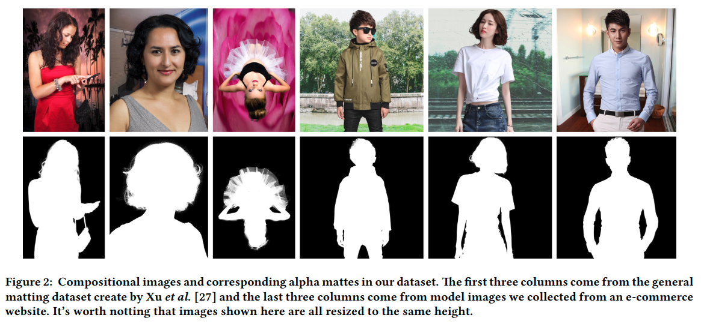

In details, the foregrounds and corresponding alpha matte images in our dataset comprise(我们的数据集中的前景和相应的alphamatte图像包括):

* Fashion Model dataset. More than 188k fashion model images are collected from an e-commerce website, whose alpha mattes are annotated by sellers in accordance with commercial quality. Volunteers are recruited to carefully inspect and double-check the mattes to remove those even only with small flaws. It takes almost 1,200 hours to select 35,311 images out of them. The low pass rate (18.88 %) guarantees the high standard of the alpha matte in our dataset.
* Deep Image Matting (DIM) dataset (Xu et al., 2017). We also select all the images that only contain human from DIM dataset, resulting 202 foregrounds.

*The background images are from COCO dataset and the Internet*. We ensure that *background images do not contain humans*.

The foregrounds are split into train/test set, and the configuration is shown in Table 1.

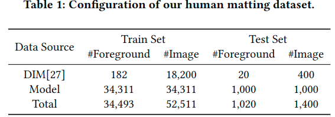

Following (Xu et al., 2017), each foreground is composited with N backgrounds.

* For foregrounds from Fashion Model dataset, due to their large number, N is set to 1 for both training and testing dataset.
* For foregrounds from DIM dataset, N is set to 100 for training dataset and 20 for testing dataset, as in (Xu et al., 2017).

All the background images are randomly selected and unique.

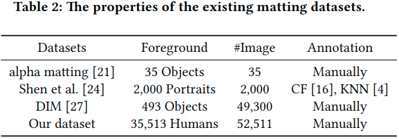

Table 2 shows the comparisons of basic properties between existing matting datasets and ours. Compared with previous matting datasets, our dataset differs in the following aspects:

* The existing matting datasets contain hundreds of foreground objects, while our dataset contains 35,513 different foregrounds which is much larger than others;
* In order to deal with the human matting task, foregrounds containing human body are needed. However, DIM(Xu et al., 2017) dataset only contains 202 human objects. The dataset proposed by (Shen et al., 2016) consists of portraits, which are limited to heads and part of shoulders. In contrast, *our dataset has a larger diversity that might cover the whole human body*, i.e. head, arms, legs etc. in various poses, which is essential for human matting;
* Unlike the *dataset of Shen et al (Shen et al., 2016) which is annotated by Closed Form (Levin et al., 2008), KNN (Chen et al., 2013) and therefore can be potentially biased*, **all 35,513 foreground objects are manually annotated and carefully inspected**, which guarantees the high quality alpha mattes and ensures the semantic integrity and unicity. The dataset not only enables effective training of the deep network in SHM but also contributes with its volume and diversity to the human matting research. **所有35,513个前景对象都经过手动注释和仔细检查**，这保证了高质量的alphamatte并确保语义完整性和单一性。该数据集不仅能够有效地训练SHM中的深层网络，而且还有助于人体matting研究中的丰富性和多样性。

## Our method

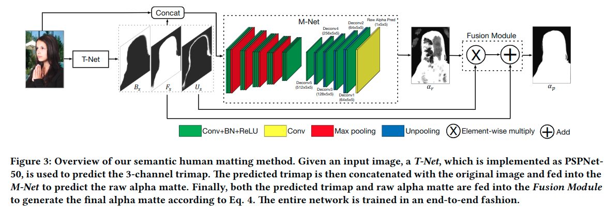

Our SHM is targeted to automatically pull the alpha matte of a specific semantic pattern the humans.

Fig 3 shows its pipeline. **The SHM takes an image (usually 3 channels representing RGB) as input, and directly outputs a 1-channel alpha matte image with identical size of input. Note that no auxiliary information (e.g. trimap and scribbles) is required.**

SHM aims to simultaneously capture both coarse semantic classification information and fine matting details. We design two subnetworks to separately handle these two tasks.

1. The first one, named T-Net, is responsible to do **pixel-wise classification among foreground, background and unknown regions**; (trimap)
2. while the second one, named M-Net, takes in the output of T-Net as semantic hint and describes the details by **generating the raw alpha matte image**.
3. The outputs of T-Net and M-Net are fused by a novel *Fusion Module* to **generate the final alpha matte result**.

The whole networks are trained jointly in an end-to-end manner. We describe these submodules in detail in the following subsections.

### Trimap generation: T-Net

The T-Net plays the role of semantic segmentation in our task and roughly extract foreground region. Specifically, we follow the traditional trimap concept and **define a 3-class segmentation the foreground, background and unknown region**. Therefore, the output of T-Net is a 3-channel map *indicating the possibility that each pixel belongs to each of the 3 classes*.

In general, T-Net can be implemented as any of the state-of-the-art semantic segmentation networks (Long et al., 2015; Yu and Koltun, 2015; Chen et al., 2016; Zhao et al., 2017; Peng et al., 2017). In this paper, **we choose PSPNet-50** (Zhao et al., 2017) for its efficacy and efficiency.

### Matting network: M-Net

Similar to general matting task (Xu et al., 2017), the M-Net aims to **capture detail information and generate alpha matte**. The M-Net *takes the concatenation of 3-channel images and the 3-channel segmentation results* from T-Net as **6-channel input**. Note that it differs from DIM (Xu et al., 2017) which uses 3-channel images plus 1-channel trimap (with 1, 0.5, 0 to indicate foreground, unknown region and background respectively) as 4-channel input.

We use 6-channel input since it conveniently fits the output of T-Net and we empirically *find that with 6-channel or 4-channel input have nearly equal performance*.

As shown in Fig. 3, the M-Net is a deep convolutional encoder-decoder network. The encoder network has 13 convolutional layers and 4 max-pooling layers, while the decoder network has 6 convolutional layers and 4 unpooling layers.

The hyper-parameters of encoder network are the same as the convolutional layers of VGG16 classification network expect for the ”conv1” layer in VGG16 that has 3 input channels whereas 6 in our M-Net.

The structure of M-Net differs from DIM (Xu et al., 2017) in following aspects:

1. M-Net has 6-channel instead of 4-channel inputs;
2. Batch Normalization is added after each convolutional layer to accelerate convergence(加快收敛);
3. ”conv6” and ”deconv6” layers are removed since these layers have large number of parameters and are prone to overfitting.

### Fusion Module

The deep matting network takes the predicted trimap as input and directly computes the alpha matte. However, as shown in Fig. 3, it *focuses on the unknown regions and recovers structual and textural details only*. The semantic information of foreground and background is not retained well. In this section, we describe the fusion strategy in detail.

We use $F, B$ and $U$ to denote the foreground, background and unknown region channel that predicted by T-Net before softmax. Thus the probability map of foreground Fs can be written as

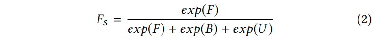

We can obtain Bs and Us in the similarly way. It is obvious that $F_s+B_s+U_s=\mathbf{1}$, where $\mathbf{1}$ denotes an *all-1 matrix* that has the same width and height of input image. We use αr to denote the output of M-Net.

Noting that **the predicted trimap gives the probability distribution of each pixel belonging the three categories, foreground, background and unknown region**.

When a pixel locates **in the unknown region, which means that it is near the contour of a human and constitutes the complex structural details like hair, matting is required to accurately pull the alpha matte**.

At this moment, we would like to use **the result of matting network, $α_r$, as an accurate prediction**. Otherwise, if a pixel locates outside the unknown region, then the conditional probability of the pixel belonging to the foreground is an appropriate estimation of the matte, i.e., Fs/(Fs+Bs).

Considering that **Us is the probability of each pixel belonging to the unknown region**, a probabilistic estimation of alpha matte for all pixels can be written as

αp=(1−Us)FsFs+Bs+Usαrwhere.png)

> 写成这种形式, 来表示融合模块的输出预测, 这里的$\alpha_r$表示的是预测生成的alpha matte, 而$\alpha_p$表示的是, 最终得到的alpha matte, 而对应的 $B_s, F_s, U_s$表示对应的图像上的像素分属背景前景和未知区域三类的概率. 对于最终的输出, 只需要知道**未知区域中对应的预测情况**, 以及**非未知区域里的前景概率**, 即可作为最终的alpha matte的值.

where $α_p$ denotes the output of Fusion Module.

As Fs+Bs=1−Us, we can rewrite Eq. 3 as

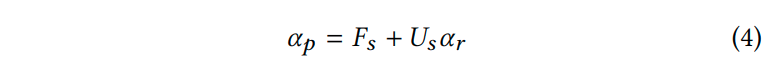

Intuitively, this formulation shows that the coarse semantic segmentation is refined by the matting result with details, and the refinement is controlled explicitly by the unknown region probability.

直观地说，该公式表明粗略语义分割通过细节的matting结果进行细化，并且细化由未知区域概率明确控制。

We can see that when Us is close to 1, Fs is close to 0, so αp is approximated by αr, and when Us is close to 0, αp is approximated by Fs.

我们可以看到，当Us接近1时，Fs接近0，因此αp近似为αr，当Us接近0时，αp近似为Fs。

Thus it naturally combines the coarse semantics and fine details. Furthermore, training errors can be readily propagated through to corresponding components, enabling the end-to-end training of the entire network.

因此，它自然地结合了粗略的语义和精细的细节。此外，训练错误可以很容易地传播到相应的组件，从而实现整个网络的端到端训练。

### Loss

Following (Xu et al., 2017), we adopt the alpha prediction loss and compositional loss.

* The alpha prediction loss is defined as the absolute difference between the groundtruth alpha αg and predicted alpha αp.
* And the compositional loss is defined as the absolute difference between the ground truth compositional image values cg and predicted compositional image values cp.

The overall prediction loss for αp at each pixel is

where γ is set to 0.5 in our experiments.

It is worth noting that unlike *(Xu et al., 2017) which only focus on unknown regions*, in **our automatic settings, the prediction loss is summed over the entire image**.

In addition, we need to note that the loss ||Fs+Us\*αr−αg|| forms another decomposition problem of ground truth matte, which is again under-constrained. To get a stable solution to this problem, we introduce an extra constraint to keep the trimap meaningful. A classification loss Lt for the trimap over each pixel is thus involved.

另外，我们需要注意损失 ||Fs+Us\*αr-αg|| 形成了另一个真实matte的分布问题，它再次受到限制。为了获得这个问题的稳定解决方案，我们**引入了一个额外的约束来保持trimap的有意义**。因此涉及每个像素上的trimap的分类损失Lt。

Finally, we get the total loss

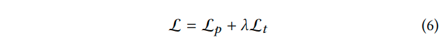

where we just keep λ to a small value to give a decomposition constraint, e.g. 0.01 throughout our paper.

### Implementation Detail

The pre-train technique (Hinton et al., 2006) has been widely adopted in deep learning and shown its effectiveness. We follow this common practice and *first pre-train the two sub-netowrks T-Net and M-Net separately* and *then finetune the entire net in an end-to-end way*.

Further, when pre-training the subnetwork, extra data with large amount specific to sub-tasks can also be empolyed to sufficiently train the models. Note that the dataset used for pre-training should not overlap with the test set.

#### T-Net pre-train

To train T-Net, we follow the common practice to *generate the trimap ground truth* by dilating the groundtruth alpha mattes.

In training phase, **square patches are randomly cropped from input images** and then **uniformly resized to 400×400**. To avoid overfitting, these samples are also augmented by **randomly performing rotation and horizontal flipping**.

As our T-Net makes use of PSPNet50 which is based on ResNet50 (He et al., 2016), we initialize relevant layers with off-the-shelf(现成的) model trained on ImageNet classification task and randomly initialize the rest layers.

The cross entropy loss for classification(i.e., Lt in Eq. 6) is employed.

#### M-Net pre-train

We follow deep matting network training pipeline as (Xu et al., 2017) to pre-train M-Net. Again, the input of M-Net is a 3-channel image with the 3-channel trimap generated by dilating and eroding the groundtruth alpha mattes.

我们遵循深度网络训练流程（Xu et al。，2017）来预训练M-Net。 同样，M-Net的输入是一个3通道图像，通过膨胀和侵蚀groundtruth alphamatte产生3通道trimap。

Worth noting that, we find it is crucial for the performance of matting to augment the trimap with different kernel sizes of dilating and eroding, since it makes the result more robust to the various unknown region widths.

值得注意的是，我们发现使用不同的膨胀和侵蚀核大小来增强trimap的性能至关重要，因为它使得结果对于各种未知区域宽度更加稳健。

For data augmentation, the input images are randomly cropped and resized to 320×320. Entire DIM (Xu et al., 2017) dataset is empployed during pre-training M-Net regardless whether it contains humans, since the M-Net focuses on the local pattern rather than the global semantic meaning. The regression loss same as Lp term in Eq. 6 is adopted.

对于数据增强，输入图像随机裁剪并调整为320×320。 **整个DIM（Xu et al。，2017）数据集在预训练M-Net期间被采用，无论它是否包含人类**，因为M-Net侧重于局部模式而不是全局语义。回归损失与方程式中的Lp项相同。 采用 Eq.6。

#### End-to-end training

End-to-end training is performed on human matting dataset and the model is initialized by pre-trained T-Net and M-Net.

In training stage, the input image is **randomly cropped as 800×800 patches and fed into T-Net to obtain semantic predictions**.

Considering that M-Net needs to be more focused on details and trained with large diversity, augmentations are performed **on the fly to randomly crop different patches (320×320, 480×480, 640×640 as in (Xu et al., 2017)) and resize to 320×320. Horizontal flipping is also randomly adopted with 0.5 chance.**

The total loss in Eq. 6 is used.

#### Testing

For testing the feed forward is conducted on the entire image without augmentation.

More specifically, when the longer edge of the input image is larger than 1500 pixels:

1. we **first scale it to 1500** for the limitation of GPU memory.
2. We then feed it to the network
3. finally **rescale the predicted alpha matte to the size of the original input image** for performance evaluation.

In fact, we can alternatively perform testing on CPU for large images without losing resolution.

## Experiments

### Experimental Setup

We implement our method with PyTorch (Paszke et al., 2017) framework. The T-Net and M-Net are first pre-trained and then fine-tuned end to end as described in Section 4.5.

* During end-to-end training phase, we use **Adam** as the optimizer.
* The learning rate is set to $10^{−5}$
* and the batch size is 10.

#### Dataset

We evaluate our method on the human matting dataset, which contains *52,511 training images and 1,400 testing images* as described in Section 3.

#### Measurement

Four metrics are used to evaluate the quality of predicted alpha matte (Rhemann et al., 2009): **SAD, MSE, Gradient error and Connectivity error**.

* SAD and MSE are obviously correlated to the training objective,
* and the Gradient error and Connectivity error are proposed by (Rhemann et al., 2009) to *reflect perceptual visual quality by a human observer*.

To be specific, we normalize both the predicted alpha matte and groundtruth to 0 to 1 when calculating all these metrics. Further, **all metrics are caculated over entire images instead of only within unknown regions and averaged by the pixel number**.

#### Baselines

In order to evaluate the effectiveness of our proposed methods, we compare our method with the following state-of-the-art matting methods (Implementations provided by their authors are used except for DIM. We implement the DIM network with the same structure as M-Net except with 4 input channels for a fair comparision.): Closed Form (CF) matting (Levin et al., 2008), KNN matting (Chen et al., 2013), DCNN matting (Cho et al., 2016), Information Flow Matting (IFM) (Aksoy et al., 2017) and Deep Image Matting (DIM) (Xu et al., 2017).

Noting that, all these matting methods are interactive and need extra trimaps as input. For a fair comparison, we provide them with predicted trimaps by the well pretrained T-Net.

*We denote these methods as PSP50+X, where X represents the above methods*.

To demonstrate the results of applying semantic segmentation to matting problem, we also design the following baselines:

* PSP50 Seg: a PSPNet-50 is used to **extract humans via the predicted mask**. The groundtruth mask used to train this network is obtained by *binarizing the alpha matte with a threshold of 0*.
* PSP50 Reg: a PSPNet-50 is trained to **predict the alpha matte as regression with L1 loss**

### Performance Comparison

In this section, we compare our method with the state-of-the-art matting methods with generated trimaps and designed baselines on the human matting testing dataset. Trimaps are predicted by the pre-trained T-Net and are provided to interactive matting methods. The quantitative results are listed in Table 3.

在本节中，我们将我们的方法与最先进的matting方法与生成的trimap和人体matting测试数据集的设计基线进行比较。trimap由预训练的T-Net预测，并提供给交互式matting方法。定量结果列于表3中。

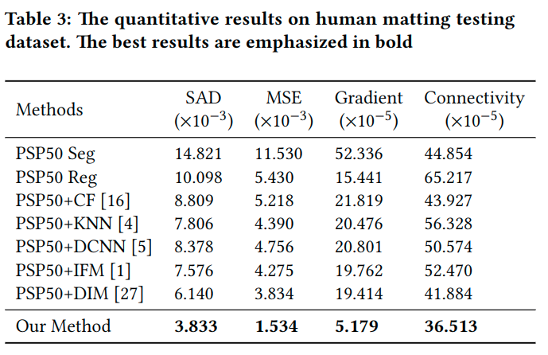

The performances of binary segmentation and regression are poor. Since complex structural details as well as the concepts of human are required in this task, the results show that it is hard to learn them simultaneously with a FCN network. Using the trimaps predicted by the same PSP50 network, DIM outperforms the other methods, such as CF, KNN, DCNN and IFM. It is due to the strong capabilities of deep matting network to model complex context of images. We can see that our method performs much better than all baselines. The key reason is that our method successfully coordinate the coarse semantics and fine details with a probabilistic fusion strategy which enables a better end-to-end training.

二元分割和回归的性能很差。由于此任务需要复杂的结构细节以及人的概念，结果表明很难与FCN网络同时学习它们。使用由相同PSP50网络预测的trimap，DIM优于其他方法，例如CF，KNN，DCNN和IFM。这是由于深度网络的强大功能来模拟复杂的图像内容。我们可以看到我们的方法比所有基线都要好得多。关键原因是我们的方法通过概率融合策略成功地协调粗略语义和精细细节，从而实现更好的端到端训练。

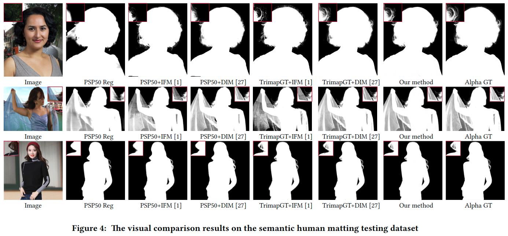

Several visual examples are shown in Fig. 4. Compared to other methods (from column 2 to column 4), our method can not only obtain more ”sharp” details, such as hairs, but also have much little semantic errors which may benefit from the end-to-end training.

图4中显示了几个可视化示例。与其他方法（从第2列到第4列）相比，我们的方法不仅可以获得更多“尖锐”的细节，例如毛发，而且还可以获得很少的语义错误，这可能受益于端到端的训练。

### Automatic Method vs. Interactive Methods

We compare our method with state-of-the-art interactive matting methods **taking the groundtruth trimaps as inputs, which are generated by the same strategy used in T-Net pretraining stage**. 这里的trimaps是使用在预训练阶段相同的策略, 利用T-Net生成的的.

We denote the baselines as Trimap GT+X, where X represents 5 state-of-the-art matting methods including CF (Levin et al., 2008) , KNN (Chen et al., 2013), DCNN (Cho et al., 2016), IFM (Aksoy et al., 2017) and DIM (Xu et al., 2017).

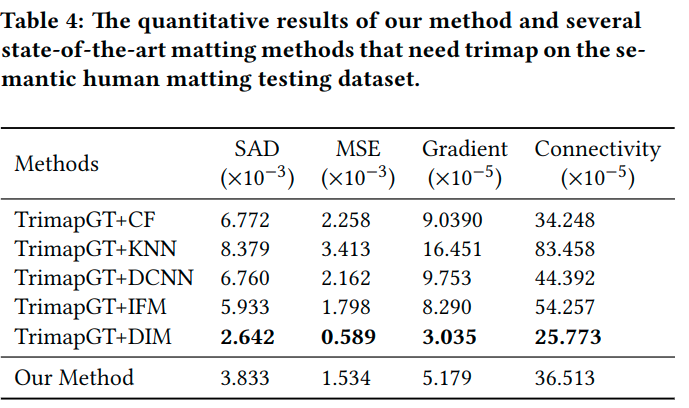

Table 4 shows the comparisons. We can see that the result of our automatic method trained by end-to-end strategy is higher than most interactive matting methods, and is slightly inferior to TrimapGT+DIM.

Note that *our automatic method only takes in the original RGB images, while interactive TrimapGT+X baselines take additional groundtruth trimaps as inputs*.

Our T-Net could infer the human bodies and estimate coarse predictions which are then complemented with matting details by M-Net.

Despite slightly higher test loss, our automatic method is visually comparable with DIM, the state-of-the-art interactive matting methods, as shown in Fig. 4 (column ”TrimapGT+DIM” vs. ”Our method”).

### Evaluation and Analysis of Different Components

#### The Effect of End-to-end Training

In order to evaluate the effectiveness of the end-to-end strategy, we compare our end-to-end trained model with that using only pre-trained parameters (no end-to-end).

The results are listed in Table 5.

We can see that network trained in end-to-end manner performs better than no end-to-end, which shows the effectiveness of the end-to-end training.

#### The Evaluation of Fusion Module

To validate the importance of the proposed Fusion Module, we design a simple baseline that directly outputs the result of M-Net, i.e. αp=αr.

It is trained with the same objective(以同样的目标) as Eq. 6.

We compare the performance between our method with Fusion Module and this baseline without Fusion Module in Table 5.

We can see that our method with Fusion Module achieves better performance than the baseline. Especially note that although other metrics remain relatively small, the Connectivity error of baseline gets quite large.

It can be due to **a blurring of the structural details when predicting the whole alpha matte only with M-Net**.

Thus the designed fusion module, which leverages both the coarse estimations from T-Net and the fine predictions from M-Net, is crucial for better performance.

#### The Effect of Constraint Lt

In our implementation, we introduce a constraint for the trimap, i.e. Lt.

We train a network removing it to investigate the effect of such a constraint. We denote the network trained in this way as no Lt. The performance of this network is shown in Table 5.

We can see that the network without Lt performs better than that without end-to-end training, but is worse than the proposed method. **This constraint makes the trimap more meaningful** and the decomposition(分解) in Lp more stable.

#### Visualization of Intermediate Results

To better understand the mechanism of SHM, we visualize the intermediate results on a real image shown in Fig 5.

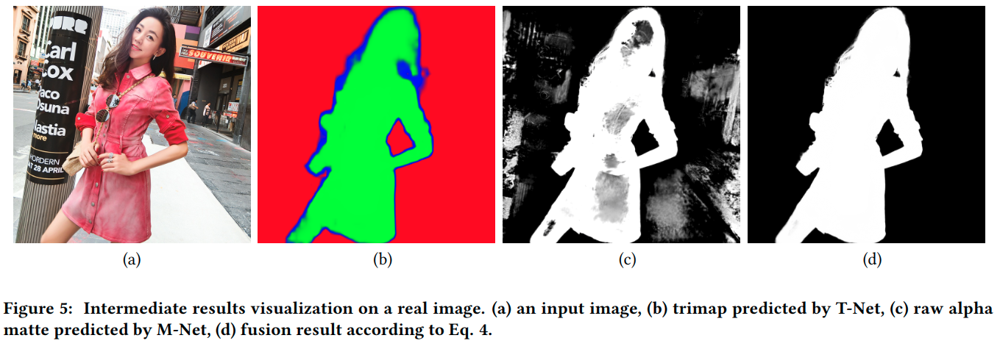

The first column (a) shows the original input image, the second column (b) shows the predicted foreground (green), background (red) and unknown region (blue) from T-Net, the third column (c) shows the predicted alpha matte from M-Net, and the last column (d) shows the fusion result of the second column (b) and the third column (c) according to Eq. 4.

We can see that the T-Net could segment the rough estimation of human main body, and automatically distinguish *the definite(明确的) human edges where predicted unknown region is narrower* and *structural details where predicted unknown region is wider*.

In addition, with the help of the coarse prediction provided by T-Net, M-Net could concentrate on the transitional regions between foreground and background and predict more structural details of alpha matte.

Further, we combine the advantages of T-Net and M-Net and obtain a high quality alpha matte with the aid of Fusion Module.

### Applying to real images

Since the images in our dataset are composited with annotated foregrounds and random backgrounds, to investigate(调查) the ability of our model to generalize to real-world images, we apply our model and other methods to plenty of real images for a qualitative analysis.

Several visual results are shown in Fig. 6. We find that our method performs well on real images even with complicated backgrounds. Note that the hair details of the woman in the first image of Fig. 6 are only recovered nicely by our method.

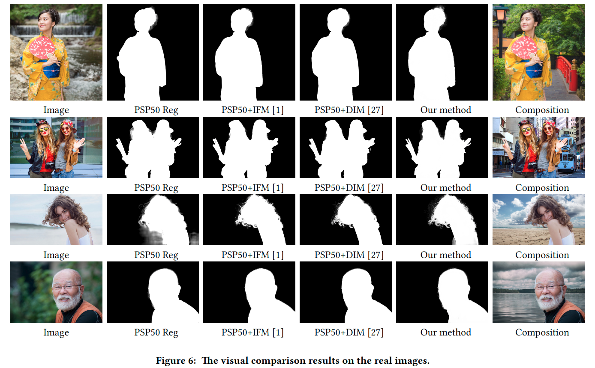

Also, the fingers in the second image are blurred incorrectly by other methods, whereas our method distinguishes them well. Compsition examples of the foregrounds and new backgrounds with the help of automatically predicted alpha matte are illustrated in the last column of Fig. 6.

We can see these compositions have high visual quality. More results can be found in supplementary materials.

## Conclusion

In this paper, we focus on the human matting problem which shows a great importance for a wide variety of applications. In order to simultaneously capture global semantic information and local details, we propose to cascade a trimap network and a matting network, as well as a novel fusion module to generate alpha matte automatically. Furthermore, we create a large high quality human matting dataset. Benefitting from the model structure and dataset, our automatic human matting achieves comparable results with state-of-the-art interactive matting methods.

在本文中，我们关注人类matting问题，这对于各种各样的应用来说都非常重要。

为了同时捕获全局语义信息和局部细节，我们建议级联一个trimap网络和一个matting网络，以及一个新的融合模块来自动生成alpha matte。

此外，我们创建了一个大型高质量的人体matting数据集。

受益于模型结构和数据集，我们的自动人体matting技术通过最先进的交互式matting方法实现了可比较的结果。
