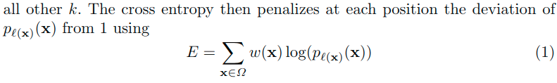
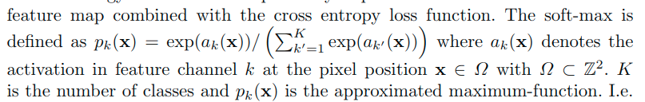
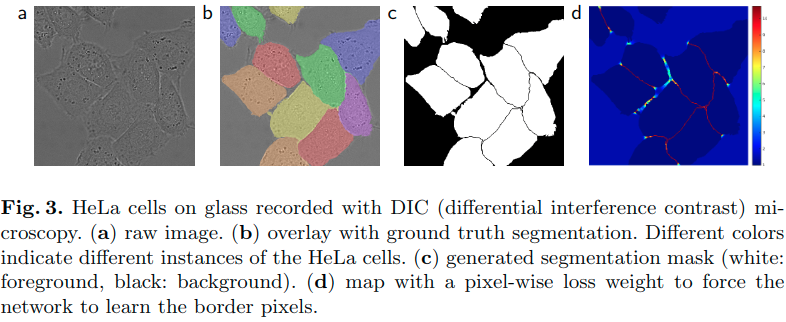
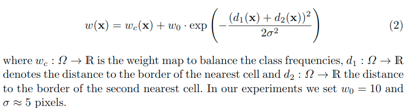

# U-Net: Convolutional Networks for Biomedical Image Segmentation(2015)

## 关键点

* 编码解码结构
* 对编码特征图进行复制剪裁复用到解码器部分与通道数减半的上采样所得进行串联, 再卷积融合
    * 这也是一定程度的多尺度特征的使用
* 适合超大图像分割, 适合医学图像分割
* 2x2卷积实现的上采样
* 全卷积网络


> 和FCN相比:
>
> U-Net的第一个特点是完全对称, 也就是左边和右边是很类似的, 而FCN的decoder相对简单, 只用了一个deconvolution的操作, 之后并没有跟上卷积结构.
>
> 第二个区别就是skip connection, FCN用的是加操作（summation）, U-Net用的是叠操作（concatenation）.

## 网络结构流程

1. 使用全卷积神经网络：全卷积神经网络就是卷积取代了全连接层, 全连接层必须固定图像大小而卷积不用, 所以这个策略使得, 你可以输入任意尺寸的图片, 而且输出也是图片, 所以这是一个端到端的网络.

2. 左边的网络contracting path： 使用卷积(非填充卷积)和maxpooling.

3. 右边的网络expansive path: 扩展路径中的每一步都包括对特征映射的上采样, 然后是2x2卷积("up-convolution"), 其将特征通道的数量减半, 与来自收缩路径的**相应裁剪的特征映射串联**, 以及两个3x3卷积, 每个接下来是ReLU. **由于边界像素不能卷积, 裁剪是必要的**.

    > 这里的上采样卷积应该就是外围补零的这种:
    >
    > 

    > 为了允许输出分割图的无缝平铺(参见图2), 选择输入图块大小是很重要的, 这样所有2x2最大池操作都应用于具有偶数x和y尺寸的图层.
    >
    > 

    > pooling层会丢失图像信息和降低图像分辨率且是不可逆的操作, 对图像分割任务有一些影响, 对图像分类任务的影响不大.
    >
    > 为什么要做上采样？
    >
    > 因为上采样可以补足一些特征的信息, 但是信息补充的肯定不完全, 所以还需要与左边的分辨率比较高的特征图串联起来起来(**直接复制过来再裁剪到与上采样图片一样大小**).
    >
    > 这就相当于在高分辨率和更抽象特征当中做一个折衷, 因为随着卷积次数增多, 提取的特征也更加有效, 更加抽象, 上采样的图片是经历多次卷积后的图片, 肯定是比较高效和抽象的图片, 然后**把它与左边不怎么抽象但更高分辨率的特征图片进行连接**.

4. 最后再经过两次卷积(非填充卷积), 达到最后的heatmap, 再用一个1X1的卷积做分类, 这里是分成两类, 所以用的是两个神经元做卷积, 得到最后的两张heatmap, 例如第一张表示的是第一类的得分(即每个像素点对应第一类都有一个得分), 第二张表示第二类的得分heatmap, 然后作为softmax函数的输入, 算出概率比较大的softmax类, 选择它作为输入给交叉熵进行反向传播训练

---

卷积层的数量大约在20个左右, 4次下采样, 4次上采样. 输入图像大于输出图像, 因为在本论文中对输入图像做了镜像操作.

我们架构中的一个重要修改是在上采样部分中我们还有大量的特征通道, 这些通道允许网络将上下文信息传播到更高分辨率的层. 因此, 扩展路径或多或少地与收缩路径对称, 并且产生u形结构.

网络没有任何完全连接的层, **只使用每个卷积的有效部分**, 即分割图仅包含像素, 在输入图像中可以获得完整的上下文. 这种策略允许通过overlap-tile策略(参见图2)无缝分割任意大的图像.


> 医学图像是一般相当大, 但是分割时候不可能将原图太小输入网络, 所以必须切成一张一张的小patch.
>
> 在切成小patch的时候, U-Net由于网络结构原因(因为网络使用的valid方式的卷积, 特征图会不断的减小)适合有overlap的切图.
>
> 
>
> 可以看图, 红框是要分割区域, 但是在切图时要包含周围区域, overlap另一个重要原因是周围**overlap部分可以为分割区域边缘部分提供文理等信息**.
>
> 可以看黄框的边缘, 分割结果并没有受到切成小patch而造成分割情况不好.

为了预测图像边界区域中的像素, **通过镜像输入图像来外推丢失的上下文**. 这种平铺策略对于将网络应用于大图像是重要的, 因为其他分辨率将受到GPU存储器的限制.

至于我们的任务, 很少有可用的训练数据, 我们通过对可用的训练图像应用**弹性变形来使用过度数据增强**. 这允许网络学习这种变形的不变性, 而不需要在注释的图像语料库中看到这些变换. 这在生物医学分割中尤其重要, 因为变形曾经是组织中最常见的变异,  并且真实的变形可以被有效地模拟.

Dosovitskiy等人在无监督特征学习的范围内已经证明了学习不变性的数据增加的价值.

许多细胞分割任务中的另一个挑战是分离同一类的接触对象. 为此, 我们建议使用加权损失, 其中接触单元之间的分离背景标签在损失函数中具有较大的权重. 由此产生的网络适用于各种生物医学分割问题. 展示了EM Stacks中神经元结构分割的结果(ISBI 2012开始的持续竞争), 这里效果优秀. 此外, 在2015年ISBI细胞追踪挑战的光学显微镜图像中显示了细胞分割结果. 在这里, 我们在两个最具挑战性的2D透射光数据集上获得了很大的优势.

## 训练

* 使用SGD训练网络, 对网络输入图像和其对应的分割图

* 使用高动量(0.99), 使得大量先前看到的训练样本确定当前优化步骤中的更新

* 由于未填充的卷积, 输出图像小于输入的恒定边界宽度. 为了最大限度地减少开销并最大限度地利用GPU内存, 我们倾向于**在大批量大小的情况下使用大型输入切片, 从而将批量减少到单个图像**( we favor large input tiles over a large batch size and hencereduce the batch to a single imag)

* 使用像素级的softmax交叉熵作为损失函数

* 使用标准差为$\sqrt{\frac{2}{N}}$的高斯分布来初始化权重.(这里的N表示的是一个神经元对应的输入节点数目, 也就是in_channelxfilter_widthxfilter_height)

* 使用数据增强

    > 当只有少数训练样本可用时, 数据增加对于教授网络所需的不变性和鲁棒性属性至关重要.
    >
    > 对于显微镜图像, 我们主要需要**移位和旋转不变性**, 以及**对变形和灰度值变化的鲁棒性**. 尤其是训练样本的**随机弹性变形**似乎是具有极少注释图像训练一个分割网络的关键概念.
    >
    > 我们使用粗略3乘3网格上的随机位移矢量生成平滑变形. 这些位移是从具有10像素标准差的高斯分布中采样的. 然后使用双三次插值计算每像素位移.
    >
    > 收缩路径末端的dropout层执行进一步的隐式数据扩充.

---



使其趋于0, 也就是p趋于1, $p_{l(x)}$表示针对类别$l(x)$(这里的$l$表示每个像素对应的真实类别标签), 其所对应的最大似然函数, 而这里的$w$表示的是一个权重匹配, 可以针对不同的像素给予不同的权重分配.



预先计算每个真实分割的权重图, 以补偿训练数据集中某个类的不同像素频率, 并迫使网络学习在接触细胞之间引入的小分离边界(见图)3c和d).



使用形态学运算来计算分离边界. 然后将权重图计算为



这个形似高斯分布的概率密度函数


这里相当于有了一个类似的函数, 对于式子2, 在一个钟型曲线的基础上, 进行了一定的放缩$(\times w_0, 指数 \frac{1}{2 \sigma^2})$, 又进行了一定的平移$w_c(x)$.

## 一些疑惑

* 公式2这里提到的$d_1,d_2$如何得到? 与细胞的距离如何计算?

* 为了预测图像边界区域中的像素, **通过镜像输入图像来外推丢失的上下文**. 这种平铺策略对于将网络应用于大图像是重要的, 因为其他分辨率将受到GPU存储器的限制.

    > 这里不太理解?

## 一些想法

### 运算

这里使用的是valid卷积, 理由是:

> 这样的话可以保证分割的结果都是基于没有缺失的上下文特征得到的
>
> 而且这里的结构也使得可以适用于大图像的实际上是有互有重叠的patch部分, 这样可以考虑更多的上下文信息, 所以一定的剪裁也是可以的.

若是使用了same卷积, 是有可能保证分割的结果基于有缺失的上下文特征得到, 但是这样的结果会如何呢? 不见得坏吧...

~~而且这样的结果可以保证扩展阶段可以直接使用复制过来的收缩阶段的特征图, 而不用进行裁剪,~~ 后期的裁剪这个操作也会损失一定的信息吧? 是否有办法既可以像这样的使用patch作为输入的时候, 考虑上下文信息, 又可以不通过这样的剪裁的方式融合呢?

### 组合

* 这里的是直接复制过来并进行的剪裁, 可否通过放缩进行合并呢?
* 这里的是上采样所得通道数直接减半, 那么是否可以通过卷积压缩一半的通道呢?

### 连接

这里是通过串联的形式连接, 与DenseNet的形式是一致的, 那是否可以如同ResNet的那样, 按通道加和呢? FCN就是加和的形式

### 拼接

对于输入进行padding为切割块的整数倍, 切割patch送入网络, 进行预测. 输出拼接.

这里需要思考一下怎么预测整张遥感图像。我们知道，我们训练模型时选择的图片输入是256×256，所以我们预测时也要采用256×256的图片尺寸送进模型预测。现在我们要考虑一个问题，我们该怎么将这些预测好的小图重新拼接成一个大图呢？这里给出一个最基础的方案：先给大图做padding 0操作，得到一副padding过的大图，把图像的尺寸补齐为256的倍数img_padding，然后以256为步长切割大图，依次将切出来的小图送进模型预测，预测好的小图则放在img_padding的相应位置上，依次进行，最终得到预测好的整张大图（即img_padding），再做图像切割，**切割成原先图片的尺寸**，完成整个预测流程。

```python
def predict(args):
    # load the trained convolutional neural network
    print("[INFO] loading network...")
    model = load_model(args["model"])
    stride = args['stride']
    for n in range(len(TEST_SET)):
        path = TEST_SET[n]
        #load the image
        image = cv2.imread('./test/' + path)
        # pre-process the image for classification
        #image = image.astype("float") / 255.0
        #image = img_to_array(image)
        h,w,_ = image.shape
        padding_h = (h//stride + 1) * stride
        padding_w = (w//stride + 1) * stride
        padding_img = np.zeros((padding_h,padding_w,3),dtype=np.uint8)
        padding_img[0:h,0:w,:] = image[:,:,:]
        padding_img = padding_img.astype("float") / 255.0
        padding_img = img_to_array(padding_img)
        print 'src:',padding_img.shape
        mask_whole = np.zeros((padding_h,padding_w),dtype=np.uint8)
        for i in range(padding_h//stride):
            for j in range(padding_w//stride):
                crop = padding_img[:3,i*stride:i*stride+image_size,j*stride:j*stride+image_size]
                _,ch,cw = crop.shape
                if ch != 256 or cw != 256:
                    print 'invalid size!'
                    continue

                crop = np.expand_dims(crop, axis=0)
                #print 'crop:',crop.shape
                pred = model.predict_classes(crop,verbose=2)
                pred = labelencoder.inverse_transform(pred[0])
                #print (np.unique(pred))
                pred = pred.reshape((256,256)).astype(np.uint8)
                #print 'pred:',pred.shape
                mask_whole[i*stride:i*stride+image_size,j*stride:j*stride+image_size] = pred[:,:]


        cv2.imwrite('./predict/pre'+str(n+1)+'.png',mask_whole[0:h,0:w])
```

## 参考链接

* <https://blog.csdn.net/jianyuchen23/article/details/79349694>
* 深入理解深度学习分割网络Ｕnet——U-Net: Convolutional Networks for Biomedical Image Segmentation: <https://blog.csdn.net/Formlsl/article/details/80373200>
* 【Keras】基于SegNet和U-Net的遥感图像语义分割: <https://www.cnblogs.com/skyfsm/p/8330882.html>
