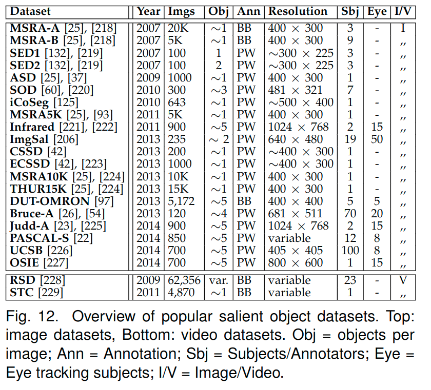

# 常用显著性监测数据集

主要看一下几个点:

* 项目地址
* 下载地址
* 数据集结构
* 数量比例
* 针对的应用
* 现有水平

## 显著性

### HyperSpectral Salient Object Detection Dataset (HS-SOD)

项目地址

<https://github.com/gistairc/HS-SOD>

下载地址

<http://data.airc.aist.go.jp/HS-SOD/HS-SOD.zip>

数据集结构

  HS-SOD.zip file contains three folders:
  1. hyperspectral: containing 60 hyperspectral images with #spatial rows:768 #spatial columns:1024 #spectral channels:81 (data only within visible spectrum: 380 nm -720 nm)
  2. color: 60 color images of hyperspectral dataset rendered in sRGB for visualization
  3. ground-truth: 60 ground-truth binary images for salient objects

数量比例

未知

针对的应用

salient   objectdetection

现有水平

一些介绍

> 使用有监督或无监督的方法对着色对象进行了显着的物体检测。最近，一些研究表明，通过在来自天然景观的高光谱图像的可见光谱中使用光谱特征，也可以实现有效的显着对象检测。然而，这些关于高光谱显着物体检测的模型使用从各种在线公共数据集中选择的极少数数据进行测试，这些数据不是为了物体检测目的而特别创建的。因此，在这里，我们的目标是通过发布具有60个高光谱图像的集合的高光谱显着物体检测数据集以及相应的地面实况二值图像和代表性的彩色图像（sRGB）来指导该领域。我们在数据收集过程中考虑了几个方面，例如对象大小的变化，对象的数量，前景-背景对比度，图像上的对象位置等。然后，我们为每个高光谱数据准备了真值二进制图像，其中显著性目标被标记为图像。最后，我们使用曲线下面积（AUC）度量对文献中一些现有的高光谱显着性检测模型进行了性能评估。
>
> 

### MSRA-A/B/5K/10K

[T. Liu, J. Sun, N. Zheng, X. Tang, and H.-Y. Shum, “Learningto detect a salient object,” inCVPR, 2007, pp. 1–8]

### ASD

[R.   Achanta,   S.   Hemami,   F.   Estrada,   and   S.   S ̈usstrunk,“Frequency-tuned salient region detection,” inCVPR, 2009.]

### DUT-OMRON

[C. Yang, L. Zhang, H. Lu, X. Ruan, and M.-H. Yang, “Saliencydetection via graph-based manifold ranking,” inCVPR, 2013.]

### Y.  Li,  X.  Hou,  C.  Koch,  J.  M.  Rehg,  and  A.  L.  Yuille,  “Thesecrets of salient object segmentation,” inCVPR, 2014.], [A.  Borji,  “What  is  a  salient  object?  a  dataset  and  a  baselinemodel for salient object detection,” inIEEE TIP, 2014.], [A. Borji, D. N. Sihite, and L. Itti, “What stands out in a scene?a study of human explicit saliency judgment,”Vision research,vol. 91, pp. 62–77, 2013.]

  * **SED1/2**[A.  Borji,  M.-M.  Cheng,  H.  Jiang,  and  J.  Li,  “Salient  objectdetection: A benchmark,”IEEE TIP, vol. 24, no. 12, pp. 5706–5722, 2015.]
  * **SOD**
  * **iCoSeg**
  * **Infrared**
  * **ImgSal**
  * **CSSD**
  * **ECSSD**
  * **THUR15K**
  * **Bruce-A**
  * **Judd-A**
  * **PASCAL-S**
  * **UCSB**
  * **OSIE**
  * **RSD**
  * **STC**

> [Salient Object Detection: A Survey](https://arxiv.org/abs/1411.5878)

## [Review of Visual Saliency Detection with Comprehensive Information](https://arxiv.org/abs/1803.03391)

* **ACSD**
* **HKU**
* **XPIE**
* **NLPR**
* **NJUD**
* **Image Pair**
* **Cosal2015**
* **INCT2016**
* **RGBDCoseg183**
* **06RGBDCosal150**
* **SegTrackV1/V2**
* **ViSal**
* **MCL**
* **DAVIS**
* **UVSD**
* **VOS**

## [Deep Image Matting](https://arxiv.org/abs/1703.03872)

* [alphamatting](http://alphamatting.com/datasets.php)

## [Semantic Human Matting](https://arxiv.org/abs/1809.01354)

* **alpha matting**
* **Shen et al.[Xiaoyong Shen, Xin Tao, Hongyun Gao, Chao Zhou, and Jiaya Jia. 2016. Deepautomatic portrait maŠing. InEuropean Conference on Computer Vision. Springer,92–107.]**
* **DIM[Ning Xu, Brian Price, ScoŠ Cohen, and Œomas Huang. 2017. Deep image matting.InComputer Vision and Paˆern Recognition (CVPR).]**
* **our dataset**

---

关于matting的一些介绍:

> https://blog.csdn.net/blueswhen/article/details/22617631

最近项目需要开始研究图像处理中的image matting技术了，中文简称抠图技术。刚接触这项技术时一直有些疑虑，这个和图像分割技术有什么差别，然后大概懂了。基本抠图都要人工交互，而分割技术则是全自动的，当然有人工介入的抠图分割在准确性上要远高于常规的图像分割技术，其实近两年不少文章都将分割技术作为抠图的第一步融入进去了。

字码到这里又一想，其实除了上述提到的，他俩还是有其他本质差异的。图像分割是将原图分割成若干块，分割的好与不好就看分出来的块是否与图像的内容对应了，例如如果分割结束后某一块只包含半张人脸，另外半张在另一块上，那肯定就不是好的分割了。至于抠图技术，基本只会分成两块，一块是前景，另一块是背景，而大多数时候我们抠图也就是为了把前景给拿出来。

早期这项技术主要被用在电影工业中，所以这是一项古老的技术了，只是现在依然在不断发展进步。你有时会看到拍电影的摄影棚都是全绿色背景，以及一群穿着全绿色衣服的工作人员。这些都会在后期的抠图技术下被抠掉换上“真正的”背景，这用的就是最原始的蓝屏抠图技术，即背景是纯色时用的抠图技术，纯色的背景可以确保前景被准确抠出。不过蓝屏抠图我并不想介绍，毕竟纯色背景的情况在现实中太少，应用面狭窄，背景是自然图像的抠图技术才是本系列介绍的重点。

虽然这项古老的技术发展至今已经数十年了，但几乎所有的解决方案都是在想办法做成一件事情，把这个公式“C = αF + (1-α)B”给解出来，这里就暂时把它称为抠图界的“上帝公式”吧。解什么？就是把α（不透明度）、F（前景色）和B（背景色）三个变量给解出来，C为图像当前可观察到的颜色，这是已知的。问题是一个等式解不出三个变量啊？ 因此就必须引入额外的约束使这个方程可解。这个额外的约束就是由用户指定的trimap图或者是仅仅在前景和背景画几笔的草图。

先在这里停一下，外行看到这里已经有点云里雾里了。那个公式是啥还没解释呢，那个公式其实反应出了一个模型，它把原始的图像看成了由若干图中对象叠加合成所组成的图，α则是每个对象的不透明度（[0,1]区间变化，1为不透明，0为完全透明）。这个模型也就告诉我们你当前在图中看到的像素的颜色是已经叠加合成过的颜色了也就是C，至于α、F、B都是未知的。其实我当初看到这里时依然还有疑问，既然是抠出来的前景，还有透不透明一说吗？正常的想法应该是完全不透明才对。当然事实确实是前景是不透明的α=1，而背景α=0，但问题是你能100%确定每个像素它是否是属于前景或是背景呢？也许一个像素一个像素分析后你也确实可以确定哪个属于前景，哪个属于背景，但这时图也已经抠好了，还要计算机干啥呢？这里也就引出了抠图技术真正需要计算机出马的部分了，就是处理在图像中那些人工不是那么容易辨认是前景还是背景的细节部分。我们把能轻易辨认的部分分别在原图标志为前景和背景，剩下不容易确定的部分则为未知区域由计算机处理。**这样一张由人工制作的包含前景、背景和未知区域的图就叫作trimap图**。不过计算机可没人这么聪明，它无法精确确定在未知区域的像素究竟是属于前景还是属于背景，只能去估计，这样导致的结果就是α不再是非0即1，而是有可能出现小数。

**因此基本上所有在文献中的抠图算法都是在教计算机如何更准确更快地通过用户指定的前景和背景估计出未知区域的α、B、F，而用户指定的方式一般分为两种，一种是信息量很大的trimap图，另一种则是信息量具少的草图（scribbles）。**然而trimap图的构建是很麻烦的，用户需要几乎把整张图都涂满才行，而草图就方便很多，只要在前景和背景处画几笔即可。所以对草图的处理才是未来抠图技术的发展趋势。

**获取到每个像素的α值后就可以生成一张α图，这张图看起来是只有前景是白的，其余都是黑的，这就像是我们都曾见过的在艺术创作中使用的蒙版（matte）**，只把前景露出来，其他背景被挡住。它和原图结合后就完成了抠图的工作了。之后只要继续按照上帝公式就可将抠出的前景移到新的背景中了。

优秀的抠图算法是有能力将前景中非常细小的毛发细节都能提取出的好算法，这点是传统图像分割技术做不到的。
