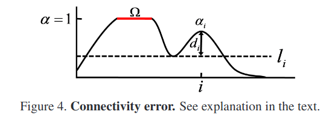
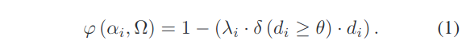

# 综合总结

* [综合总结](#综合总结)
  * [显著性目标检测](#显著性目标检测)
    * [什么是显著性目标检测](#什么是显著性目标检测)
      * [显著性目标(Salient Object)](#显著性目标salient-object)
      * [显著性目标检测(Salient Object Detection)数据集](#显著性目标检测salient-object-detection数据集)
    * [评价指标是什么](#评价指标是什么)
    * [有什么常用的方法](#有什么常用的方法)
  * [matting](#matting)
    * [和图像分割技术有什么差别](#和图像分割技术有什么差别)
    * [matting主要在做什么](#matting主要在做什么)
    * [主要的matting的方法有哪些](#主要的matting的方法有哪些)
      * [非CNN方法](#非cnn方法)
      * [CNN方法](#cnn方法)
    * [评价指标](#评价指标)
  * [参考](#参考)

## 显著性目标检测

### 什么是显著性目标检测

#### 显著性目标(Salient Object)

当我们在看一张图片时, 注意力首先会落在我们所感兴趣的物体部分. 比如我们看到一张画有羊吃草的图像时, 我们一般会先注意草坪上的羊, 而不是羊的背景, 所以我们把该图中的羊就定义为图像的显著性目标.

#### 显著性目标检测(Salient Object Detection)数据集

显著性检测是计算机视觉的一个重要分支，而在深度学习的训练阶段、显著性检测算法的评价阶段等都需要大量有标注信息的数据集。

**早期的显著性检测研究是针对眼动图进行的**。但是，眼动图是一些离散的人眼注视的空间点，不能表示出整个显著的区域，因此出现了**窗口框标注的显著性检测数据集**。然而，窗口框形式的数据集太过粗糙，**逐像素标注的显著性检测数据集**能够精确到显著物体的轮廓边缘，一些算法进行客观比较时具有更大的可信度。此外，还有**视频数据集和心理模式图数据集**.

### 评价指标是什么

显著性目标检测算法常用的评价指标有：平均绝对误差(Mean Absolute Error, MAE), [PR曲线(Precision-Recall curves)](http://blog.csdn.net/StupidAutofan/article/details/79583531)以及[F度量值(F-measure)](http://blog.csdn.net/StupidAutofan/article/details/79583450). 一般对于单幅图计算结束后, 还要在整体数据集上进行平均.

1. MAE: https://blog.csdn.net/StupidAutofan/article/details/79556087
2. PR curves: https://blog.csdn.net/StupidAutofan/article/details/79583531
3. F-measure: https://blog.csdn.net/StupidAutofan/article/details/79583450

### 有什么常用的方法

待补充

## matting

图像处理中的image matting技术, 中文简称抠图技术。

### 和图像分割技术有什么差别

语义分割是端到端的，对像素按照语义进行多分类，而抠图就是按照前景和背景进行二分类嘛？

实际上这是错误的理解。

* 语义分割重在对每个像素的语义理解，将相同语义的像素分割为同一个部分，得到的结果就是若干个块状，至于块与块之间是否衔接自然则不考虑。
* 抠图只将图片分成前景和背景两块，目的是拿到前景，好的抠图算法会对于头发等细节的处理效果比较精确。

分割和抠图的另一个重要区别是分割是返回像素分类结果，**分类结果是整型, 而抠图返回的是属于前景或背景的概率p**，在前景与背景交互区域会产生渐变的效果，使得抠图更加自然.

基本抠图都要人工交互，而分割技术则是全自动的，当然有人工介入的抠图分割在准确性上要远高于常规的图像分割技术，其实**近两年不少文章都将分割技术作为抠图的第一步融入进去了**。

早期这项技术主要被用在电影工业中，所以这是一项古老的技术了，只是现在依然在不断发展进步。

> 有时会看到拍电影的摄影棚都是全绿色背景，以及一群穿着全绿色衣服的工作人员。这些都会在后期的抠图技术下被抠掉换上“真正的”背景，这用的就是最原始的**蓝屏抠图技术**，即背景是纯色时用的抠图技术，纯色的背景可以确保前景被准确抠出。

### matting主要在做什么

虽然这项古老的技术发展至今已经数十年了，但**几乎所有的解决方案都是在想办法做成一件事情，把这个公式$C=αF+(1-α)B$给解出来**，这里就暂时把它称为抠图界的“上帝公式”吧。

> 解什么？
>
> 就是把 **α（不透明度, 也就是像素属于前景的概率）**、**F（前景色）** 和 **B（背景色）** 三个变量给解出来，C为图像当前可观察到的颜色，这是已知的。问题是一个等式解不出三个变量啊？ *因此就必须引入额外的约束使这个方程可解*。这个额外的约束就是由用户指定的trimap图或者是仅仅在前景和背景画几笔的草图。

公式反映出来一个模型，它把**原始图像看做是前景和背景按照一定权重（α透明度）叠加组成的**，α则是每个对象的不透明度（[0,1]区间变化，1为不透明，0为完全透明）。

这个模型也就告诉我们你当前在图中看到的像素的颜色是*已经叠加合成过的颜色*了, 也就是C，至于**α、F、B都是未知**的。

> 既然是抠出来的前景，还有透不透明一说吗？
>
> 正常的想法应该是完全不透明才对。当然事实确实是**前景是不透明的α=1，而背景α=0**，但问题是你能100%确定每个像素它是否是属于前景或是背景呢？也许一个像素一个像素分析后你也确实可以确定哪个属于前景，哪个属于背景，但这时图也已经抠好了，还要计算机干啥呢？这里也就引出了抠图技术真正需要计算机出马的部分了，就是**处理在图像中那些人工不是那么容易辨认是前景还是背景的细节部分**。我们把能轻易辨认的部分分别在原图标志为前景和背景，剩下不容易确定的部分则为未知区域由计算机处理。**这样一张由人工制作的包含前景、背景和未知区域的图就叫作trimap图**。不过计算机可没人这么聪明，它无法精确确定在未知区域的像素究竟是属于前景还是属于背景，只能去估计，这样导致的结果就是α不再是非0即1，而是有可能出现小数。

**因此基本上所有在文献中的抠图算法都是在教计算机如何更准确更快地通过用户指定的前景和背景估计出未知区域的α、B、F**，而用户指定的方式一般分为两种，一种是信息量很大的trimap图，另一种则是信息量具少的草图（scribbles）。

> 然而trimap图的构建是很麻烦的，用户需要几乎把整张图都涂满才行，而草图就方便很多，只要在前景和背景处画几笔即可。所以对草图的处理才是未来抠图技术的发展趋势。

**获取到每个像素的α值后就可以生成一张α图，这张图看起来是只有前景是白的，其余都是黑的，这就像是在艺术创作中使用的蒙版（matte）**，只把前景露出来，其他背景被挡住。它和原图结合后就完成了抠图的工作了。之后只要继续按照上帝公式就可将抠出的前景移到新的背景中了。

优秀的抠图算法是有能力将前景中非常细小的毛发细节都能提取出的好算法，这点是传统图像分割技术做不到的。

### 主要的matting的方法有哪些

#### 非CNN方法

* Poisson Matting
* Bayes Matting
* Learning Based Digital Matting
* Closed form matting
* KNN matting

#### CNN方法

* Natural Image Matting Using Deep CNN, ECCV 2016
* Deep Automatic Portrait Matting, ECCV 2016
* [Automatic Portrait Segmentation for Image Stylization](http://xiaoyongshen.me/webpage_portrait/index.html), ? 2016
* Deep Image Matting, CVPR 2017

### 评价指标

> <http://www.ims.tuwien.ac.at/publications/tuw-180666>

在A Perceptually Motivated Online Benchmark for Image MattingChristoph(Rhemann el.)这篇论文中, 给出了四个评价指标, 这里做下记录.

* 均方误差 (Mean squared error, MSE)
* 绝对误差和 (Sum of absolute difierences, SAD)
* 连通性误差(connectivity errors): 这是前景目标断开的结果, 例如一个断开的, 浮动在空气中的头发.
* 梯度误差(gradient errors): 这是因为在alpha matte中过度平滑或者错误的断开(即, alpha matte的梯度偏离真实标注)

梯度误差描述抠像结果与 Ground truth 中 fi 值的梯度误差. 与此类似, 连通性误差描述抠像结果中, 像素的连通度与Ground truth 中对应像素的连通度间的误差. MSE和 SAD 是常用的误差统计方法, 而梯度和连通性误
差是基于人的感官特点制定的.

关于具体的计算方式:

1. Gradient: 对于每一个预测出来的alpha matte, 以及真实标注的alpha matte上的各个像素位置上计算归一化梯度, 在这里, 我们通过将matte与具有方差为 $\sigma$ 的一阶高斯导数滤波器卷积来计算导数. **对得到的归一化梯度计算如下公式 $\sum_i(grad_{\alpha_i}-grad_{\alpha_i^*})^q$ 来进行计算.**
2. Connectivity(连通性): 通过灰度alpha matte计算的二值阈值图像中的连通性的方法来定义连通度, 细节上的计算对应像素在预测的 $\alpha$ 和真值的 $\alpha$ 对应的透明度下的对应像素与源区域 $\Omega$ 的连通度的差异. **具体公式使用的$\sum_i(\phi(\alpha_i, \Omega)-\phi(\alpha_i^*, \Omega))^p$**

  

  考虑图4, 说明了alpha遮罩中一行像素的强度函数。The source region $Ω$ is defined by **the largest connected region where both the alpha matte as well as its ground truth are completely opaque(不透明的)** (illustrated by the red line infig. 4). The degree of connectivity is based on the distance $d_i=α_i−l_i$, where $l_i$ is the maximum threshold level where pixel $i$ is *4-connected to Ω* (dashed line in fig. 4). **A pixel is said to be fully connected if $l_i=α_i$**. 源区域由最大的连接区域定义，其中alpha matte和其真值都是完全不透明的（图4红线所示）。连接程度基于距离$d_i=α_i-l_i$，其中$l_i$是像素$i$ 4连接到$Ω$的最大阈值水平（图4中的虚线）。如果$l_i=α_i$，则称一个像素完全连接。

  Finally, the degree of connectivity $φ$ for pixel i is defined as

  

  如果该函数为全连通, 那就值为1, 完全不连通, 值为0. 这里的 $\delta$ 函数强制忽略了小于$\theta$的di的小变化。这里的$\lambda_i$代表着非连通像素和他们的距离源区域的平均距离.

  

  这里的K表示在$l_i$到$\alpha_i$之间的离散的alpha值集合, 函数$dist_k$给了i在阈值k下, 到最近的连通源区域$\Omega$的归一化的欧氏距离.

## 参考

* 显著性检测综述(完整整理) <https://blog.csdn.net/qq_32493539/article/details/79530118>
* Salient Object Detection: <A Benchmark https://arxiv.org/abs/1501.02741>
* Salient Object Detection: <A Survey https://arxiv.org/abs/1411.5878>
* 语义分割指标: <https://blog.csdn.net/u012426298/article/details/81363850>
* 关于matting的介绍: <https://blog.csdn.net/blueswhen/article/details/22617631>
* 抠图技术及方法简介（Image Matting Overview） <https://blog.csdn.net/qq_36165459/article/details/78549686>
* Image Matting代码和算法效果总结 <https://blog.csdn.net/On_theway10/article/details/81873538>
