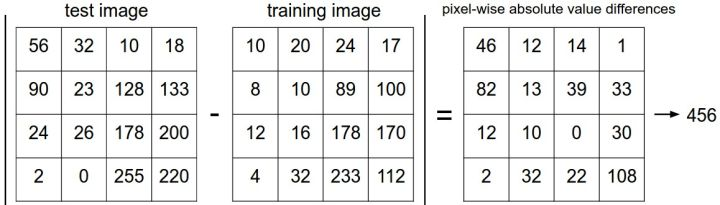
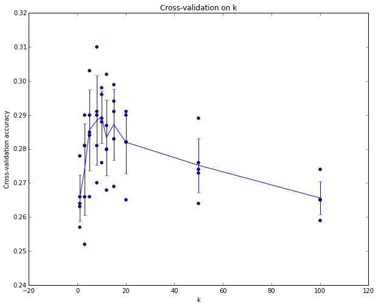
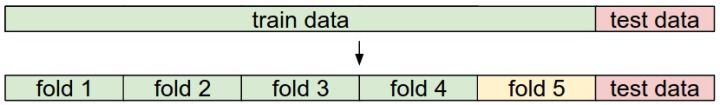

# 图像分类问题

## **最近邻分类器(Nearest Neighbor classifier)**

那么具体如何比较两张图片呢？在本例中，就是比较32x32x3的像素块。最简单的方法就是逐个像素比较，最后将差异值全部加起来。换句话说，就是将两张图片先转化为两个向量和，然后计算他们的**L1距离：**
$$d_1(I_1,I_2)=\sum_p|I^p_1-I^p_2|​$$
这里的求和是针对所有的像素。下面是整个比较流程的图例：



如果两张图片一模一样，那么L1距离为0，但是如果两张图片很是不同，那L1值将会非常大。

> 这样的计算直观上感觉是基于同一类事物的颜色形状特征较为相似。所以对于颜色形状近似的物体，极易发生误判。

下面，让我们看看如何用代码来实现这个分类器。首先，我们将CIFAR-10的数据加载到内存中，并分成4个数组：训练数据和标签，测试数据和标签。在下面的代码中，**Xtr**（大小是50000x32x32x3）存有训练集中所有的图像，**Ytr**是对应的长度为50000的1维数组，存有图像对应的分类标签（从0到9）：

```python
Xtr, Ytr, Xte, Yte = load_CIFAR10('data/cifar10/') 
# a magic function we provide
# flatten out all images to be one-dimensional
Xtr_rows = Xtr.reshape(Xtr.shape[0], 32 * 32 * 3) 
# Xtr_rows becomes 50000 x 3072
Xte_rows = Xte.reshape(Xte.shape[0], 32 * 32 * 3) 
# Xte_rows becomes 10000 x 3072
```

作为评价标准，我们常常使用**准确率**，它描述了我们预测正确的得分。请注意以后我们实现的所有分类器都需要有这个API：**train(X, y)**函数。该函数使用训练集的数据和标签来进行训练。从其内部来看，类应该实现一些关于标签和标签如何被预测的模型。这里还有个**predict(X)**函数，它的作用是预测输入的新数据的分类标签。现在还没介绍分类器的实现，下面就是使用L1距离的Nearest Neighbor分类器的实现套路：

```python
import numpy as np

class NearestNeighbor(object):
  	def __init__(self):
    	pass

    def train(self, X, y):
        """ X is N x D where each row is an example. Y is 1-dimension of size N """
        # the nearest neighbor classifier simply remembers all the training data
        self.Xtr = X
        self.ytr = y

  	def predict(self, X):
        """ X is N x D where each row is an example we wish to predict label for """
        num_test = X.shape[0]
        # lets make sure that the output type matches the input type
        Ypred = np.zeros(num_test, dtype = self.ytr.dtype)

    # loop over all test rows
    for i in xrange(num_test):
        # find the nearest training image to the i'th test image
        # using the L1 distance (sum of absolute value differences)
        distances = np.sum(np.abs(self.Xtr - X[i,:]), axis = 1)
        min_index = np.argmin(distances) # get the index with smallest distance
        Ypred[i] = self.ytr[min_index] # predict the label of the nearest example

    return Ypred
```

**距离选择**：计算向量间的距离有很多种方法，另一个常用的方法是**L2距离**，从几何学的角度，可以理解为它在计算两个向量间的欧式距离。L2距离的公式如下：


换句话说，我们依旧是在计算像素间的差值，只是先求其平方，然后把这些平方全部加起来，最后对这个和开方。在Numpy中，我们只需要替换上面代码中的1行代码就行：

```python
distances = np.sqrt(np.sum(np.square(self.Xtr - X[i,:]), axis = 1))
```

注意在这里使用了**np.sqrt**，但是在实际中可能不用。因为求平方根函数是一个*单调函数*，它对不同距离的绝对值求平方根虽然改变了数值大小，但依然保持了不同距离大小的顺序。所以用不用它，都能够对像素差异的大小进行正确比较。

**L1和L2比较**

比较这两个度量方式是挺有意思的。在面对两个向量之间的差异时，L2比L1更加不能容忍这些差异。也就是说，相对于1个巨大的差异，L2距离更倾向于接受多个中等程度的差异。L1和L2都是在[p-norm](https://link.zhihu.com/?target=http%3A//planetmath.org/vectorpnorm)常用的特殊形式。

### KNN

简单来说，K-NN可以看成：有那么一堆你已经知道分类的数据，然后当一个新数据进入的时候，就开始跟训练数据里的每个点求距离，然后挑**离这个训练数据最近的K个点看看这几个点属于什么类型，然后用少数服从多数的原则，给新数据归类**。

```txt
算法步骤
step.1---初始化距离为最大值
step.2---计算未知样本和每个训练样本的距离dist
step.3---得到目前K个最临近样本中的最大距离maxdist
step.4---如果dist小于maxdist，则将该训练样本作为K-最近邻样本
step.5---重复步骤2、3、4，直到未知样本和所有训练样本的距离都算完
step.6---统计K-最近邻样本中每个类标号出现的次数
step.7---选择出现频率最大的类标号作为未知样本的类标号
```

它的思想很简单：与其只找最相近的那1个图片的标签，我们找最相似的k个图片的标签，然后让他们针对测试图片进行投票，最后把票数最高的标签作为对测试图片的预测。所以当k=1的时候，k-Nearest Neighbor分类器就是Nearest Neighbor分类器。从直观感受上就可以看到，更高的k值可以让分类的效果更平滑，使得分类器对于异常值更有抵抗力。

k-NN分类器需要设定k值，那么选择哪个k值最合适的呢？我们可以选择不同的距离函数，比如L1范数和L2范数等，那么选哪个好？还有不少选择我们甚至连考虑都没有考虑到（比如：点积）。所有这些选择，被称为**超参数（hyperparameter）**。在基于数据进行学习的机器学习算法设计中，超参数是很常见的。一般说来，这些超参数具体怎么设置或取值并不是显而易见的。

你可能会建议尝试不同的值，看哪个值表现最好就选哪个。好主意！我们就是这么做的，但这样做的时候要非常细心。特别注意：**决不能使用测试集来进行调优**。当你在设计机器学习算法的时候，应该把测试集看做非常珍贵的资源，不到最后一步，绝不使用它。如果你使用测试集来调优，而且算法看起来效果不错，那么真正的危险在于：算法实际部署后，性能可能会远低于预期。这种情况，称之为算法对测试集**过拟合**。从另一个角度来说，如果使用测试集来调优，实际上就是把测试集当做训练集，由测试集训练出来的算法再跑测试集，自然性能看起来会很好。这其实是过于乐观了，实际部署起来效果就会差很多。所以，最终测试的时候再使用测试集，可以很好地近似度量你所设计的分类器的泛化性能（在接下来的课程中会有很多关于泛化性能的讨论）。

好在我们有不用测试集调优的方法。其思路是：从训练集中取出一部分数据用来调优，我们称之为**验证集**（**validation set**）。以CIFAR-10为例，我们可以用49000个图像作为训练集，用1000个图像作为验证集。验证集其实就是作为假的测试集来调优。

```python
# assume we have Xtr_rows, Ytr, Xte_rows, Yte as before
# recall Xtr_rows is 50,000 x 3072 matrix
Xval_rows = Xtr_rows[:1000, :] # take first 1000 for validation
Yval = Ytr[:1000]
Xtr_rows = Xtr_rows[1000:, :] # keep last 49,000 for train
Ytr = Ytr[1000:]

# find hyperparameters that work best on the validation set
validation_accuracies = []
for k in [1, 3, 5, 10, 20, 50, 100]:

    # use a particular value of k and evaluation on validation data
    nn = NearestNeighbor()
    nn.train(Xtr_rows, Ytr)
    # here we assume a modified NearestNeighbor class that can take a k as input
    Yval_predict = nn.predict(Xval_rows, k = k)
    acc = np.mean(Yval_predict == Yval)
    print 'accuracy: %f' % (acc,)

    # keep track of what works on the validation set
    validation_accuracies.append((k, acc))
```

程序结束后，我们会作图分析出哪个k值表现最好，然后用这个k值来跑真正的测试集，并作出对算法的评价。

> 把训练集分成训练集和验证集。使用验证集来对所有超参数调优。最后只在测试集上跑一次并报告结果。

**交叉验证**。有时候，训练集数量较小（因此验证集的数量更小），人们会使用一种被称为**交叉验证**的方法，这种方法更加复杂些。还是用刚才的例子，如果是交叉验证集，我们就不是取1000个图像，而是将训练集平均分成5份，其中4份用来训练，1份用来验证。然后我们循环着取其中4份来训练，其中1份来验证，最后取所有5次验证结果的平均值作为算法验证结果。



这就是5份交叉验证对k值调优的例子。针对每个k值，得到5个准确率结果，取其平均值，然后对不同k值的平均表现画线连接。本例中，当k=7的时算法表现最好（对应图中的准确率峰值）。如果我们将训练集分成更多份数，直线一般会更加平滑（噪音更少）。

### 常用的数据分割模式

**实际应用**。在实际情况下，人们不是很喜欢用交叉验证，主要是因为它会耗费较多的计算资源。一般直接把训练集按照50%-90%的比例分成训练集和验证集。但这也是根据具体情况来定的：如果超参数数量多，你可能就想用更大的验证集，而验证集的数量不够，那么最好还是用交叉验证吧。至于分成几份比较好，一般都是分成3、5和10份。



给出训练集和测试集后，训练集一般会被均分。这里是分成5份。前面4份用来训练，黄色那份用作验证集调优。如果采取交叉验证，那就各份轮流作为验证集。最后模型训练完毕，超参数都定好了，让模型跑一次（而且只跑一次）测试集，以此测试结果评价算法。

### 优缺点

现在对Nearest Neighbor分类器的优缺点进行思考。首先，Nearest Neighbor分类器易于理解，实现简单。其次，算法的训练不需要花时间，因为其训练过程只是将训练集数据存储起来。然而测试要花费大量时间计算，因为每个测试图像需要和所有存储的训练图像进行比较，这显然是一个缺点。在实际应用中，我们关注测试效率远远高于训练效率。其实，我们后续要学习的卷积神经网络在这个权衡上走到了另一个极端：虽然训练花费很多时间，但是一旦训练完成，对新的测试数据进行分类非常快。这样的模式就符合实际使用需求。

使用像素差异来比较图像，更易被背景或其他不相关因素干扰。从理想效果上来说，我们肯定是希望同类的图片能够聚集在一起，而不被背景或其他不相关因素干扰。为了达到这个目的，我们不能止步于原始像素比较，得继续前进。

## 图像分类问题

* 介绍了**图像分类**问题。在该问题中，给出一个由被标注了分类标签的图像组成的集合，要求算法能预测没有标签的图像的分类标签，并根据算法预测准确率进行评价。
* 介绍了一个简单的图像分类器：**最近邻分类器(Nearest Neighbor classifier)**。分类器中存在不同的超参数(比如k值或距离类型的选取)，要想选取好的超参数不是一件轻而易举的事。
* 选取超参数的正确方法是：将原始训练集分为训练集和**验证集**，我们在验证集上尝试不同的超参数，最后保留表现最好那个。
* 如果训练数据量不够，使用**交叉验证**方法，它能帮助我们在选取最优超参数的时候减少噪音。
* 一旦找到最优的超参数，就让算法以该参数在测试集跑且只跑一次，并根据测试结果评价算法。
* 最近邻分类器能够在CIFAR-10上得到将近40%的准确率。该算法简单易实现，但需要存储所有训练数据，并且在测试的时候过于耗费计算能力。
* 最后，我们知道了仅仅使用L1和L2范数来进行像素比较是不够的，图像更多的是按照背景和颜色被分类，而不是语义主体分身。

###  实际应用k-NN

如果你希望将k-NN分类器用到实处（最好别用到图像上，若是仅仅作为练手还可以接受），那么可以按照以下流程：

1. 预处理你的数据：对你数据中的特征进行归一化（normalize），让其具有零均值（zero mean）和单位方差（unit variance）。图像中的像素都是同质的，不会表现出较大的差异分布，也就不需要标准化处理了。
2. 如果数据是高维数据，考虑使用降维方法，比如PCA([wiki ref](https://link.zhihu.com/?target=http%3A//en.wikipedia.org/wiki/Principal_component_analysis), [CS229ref](https://link.zhihu.com/?target=http%3A//cs229.stanford.edu/notes/cs229-notes10.pdf), [blog ref](https://link.zhihu.com/?target=http%3A//www.bigdataexaminer.com/understanding-dimensionality-reduction-principal-component-analysis-and-singular-value-decomposition/))或[随机投影](https://link.zhihu.com/?target=http%3A//scikit-learn.org/stable/modules/random_projection.html)。
3. 将数据随机分入训练集和验证集。按照一般规律，70%-90% 数据作为训练集。这个比例根据算法中有多少超参数，以及这些超参数对于算法的预期影响来决定。如果需要预测的超参数很多，那么就应该使用更大的验证集来有效地估计它们。如果担心验证集数量不够，那么就尝试交叉验证方法。如果计算资源足够，使用交叉验证总是更加安全的（份数越多，效果越好，也更耗费计算资源）。
4. 在验证集上调优，尝试足够多的k值，尝试L1和L2两种范数计算方式。
5. 如果分类器跑得太慢，尝试使用Approximate Nearest Neighbor(近似最近邻)库（比如[FLANN](https://link.zhihu.com/?target=http%3A//www.cs.ubc.ca/research/flann/)）来加速这个过程，其代价是降低一些准确率。
6. 对最优的超参数做记录。记录最优参数后，是否应该让使用最优参数的算法在完整的训练集上运行并再次训练呢？因为如果把验证集重新放回到训练集中（自然训练集的数据量就又变大了），有可能最优参数又会有所变化。在实践中，**不要这样做**。千万不要在最终的分类器中使用验证集数据，这样做会破坏对于最优参数的估计。**直接使用测试集来测试用最优参数设置好的最优模型**，得到测试集数据的分类准确率，并以此作为你的kNN分类器在该数据上的性能表现。

## 参考资料

### 随机投影

支撑随机投影效率的主要理论成果是`Johnson-Lindenstrauss lemma (quoting Wikipedia)`:

> 在数学中，johnson - lindenstrauss 引理是一种将高维的点从高维到低维欧几里得空间的低失真嵌入的方案。 引理阐释了高维空间下的一小部分的点集可以内嵌到非常低维的空间，这种方式下点之间的距离几乎全部被保留。 内嵌所用到的映射至少符合 Lipschitz 条件,甚至可以被当做正交投影。