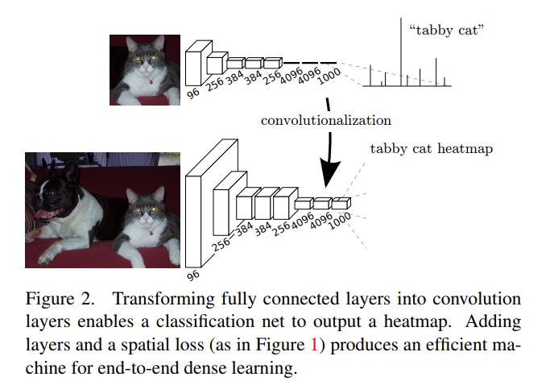
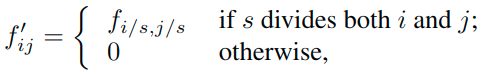
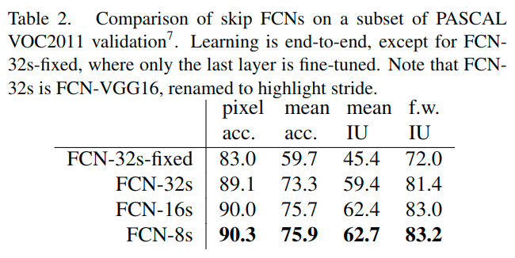

#	FCN总结(2015)

> 感谢这篇文章给予的重要帮助
>
> https://blog.csdn.net/sinat_24143931/article/details/78696442

* [前言](#前言)
* [背景](#背景)
* [全卷积网络(FCN)](#全卷积网络fcn)
  * [基本情况](#基本情况)
  * [为什么传统CNN对像素级别的分类很难?](#为什么传统cnn对像素级别的分类很难)
  * [如何将`全连接层`和`全卷积层`的相互转化?](#如何将全连接层和全卷积层的相互转化)
  * [全连接层的权重W重塑成卷积层的滤波器有什么好处呢?](#全连接层的权重w重塑成卷积层的滤波器有什么好处呢)
  * [怎么使反卷积的output大小和输入图片大小一致, 从而得到`pixel level prediction`?](#怎么使反卷积的output大小和输入图片大小一致-从而得到pixel-level-prediction)
* [上采样(Upsampling)](#上采样upsampling)
  * [反卷积](#反卷积)
  * [插值](#插值)
  * [跳级(skip)结构](#跳级skip结构)
* [构思](#构思)
  * [其他人的工作](#其他人的工作)
  * [Convnet](#convnet)
  * [Shift-and-stitch](#shift-and-stitch)
* [架构](#架构)
  * [尝试其他方法](#尝试其他方法)
* [训练](#训练)
  * [优化](#优化)
  * [微调](#微调)
  * [Patch抽样](#patch抽样)
  * [其他](#其他)
* [测试](#测试)
  * [度量指标](#度量指标)
  * [不同数据集的表现](#不同数据集的表现)
    * [PASCAL VOC](#pascal-voc)
    * [NYUDv2(RGB-D)](#nyudv2rgb-d)
    * [SIFT Flow](#sift-flow)
* [总结](#总结)
* [例子](#例子)
* [参考](#参考)

## 前言

我们展示了卷积网络本身, 经过端到端像素像素的训练, 超过了语义分割的最新水平.我们的主要见解是**建立“完全卷积”网络**, 它可以输入任意大小的数据, 并通过有效的推理和学习产生相应大小的输出. 我们**定义和详细说明完全卷积网络空间**, 解释它们在空间密集预测任务中的应用, 并且绘制与先前模型的连接.

我们将当代分类网络（AlexNet [19], VGG网络[31]和GoogLeNet [32]）适应于完全卷积网络, 并通过微调[4]将它们的学习表示**迁移到分割任务**. 然后, 我们定义一种新颖的架构, 它**将来自深层粗略层的语义信息与来自浅的细致层的外观信息相结合**, 以生成准确和详细的分割.

我们的完全卷积网络实现了PASCAL VOC(2012年相对于平均IU提高20％至2012年平均IU为62.2％), NYUDv2和SIFT Flow的最先进的分割, 而对于典型图像, 推断的推理时间不到0.2秒钟.

## 背景

卷积网络正在推动识别上的优势. 卷积网络正在推动识别. ConvNets不仅改进了整体图像分类[19,31,32], 而且在具有结构化输出的局部任务上取得了进展. 这些包括边界框目标检测[29,12,17], 部分和关键点预测[39,24]以及局部响应[24,9]方面的进展.

从粗糙到细致推理的下一步自然是对每个像素进行预测. 先前的方法已经将卷积网络用于语义分割[27,2,8,28,16,14,11], 其中**每个像素用其封闭对象或区域的类标记**, 但是具有一些缺点,而我们的工作却解决了这个.


> 完全卷积网络可以有效地学习如像语义分割一样对像素任务进行密集预测.

* 我们展示了一个完全卷积网络(FCN), 在语义分割上进行端到端, 像素到像素训练, 超过了最新的技术水平, 而无需其他机器. 据我们所知, **这是第一项针对像素点预测和监督学习的进行端到端训练FCNs的工作.** 现有网络的完全卷积版本**预测来自任意大小输入的密集输出**. 学习和推理都是通过密集的前馈计算和反向传播在整个图像上进行的. 网络内部上采样层通过Pooling实现网络中的像素预测和学习. 这种方法是有效的, 无论是渐近的还是绝对的, 并且不需要其他工作中的复杂性. Patchwise训练是常见的[27,2,8,28,11], 但缺乏完全卷积训练的效率. 我们的方法不利用预处理和后处理的复杂性, 包括superpixels[8,16], proposals[16,14], 或随机场或局部分类的事后补充(post-hoc refinement by random fields or local classifiers)[8,16].
* 我们的模型通过将分类网络重新解释为完全卷积, 和从他们学习的表示中进行微调, 来将分类中最近的成功[19,31,32]转化为密集预测. 相比之下, 之前的作品在没有受过监督的预训练的情况下应用了小型卷积网络[8,28,27].
* 语义分割面临语义和位置之间固有的紧张关系：全局信息解决了局部信息在何处解决的问题(Semantic segmentation faces an inherent tension between semantics and location: global information resolves what while local information resolves where). 深度要素层次结构, 共同编码局部全局金字塔中的位置和语义. 我们定义了一种新颖的“跳过”架构, 将4.2节的深度粗糙的语义信息和浅的细致的外观信息结合起来(见图).


## 全卷积网络(FCN)

### 基本情况

通常CNN网络在卷积层之后会接上若干个全连接层, 将卷积层产生的特征图(feature map)映射成一个固定长度的特征向量. 以AlexNet为代表的经典CNN结构适合于图像级的分类和回归任务, 因为它们最后都得到整个输入图像的一个概率向量, 比如AlexNet的ImageNet模型输出一个1000维的向量表示输入图像属于每一类的概率(softmax归一化).



- 在CNN中, 猫的图片输入到AlexNet, 得到一个长为1000的输出向量, 表示**输入图像属于每一类的概率,** 其中在“tabby cat”这一类统计概率最高, 用来做分类任务
- FCN与CNN的区别在于把于CNN最后的全连接层转换成卷积层, **输出的是一张已经Label好的图片**, 而这个图片就可以做语义分割

CNN的强大之处在于它的多层结构能自动学习特征, 并且可以学习到多个层次的特征：
- 较浅的卷积层感知域较小, 学习到一些局部区域的特征
- 较深的卷积层具有较大的感知域, 能够学习到更加抽象一些的特征

高层的抽象特征对物体的大小、位置和方向等敏感性更低, 从而有助于识别性能的提高, 所以我们常常可以将卷积层看作是特征提取器

### 为什么传统CNN对像素级别的分类很难?

1. 存储开销很大. 例如对每个像素使用的图像块的大小为15x15, 然后不断滑动窗口, 每次滑动的窗口给CNN进行判别分类, 因此则所需的存储空间根据滑动窗口的次数和大小急剧上升.
2. 计算效率低下. 相邻的像素块基本上是重复的, 针对每个像素块逐个计算卷积, 这种计算也有很大程度上的重复.
3. 像素块大小的限制了感知区域的大小. 通常像素块的大小比整幅图像的大小小很多, 只能提取一些局部的特征, 从而导致分类的性能受到限制.

### 如何将`全连接层`和`全卷积层`的相互转化?

全连接层和卷积层之间唯一的不同就是卷积层中的神经元只与输入数据中的一个局部区域连接, 并且在卷积列中的神经元共享参数. 然而在两类层中, 神经元都是计算点积, 所以它们的函数形式是一样的. 因此, 将此两者相互转化是可能的：

- 对于任一个卷积层, 都存在一个能实现和它一样的前向传播函数的全连接层. 权重矩阵是一个巨大的矩阵, 除了某些特定块, 其余部分都是零. 而在其中大部分块中, 元素都是相等的.
- 任何全连接层都可以被转化为卷积层. 将滤波器的尺寸设置为和输入数据体的尺寸一致, 本质上和全连接层的输出是一样的. **输出激活数据深度是由卷积核的数目决定的(K=4096)**

在两种变换中, **将全连接层转化为卷积层在实际运用中更加有用**.

假设一个卷积神经网络的输入是227x227x3的图像, 一系列的卷积层和下采样层将图像数据变为尺寸为7x7x512的激活数据体, AlexNet的处理方式为使用了两个尺寸为4096的全连接层, 最后一个有1000个神经元的全连接层用于计算分类评分. 我们可以将这3个全连接层中的任意一个转化为卷积层：

- 第一个连接区域是[7x7x512]的全连接层, 令其滤波器尺寸为, 这样输出数据体就为[1x1x4096]
- 第二个全连接层, 令其滤波器尺寸为, 这样输出数据体为[1x1x4096]
- 最后一个全连接层也做类似的, 令其, 最终输出为[1x1x1000]

### 全连接层的权重W重塑成卷积层的滤波器有什么好处呢?

这样的转化可以在单个向前传播的过程中, 使得卷积网络在一张更大的输入图片上滑动, 从而得到多个输出(可以理解为一个label map)

比如: 我们想让224×224尺寸的浮窗, 以步长为32在384×384的图片上滑动, 把每个经停的位置都带入卷积网络, 最后得到6×6个位置的类别得分, 那么通过将全连接层转化为卷积层之后的运算过程为:

* 如果224×224的输入图片经过卷积层和下采样层之后得到了[7x7x512]的数组
* 那么, 384×384的大图片直接经过同样的卷积层和下采样层之后会得到[12x12x512]的数组
* 然后再经过上面由3个全连接层转化得到的3个卷积层
* 最终得到[6x6x1000]的输出((12 – 7)/1 + 1 = 6)

这个结果正是浮窗在原图经停的6×6个位置的得分

**一个确定的CNN网络结构之所以要固定输入图片大小, 是因为全连接层权值数固定, 而该权值数和feature map大小有关, 但是FCN在CNN的基础上把1000个结点的全连接层改为含有1000个1×1卷积核的卷积层, 经过这一层, 还是得到二维的feature map, 同样我们也不关心这个feature map大小, 所以对于输入图片的size并没有限制**

FCN将传统CNN中的全连接层转化成卷积层, 对应CNN网络FCN把最后三层全连接层转换成为三层卷积层
* 全连接层转化为全卷积层. 传统的CNN结构中, 前5层是卷积层, 第6层和第7层分别是一个长度为4096的一维向量, 第8层是长度为1000的一维向量, 分别对应1000个不同类别的概率. FCN将这3层表示为卷积层, 卷积核的大小 (通道数, 宽, 高) 分别为 (4096,1,1)、(4096,1,1)、(1000,1,1). 看上去数字上并没有什么差别, 但是卷积跟全连接是不一样的概念和计算过程, 不一样的在于权值和偏置是有自己的范围, 属于自己的一个卷积核.
* CNN中**输入的图像大小是统一固定成227x227大小的图像**, 第一层pooling后为55x55, 第二层pooling后图像大小为27x27, 第五层pooling后的图像大小为13x13. 而FCN输入的图像是H*W大小, 第一层pooling后变为原图大小的1/2, 第二层变为原图大小的1/4, 第五层变为原图大小的1/8, 第八层变为原图大小的1/16
* 经过多次卷积和pooling以后, 得到的图像越来越小, 分辨率越来越低. 其中图像到最小的一层时, 所产生图叫做heatmap热图, 热图就是我们最重要的高维特征图, 得到高维特征的heatmap之后就是最重要的一步, 也是最后的一步**对原图像进行upsampling, 把图像进行放大几次到原图像的大小**

相较于使用*被转化前的原始卷积神经网络对所有36个位置进行迭代计算优化模型, 然后再对36个位置做预测*, 使用转化后的*卷积神经网络进行一次前向传播*计算要高效得多, 因为36次计算都在共享计算资源.

> 这一技巧在实践中经常使用, **通常将一张图像尺寸变得更大, 然后使用变换后的卷积神经网络来对空间上很多不同位置进行评价得到分类评分, 然后在求这些分值的平均值**.

### 怎么使反卷积的output大小和输入图片大小一致, 从而得到`pixel level prediction`?

FCN里面全部都是卷积层(pooling也看成卷积), 卷积层不关心input的大小, inputsize和outputsize之间存在线性关系.

反卷积是要使成立, 要确定, 就需要设置deconvolution层的kernelsize, stride, padding, 计算方法如下：

- 卷积层使feature map变小, 是因为stride, 卷积操作造成的影响一般通过padding来消除
- 因此, 累积采样步长factor就等于反卷积之前所有层的stride的乘积

## 上采样(Upsampling)

> https://blog.csdn.net/u011771047/article/details/72872742
>
> 文中探讨了上采样/插值/反卷积
>
> https://blog.csdn.net/u014451076/article/details/79156967
>
> 介绍了三种主要的上采样手段: 插值/转置卷积/逆汇聚(反池化)

上采样upsampling的主要目的是放大图像, 几乎都是采用内插值法, 即在原有图像像素的基础上, 在像素点值之间采用合适的**插值算法**插入新的元素.

> 之后会专门写一篇介绍上采样的文章, 因为最近出来很多的新的技术, 来更好的实现上采样.
> 2019年04月17日08:52:46

### 反卷积

Upsampling的操作可以看成是反卷积(deconvolutional), 卷积运算的参数和CNN的参数一样是在训练FCN模型的过程中通过bp算法学习得到.

反卷积层也是卷积层, 不关心input大小, 滑窗卷积后输出output. deconv并不是真正的deconvolution(卷积的逆变换), 最近比较公认的叫法应该是transposed convolution, **deconv的前向传播就是conv的反向传播**, 是一种向后步进的卷积. 从某种意义来讲, 采用因子为f的上采样就是一种分数步进(stride = 1/f < 1)的卷积, 只要f是一个整数, 也就是, 有着输出stride为f的反向卷积(backwards convolution/deconvolution).

**deconvolutional layer中的kernel是可以被训练的, 也可以是固定的(即默认的二维bilinear kernel).** 一个反向卷积层和激活函数的堆叠, 甚至可以学习一个非线性的上采样.

使用反卷积将上一层的feature map放大, 并使其输出在crop layer中进行切割, **使其与ground truth具有相同的尺寸来计算每个像素点的误差.**

之所以说FCN中的反卷积操作不是原则意义上transposed convolution, 是因为作者设置其中的学习率lr_mult为0, **没有让该层学习**. 即卷积核是固定不变的.

> > Transposed Convolution, Fractionally Strided Convolution or Deconvolution
> >
> > https://buptldy.github.io/2016/10/29/2016-10-29-deconv/
>
> Full padding, transposed(图中的反卷积, input是2×2, output是4×4)
>
> 
>
> Zero padding, non-unit strides, transposed(图中的反卷积, input feature map是3×3, 转化后是5×5, output是5×5)
>
> 

### 插值

另一汇总关联粗略的输出到密集像素的方法是**插值(interpolation)**, 例如简单的双线性插值等等.

> 总结：线性插值法利用原图像中**两个点**计算像素值进行插值, 双线性插值法利用原图像中**四个点**计算目标像素值进行插值.
>
> **线性插值**
>
> 
>
> 两点估算直线, 带入求解中间点.
>
> **双线性差值**
>
> 
>
> 第一步：X方向的线性插值, 在Q12, Q22中插入蓝色点R2, Q11, Q21中插入蓝色点R1;
>
> 第二步 ：Y方向的线性插值, 通过第一步计算出的R1与R2在y方向上插值计算出P点.
>
> 在x与y方向上, z值成单调性特性的应用中, 此种方法可以做外插运算, 即可以求解Q11~Q22所构成的正方形以外的点的值.

在我们的实验中, 上采样对于学习密集预测, 表现的快速有效. 我们最好的分割架构使用了这些层来学习上采样来优化预测.

### 跳级(skip)结构

对CNN的结果做处理, 得到了dense prediction, 而作者在试验中发现, 得到的分割结果比较粗糙, 所以考虑加入更多前层的细节信息, 也就是把倒数第几层的输出和最后的输出做一个fusion, 实际上也就是加和：


实验表明, 这样的分割结果更细致更准确. 在逐层fusion的过程中, 若是使用更高层的特征, 结果又会变差, 所以作者做到这里就停了.

这里的融合使用的是

## 构思

### 其他人的工作

完全卷积网络据我们所知, Matan等人首先提出了将一个卷积网络扩展到任意大小(arbitrary-sized)的输入的想法.

* [25]它扩展了经典的LeNet [21]以识别数字串. 因为他们的网络仅限于一维输入字符串, Matan等人使用Viterbi解码来获得它们的输出.
* 沃尔夫和普拉特[37]将卷积网络的输出扩展为邮政地址块四个角的检测分数的二维图.

这两个历史工作都是**为了检测而进行推理和学习的完全卷积**.

* 宁等人[27]利用完全卷积推理对线虫组织的粗多类分割定义了一个网络.
* Sermanet等人的滑动窗口检测[29]
* Pinheiro和Collobert [28]的语义分割
* Eigen等人的图像恢复.
* [5]做完全卷积推理.

**完全卷积训练是很少见的**.

* 但是Tompson等人有效地使用[35]来学习端到端的部件检测器和姿态估计的空间模型, 尽管他们不解释或分析这种方法.

或者

* He等人[17]丢弃分类网络的非卷积部分来制作特征提取器. 他们将建议和空间金字塔聚合合并在一起, 以产生一个用于分类的局部的固定长度的特征. 虽然快速有效, 但这种混合模式无法端到端学习.

**用卷积网络的密集预测**.

* 最近的一些作品已经将密码学应用于密集预测问题, 其中包括Ning等人的语义分割[27], Farabet et al[8], Pinheiro和Collobert [28]
* Ciresan等人对电子显微镜的边界预测[2]
* Ganin和Lempitsky的混合神经网络/最近邻模型的自然图像[11]边界预测.
* Eigen等人的图像恢复和深度估计[5, 6].

这些方法的共同要素包括以下几点：

* 限制容量和感受野的小模型;
* 拼凑式训练(patchwise training)[27,2,8,28,11];
* 超像素投影/随机场正则化/滤波/局部分类后处理[8,2,11];
* OverFeat [29]介绍的对于密集输出[28,11]的输入移位和输出交错;
* 多尺度金字塔处理[8,28,11];
* 饱和tanh非线性激活函数[8,5,28];
* 集成方法(Ensemble Method)[2, 11],

而我们的方法没有这个机制. 但是, 我们从**FCN的角度来研究拼凑式训练和“移位-拼接(shift-and-stitch)”密集输出**. 我们还**讨论了网络内上采样**.

* 而Eigen等人全连接预测[6]是这种情况一个特例.

与现有的方法不同, 我们适应并扩展了深度分类架构, 使用图像分类作为监督式预训练, 并完全卷积式的微调, 以便从整个图像输入和整个图像真是标签中简单而有效地进行学习.

* Hariharan等人[16]和Gupta等人[14]同样将深层分类网络适用于语义分割, 但是在混合建议分类模型(hybrid proposal-classifier models)中也是如此.

这些方法微调一个R-CNN系统, 通过为检测/语义分割/实例分割(detection, semantic segmentation, and instance segmentation)进行采样边界框 和/或 区域建议.

**这两种方法都不是端对端学习的.**

> 语义分割与实例分割
>
> > https://blog.csdn.net/lanyuxuan100/article/details/70800246
>
> ~~目前的分割任务主要有两种：~~(2019年04月17日08:59:46)
>
> 目前的分割任务主要有三种:
> 1. 像素级别的语义分割
> 2. 实例分割
> 3. 全景分割
>
> 顾名思义, 像素级别的语义分割, 对图像中的每个像素都划分出对应的类别, 即实现像素级别的分类；而类的具体对象, 即为实例, 那么实例分割不但要进行像素级别的分类, **还需在具体的类别基础上区别开不同的实例**. 比如说图像有多个人甲、乙、丙, 那边他们的语义分割结果都是人, 而实例分割结果却是不同的对象, 具体如下图所示
>
> 

### Convnet

Convnets建立在平移不变性(translation invariance)的基础上. 它们的基本组件(卷积, 汇聚和激活函数)在局部输入区域上运行, 并且仅依赖于相对空间坐标. 为特定层中的(i,j)位置处的数据矢量写入xij, 并为下一层写入yij, 这些函数通过以下方式计算输出yij：


其中k是核大小,s是步长或者采样因子.f决定了层的类型: 卷积, 汇聚(平均, 空间最大, 最大), 非线性激活等等操作.


这种函数形式在这种组合下维护, 内核大小和步幅服从转换规则.

虽然一般深度网络计算一般非线性函数, 但只有这种形式的层的网络计算非线性滤波器, 我们称之为深层滤波器或完全卷积网络.

FCN自然地对任何大小的输入进行操作, 并产生相应的(可能重新采样的)空间维度的输出. 一个由FCN组成的实值损失函数定义一个任务. 如果损失函数是最终层的空间维数的总和, , 它的梯度将是每个空间分量梯度的总和. 因此, 在整幅图像上计算出l的随机梯度下降与l'上的随机梯度下降相同, 将最后一层所有的感受野作为一个小批次.

当这些接收域显著重叠(overlap significantly)时, 在整个图像上layer-by-layer计算而不是patch-by-patch时, 前馈计算和反向传播都更加高效.

> 为什么会更加高效?

典型的识别网络, 包括LeNet [21], AlexNet [19]及其更深层次的继承者[31,32], 表面上采用固定大小的输入并产生非空间输出. 这些网的完全连接层**具有固定尺寸并丢弃空间坐标**. 然而, **这些完全连接的层也可以被视为与覆盖整个输入区域的内核的卷积**. 这样做将它们转换为完全卷积网络, 可以输入任意大小和输出分类图.


> 将完全连接的层转换成卷积层使分类网络能够输出热图. 添加图层和空间损失(如图1所示)为端到端密集学习提供了一个有效的工具.

此外, 虽然得到的结果图相当于对特定输入patch的原始网络的评估, 计算量在这些patch的重叠区域高度分摊.

例如, 尽管AlexNet需要1.2 ms(在典型的GPU上)产生227x227图像的分类得分, 但完全卷积版本需要22 ms来从500x500图像产生10x10网格输出, 速度比原始方法提高了5倍以上.

> Assuming efficient batching of single image inputs. The classification scores for a single image by itself take 5.4 ms to produce, which is nearly 25 times slower than the fully convolutional version.
>
> 假定一个有效的单图输入, 单个图像的分类评分本身需要5.4 ms才能生成, 这几乎是比全卷积版本慢了25倍.
> 22ms/100 = 0.22ms 近似于 5.4ms/25

**这些卷积模型的空间输出映射使它们成为像语义分割这样的密集问题的自然选择**. 在每个输出单元都有真实标签情况下, 前向和后向通道都很直接, 并且都利用了卷积固有的计算效率(take advantage of the inherent computational efficiency)(和积极的优化). 尽管我们将分类网络重新解释为完全卷积产生任意大小输入的输出映射, 但输出维度通常通过下采样来减少. 分类网络下采样以保持滤波器的小型化和计算要求的合理性. 这会粗化这些网络的完全卷积版本的输出, 将其从输入大小减小一个等于输出单元的接收字段的像素跨度的因子.

### Shift-and-stitch

通过OverFeat引入的输入移位和输出交错(Input shifting and output interlacing)是一种技巧, 可以**从粗略输出产生密集预测而无需插值(即实验中的上采样).**

如果以f为下采样因子, 则输入向右(左侧和顶部填充)移动x个像素, 向下移动y个像素, 每个(x, y)值处理一次. 这些fxf个输入每个都通过convnet运行, 并且输出交错, 以便预测对应于其接受场中心的像素. **只更改滤波器和图层跨度可以产生与此Shift-and-stitch技巧相同的输出**.

考虑一个具有输入步幅s的图层(卷积或合并), 以及一个带滤波器权重fij的后续卷积图层(删除特征尺寸, 这里与此无关). 将低层的输入步幅设置为1, 通过上采样因子s来采样输出, 就像Shift-and-stitch一样. 然而, 将原始滤波器与上采样输出进行卷积并不会产生与这个技巧相同的结果, 因为原始滤波器只能看到其(现在上采样)输入的缩减部分. 为了重现这个技巧, 通过把滤波器扩大为如下形式,来稀疏滤波器.



> 这里的i,j都是从0开始.
>
> 也就是一个空洞卷积.

重新产生基于这个点(包括重复这个逐层增大的滤波器直到所有的下采样被移除)的整个网络的输出.

简单的减少网络内部的下采样是一种权衡: 这些滤波器可以看到更为细致的一些信息, 但是有更小的感受野和更长的时间去计算. 尽管我们已经做了使用了shift-and-stitch初始的实验, 但是并没有用在我们的模型里. 我们发现通过上采样学习, 正如后面描述的, 是更为有效的和有效率的, 尤其是与跳跃层融合进行组合的时候.

## 架构

1. 基于AlexNet以及VGG(16/19在这个任务上差别不大), GoogLeNet(对于GoogLeNet, 我们仅使用最终损失层, 并通过丢弃最终平均池层来提高性能)
2. 丢弃最终分类器层来处理每个网络, 并转换所有全连接层为卷积层
3. 为每个PASCAL类别, 在每个粗糙的输出定位, **添加了一个1x1x21的卷积层**来预测得分, 并跟随了**一个转置卷积层**来实现双线性上采样粗糙的输出到像素密集输出

从分类到分割的微调为每个网络提供了可靠的预测. 甚至最糟的模型都可以实现大约百分之七十五的卓越表现. 我们为分割定义了一个新的完全卷积网络(FCN), 它结合了特征层次结构的各层并改善了输出的空间精度.


> 
>
> https://blog.csdn.net/u014593748/article/details/71698246

虽然完全卷积分类器可以微调到以适应分割任务, 甚至在标准度量上得分很高, 但它们的输出却不满意.


> 过融合来自不同步长层的信息来完全卷积网络改善了分割细节. 前三张图像显示了我们的32,16和8像素跨步的输出

我们通过添加链接来解决这个问题, 这些链接将最终预测层与较低层相结合.


将线拓扑转换为DAG(有向无环图), 其边缘从较低层跳到较高层(图3). 由于他们看到的像素较少, 精细尺度预测应该只需要较少的图层, 因此从较浅的输出中制作它们是有意义的. 组合细致层和粗糙层让模型进行局部预测, 从而尊重全局结构. 通过类似于Florack等人的the multiscale local jet,  [10], 我们称我们的非线性局部特征层次为 the deep jet.

* 我们首先通过**预测16像素跨度层**来将输出跨度减半，我们在pool4的顶部添加一个1x1卷积层**来产生额外的类别预测**.
* 我们通过添加2x上采样层和**求和策略**, 将此pool4预测输出与在步幅32的conv7顶部(卷积化的fc7)上计算的预测相融合
* 我们将2x上采样初始化为双线性插值, 但允许按照3.3节所述学习参数.
* 最后, 在跨步16的上采样上预测图像.

我们称之为FCN-16s. FCN-16是端到端学习的, 用一个更粗糙的网络(我们现在称为FCN-32s)的参数进行初始化. 作用于pool4的新参数是零初始化的, 因此网络以未经修改的预测开始. 学习率降低了100倍.

这个效果的改进是很明显的.可以从上图中看到.之后又进行了进一步的调整.得到了FCN-8s.效果越来越好.



我们获得了62.7 mean IU的小幅进一步改善, 并且发现我们的输出的平滑性和细节略有改善

此时可以看出, 我们的融合改进已经面临了收益递减(diminishing returns), 无论是在强调大规模正确性的IU度量方面, 还是在可见性方面. 所以我们不会继续融合更低层.

### 尝试其他方法

* 通过减少stride of pooling是获得更为细致的预测的直接方法. 但是, 对于我们基于VGG16的网络来说, 这样做是有问题的. 将pool5图层设置为步幅1要求我们的卷积化fc6具有14x14的大小的滤波器以保持其感受野大小. 除了计算成本之外, 我们难以学习如此大的滤波器. 我们尝试用较小的过滤器重新构建pool5上的层, 但未能实现可比较的性能; 一种可能的解释是上层使用ImageNet训练的权重来初始化非常重要.
* 获得更好预测的另一种方法是使用shift-and-stitch技巧. 在有限的实验中, 我们发现这种方法对于成本的提升率比层融合更差.

## 训练

### 优化

* SGD with momentum 0.9
* minibatch = 20
* lr = 1e-3, 1e-4, 5^(-5) for FCN-AlexNet, FCN_VGG16 and FCN-GoogLeNet 线性搜索更新.
* weight decay of 5^(-4) or 2^(-4)
* 将bias学习率加倍
* **对class score的卷积层做全零初始化. 随机初始化在性能和收敛上没有优势**
* Dropout 被使用在初始分类网络

### 微调

* 用AlexNet, VGG16或者GoogleNet训练好的模型做初始化, 在这个基础上做fine-tuning, **整个网络全部都fine-tuning, 只需在末尾加上upsampling**, 参数的学习还是利用CNN本身的反向传播原理
* 单独对输出分类器进行微调只会产生完整的网络性能的70％
* 考虑到学习基本分类网所需的时间, 从头开始(from scratch)训是不可行的(Note that the VGG net is trained in stages, while we initialize from the full 16-layer version. 分段训练, 从完整的16层版本进行了初始化)
* 对于粗糙的FCN-32版本, 在单个GPU上进行微调需要三天, 每个版本需要一天左右升级到FCN-16和FCN-8s版本.

### Patch抽样

在随机优化中, 梯度计算是由训练分布支配的.

patchwise 训练和全卷积训练能被用来产生任意分布, 尽管他们相对的计算效率依赖于重叠域和minibatch的大小. 在由所有单元的感受野组成的每一个批次, 基于一幅图的损失之下(或图像的集合), 整张图像的全卷积训练等同于patchwise训练.

> https://stats.stackexchange.com/questions/266075/patch-wise-training-and-fully-convolutional-training-in-fully-convolutional-neur
>
> Basically, fully convolutional training takes the whole MxM image and produces outputs for all subimages in a **single ConvNet forward pass**.
>
> Patchwise training explicitly crops out the subimages and produces outputs for each subimage in **independent forward passes**.
>
> Therefore, fully convolutional training is usually substantially faster than patchwise training.
>
> So, for fully convolutional training, you make updates like this:
>
> 1. Input whole MxM image (or multiple images)
> 2. Push through ConvNet -> get an entire map of outputs (maximum size MxM per image, possibly smaller)
> 3. Make updates using the loss of all outputs
>
> Now while this is quite fast, it **restricts** your training sampling process compared to patchwise training: You are forced to make a lot of updates **on the same image** (actually, all possible updates for all subimages) during one step of your training.
>
> That's why they write that fully convolutional training is only identical to patchwise training, if each receptive field (aka subimage) of an image is contained in a training batch of the patchwise training procedure (for patchwise training, you also could have two of ten possible subimages from image A, three of eight possible subimages from image B, etc. in one batch). Then, they argue that by not using all outputs during fully convolutional training, you get closer to patchwise training again (since you are not making all possible updates for all subimages of an image in a single training step). However, you waste some of the computation. Also, in Section 4.4/Figure 5, they describe that making all possible updates works just fine and there is no need to ignore some outputs.

* 我们发现, 与整幅图像训练相比, **采样对收敛速度没有显着影响, 但由于每批需要考虑更多数量的图像, 因此花费的时间会显着增加**.
* **采用whole image做训练**, 不进行patchwise sampling. 实验证明直接用全图已经很effective and efficient


### 其他

* 类别平衡 卷积训练可以通过对损失进行加权或抽样来平衡类别. 虽然我们的标签是轻微不平衡的(大约3/4是背景), 但我们发现平衡是不必要的.
* 密集预测 通过网络内的反向卷积层将分数上采样到输入维度. 最终层反向卷积滤波器固定为双线性插值, 而中间上采样层初始化为双线性上采样, 然后学习. 不使用shift-and-stitch或滤波器稀疏等效.
* 数据增强 我们试图通过随机镜像和“抖动”图像, 通过将图像转化为每个方向上的32像素(最粗糙的预测尺度)来增强训练数据. 这没有得到明显的改善.
* 更多数据 使用了更多的训练数据.
* 实现 所有模型都经过Caffe训练和测试, 使用单个NVIDIA Tesla K40c.

## 测试

### 度量指标

我们报告了来自常见语义分割和场景分析评估的四个度量标准, 这些评估是关于像素精度和区域交集的变化. 设nij为预测属于类j的第i类像素的数量, 其中有ncl个不同的类别, 令第i类像素的总数. 我们计算：


### 不同数据集的表现

#### PASCAL VOC

表给出了我们的FCN-8在PASCAL VOC 2011和2012测试装置上的性能, 并将其与以前最先进的SDS [16]和众所周知的R-CNN [12]比较. 我们在mean-IU上获得最佳结果, relative margin为20％. 推理时间减少114x(仅限于细分, 忽略提议和细化( proposals and refinement))或286x(总体).


#### NYUDv2(RGB-D)

比一般的RGB图像多了一个深度维度.


> HHA在[14]深度上嵌入, 作为表示水平差异, 地面高度, 和推断的重力方向的局部表面法线的角度.
>
> RGB-HHA是联合训练的后期融合模型, 它结合了RGB和HHA预测

最初我们先在RGB图像上训练了未修改的粗糙模型, 为了添加深度信息,我们在一个四通道输入(早期融合)上进行模型提升训练. 这并没有提供太多的帮助, 或许是因为在整个模型中传播有意义的梯度比较困难

我们又尝试了深度的三维HHA编码, 只在这个信息上训练网络, 获得了和RGB与HHA后期融合的相同的比较好的效果, 这里在网络的最后层的预测被加在一起, 并且致使这样一个双路网络实现了端到端学习.最终我们更新了这个后期融合到16跨度的版本.

#### SIFT Flow

这是包含33个语义类别(“桥”, “山”, “太阳”)以及三个几何类别(“水平”, “垂直”和“天空”)的像素标签的2,688幅图像的数据集.

FCN可以自然地学习同时预测两种类型的标签的联合表示. 我们学习了带有语义和几何预测层和损失的FCN-16的双头版本. 学习模型在两个任务上的表现都与两个独立训练的模型一样好, 而学习和推理本身与每个独立模型本质上一样快.

表中的结果是根据标准拆分为2,488个训练和200个测试图像计算的, 显示了这两项任务的最新性能.


## 总结

全卷积网络是一类丰富的模型, 其中现代分类网络是一个特殊的案例. 认识到这一点, 将这些分类网络扩展到分割任务, 并通过多分辨率层组合改进架构, 极大地提高了现有技术水平, 同时简化和加快了学习和推理.

总体来说, 本文的逻辑如下：

- 想要精确预测每个像素的分割结果, 必须经历从大到小, 再从小到大的两个过程
- 在升采样过程中, 分阶段增大比一步到位效果更好
- 在升采样的每个阶段, 使用降采样对应层的特征进行辅助

缺点:

- 得到的结果还是不够精细. 进行8倍上采样虽然比32倍的效果好了很多, 但是上采样的结果还是比较模糊和平滑, 对图像中的细节不敏感
- 对各个像素进行分类, 没有充分考虑像素与像素之间的关系. 忽略了在通常的基于像素分类的分割方法中使用的**空间规整(spatial regularization)步骤**, 缺乏空间一致性

## 例子

这里直接从代码入手理解，下面的代码很直观。

```python
# https://github.com/pochih/FCN-pytorch/blob/master/python/fcn.py
class FCN8s(nn.Module):

    def __init__(self, pretrained_net, n_class):
        super().__init__()
        self.n_class = n_class
        self.pretrained_net = pretrained_net
        self.relu    = nn.ReLU(inplace=True)
        self.deconv1 = nn.ConvTranspose2d(512, 512, kernel_size=3, stride=2, padding=1, dilation=1, output_padding=1)
        self.bn1     = nn.BatchNorm2d(512)
        self.deconv2 = nn.ConvTranspose2d(512, 256, kernel_size=3, stride=2, padding=1, dilation=1, output_padding=1)
        self.bn2     = nn.BatchNorm2d(256)
        self.deconv3 = nn.ConvTranspose2d(256, 128, kernel_size=3, stride=2, padding=1, dilation=1, output_padding=1)
        self.bn3     = nn.BatchNorm2d(128)
        self.deconv4 = nn.ConvTranspose2d(128, 64, kernel_size=3, stride=2, padding=1, dilation=1, output_padding=1)
        self.bn4     = nn.BatchNorm2d(64)
        self.deconv5 = nn.ConvTranspose2d(64, 32, kernel_size=3, stride=2, padding=1, dilation=1, output_padding=1)
        self.bn5     = nn.BatchNorm2d(32)
        self.classifier = nn.Conv2d(32, n_class, kernel_size=1)

    def forward(self, x):
        output = self.pretrained_net(x)
        x5 = output['x5']  # size=(N, 512, x.H/32, x.W/32)
        x4 = output['x4']  # size=(N, 512, x.H/16, x.W/16)
        x3 = output['x3']  # size=(N, 256, x.H/8,  x.W/8)

        score = self.relu(self.deconv1(x5))               # size=(N, 512, x.H/16, x.W/16)
        score = self.bn1(score + x4)                      # element-wise add, size=(N, 512, x.H/16, x.W/16)
        score = self.relu(self.deconv2(score))            # size=(N, 256, x.H/8, x.W/8)
        score = self.bn2(score + x3)                      # element-wise add, size=(N, 256, x.H/8, x.W/8)
        score = self.bn3(self.relu(self.deconv3(score)))  # size=(N, 128, x.H/4, x.W/4)
        score = self.bn4(self.relu(self.deconv4(score)))  # size=(N, 64, x.H/2, x.W/2)
        score = self.bn5(self.relu(self.deconv5(score)))  # size=(N, 32, x.H, x.W)
        score = self.classifier(score)                    # size=(N, n_class, x.H/1, x.W/1)

        return score  # size=(N, n_class, x.H/1, x.W/1)
```

## 参考

* 论文： https://arxiv.org/abs/1603.07285
* 代码： https://github.com/pochih/FCN-pytorch/blob/master/python/fcn.py
* 参考： http://www.cnblogs.com/gujianhan/p/6030639.html
