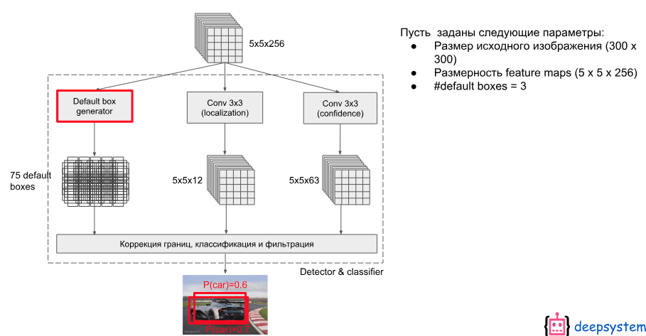
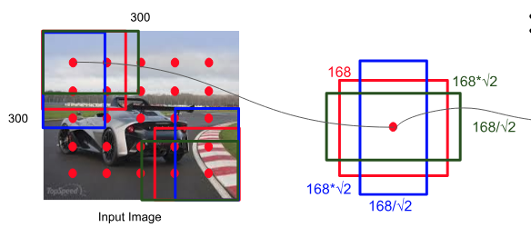
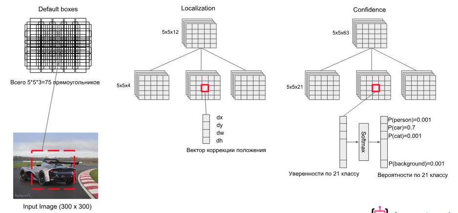
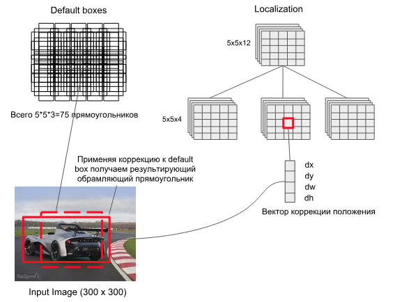
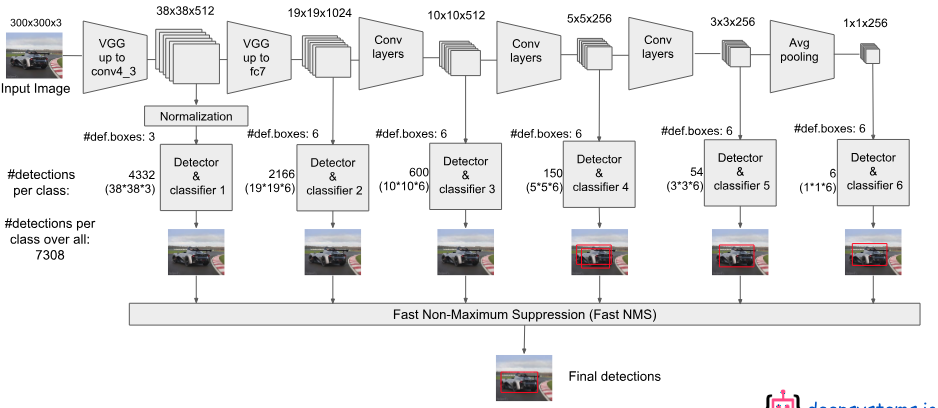

# SSD(2015)

> 论文链接：[https://arxiv.org/pdf/1512.02325.pdf](https://link.zhihu.com/?target=https%3A//link.jianshu.com/%3Ft%3Dhttps%253A%252F%252Farxiv.org%252Fpdf%252F1512.02325.pdf)
>
> tensorflow源码链接：[https://github.com/balancap/SSD-Tensorflow](https://link.zhihu.com/?target=https%3A//link.jianshu.com/%3Ft%3Dhttps%253A%252F%252Fgithub.com%252Fbalancap%252FSSD-Tensorflow)
>
> 论文翻译: http://noahsnail.com/2017/12/11/2017-12-11-Single%20Shot%20MultiBox%20Detector%E8%AE%BA%E6%96%87%E7%BF%BB%E8%AF%91%E2%80%94%E2%80%94%E4%B8%AD%E8%8B%B1%E6%96%87%E5%AF%B9%E7%85%A7/

SSD是YOLO之后又一个引人注目的目标检测结构, 它沿用了YOLO中直接回归 bbox和分类概率的方法, 同时又参考了Faster R-CNN, 大量使用anchor来提升识别准确度. 通过把这两种结构相结合, SSD保持了很高的识别速度, 还能把mAP提升到较高的水平.

文章贡献:

- 我们引入了SSD, 这是一种针对多个类别的单次检测器, 比先前的先进的单次检测器（YOLO）更快, 并且准确得多, 事实上, 与执行显式区域提出和池化的更慢的技术具有相同的精度（包括Faster R-CNN）.
- SSD的核心是**预测固定的一系列默认边界框的类别分数和边界框偏移**, 使用更小的卷积滤波器应用到特征映射上.
- 为了实现高检测精度, 我们根据不同尺度的特征映射生成不同尺度的预测, 并通过纵横比明确分开预测.
- 这些设计功能使得**即使在低分辨率输入图像上也能实现简单的端到端训练和高精度**, 从而进一步提高速度与精度之间的权衡.
- 实验包括在PASCAL VOC, COCO和ILSVRC上评估具有不同输入大小的模型的时间和精度分析, 并与最近的一系列最新方法进行比较.

## 基本结构

原作者给了两种SSD结构, SSD 300和SSD 512, 用于不同输入尺寸的图像识别.

本文中以SSD 300为例.

下图上半部分就是SSD 300, 下半部分是YOLO, 可以对比来看.

* SSD 300中输入图像的大小是300x300.

* 特征提取部分使用了VGG16的卷积层, 并将VGG16的`fc6`和`fc7`转换为卷积层(图中conv6和conv7)
* 将pool5从$2\times 2-s2$更改为$3\times 3-s1$, 并使用空洞算法[18]来填补这个“小洞”
* 我们删除所有的dropout层和`fc8`层
* 之后又接了多个卷积(conv8_2, conv9_2, conv10_2)
* 最后用一个Global Average Pool来变成1x1的输出(conv11_2)


下面是对于keras版本的实现:

```python
    input_layer = Input(shape=input_shape)

    # Block 1
    conv1_1 = Conv2D(64, (3, 3),
                     name='conv1_1',
                     padding='same',
                     activation='relu')(input_layer)

    conv1_2 = Conv2D(64, (3, 3),
                     name='conv1_2',
                     padding='same',
                     activation='relu')(conv1_1)
    pool1 = MaxPooling2D(name='pool1',
                         pool_size=(2, 2),
                         strides=(2, 2),
                         padding='same', )(conv1_2)

    # Block 2
    conv2_1 = Conv2D(128, (3, 3),
                     name='conv2_1',
                     padding='same',
                     activation='relu')(pool1)
    conv2_2 = Conv2D(128, (3, 3),
                     name='conv2_2',
                     padding='same',
                     activation='relu')(conv2_1)
    pool2 = MaxPooling2D(name='pool2',
                         pool_size=(2, 2),
                         strides=(2, 2),
                         padding='same')(conv2_2)

    # Block 3
    conv3_1 = Conv2D(256, (3, 3),
                     name='conv3_1',
                     padding='same',
                     activation='relu')(pool2)
    conv3_2 = Conv2D(256, (3, 3),
                     name='conv3_2',
                     padding='same',
                     activation='relu')(conv3_1)
    conv3_3 = Conv2D(256, (3, 3),
                     name='conv3_3',
                     padding='same',
                     activation='relu')(conv3_2)
    pool3 = MaxPooling2D(name='pool3',
                         pool_size=(2, 2),
                         strides=(2, 2),
                         padding='same')(conv3_3)

    # Block 4
    conv4_1 = Conv2D(512, (3, 3),
                     name='conv4_1',
                     padding='same',
                     activation='relu')(pool3)
    conv4_2 = Conv2D(512, (3, 3),
                     name='conv4_2',
                     padding='same',
                     activation='relu')(conv4_1)
    conv4_3 = Conv2D(512, (3, 3),
                     name='conv4_3',
                     padding='same',
                     activation='relu')(conv4_2)
    pool4 = MaxPooling2D(name='pool4',
                         pool_size=(2, 2),
                         strides=(2, 2),
                         padding='same')(conv4_3)

    # Block 5
    conv5_1 = Conv2D(512, (3, 3),
                     name='conv5_1',
                     padding='same',
                     activation='relu')(pool4)
    conv5_2 = Conv2D(512, (3, 3),
                     name='conv5_2',
                     padding='same',
                     activation='relu')(conv5_1)
    conv5_3 = Conv2D(512, (3, 3),
                     name='conv5_3',
                     padding='same',
                     activation='relu')(conv5_2)
    pool5 = MaxPooling2D(name='pool5',
                         pool_size=(3, 3),
                         strides=(1, 1),
                         padding='same')(conv5_3)

    # FC6
    fc6 = Conv2D(1024, (3, 3),
                 name='fc6',
                 dilation_rate=(6, 6),
                 padding='same',
                 activation='relu'
                 )(pool5)

    # x = Dropout(0.5, name='drop6')(x)
    # FC7
    fc7 = Conv2D(1024, (1, 1),
                 name='fc7',
                 padding='same',
                 activation='relu'
                 )(fc6)
    # x = Dropout(0.5, name='drop7')(x)

    # Block 6
    conv6_1 = Conv2D(256, (1, 1),
                     name='conv6_1',
                     padding='same',
                     activation='relu')(fc7)
    conv6_2 = Conv2D(512, (3, 3),
                     name='conv6_2',
                     strides=(2, 2),
                     padding='same',
                     activation='relu')(conv6_1)

    # Block 7
    conv7_1 = Conv2D(128, (1, 1),
                     name='conv7_1',
                     padding='same',
                     activation='relu')(conv6_2)
    conv7_1z = ZeroPadding2D(name='conv7_1z')(conv7_1)
    conv7_2 = Conv2D(256, (3, 3),
                     name='conv7_2',
                     padding='valid',
                     strides=(2, 2),
                     activation='relu')(conv7_1z)

    # Block 8
    conv8_1 = Conv2D(128, (1, 1),
                     name='conv8_1',
                     padding='same',
                     activation='relu')(conv7_2)
    conv8_2 = Conv2D(256, (3, 3),
                     name='conv8_2',
                     padding='same',
                     strides=(2, 2),
                     activation='relu')(conv8_1)

    # Last Pool
    pool6 = GlobalAveragePooling2D(name='pool6')(conv8_2)
```

## 结构特点

SSD方法基于前馈卷积网络, 该网络**产生固定大小的边界框集合**, 并对这些边界框中存在的**目标类别实例进行评分**, 然后进行**非极大值抑制**步骤来产生最终的检测结果.

早期的网络层基于用于高质量图像分类的标准架构(在任何分类层之前被截断), 我们将其称为基础网络. 然后, 我们将辅助结构添加到网络中.

### 同时使用多个卷积层的输出做分类和回归


> SSD使用VGG-16-Atrous作为基础网络, 其中黄色部分为在VGG-16基础网络上填加的特征提取层.
>
> SSD与yolo不同之处是除了在最终特征图上做目标检测之外, 还在之前选取的5个特特征图上进行预测.

可以看出, 检测过程不仅在附加网络部分的特征图(conv8_2, conv9_2, conv_10_2, pool_11)上进行, 为了保证网络对小目标有很好检测效果, 检测过程也在基础网络部分的特征图(conv4_3, conv_7)上进行.

**SSD这么做有什么好处呢？**

> 训练SSD和训练使用区域提出的典型检测器之间的关键区别在于, 需要将真实信息分配给固定的检测器输出集合中的特定输出.
>
> 一旦确定了这个分配, 损失函数和反向传播就可以应用端到端了. 训练也涉及选择默认边界框集合和缩放进行检测, 以及难例挖掘和数据增强策略.

要回答这个问题得先回顾下YOLO的结构, YOLO在训练时ground truth和bbox是一一对应的关系(**ground truth对应到其中心位置所在区域中IOU最大的那个bbox来计算loss**), 如果有两个ground truth的尺寸和位置都比较相近, 就很有可能对应到同一个区域的同一个bbox, 这种场景下必然会有一个目标无法识别.

为了解决这个问题SSD的作者把YOLO的结构做了如下优化：

1. 重新启用了Faster R-CNN中anchor的结构

    在SSD中如果有多个ground truth, 每个anchor(原文中称作default box, 取名不同而已)会选择**对应到IOU最大的那个ground truth**(以anchors为起始考虑).

    一个anchor只会对应一个ground truth, 但**一个ground truth都可以对应到大量anchor**, 这样无论两个ground truth靠的有多近, 都不会出现YOLO中bbox冲突的情况.

2. 同时使用多个层级上的anchor来进行回归

    作者认为仅仅靠同一层上的多个anchor来回归, 还远远不够. 因为有很大可能这层上所有anchor的IOU都比较小, 就是说**所有anchor离ground truth都比较远**, 用这种anchor来训练误差会很大.

    > 例如下图中, 左边较低的层级因为feature map尺寸比较大, anchor覆盖的范围就比较小, 远小于ground truth的尺寸, 所以这层上所有anchor对应的IOU都比较小；右边较高的层级因为feature map尺寸比较小, anchor覆盖的范围就比较大, 远超过ground truth的尺寸, 所以IOU也同样比较小；只有中间的anchor才有较大的IOU.
    >
    > 通过同时对多个层级上的anchor计算IOU, 就能**找到与ground truth的尺寸、位置最接近(即IOU最大)的一批anchor**, 在训练时也就能达到最好的准确度.
    >
    > 
    >
    > 不同层级输出的feature map上anchor的IOU差异会比较大

### anchor尺寸的选择

下面来看下SSD选择anchor的方法. 在SSD框架内, default boxes/anchors不需要对应于每层的实际感受野.


> 这是特征图上的框, 具体对应于原始图像, 还需要将和这个min_size*(input_scale / feature_map_scale)?

1. 我们将每个默认边界框的中心设置为$(\frac{i+0.5}{|f_k|}, \frac{j+0.5}{|f_k|})$, 其中$|f_k|$是第k个方形特征映射的大小(特征图的边长), $i, j\in [0, |f_k|)$

2. 我们为默认边界框添加不同的**长宽比**, 并将它们表示为$a_r \in {1, 2, 3, \frac{1}{2}, \frac{1}{3}}$. 我们可以计算每个边界框的宽度$width=(w_k^a = s_k\sqrt{a_r})$和高度$height=(h_k^a = s_k / \sqrt{a_r})$.

    同时还有多个长方形的anchor, 长方形anchor的数目在不同层级会有差异.

    对于长宽比为1, 我们还添加了一个默认边界框, 其尺度为$s’_k = \sqrt{s_k s_{k+1}}$

    在每个特征映射位置得到**6个默认边界框**

3. 上面的min_size和max_size由下面公式计算得到, $s_{min}=0.2, s_{max}=0.9$.

    m代表全部用于回归的层数, 比如在SSD 300中m就是6

    第k层的$min_{size}=s_k$, 第k层的$max_{size}=s_{k+1}$

    

> luminoth的代码实现, 与这里提到的公式有些不同:
>
> ```python
> import numpy as np
> import tensorflow as tf
>
> def generate_anchors_reference(ratios, scales, num_anchors, feature_map_shape):
>     """
>     Generate the default anchor for one feat map which we will later convolve
>     to generate all the anchors of that feat map.
>     生成一个特征图的左上角的一个格子里的默认锚点, 我们稍后将进行卷积以生成该特征图的所有锚点
>
>     anchor_reference = generate_anchors_reference(
>         anchor_ratios, scales[i: i + 2],
>         anchors_per_point[i], feat_map_shape
>     )
>     """
>     heights = np.zeros(num_anchors)
>     widths = np.zeros(num_anchors)
>
>     # 先得到那个大的方形的anchor
>     if len(scales) > 1:
>         # 说明不是最后的特征图, 计算的时候, 先确定那个大框, 即 feature_map_weight*
>         # sqrt(min_size, max_size)(特征图也是方形的)
>         widths[0] = heights[0] = (np.sqrt(scales[0] * scales[1]) *
>                                   feature_map_shape[0])
>     # The last endpoint
>     else:
>         # The last layer doesn't have a subsequent layer with which
>         # to generate the second scale from their geometric mean,
>         # so we hard code it to 0.99.
>         # We should add this parameter to the config eventually.
>         # 最后一层没有后续层来得到需要的max_size, 所以这里直接编码为0.99
>         heights[0] = scales[0] * feature_map_shape[0] * 0.99
>         widths[0] = scales[0] * feature_map_shape[1] * 0.99
>
>     # 这里的纵横比例实际上的数量是不包含前面这个大的方形anchor的, 但是num_anchors却包含了,
>     # 所以这里对于ratios进行切片的时候, 要截止到num_anchors-1, 因为大方形anchor是一定有的
>     # 而且小的纵横比也是一定有的
>     ratios = ratios[:num_anchors - 1]
>     heights[1:] = scales[0] / np.sqrt(ratios) * feature_map_shape[0]
>     widths[1:] = scales[0] * np.sqrt(ratios) * feature_map_shape[1]
>
>     # Each feature layer forms a grid on image space, so we
>     # calculate the center point on the first cell of this grid.
>     # Which we'll use as the center for our anchor reference.
>     # The center will be the midpoint of the top left cell,
>     # given that each cell is of 1x1 size, its center will be 0.5x0.5
>     x_center = y_center = 0.5
>
>     # Create anchor reference.
>     # 这里的到anchors的(num_of_the_feature_map_anchors, 4)
>     # [x_min, y_min, x_max, y_max]
>     anchors = np.column_stack([
>         x_center - widths / 2,
>         y_center - heights / 2,
>         x_center + widths / 2,
>         y_center + heights / 2,
>     ])
>
>     return anchors
>
>
> def generate_raw_anchors(feature_maps, anchor_min_scale, anchor_max_scale,
>                          anchor_ratios, anchors_per_point):
>     """
>     Returns a dictionary containing the anchors per feature map.
>     返回所有提取出来的特征图的所有的anchors
>
>     Returns:
>     anchors: A dictionary with feature maps as keys and an array of anchors
>         as values ('[[x_min, y_min, x_max, y_max], ...]') with shape
>         (anchors_per_point[i] * endpoints_outputs[i][0]
>          * endpoints_outputs[i][1], 4)
>     """
>     # TODO: Anchor generation needs heavy refactor
>
>     # We interpolate the scales of the anchors from a min and a max scale
>     # 线性插值, 从最小值到最大值, 这里保留了最大值, 总共的数量为len(feture_maps), 这里应该是6
>     scales = np.linspace(anchor_min_scale, anchor_max_scale, len(feature_maps))
>
>     anchors = {}
>     # 对各个位置上的特征图进行遍历, 提取对应的特征图的大小(高,宽), 获取
>     for i, (feat_map_name, feat_map) in enumerate(feature_maps.items()):
>         feat_map_shape = feat_map.shape.as_list()[1:3]
>         # ques: 若是i是0~5, 那这里对应的sacles最后的范围岂不是超界了?
>         # ans: 超出去的元素就不存在了, 这是python切片的一个小技巧, 若是索引元素, 那就不可以了
>         anchor_reference = generate_anchors_reference(
>             anchor_ratios, scales[i: i + 2],
>             anchors_per_point[i], feat_map_shape
>         )
>         # 生成每个特征图对应的所有anchors
>         anchors[feat_map_name] = generate_anchors_per_feat_map(
>             feat_map_shape, anchor_reference)
>
>     return anchors
>
>
> def generate_anchors_per_feat_map(feature_map_shape, anchor_reference):
>     """
>     Generate anchor for an image.
>     已获得的基于左上角的feature_map的grid的anchors, 进一步获得整个特征图上的所有的anchors
>
>     Using the feature map, the output of the pretrained network for an
>     image, and the anchor_reference generated using the anchor config
>     values. We generate a list of anchors.
>
>     Anchors are just fixed bounding boxes of different ratios and sizes
>     that are uniformly generated throught the image.
>
>     Args:
>         feature_map_shape: Shape of the convolutional feature map used as
>             input for the RPN. Should be (batch, height, width, depth).
>
>     Returns:
>         all_anchors: A flattened Tensor with all the anchors of shape
>             `(num_anchors_per_points * feature_width * feature_height, 4)`
>             using the (x1, y1, x2, y2) convention.
>     """
>     with tf.variable_scope('generate_anchors'):
>         # 这五句指令, 实现了长宽范围内的数据的组合对应
>         shift_x = np.arange(feature_map_shape[1])
>         shift_y = np.arange(feature_map_shape[0])
>         shift_x, shift_y = np.meshgrid(shift_x, shift_y)
>         shift_x = np.reshape(shift_x, [-1])
>         shift_y = np.reshape(shift_y, [-1])
>
>         # 对数据进行一下打包, 得到的是(4, HxW)
>         shifts = np.stack(
>             [shift_x, shift_y, shift_x, shift_y],
>             axis=0
>         )
>         shifts = np.transpose(shifts)
>         # Shifts now is a (H x W, 4) Tensor
>         # 现在相当于得到了所有的grid的左上角的坐标
>
>         # Expand dims to use broadcasting sum.
>         # (1, num_grid_anchors, 4) + (HxW, 1, 4) = (HxW, num_grid_anchors, 4)
>         all_anchors = (
>                 np.expand_dims(anchor_reference, axis=0) +
>                 np.expand_dims(shifts, axis=1)
>         )
>         # Flatten
>         # (HxWxnum_grid_anchors, 4)
>         return np.reshape(all_anchors, (-1, 4))
> ```

### loss的计算

SSD包含三部分的loss：前景分类的loss、背景分类的loss、位置回归的loss.


> 总体目标损失函数是定位损失(loc)和置信度损失(conf)的加权和

* N是匹配的默认边界框的数量, 如果N=0, 则将损失设为0
* α是分类loss和回归loss的调节比例, 论文中α=1

> 
>
> 对于每个特征图的一点, 预测C个类别得分, 以及相对于Default Bounding Box的4个偏移值


* $L_{loc}(x,l,g)$是所有用于**前景分类的anchor的位置坐标的回归loss**, $L_{loc}(x,l,g)$位置回归仍采用Smooth L1方法, 类似于faster-rcnn, 回归默认边界框(d)的中心(cx, cy)和其宽度(w),高度(h)的偏移量

    > ```python
    > # Second we need to calculate the smooth l1 loss between
    > # `bbox_offsets` and `bbox_offsets_targets`.
    > # 一个是预测的偏移缩放值, 一个是真实框的偏移缩放值
    > bbox_offsets = prediction_dict['loc_pred']
    > bbox_offsets_targets = (prediction_dict['target']['bbox_offsets'])
    >
    > # We only want the non-background labels bounding boxes.
    > # 在预测框和真实框中筛选前景对应的偏移缩放值,
    > not_ignored = tf.reshape(tf.greater(cls_target, 0), [-1])
    > bbox_offsets_positives = tf.boolean_mask(
    >     bbox_offsets, not_ignored, name='bbox_offsets_positives')
    > bbox_offsets_target_positives = tf.boolean_mask(
    >     bbox_offsets_targets, not_ignored,
    >     name='bbox_offsets_target_positives'
    > )
    >
    > # 得到对于每个提案的回归损失
    > reg_loss_per_proposal = smooth_l1_loss(
    > 	bbox_offsets_positives, bbox_offsets_target_positives)
    > ```

* $L_{conf}(x,c)$是**前景(p)的分类loss和背景(0)的分类loss的和**, 是在多类别置信度(c)上的softmax损失

    > 在源码中对anchors对于所有真实框的最大的IoU进行判断, 当IOU>0.5的anchor都用于前景分类(当然, 如同Faster RCNN中那样, 也要考虑和每一个真实框对应的最好的anchors), 在IOU<0.5的anchor中**选择部分**用作背景分类.
    >
    > > 最终被认定为背景的anchors, 是和所有真实框的最大IoU值小于背景阈值(0.2), 而且又是标签被标定为小于等于0的anchors, 选择其中的有着较大的最大分类概率的作为最后的背景
    >
    > 只选择部分的原因是背景anchor的数目一般远远大于前景anchor, 如果都选为背景, 就会弱化前景loss的值, 造成定位不准确.
    >
    > 在论文中"难例挖掘"一节提到, 背景分类的anchor数目至多为前景分类anchor数的**三倍**, 来保持它们的平衡, 而且也发现这会导致更快的优化和更稳定的训练.
    >
    > 这里可以看下面的代码:
    >
    > ```python
    > import sonnet as snt
    > import tensorflow as tf
    >
    > from luminoth.utils.bbox_overlap import bbox_overlap_tf
    > from luminoth.utils.bbox_transform_tf import encode
    >
    >
    > class SSDTarget(snt.AbstractModule):
    >     """
    >     Generate SSD target tensors for both probabilities and bounding boxes.
    >     对于概率和边界框, 生成SSD目标张量, 返回对应anchors的类别标签(0~21)和真实框相对于前景
    >     anchors自身坐标的偏移量和缩放量
    >
    >     There are two types of targets, anchor_label and bounding box targets.
    >     targets有两种类型, 一种是anchor的标签, 一种是边界框targets
    >
    >     Anchor labels are just the label which best fits each anchor, and therefore
    >     are the target for that anchor, they are used both for background and
    >     foreground labels.
    >     anchor的label表示最匹配anchor的标签, 通常使用背景和前景标签
    >
    >     Bounding box targets are just the encoded coordinates that anchors labeled
    >     as foreground should target.
    >     边界框标签编码被标记为前景的anchors的坐标
    >     """
    >
    >     def __init__(self, num_classes, config, variances, seed=None,
    >                  name='ssd_target'):
    >         """
    >         构造类的实例的时候调用
    >         Args:
    >             num_classes: Number of possible classes.
    >             config: Configuration object for RCNNTarget.
    >         """
    >         super(SSDTarget, self).__init__(name=name)
    >         self._num_classes = num_classes
    >         self._hard_negative_ratio = config.hard_negative_ratio
    >         self._foreground_threshold = config.foreground_threshold
    >         self._background_threshold_high = config.background_threshold_high
    >         self._variances = variances
    >         self._seed = seed
    >
    >     def _build(self, probs, all_anchors, gt_boxes):
    >         """
    >         在向类的实例传值的时候调用
    >         Args:
    >             probs: 这里包含了背景的类别, 所以是 num_classes+1
    >             all_anchors: A Tensor with anchors for all of SSD's features.
    >                 The shape of the Tensor is (num_anchors, 4).
    >                 所有的anchors的原图上的坐标结果
    >             gt_boxes: A Tensor with the ground truth boxes for the image.
    >                 The shape of the Tensor is (num_gt, 5), having the truth label
    >                 as the last value for each box.
    >         Returns:
    >             class_targets: Either a truth value of the anchor (a value
    >                 between 0 and num_classes, with 0 being background), or -1 when
    >                 the anchor is to be ignored in the minibatch.
    >                 The shape of the Tensor is (num_anchors, 1).
    >                 返回各个anchor对应的类别标签
    >             bbox_offsets_targets: A bounding box regression target for each of
    >                 the anchors that have a greater than zero label. For every
    >                 other anchors we return zeros.
    >                 The shape of the Tensor is (num_anchors, 4).
    >                 返回各个前景anchor对应的坐标偏移量, 其余的返回0
    >                 在all_anchors中前景anchors的位置上更新对应的真实框相对于自身坐标的偏移
    >                 量和缩放量
    >         """
    >
    >         all_anchors = tf.cast(all_anchors, tf.float32)
    >         gt_boxes = tf.cast(gt_boxes, tf.float32)
    >
    >         # We are going to label each anchor based on the IoU with
    >         # `gt_boxes`. Start by filling the labels with -1, marking them as
    >         # unknown.
    >         # (num_anchors, 1)
    >         anchors_label_shape = tf.gather(tf.shape(all_anchors), [0])
    >
    >         # [-1] ###############################################################
    >
    >         # -1 * (num_anchors, 1)
    >         anchors_label = tf.fill(
    >             dims=anchors_label_shape,
    >             value=-1.
    >         )
    >
    >         # (num_anchors, num_gt)
    >         overlaps = bbox_overlap_tf(all_anchors, gt_boxes[:, :4])
    >         # (num_anchors, )
    >         # 对于每个eanchor和所有真实框的IoU的 最大IoU值
    >         max_overlaps = tf.reduce_max(overlaps, axis=1)
    >
    >         #######################################################################
    >         # 这里开始从anchors的角度来思考, 考虑和它最好的真实框所对应的IoU, 超过阈值,
    >         # anchors就作为正样本
    >         #######################################################################
    >
    >         # Get the index of the best gt_box for each anchor.
    >         # 对于每个anchor最为接近的真实框
    >         # (num_anchors, ), 每个元素表示真实框的 对应序号
    >         best_gtbox_for_anchors_idx = tf.argmax(overlaps, axis=1)
    >
    >         # Having the index of the gt bbox with the best label we need to get
    >         # the label for each gt box and sum 1 to it because 0 is used for
    >         # background.
    >         # 在对于每个anchor最为接近的真实框的类别标签(0~20)上加1, 作为这些anchors的标签
    >         # (num_anchors, 4)
    >         best_fg_labels_for_anchors = tf.add(
    >             tf.gather(gt_boxes[:, 4], best_gtbox_for_anchors_idx),
    >             1.
    >         )
    >         # (num_anchors, ) 依据每个anchors对应的最大的IoU值, 确定前景anchors为true
    >         iou_is_fg = tf.greater_equal(
    >             max_overlaps, self._foreground_threshold
    >         )
    >
    >         # [-1] =====> [-1, 1~20(前景anchor)] ##################################
    >
    >         # We update anchors_label with the value in
    >         # best_fg_labels_for_anchors only when the box is foreground.
    >         # TODO: Replace with a sparse_to_dense with -1 default_value
    >         # 从前景anchor中将确定的最好的真实框的标签设定为anchors的标签, 其余保持-1不变
    >         anchors_label = tf.where(
    >             condition=iou_is_fg,
    >             x=best_fg_labels_for_anchors,
    >             y=anchors_label
    >         )
    >
    >         #######################################################################
    >         # 这里开始从真实框的角度来思考, 防止有真实框没有对应的anchors, 所以要考虑和真实框对
    >         # 应的最好的anchors作为正样本
    >         #######################################################################
    >
    >         # (num_gt, ) 对于每个真实框而言, 最好的anchor的位置
    >         best_anchor_idxs = tf.argmax(overlaps, axis=0)
    >         # 使用得到的anchors的位置, 生成一个稀疏张量, 大小为(num_anchors, ),
    >         # 有真实框对应的anchors位置上为True, 这是最起码的正样本
    >         # 这里为后面的tf.where实际上创造了一个条件张量
    >         is_best_box = tf.sparse_to_dense(
    >             sparse_indices=best_anchor_idxs,
    >             sparse_values=True, default_value=False,
    >             output_shape=tf.cast(anchors_label_shape, tf.int64),
    >             validate_indices=False
    >         )
    >
    >         # Now we need to find the anchors that are the best for each of the
    >         # gt_boxes. We overwrite the previous anchors_label with this
    >         # because setting the best anchor for each gt_box has priority.
    >         # 这里与上面基本类似, 只不过这里是在对应的位置上标记类别标签
    >         best_anchors_gt_labels = tf.sparse_to_dense(
    >             sparse_indices=best_anchor_idxs,
    >             sparse_values=gt_boxes[:, 4] + 1,
    >             default_value=-1,
    >             output_shape=tf.cast(anchors_label_shape, tf.int64),
    >             validate_indices=False,
    >             name="get_right_labels_for_bestboxes"
    >         )
    >
    >         # [-1, 1~20(前景anchor)] =====> [-1, 1~20(+对于每个真实框最接近的anchor)]
    >
    >         # 修改anchors_label中, 每个真实框对应的最好的anchor的标签为对应的类别
    >         # 注意, 到这里的时候, 可能会觉得存在一个anchors会对应多个类别, 但是没关系, 这里是一
    >         # 个更新操作, 这里的优先级更高, 可以覆盖之前的判定
    >         anchors_label = tf.where(
    >             condition=is_best_box,
    >             x=best_anchors_gt_labels,
    >             y=anchors_label,
    >             name="update_labels_for_bestbox_anchors"
    >         )
    >
    >         # Use the worst backgrounds (the bgs whose probability of being fg is
    >         # the greatest).
    >         # (num_anchors, (num_classes+1)[1:]), 选择各个anchors的前景类别的对应概率
    >         cls_probs = probs[:, 1:]
    >         # 得到所有anchors的针对各个前景类别的最大概率
    >         max_cls_probs = tf.reduce_max(cls_probs, axis=1)
    >
    >         # Exclude boxes with IOU > `background_threshold_high` with any GT.
    >         # 最终被认定为背景的anchors, 是和所有真实框的最大IoU值小于背景阈值(0.2), 而且又是
    >         # 标签被标定为小于等于0的anchors, 选择其中的有着较大的最大分类概率的作为最后的背景
    >         # 标签小于等于0, 实际上就是标签小于0, 因为标签为0尚未确定
    >         iou_less_than_bg_tresh_high_filter = tf.less_equal(
    >             max_overlaps, self._background_threshold_high
    >         )
    >
    >         # 这里确定了没有被通过IoU来判定为前景类别的anchors, 从中选择阈值小于背景上限阈值
    >         # 的, 作为后续的操作对象
    >         bg_anchors = tf.less_equal(anchors_label, 0)
    >         bg_overlaps_filter = tf.logical_and(
    >             iou_less_than_bg_tresh_high_filter, bg_anchors
    >         )
    >
    >         # 在非前景anchors中选择和真实框的IoU小于阈值的, 在其位置上, 保留其针对各个前景类
    >         # 别的最大概率, 留作后面选择背景anchors用, 其余的标记为 -1
    >         # ques: 这里满足上面的条件的应该是对应的负样本/背景了呀, 怎么还保留可能的概率呢?
    >         # ans: 为了从剩下的anchors中进行筛选最终背景anchors, 也需要一个判定规则, 这里使用
    >         # 	这些anchors的最大分类概率, 选择概率较大的
    >         max_cls_probs = tf.where(
    >             condition=bg_overlaps_filter,
    >             x=max_cls_probs,
    >             y=tf.fill(dims=anchors_label_shape, value=-1.),
    >         )
    >
    >         # We calculate up to how many backgrounds we desire based on the
    >         # final number of foregrounds and the hard minning ratio.
    >         # 两句指令得到前景anchors数量
    >         num_fg_mask = tf.greater(anchors_label, 0.0)
    >         num_fg = tf.cast(tf.count_nonzero(num_fg_mask), tf.float32)
    >
    >         # 得到背景数量=3*num_fg
    >         num_bg = tf.cast(num_fg * self._hard_negative_ratio, tf.int32)
    >         # 从max_clas_prob里选择前num_bg(各个类别概率最大值)的anchors作为背景anchors
    >         # 索引
    >         top_k_bg = tf.nn.top_k(max_cls_probs, k=num_bg)
    >         # 将对应的anchors位置标定位true, 这里当做下面的一个条件
    >         set_bg = tf.sparse_to_dense(
    >             sparse_indices=top_k_bg.indices,
    >             sparse_values=True, default_value=False,
    >             output_shape=anchors_label_shape,
    >             validate_indices=False
    >         )
    >
    >         # [-1, 1~20(+对于每个真实框最接近的anchor)] =====> [-1, 0, 1~20] #########
    >
    >         # 设定背景标签0
    >         anchors_label = tf.where(
    >             condition=set_bg,
    >             x=tf.fill(dims=anchors_label_shape, value=0.),
    >             y=anchors_label
    >         )
    >
    >         # Next step is to calculate the proper bbox targets for the labeled
    >         # anchors based on the values of the ground-truth boxes.
    >         # We have to use only the anchors labeled >= 1, each matching with
    >         # the proper gt_boxes
    >
    >         # Get the ids of the anchors that mater for bbox_target comparison.
    >         # 只针对前景anchors
    >         is_anchor_with_target = tf.greater(
    >             anchors_label, 0
    >         )
    >         anchors_with_target_idx = tf.where(
    >             condition=is_anchor_with_target
    >         )
    >
    >         # Get the corresponding ground truth box only for the anchors with
    >         # target.
    >         # 从每个anchors对应的最好的真实框索引中, 选择所有前景anchors对应的真实框索引, 进而
    >         # 确定对应的真实框坐标
    >         gt_boxes_idxs = tf.gather(
    >             best_gtbox_for_anchors_idx,
    >             anchors_with_target_idx
    >         )
    >         # Get the values of the ground truth boxes.
    >         anchors_gt_boxes = tf.gather_nd(
    >             gt_boxes[:, :4], gt_boxes_idxs
    >         )
    >         # We create the same array but with the anchors
    >         # 确定所有前景anchors的对应的anchor在原图的坐标
    >         anchors_with_target = tf.gather_nd(
    >             all_anchors,
    >             anchors_with_target_idx
    >         )
    >
    >         # We create our targets with bbox_transform
    >         # 获取所有前景anchors对应的真实框相对于自身坐标的偏移量和缩放量
    >         bbox_targets = encode(
    >             anchors_with_target,
    >             anchors_gt_boxes,
    >             variances=self._variances
    >         )
    >
    >         # We unmap targets to anchor_labels (containing the length of
    >         # anchors)
    >         # 在all_anchors中前景anchors的位置上更新对应的bbox_targets
    >         bbox_targets = tf.scatter_nd(
    >             indices=anchors_with_target_idx,
    >             updates=bbox_targets,
    >             shape=tf.cast(tf.shape(all_anchors), tf.int64)
    >         )
    >
    >         return anchors_label, bbox_targets
    > ```
    >

* $x^p_{ij}$表示第i个anchor/default box与类别p的第j个ground truth相匹配, $x^p_{ij}$不是1(匹配)就是0. 有$\sum_i x_{ij}^p \geq 1$, 即对于类别p的第j个真实框至少有一个anchor与之匹配

    > 这里的j从公式上来看并没有约束, 也就是说, 这里的j反映出来的, 只是对于第i个anchor在类别p下是否有真实框匹配, 换句话说, 就是**是否可以通过IoU来确定该anchor有匹配的真实框**(有两种方式, 一种是对于所有真实框的最大的IoU值大于设定的阈值, 就选择那个最好的真实框, 另一种是从真实框的角度来看的, 就是, 对于某个真实框而言, 该框可能是最好的一个anchor, 此	时就选择这个真实框(这里也是为了保证所有的真实框都有对应的anchor)).
    >
    > 考虑下:
    >
    > 这里的$x^p_{ij}$存在的意义是什么? 由于对于正样本而言, 不同正样本对应的类别可能是不同的, 而对于负样本, 对应的类别确是唯一的, 就是背景这一类. 所以说, 对于负样本, 只需要计算对于类别0上的对数概率. 而对于正样本而言, 也实际上就是计算对应于其对应类别p的对数概率, 但是, 不同正样本对应的类别p是不同的, 所以这里通过限制一个x, 来保证只计算对应类别p的结果.
    >
    > 所以这个公式, 可以改写为:
    > $$
    > L_{conf}(x,c)=-\sum_{p \in \{Pos, Neg\}}x^p_ilog(\hat{c}^p_{i}) \\
    > p>0为Pos;\ p=0为Neg\\
    > x^p_i 是一个one-hot编码后的长为21为一维张量, 不同位置上的1, 对应不同的类别\\
    > =>>可以转化为softmax交叉熵=>>\\
    > tf.nn.softmax\_cross\_entropy\_with\_logits(x_i, c_i)
    > $$
    >
    >
    > 所以在luminoth代码中, 直接使用了交叉熵求解:
    >
    > ```python
    > # 类别预测得分结果 ==>> 预测得到的类别
    > cls_pred = prediction_dict['cls_pred']
    > # 调整后的anchors对应的类别标签(这个是直接从真实框身上得来的) ==>> 匹配真实框得到的类别(0, 1~20)
    > cls_target = tf.cast(prediction_dict['target']['cls'], tf.int32)
    > # Transform to one-hot vector, one-hot编码后, 对应的就是前面的x^p_{ij}
    > cls_target_one_hot = tf.one_hot(
    >     cls_target, depth=self._num_classes + 1,
    >     name='cls_target_one_hot'
    > )
    > cross_entropy_per_proposal = (
    >     tf.nn.softmax_cross_entropy_with_logits(
    >         labels=cls_target_one_hot, logits=cls_pred
    >     )
    > )
    > ```

## 处理流程

### 总体结构图


### 分类检测器结构图(RPN+分类)



这里会生成75个默认框, 每个特征点3个默认框. 12个坐标点, 3x(20+1)个类别判定值. 256=12+63+

> 这里似乎有些问题?
>
> 也就k=4的时候, 得到sk=0.2+0.7/5\*3=0.62, 那这里如何得出对应的min_size?
>
> 应该是0.62/5\*300
>
> ```python
>     def adjust_bboxes(bboxes, old_height, old_width, new_height, new_width):
>         """
>         Adjusts the bboxes of an image that has been resized.
>         对于输入的bboxes进行调整, bboxes / old * new
>
>         Args:
>             bboxes: Tensor with shape (num_bboxes, 4).
>             old_height: Float. Height of the original image.
>             old_width: Float. Width of the original image.
>             new_height: Float. Height of the image after resizing.
>             new_width: Float. Width of the image after resizing.
>         Returns:
>             Tensor with shape (num_bboxes, 4), with the adjusted bboxes.
>         """
>         # x_min, y_min, x_max, y_max = np.split(bboxes, 4, axis=1)
>         x_min = bboxes[:, 0] / old_width
>         y_min = bboxes[:, 1] / old_height
>         x_max = bboxes[:, 2] / old_width
>         y_max = bboxes[:, 3] / old_height
>
>         # Use new size to scale back the bboxes points to absolute values.
>         x_min = x_min * new_width
>         y_min = y_min * new_height
>         x_max = x_max * new_width
>         y_max = y_max * new_height
>
>         # Concat points and label to return a [num_bboxes, 4] tensor.
>         return np.stack([x_min, y_min, x_max, y_max], axis=1)
>
>         ......
>
>         # 这里的anchors是根据特征图生成的参考框 ########################################
>
>         # Generate anchors (generated only once, therefore we use numpy)
>         # 基于各个卷积层的特征图, 使用anchor参数, 生成所有的anchors(坐标基于特征图)
>         raw_anchors_per_featmap = generate_raw_anchors(
>             feature_maps, self._anchor_min_scale, self._anchor_max_scale,
>             self._anchor_ratios, self._anchors_per_point
>         )
>
>         anchors_list = []
>         # 遍历所有的特征图, 将其映射到原图, 并进行剪裁
>         for i, (feat_map_name, feat_map) in enumerate(feature_maps.items()):
>             # TODO: Anchor generation should be simpler. We should create
>             #       them in image scale from the start instead of scaling
>             #       them to their feature map size.
>             # 这里的feat_map大大小应该是(num_batch, height, weight, channel)
>             feat_map_shape = feat_map.shape.as_list()[1:3]
>
>             # anchors从特征图映射到原图(坐标基于原图)
>             scaled_bboxes = adjust_bboxes(
>                 raw_anchors_per_featmap[feat_map_name], feat_map_shape[0],
>                 feat_map_shape[1], self.image_shape[0], self.image_shape[1]
>             )
>
>             clipped_bboxes = clip_boxes(scaled_bboxes, self.image_shape)
>             anchors_list.append(clipped_bboxes)
>         # 将所有的anchors的原图上的坐标结果进行合并
>         anchors = np.concatenate(anchors_list, axis=0)
>         anchors = tf.convert_to_tensor(anchors, dtype=tf.float32)
> ```
>
>

### 默认框生成器

有min_size=168, aspect_ratio=2




### 结果汇总



确定默认框



在默认框基础上利用定位网络进行调整


对调整结果进行类别确定


确定该框的预测结果


对所有结果进行处理筛选,保留得到最终结果

### 详细结构



> 38这里, 默认框是3个么?

### NMS

考虑到我们的方法产生大量边界框, 在推断期间执行非最大值抑制(nms)是必要的.

* 通过使用**0.01的置信度阈值**, 我们可以过滤大部分边界框.

* 然后, 我们应用nms在每个类别0.45的Jaccard重叠阈值, 并保留每张图像的前200个检测.

对于SSD300和20个VOC类别, 这个步骤每张图像花费大约1.7毫秒, 接近在所有新增层上花费的总时间(2.4毫秒). 我们使用Titan X、cuDNN v4、Intel Xeon E5-2667v3@3.20GHz以及批大小为8来测量速度.


> **Pascal VOC2007 test上的结果**.
>
> SSD300是唯一可以取得$70\%$以上mAP的实时检测方法. 通过使用更大的输入图像, SSD512在精度上超过了所有方法同时保持近似实时的速度.

## 实际效果

* 具体结构如开头"基本结构"一节所述
* 我们在conv4_3上设置了尺度为0.1的默认边界框
* 对于conv4_3, conv10_2和conv11_2, 我们只在每个特征映射位置上关联了**4个默认边界框**——忽略$\frac {1} {3}$和3的长宽比
* 对于所有其它层, 放置了**6个默认边界框**
* 由于conv4_3具有不同的特征尺度, 我们使用[12]中介绍的L2归一化技术将特征映射中每个位置的特征范数缩放到20, 并在反向传播过程中学习这个尺度

### PASCAL VOC2007 test检测结果


* 显示了我们的低分辨率SSD300模型已经比Fast R-CNN更准确

* 当我们用更大的$512\times 512$输入图像上训练SSD时, 它更加准确, 超过了Faster R-CNN 1.7%的mAP
* 如果我们用更多的(即07+12)数据来训练SSD, 我们看到SSD300已经比Faster R-CNN好1.1%, SSD512比Faster R-CNN好3.6%
* 如果我们将SSD512用$COCO \texttt{trainval35k}$来训练模型并在07+12数据集上进行微调, 我们获得了最好的结果：81.6%的mAP

### 性能分析


> **SSD512在VOC2007 test中的动物, 车辆和家具上的性能可视化**.
>
> 第一行显示由于定位不佳(Loc), 与相似类别(Sim)混淆, 与其它(Oth)或背景(BG)相关的正确检测(Cor)或假阳性的累积分数.
>
> 红色的实线表示随着检测次数的增加, 强标准(0.5 Jaccard重叠)下的召回变化.
>
> 红色虚线是使用弱标准(0.1 Jaccard重叠).
>
> 最下面一行显示了排名靠前的假阳性类型的分布.

显示了SSD可以检测到高质量(大白色区域)的各种目标类别. 它大部分的确信检测是正确的. 召回约为85-90%, 而“弱”(0.1 Jaccard重叠)标准则要高得多.

与R-CNN[22]相比, SSD具有更小的定位误差, 表明**SSD可以更好地定位目标**, 因为它**直接学习回归目标形状和分类目标类别**, 而不是使用两个解耦步骤.

然而, **SSD对类似的目标类别(特别是对于动物)有更多的混淆**, 部分原因是我们共享多个类别的位置.


> **使用[21]在VOC2007 test设置上不同目标特性的灵敏度和影响**.
>
> 左边的图显示了BBox面积对每个类别的影响, 右边的图显示了长宽比的影响.
>
> BBox区域：XS=超小；S=小；M=中等；L=大；XL=超大.
>
> 长宽比：XT=超高/窄；T=高；M=中等；W=宽；XW =超宽.

图4显示**SSD对边界框大小非常敏感**.

换句话说, 它**在较小目标上比在较大目标上的性能要差得多**. 这并不奇怪, 因为这些小目标甚至可能在顶层没有任何信息. 增加输入尺寸(例如从300×300到512×512)可以帮助改进检测小目标, 但仍然有很大的改进空间. 积极的一面, 我们可以清楚地看到**SSD在大型目标上的表现非常好**. 而且**对于不同长宽比的目标, 它是非常鲁棒的**, 因为我们使用每个特征映射位置的各种长宽比的默认框.

### 模型分析


* 数据增强至关重要, Fast和Faster R-CNN使用原始图像和水平翻转来训练. 我们使用更广泛的抽样策略, 类似于YOLO[5]

* 更多的默认边界框形状会更好, 使用各种默认边界框形状似乎使网络预测边界框的任务更容易
* 使用空洞卷积是的网络更快, 我们根据DeepLab-LargeFOV[17]使用子采样的VGG16的空洞版本
* 多个不同分辨率的输出层更好, SSD的主要贡献是在不同的输出层上使用不同尺度的默认边界框


> 当我们在一层上堆叠多尺度的边界框时, 很多边界框在图像边界上需要小心处理. 我们尝试了在Faster R-CNN[2]中使用这个策略, 忽略("No")在边界上的边界框.
>
> 例如, 如果我们使用非常粗糙的特征映射(例如conv11_2(1×1)或conv10_2(3×3)), 它会大大伤害性能. 原因可能是修剪后我们没有足够大的边界框来覆盖大的目标.
>
> 当我们主要使用更高分辨率的特征映射时, 性能开始再次上升, 因为即使在修剪之后仍然有足够数量的大边界框.
>
> 如果我们只使用conv7进行预测, 那么性能是最糟糕的, 这就强化了**在不同层上扩展不同尺度的边界框是非常关键的信息**.
>
> 此外, 由于我们的预测不像[6]那样依赖于ROI池化, 所以我们在低分辨率特征映射中没有折叠组块的问题[23].
>
> SSD架构将来自各种分辨率的特征映射的预测结合起来, 以达到与Faster R-CNN相当的精确度, 同时使用较低分辨率的输入图像.

### PASCAL VOC2012


> **PASCAL VOC2012 test上的检测结果**. Fast和Faster R-CNN使用最小维度为600的图像, 而YOLO的图像大小为448× 48. 数据：“07++12”：VOC2007 `trainval`, `test`和VOC2012 `trainval`. “07++12+COCO”：先在COCO `trainval135k`上训练然后在07++12上微调.

### COCO

为了进一步验证SSD框架, 我们在COCO数据集上对SSD300和SSD512架构进行了训练. 由于COCO中的目标往往比PASCAL VOC中的更小, 因此我们对所有层使用较小的默认边界框.

现在我们最小的默认边界框尺度是0.15而不是0.2, 并且conv4_3上的默认边界框尺度是0.07(例如, 300×300图像中的21(=300\*0.07)个像素).


与Faster相比较, 512版本的对于大型目标, $AP(4.8\%)$和$AR(4.6\%)$的效果要好得多, 但对于小目标, $AP(1.3\%)$和$AR(2.0\%)$有相对更少的改进. 与ION相比, 大型和小型目标的AR改进更为相似$(5.4\%和3.9\%)$. 我们推测Faster R-CNN在较小的目标上比SSD更具竞争力, 因为它在RPN部分和Fast R-CNN部分都执行了两个边界框细化步骤.

## 优缺点

### 优点

通过在不同层级选用不同尺寸、不同比例的anchor, 能够找到与ground truth匹配最好的anchor来进行训练, 从而使整个结构的精确度更高.

### 缺点

是对小尺寸的目标识别仍比较差, 还达不到Faster R-CNN的水准.

这主要是因为小尺寸的目标多用较低层级的anchor来训练(因为**小尺寸目标在较低层级IOU较大**), 较低层级的特征非线性程度不够, 无法训练到足够的精确度.

下图是各种目标识别结构在mAP和训练速度上的比较, 可以看到SSD在其中的位置：


> 各种目标检测结构的比较

## 参考资料

luminoth代码注释: https://github.com/lartpang/luminoth/tree/master/luminoth/models/ssd

《论文研读系列》SSD-Single Shot Multibox Detector https://zhuanlan.zhihu.com/p/33386939

http://lanbing510.info/2017/08/28/YOLO-SSD.html

https://docs.google.com/presentation/d/1rtfeV_VmdGdZD5ObVVpPDPIODSDxKnFSU0bsN_rgZXc/pub?start=false&loop=false&delayms=3000&slide=id.g179f601b72_0_51

http://noahsnail.com/2017/12/11/2017-12-11-Single%20Shot%20MultiBox%20Detector%E8%AE%BA%E6%96%87%E7%BF%BB%E8%AF%91%E2%80%94%E2%80%94%E4%B8%AD%E8%8B%B1%E6%96%87%E5%AF%B9%E7%85%A7/

SSD 系列论文总结 https://zhuanlan.zhihu.com/p/35642094
