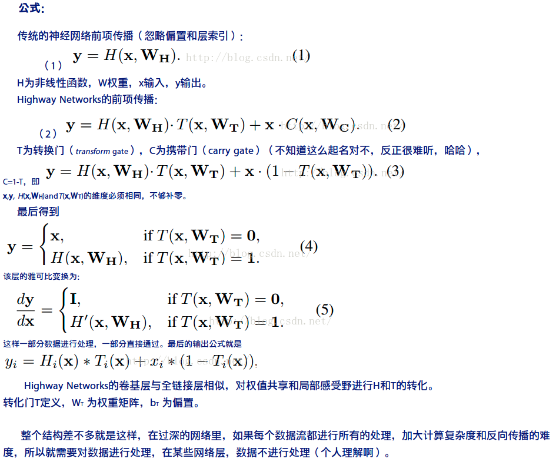

# SeNet(2017)

* [SeNet(2017)](#senet2017)
  * [前言](#前言)
  * [概要](#概要)
  * [新意](#新意)
    * [SE块](#se块)
  * [构思](#构思)
    * [最近的工作](#最近的工作)
      * [深层架构](#深层架构)
      * [注意力和门机制](#注意力和门机制)
    * [我们的工作](#我们的工作)
      * [Squeeze:全局信息嵌入($F_{sq}$)](#squeeze全局信息嵌入f_sq)
      * [Excitation:自适应重新校正($F_{ex}$)](#excitation自适应重新校正f_ex)
    * [分析讨论](#分析讨论)
      * [减少比率](#减少比率)
      * [激励的作用](#激励的作用)
  * [实践](#实践)
    * [应用的模型](#应用的模型)
    * [计算复杂度](#计算复杂度)
  * [训练](#训练)
  * [测试](#测试)
    * [ImageNet分类](#imagenet分类)
    * [非残差网络](#非残差网络)
      * [小结](#小结)
      * [ILSVRC 2017分类竞赛的结果](#ilsvrc-2017分类竞赛的结果)
    * [场景分类](#场景分类)

## 前言

2017年的ILSVRC競賽是由新加坡國立大學與奇虎360 合作的SeNet以2.3% top-5 error rate取得冠軍, 錯誤率較前兩年的ResNet減少了36%.

SeNet全稱是Squeeze-and-Excitation Networks, 它會依據loss function的學習來調整不同屬性的特徵權重, 讓有效的feature map權重加大, 無效或效果小的feature map權重變小, 使得模型訓練達到更好的結果. 這些動作SeNet稱為「feature re-calibration」, 包含了Squeeze → Excitation→ Scaling 這三個程序.

SeNet開發者巧妙的將這三個步驟包成一個程序稱為Squeeze-and-Excitation Block中, 讓SeNet能夠當作一種附加功能整合到其它的網路當中, 例如這次參與競賽的SeNet便是由ResNet的改進版ResNeXt加上Squeeze-and-Excitation Block的model. 如果您看到SE開頭的深度網路名稱, 例如SE-ResNet或SE-Inception, 便知道那是ResNet或GoogLeNet與SeNet整合的models.

> https://chtseng.wordpress.com/2017/11/20/ilsvrc-%E6%AD%B7%E5%B1%86%E7%9A%84%E6%B7%B1%E5%BA%A6%E5%AD%B8%E7%BF%92%E6%A8%A1%E5%9E%8B/

## 概要

卷积神经网络（CNNs）已被证明是解决各种视觉任务的有效模型[19,23,29,41]. 对于每个卷积层, 沿着输入通道学习一组滤波器来表达局部空间连接模式. 换句话说, **期望卷积滤波器通过融合空间信息和通道信息进行信息组合**, 然而受限于局部感受野.

通过叠加一系列非线性和下采样交织的卷积层, CNN能够捕获**具有全局感受野的分层模式**作为强大的图像描述.

最近的工作已经证明, 网络的性能可以通过**显式地嵌入学习机制**来改善, 这种学习机制有助于捕捉空间相关性而不需要额外的监督. Inception架构推广了一种这样的方法[14,39], 这表明网络可以通过在其模块中**嵌入多尺度处理来取得有竞争力的准确度**. 最近的工作在寻找更好地模拟空间依赖[1,27]并结合空间注意力[17].

与这些方法相反, 通过引入新的架构单元, 我们称之为*“Squeeze-and-Excitation”* (SE 挤压和激励)块, 我们研究了架构设计的一个不同方向——通道关系. 我们的**目标是通过显式地建模卷积特征通道之间的相互依赖性来提高网络的表示能力**.

为了达到这个目的, 我们提出了一种机制, 使网络能够执行*特征重新校准*, 通过这种机制可以学习使用全局信息来**选择性地强调信息特征并抑制不太有用的特征**.

最终, 提供了一些关于以前架构在建模通道特征依赖性上的局限性的洞察, 我们希望可能证明SENets对其它需要强判别性特征的任务是有用的.

最后, 由SE块引起的特征重要性可能有助于相关领域, 例如为了压缩的网络修剪.

## 新意

### SE块

SE构建块的基本结构如图1所示. 对于任何给定的变换$\mathbf{F}_{tr} : \mathbf{X} \rightarrow
\mathbf{U}$, $\mathbf{X} \in \mathbb{R}^{W’ \times H’ \times C’},
\mathbf{U} \in \mathbb{R}^{W \times H \times
C}$, (例如卷积或一组卷积), 我们可以构造一个相应的SE块来执行特征重新校准, 如下所示.

特征$\mathbf{U}$首先通过*squeeze*操作, 该操作跨越空间维度$W \times H$聚合特征映射来产生通道描述符. 这个描述符**嵌入了通道特征响应的全局分布, 使来自网络全局感受野的信息能够被其较低层利用**.

这之后是一个*excitation*操作, 其中通过基于通道依赖性的自我门控机制为每个通道学习特定采样的激活, 控制每个通道的激励. 然后特征映射$\mathbf{U}$被重新加权以生成SE块的输出, 然后可以将其直接输入到随后的层中.

A Squeeze-and-Excitation block

SE网络可以通过简单地堆叠SE构建块的集合来生成. SE块**也可以用作架构中任意深度的原始块的直接替换**.

然而, 虽然构建块的模板是通用的, 正如我们6.3节中展示的那样, 但它在不同深度的作用适应于网络的需求.

* 在前面的层中, 它学习以类不可知的方式激发信息特征, 增强共享的较低层表示的质量.
* 在后面的层中, SE块越来越专业化, 并以高度*类特定*的方式响应不同的输入. 因此, SE块进行特征重新校准的好处可以通过整个网络进行累积.

上面概述的SE块的设计是简单的, 并且可以直接与现有的最新架构一起使用, **其卷积层可以通过直接用对应的SE层来替换**从而进行加强.

> 也就是在实际的卷积之后,紧接一个压缩激励的流程.

另外, 如第四节所示, **SE块在计算上是轻量级的, 并且在模型复杂性和计算负担方面仅稍微增加**.

为了支持这些声明, 我们开发了一些SENets, 即SE-ResNet, SE-Inception, SE-ResNeXt和SE-Inception-ResNet, 并在ImageNet 2012数据集[30]上对SENets进行了广泛的评估. 此外, 为了证明SE块的一般适用性, 我们还呈现了ImageNet之外的结果, 表明**所提出的方法不受限于特定的数据集或任务**.

## 构思

### 最近的工作

#### 深层架构

大量的工作已经表明, 以易于学习深度特征的方式重构卷积神经网络的架构可以大大提高性能.

1. VGGNets[35]和Inception模型[39]证明了深度增加可以获得的好处, 明显超过了ILSVRC 2014之前的方法.

2. 批标准化(BN)[14]通过插入单元来调节层输入稳定学习过程, 改善了通过深度网络的梯度传播, 这使得可以用更深的深度进行进一步的实验.

3. He等人[9,10]表明, 通过重构架构来训练更深层次的网络是有效的, 通过使用基于恒等映射的跳跃连接来学习残差函数, 从而减少跨单元的信息流动.

4. 最近, 网络层间连接的重新表示[5,12]已被证明可以进一步改善深度网络的学习和表征属性.

5. 另一种研究方法探索了调整网络模块化组件功能形式的方法.

    * 可以用分组卷积来增加基数(一组变换的大小)[13,43]以学习更丰富的表示.
        > 分组卷积主要是基于对输入的不同通道进行独立的卷积
        >
        > [变形卷积核、可分离卷积？卷积神经网络中十大拍案叫绝的操作.  - 知乎](https://zhuanlan.zhihu.com/p/28749411)

        多分支卷积可以解释为这个概念的概括, 使得卷积算子可以更灵活的组合[14,38,39,40].

    * 跨通道相关性通常被映射为新的特征组合, 或者独立的空间结构[6,18], 或者联合使用标准卷积滤波器[22]和$1\times
        1$卷积, 然而大部分工作的目标是集中在**减少模型和计算复杂度**上面.

        这种方法反映了一个假设, 即**通道关系可以被表述为具有局部感受野的实例不可知的函数的组合**.

6. 相比之下, 我们声称为网络提供一种机制**来使用全局信息显式建模通道之间的动态、非线性依赖关系**, 可以减轻学习过程, 并且显著增强网络的表示能力.

#### 注意力和门机制

从广义上讲, 可以**将注意力视为一种工具, 将可用处理资源的分配偏向于输入信号的信息最丰富的组成部分. **

这种机制的发展和理解一直是神经科学社区的一个长期研究领域[15,16,28], 并且近年来作为一个强大补充, 已经引起了深度神经网络的极大兴趣[20,25]. 注意力已经被证明可以改善一系列任务的性能, 从图像的定位和理解[3,17]到基于序列的模型[2,24].

它通常结合门函数(例如softmax或sigmoid)和序列技术来实现[11,37].

最近的研究表明, 它适用于像图像标题[4,44]和口头阅读[7]等任务, 其中利用它来有效地汇集多模态数据. 在这些应用中, 它通常用在表示较高级别抽象的一个或多个层的顶部, 以用于模态之间的适应.

高速网络[36]采用门机制来调节快捷连接, 使得可以学习非常深的架构.

> Highway Networks：一种可学习的门限机制, 在此机制下, 一些信息流没有衰减的通过一些网络层, 适用于SGD法.
>
> https://blog.csdn.net/l494926429/article/details/51737883
>
> 

王等人[42]受到语义分割成功的启发, 引入了一个使用沙漏模块[27]的强大的trunk-and-mask注意力机制. 这个高容量的单元被插入到中间阶段之间的深度残差网络中. 相比之下, 我们提出的SE块是一个轻量级的门机制, **专门用于以计算有效的方式对通道关系进行建模, 并设计用于增强整个网络中模块的表示能力**.

### 我们的工作

*Squeeze-and-Excitation*块是一个计算单元, 可以为任何给定的变换构建：$\mathbf{F}_{tr}:
\mathbf{X} \rightarrow \mathbf{U}, \, \mathbf{X} \in \mathbb{R}^{W’
\times H’ \times C’}, \mathbf{U} \in \mathbb{R}^{W \times H \times
C}$.

为了简化说明, 在接下来的表示中, 我们将$\mathbf{F}_{tr}$看作一个标准的卷积算子. $\mathbf{V}= [\mathbf{v}_1, \mathbf{v}_2, \dots, \mathbf{v}_{C}]$ 表示学习到的一组滤波器核, $\mathbf{v}_c$指的是第$c$个滤波器的参数. 然后我们可以将$\mathbf{F}_{tr}$的输出写作$\mathbf{U}
= [\mathbf{u}_1, \mathbf{u}_2, \dots, \mathbf{u}_{C}]$, 其中$$\mathbf{u}_c
= \mathbf{v}_c \ast \mathbf{X} = \sum_{s=1}^{C’}\mathbf{v}^s_c \ast
\mathbf{x}^s.$$这里$\ast$表示卷积, $\mathbf{v}_c = [\mathbf{v}^1_c,
\mathbf{v}^2_c, \dots, \mathbf{v}^{C’}_c]$, $\mathbf{X} = [\mathbf{x}^1,
\mathbf{x}^2, \dots,
\mathbf{x}^{C’}]$(为了简洁表示, 忽略偏置项). 这里$\mathbf{v}^s_c$是$2$D空间核, 因此表示$\mathbf{v}_c$的一个**单通道**, 作用于对应的通道$\mathbf{X}$.

> $u_c$表示输出的第c通道的feature map. 由第c个卷积核与输入的数据各个通道对应卷积相加所得. 也就是整个感受空间的一个加权累和.
>
> $v_c$表示卷基层中学习到的第c个滤波器. $v_c^s$表示第c个滤波器的第s个通道的参数. 也就是所谓的2D空间核.
>
> $x^s$表示$X$的第s个通道对应的数据.

由于输出是通过所有通道的和来产生的, 所以通道依赖性被隐式地嵌入到$\mathbf{v}_c$中, 但是这些依赖性与滤波器捕获的空间相关性纠缠在一起. 我们的目标是确保能够提高网络对信息特征的敏感度, 以便后续转换可以利用这些功能, 并抑制不太有用的功能.

> SE的主要起始的想法

我们建议通过显式建模通道依赖性来实现这一点, 以便在进入下一个转换之前通过两步重新校准滤波器响应, 两步为：*squeeze*和*excitation*. SE构建块的图如下所示.

#### Squeeze:全局信息嵌入($F_{sq}$)

为了解决利用通道依赖性的问题, 我们首先考虑输出特征中每个通道的信号.

每个学习到的滤波器都对局部感受野进行操作, 因此变换输出$\mathbf{U}$的每个单元都无法利用该区域之外的上下文信息. 在网络较低的层次上其感受野尺寸很小, 这个问题变得更严重.

为了减轻这个问题, 我们提出将**全局空间信息*压缩*成一个通道描述符**.

这是通过使用**全局平均池化生成**通道统计实现的. 形式上, 统计$\mathbf{z} \in \mathbb{R}^{C}$是通过在空间维度$W \times H$上收缩$\mathbf{U}$生成的, 其中$\mathbf{z}$的第c个元素通过下式计算：$z_c = \mathbf{F}_{sq}(\mathbf{u}_c) = \frac{1}{W \times H}\sum_{i=1}^{W} \sum_{j=1}^{H} u_c(i,j)$

> 就是全局平均汇聚

*讨论. ***转换输出$\mathbf{U}$可以被解释为局部描述子的集合**, 这些描述子的统计信息对于整个图像来说是有表现力的. 特征工程工作中[31,34,45]普遍使用这些信息. 我们选择最简单的全局平均池化, 同时也可以采用更复杂的汇聚策略.

#### Excitation:自适应重新校正($F_{ex}$)

为了利用*压缩*操作中汇聚的信息, 我们接下来通过第二个操作来**全面捕获通道依赖性**. 为了实现这个目标, 这个功能必须符合两个标准：

* 第一, 它必须是灵活的(特别是它必须能够**学习通道之间的非线性交互**)；
* 第二, 它必须**学习一个非互斥的关系**(non-mutually-exclusive relationship ), 因为允许多个通道被强调, 相对于独热激活.

为了满足这些标准, 我们选择采用一个简单的门机制, 并使用sigmoid激活：$\mathbf{s} = \mathbf{F}_{ex}(\mathbf{z}, \mathbf{W}) = \sigma(g(\mathbf{z}, \mathbf{W})) = \sigma(\mathbf{W}_2\delta(\mathbf{W}_1\mathbf{z}))$

其中$\delta$是指ReLU[26]函数, $\mathbf{W}_1 \in \mathbb{R}^{\frac{C}{r} \times C}$和$\mathbf{W}_2 \in \mathbb{R}^{C \times \frac{C}{r}}$.

为了限制模型复杂度和辅助泛化, 我们通过在非线性周围形成两个全连接(FC)层的瓶颈来参数化门机制, 即降维层参数为$\mathbf{W}_1$, 降维比例为r($C\ ->\ \frac{C}{r}$)(我们把它设置为16, 这个参数选择在6.3节中讨论), 一个ReLU, 然后是一个参数为$\mathbf{W}_2$的升维层.

块的最终输出通过重新调节带有激活的变换输出$\mathbf{U}$得到：$\widetilde{\mathbf{x}}_c = \mathbf{F}_{scale}(\mathbf{u}_c, s_c) = s_c \cdot \mathbf{u}_c$

其中$\widetilde{\mathbf{X}} = [\widetilde{\mathbf{x}}_1, \widetilde{\mathbf{x}}_2, \dots, \widetilde{\mathbf{x}}_{C}]$和$\mathbf{F}_{scale}(\mathbf{u}_c, s_c)$指的是特征映射$\mathbf{u}_c \in \mathbb{R}^{W \times H}$和标量$s_c$之间的对应通道乘积.

*讨论. ***激活表现为适应特定输入描述符$\mathbf{z}$的通道权重**. 在这方面, SE块本质上引入了以输入为条件的动态特性, 有助于提高特征辨别力.

> :question:
>
> 这里描述的似乎有问题,应该是激活(s)表现为适应特定输入描述符u的通道权重吧?

### 分析讨论

#### 减少比率

公式中引入的减少比率r是一个重要的超参数, **它允许我们改变模型中SE块的容量和计算成本**.

为了研究这种关系, 我们基于SE-ResNet-50架构进行了一系列不同r值的实验.

这里`original`指的是ResNet-50.

表中的比较表明, **性能并没有随着容量的增加而单调上升**. 这可能是使SE块能够过度拟合训练集通道依赖性的结果.

尤其是我们发现设置r=16在精度和复杂度之间取得了很好的平衡, 因此我们将这个值用于所有的实验.

#### 激励的作用

虽然SE块从经验上显示出其可以改善网络性能, 但我们也想了解自我门控激励机制在实践中是如何运作的.

为了更清楚地描述SE块的行为, 我们研究SE-ResNet-50模型的样本激活, 并考察它们在不同块不同类别下的分布情况. 具体而言, 我们从ImageNet数据集中抽取了四个类, 这些类表现出语义和外观多样性, 即金鱼, 哈巴狗, 刨和悬崖.

然后, 我们从验证集中为每个类抽取50个样本, 并计算每个阶段最后的SE块中50个均匀采样通道的平均激活(紧接在下采样之前), 并在图中绘制它们的分布. 作为参考, 我们也绘制所有1000个类的平均激活分布.

SE-ResNet-50不同模块在ImageNet上由*Excitation*引起的激活. 模块名为*“SE stageID blockID”*

我们对SENets中*Excitation*的作用提出以下三点看法.

* 首先, 不同类别的分布在较低层中几乎相同, 例如, SE_2_3. 这表明在网络的最初阶段特征通道的重要性很可能由不同的类别共享.

* 然而有趣的是, 第二个观察结果是在更大的深度, 每个通道的值变得更具类别特定性, 因为不同类别对特征的判别性值具有不同的偏好.

* SE_4_6和SE_5_1. 这两个观察结果与以前的研究结果一致[21,46], 即**低层特征通常更普遍(即分类中不可知的类别), 而高层特征具有更高的特异性**. 因此, **表示学习从SE块引起的重新校准中受益, 其自适应地促进特征提取和专业化到所需要的程度**.

* 最后, 我们在网络的最后阶段观察到一个有些不同的现象. SE_5_2呈现出朝向饱和状态的有趣趋势, 其中大部分激活接近于1, 其余激活接近于0. **在所有激活值取1的点处, 该块将成为标准残差块**.

* 在网络的末端SE_5_3中(在分类器之前紧接着是全局池化), 类似的模式出现在不同的类别上, 尺度上只有轻微的变化(可以通过分类器来调整). 这表明, **SE_5_2和SE_5_3在为网络提供重新校准方面比前面的块更不重要**.

    这一发现与第四节实证研究的结果是一致的, 这表明, **通过删除最后一个阶段的SE块, 总体参数数量可以显著减少, 性能只有一点损失**(<0.1\%的`top-1`错误率).

## 实践

### 应用的模型

SE块的灵活性意味着它可以直接应用于标准卷积之外的变换. 为了说明这一点, 我们通过将SE块集成到两个流行的网络架构系列Inception和ResNet中来开发SENets.

1. 通过**将变换$\mathbf{F}_{tr}$看作一个整体的Inception模块**(参见图2), 为Inception网络构建SE块.

    通过对架构中的每个模块进行更改, 我们构建了一个*SE-Inception*网络.

    

2. 残留网络及其变种已经证明在学习深度表示方面非常有效.

    我们开发了一系列的SE块, 分别与ResNet[9], ResNeXt[43]和Inception-ResNet[38]集成. 图3描述了SE-ResNet模块的架构. 在这里, **SE块变换$\mathbf{F}_{tr}$被认为是残差模块的非恒等分支**. *压缩*和*激励*都在恒等分支相加之前起作用.

    

### 计算复杂度

(左)ResNet-50, (中)SE-ResNet-50, (右)具有$32\times 4d$模板的SE-ResNeXt-50. 在括号内列出了残差构建块特定参数设置的形状和操作, 并且在外部呈现了一个阶段中堆叠块的数量. *fc*后面的内括号表示SE模块中两个全连接层的输出维度.

在实践中提出的SE块是可行的, 它必须提供可接受的模型复杂度和计算开销, 这对于可伸缩性是重要的. 为了说明模块的成本, 作为例子我们比较了ResNet-50和SE-ResNet-50, 其中SE-ResNet-50的精确度明显优于ResNet-50, 接近更深的ResNet-101网络(如表2所示). 对于$224\times 224$像素的输入图像, ResNet-50单次前向传播需要$\sim 3.86$ GFLOP.

> [FLOPS](https://baike.baidu.com/item/FLOPS/989494)是**F**l**oating-point **O**perations **P**er **S**econd每秒所执行的[浮点运算](https://baike.baidu.com/item/%E6%B5%AE%E7%82%B9%E8%BF%90%E7%AE%97)次数的英文缩写. 它是一个衡量计算机计算能力的量, 这个量经常使用在那些需要大量浮点运算的科学运算中. 有时也会被记为[flop](https://baike.baidu.com/item/flop/3412284)/s.
>
> GFLOPS 就是 **G**iga **Fl**oating-point **O**perations **P**er **S**econd,即每秒10亿次的浮点运算数,常作为GPU性能参数但不一定代表GPU的实际表现, 因为还要考虑具体如何拆分多边形和像素、以及纹理填充, 理论上该数值越高越好. 1GFlops = 1,000MFlops.

每个SE块利用*压缩*阶段的全局平均池化操作和*激励*阶段中的两个小的全连接层, 接下来是廉价的通道缩放操作. 总的来说, SE-ResNet-50需要$\sim 3.87$ GFLOP, 相对于原始的ResNet-50只相对增加了$0.26\%$.

ImageNet验证集上的单裁剪图像错误率(％)和复杂度比较. `original`列是指原始论文中报告的结果. 为了进行公平比较, 我们重新训练了基准模型, 并在`re-implementation`列中报告分数. `SENet`列是指已添加SE块后对应的架构. 括号内的数字表示与重新实现的基准数据相比的性能改善. †表示该模型已经在验证集的非黑名单子集上进行了评估(在[38]中有更详细的讨论), 这可能稍微改善结果.

在实践中, 训练的批数据大小为256张图像, ResNet-50的一次前向传播和反向传播花费190ms, 而SE-ResNet-50则花费209 ms(两个时间都在具有8个NVIDIA Titan X GPU的服务器上执行). 我们认为这是一个合理的开销, 因为在现有的GPU库中, 全局池化和小型内积操作的优化程度较低. 此外, 由于其对嵌入式设备应用的重要性, 我们还对每个模型的CPU推断时间进行了基准测试：对于$224\times 224$像素的输入图像, ResNet-50花费了164ms, 相比之下, SE-ResNet-50花费了167ms. SE块所需的小的额外计算开销对于其对模型性能的贡献来说是合理的(在第6节中详细讨论).

接下来, 我们考虑所提出的块引入的附加参数. 所有附加参数都包含在门机制的两个全连接层中, 构成网络总容量的一小部分. 更确切地说, 引入的附加参数的数量由下式给出：$\frac{2}{r} \sum_{s=1}^S N_s \cdot {C_s}^2$

> 引入附加参数的部分也就是两个全连接层. $2C^2/r$(这里的每个全连接层都有$C(入) \times C(出) r$个参数), 共有N个块

其中r表示减少比率(我们在所有的实验中将r设置为16), S指的是阶段数量(每个阶段是指在共同的空间维度的特征映射上运行的块的集合), $C_s$表示阶段s的输出通道的维度, $N_s$表示重复的块编号.

总的来说, SE-ResNet-50在ResNet-50所要求的$\sim2500$万参数之外引入了$\sim250$万附加参数, 相对增加了$\sim 10\%$的参数总数量. 这些附加参数中的大部分来自于网络的最后阶段, 其中激励在最大的通道维度上执行.

然而, 我们发现在性能的边际成本(ImageNet数据集上$<0.1 \%$的top-1错误率)上, SE块相对昂贵的最终阶段可以被移除,  来将相对参数增加减少到$\sim 4\%$, 这在参数使用是关键考虑的情况下可能证明是有用的.

## 训练

1. 使用随机大小裁剪[39]到$224\times 224$像素($299\times 299$用于Inception-ResNet-v2[38]和SE-Inception-ResNet-v2)
2. 随机的水平翻转
3. 输入图像通过通道减去均值进行归一化
4. 采用[32]中描述的数据均衡策略进行小批量采样, 以补偿类别的不均匀分布
5. 网络在我们的分布式学习系统“ROCS”上进行训练
6. 使用同步SGD进行优化, 动量为0.9, 小批量数据的大小为1024(在4个服务器的每个GPU上分成32张图像的子批次, 每个服务器包含8个GPU)
7. 初始学习率设为0.6
8. 每30个迭代周期减少10倍
9. 使用[8]中描述的权重初始化策略
10. 所有模型都从零开始训练100个迭代周期

## 测试

在这一部分, 我们在ImageNet 2012数据集上进行了大量的实验[30], 其目的是：

* 首先探索提出的SE块对不同深度基础网络的影响；
* 其次, 调查它与最先进的网络架构集成后的能力, 旨在公平比较SENets和非SENets, 而不是推动性能.

### ImageNet分类

残差型网络

我们在训练集上训练网络, 并在验证集上**使用中心裁剪图像**评估来报告`top-1`和`top-5`错误率, 每张图像短边首先归一化为256, 然后从每张图像中裁剪出$224\times 224$个像素, (对于Inception-ResNet-v2和SE-Inception-ResNet-v2, 每幅图像的短边首先归一化到352, 然后裁剪出$299\times 299$个像素).

**网络深度. **结果表明**SE块在不同深度上的网络上计算复杂度极小增加, 始终提高性能**.

**虽然应该注意SE块本身增加了深度, 但是它们的计算效率极高, 即使在扩展的基础架构的深度达到收益递减的点上也能产生良好的回报. **

而且, 我们看到通过对各种不同深度的训练, 性能改进是一致的, 这表明**SE块引起的改进可以与增加基础架构更多深度结合使用**.

Inception架构将卷积模块构造为分解滤波器的多分支组合, 反映了*Inception假设*[6], **可以独立映射空间相关性和跨通道相关性**. 相比之下, ResNeXt架构断言, 可以通过聚合稀疏连接(在通道维度中)卷积特征的组合来获得更丰富的表示.

两种方法都在模块中引入了先前结构化的相关性. 我们构造了这些网络的SENet等价结构.

表中给出的结果说明在**将SE块引入到两种架构中会引起显著的性能改善**. 在整个训练过程中SE块产生了一致的改进.

### 非残差网络

最后, 我们通过对BN-Inception架构[14]进行实验来评估SE块在非残差网络上的效果, 该架构在较低的模型复杂度下提供了良好的性能.

#### 小结

这些实验表明SE块引起的改进可以与多种架构结合使用. 而且, 这个结果适用于残差和非残差基础.

#### ILSVRC 2017分类竞赛的结果

在表中我们将提出的架构与最新的模型在ImageNet验证集上进行了比较.

SENets是我们在挑战中赢得第一名的基础. 我们的获胜输入由一小群SENets组成, 它们采用标准的多尺度和多裁剪图像融合策略. 我们的高性能网络之一是将SE块与修改后的ResNeXt[43]集成在一起构建的.

### 场景分类

为了在更多不同的场景下评估我们提出的模型, 我们还在Places365-Challenge数据集[48]上对场景分类进行评估. 该数据集包含800万张训练图像和365个类别的36500张验证图像.

**相对于分类, 场景理解的任务可以更好地评估模型泛化和处理抽象的能力, 因为它需要捕获更复杂的数据关联以及对更大程度外观变化的鲁棒性. **

我们使用ResNet-152作为强大的基线来评估SE块的有效性, 并遵循[ L. Shen, Z. Lin, G. Sun, and J. Hu. Places401 and places365 models. <https://github.com/lishen-shirley/> Places2-CNNs, 2016.]中的评估协议.

证明了SE块可以在不同的数据集上表现良好. 这个SENet超过了先前的最先进的模型Places-365-CNN [33].
