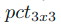

# SqueezeNet(2017)

翻译参考: https://zhuanlan.zhihu.com/p/35506370

论文参考: https://arxiv.org/abs/1602.07360

## 架构

> 我们在本文的主要目标是确定具有很少参数却同时保持有竞争性的精度的CNN架构. 为了实现这一点, 我们在设计CNN架构时采用了**三个主要策略**：
>
> **策略1** 用1x1过滤器代替3x3过滤器.
>
> 给定卷积滤波器的数量的预算, 我们使这些滤波器中的大多数为1x1, 因为1x1滤波器比3x3滤波器少9倍的参数.
>
> **策略2** 减少输入到3x3过滤器的通道的数量.
>
> 一个完全由3x3滤波器组成的卷积层, 该层的参数总量为：（输入通道的数量）∗（滤波器的数量）∗（3 * 3）.  因此, 为了维持CNN的参数总数是少量的, 不仅要减少3×3滤波器的数量（见上面的策略1）, 而且要减少3×3滤波器的输入通道数. 我们使用挤压层将输入到3x3个过滤器的通道数量减少.
>
> **策略3** 在网络后期下采样, 使得卷积层具有大的激活图.
>
> 卷积网络的每一层都会输出一个激活图, 它的分辨率最少是1X1, 而更多时候是大于1X1 . 激活图的高度和宽度由以下因素控制：
>
> * 输入数据的大小(例如256X256)
> * 在CNN架构的哪些层进行下采样的选择
>
> 最常见的做法是, 通过在一些卷积或池化层中设置(stride > 1), 将下采样应用到CNN架构(例如(Szegedy等人, 2014；Simonyan＆Zisserman, 2014；Krizhevsky等人, 2012)). 如果在网络的早期的那些层使用较大的步幅, 那么大部分的层的激活图都会较小. 相反, 如果大部分的层的步幅都是1, 而步幅大于1的层都集中在末端, 那么网络中大部分的层都会有大的激活图. 我们的直觉是, **在其他的因素不变的情况下, 大的激活图(由于延迟下采样)会产生更高的分类精度**(He＆Sun, 2015).
>
> 策略1和2都是关于**如何保持准确性的同时减少CNN的参数量**. 策略3是关于**在有限的参数量预算上最大化精度**.
>
> 我们的**Fire模块**是我们的CNN架构的构建块, 使我们能够成功地应用战略1,2和3.

### AlexNet

### SqueezeNet

主要有三种SqueezeNet模型.

* SqueezeNet是以一个独立的卷积层(conv1)为开端, 跟着是8个fire模块(fire2-9), 最后以一个最终的卷积层(conv10)结束.

* 从网络的开始到结束逐渐增加每个fire模块的过滤器数量.
* SqueezeNet在层conv1, fire4, fire8之后使用步长为2的max-pooling, 在conv10后使用了全局平均池化
* 这些相对较后的pooling安排是根据构建策略3.

我们在下表给出了完整的SqueezeNet架构.

> SqueezeNet架构尺寸.  (这张表的格式受到Inception2论文(Ioffe＆Szegedy, 2015)的启发)
>
> 在评估SqueezeNet时, 我们用AlexNet和与之相关的模型压缩结果作为比较的基础.

1. 为了使扩展模块的1x1和3x3滤波器的输出激活具有相同的高度和宽度, 我们对输入到扩展模块的3x3滤波器的数据进行添加零填充的1个像素的边界.
2. ReLU(Nair＆Hinton, 2010)被应用于挤压层和扩展层的激活.
3. 在fire9模块之后使用比率为50％的dropout(Srivastava等人, 2014).
4. 注意SqueezeNet没有全连接层; 这个设计选择是受到NiN启发.
5. 当训练SqueezeNet的时候, 从0.04的学习率开始, 然后在训练过程中线性地减少学习率, 如(Mishkin et al. 2016)所述.
6. Caffe框架本身并不支持**包含多个滤波器分辨率的卷积层**(例如1x1和3x3)(Jia等人, 2014). 为了解决这个问题, 我们的**扩展层由两个独立的卷积层实现：**一个是滤波器为1x1的层和一个滤波器为3x3的层. 然后, 我们**在通道维中将这些层的输出连接在一起**. 这在数值上等同于实现一个包含1x1和3x3滤波器的层.

### Fire module

> 微结构视图：在Fire模块中组织卷积过滤器.
>
> 在这个例子中, $s_{1\times1} = 3, e_{1\times1} = 4, e_{3\times3} = 4$.
>
> 我们这里展示的是卷积滤波器不是激活.

我们对Fire模块定义如下.

* 包括挤压卷积层(它仅有1x1滤波器)

* 包括扩展层——挤压层被输入到该层, 由**1x1和3x3卷积滤波器的混合组合**而成

    > 这里的扩展层是包含不同类型滤波器的卷积层

* 在fire模块中自由使用1x1过滤器是**构建策略1**的一个应用.

* 我们在Fire模块中公开了三个可调整维度(超参数)：, 和 .

    *  是挤压层(所有1x1)的滤波器数量
    *  是扩展层中1x1滤波器的数量
    *  是扩展层中的3x3滤波器的数量.

    我们将$s_{1\times1}$设置为小于(  +  ), 挤压层有助于限制3x3过滤器的输入通道数, 如**构造策略2**所述.

## 结构效果

在评估SqueezeNet时, 我们用AlexNet和与之相关的模型压缩结果作为比较的基础.

> 比较SqueezeNet和模型压缩方法.
>
> 这里的模型大小是指在**训练模型中存储所有参数所需的字节数**.

* 基于SVD的方法能把预训练的AlexNet模型压缩5倍, 但top-1精度降低到56.0％(Denton等人, 2014).

* 使用网络修剪方法, 实现模型减少9倍, 同时在ImageNet上保持了57.2％的top-1和80.3％的top-5精度的基准(Han 等人, 2015b).
* 深度压缩使模型尺寸减小35倍, 同时仍然保持基准的精度水平(Han 等人, 2015a).
* 与AlexNet相比, SqueezeNet实现了模型尺寸减少50倍, 同时达到甚至超过AlexNet的top-1和top-5精度.

这样看来, 我们已经超过了模型压缩社区的最先进的结果：即使使用未压缩的32位值表示模型, 在保持或超过基准精度下, SqueeezeNet的模型大小仍比模型压缩社区的最好结果小1.4倍.

---

直到现在, 一个尚未解决的问题是：是小模型适合被压缩, 还是小模型“需要”密集浮点值才能提供强大的表示能力？(are small models amenable to compression, or do small models “need” all of the representational power afforded by dense floating-point values?)

为寻找这个问题的答案, 我们应用深度压缩(Han等, 2015a), 33％稀疏度和8位量化, 对SqueezeNet进行压缩.

这产生了与AlexNet精度相当的0.66MB模型(比32位AlexNet小363倍). 此外, 在SqueezeNet上应用设置为6位和33％稀疏性的深度压缩, 我们生成具有同等精度的0.47MB模型(比32位AlexNet小510倍). 我们的小模型确实适合压缩.

---

此外, 这些结果表明, 深度压缩(Han等人, 2015a)不仅在具有大参数量(例如AlexNet和VGG)的CNN架构上表现良好, 而且还**能够压缩已经压缩过的, 全卷积的SqueezeNet架构**. 深度压缩将SqueezeNet压缩10倍, 而且同时保持精度基准.

总言之：通过将创新的CNN架构(SqueezeNet)与最先进的压缩技术(深度压缩)相结合, 我们实现了模型尺寸减少510倍, 而且与基准相比精度并没有降低.

最后, 注意到深度压缩(Han等人, 2015b)架构使用codebook把CNN参数量化成6位或8位精度.

> https://zh.wikipedia.org/zh-cn/%E7%B7%A8%E7%A2%BC%E7%B0%BF
>
> codebook 编码簿
>
> (自我感觉有点类似于一个编码后的表, 如同索引图像的那个颜色索引表)

因此, 在大多数商用处理器上, 使用深度压缩方案实现具有8位量化的32/8 = 4x或使用6位量化的32/6 = 5.3x的加速并不是没有价值的.  然而, Han等人开发的定制硬件 - 高效推理机(EIE) - 可以更有效地用cookbook量化的CNN(Han等人, 2016a).

此外, 在我们发布SqueezeNet的几个月后, P. Gysel开发了一种称为Ristretto的策略, 将SqueezeNet线性量化为8位(Gysel, 2016). 具体的说, Ristretto确实用8位进行计算, 并以8位数据类型存储参数和激活. 在使用Ristretto的8位计算策略进行SqueezeNet推理过程中, Gysel发现当使用8位而非32位数据类型时, 精度下降小于1个百分点.

## 论文动机

### 概述

最近对深度卷积神经网络(CNNs)的研究**主要集中在提高精度上**.

对于给定的准确度水平, 通常存在多个实现该准确度水平的CNN架构. 给定等效精度, 具有较少参数的CNN架构具有若干优点:

* **更高效的分布式训练**.

    *服务器间的通信是分布式CNN训练的可扩展性的制约因素*. 对于分布式的数据并行训练, 通信开销与模型中的参数数量成正比(Iandola等, 2016). 简言之, *小模型需要较少的通信所以训练得更快. *

* **传输模型到客户端的耗费较少**.

    对于自动驾驶, 有些公司, 例如特斯拉公司, 会定期将新模型从服务器复制到客户的汽车, 这种做法通常被称作空中(OTA)升级.  消费者报告指出特斯拉Autopilot的半自动驾驶功能的安全性随着近期的空中升级(消费者报告, 2016)而逐渐增强. 然而现今典型的CNN/DNN模型的空中升级需要大量的数据传输. 例如更新AlexNet模型, 需要从服务器传输240MB的通信量到汽车. *较小的模型需要的通信更少, 这样使得频繁的更新变得更可行. *

* **可行的FPGA和嵌入式部署**.

    FPGA通常仅有小于10MB的片上存储器而且没有片外存储器. 当FPGA实时地处理视频流时, 一个足够小的模型能直接存放在FPGA上, 而不会让存储带宽成为它的瓶颈(Qiu等, 2016). 当在专用集成电路(ASIC)上部署CNN时, 一个足够小的模型可以直接存储在芯片上, 并使ASIC有可能配得上更小的管芯.

为了提供所有这些优势, 我们提出了一个名为SqueezeNet的小型CNN架构. SqueezeNet在ImageNet上实现了AlexNet级别的精度, 参数减少了50倍. 另外, 使用**模型压缩技术**, 我们可以将SqueezeNet压缩到小于0.5MB(比AlexNet小510倍).

### 相关的工作

我们工作的首要目标是**确定一个具有少量参数却同时能保持相当精度的模型**.

为了解决这个问题, 一种明智的方法是**以有损的方式去压缩一个现有的CNN模型**. 实际上, 已经出现了一个关于模型压缩的研究社区, 并且也已经提出了一些方法.

#### 模型压缩

> 关于模型压缩技术, 这里有篇总结性的文章:
>
> https://arxiv.org/abs/1710.09282
>
> 有机器之心的一个简要翻译总结:
>
> https://www.jiqizhixin.com/articles/2017-10-29

- Denton等人的一个很直接的方法是把应用奇异值分解(SVD)(Denton等人, 2014)应用在预训练好的CNN模型.
- Han等人提出了网络修剪, 该算法从预训练模型开始, 然后把**低于某个阈值的参数替换为零**, 形成了稀疏矩阵, 最后对稀疏的CNN模型做几次迭代训练(Han等人, 2015b).
- Han等人近期扩展了他们的工作, 通过将量化(到8位或更少)和huffman编码结合到网络修剪, 创造了一种叫做**深度压缩 Deep Compression**的方法(Han等人, 2015a), 并进一步设计了叫做EIE的硬件加速器(Han等人, 2016a ), 该加速器直接作用在压缩过的模型上, 获得了大幅度的加速和节能.

#### CNN MICROARCHITECTURE

我们使用术语CNN微结构来**指代各个模块的特定的组织和尺寸**.

在神经网络, 卷积滤波器通常是3D的, 它有作为关键维度的高度, 宽度和通道.

当应用在图像时, CNN滤波器的第一层通常有3个通道(例如RGB), 并且在其后的每一层Li, Li层滤波器的通道数目与Li-1层的滤波器的数量相同.

随着设计非常深的CNN的趋势, 手动选择每层的滤波器尺寸变得麻烦. 为了解决这个问题, 已经出现了各种更高级别的构建块或模块, 他们由具有特殊的固定组织的多个卷积层构成.

例如, GoogLeNet论文提出了Inception模块, 该模块的滤波器包括多个不同尺寸, 通常有1x1和3x3, 再加上有时是5x5(Szegedy等人, 2014), 有时是1x3和3x1(Szegedy等人, 2015). 多个这样的模块, 可能再加上ad-hoc层, 组合起来, 形成完整的网络.

> ad hoc layer是什么?

#### CNN MACROARCHITECTURE

我们将CNN宏结构定义由**多个模块的系统级组织形成的端到端CNN架构**.

也许在最近的文献中, 最广泛研究的CNN宏架构的主题是*网络中的深度(也就是层数)*的影响.

* Simoyan和Zisserman提出了具有12到19层的的VGG(Simonyan＆Zisserman, 2014), 并指出更深的网络在ImageNet-1k数据集上产生更高的精度(Deng等人, 2009)
* K.He等人提出了具有多达30层的更深的CNN, 获得更高的ImageNet精度(He等人2015a)

*跨越多个层或模块的连接*的设计选择是CNN宏架构研究的新兴领域.

* 残差网络(ResNet)(He等人2015b)和Highway Networks(Srivastava等人2015)分别提出了使用跨越多层的连接, 例如将第3层的激活和第6层的激活相加连接起来, 我们将这些连接称为旁路连接

#### NEURAL NETWORK DESIGN SPACE EXPLORATION

神经网络(包括深度和卷积神经网络)拥有具大的设计空间, 微架构, 宏架构, 解算器和其它超参数的选择可以有很多个.

似乎自然而然人们会希望获得关于**这些因素如何影响神经网络的准确性(例如设计空间的形状)**的直观认识.

**自动化设计**

神经网络的设计空间探索(DSE)的大部分工作集中在设计一些自动化方法来寻找具有更高精度的神经网络架构.

这些自动化DSE方法包括贝叶斯优化(Snoek等人, 2012), 模拟退火(Ludermir等人, 2006), 随机搜索(Bergstra＆Bengio, 2012)和遗传算法(Stanley和Miikkulainen, 2002).

这些论文各自都提出了一种情况, 每篇论文所提出的DSE方法均生成了一个神经网络架构, 每个架构与代表性的基准相比精度都更高. 然而, 这些论文**没有提供关于神经网络设计空间的形状的直观体现**.

我们避开了自动化方法, 相反, 我们重构CNN, 进行有原则的A/B比较, 以研究CNN架构决策如何影响模型的大小和准确性.

> A/B比较, 我倒是找到了个A/B测试, 感觉意思应该有相同的地方.
>
> https://36kr.com/p/5138076.html
>
> A/B测试目的是选取一个最好的方案. 它一般会为同一个目标制定两个方案A/B, 分别让两组近似的用户群使用方案A和方案B, 经过一定的测试时间, 根据收集到的两方案样本的观测数据, 根据显著性检验结果选取一个最好的方案.

## 结构探索

### 微结构设计空间探索

到目前为止, 我们已经提出了小型模型结构设计策略, 并遵循这些理论, 创建了SqueezeNet, SqueezeNet比AlexNet小50倍却具有与之同等的精度. 然而, SqueezeNet和其他模型**仍然是一个广泛并且大部分设计空间未被开发的CNN架构**.

在前面, 我们探讨关于设计空间的几个方面. 我们将架构探索分为两个主题：微架构探索(每个模块层的维度和配置)和宏架构探索(由模块和其他层构成的高级的端到端组织).

以开头提出的设计策略为指引, 以提供关于微结构设计空间的形状的直观认知为目的, 我们在本节里设计并执行实验,  注意, 在**这里我们的目标不是最大化每个实验的准确性, 而是理解CNN架构选择对模型大小和精度的影响**.

#### 微结构元参数

SqueezeNet的每个fire模块都有我们定义的三维超参数：, 和. SqueezeNet有8个fire模块, 共24维超参数. 为了对SqueezeNet类的架构的设计空间进行探讨, 我们定义了以下一组更高级别的元参数, 用于控制CNN中所有fire模块的尺寸.

* 我们将 $base_{e}$定义为CNN的**第一个fire模块的扩展过滤器数**. 在每个$freq$ fire模块后, 我们增加  个扩展过滤器. 也就是说, 对于fire模块i, **扩展滤波器的数量**是 .

* 在fire模块的扩展层, 一些过滤器是1X1, 一些为3x3. 我们定义 .

    用来作为(范围[0, 1], 被所有fire模块共享)为3X3的**扩展过滤器的百分比**. 换句话说,  和.

* 最后, 我们使用称作**挤压比(SR)**(范围是[0, 1], 在所有Fire模块共享)的元参数, **定义fire模块挤压层中的过滤器数量**：  (或等价地  .

SqueezeNet是我们用上述的元参数集生成的示例体系结构.

具体地说, SqueezeNet有以下元参数： 

#### 挤压比

前面我们提出通过使用挤压层减少3X3滤波器的输入通道数, 从而减少参数量.

我们将挤压比(SR)定义为**挤压层的过滤器数量与扩展层的过滤器数量**之间的比率.

现在我们设计一个实验, 研究挤压比对模型的大小和精度的影响.

> 探索挤压比(SR)对模型尺寸和精度的影响.

在这些实验中, 我们使用前文给出的完整SqueezeNet结构作为起点.

跟在SqueezeNet中一样, 这些实验使用以下元参数：  .

我们训练多个模型, 每个模型有不同的挤压比, 挤压比的范围是[0.125, 1.0].

在上图中, 我们展示了这个实验的结果, 图上的每个点代表一个独立的模型, 这些模型都是从头开始训练的. SqueezeNet是这个图中*SR*=0.125的点.

* 当SR的增量超过0.125时, 可以使ImageNet的 top-5精确度大大提升, 从80.3％(即AlexNet级别) 到86.0％, 而模型大小从4.8MB增加到了19MB

* 当*SR*=0.75(19MB模型)时, 精度稳定在86.0％
* 设置*SR*=1.0, 即使进一步增加模型尺寸, 精度也没有提高

#### 权衡1X1和3X3滤波器

前文我们提议用1*X*1滤波器替换一些3*X*3滤波器来减少CNN的参数量.

一个尚未解决的问题是, **CNN过滤器的空间分辨率有多重要**？

VGG(Simonyan＆Zisserman, 2014)架构的大多数层的滤波器的分辨率是3×3的; 而GoogLeNet(Szegedy等人, 2014)和Network in Network(NiN)(Lin等人, 2013)的一些层中有1*X*1滤波器. 在GoogLeNet和NiN中, 作者只是单纯地提出使用一定数量的1*X*1和3*X*3的滤波器, 并没有进一步分析. 我们在这里**试图阐明1*X*1和3*X*3的滤波器占的比例是如何影响模型的大小和精度**.

> 探索扩展层中3x3过滤器比例(pct3x3)对模型大小和准确性的影响.

* 在本实验, 我们使用以下元参数：  , 我们将  从1％变化到99％. 换句话说, 每个Fire模块的扩展层的过滤器数量都是预定义好的, 而过滤器都是1*x*1或3*x*3的. 在这里我们将这些过滤器上的旋钮**从“大部分是1*X*1“转换到”大部分是3*X*3**.

* 与之前的实验一样, 这些模型有8个Fire模块, 跟前面的结构图所示, 有相同的层次组织结构. 我们显示了该实验的结果.  注意, 上一小节的图和本小节的图所示两个13MB模型有着相同的框架：*SR*=0.500和  =50%.
* 在图中可以看到, 使用比率为50％的3*X*3滤波器时, top-5精度稳定在85.6％, 进一步增加3*X*3滤波器所占的百分比会使模型尺寸变大, 但是在ImageNet上的精度并没有提高.

### 宏框架设计空间探索

我们在宏架构层面探讨Fire模块间的高级连接的设计决策. 受ResNet的启发(He等人, 2015b), 我们研究了三种不同的架构：

1. 简单纯粹的 SqueezeNet(如前面的章节所述).

2. 部分Fire模块间有简单旁路连接的squeezeNet.  (受(Srivastava等人, 2015; He等人, 2015b)的启发. )

3. 其余的Fire模块间建立了复杂旁路连接的squeezeNet.

我们在图中说明了SqueezeNet的这三个变体.

* 我们的简单旁路架构在fire模块3, 5, 7, 9间建立连接, 这些模块需要**学习一个关于输出和输入的残差方程**.

* 跟ResNet一样, 在Fire3建立旁路连接, 我们设置**Fire4的输入为(fire2的输出+fire3的输出)**, 前面式子的“+”号是**元素级相加**.

这些操作改变了Fire模块的参数的正规化, 根据ResNet, 能够提高最后的精确度, 或者改善整个模型的训练能力.

一个限制是, 有个简单明了的情况, **输入的通道数量和输出的通道数量必须相同**; 因此, 如中间图所示, 仅有一半的Fire模块可以有简单的旁路连接.

当不能满足“相同数量的通道”要求时, 我们使用复杂的旁路连接, 如右图. 简单的旁路是“仅有线”, 而复杂旁路则包含1x1卷积层, 该层的滤波器的数量等于所需的输出通道的数量.

> ResNet中也提到,为了保证输出通道数一直,要使用卷积来进行调整.
>
> > ResNet中提到:
> >
> > 如果不是这种情况(例如, 当更改输入/输出通道时), 我们可以通过快捷连接执行线性投影$W_s$来匹配维度：$y=F(x,W_i)+W_sx$.
> >
> > 尽管上述符号是关于全连接层的, 但它们同样适用于卷积层.
> >
> > 函数$F(x, W_i)$可以表示多个卷积层. 元素加法在两个特征图上**逐通道**进行.

值得注意的是, 复杂的旁路连接会给模型添加额外的参数, 而简单的旁路连接则不会.

除了改变正则化之外, 对我们来说直观的是, **添加旁路连接将有助于减轻挤压层引入的表示性瓶颈**.

SqueezeNet的挤压比(SR)为0.125, 意味着**每个挤压层比其相应的扩展层的输出通道少8倍**. 由于这种严重的维度减少, 可以通过挤压层的信息量有限. 然而, 通过在SqueezeNet的层间添加旁路连接, 我们开辟了让信息绕挤压层流动的途径.

我们按照图中的三个宏架构训练SqueezeNet, 而模型间的精度和模型大小比较在下表.

> 使用不同的宏架构配置的SqueezeNet的精度和模型大小

在探索宏架构时, 我们按照最前面的完整的SqueezeNet结构参数固定了微结构.

* 无论是添加了复杂的还是简单的旁路连接都比简单的SqueezeNet架构精度高.
* 有趣的是, 添加了简单的旁路的模型比复杂旁路的模型的精度更高.

* 添加了简单的旁路连接的模型在不增加模型尺寸的情况下, top-1精度增加了2.9个百分点, top-5精度提高了2.2个百分点.

## 结论

在本文中, 我们提出了一个更严谨的方法来**探索卷积神经网络的设计空间**.

为实现这个目标, 我们提出了SqueezeNet, 这个CNN架构的参数比AlexNet少50倍, 却在ImageNet上保持着AlexNet级别的精度. 我们还将SqueezeNet压缩到小于0.5MB, 也就是比没有压缩过的AlexNet小510倍.

我们在2016年以技术报告发表本文后, Song Han和他的同事尝试进一步研究SqueezeNet和模型压缩. 基于一种称为密集稀疏密度(DSD)的新方法(Han等人, 2016b), Han等人在训练时**使用模型压缩作为正则化器**, 进一步提高精度. 他们的研究生成了压缩的SqueezeNet参数集, 它们在ImageNet-1k上的精度提高了1.2个百分点, 他们还生成了未压缩的SqueezeNet参数集, 与我们在表2中的结果相比高4.3个百分点 .

我们在本文开头提到, 小模型更适合应用在FPGA上. 自从我们发布了SqueezeNet模型, Gschwend开发一些SqueezeNet的变种并在FPGA上实现了(Gschwend, 2016). 正如我们的预期, Gschwend能够将一个SqueezeNet类的模型的参数完全存储在FPGA中, 而无需用片外存储器加载模型参数.

在本文, 我们将ImageNet作为目标数据集.

在ImageNet上训练好的CNN模型用于日常的应用已成为常见的做法, 如细粒度物体识别(Zhang等人, 2013；Donahue等人, 2013), 图像中的标志识别(Iandola等人 , 2015), 给看图说话(Fang等人, 2015)等. 用ImageNet训练过的CNN也被应用于很多与自主驾驶有关的应用, 包括图像(Iandola等人, 2014; Girshick等人, 2015; Ashraf等人, 2016)和视频(Chen等, 2015b)的行人和车辆检测, 以及分割道路的形状(Badrinarayanan等, 2015). 我们认为对各个领域的应用而言, SqueezeNet是一个很好的选择, 特别是那些对模型的“小”很看重的应用领域.

SqueezeNet 是我们在探索CNN架构设计空间时发现的几个新的CNN之一. 我们希望SqueezeNet将激励读者以更系统的方式思考和探索CNN架构的设计空间的广泛的可能性.
