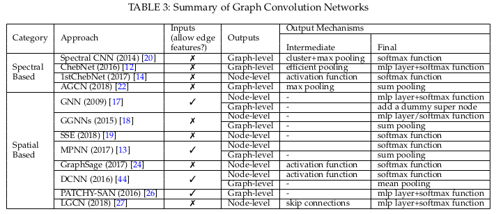
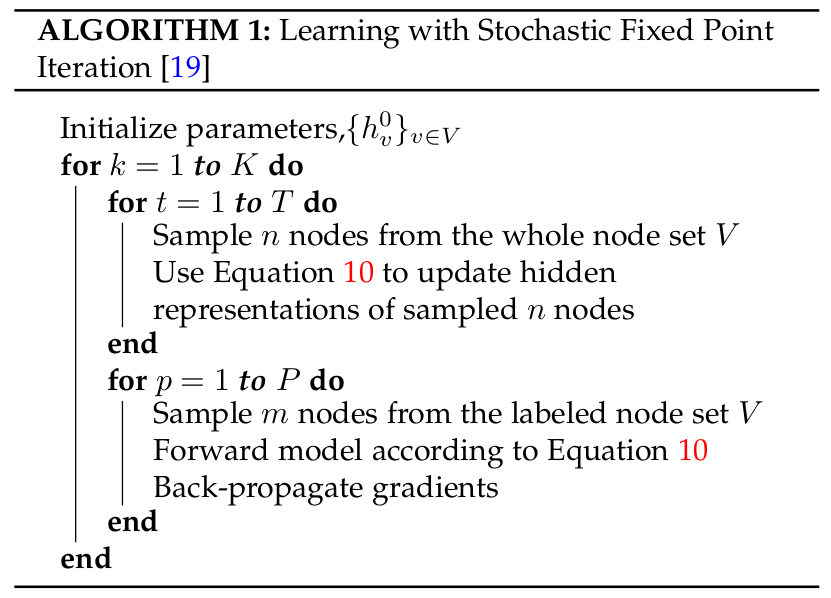
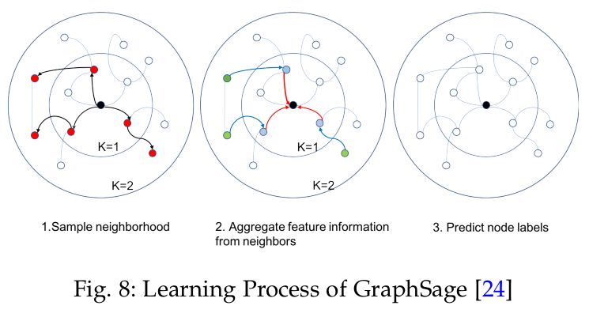

# 图神经网络小结

* [图神经网络小结](#图神经网络小结)
  * [图神经网络分类](#图神经网络分类)
  * [GCN: 由谱方法到空域方法](#gcn-由谱方法到空域方法)
  * [GCN概述](#gcn概述)
    * [GCN的输出机制](#gcn的输出机制)
    * [GCN的不同方法](#gcn的不同方法)
    * [基于谱方法的GCN](#基于谱方法的gcn)
      * [初始](#初始)
      * [切比雪夫K阶截断: ChebNet](#切比雪夫k阶截断-chebnet)
      * [一阶ChebNet](#一阶chebnet)
      * [自适应图卷积网络AGCN](#自适应图卷积网络agcn)
      * [谱方法小结](#谱方法小结)
    * [基于空域方法GCN](#基于空域方法gcn)
      * [基于递归的空间GCN(Recurrent-based Spatial GCNs)](#基于递归的空间gcnrecurrent-based-spatial-gcns)
        * [图神经网络GNN(特指早期的一种结构)](#图神经网络gnn特指早期的一种结构)
        * [门控图神经网络(GGNN)](#门控图神经网络ggnn)
        * [随机稳态嵌入SSE](#随机稳态嵌入sse)
      * [基于合成的空间GCN(Composition Based Spatial GCNs)](#基于合成的空间gcncomposition-based-spatial-gcns)
        * [消息传递神经网络(MPNN)](#消息传递神经网络mpnn)
        * [GraphSage](#graphsage)
      * [空域GCN的其他变体](#空域gcn的其他变体)
      * [空域方法小结](#空域方法小结)
    * [图池化模块](#图池化模块)
    * [谱方法与空域方法的比较](#谱方法与空域方法的比较)
  * [未来的方向](#未来的方向)
  * [一些新词](#一些新词)

简单的图的参数介绍: $\mathcal { G } = ( V , E , A )$

* V(N个)是节点集合, 只描述了存在的节点
* E是边集合, 只描述了存在的连接(边)
* A(NxN)是图的邻接矩阵, 描述了节点之间的连接关系, 当对应的边eij(连接vi,vj的边)存在的时候, 则对应的Aij = wij > 0, 若eij不存在, 则Aij = 0
* D(NxN)是图的度矩阵, 描述了节点自身连接的边的数目, 是对角矩阵, $D_{ii} = ( \sum A_i)$
* X(NxF)是节点属性矩阵, 每个节点对应拥有一个长为F的属性向量, 图可以用节点属性来关联
* L(NxN)是图的拉普拉斯矩阵, 归一化的拉普拉斯矩阵是图的一个鲁棒的数学表示. $L=D-A, L_n=I_n-D^{-1/2}AD^{-1/2}$, 归一化图拉普拉斯矩阵具有实对称半正定的性质, 也就是可以进行特征分解得到特征值和特征向量.

## 图神经网络分类

图网络有很多结构, 这里按照最新的综述论文 *A Comprehensive Survey on Graph Neural Networks* 文中的分类方式, 主要分为:

* graph convolution networks
* graph attention networks
* graph auto-encoders
* graph generative networks
* graph spatial-temporal networks

这里主要介绍图卷积网络GCN. 因为GCN在捕获结构化依赖上扮演着中心角色.

## GCN: 由谱方法到空域方法

Inspired by the huge success of convolutional networks in the computer vision domain, a large number of methods that re-define the notation of convolutionfor graph data have emerged recently.

These approaches are under the umbrella of  graph  convolutional  networks  (GCNs). The  first  prominent research on GCNs is presented in Bruna et al. (2013), which  develops a variant  of  graph  convolution  based  on spectral graph theory [20]. Since that time, there have been increasing  improvements,  extensions,  and  approximations on  **spectral-based  graph  convolutional  networks**  [12],  [14],[21],  [22],  [23].

As  spectral  methods  usually  handle  the whole  graph  simultaneously  and  are  difficult  to  parallel or scale to large graphs, **spatial-based graph convolutional networks**  have  rapidly  developed  recently  [24],  [25],  [26],[27]. These methods directly *perform the convolution in the graph domain by aggregating the neighbor nodes' information*. Together with sampling strategies, the computation can be performed in a batch of nodes instead of the whole graph[24], [27], which has the potential to improve the efficiency.

## GCN概述

将应用于传统数据的卷积操作, 泛化到了图数据上面. 关键是学习一个函数f, 来通过集成自己和邻居的特征生成节点的表示. GCN在构建其他复杂的图神经网络的任务上, 扮演着重要的角色. 包括auto-encoder-based models, generative models, spatial-temporal networks等.

对于GCN而言, 在集成邻居的过程的时候, 使用的权重是无参数的, 而GAN(图注意力网络)使用了一个端到端神经网络架构捕获的权重, 来使得更重要的节点拥有更大的权重.(这里更多的是表述空域的GCN)

对于图卷积网络, 其实是在*尝试通过图谱理论或者局部空间来定义图卷积*的方式来在图数据上复制CNN的成功.

### GCN的输出机制

使用图结构和节点内容信息作为输入, GCN的输出使用以下不同的机制, 可以关注于不同的图分析任务.

1. 节点级输出与节点回归和分类任务相关. 图卷积模块直接给出节点潜在的表达, 多层感知机或者softmax层被用作最终的GCN层.
2. 边级输出与边分类和连接预测任务相关. 为了预测边的标记和连接强度, 一个附加函数将会把来自图卷积模块的两个节点的潜在表达作为输入.
3. 图级输出与图分类任务有关. 为了获取一个图级的紧凑表达, 池化模块被用来粗化图到子图, 或用来加和/平均节点表达.

这里有一个总结的表, 总结了主要方法的情况:

对于图卷积网络, 是可以通过半监督/全监督/无监督的方式进行端到端训练的, 注意取决于学习任务和标签信息的获取.

### GCN的不同方法

* 谱方法通过从图信号处理的视角引入滤波器来定义图卷积, 这里图卷积操作被解释为移除图信号中的噪声
* 空域方法将图卷积表达为从邻域中集成特征信息的过程.
* 当GCN在节点等级上操作的时候, **图池化模块**, 可以超入到GCN层中, 来粗化图到高级的子图. 这样一个结构被用来提取图级表达和处理图分类任务.

### 基于谱方法的GCN

#### 初始

基于图信号处理的知识, 图上的卷积可以被定义为: $\mathbf { x } * _ { G } \mathbf { g } _ { \theta } = \mathbf { U } \mathbf { g } _ { \theta } \mathbf { U } ^ { T } \mathbf { x }$

其中$\mathbf { g } _ { \theta } = \operatorname { diag } \left( \mathbf { U } ^ { T } \mathbf { g } \right)$表示滤波器. 可以看做是L特征值的函数, 也就是 $g _ { \theta } ( \Lambda )$.

这里有$\mathbf { x } \in \mathbf { R } ^ { N }$, xi表示第i个节点的值(这里相当于节点的特征向量长度只有1).

这个等式计算消耗大, **计算L的特征分解对于大图来说可能是非常昂贵**的.

在后续的改进中, 这里的信号的设定被进一步扩展, 输入信号表示为: $\mathbf { X } ^ { k } \in \mathbf { R } ^ { N \times f _ { k - 1 } }$, 这里$f_k-1$表示输入通道数, $f_k$表示输出通道数. 滤波器也整合表示为$\mathbf { g } _ { \theta } = \Theta _ { i , j } ^ { k }$, 表示为:

$\mathbf { X } _ { : , j } ^ { k + 1 } = \sigma \left( \sum _ { i = 1 } ^ { f _ { k - 1 } } \mathbf { U } \Theta _ { i , j } ^ { k } \mathbf { U } ^ { T } \mathbf { X } _ { \mathbf { s } , i } ^ { k } \right) \quad \left( j = 1,2 , \cdots , f _ { k } \right)$

这里的 $\sigma$ 表示的是一个非线性转换.

#### 切比雪夫K阶截断: ChebNet

之后有人利用切比雪夫多项式来近似表示了滤波器, 进一步简化了公式的计算:

$\mathbf { g } _ { \theta } = \sum _ { i = 1 } ^ { K } \theta _ { i } T _ { k } ( \tilde { \boldsymbol { \Lambda } } ) ,$ where $\tilde { \boldsymbol { \Lambda } } = 2 \Lambda / \lambda _ { \max } - \mathbf { I } _ { \mathrm { N } }$

> Chebyshev polynomials are defined recursively by $T _ { k } ( x ) = 2 x T _ { k - 1 } ( x ) - T _ { k - 2 } ( x )$ with $T _ { 0 } ( x ) = 1$ and $T _ { 1 } ( x ) = x$

因此卷积操作进一步表示为:

$\begin{aligned} \mathbf { x } * _ { G } \mathbf { g } _ { \theta } & = \mathbf { U } \left( \sum _ { i = 1 } ^ { K } \theta _ { i } T _ { k } ( \tilde { \boldsymbol { \Lambda } } ) \right) \mathbf { U } ^ { T } \mathbf { x } \\ & = \sum _ { i = 1 } ^ { K } \theta _ { i } T _ { i } ( \tilde { \mathbf { L } } ) \mathbf { x } \\ \text { where } \tilde { \mathbf { L } } = 2 \mathbf { L } / \lambda _ { \max } - \mathbf { I } _ { \mathrm { N } } \end{aligned}$

这个时候, 可以看这个表达式, 这个卷积的计算只依赖于中心节点的K阶邻居.(K步以内可达的节点). 而且这样定义的滤波器也是稀疏的.

#### 一阶ChebNet

当前面的公式中, K=1的时候, 并且使得 $\lambda_{max}=2$, 则进一步简化为:

$\mathbf { x } * _ { G } \mathbf { g } _ { \theta } = \theta _ { 0 } \mathbf { x } - \theta _ { 1 } \mathbf { D } ^ { - \frac { 1 } { 2 } } \mathbf { A } \mathbf { D } ^ { - \frac { 1 } { 2 } } \mathbf { x }$

为了进一步减少参数, 以避免过拟合, 这里进行了进一步简化, 让两个 $\theta$ 相反. 也就是$\theta = \theta _ { 0 } = - \theta _ { 1 }$, 这就得到了最终简化后的定义:

$\mathbf { x } * _ { G } \mathbf { g } _ { \theta } = \theta \left( \mathbf { I } _ { \mathbf { n } } + \mathbf { D } ^ { - \frac { 1 } { 2 } } \mathbf { A } \mathbf { D } ^ { - \frac { 1 } { 2 } } \right) \mathbf { x }$

这里最终表示为:

$\mathbf { X } ^ { \mathbf { k } + \mathbf { 1 } } = \tilde { \mathbf { A } } \mathbf { X } ^ { \mathbf { k } } \Theta$

where $\tilde { \mathbf { A } } = \mathbf { I } _ { \mathbf { N } } + \mathbf { D } ^ { - \frac { 1 } { 2 } } \mathbf { A } \mathbf { D } ^ { - \frac { 1 } { 2 } }$

通过一阶ChebNet定义的图卷积在空间上是局部的, 这弥补了谱方法与空域方法的差别. 输出的每行表示每个节点通过一个加权集成了自身和相邻节点的信息了的线性转换来获得的潜在表征.

然而, 一阶ChebNet主要的问题是, 在批量训练过程中，随着1stChebNet层数的增加，计算代价呈指数增长. 最后一层中的每个节点必须在以前的层中递归地扩展其邻域. 一些工作已这对这些问题进行了改进.

#### 自适应图卷积网络AGCN

为了探索没有被图拉普拉斯矩阵指定的隐藏结构关系, 有人提出了AGCN, AGCN用一个所谓的残差图来扩充一个图，这个图是通过计算节点之间的成对距离来构造的,  尽管能够捕获互补的关系信息, 但是它的计算复杂度为$O(N^2)$.

#### 谱方法小结

谱方法主要依赖于拉普拉斯矩阵的分解, 它有三种影响:

1. 首先，对图的任何扰动都会导致特征基的改变。
2. 其次，学习的过滤器是域相关的，这意味着它们**不能应用于具有不同结构的图**。
3. 第三，特征分解需要$O(N^3)$的计算和$O(N^2)$的内存。

对于谱方法, 通常它们都需要载入整个图到内存中, 来应用图卷积, 这对于处理大的图来说, 不是很有效率.

### 基于空域方法GCN

空域方法定义卷积主要基于节点的空间关系. 为了关联图和图像, 图像的每个像素认为是节点. 每个像素直接连接到它的相邻像素.

由于相邻节点的特殊排序，可训练权值可以在不同的位置共享。类似地，对于一般图，基于空间的图卷积**采用中心节点表示和其邻居表示的聚合**来获得该节点的新表示。为了探索节点感受域的深度和宽度，通常的做法是将多个图形卷积层堆叠在一起.

根据卷积层叠加方法的不同，空间GCN又可分为基于递归(recurrent-based)的GCN和基于合成(composition-based)的空间GCN两大类. 基于递归的方法使用相同的图卷积层来更新隐藏表示，而基于合成的方法使用不同的图卷积层来更新隐藏表示.

#### 基于递归的空间GCN(Recurrent-based Spatial GCNs)

基于递归的方法主要想法是更新节点节点的隐藏状态直到得到一个稳定的固定点. 这是通过施加对递归函数的约束，或者使用门控递归单元结构，或者异步地和随机地更新节点潜在表示。

##### 图神经网络GNN(特指早期的一种结构)

这是图神经网络的早期工作, GNN递归更新节点的潜在表征, 直到收敛. 换句话说，从扩散过程的角度来看，每个节点与邻居交换信息**直到达到平衡**为止。

为了处理异质图(heterogeneous graph), 这类GNN的空间图卷积被定义为

$\mathbf { h } _ { v } ^ { t } = f \left( 1 _ { \mathbf { v } } , 1 _ { c o } [ v ] , \mathbf { h } _ { n e } ^ { t - 1 } [ v ] , \mathbf { l } _ { n e } [ v ] \right)$

这里使用了针对节点v的标签属性, 边的标签属性, 其邻居在时间步t的隐藏表征, 以及其邻居的标签属性.

为了确保收敛, 递归函数必须是一个约束映射, 这个会在映射之后压缩两点之间的距离. 若f()是一个神经网络, 那么一个惩罚项就会使用在参数的Jacobian矩阵上.
> Jacobian矩阵是一阶偏导数以一定的方式排列成的矩阵.

GNN使用Almeida-Pineda算法来训练模型. 核心思想是通过运行传播过程到达固定点，然后给出收敛解的后向过程.

##### 门控图神经网络(GGNN)

GGNN使用门控递归单元(GRU)作为递归函数, 来讲递归降低为一个固定的步数.

GGNN的空间图卷积定义为:

$\mathbf { h } _ { v } ^ { t } = G R U \left( \mathbf { h } _ { v } ^ { t - 1 } , \sum _ { u \in N ( v ) } \mathbf { W h } _ { u } ^ { t } \right)$

不同于GNN, GGNN使用基于时间的反向传播算法(BPTT)来学习参数, 它的优势在于不用再学习约束参数来确保收敛了. 然而，BPTT训练的缺点是它牺牲了时间和存储的效率. 尤其是在处理大图的时候, GGNN会在所有节点上运行递归函数多次, 需要所有节点的中间态被存储下来.

##### 随机稳态嵌入SSE

为了提升学习效率, SSE算法用来随机地更新节点的潜在表征, 以一种异步的方式. 下面是SSE的迭代算法.

如上, SSE迭代评估节点潜在表征并且使用抽样的批数据更新参数.

为了确保收敛到稳态, 递归函数被定义为一个历史状态和新状态的加权平均.

$\mathbf { h } _ { \mathbf { v } } ^ { t } = ( 1 - \alpha ) \mathbf { h } _ { \mathbf { v } } ^ { t - 1 } + \alpha \mathbf { W } _ { \mathbf { 1 } } \sigma \left( \mathbf { W } _ { 2 } \left[ \mathbf { x } _ { \mathbf { v } } , \sum _ { u \in N ( v ) } \left[ \mathbf { h } _ { \mathbf { u } } ^ { t - 1 } , \mathbf { x } _ { \mathbf { u } } \right] \right] \right) \; (10)$
> 上式中, 第二项应该是新的结果, 结合第一项的历史状态, 可以得到新的真正的状态.

虽然**对邻域信息的求和隐含地考虑了节点度**，但这种求和的规模是否影响该算法的稳定性仍是个问题.

#### 基于合成的空间GCN(Composition Based Spatial GCNs)

基于合成的方法更新节点表征, 通过堆叠多个图卷积层.

##### 消息传递神经网络(MPNN)

MPNN包含两个阶段, **消息传送阶段(message passing phase)和读出阶段(readout phase)**. 消息传送阶段实际上运行T步的空间图卷积. 图卷积操作通过消息函数$M_t()$和一个更新函数$U_t()$来定义:

$\mathbf { h } _ { v } ^ { t } = \mathbf { U } _ { t } \left( \mathbf { h } _ { v } ^ { t - 1 } , \sum _ { w \in N ( v ) } M _ { t } \left( \mathbf { h } _ { v } ^ { t - 1 } , \mathbf { h } _ { w } ^ { t - 1 } , \mathbf { e } _ { v w } \right) \right)$

通过函数M传递来自旧状态的消息得到新的状态, 使用U来结合新旧状态进行更新, 得到当前时间的真正状态.

这里的读出阶段实际上是一个池化操作, 产生了一个整个图的表征, 基于每个单独节点的隐藏表征. 它被定义为:

$\hat { \mathbf { y } } = R \left( \mathbf { h } _ { v } ^ { T } | v \in G \right)$

通过函数R的输出, 最终的表征y被用来处理图级预测任务. 很多的其他工作都可以看做是使用了U,M的不同形式的结果.

##### GraphSage

**引入了聚合函数的概念来定义图的卷积**, 聚合函数实质上是聚合节点的邻域信息. 它必须对节点顺序的排列具有不变性, 例如求均值、和、极大值函数等.

这样的图卷积操作可以被定义为:

$\mathbf { h } _ { v } ^ { t } = \sigma \left( \mathbf { W } ^ { t } \cdot aggregate _ { k } \left( \mathbf { h } _ { v } ^ { t - 1 } , \left\{ \mathbf { h } _ { u } ^ { k - 1 } , \forall u \in \mathcal { N } ( v ) \right\} \right)\right.$

GraphSage并没有在所有节点上更新状态, 而是提出了一个批学习算法, 这个提升了对于大图的可扩展性. 其学习过程主要有三步:

1. 首先，对节点的*局部k跳邻域*进行固定大小的采样。
2. 其次，它通过聚合中心节点的邻居特征信息来获得中心节点的最终状态。
3. 最后，它使用中心节点的最终状态进行预测并反向传播错误。

对于GraphSage而言, 计算损耗随着跳的阶段的增加, 而呈指数增长. 这导致该算法不能有太深的结构, 然而, 实际测试, 跳两步的GraphSage已经可以是实现很高的性能了.

#### 空域GCN的其他变体

* 扩散卷积神经网络(DCNN)
  * 扩散卷积神经网络(DCNN)提出了一种图卷积网络，它封装了图的扩散过程。
  * A hidden node representation is obtained by independently convolving inputs with **power series of transition probability matrix**.
  * Though covering a larger receptive field through higher orders of transition matrix, the DCNN model needs $O(N_m^2H)$ memory, causing severe problems when applying it to large graphs.
* PATCHY-SAN
  * uses standard convolution neural network (CNN) to solve graph classification tasks. To do this, it converts graph-structured data into grid-structured data.
    * Finally, after the grid-structured data with fixed-size is formed, PATCHY-SAN employed standard CNN to learn the graph hidden representations.
    * Utilizing standard CNN in GCNs has the advantage of keeping shift-invariance, which **relies on the sorting function**.
  * As a result, the ranking criteria in the node selection and ordering process is of paramount importance. In PATCHY-SAN, **the ranking is based on graph labellings**. However, graph labellings only take graph structures into consideration, **ignoring node feature information**.
* 大规模图卷积网络(LGCN)
  * 在后续工作中，LGCN提出了一种基于节点特征信息的排序方法.
  * Unlike PATCHY-SAN, LGCN uses standard CNN to generate node-level outputs.
  * For each node, LGCN assembles a feature matrix of its neigborhood and sortes this feature matrix along each column. **The first k rows of the sorted feature matrix are taken as the input grid-data for the target node**.
  * 最后，LGCN将一维CNN应用于最终的输入，得到目标节点的隐藏表示.
  * 虽然在Patchy-SAN中导出图标签需要复杂的预处理，但在LGCN中对特征值进行排序不需要预处理步骤，从而使其效率更高。.
  * 为了适应大规模图的情况，LGCN提出了一种**子图训练策略，将采样的子图放入一个小批处理中.**
* 混合模型网络(MoNet)
  * 将标准CNN与非欧几里得域上的卷积结构统一起来.
  * 在融合邻域特征信息时，有几种基于空间的方法忽略了节点与邻域之间的相对位置，而MoNet**引入了伪坐标和权函数，使得节点的邻域权重由节点与其邻域之间的相对位置(伪坐标)来确定**.
  * 在图上例如GCN, DCNN(扩散卷积神经网络)都可以被泛化为一个特殊MoNet的例子.
  * However these approaches under the framework of MoNet have fixed weight functions. MoNet **instead proposes a Gaussian kernel with learnable parameters to freely adjust the weight function**.

#### 空域方法小结

空域方法定义图卷积, 通过集成来自邻居的特征信息. 更具不同的堆叠图卷积层的方式, 主要分类两种, 一种是基于递归的要获得节点的稳态的方法, 一种是基于组合的要去合并更高阶的邻域信息的方法.

在训练时, 每一层中, 两种方法都必须更新所有节点的隐藏状态. 然而, 将所有的中间状态存储到内存中并不是一个有效的策略. 为了解决这个问题, 一些训练策略被提出来, 包括针对组合方法的子图训练(GraphSage)和针对递归方法的随机异步训练(SSE)

### 图池化模块

泛化卷积神经网络到图结构数据的另一个关键点, 那就是图池化模块了. 尤其是对于图级分类任务.

和原始CNN中的池化模块类似, 图池化模块可以容易的减少方差和通过从原始特征数据中下采样来减少计算复杂度.

Mean/max/sum池化是实现这一点的最原始和最有效的方法，因为在池化窗口中计算均值/最大/和值是快速的。

$\mathbf { h } _ { G } = m e a n / \max / \operatorname { sum } \left( \mathbf { h } _ { 1 } ^ { T } , \mathbf { h } _ { 2 } ^ { T } , \ldots , \mathbf { h } _ { n } ^ { T } \right)$

* Henaff等人证明了在网络的开始加入一个简单的max/mean池化, 对于降低图的维度和减轻昂贵的图傅里叶变换操作的损耗是尤其重要的.
* 而Defferrard(ChebNet)等人, 进一步优化了max/min池化操作, 设计了一种有效的池化策略.
  * 使用设计的粗化操作经过粗化后，**将输入图及其粗化版本的顶点转化为一棵平衡的二叉树**.
  * 在最粗糙的层次上对节点进行任意排序，然后在平衡二叉树中将这种排序传播到较低的层次，最终在最精细的层次上产生一个规则的排序.
  * 池化这样的重排的1D信号比原始的效率要高得多。
* SortPooling操作也被在架构DGCNN中提出, 也是进行了类似的重排操作, 将顶点重排到更有意义的顺序. 不同于ChebNet, 这里是根据顶点图中的结构化的角色来进行的排序.
  * 这个方法将来自空间图卷积的图的无序顶点特征看做一个连续的WL颜色, 并且用来对顶点排序.
  * 除了对顶点特征进行排序外，它还通过截断/扩展图的特征张量将图的大小统一为k. 如果n>k，则删除最后的n-k行, 否则添加k-n零行.
  * 该方法通过求解一个具有挑战性的底层图结构任务，即置换不变量，增强了池化网络以提高GCN的性能.
* DIFFPOOL池化模块, 可以生成图的层次表达, 它不仅可以与CNN相结合，而且可以与各种(various)图型神经网络进行端到端的结合.
  * 与以前的所有粗化方法相比，DIFFPOOL并不简单地将节点聚集在一个图中，而是为一组广泛的输入图的分层池节点提供了一个通用的解决方案.
  * DIFFPOOL通过使用两个GNN对节点进行集群来重新定义图池模块. 任何标准的GCN模块都能够与DIFFPOOL相结合，不仅可以提高性能，而且可以加快卷积运算的速度.

### 谱方法与空域方法的比较

作为针对图数据的早期卷积网络, 谱方法已经在许多图相关分析任务中取得了不错的结果. 这些模型出现在已有的在图信号处理的理论基础上. 通过设计新的图信号滤波器, 可以设计新的图卷积网络.

作为最早的图形数据卷积网络，基于谱的模型在许多与图形相关的分析任务中取得了令人印象深刻的结果. 这些模型具有很好的吸引力，因为它们具有图形信号处理的理论基础. 通过设计新的图信号滤波器[23]，我们可以从理论上设计新的图卷积网络。

然而，基于谱的模型有几个缺点, 我们从效率、一般性和灵活性三个方面来说明这一点:

1. 在效率方面，基于谱的模型的**计算代价随着图的大小而急剧增加**，因为它们要么需要进行特征向量计算，要么需要同时处理整个图，这使得它们很难并行或扩展到大图. 基于空间的模型具有处理大图的潜力，因为它们通过聚集相邻节点直接在图域中执行卷积。计算可以在一批节点上进行，而不是在整个图形中进行. 当相邻节点数目增加时，可以发展采样技术以提高效率.
2. 在通用性方面，基于谱的模型**假设一个固定的图**，这使得它们不能很好地推广到新的或不同的图. 另一方面，基于空间的模型在每个节点上局部执行图形卷积，其中的权重可以方便地在不同的位置和结构之间共享.
3. 在灵活性方面，基于谱的模型仅限于处理无向图. *有向图上的Laplacian矩阵没有明确的定义*，因此将基于谱的模型应用于有向图的唯一方法就是将有向图转换为无向图. 基于空间的模型在处理多源输入(如边缘特征和边缘方向)方面更为灵活，因为这些输入可以合并到聚合函数中.

因此，空间模型近年来受到越来越多的关注.

## 未来的方向

* 更深
  * The success of deep learning lies in deep neural architectures.
  * However, when it comes to graphs, experimental studies have shown that with the increase in the number of layers, the model performance drops dramatically.
  * According to [*Deeper insights into graph convolutional networks for semi-supervised learning*], this is due to the effect of graph convolutions in that it essentially pushes representations of adjacent nodes closer to each other so that, in theory, with an infinite times of convolutions, all nodes’ representations will converge to a single point.
  * This raises the question of** whether going deep is still a good strategy for learning graph-structured data**.
* 感受野
  * 节点的感受域是指包括中心节点及其邻居在内的一组节点. 节点的邻居数服从幂律分布. 某些节点可能只有一个邻居，而其他节点的邻居可能多达数千个.
  * Though sampling strategies have been adopted, **how to select a representative receptive field of a node remains to be explored.**
* 扩展性
  * 多数图神经网络不能适应于大图. 主要原因在于当多层图卷积堆叠时, 节点的最终状态涉及到了大量的相邻接点的隐含状态, 导致了反向传播的高复杂性.
  * 虽然有几种方法试图通过快速采样和子图训练来提高模型的效率, 但是它们的可扩展性仍然不足以处理具有大图的深度体系结构。
* 动态与异构
  * 目前大多数的图神经网络都是用静态的同质图(homogeneous graph)来处理的. 一方面，图的结构被假定是固定的; 另一方面，假设图中的节点和边来自单个源.
  * 然而，这两个假设在许多情况下是不现实的. 在社交网络中，新的人可以随时进入网络，现有的人也可以退出网络. 在推荐系统中，产品可能有不同的类型，其输入可能有不同的形式，如文本或图像. 因此，**需要开发新的方法来处理动态的、异构的图(dynamic and heterogeneous graph)结构**。

## 一些新词

permutation invariant: 置换不变量
heterogeneous graph: 异构图
homogeneous graph: 同构图
