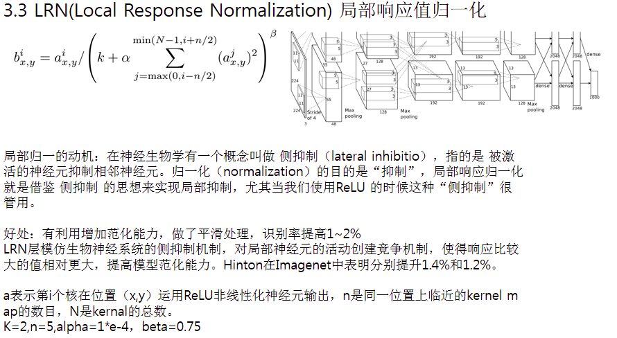

# 局部响应归一化

> https://blog.csdn.net/sinat_21585785/article/details/75087768?utm_source=copy 
>
> https://blog.csdn.net/hduxiejun/article/details/70570086

## 动机--侧抑制（lateral inhibition）



## 公式


公式解释： 

因为这个公式是出自CNN论文的，所以在解释这个公式之前读者应该了解什么是CNN，可以参见 

* <http://blog.csdn.net/whiteinblue/article/details/25281459> 
* <http://blog.csdn.net/stdcoutzyx/article/details/41596663> 
* <http://www.jeyzhang.com/cnn-learning-notes-1.html> 

这个公式中的a表示**卷积层（包括卷积操作和池化操作）后的输出结果**，这个输出结果的结构是一个四维数组`[batch,height,width,channel]`。

这里可以简单解释一下，batch就是批次数(每一批为一张图片)，height就是图片高度，width就是图片宽度，channel就是通道数可以理解成一批图片中的某一个图片经过卷积操作后输出的神经元个数(或是理解成处理后的图片深度)。

$a^{i}_{(x,y)}$表示在这个输出结构中的一个位置`[a,b,c,d]`，可以理解成在某一张图中的某一个通道下的某个高度和某个宽度位置的点，即第a张图的第d个通道下的高度为b宽度为c的点。

论文公式中的**N表示通道数(channel)**。

$a,n/2,k,α,β$分别表示函数中的`input,depth_radius,bias,alpha,beta`，其中$n/2,k,α,β$都是自定义的，特别注意一下$∑$叠加的方向是沿着通道方向的，即每个点值的平方和是沿着a中的第3维channel方向的，也就是**一个点同channel方向的前面n/2个通道（最小为第0个通道）和后n/2个通道（最大为第d-1个通道）的点的平方和(共n+1个点)**。

而函数的英文注解中也说明了把input当成是d个3维的矩阵，说白了就是把input的通道数当作3维矩阵的个数，叠加的方向也是在通道方向。 

画个简单的示意图： 


实验代码：

```python
import tensorflow as tf
import numpy as np
x = np.array([i for i in range(1,33)]).reshape([2,2,2,4])
y = tf.nn.lrn(input=x,depth_radius=2,bias=0,alpha=1,beta=1)

with tf.Session() as sess:
    print(x)
    print('#############')
    print(y.eval())
```


**结果解释：** 

这里要注意一下，如果把这个矩阵变成图片的格式是这样的 :


然后按照上面的叙述我们可以举个例子。比如26对应的输出结果0.00923952，计算如下

$26/(0+1*(25^2+26^2+27^2+28^2))^1$