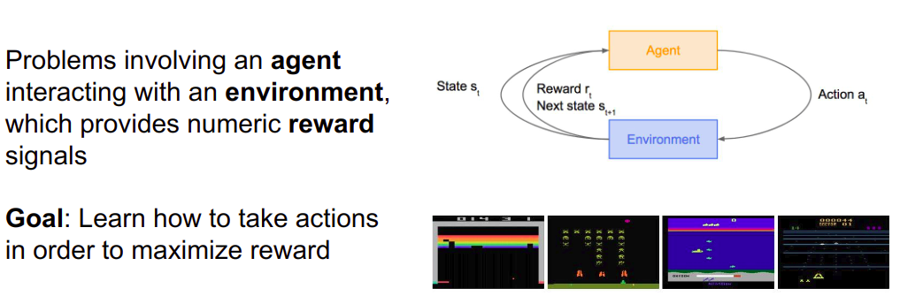
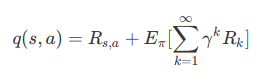
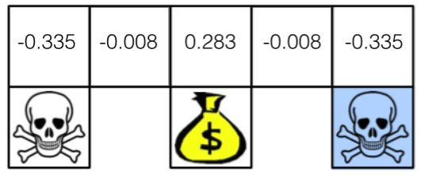

# 强化学习(Reinforcement Learning/RL)

## 主体介绍

> https://morvanzhou.github.io/tutorials/machine-learning/reinforcement-learning/1-1-A-RL/
>
> https://www.cnblogs.com/steven-yang/p/6649213.html
>
> http://www.atyun.com/10329.html
>
> http://www.algorithmdog.com/ml/rl-series

### 简介

使用强化学习能够让机器学着如何在环境中拿到高分, 表现出优秀的成绩. 而这些成绩背后却是他所付出的辛苦劳动, 不断的试错, 不断地尝试, 累积经验, 学习经验.

强化学习是一类算法, 是让计算机实现从一开始什么都不懂, 脑袋里没有一点想法, 通过不断地尝试, 从错误中学习, 最后找到规律, 学会了达到目的的方法. 这就是一个完整的强化学习过程.

强化学习是学习一个最优策略(policy), 可以让本体(agent)在特定环境(environment)中, 根据当前的状态(state), 做出行动(action), 从而获得最大回报(G or return).



强化学习是一个大家族, 他包含了很多种算法.之中一些比较有名的算法, 比如:

* **通过行为的价值来选取特定行为的方法**
  * 使用**表格**学习的 q learning, sarsa,
  * 使用**神经网络**学习的 deep q network,
* **直接输出行为**的 policy gradients,
* 了解所处的环境, 想象出一个虚拟的环境并**从虚拟的环境中学习** 等等


### 监督学习 VS 评估学习

机器学习一共有三个分支, 有监督学习、无监督学习和强化学习.

强化学习是系统从环境学习以使得奖励最大的机器学习.

---

对于许多感兴趣的问题, 监督学习的范例并没有给我们带来我们所需要的灵活性. 监督学习与强化学习之间的主要区别在于, 所获得的反馈是否具有**评估性（evaluative）**或**启发性（instructive）**.

有启发意义的反馈告诉你<u>如何实现你的目标</u>, 而评估反馈则告诉你<u>你的目标有多好</u>.

**监督学习是基于有启发意义的反馈来解决问题的, 而强化学习则是基于评估的反馈来解决问题的. **

图像分类是一个有启发反馈的监督问题;当算法试图对某一数据进行分类时,它会被告知真正的类是什么.另一方面,评估反馈只是告诉你你在实现目标方面做得多好.

如果你用评估反馈训练一个分类器,你的分类器可能会说“我认为这是一只仓鼠”,作为回报, 分类器将得到50分的反馈分数.我们也不清楚50分算是怎样程度,也许10000分是一个更棒的分数,但直到我们尝试对其他数据点进行分类之前,我们都不知道是否如此.

在许多问题中, 评估反馈的想法更直观, 更容易理解. 例如, 想象一个控制数据中心温度的系统. 有启发性的反馈似乎没有多大意义, 任何给定的时间步长中, 你如何告诉你的算法在每个组件的正确设置是什么? 评估的反馈更有意义. 因为你可以很容易地反馈数据, 比如在某个时间段内使用了多少电, 或者平均温度是多少. 这实际上就是谷歌如何使用强化学习解决问题的办法. 因此, 让我们看看到底什么是强化学习.

---

监督学习是已经有了数据和数据对应的正确标签, 就能学习出哪种数据对应哪种标签.

不过强化学习还要更进一步, **一开始它并没有数据和标签**.他要通过一次次在环境中的尝试, **获取这些数据和标签,** 然后再学习通过哪些数据能够对应哪些标签, 通过学习到的这些规律, 尽可能地选择带来高分的行为.

这也就证明了在强化学习中, **分数标签就是他的老师**, 和监督学习中的老师也差不多.

强化学习和有监督学习的不同在于教师信号. 强化学习的教师信号是动作的奖励, 有监督学习的教师信号是正确的动作.

### 马尔科夫决策过程 (Markov Decision Processes, MDP)

假定我们知道状态s, 如果**未来的状态条件不依赖于过去的状态**, 那么状态s符合马尔可夫属性.

> 这里是"不依赖"?对
>
> 当一个随机过程在给定现在状态以及过去所有状态的情况下, **其未来状态的条件概率分布仅依赖于当前的状态**；换句话说, 在给定现在状态时, 它与过去状态(即该过程的历史路径)是条件独立的, 那么此随机过程即具有马尔可夫性质. 具有马尔可夫性质的过程通常称之为马尔可夫过程.
>
> 要说强化学习, 就必须说说马尔科夫决策过程 (Markov Decision Processes, MDP). 马尔可夫决策过程是基于马尔可夫过程理论的随机动态系统的决策过程, 其分五个部分：
>
> 1. $S $表示状态集 (states)；
> 2. $A$ 表示动作集 (Action)；
> 3. $P^{s′}_{s,a}$ 表示状态 s 下采取动作 a 之后转移到 s’ 状态的概率；
> 4. $R_{s,a}$ 表示状态 s 下采取动作 a 获得的奖励；
> 5. $γ $是衰减因子.
>
> 和一般的马尔科夫过程不同, 马尔科夫决策过程考虑了动作, 即系统下个状态不仅和当前的状态有关, 也和当前采取的动作有关. 还是举下棋的例子, 当我们在某个局面(状态s)走了一步 (动作 a ). 这时对手的选择(导致下个状态 s’ )我们是不能确定的, 但是他的选择只和 s 和 a 有关, 而不用考虑更早之前的状态和动作, 即 s’ 是根据 s 和 a 随机生成的.

这意味着状态s描述了所有过去直至当前的状态. 如果你还是不理解这个决策过程的话, 那么通过一个示例就可以更容易地理解它：考虑一个球在空中飞行. 如果它的状态s是由它的位置p和速度v决定的, 那就足以描述它目前的位置和它将要去的地方(假设给定条件是一个物理模型, 并且没有外部影响). 然而, 如果我们只知道球的位置, 而不知道它的速度, 它的状态就不再是具有马尔可夫性. 目前的状态并没有总结过去所有的状态, 我们需要从之前的步骤中得到的信息来开始构建一个正确的球的模型.

强化学习通常被建模为马尔可夫决策过程. MDP是一种有向图, 它的节点和边缘描述了马尔可夫状态之间的过渡. 这里有一个简单的例子:


上面这张图解释了马尔可夫决策的学习过程：一开始, 你在“不理解”的状态中. 从那里, 你有两种可能的行为, “学习”或“不学习”. 如果你选择“不学习”, 你有100%的可能会回到“不理解”的状态. 然而, 如果你选择“学习”, 你有20%的可能性回到你最初的“不理解”状态, 但是有80%的机会最终进入“理解”状态.

实际上, 我相信过渡到“理解”状态的几率要比80%高很多, 马尔可夫决策的核心部分真的非常简单. 从一个状态开始, 你可以采取一系列的行动. 在你采取行动之后, 你可以决定在哪些状态下过渡到你的状态. 在“不学习”行为的情况下, 这种转变也很有可能是决定性的.

强化学习的目标是**学习如何在更有价值的状态中花费更多的时间**. 要有一个有价值的状态, 我们需要在马尔可夫决策中有更多的信息.


你不需要用一个马尔可夫决策教你“不吃东西”会让你“挨饿”. 不过, 强化学习agent可能会需要.

这个马尔可夫决策有附加的回报r. 每次你向一个状态过渡时, 你都会得到回报. 在这个例子中, 你会因为“饥饿”的状态而得到负面的回报, 而对于“饿死”的人来说, 这是一个巨大的负面回报. 然而, 如果你是“吃饱”的状态的话, 你就会得到一个正面的回报. 既然我们的马尔可夫决策已经完全成形了, 我们就可以开始考虑如何采取行动来获得最大的回报！

因为马尔可夫决策很简单, 我们很容易就能看到, 当我们饿的时候, 我们就可以在更高回报的地方吃东西. 我们没有太多的选择, 当我们在模型中的状态为“吃饱”的时候, 我们就会有更多的选择, 但是我们将不可避免地再次“挨饿”, 并且接下来立即选择“吃东西”这种行为.

---

马尔科夫决策过程是强化学习的理论基础.

不管我们是将强化学习应用于五子棋游戏、星际争霸还是机器人行走, 我们都假设背后存在了一个马尔科夫决策过程. 只不过有的时候我们知道马尔科夫决策过程所有信息(状态集合, 动作集合, 转移概率和奖励), 有的时候我们只知道部分信息 (状态集合和动作集合), 还有些时候马尔科夫决策过程的信息太大无法全部存储 (比如围棋的状态集合总数为319×19).

强化学习算法按照上述不同情况可以分为两种: **基于模型 (Model-based) 和非基于模型 (Model-free)**. 基于模型的强化学习算法是知道并可以存储所有马尔科夫决策过程信息, 非基于模型的强化学习算法则需要自己探索未知的马尔科夫过程.

### 将强化学习问题正式化

现在我们有了许多我们需要的构建块, 然后我们应该看看强化学习中使用的术语. 最重要的组成是agent和环境. 一个agent存在于某些有间接控制的环境中. 通过回顾我们的马尔可夫决策, **agent可以选择在给定状态下采取哪些操作**, 这对所看到的状态有很大的影响.

但是, **agent并不能完全控制环境的动态**. 因为环境在接收到这些动作后, 会返回到新的状态和回报中.


上面这张图片是来自Sutton和Barto的“强化学习:介绍”这本书(强烈推荐), 它解释了agent和环境的相互作用. 在某一时时间步长中, agent在状态*st*中, 并采取行动*at*. 然后环境以新的状态*st+1*和回报*rt+1*进行响应. 回报在t+1上的原因是因为它是在状态*st+1*的环境中返回的, 所以让它们保持一致是有意义的(就像图像中显示的那样).

我们现在有了一个关于强化学习问题的框架, 并且准备好开始考虑如何最大化我们的回报.

### 回报和返还(return)

正如前面所讨论的, **强化学习agent如何最大化累积未来的回报**.

用于描述累积未来**回报**的词是**返还**, 通常用R表示. 我们还使用一个下标t来表示某个时间步长的返还. 在数学符号中, 它是这样的:


如果我们让这个级数趋于无穷, 那么我们最终会得到无限的返还, 这对于问题的定义并没有太大意义.

因此, 只有在我们期望返还的级数终止时, 这个方程才有意义.

我们将这种总是终止的任务称为“插曲式”(episodic). 纸牌游戏是解释“插曲式”问题的好例子.

“插曲”开始于对每个人发牌, 并且不可避免地会随着游戏规则的不同而结束. 然后, 下一“插曲”又开始了另一回合的游戏.

> 这里写的很混乱,不理解?

相比使用未来的累积回报作为返还, 更常见的是**使用未来的累积折现回报(cumulative discounted reward)**:


其中0<γ<1.

以这种方式定义返还的两个好处是, 返还在无穷级数中得到了很好的定义, 而且**它把更大的权重给了更早的回报, 这意味着我们更关心即将得到的回报, 而不是将来会得到更多的回报**.

我们为γ选择的值越小就越正确. 这种情况在我们让γ等于0或1时就可以看到. 如果γ等于1, 这个方程就变成了对所有的回报都同样的关心, 无论在什么时候. 另一方面, **当γ等于0时, 我们只关心眼前的回报**, 而不关心以后的回报. 这将导致我们的算法极其短视. 它将学会采取目前最好的行动, 但不会考虑行动对未来的影响.

### 策略

一个策略, 写成$π(s, a)$, 描述了一种行动方式. 它是一个函数, 能够采取一个状态和一个行动, 并返回在那个状态下采取这个行动的**概率**.

因此, 对于一个给定的状态, 即必须是真实的.

在下面的例子中, 当我们“饥饿”的时候, 我们可以在两种行为之间做出选择, 要么“吃”, 要么“不吃”.


我们的策略应该描述如何在每个状态中采取行动, 所以一个等概率的随机策略看起来就像


在这里(Eat)是行为“吃”, 而(Don’t Eat)是“不吃”. 这意味着, 如果你处于“饥饿”状态, 选择“吃”和“不吃”的概率是相等的.

我们在强化学习中的目标是学习一种最优策略, 定义为.

最优策略告诉我们**如何采取行动来最大化每个状态的返还**. 因为这是一个很简单的例子, 所以很容易看出, 在这种情况下, 最优策略是在“饥饿”时总是“吃”, 那么就是. 在这个实例中, 对于许多马尔可夫决策来说, 最优策略是确定的. **每个状态都有一个最优的行动. **有时这被写成, 它是从状态到这些状态中的最优行动的映射.

---

强化学习技术是要学习一个策略 (Policy).

这个策略其实是一个函数, 输入当前的状态 s, 输出采取动作 a 的概率π(s,a).

有监督学习希望分类器正确地对实例分类, 那么强化学习的目标是什么呢？强化学习希望把策略训练什么样呢？

假设我们的系统在一个状态 s 中, 我们不会选择当前奖励 $R_{s,a}$最大的动作 a. 因此这个动作可能导致系统进入死胡同, 即系统之后会受到很大的处罚.

> 为什么"这个动作可能导致系统进入死胡同, 即系统之后会受到很大的处罚"?

为了避免这种情况, 策略要考虑到后续的影响. 因此我们最大化递减奖励的期望:


其中 γ 是马尔科夫决策过程的第五个部分：衰减因子. $γ $用于平衡当前奖励和远期奖励的重要性, 也是用来避免计算结果无穷. $R_k$是系统在当前策略下第$ k $步之后获得的奖励. 这种目标既考虑了当前奖励又考虑了远期奖励, 避免了下一个状态是死胡同的问题.

### 价值函数

根据上面的目标, 人们提出了价值的概念. 一个策略下的一个状态的价值定义：**这个状态下, 按照这个策略, 系统能够获得的递减奖励期望**.


后来人们进一步扩展了价值的概念, **将价值扩展到状态-动作对上**.

一个状态-动作对的价值定义如下所示.



---

为了学习最优策略, 我们利用了价值函数.

在强化学习中有两种类型的价值函数:**状态值函数(state value function)**, 用V(s)表示, 和**行动值函数**, 用Q(s, a)表示.

**状态值函数在遵循策略时描述一个状态的值. 当从状态的行为以我们的策略$π$开始时, 这就是预期的返还. **


需要注意的是, 即使在相同的环境中, 价值函数也会根据策略发生变化. 这是因为**状态的价值取决于你的行动**, 因为你在那个特定的状态下的**行动会影响你期望看到的回报**.

同时还要注意期望的重要性. **期望(expectation)**就像一个平均值;它就是你**期望看到的返还**.

我们使用期望的原因是当你到达一个状态后会发生一些随机事件. 你可能有一个随机的策略, 这意味着我们需要把我们采取的所有不同行动的结果结合起来. 此外, **转换函数(transition function)**可以是随机的, 也就是说, 我们可能不会以100%的概率结束任何状态.

请记住上面的例子:**当你选择一个行动时, 环境将返回下一个状态**. 即使给出*一个*行动, 也可能会有*多个*状态返还. 当我们看贝尔曼方程时, 会看到更多这样的情况. 期望将所有这些随机因素考虑在内.

我们将使用的另一个价值函数是行动值函数.

**行动值函数告诉我们当跟随某个策略时, 在某些状态下执行某个行动的值. 给出状态和在π下的行动, 这是期望的返还:**

对状态值函数的注释同样适用于行动值函数. 根据该策略, 期望将考虑未来行动的随机性, 以及来自环境的返还状态的随机性.

### 贝尔曼方程

理查德·贝尔曼推导出了以下公式, 让我们可以开始解决这些马尔可夫决策问题.

贝尔曼方程在强化学习中无处不在, 对于理解强化算法的工作原理是非常必要的. 但在我们了解贝尔曼方程之前, 我们需要一个更有用的符号, 定义为和, 如下所示:


是过渡概率. 如果我们从状态s开始, 然后采取行动a, 我们就会得到状态和概率,表示的是对于状态s,采取行动a的时候,得到状态s'的概率是$P^a_{ss'}$.


是另一种**写为期望(或平均)回报的方式**, 我们从状态s开始, 采取行动a, 然后移动到状态.

最后, 有了这些条件, 我们就可以推导出贝尔曼方程了.

我们将考虑贝尔曼方程的状态值函数. 根据返还的定义, 我们可以重写方程(1), 如下所示:


如果我们从求和中得到第一个回报, 我们可以这样重写它:


这里的期望描述的是, **如果我们继续遵循策略π的状态s, 我们期望返还的是什么**.

通过**对所有可能的行动和所有可能的返还状态的求和**, 可以明确地编写为期望. 下面的两个方程可以帮助我们完成下一个步骤.


通过在这两个部分之间分配期望, 我们就可以把我们的方程转化成：


注意, 方程(1)与这个方程的末尾形式相同. 我们可以替换它, 得到：


贝尔曼方程的行动值函数可以以类似的方式进行推导. 其结果如下：


> 

贝尔曼方程的重要性在于, **表明了当前状态的值函数与下个状态的值函数的关系**.

这意味着, 如果我们知道的值, 我们可以很容易地计算出的值. 这为计算每个状态值的迭代方法打开了大门, 因为如果我们知道下一个状态的值, 我们就可以知道当前状态的值. 最重要的事情是我们需要记住一些编号方程. 最后, 在贝尔曼方程中, 我们可以开始研究如何计算最优策略, 并编码我们的第一个强化学习agent.

> 如何计算?
>
> 利用公式(3),$V^\pi(s')=>V^\pi(s)$.

---

根据上面的介绍, 我们发现强化学习的目标是找到一个策略 π, 使得这个策略下每个状态的价值最大.

但是这里有一个问题:

对于两个策略, 有可能出现：策略$ π_1$ 状态 a 的价值大于策略 $π_2 $状态 b 的价值, 但策略$ π_2 $状态 c 的价值大于策略$ π_1 $状态 d 的价值.

因此我们不确定, **是否存在一个策略 $\pi $的所有状态价值大等于其他策略的状态价值**. 如果不存在这么一个策略, 我们的目标是迷茫的.

但是万幸啊, 下面的定理保证了这么一个策略存在. 这么一个所有状态价值大等于其他所有的状态价值, 我们可以称之为最优策略. 强化学习算法的目标就是找到最优策略.


### 案例

#### 描述问题

下图是一个机器人从任意一个状态出发寻找金币的例子. 找到金币则获得奖励 1, 碰到海盗则损失 1. 找到金币或者碰到海盗则机器人停止.


我们可以把这个问题建模成马尔科夫决策过程. 图中不同位置为状态, 因此 $S = {1,…,8}$. 机器人采取动作是向东南西北四个方向走, 因此`A={'n','e','s','w'}`. 转移概率方面, 当机器人碰到墙壁, 则会停在原来的位置；当机器人找到金币时获得奖励 1,当碰到海盗则损失 1, 其他情况不奖励也不惩罚.

因此除了$ R_{1,s}=−1, R_{3,s}=1, R_{5,s}=−1$之外, 其他情况$R_{∗,∗}=0$. 衰减因子 $γ =0.8$. 写成代码下面所示.

```python
class Mdp:

    def __init__(self):

        # 记录所有可能的状态
        self.states         = [1,2,3,4,5,6,7,8] # 0 indicates end
        # 记录所有的目标状态
        self.terminal_states      = dict()
        self.terminal_states[6]   = 1
        self.terminal_states[7]   = 1
        self.terminal_states[8]   = 1
        # 记录所有的行动方向
        self.actions        = ['n','e','s','w']
        # 记录所有的可能的奖励分数
        self.rewards        = dict();
        self.rewards['1_s'] = -1.0
        self.rewards['3_s'] = 1.0
        self.rewards['5_s'] = -1.0
        # 记录所有的可能的路径
        self.t              = dict();
        self.t['1_s']       = 6
        self.t['1_e']       = 2
        self.t['2_w']       = 1
        self.t['2_e']       = 3
        self.t['3_s']       = 7
        self.t['3_w']       = 2
        self.t['3_e']       = 4
        self.t['4_w']       = 3
        self.t['4_e']       = 5
        self.t['5_s']       = 8
        self.t['5_w']       = 4
        # 记录衰减因子
        self.gamma          = 0.8

    def transform(self, state, action): #return is_terminal, state, reward

        if state in self.terminal_states:
            return True, state, 0

        key = '%d_%s'%(state, action);
        if key in self.t:
            # 未碰壁,开始移动
            next_state = self.t[key];
        else:
            # 当机器人碰到墙壁, 则会停在原来的位置
            next_state = state

	    is_terminal = False
        if next_state in self.terminal_states:
            is_terminal = True

        if key not in self.rewards:
            # 非目标状态
            r = 0.0
        else:
            # 目标状态
            r = self.rewards[key];

        return is_terminal, next_state, r;
```

#### 过程分析

上面机器人找金币的例子中, 设定衰减因子 γ 等于 0.5. 如果策略是一直往西走碰壁之后立马向南, 那么状态 2 的价值 `v(2)=0+0.5∗−1.0=−0.5`. 如果策略是随机一个方向, 那么所有状态的价值如下图所示.



> 下面内容主要来自https://morvanzhou.github.io

## 分类

### Model-free 和 Model-based


有的时候, 我们完全知道问题背后的马尔科夫决策过程；有的时候, 我们不知道问题背后的马尔科夫决策过程 (主要指我们不知奖励函数 ($R_{s,a}$) 和转移概率 ($P_{s,a}^{s’}$) 的全貌). 模型相关是**我们知道整个马尔科夫决策过程**. 模型无关则是我们不知道马尔科夫决策过程, 需要系统进行探索. 今天我们先介绍比较简单的模型相关强化学习.

我们可以将所有强化学习的方法分为理不理解所处环境,如果我们不尝试去理解环境, 环境给了我们什么就是什么. 我们就把这种方法叫做 model-free, 这里的 model 就是用模型来表示环境, 那理解了环境也就是学会了用一个模型来代表环境, 所以这种就是 model-based 方法. 我们想象. 现在环境就是我们的世界, 我们的机器人正在这个世界里玩耍, 他不理解这个世界是怎样构成的, 也不理解世界对于他的行为会怎么样反馈. 举个例子, 他决定丢颗原子弹去真实的世界, 结果把自己给炸死了, 所有结果都是那么现实. 不过如果采取的是 model-based RL, 机器人会通过过往的经验, 先理解真实世界是怎样的, 并建立一个模型来模拟现实世界的反馈, 最后他不仅可以在现实世界中玩耍, 也能在模拟的世界中玩耍 , 这样就没必要去炸真实世界, 连自己也炸死了, 他可以像玩游戏一样炸炸游戏里的世界, 也保住了自己的小命. 那我们就来说说这两种方式的强化学习各用那些方法吧.

Model-free 的方法有很多, 像 [Q learning](https://morvanzhou.github.io/tutorials/machine-learning/ML-intro/4-03-q-learning/), [Sarsa](https://morvanzhou.github.io/tutorials/machine-learning/ML-intro/4-04-sarsa/), [Policy Gradients](https://morvanzhou.github.io/tutorials/machine-learning/ML-intro/4-07-PG/) 都是从环境中得到反馈然后从中学习. 而 model-based RL 只是多了一道程序, 为真实世界建模, 也可以说他们都是 model-free 的强化学习, **只是 model-based 多出了一个虚拟环境,** 我们不仅可以像 model-free 那样在现实中玩耍,还能在游戏中玩耍, 而玩耍的方式也都是 model-free 中那些玩耍方式, 最终 model-based 还有一个杀手锏是 model-free 超级羡慕的. 那就是想象力.

Model-free 中, 机器人只能按部就班, 一步一步等待真实世界的反馈, 再根据反馈采取下一步行动. 而 model-based, 他能通过想象来预判断接下来将要发生的所有情况. 然后选择这些想象情况中最好的那种. 并依据这种情况来采取下一步的策略, 这也就是 围棋场上 AlphaGo 能够超越人类的原因. 接下来, 我们再来用另外一种分类方法将 强化学习分为基于概率和基于价值.

### 基于概率 和 基于价值


基于概率是强化学习中最直接的一种, 他能通过感官分析所处的环境, **直接输出下一步要采取的各种动作的概率**, 然后**根据概率采取行动, 所以每种动作都有可能被选中, 只是可能性不同.**

而基于价值的方法**输出则是所有动作的价值**, 我们**会根据最高价值来选着动作**,.

相比基于概率的方法, 基于价值的决策部分更为铁定, 毫不留情, 就选价值最高的, 而基于概率的, 即使某个动作的概率最高, 但是还是不一定会选到他.

我们现在说的动作都是一个一个不连续的动作, 而**对于选取连续的动作, 基于价值的方法是无能为力的**. 我们却能用一个概率分布在连续动作中选取特定动作, 这也是基于概率的方法的优点之一.

那么这两类使用的方法又有哪些呢?

* 基于概率这边, 有 [Policy Gradients](https://morvanzhou.github.io/tutorials/machine-learning/ML-intro/4-07-PG/)
* 基于价值这边有 [Q learning](https://morvanzhou.github.io/tutorials/machine-learning/ML-intro/4-03-q-learning/), [Sarsa](https://morvanzhou.github.io/tutorials/machine-learning/ML-intro/4-04-sarsa/) 等.

* 而且我们还能结合这两类方法的优势之处, 创造更牛逼的一种方法, 叫做 [Actor-Critic](https://morvanzhou.github.io/tutorials/machine-learning/ML-intro/4-08-AC/),

  actor 会**基于概率做出动作**, 而 critic 会**对做出的动作给出动作的价值**, 这样就在原有的 policy gradients 上加速了学习过程.

### 回合更新 和 单步更新


强化学习还能用另外一种方式分类, 回合更新和单步更新, 想象强化学习就是在玩游戏, 游戏回合有开始和结束.

* 回合更新指的是游戏开始后, 我们**要等待游戏结束, 然后再总结这一回合中的所有转折点, 再更新我们的行为准则.**
  * Monte-carlo learning
  * 基础版的 policy gradients 等
* 单步更新则是在游戏**进行中每一步都在更新**, 不用等待游戏的结束, 这样我们就能**边玩边学习**了.
  * Qlearning,
  * Sarsa,
  * 升级版的 policy gradients 等

因为**单步更新更有效率**, 所以现在大多方法都是基于单步更新. 比如有的强化学习问题并不属于回合问题.

### 在线学习 和 离线学习


另一种分类方式是在线学习和离线学习,.

* 在线学习, 就是指我必须**本人在场**, 并且一定是**本人边玩边学习**

  * 最典型的在线学习就是 Sarsa
  * 还有一种优化 Sarsa 的算法, 叫做 Sarsa lambda,

* 离线学习是**你可以选择自己玩, 也可以选择看着别人玩**, 通过**看别人玩来学习**别人的行为准则

  离线学习 同样是从过往的经验中学习, 但是**这些过往的经历没必要是自己的经历, 任何人的经历都能被学习**.

  或者我也不必要边玩边学习, 我可以白天先存储下来玩耍时的记忆, 然后晚上通过离线学习来学习白天的记忆

  * 最典型的离线学习就是 Q learning
  * 后来人也根据离线学习的属性, 开发了更强大的算法, 比如让计算机学会玩电动的 Deep-Q-Network.

## Q Learning

是一种基于价值的单步更新离线学习方法.

假设现在我们处于写作业的状态, 而且我们以前并没有尝试过写作业时看电视, 所以现在我们有两种选择 :

 	1.  继续写作业
 	2.  跑去看电视

因为以前没有被罚过, 所以我选看电视, 然后现在的状态变成了看电视, 我又选了继续看电视, 接着我还是看电视, 最后爸妈回家, 发现我没写完作业就去看电视了, 狠狠地惩罚了我一次, 我也深刻地记下了这一次经历, 并在我的脑海中将 “没写完作业就看电视” 这种行为更改为负面行为, 我们在看看 Q learning 根据很多这样的经历是如何来决策的吧.

### Q-Learning 决策


假设我们的**行为准则已经学习好了**.

1. 现在我们处于状态s1, 我在写作业, 我有两个行为 a1, a2, 分别是看电视和写作业, **根据我的经验**, 在这种 s1 状态下, a2 写作业带来的潜在奖励要比 a1 看电视高(这里的**潜在奖励我们可以用一个有关于 s 和 a 的 Q 表格代替**, 在我的记忆Q表格中, $Q(s1, a1)=-2 $要小于 $Q(s1, a2)=1$), 所以我们判断要选择 a2 作为下一个行为.
2. 现在我们的状态更新成 s2 , 我们还是有两个同样的选择, 重复上面的过程, 在行为准则Q 表中寻找 $Q(s2, a1) ,Q(s2, a2) $的值, 并比较他们的大小, 选取较大的一个.
3. 接着根据 a2 我们到达 s3 并在此重复上面的决策过程.

Q learning 的方法也就是这样决策的. 看完决策, 我看在来研究一下这张行为准则 Q 表是通过什么样的方式更改, 提升的.

### Q-Learning 更新


所以我们回到之前的流程.

1. 根据 Q 表的估计, 因为在 s1 中, a2 的值比较大, 通过之前的决策方法, 我们在 s1 采取了 a2, 并到达 s2.

2. 这时我们开始更新用于决策的 Q 表, 接着我们**并没有在实际中采取任何行为**, 而是**想象**自己在 s2 上采取了每种行为, 分别看看两种行为**哪一个的 Q 值大**.

   比如说 $Q(s2, a2) $的值比$ Q(s2, a1) $的大, 所以我们把大的 $Q(s2, a2)$ 乘上一个衰减值$\gamma $(比如是0.9) 并加上到达s2时所获取的奖励 R (这里还没有获取到我们的棒棒糖, 所以奖励为 0), 从而得到了$Q(s1, a2)$的现实值, 这里的$Q(s2, a2)$ 也就是类似于之前的$Q(s1, a2)$, 都算是估计值.

   因为会获取实实在在的奖励 R , 我们将这个作为现实中 $Q(s1, a2)$ 的值, 但是我们之前是根据 Q 表估计 $Q(s1, a2)$ 的值.

3. 所以有了现实和估计值, 我们就能更新Q(s1, a2) .

   根据 估计与现实的差距, 将这个差距乘以一个学习效率$ \alpha$ 累加上老的 $Q(s1, a2)$ 的值, 变成新的值.

   但时刻记住, 我们虽然用 $maxQ(s2) $估算了一下 s2 状态, 但**还没有在 s2 做出任何的行为**, s2 的行为决策要等到**更新完了以后再重新另外做**.

这就是 off-policy 的 Q learning 是如何决策和学习优化决策的过程.

### Q-Learning 整体算法


这一张图概括了我们之前所有的内容.

这也是 Q learning 的算法, 每次更新我们都用到了 Q 现实和 Q 估计, 而且 Q learning 的迷人之处就是 在$ Q(s1, a2)$ 现实中, 也包含了一个$ Q(s2) $的最大估计值, **将对下一步的衰减的最大估计和当前所得到的奖励当成这一步的现实**,

最后我们来说说这套算法中一些参数的意义.

* $\epsilon-greedy$ 是用在决策上的一种策略, 比如$ \epsilon = 0.9$ 时, 就说明有**90% 的情况我会按照 Q 表的最优值选择行为, 10% 的时间使用随机选行为**.
* $\alpha$是学习率, 来**决定这次的误差有多少是要被学习的**, $\alpha$是一个小于1 的数.
* $\gamma $是对未来 reward 的衰减值.

### Q-Learning 中的 Gamma


我们重写一下 Q(s1) 的公式, 将 Q(s2) 拆开, 因为Q(s2)可以像 Q(s1)一样,是关于Q(s3) 的, 所以可以写成这样, 然后以此类推, 不停地这样写下去, 最后就能写成这样.

可以看出**Q(s1) 是有关于之后所有的奖励**, 但这些奖励正在衰减, **离 s1 越远的状态衰减越严重**.

想象 Q-learning 的机器人天生近视眼:

* $\gamma = 1$ 时, 机器人有了一副合适的眼镜, 在 s1 看到的 Q 是未来没有任何衰变的奖励, 也就是机器人能清清楚楚地看到之后所有步的全部价值
* $\gamma =0$, 近视机器人没了眼镜, 只能摸到眼前的 reward, 同样也就只在乎最近的大奖励, 如果 gamma 从 0 变到 1, 眼镜的度数由浅变深, 对远处的价值看得越清楚, 所以机器人渐渐变得有远见, 不仅仅只看眼前的利益, 也为自己的未来着想.

## Sarsa

是一种基于价值的,单步更新的在线学习算法.

### Sarsa 决策


Sarsa 的决策部分和 [Q learning](https://morvanzhou.github.io/tutorials/machine-learning/ML-intro/4-03-q-learning/) 一模一样, 因为我们使用的是 Q 表的形式决策, 所以我们会在 Q 表中挑选值较大的动作值施加在环境中来换取奖惩. 但是**不同的地方在于 Sarsa 的更新方式是不一样的.**

### Sarsa 更新行为准则


同样, 我们会经历正在写作业的状态 s1, 然后再挑选一个带来最大潜在奖励的动作 a2, 这样我们就到达了 继续写作业状态 s2.

而在这一步, 如果你用的是:

* Q learning, 你会观看一下在 s2 上选取哪一个动作会带来最大的奖励, 但是在真正要做决定时, **却不一定会选取到那个带来最大奖励的动作**, Q-learning 在这一步只是**估计**了一下接下来的动作值.
* Sarsa 是实践派, 他说到做到, **在 s2 这一步估算的动作也是接下来要做的动作**.

所以 Q(s1, a2) 现实的计算值, 我们也会稍稍改动, 去掉maxQ, **取而代之的是在 s2 上我们实实在在选取的 a2 的 Q 值**.

最后像 Q learning 一样, 求出现实和估计的差距 并更新 Q 表里的 Q(s1, a2).

### 对比 Sarsa 和 Q-learning 算法


从算法来看, 这就是他们两最大的不同之处了. 因为 Sarsa 是说到做到型, 所以我们也叫他 on-policy, 在线学习, 学着自己在做的事情. 而 Q learning 是说到但并不一定做到, 所以它也叫作 Off-policy, 离线学习.

而因为有了 maxQ, Q-learning 也是一个特别勇敢的算法.


为什么说他勇敢呢, 因为 Q learning 机器人 永远都会选择最近的一条通往成功的道路, 不管这条路会有多危险. 而 Sarsa 则是相当保守, 他会选择离危险远远的, 拿到宝藏是次要的, 保住自己的小命才是王道. 这就是使用 Sarsa 方法的不同之处.

> 待补充,和理解...
