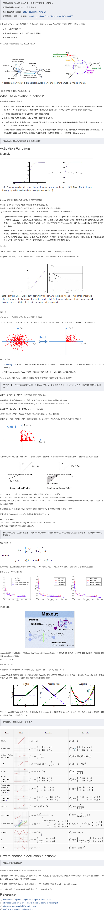

## p范数

A class of [vector norms](http://planetmath.org/vectornorm), called a p-norm and denoted $||⋅||_p$, is defined as

$||x||_p=(|x_1|^p+⋯+|x_n|^p)^{1/p} ,p≥1,x∈R^n$

The most widely used are the 1-norm, 2-norm, and ∞∞-norm:

$||x||_1=(|x_1|^1+⋯+|x_n|^1)^{1} $
$||x||_2=\sqrt{(|x_1|^2+⋯+|x_n|^2)^{2} }$
$||x||_∞== max_{1≤i≤n}|x_i|$

## 表示定理（Representer Theorem）

https://www.analyticsindiamag.com/what-is-representer-theorem-in-machine-learning/

## 支持向量机

http://blog.pluskid.org/?page_id=683

http://www.robots.ox.ac.uk/~az/lectures/ml/lect3.pdf

## 记号规则

$log=ln$

## 次梯度

设f在实数域上是一个凸函数，定义在数轴上的开区间内。这种函数不一定是处处可导的，例如绝对值函数f(x)=|x|f(x)=|x| 。对于下图来说，对于定义域中的任何x0，我们总可以作出一条直线，它通过点(x0, f(x0))，并且要么接触f的图像，要么在它的下方。直线的斜率称为函数的次导数。次导数的集合称为函数f在x0处的次微分。

Rigorously, a *subderivative* of a convex function *f*:*I*→**R** at a point *x*0 in the open interval *I* is a real number *c* such that

for all *x* in *I*. One may show that the [set](https://en.wikipedia.org/wiki/Set_(mathematics)) of subderivatives at *x*0 for a convex function is a [nonempty](https://en.wikipedia.org/wiki/Empty_set) [closed interval](https://en.wikipedia.org/wiki/Closed_interval) [*a*, *b*], where *a* and *b* are the [one-sided limits](https://en.wikipedia.org/wiki/One-sided_limit)

对于所有x，我们可以证明**在点$x_0$ 的次导数的集合是一个非空闭区间$[a,b]$**，其中a和b是单测极限一定存在，且$a<=b$，在$[a,b]$内的所有次导数是f在$x_0$的次微分。

which are guaranteed to exist and satisfy *a* ≤ *b*.

The set [*a*, *b*] of all subderivatives is called the **subdifferential** of the function *f* at *x*0. Since *f* is convex, if its subdifferential at $x_{0}$ contains exactly one subderivative, then *f* is differentiable at $x_{0}$.

当函数在x0处可导时，次微分只有一个点组成，这个点就是函数在x0处的导数。

## 激活函数

## 为什么样本方差（sample variance）的分母是 n-1？

https://www.zhihu.com/question/20099757

