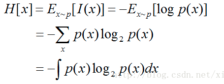
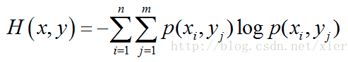
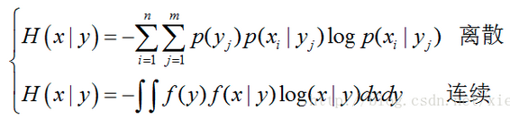
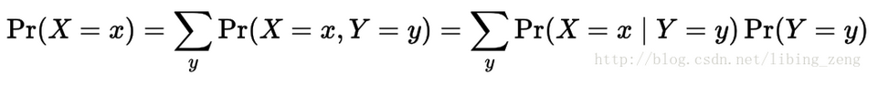
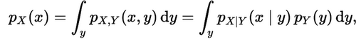
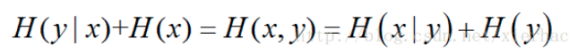
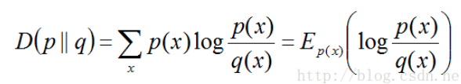

# 熵

信息量(自信息(self-information)): $I(x) = -log_2p(x)$

联合自信息量:$I(x_i,y_i)=-logp(x_i,y_i)$

条件自信息量:$I(y_i|x_i)=-logp(y_i|x_i)$

熵(**整个概率分布对应的信息量的平均值**): (在p分布下面的平均自信息)

> 注意:
>
> 1. 熵只依赖于X的分布,与X的取值无关,因此服从某个分布的X的熵也可以等价于这个分布的熵.
> 2. 定义0log0=0(因为可能出现某个取值概率为0的情况)
> 3. .熵越大,随机变量的**不确定性就越大**(因为之前说了, 越是不确定, 信息量就越大, 要是平均信息量很大, 那么也可以代表这个变量的不确定性越大)

复合熵(联合熵):

条件熵:(表示各种y对应下的x的不确定性)

 

当熵和条件熵中的概率由数据估计(特别是极大似然估计)得到的时候,所对应的熵与条件熵分别称为**经验熵(empirical entropy)**和**经验条件熵(empirical conditional entropy)**

要注意,实际概率有如此规则: $p(x_i, y_i) = p(x_i)p(y_i|x_i)$ ,即乘积的结果表示的是联合分布的情况.

> 联合概率、边际概率、条件概率的关系：
>
> 
>
> 

相对熵又称**互熵**, **交叉熵**, **鉴别信息**, **Kullback熵**, Kullback-Leible散度(即**KL散度**)等.
设p(x)和q(x)是取值的两个概率概率分布, 则p对q的相对熵为:

在一定程度上面, 相对熵可以度量两个随机变量的距离. 也常常用相对熵来度量两个随机变量的距离. 当两个随机分布相同的时候, 他们的相对熵为0, 当两个随机分布的差别增大的时候, 他们之间的相对熵也会增大.
但是事实上面, 他**并不是一个真正的距离**. 因为相对熵是不具有对称性的, 即一般来说

相对熵还有一个性质, 就是不为负.

## 互信息(Mutual Information)

是信息论里一种有用的信息度量, 它可以看成是**一个随机变量中包含的关于另一个随机变量的信息量**, 或者说是**一个随机变量由于已知另一个随机变量而减少的不确定性**.

两个随机变量X,Y的互信息, 定义为X,Y的联合分布和独立分布乘积的相对熵.

X的熵减去X和Y的互信息之后, 可以得到在Y给定的情况下X的熵.

## 参考

* <https://blog.csdn.net/xierhacker/article/details/53463567>
