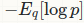

# 概率

## 对数概率

简单而言就是对概率求对数.

而对数概率的归一化指的是

也就是所谓的softmax函数的形式.

话说,为什么为什么要对对数概率归一化的表示使用指数和的形式呢?

为什么不使用的形式呢?

一个原因是因为前面的形式在表达交叉熵的时候比较方便.

这里的q表示标签的真实分布.使用对数概率的时候可以去掉指数,进而简化表达.

> <https://stats.stackexchange.com/questions/289369/log-probabilities-in-reference-to-softmax-classifier/289447>

## 为什么样本方差(sample variance)的分母是 n-1？

<https://www.zhihu.com/question/20099757>

## 最大似然估计

