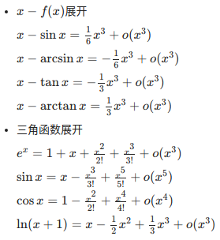

# 泰勒公式

在数学中，泰勒公式（英语：Taylor's Formula）是一个用函数在某点的信息描述其附近取值的公式。

这个公式来自于微积分的泰勒定理（Taylor's theorem），泰勒定理描述了一个可微函数，**如果函数足够光滑的话，在已知函数在某一点的各阶导数值的情况之下，泰勒公式可以用这些导数值做系数构建一个多项式来近似函数在这一点的邻域中的值**，这个多项式称为泰勒多项式（Taylor polynomial）。

泰勒公式还给出了余项即这个多项式和实际的函数值之间的偏差。

泰勒公式得名于英国数学家布鲁克·泰勒。他在1712年的一封信里首次叙述了这个公式，尽管1671年詹姆斯·格雷高里已经发现了它的特例. 拉格朗日在1797年之前，最先提出了带有余项的现在形式的泰勒定理。

## 泰勒公式

初衷是用多项式来近似表示函数在某点周围的情况。比如说，指数函数 $e^{x}$ 在 $x=0$的附近可以用以下多项式来近似地表示：

$$
\mathrm { e } ^ { x } \approx 1 + x + \frac { x ^ { 2 } } { 2 ! } + \frac { x ^ { 3 } } { 3 ! } + \cdots + \frac { x ^ { n } } { n ! }
$$

称为指数函数在0处的n阶泰勒展开公式。这个公式只对0附近的x有用，x离0越远，这个公式就越不准确。实际函数值和多项式的偏差称为泰勒公式的余项。

$$
R _ { n } ( x ) = \mathrm { e } ^ { x } - \left( 1 + x + \frac { x ^ { 2 } } { 2 ! } + \frac { x ^ { 3 } } { 3 ! } + \cdots + \frac { x ^ { n } } { n ! } \right)
$$

## 泰勒定理

对于一般的函数，泰勒公式的系数的选择依赖于函数在一点的各阶导数值。这个想法的原由可以由微分的定义开始。微分是函数在一点附近的最佳线性近似：$f ( a + h ) = f ( a ) + f ^ { \prime } ( a ) h + o ( h )$. 也就是说$f(a+h)\approx f(a)+f^{\prime }(a)h$或者$f ( x ) \approx f ( a ) + f ^ { \prime } ( a ) ( x - a )$.

注意到$f(x)$ 和$f(a)+f^{{\prime }}(a)(x-a)$ 在a处的零阶导数和一阶导数都相同。对足够光滑的函数，如果一个多项式在a处的前n次导数值都与所研究函数在a处的前n次导数值重合，**那么这个多项式应该能很好地近似描述函数在a附近的情况**。

以下定理说明这是正确的：

> **定理**：
>
> 设n是一个正整数。如果定义在一个包含a的区间上的函数f在a点处n+1次可导，那么对于这个区间上的任意x，都有：
> $$
> f ( x ) = f ( a ) + \frac { f ^ { \prime } ( a ) } { 1 ! } ( x - a ) + \frac { f ^ { ( 2 ) } ( a ) } { 2 ! } ( x - a ) ^ { 2 } + \cdots + \frac { f ^ { ( n ) } ( a ) } { n ! } ( x - a ) ^ { n } + R _ { n } ( x )
> $$
>
> 其中的多项式称为**函数在a处的泰勒展开式**，剩余的$R_{n}(x)$是泰勒公式的余项，是$(x-a)^{n}$的高阶无穷小。

## 常见用法

用于特定条件下近似某些函数, 以化简表达式.

## 参考

1. [常用泰勒、微积分公式](https://sunlanchang.github.io/2017/10/27/%E5%B8%B8%E7%94%A8%E6%B3%B0%E5%8B%92%E3%80%81%E5%BE%AE%E7%A7%AF%E5%88%86%E5%85%AC%E5%BC%8F%E3%80%81%E5%91%BD%E4%BB%A4/)
2. [维基: 泰勒公式](https://zh.wikipedia.org/wiki/%E6%B3%B0%E5%8B%92%E5%85%AC%E5%BC%8F)
