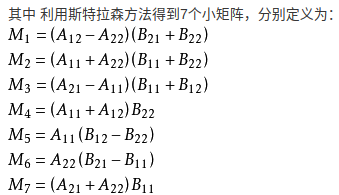

# 矩阵乘法

## Hadamard product(哈达马乘积)

`m x n`矩阵`A = [aij]`与矩阵`B = [bij]`的Hadamard积, 记为`A * B` . 新矩阵元素定义为矩阵A、B**对应元素的乘积**`(A * B)ij = aij.bij`.

![{\displaystyle \left[{\begin{array}{ccc}\mathrm {a} _{11}&\mathrm {a} _{12}&\mathrm {a} _{13}\\\mathrm {a} _{21}&\mathrm {a} _{22}&\mathrm {a} _{23}\\\mathrm {a} _{31}&\mathrm {a} _{32}&\mathrm {a} _{33}\end{array}}\right]\circ \left[{\begin{array}{ccc}\mathrm {b} _{11}&\mathrm {b} _{12}&\mathrm {b} _{13}\\\mathrm {b} _{21}&\mathrm {b} _{22}&\mathrm {b} _{23}\\\mathrm {b} _{31}&\mathrm {b} _{32}&\mathrm {b} _{33}\end{array}}\right]=\left[{\begin{array}{ccc}\mathrm {a} _{11}\,\mathrm {b} _{11}&\mathrm {a} _{12}\,\mathrm {b} _{12}&\mathrm {a} _{13}\,\mathrm {b} _{13}\\\mathrm {a} _{21}\,\mathrm {b} _{21}&\mathrm {a} _{22}\,\mathrm {b} _{22}&\mathrm {a} _{23}\,\mathrm {b} _{23}\\\mathrm {a} _{31}\,\mathrm {b} _{31}&\mathrm {a} _{32}\,\mathrm {b} _{32}&\mathrm {a} _{33}\,\mathrm {b} _{33}\end{array}}\right]}](https://wikimedia.org/api/rest_v1/media/math/render/svg/06e3f6abf1511656029ce58b89695b687789aa9c)

## Kronecker product(克罗内克积)

Kronecker积是两个任意大小矩阵间的运算, 表示为 `A x B`. 如果A是一个 `m x n` 的矩阵, 而B是一个 `p x q` 的矩阵, 克罗内克积则是一个 `mp x nq` 的矩阵. 克罗内克积也称为直积或张量积, 以德国数学家利奥波德·克罗内克命名. 

## 斯特拉森矩阵乘法

斯特拉森矩阵乘法是1969年斯特拉森利用分治策略并加上一些处理技巧设计出的一种矩阵乘法. 设A和B是俩个`n x n`的[矩阵](https://baike.baidu.com/item/%E7%9F%A9%E9%98%B5/18069), 其中n可以写成2的幂. 将A和B分别等分成4个小矩阵, 此时如果把A和B都当成2x2矩阵来看,每个元素就是一个`(n/2)x(n/2)`矩阵, 而A和B的成积就可以写成：

用上述方案解n=2;矩阵乘法；假定施特拉斯矩阵分割方案仅用于n>=8的矩阵乘法, 而对于小于8的矩阵直接利用公式计算；n的值越大, 斯拉特森方法更方便.
