# ThiNet: A Filter Level Pruning Method for Deep Neural Network Compression

> 论文: <https://arxiv.org/abs/1707.06342>

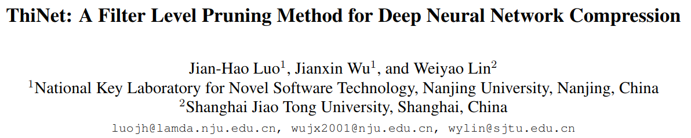

* [ThiNet: A Filter Level Pruning Method for Deep Neural Network Compression](#thinet-a-filter-level-pruning-method-for-deep-neural-network-compression)
  * [概要](#概要)
  * [引言](#引言)
  * [相关工作](#相关工作)
  * [ThiNet](#thinet)
    * [架构](#架构)
    * [为什么是安全的](#为什么是安全的)
    * [如何选择要删除的通道](#如何选择要删除的通道)
    * [最大限度地减少重建错误](#最大限度地减少重建错误)
    * [修剪策略](#修剪策略)
  * [Experiments](#experiments)
    * [对于模型进行修改](#对于模型进行修改)
      * [VGG](#vgg)
      * [ResNet-50](#resnet-50)
    * [修剪模型的领域适应能力(Domain adaptation ability of the pruned model)](#修剪模型的领域适应能力domain-adaptation-ability-of-the-pruned-model)
  * [Conclusion](#conclusion)

## 概要

我们提出了一个高效统一的框架，即ThiNet，在训练和推理阶段同时加速和压缩CNN模型。我们专注于**滤波器级别修剪**，即*如果不太重要，则将丢弃整个滤波器*。我们的方法不会改变原有的网络结构，因此任何现成的深度学习库都可以完美支持它。我们正式建立过滤器修剪作为优化问题，并揭示我们**需要根据从下一层计算的统计信息来修剪过滤器，而不是当前层**，这将ThiNet与现有方法区分开来。

实验结果证明了该策略的有效性，该策略提升了最新技术水平。我们还展示了ThiNet在ILSVRC-12基准测试中的表现。**ThiNet在VGG-16上实现了3.31×FLOP减少和16.63倍压缩，Top-5精度下降仅为0.52％。使用ResNet-50的类似实验表明，即使对于紧凑型网络，ThiNet也可以减少一半以上的参数和FLOP，但成本大约为Top-%精度下降1％。**

此外，原始的VGG-16模型可以进一步修剪成一个只有5.05MB型号的非常小的型号，保持AlexNet级别的准确性，但显示出更强的泛化能力。

## 引言

因为现在的深度模型的存储空间, 运算消耗, 都是极大的, 例如VGG-16模型拥有13834万个参数，占用超过500MB的存储空间，对单个图像进行分类需要309.4亿个浮点运算（FLOPs）。这样的模型, 对于资源有限的设备, 是不现实的.

剪枝技术是一个颇受欢迎, 广受研究的技术, 用来降低网络的复杂度.

* 在20世纪90年代，LeCun[Optimal brain damage]观察到可以从训练有素的网络中移除几个不重要的权重，其准确性损失可以忽略不计。
* 在[Synaptic pruning in development: A computational account]中也探讨了类似的策略。该过程类似于哺乳动物大脑中的生物现象，其中神经元突触的数量在儿童早期达到峰值，然后在其发育期间逐渐修剪。

然而，这些方法主要基于二阶导数，因此由于昂贵的存储器和计算成本而不适用于当今的深度模型。

* 最近, Han[Learning both weights and connections for efficient neural network]引入了一种简单的修剪策略：删除权重低于阈值的所有连接，然后进行微调以恢复其准确性。这个迭代过程执行了几次，生成了一个非常稀疏的模型。

然而，现成的库不能支持这种非结构化稀疏模型，因此需要专门的硬件和软件来进行有效推理，这在现实世界的应用中是困难且昂贵的。另一方面，非结构化随机连接忽略了缓存和内存访问问题。如[Learning structured sparsity in deep neural networks]所示，由于**缓存局部性较差和随机连接引起的跳跃内存访问，实际加速度非常有限（有时甚至会减慢），即使实际稀疏度相对较高**。

为了避免上面提到的非结构化修剪的限制，我们提出滤波器级别的剪枝将是更好的选择。**删除整个不重要的滤波器**的好处有很多：

1. 修剪后的模型在网络结构上没有差异，因此任何现成的深度学习库都可以完美支持它
2. 内存占用将大大减少。这种存储减少不仅来自模型参数本身，而且来自中间的激活，这在以前的研究中很少被考虑
3. 由于修剪后的网络结构没有被破坏，可以通过其他压缩方法进一步压缩和加速，例如, 参数量化方法[Quantized convolutional neural networks for mobile devices]
4. 使用修剪模型可以大大加速更多的视觉任务，例如对象检测或语义分割。

在本文中，我们提出了一个统一的框架，即ThiNet（代表“Thin Net”），修剪不重要的滤波器，在训练和测试阶段同时加速和压缩CNN模型，同时性能稍有下降。通过我们的修剪网络，一些重要的传输任务（如对象检测或细粒度识别）可以更快地运行（包括训练和推理），尤其是在小型设备中。

我们的主要观点是我们**建立了一个明确定义的优化问题**，该问题表明**滤波器是否可以被修剪取决于其下一层的输出，而不是其自己的层**。这一新发现将ThiNet与现有方法区分开来，这些方法使用从其自己的层计算的统计数据来修剪过滤器。

> 那所以说, 之前的那些策略是不合适的么? 为什么还会有效呢? 还是说, 下一层的输出在某些情况下, 会反过来作用本层, 而这里的好处就是相当于避免了这个迂回的套路, 而是使用了更为直接的下一层的输出?

本文的主要优点和主要贡献可归纳如下。

* 我们提出了一个简单而有效的框架，即ThiNet，可以同时加速和压缩CNN模型。ThiNet显示了对众多任务的现有方法的重大改进。
* 我们正式建立滤波器修剪作为优化问题，并揭示我们**需要使用从其下一层计算的统计信息来修剪滤波器**，而不是当前层，这将ThiNet与现有方法区分开来。
* 在实验中，VGG-16模型可以修剪成5.05MB，在迁移学习中, 显示出有希望的泛化能力。使用ThiNet可以使用更精确的模型的同时保留更高的精度。

## 相关工作

许多研究人员发现，深度模型存在严重的过度参数化。例如，Denil[Predicting parameters in deep learning]证明了网络可以仅使用其原始参数的一小部分进行有效重建。然而，**这种冗余在模型训练中似乎是必要的**，因为高度非凸优化很难用现有技术解决[Exploiting linear structure within convolutional networks for efficient evaluation]。因此，非常需要在训练后减小模型尺寸。

已经提出了一些方法来追求**模型尺寸和精度之间的平衡**。Han[Learning both weights and connections for efficient neural network]提出了一种迭代修剪方法来消除深度模型中的冗余。他们的主要观点是**应该放弃低于阈值的小权重连接**。在实践中，这可以通过应用ℓ1要么ℓ2正规化来辅助, 推动连通值变得更小。这种策略的主要缺点是**丧失了普遍性和灵活性**，因此在实际应用中似乎不太实用。

为了避免这些弱点，一些注意力集中在*群体稀疏性(group-wise sparsity)*上。

* Lebedev和Lempitsky[Fast convnets using group-wise brain damage]通过将群稀疏正则化引入损失函数来探索群稀疏卷积，然后一些整组权重将缩小为零，从而可以被去除。
* 同样，Wen[Learning structured sparsity in deep neural networks]提出了结构化稀疏学习（SSL）方法来规范滤波器，通道，滤波器形状和深度结构。尽管取得了成功，但最初的网络结构已被破坏。因此，需要一些专用库来实现有效的推理加速。

与我们的工作一致，一些滤波器级别的修剪策略也被探索过。**核心是评估神经元的重要性**，这已在社区中广泛研究[Learning deep features for discriminative localization]。

* 最简单的方法是基于权重的大小。Li[Pruning filters for efficient ConvNets]通过计算每个滤波器的绝对权重和来衡量每个滤波器的重要性。
* 另一个实际标准是测量在ReLU之后激活的稀疏性。Hu[Network trimming: A data-driven neuron pruning approach towards efficient deep architectures]认为，如果某些神经元的大多数输出​​为零，那么这些激活应该是多余的。他们计算每个滤波器的零值平均百分比（APoZ）作为其重要性得分。

这两个标准简单明了，但与最终损失没有直接关系。受此观察的启发，Molchanov[Pruning convolutional neural networks for resource efficient transfer learning] 采用泰勒展开来对去除每个滤波器引起的损失函数的影响进行近似。

除了剪枝之外，还有其他策略可以获得小型CNN模型。一种流行的方法是参数量化[Compressing deep convolutional networks using vector quantization]。低秩近似也被广泛研究[Exploiting linear structure within convolutional networks for efficient evaluation]。

请注意，这些方法是对过滤器修剪的补充，可以与ThiNet结合使用以进一步改进。

## ThiNet

### 架构

剪枝是用于降低模型复杂性的经典方法。尽管存在巨大差异（例如选择应修剪的内容的不同标准），但整体框架在深度神经网络内的修剪滤波器上是类似的。它可以用一句话概括：**评估每个神经元的重要性，去除那些不重要的神经元，并微调整个网络**。

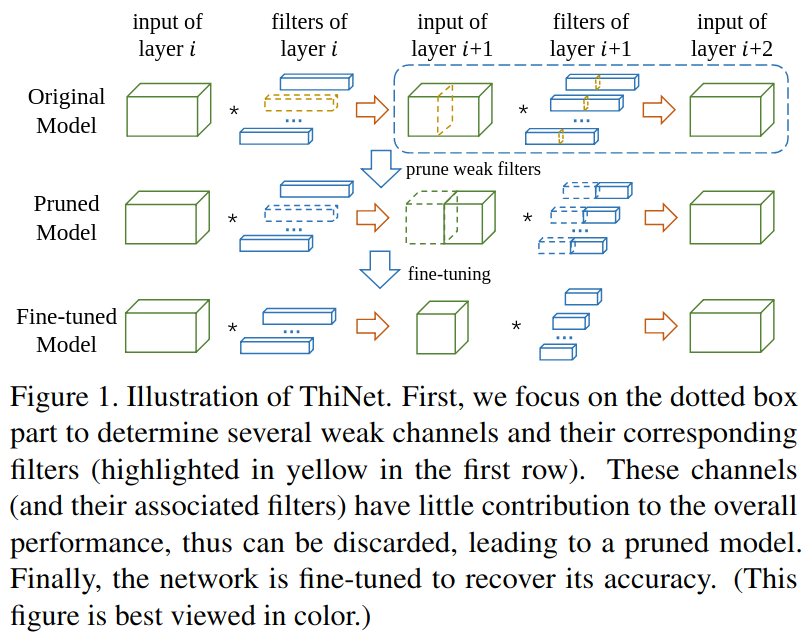

给定预先训练的模型，将以预定义的压缩率逐层修剪。我们总结了我们的框架如下：

1. Filter selection

    这里使用下一层来引导对本层的修剪, 关键性想法是: 如果可以用某一层的输入的一个子集代替原来的输入得到尽可能类似原来的输出的话，那么输入通道的该子集以外的通道可以被安全的移除.

    注意对于下一层而言, 它的输入的一个通道, 是由当前层的一个滤波器产生的, 因此, 我们可以安全的修剪对应的当前层的那个滤波器.

2. Pruning

    对于下一层的输入里作用小的通道和对应在本层中的滤波器, 将会被剪掉. 这可以得到更小的模型.

    注意, 这里在保留相同结构的基础上, 使用了更少的滤波器和通道. 换言之, 原始的宽网络变得更瘦了. 由此得名.

3. Fine-tuning

    微调是恢复滤波器修剪损坏的泛化能力的必要步骤。但是对于大型数据集和复杂模型那将需要很长时间。为了节省时间，我们在**每修剪一层后便微调一个或两个周期**。

    为了获得准确的模型，在修剪所有层结束时, 将执行更多的附加周期。

4. Iterate to step 1 to prune the next layer

### 为什么是安全的

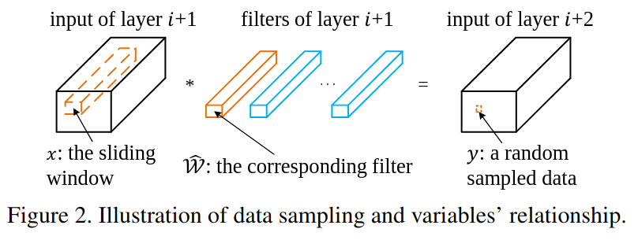

上图表示了卷积的过程, 要注意, 第一幅图中的红色的x区域与第二幅图中的红色的卷积核进行乘积之后, 得到的仅有右边图示第一层上的一个点的值. 一个卷积核对整个输入的扫描, 获得的是输出上的一层(通道)的结果.

首先考虑, 为什么删除一部分不重要的输入的通道, 可以认为是安全的.

对于上图所示例子:

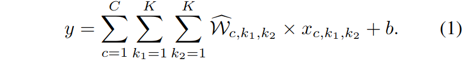

表示了这个卷积过程. 其中C表示通道数量, K表示方形感受野的边长, k1/k2遍历整个感受野的像素.

因为我们在考虑通道的问题, 所以可以进一步简化突出通道的运算的表示:

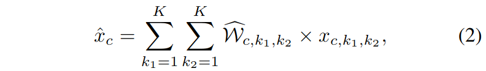

这里对通道之外的计算进行了一个替换, 转化为:

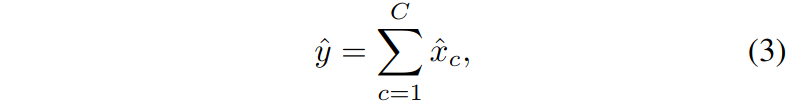

对于这里的运算, 要注意$\hat{y} = y - b$ , 可以看到, 各个通道之间的计算, 实际上是独立的, $\hat { x } _ { c }$仅依赖于$x _ { c , : , :}$, 与$x _ { c ^ { \prime } , :, :} (\ c ^ { \prime } \neq c)$无关.

这样, 若是找到一个子集, $S \subset \{ 1,2 , \ldots , C \}$, 那就可以对这个"修剪"后的运算表示为

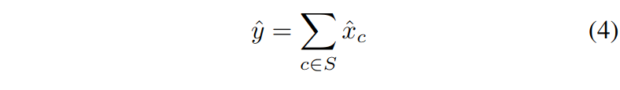

对于子集之外的输入通道, 就可以被安全删除, 而不改变CNN的结果.

当然，对于随机变量$\hat { \mathbf { x } } = \left( \hat { x } _ { 1 } , \hat { x } _ { 2 } , \ldots , \hat { x } _ { C } \right)$ 和 $\hat { y }$的所有实例，等式4并不总是对的。但是，我们可以手动提取它们的实例以寻找子集S, 使得等式4近似正确。

### 如何选择要删除的通道

首先对于给定一个m(表示图像数量和位置数量的乘积)个训练样本$\left\{ \left( \hat { \mathbf { x } } _ { i } , \hat { y } _ { i } \right) \right\}$的集合, 原始通道选择问题可以转化为如下表达的优化问题:

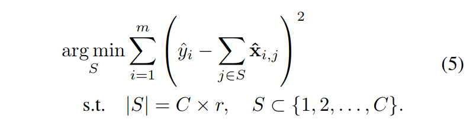

这里的$|S|$表示子集S的元素数量. $r$是预定义的压缩率(多少的通道被保留).

这里的公式表示, 最终的目标就是移除通道之后的部分输入产生的输出尽可能的与原始的输出相似, 也就是差值更小.

让T表示被移除的通道子集, 那么与S的并集就是整个输入的原始通道集合. 而且二者之间交集为空. 由此可以将问题转化为:

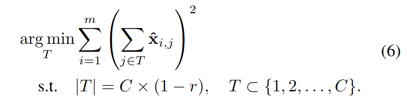

也就是让将式5的括号内的差值转化为被去掉的那部分的通道的对应的输出值(这是等价的), 进而问题转化为寻找使得这个被移除通道的输入对应的输出最小的通道集合. 这样的一个转化的好处是, 这里的T一般是小于S的, 可以使得计算更为迅速.

然而这里解决式5任然是一个[NP hard](http://www.matrix67.com/blog/archives/105)的问题, 因此这里使用了一个贪婪策略.

    对T中一次添加一个元素, 并且选择在当前迭代中, 导致目标函数最小的通道.

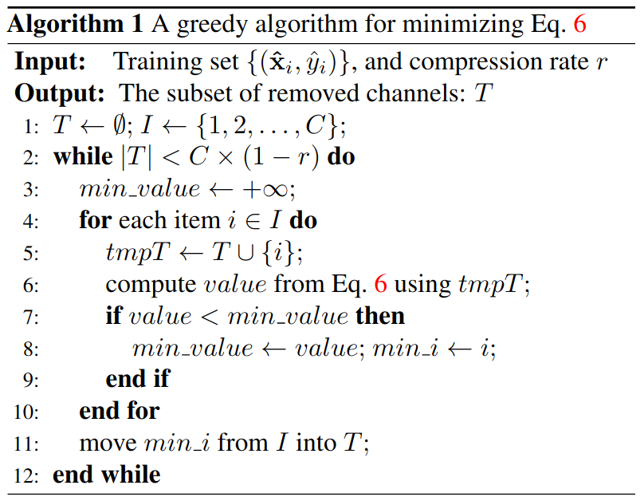

> 也就是说, 这里每次将这一轮中满足式子6为最小的通道(最优的结果)添加到T中, 不断迭代, 不断添加.这个确实很容易陷入到局部最优中.

显然，这种贪婪的解决方案是次优的。但是**差距可以通过微调来弥补**。我们还尝试了一些其他复杂的算法，例如稀疏编码（特别是同伦方法(homotopy method)[Fast solution of ℓ1-norm minimization problems when the solution may be sparse]）。然而，根据我们的实验，我们简单的贪婪方法具有更好的性能和更快的速度。

### 最大限度地减少重建错误

到目前为止，我们已经获得了子集T, 以至于第i+1层的每个滤波器中, 第n个通道可以被安全的删除, 如果$n∈T$的话。因此，前一层i中的相应滤波器也可以修剪。

现在将进一步最小化重构误差, 通过对通道加权, 这个可以被定义为:

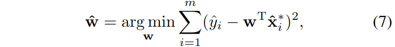

这里的$\hat { \mathbf { x } } _ { i } ^ { * }$表示被通道选择后的剩下的训练样本, 等式6是一个典型的线性回归问题, 这有一个使用普通最小二乘法(least squares approach)的独特的封闭式解决方案: $\hat { \mathbf { w } } = \left( \mathbf { X } ^ { \mathrm { T } } \mathbf { X } \right) ^ { - 1 } \mathbf { X } ^ { \mathrm { T } } \mathbf { y }$.

* [线性回归：贝叶斯观点](https://wiseodd.github.io/techblog/2017/01/05/bayesian-regression/)
* [线性回归需要满足哪些基本前提假设](http://sofasofa.io/forum_main_post.php?postid=1000313)
* [最小二乘线性回归的推导](http://sofasofa.io/forum_main_post.php?postid=1002489)
* [线性回归有精确的解析解为什么还要用梯度下降得到数值解？](http://sofasofa.io/forum_main_post.php?postid=1002094)

对于这里的$\hat { \mathbf { W } }$可以被看做是一个对应滤波器通道的放缩因子(例如$\mathcal { W } _ { : , i , : ; } = \hat { w } _ { i } \mathcal { W } _ { : , i , : }$).

从另一个角度来看，这种**缩放操作为微调提供了更好的初始化，因此网络更有可能达到更高的准确度**。

### 修剪策略

主要有两种不同的网络架构：传统的卷积/完全连接架构，以及最近的结构变体。前者由AlexNet或VGGNet代表，而后者主要包括一些最近的网络，如GoogLeNet和ResNet。

这两种类型的主要区别在于，最近的网络通常用全局平均池化层替换全连接层，并采用一些新的网络结构，如GoogLeNet中的Inception或ResNet中的残差块。

我们使用不同的策略来修剪这两种类型的网络。对于VGG-16，我们注意到前10个层（conv1-1到conv4-3）中存在90％以上的FLOP，而FC层贡献了近86.41％的参数。因此，为了加速考虑，我们修剪前10层，但用全局平均池层替换FC层。*虽然提出的方法对FC层也有效，但我们认为删除它们更简单，更有效*。

对于ResNet，由于其特殊的结构，存在一些限制。例如，同一组中每个块的通道数量需要保持一致才能完成求和操作（更多细节见）。因此，*很难直接修剪每个残余块的最后一个卷积层*。由于大多数参数位于前两层，因此修剪前两层是一个不错的选择，如图3所示。

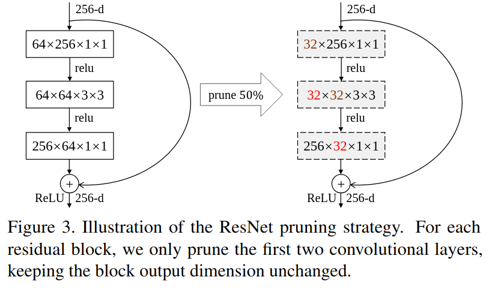

## Experiments

存在一些启发式标准来评估文献中每个过滤器的重要性。我们将选择方法与最近提出的两个标准进行比较，以证明我们的评估标准的有效性。这些标准简要总结如下：

* 权重和: 具有较小核权重的过滤器往往会产生较弱的激活。因此，在该策略中，每个滤波器的绝对和被计算作为其重要性分数: $s _ { i } = \sum | \mathcal { W } ( i , : , : , : ) |$
* 零值平均百分比: 此标准将**输出激活中每个通道的稀疏度**计算为其重要性分数：$s _ { i } = \frac { 1 } { | \mathcal { I } ( i , : , : ) | } \sum \sum \mathbb { I } ( \mathcal { I } ( i , : , : ) = = 0 )$, 这里的$| \mathcal { I } ( i , : , : ) |$是ReLU之后的张量$\mathcal { I }$的第i个通道里的元素数量. 这里的$\mathbb { I } ( \cdot )$表示指示函数.

为了比较这些不同的选择方法，我们在广泛使用的细粒度数据集上评估它们的性能：CUB-200，其包含11,788个200种不同鸟类的图像（分别为5994/5794图像用于训练/测试）。除标签外，不使用额外的监督信息（边界框）。遵循前面的修剪策略，VGG-16中的所有FC层都将被删除，并替换为全局平均池层，并对新数据集进行微调。**从这个微调模型开始，然后我们以不同的压缩率逐层修剪网络。每次修剪之后是一个周期的微调，并且在最后一层中执行12个时期以提高准确性**。使用不同的通道选择策略重复该过程若干次。

由于ThiNet的随机性，我们重复了4次方法并报告了平均结果。为了公平比较，除了选择方法之外，所有设置都保持不变。

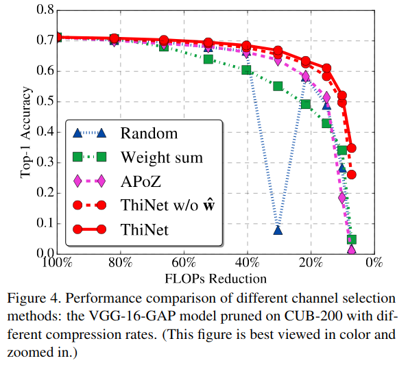

图4显示了CUB鸟类数据集上的修剪结果。我们还使用相同的修剪策略评估了随机选择的性能。

此外，另一个版本的ThiNet没有最小二乘（用"ThiNet w/o $\hat { \mathbf { w } }$"表示）也被评估以证明我们的方法中最小二乘法的有效性。显然，与其他选择方法相比，ThiNet实现了始终如一和显着更高的准确性。

一个有趣的结果是：随机选择显示出相当不错的性能，甚至在某些情况下甚至优于启发式标准。事实上，根据分布式表示的特性（每个概念由许多神经元表示; 并且，每个神经元参与许多概念的表示[Learning distributed representations of concepts]），随机选择的通道在理论上可能非常强大。但是，这个标准并不健全。如图4所示，它可能导致非常糟糕的结果，并且在压缩所有层之后精度非常低。因此，随机选择在实践中不适用。

权重和在CUB-200上的准确性非常差。这个结果是合理的，因为它只考虑了核权重的大小，这与最终的分类精度没有直接关系。

事实上，小权量仍可能对损失函数产生很大影响。当我们同时丢弃大量小型滤波器时，最终的精度会大大降低。

例如，如果使用小权重标准，我们将在conv1-1中的滤波器中删除60％的滤波器, 只有40.99％（在微调之前）的前1精度，而随机标准是51.26％。相比之下，我们的方法（ThiNet w/o w）可以达到68.24％，乃至70.75％(最小二乘法)。权重和的精度损失是如此之大，以至于微调不能完全从下降中恢复。

相比之下，我们的方法显示了更高和更强大的结果。**最小二乘方法确实有助于获得更好的权重初始化以进行微调**，尤其是当压缩率相对较高时。

### 对于模型进行修改

#### VGG

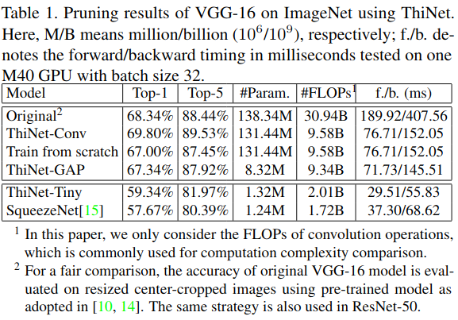

#### ResNet-50

Similar to VGG-16, we prune ResNet-50 from block 2a to 5c iteratively. Except for filters, the corresponding channels in batch-normalization layer are also discarded.

We prune this model with 3 different compression rates (preserve 70%, 50%, 30% fil-ters in each block respectively.

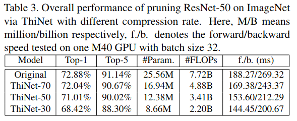

但是，减少的FLOP不能在ResNet中带来相同的加速度。**由于ResNet-50的结构限制，非张量层（批量标准化和池化层）占GPU上推理时间的40％以上**。因此，非常需要加速这些非张量层，这将在未来进行探索。

在本实验中，为简单起见，我们仅修剪ResNet中每个块的前两层，使块输出和投影快捷方式保持不变。修剪这些部件会导致进一步压缩，但即使不是完全不可能，也可能非常困难。这种探索似乎是未来工作的一个有希望的延伸。

### 修剪模型的领域适应能力(Domain adaptation ability of the pruned model)

ThiNset的一个主要优点是我们没有改变网络结构，因此在ImageNet上修剪的模型可以很容易地转移到其他领域。

为了帮助我们更好地理解这个好处，让我们考虑一个更实际的场景：在特定领域的数据集上获取一个小模型。这是实际应用中非常常见的要求，因为我们不会在实际应用中直接应用ImageNet模型。为了实现这一目标，有两种可行的策略：

* 从预先训练的ImageNet模型开始，然后修剪新数据集
* 从头开始训练小模型

在本节中，我们认为**如果我们微调已在ImageNet上压缩的已修剪模型，那将是一个更好的选择**。

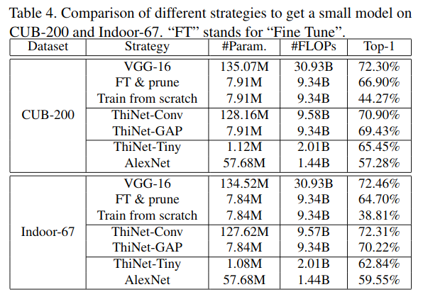

我们首先**在新数据集上微调预训练的VGG-16模型**，这是许多识别任务中采用的流行策略。正如我们所看到的，微调模型具有最高的精度，代价是巨大的模型尺寸和慢的推理速度。

然后，我们使用提出的ThiNet方法修剪一些不重要的过滤器（用“FT＆prune”表示），将繁琐的模型转换为更小的模型。对于小规模的训练样例，精度无法完全恢复，修剪后的模型很容易陷入糟糕的局部最小值。

但是，如果我们从头开始训练具有相同结构的网络，其准确性可以低得多。

我们建议微调ThiNet模型，**该模型首先使用ImageNet数据进行修剪。如表所示，该策略在模型大小和分类准确度之间取得了最佳平衡**。值得注意的是，ThiNet-Conv模型甚至可以获得与原始VGG-16类似的精度，但体积更小，速度更快。

我们还报告了ThiNet-Tiny在这两个数据集上的表现。虽然ThiNet-Tiny与ImageNet上的AlexNet具有相同的准确度，但它显示出更强的泛化能力。

这个小模型具有少于五十分之一的参数量, 当转移到特定领域任务时, 可以实现高于AlexNet3％~8％的分类精度。而且它的模型尺寸足够小，可以部署在资源受限的设备上

## Conclusion

在本文中，我们提出了一个统一的框架，即ThiNet，用于CNN模型的加速和压缩。所提出的过滤器级别修剪方法显示出对现有方法的显着改进。

在未来，我们希望修剪ResNet的快捷映射。另一种更好的通道选择方法也值得研究。此外，通过修剪网络对更多视觉任务（例如对象检测或语义分割）的广泛探索也是一个有趣的方向。修剪后的网络将极大地加速这些视觉任务。
