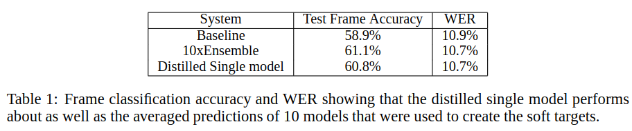
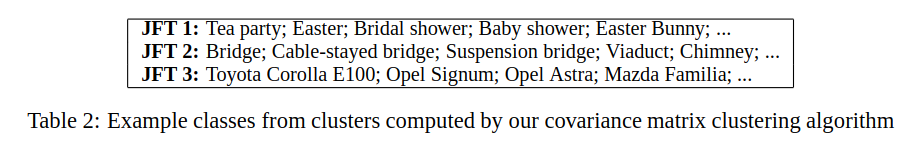
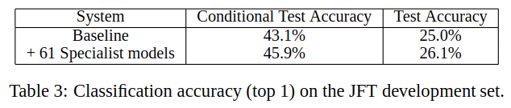
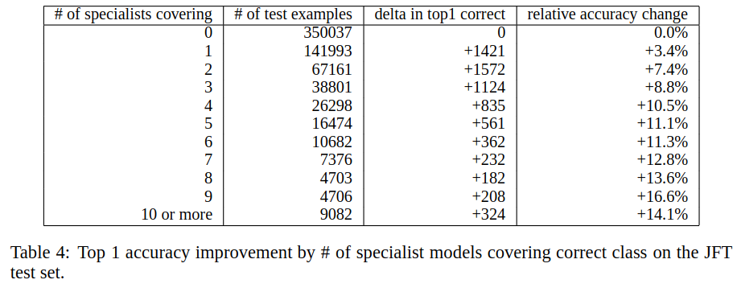
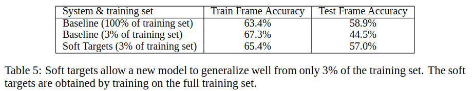

# Distilling the Knowledge in a Neural Network

> 论文: <https://arxiv.org/abs/1503.02531v1>

- [Distilling the Knowledge in a Neural Network](#Distilling-the-Knowledge-in-a-Neural-Network)
  - [Abstract](#Abstract)
  - [Introduction](#Introduction)
  - [Distillation](#Distillation)
    - [Matching logits is a special case of distillation](#Matching-logits-is-a-special-case-of-distillation)
  - [Preliminary experiments on MNIST](#Preliminary-experiments-on-MNIST)
  - [Experiments on speech recognition](#Experiments-on-speech-recognition)
    - [Results](#Results)
  - [Training ensembles of specialists on very big datasets](#Training-ensembles-of-specialists-on-very-big-datasets)
    - [The JFT dataset](#The-JFT-dataset)
    - [Specialist Models](#Specialist-Models)
    - [Assigning classes to specialists](#Assigning-classes-to-specialists)
    - [Performing inference with ensembles of specialists](#Performing-inference-with-ensembles-of-specialists)
    - [Results](#Results-1)
  - [Soft Targets as Regularizers](#Soft-Targets-as-Regularizers)
    - [Using soft targets to prevent specialists from overfitting](#Using-soft-targets-to-prevent-specialists-from-overfitting)
  - [Relationship to Mixtures of Experts](#Relationship-to-Mixtures-of-Experts)
  - [Discussion](#Discussion)
  - [补充内容](#补充内容)
    - [triphone](#triphone)
    - [梅尔刻度(Mel-scale)](#梅尔刻度Mel-scale)
  - [参考链接](#参考链接)

知识蒸馏（Knowledge Distilling）是模型压缩的一种方法，是指利用已经训练的一个较复杂的Teacher模型，指导一个较轻量的Student模型训练，从而在减小模型大小和计算资源的同时，尽量保持原Teacher模型的准确率的方法。这种方法受到大家的注意，主要是由于Hinton的论文Distilling the Knowledge in a Neural Network。

>@Naiyan Wang
>
> Knowledge Distill是一种简单弥补分类问题监督信号不足的办法。
>
> 传统的分类问题，模型的目标是将输入的特征映射到输出空间的一个点上，例如在著名的Imagenet比赛中，就是要将所有可能的输入图片映射到输出空间的1000个点上。这么做的话*这1000个点中的每一个点是一个one hot编码的类别信息*。这样**一个label能提供的监督信息只有log(class)这么多bit**。
>
> 然而在KD中，我们可以**使用teacher model对于每个样本输出一个连续的label分布，这样可以利用的监督信息就远比one hot的多了**。
>
> 另外一个角度的理解，大家可以想象如果只有label这样的一个目标的话，那么这个模型的目标就是把训练样本中每一类的样本强制映射到同一个点上，这样其实对于训练很有帮助的类内variance和类间distance就损失掉了。然而使用teacher model的输出可以恢复出这方面的信息。
>
> 具体的举例就像是paper中讲的，猫和狗的距离比猫和桌子要近，同时如果一个动物确实长得像猫又像狗，那么它是可以给两类都提供监督。.
>
> 综上所述，KD的核心思想在于"打散"原来压缩到了一个点的监督信息，让student模型的输出尽量match teacher模型的输出分布。其实要达到这个目标其实不一定使用teacher model，在数据标注或者采集的时候本身保留的不确定信息也可以帮助模型的训练。当然KD本身还有很多局限，比如当类别少的时候效果就不太显著，对于非分类问题也不适用。

> @周博磊
>
> 大模型通过传统的cross entropy loss，训练过程中其实是可以把训练数据里面类别之间的关联性信息学习出来。比如说在testing的时候，给张狗的图片，模型的output probability可能是狗0.9，猫0.09，卡车0.005，汽车0.005，图片更容易被错分到猫那一类。
>
> knowledge distillation的大致做法是把所有训练样本都再feeforward一遍训练好的大模型，那么原本图片样本的离散标定，就变为一个大模型预测出来的类别probability，这个probability更好地表征了类与类之间的相似性。
>
> 其实这可以看成是利用训练好的大模型对原始的标定空间进行了一次data augmentation（不过这个augmentation是发生在label space，而不是图片本身）。
>
> 这里论文里还提了对probability降低temperature等trick，其实是**想使得类与类之间的关联信息更明显**。
>
> 小模型因为有了大模型帮忙提取出的标定空间的更多关联信息，所以能更好的进行学习。可以预见，小模型的performance并不会超过大模型，但是会比原来在离散标定空间上面训练的效果好。

@YJango

> 什么是distillation (或者用Hinton的话说，dark knowledge）
>
> 1. 训练大模型：先用hard target，也就是正常的label训练大模型。
> 2. 计算soft target：利用训练好的大模型来计算soft target。也就是大模型“软化后”再经过softmax的output。
> 3. 训练小模型，在小模型的基础上再加一个额外的soft target的loss function，通过lambda来调节两个loss functions的比重。
> 4. 预测时，将训练好的小模型按常规方式（右图）使用。
>
> 
>
> * dropout是阻碍神经网络学习过多训练集pattern的方法
> * L2 regularization是强制让神经网络的所有节点均摊变体的方法。
> * pretrain和soft target的方式比较接近，是加入prior knowledge，降低搜索空间的方法。

---

## Abstract

A very simple way to improve the performance of almost any machine learning algorithm is to train many different models on the same data and then to average their predictions [3].

Unfortunately, making predictions using a whole ensemble of models is cumbersome(笨重的) and may be too computationally expensive to allow deployment to a large number of users, especially if the individual models are large neural nets.

Caruana and his collaborators [1] have shown that it is possible to compress the knowledge in an ensemble into a single model which is much easier to deploy and we develop this approach further using a different compression technique.

We achieve some surprising results on MNIST and we show that we can significantly improve the acoustic model of a heavily used commercial system by distilling the knowledge in an ensemble of models into a single model. We also introduce a new type of ensemble composed of one or more full models and many specialist models which learn to distinguish fine-grained classes that the full models confuse. Unlike a mixture of experts, these specialist models can be trainedrapidly and in parallel

提高几乎所有机器学习算法性能的一种非常简单的方法是在相同的数据上训练许多不同的模型，然后对它们的预测进行平均[3]。

不幸的是，使用整个模型集合进行预测是很麻烦的，并且可能在计算上太昂贵而无法部署到大量用户，特别是如果单个模型是大型神经网络。

Caruana和他的合作者[1]已经证明，有可能将整体中的知识压缩成一个更易于部署的单一模型，并且我们使用不同的压缩技术进一步开发这种方法。

我们在MNIST上取得了一些惊人的成果，我们表明，**通过将模型集合中的知识提炼到单个模型**中，我们可以显着改善大量使用的商业系统的声学模型。

我们还介绍了一种**由一个或多个完整模型和许多专业模型组成的新型集合，它们学会区分完整模型混淆的细粒度类**。与专家的混合体不同，这些专业模型可以快速且并行地进行训练

## Introduction

Many insects have a larval form that is optimized for extracting energy and nutrients from the environment and a completely different adult form that is optimized for the very different requirements of traveling and reproduction.

In large-scale machine learning, we typically use very similar models for the training stage and the deployment stage despite their very different requirements: For tasks like speech and object recognition, training must extract structure from very large, highly redundant datasets but it does not need to operate in real time and it can use a huge amount of computation.

Deployment to a large number of users, however, has much more stringent requirements on latency and computational resources. The analogy with insects suggests that we should be willing to train very cumbersome models if that makes it easier to extract structure from the data. The cumbersome model could be an ensemble of separately trained models or a single very large model trained with a very strong regularizer such as dropout [9]. Once the cumbersome model has been trained, we can then use a different kind of training, which we call “distillation” to transfer the knowledge fromthe cumbersome model to a small model that is more suitable for deployment. A version of thisstrategy has already been pioneered by Rich Caruana and his collaborators [1]. **In their important paper they demonstrate convincingly that the knowledge acquired by a large ensemble of models can be transferred to a single small model.**

许多昆虫具有幼虫形式，其优化用于从环境中提取能量和营养物，以及完全不同的成体形式，其针对旅行和繁殖的非常不同的要求进行了优化。在大规模机器学习中，我们通常在训练阶段和部署阶段使用非常相似的模型，尽管它们的要求非常不同：对于语音和对象识别等任务，训练必须从非常大，高度冗余的数据集中提取结构，但它不会需要实时操作，它可以使用大量的计算。然而，对大量用户的部署对延迟和计算资源有更严格的要求。

与昆虫的类比表明，如果能够更容易地从数据中提取结构，我们应该愿意训练非常繁琐的模型。繁琐的模型可以是单独训练的模型的集合，也可以是使用非常强的正则化器（例如辍学）训练的单个非常大的模型[9]。

一旦训练了繁琐的模型，我们就可以使用不同类型的训练，我们称之为“蒸馏”，*将知识从繁琐的模型转移到更适合部署的小模型*。这种策略的一个版本已经由Rich Caruana及其合作者开创了[1]。 **在他们的重要论文中，他们令人信服地证明，大型模型集合所获得的知识可以转移到一个小型模型中。**

A conceptual block that may have prevented more investigation of this very promising approach is that we tend to identify the knowledge in a trained model with the learned parameter values and this makes it hard to see how we can change the form of the model but keep the same knowledge. A more abstract view of the knowledge, that frees it from any particular instantiation, is that it is a learned mapping from input vectors to output vectors.

一个概念的障碍, 可能已经阻碍了这个非常有前景的方法的探索, 这也是我们倾向于使用学习的参数值来识别训练模型中的知识，这使我们很难看到如何改变模型的形式但是保持相同的知识。从任何特定实例中释放知识的更抽象的视图是它是**从输入向量到输出向量的学习到的映射**。

For cumbersome models that learn to discriminate between a large number of classes,  the normal training objective is to maximize the average logprobability of the correct answer, but a side-effect of the learning is that the trained model assigns probabilities to all of the incorrect answers and even when these probabilities are very small, some of them are much larger than others. The relative probabilities of incorrect answers tell us a lot about how the cumbersome model tends to generalize.

对于学习区分大量类别的繁琐模型，正常的训练目标是最大化正确答案的平均对数概率，但**学习的副作用是训练的模型为所有不正确的答案分配概率, 即使这些概率非常小，其中一些比其他概率大得多**。不正确答案的相对概率告诉我们很多关于繁琐模型如何泛化的信息。

An image of a BMW, for example, may only havea very small chance of being mistaken for a garbage truck, but that mistake is still many times more probable than mistaking it for a carrot.

例如，宝马的图像可能只有很小的机会被误认为是垃圾车，但这种错误仍然比将其误认为胡萝卜的可能性高很多倍。

It is generally accepted that the objective function used for training should reflect the true objective of the user as closely as possible. Despite this, models are usually trained to optimize performance on the training data when the real objective is to generalize well to new data.  It would clearly be better to train models to generalize well, but **this requires information about the correct way to generalize and this information is not normally available**.

人们普遍认为，用于训练的目标函数应尽可能地反映用户的真实目标。尽管如此，当真正的目标是很好地泛化到新数据时，通常训练模型以优化训练数据的性能。显然可以更好地训练模型进行泛化，但**这需要有关正确泛化方法的信息，而且这些信息通常不可用**。

When we are distilling the knowledge from a large model into a small one, however, we can train the small model to generalize in the same way as the large model.  If the cumbersome model generalizes well, because, for example, it is the average of a large ensemble of different models, a small model trained to generalize in the same way will typically do much better on test data than a small model that is trained in the normal way on the same training set as was used to train the ensemble.

然而，当我们将大型模型中的知识提炼成小型模型时，我们可以训练小模型以与大型模型相同的方式进行泛化。如果繁琐的模型很好地泛化，因为，例如，它是不同模型的大集合的平均值，*训练以相同方式进行泛化的小模型通常在测试数据上比按照正常方式在相同的训练集上受过训练的小模型上做得更好*。与用于训练整体的训练集相同的正常方式。

An obvious way to transfer the generalization ability of the cumbersome model to a small model is to use the class probabilities produced by the cumbersome model as “soft targets” for training the small model.

将繁琐模型的泛化能力转移到小模型的一种显而易见的方法是**使用由繁琐模型产生的类概率作为训练小模型的“软目标”**。

For this transfer stage, we could use the same training set or a separate “transfer” set. When the cumbersome model is a large ensemble of simpler models, we can use an arithmetic or geometric mean of their individual predictive distributions as the soft targets.

对于此转移阶段，我们可以使用相同的训练集或单独的“转移”集。*当繁琐的模型是一个较大的简单模型集合时，我们可以使用其各自预测分布的算术或等距平均值作为软目标*。

When the soft target shave high entropy, they provide much more information per training case than hard targets and much less variance in the gradient between training cases, so the small model can often be trained on much less data than the original cumbersome model and using a much higher learning rate.

将繁琐模型的泛化能力转移到小模型的一种显而易见的方法是使用由笨重模型产生的类概率作为训练小模型的“软目标”。对于此转移阶段，我们可以使用相同的训练集或单独的“转移”集。当繁琐的模型是较大的简单模型集合时，我们可以使用其各自预测分布的算术或几何平均值作为软目标。当软目标具有高熵时，它们为每个训练案例提供的信息远多于硬目标，并且在训练案例之间梯度的变化更小，因此小模型通常可以在比原始繁琐模型少得多的数据上训练并使用更高的学习率。

For tasks like MNIST in which the cumbersome model almost always produces the correct answer with very high confidence, much of the information about the learned function resides in the ratios of very small probabilities in the soft targets. For example,  one version of a 2 may be given aprobability of $10^{−6}$ of being a 3 and $10^{−9}$ of being a 7 whereas for another version it may be the other way around. This is valuable information that defines arich similarity structure over the data(i.  e.it says which 2’s look like 3’s and which look like 7’s) but it has very little influence on the cross-entropy cost function during the transfer stage because the probabilities are so close to zero. Caruana and his collaborators circumvent this problem by using the logits (the inputs to the final softmax) rather than the probabilities produced by the softmax as the targets for learning the small model and they minimize the squared difference between the logits produced by the cumbersome model and the logits produced by the small model.

Our more general solution, called “distillation”,is to raise the temperature of the final softmax until the cumbersome model produces a suitably soft set of targets. We then use the same high temperature when training the small model to match these soft targets. We show later that matching the logits of the cumbersome model is actually a special case of distillation.

对于像MNIST这样的任务，其中繁琐的模型几乎总能以非常高的信度产生正确的答案，关于学习函数的大部分信息都存在于软目标中非常小的概率的比率中。例如，2的一个版本可以被赋予3的概率为$10^{−6}$，而7为$10^{−9}$，而对于另一个版本，它可能是另一种方式。这是有价值的信息，它定义了数据的丰富相似性结构（即它表示哪个2看起来像3，哪个看起来像7），但它在转移阶段对交叉熵成本函数的影响非常小，因为概率是如此接近于零。Caruana和他的合作者通过**使用logits（最终softmax的输入）来解决这个问题，而不是用softmax产生的概率作为学习小模型的目标**，并且他们最小化了繁琐模型产生的logits和小模型产生的logits之间的平方差异。

我们更通用的解决方案，称为“蒸馏”，是提高最终softmax的温度，直到笨重的模型产生适当柔软的目标组。然后我们在训练小模型时使用相同的高温来匹配这些软目标。我们后来表明，匹配繁琐模型的logits实际上是一个特殊的蒸馏情况。

The transfer set that is used to train the small model could consist entirely of unlabeled data [1]or we could use the original training set.  We have found that using the original training set workswell, especially if we add a small term to the objective function that encourages the small model to predict the true targets as well as matching the soft targets provided by the cumbersome model. Typically, the small model cannot exactly match the soft targets and erring in the direction of the correct answer turns out to be helpful.

用于训练小模型的传递集可以完全由未标记的数据组成[1]，或者我们可以使用原始训练集。我们发现**使用原始训练集效果很好**，特别是如果我们在目标函数中添加一个小项，鼓励小模型预测真实目标以及匹配繁琐模型提供的软目标。通常，小模型不能与软目标完全匹配，并且在正确答案的方向上犯错是有帮助的。

## Distillation

神经网络通常通过使用“softmax”输出层产生类概率，该输出层转换logit zi(通过将zi与其他logits进行比较, 来为每个类计算概率qi)。

这里的T是一个温度, 通常被设为1. 使用一个高一点的T, 将产生一个更为柔软的类别概率分布.

In the simplest form of distillation, knowledge is transferred to the distilled model by training it ona transfer set and using a soft target distribution for each case in the transfer set that is produced byusing the cumbersome model with a high temperature in its softmax. The same high temperature isused when training the distilled model, but after it has beentrained it uses a temperature of 1.

在最简单的蒸馏形式中，通过在转移集上训练知识并将转移集中的每个案例使用软目标分布，将知识转移到蒸馏模型，该转移集通过使用其softmax中具有高温的繁琐模型产生。训练蒸馏模型时使用相同的高温，但被训练之后, 使用温度为1.

When the correct labels are known for all or some of the transfer set, this method can be significantly improved by also training the distilled model to produce the correct labels.

One way to do this is to use the correct labels to modify the soft targets, but we found that **a better way is to simply use a weighted average of two different objective functions**.

* The first objective function is the cross entropy with the soft targets and this cross entropy is computed using the same high temperature in the softmax of the distilled model as was used for generating the soft targets from the cumbersome model.
* The second objective function is the cross entropy with the correct labels. This is computed using exactly the same logits in softmax of the distilled model but at a temperature of 1.

We found that thed best results were generally obtained by using a condiderably lower weight on the second objective function. Since the magnitudes of the gradients produced by the soft targets scale as $1/T^2$ it is important to multiply them by $T^2$ when using both hard and soft targets.

This ensures that the relative contributions of the hard and soft targets remain roughly unchanged if the temperature used for distillation is changed while experimenting with meta-parameters

当已知所有或部分转移集的正确标签时，通过训练蒸馏模型以产生正确的标签，可以显着改善该方法。一种方法是使用正确的标签来修改软目标，但我们发现更好的方法是简单地使用两个不同目标函数的加权平均值。

* 第一个目标函数是具有软目标的交叉熵，并且使用与用于从笨重模型生成软目标的蒸馏模型的softmax中相同的高温来计算该交叉熵。
* 第二个目标函数是具有正确标签的交叉熵。这是使用蒸馏模型的softmax中的完全相同的logits计算的，但温度为1。

我们发现通常通过在第二目标函数上使用可忽略不计的较低权重来获得最佳结果。**由于软目标产生的梯度的大小按比例缩放为$1/T^2$，因此在使用硬目标和软目标时，将它们乘以非常重要$T^2$**。这确保了如果在试验元参数时改变用于蒸馏的温度，则硬和软目标的相对贡献保持大致不变。

### Matching logits is a special case of distillation

Each case in the transfer set contributes a cross-entropy gradient, $dC/dz_i$, with  respect to  each logit, $z_i$ of the distilled model. If the cumbersome model has logits $v_i$ which produce soft target probabilities $p_i$ and the transfer training is done at a temperature of $T$, this gradient is given by:

在转换数据集中的每一个样本偶在贡献着一个交叉熵梯度, $\frac{\partial C}{\partial z_i}$, 相对于每个logit, 蒸馏模型的$z_i$. 繁琐模型的logits $v_i$ 产生软目标 $p_i$ 和转换训练的温度参数 $T$.

由于存在温度参数T, 对总的损失微分后, 会相较于原始的$\frac{\partial C}{\partial z_i/T}$多出来一个$1/T$($\frac{\partial (z_i/T)}{\partial z_i}$).

由于已有的对数概率为: $p_i = \frac{\exp(v_i/T)}{\sum_j \exp(v_j/T)}$ 和 $q_i = \frac{\exp(z_i/T)}{\sum_j \exp(z_j/T)}$

最终得到:

$$
\begin{aligned}
\frac{\partial C}{\partial z_i/T} &= - p_i\frac{1}{q_i}q_i(1-q_i) + \sum_{j=1, j\neq i}^{K}p_j\frac{1}{q_j}q_iq_j  \\
&= -p_i + p_iq_i + \sum_{j=1, j\neq i}^K p_jq_i \\
&= q_i -p_i
\end{aligned}
$$

带入数据得到:

$$\frac { \partial C } { \partial z _ { i } } = \frac { 1 } { T } \left( q _ { i } - p _ { i } \right) = \frac { 1 } { T } \left( \frac { e ^ { z _ { i } / T } } { \sum _ { j } e ^ { z _ { j } / T } } - \frac { e ^ { v _ { i } / T } } { \sum _ { j } e ^ { v _ { j } / T } } \right)$$

当温度T参数很大的时候, 可以使用近似代换(可以由泰勒展开式得知近似公式):

$$\frac { \partial C } { \partial z _ { i } } \approx \frac { 1 } { T } \left( \frac { 1 + z _ { i } / T } { N + \sum _ { j } z _ { j } / T } - \frac { 1 + v _ { i } / T } { N + \sum _ { j } v _ { j } / T } \right)$$

当假定为零均值的样本的时候:

$$\sum _ { j } z _ { j } = \sum _ { j } v _ { j } = 0$$

可以简化为:

$$\frac { \partial C } { \partial z _ { i } } \approx \frac { 1 } { N T ^ { 2 } } \left( z _ { i } - v _ { i } \right)$$

So in the high temperature limit, distillation is equivalent to minimizing $1/2(z_i−v_i)^2$, provided the logits are zero-meaned separately for each transfer case.

因此在高温度限制的时候, 提供分别对每个转化用例零均值的logits时, 蒸馏模型就可以等价为最小化$1/2(z_i−v_i)^2$, 因为$\frac { \partial C } { \partial z _ { i }} \approx \frac { \partial 1/2(z_i−v_i)^2 } { \partial z _ { i }}$

At lower temperatures, distillation pays much less attention to matching logits that are much more negative than the average.

This is potentially advantageous because these logits are almost completely unconstrained by the cost function used for training the cumbersome model so they could be very noisy.

On the other hand, the very negative logits may convey useful information about the knowledge acquired by the cumbersome model. Which of these effects dominates is an empirical question. We show that when the distilled model is much too small to capture all of the knowledege in the cumbersome model, intermediate temperatures work best which strongly suggests that ignoring the large negative logits can be helpful.

在较低的温度下，蒸馏对比平均值更负的matching logits更少关注。这是潜在有利的，因为这些logits几乎完全不受用于训练繁琐模型的成本函数的限制，因此它们可能非常嘈杂。

另一方面，非常负的logits可以传达关于由繁琐模型获取的知识的有用信息。这些影响中的哪一个主导是一个经验问题。我们表明，当蒸馏模型太小而无法捕获繁琐模型中的所有知识时，中间温度效果最好，这强烈暗示忽略大的负对数可能是有帮助的。

> 不太理解

## Preliminary experiments on MNIST

To see how well distillation works,  we  trained  a  single  large neural net with  two  hidden layers of 1200 rectified linear hidden units on all 60,000 training cases.
The net was strongly regularized using dropout and weight-constraints as described in [5]. Dropout can be viewed as a way of training an exponentially large ensemble of models that share weights. In addition, the input images were jittered by up to two pixels in any direction.

为了了解蒸馏的工作情况，我们在所有60,000个训练案例中训练了一个单独的大型神经网络，其中有两个隐藏的1200个ReLU隐藏单元层。如[5]中所述，使用Dropout和权重约束强烈地进行了正则化。Dropout可以被视为一种训练共享权重的指数级大型模型集合的方法。此外，输入图像在任何方向上都被最多两个像素抖动。

This net achieved 67 test errors where as a smaller net with two hidden layers of 800 rectified linear hidden units and no regularization achieved 146 errors. But if the smaller net was regularized solely by adding the additional task of matching the soft targets produced by the large net at a temperature of 20, it achieved 74 test errors. This shows that soft targets can transfer a great deal of knowledge to the distilled model, including the knowledge about how to generalize that is learned from translated training data even though the transfer set does not contain any translations.

该网络实现了67个测试错误，其中较小的网络具有800个整流线性隐藏单元的两个隐藏层，并且没有正规化会实现146个错误。但是，如果较小的网络仅通过在20的温度下增加匹配大网络产生的软目标的附加任务来规范化，则实现了74个测试误差。这表明软目标可以将大量知识传递给蒸馏模型，包括从翻译的训练数据中学习如何概括知识，即使传输集不包含任何翻译。

When the distilled net had 300 or more units in each of its two hidden layers, all temperatures above 8 gave fairly similar results. But when this was radically reduced to 30 units per layer, temperatures in the range 2.5 to 4 worked significantly better than higher or lower temperatures. We then tried omitting all examples of the digit 3 from the transfer set. So from the perspective of the distilled model, 3 is a mythical digit that it has never seen. Despite this, the distilled model only makes 206 test errors of which 133 are on the 1010 threes in the test set. Most of the errors are caused by the fact that the learned bias for the 3 class is much too low. If this bias is increased by 3.5 (which optimizes overall performance on the test set), the distilled model makes 109 errors of which 14 are on 3s.

当蒸馏网络在其两个隐藏层中的每一个中具有300个或更多个单元时，所有高于8的温度给出相当类似的结果。
但是当每层急剧减少到30个单位时，2.5到4范围内的温度明显好于更高或更低的温度。然后，我们尝试省略转移数据集中的数字"3"的所有示例。因此，从蒸馏模型的角度来看，"3"是一个从未见过的神秘数字。尽管如此，蒸馏模型仅产生206个测试错误，其中133个在测试集中的1010个"3"上。大多数错误是由于"3"这类的学习偏置太低而引起的。如果这个偏置增加3.5（这可以优化测试装置的整体性能），蒸馏模型会产生109个错误，其中14个错误在"3"上。

> 偏置怎么增加

So with the right bias, the distilled model gets 98.6% of the test 3s correct despite never having seen a 3 during training. If the transfer set containsonly the 7s and 8s from the training set, the distilled model makes 47.3% test errors, but when the biases for 7 and 8 are reduced by 7.6 to optimize test performance, this falls to 13.2% test errors.

因此，在正确的偏置下，尽管在训练期间从未见过3，但蒸馏模型在测试"3"时, 得到98.6％的是正确的。如果转移数据集仅包含训练集中的"7"和"8"，则蒸馏模型的测试误差为47.3％，但当"7"和"8"的偏差减小7.6以优化测试性能时，测试误差降至13.2％。

## Experiments on speech recognition

In this section, we investigate the effects of ensembling Deep Neural Network (DNN) acoustic models(声学模型) that are used in Automatic Speech Recognition (ASR). We show that the distillation strategy that we propose in this paper achieves the desired effect of **distilling an ensemble of models into a single model that works significantly better than a model of the same size that is learned directly from the same training data**.

State-of-the-art ASR systems currently use DNNs to map a (short) temporal context of features derived from the waveform to a probability distribution over the discrete states of a Hidden Markov Model (HMM).

More specifically, the DNN produces a probability distribution over clusters of tri-phone states at each time and a decoder then finds a path through the HMM states that is the best compromise between using high probability states and producing a transcription that is probable under the language model.

Although it is possible (and desirable) to train the DNN in such a way that the decoder (and, thus, the language model) is taken into account by marginalizing over all possible paths, it is common to train the DNN to perform frame-by-frame classification by (locally) minimizing the cross entropy between the predictions made by the net and the labels given by a forced alignment with the groundtruth sequence of states for each observation:

在本节中，我们将研究用于自动语音识别（ASR）的集成深度神经网络（DNN）声学模型的效果。我们表明，我们在本文中提出的蒸馏策略实现了将模型集合提取到单个模型中的预期效果，**该模型比直接从相同训练数据学习的相同大小的模型更好地工作**。

现有技术的ASR系统当前使用DNN将从波形导出的特征的（短）时间上下文映射到隐马尔可夫模型（HMM）的离散状态上的概率分布。更具体地说，DNN每次在triphone states(可见补充内容)的簇上产生概率分布，然后解码器找到通过HMM状态的路径，这是在这样的语言模型下, 使用高概率状态和产生在语言下可能的转录之间的最佳折衷。

虽然可以（并且希望）以这样的方式训练DNN，即通过边缘化所有可能的路径来考虑解码器（并且因此语言模型），但是通常训练DNN执行帧 - 通过（局部）最小化网络做出的预测与通过强制对准每个观察的地面序列状态给出的标签之间的交叉熵进行框架分类：

$$
\boldsymbol { \theta } = \arg \max _ { \boldsymbol { \theta } ^ { \prime } } P \left( h _ { t } | \mathbf { s } _ { t } ; \boldsymbol { \theta } ^ { \prime } \right)
$$

where θ are the parameters of our acoustic model P which maps acoustic observations at time $t, s_t$, to a probability, $P(h_t|s_t;θ^′)$, of the “correct” HMM state $h_t$, which is determined by a force dalignment with the correct sequence of words. The model is trained with a distributed stochastic gradient descent approach.

其中θ是我们的声学模型P的参数，它将时间$t，s_t$的声学观测值映射到“正确的”HMM状态$h_t$的概率$P(h_t | s_t;θ^')$，这是由一个强制对齐正确的单词序列决定的。该模型采用分布式随机梯度下降法进行训练。

We use an architecture with 8 hidden layers each containing 2560 rectified linear units and a final softmax layer with 14,000 labels (HMM targets $h_t$). The input is 26 frames of 40 Mel-scaled filterbank coefficients with a 10ms advance per frame and we predict the HMM state of $21^{st}$ frame. The total number of parameters is about 85M.

This is a slightly outdated version of the acoustic model used by Android voice search, and should be considered as a very strong baseline.

To train the DNN acoustic model we use about 2000 hours of spoken English data, which yields about 700M training examples. This system achieves a frame accuracy of 58.9%, and a Word Error Rate (WER) of 10.9% on our development set.

我们使用一个具有8个隐藏层的架构，每个层包含2560个整流线性单元，最终的softmax层包含14,000个标签（HMM目标$h_t$）。输入是26帧40个梅尔刻度(又称Mel尺度, 可见补充内容)滤波器组系数，每帧提前10ms，我们预测$21^{st}$帧的HMM状态。参数总数约为85M。

这是Android语音搜索使用的声学模型稍微过时的版本，应该被视为非常强大的基线。

为了训练DNN声学模型，我们使用大约2000小时的英语口语数据，产生大约7亿个训练样例。该系统在我们的开发设备上实现了58.9％的帧精度和10.9％的字错误率（WER）。

### Results

We trained 10 separate models to predict $P(h_t|s_t;θ)$, using exactly the same architecture and training procedure as the baseline.

The models are randomly initialized with different initial parameter values and we find that **this creates sufficient diversity in the trained models to allow the averaged predictions of the ensemble to significantly outperform the individual models**.

We have explored adding diversity to the models by varying the sets of data that each model sees, but we found this to not significantly change our results, so we opted for the simpler approach.

For the distillation we tried temperatures of [1,2,5,10] and used a relative weight of 0.5 on the crossentropy for the hard targets, where bold font indicates the best value that was used for table 1.

我们使用与基线完全相同的架构和训练程序训练了10个单独的模型来预测$P(h_t|s_t;θ)$。 使用不同的初始参数值随机初始化模型，我们发现**这在训练模型中创建了足够的多样性，以允许整体的平均预测明显优于单个模型**。

我们已经通过改变每个模型看到的数据集来探索为模型添加多样性，但我们发现这不会显着改变我们的结果，因此我们选择了更简单的方法。

对于蒸馏，我们尝试了[1,2,5,10]的温度，并且在hard targets的交叉熵上使用相对权重0.5，其中粗体字表示用于表1的最佳值。

Table 1 shows that, indeed, our distillation approach is able to extract more useful information from the training set than simply using the hard labels to train a single model. More than 80% of the improvement in frame classification accuracy achieved by using an ensemble of 10 models is transferred to the distilled model which is similar to the improvement we observed in our preliminary experiments on MNIST.

表1显示，实际上，我们的蒸馏方法能够从训练集中提取更多有用的信息，而不仅仅是使用硬标签来训练单个模型。使用10个模型的集合实现的框架分类精度的提升的80％以上被转移到蒸馏模型，这类似于我们在MNIST的初步实验中观察到的改进。

The ensemble gives a smaller improvement on the ultimate objective of WER (on a 23K-word test set) due to the mismatch in the objective function, but again, the improvement in WER achieved by the ensemble is transferred to the distilled model.

We have recently become aware of related work on learning a small acoustic model by matching the class probabilities of an already trained larger model [8]. However, they do the distillation at a temperature of 1 using a large unlabeled dataset and their best distilled model only reduces the error rate of the small model by 28% of the gap between the error rates of the large and small models when they are both trained with hard labels.

由于目标函数的不匹配，该集合对WER的最终目标（在23K字测试集上）进行了较小的改进，但同样，集合所实现的WER的改善被转移到蒸馏模型。

我们最近通过匹配已经训练过的大型模型的类概率来了解有关学习小型声学模型的相关工作[8]。

然而，他们使用大的未标记数据集在1的温度下进行蒸馏，并且当它们被用hard labels训练时, 他们的最佳蒸馏模型仅将小模型的错误率降低了大型和小型模型的错误率之间差距的28％.

## Training ensembles of specialists on very big datasets

Training an ensemble of models is a very simple way to take advantage of parallel computation and the usual objection that an ensemble requires too much computation at test time can be dealt with by using distillation.

There is, however, another important objection to ensembles: If the individual models are large neural networks and the dataset is very large, the amount of computation required at training time is excessive, even though it is easy to parallelize.

In this section we give an example of such a dataset and we show **how learning specialist models that each focus on a different confusable subset of the classes can reduce the total amount of computation required to learn an ensemble**.

The main problem with specialists that **focus on making fine-grained distinctions is that they overfit very easily** and we describe how this overfitting may be prevented by using soft targets.

训练一组模型是利用并行计算的一种非常简单的方法，通常的反对意见是集合在测试时需要太多的计算，可以通过使用蒸馏来处理。

然而，对于模型集成还有另一个重要的反对意见：*如果单个模型是大型神经网络并且数据集非常大，则训练时所需的计算量过多，即使它很容易并行化*。

在本节中，我们给出了这样一个数据集的例子，我们展示了**学习专家模型如何着重于类别中的不同的可混淆子集, 可以减少学习集成模型所需的总计算量**。

**专注于制作细粒度区别的专家模型的主要问题是它们非常容易过度拟合**, 我们描述了如何通过使用软目标来防止这种过度拟合。

### The JFT dataset

JFT is an internal Google dataset that has 100 million labeled images with 15,000 labels. When we did this work, Google’s baseline model for JFT was a deep convolutional neural network that had been trained for about six months using asynchronous stochastic gradient descent on a large number of cores.

This training used two types of parallelism.

JFT是一个内部Google数据集，拥有1亿个带有15,000个标签的带标签图像。当我们完成这项工作时，Google的JFT基线模型是一个深度卷积神经网络，在大量核心上使用异步随机梯度下降训练了大约六个月。该训练使用了两种类型的并行性。

* First, there were many replicas of the neural net running on different sets of cores and processing different mini-batches from the training set. Each replica computes the average gradient on its current mini-batch and sends this gradient to a sharded parameter server which sends back new values for the parameters. These new values reflect all of the gradients received by the parameter server since the last time it sent parameters to the replica. 首先，有许多神经网络的复制品在不同的核心集合上运行，并处理来自训练集的不同小批量数据。每个副本计算其当前小批量的平均梯度，并将此梯度发送到共享参数服务器，该服务器发回参数的新值。这些新值反映了自上次将参数发送到副本以来参数服务器接收的所有梯度。
* Second, each replica is spread over multiple cores by putting different subsets of the neurons on each core. 其次，通过在每个核心上放置不同的神经元子集，将每个副本分布在多个核心上。

Ensemble training is yet a third type of parallelism that can be wrapped around the other two types, but only if a lot more cores are available. Waiting for several years to train an ensemble of models was not an option, so we needed a much faster way to improve thebaseline model.

集合训练是第三种类型的并行性，可以围绕其他两种类型进行，但只有在有更多核心可用的情况下才能进行。等待几年来训练一组模型不是一种选择，因此我们需要一种更快的方法来改进基线模型。

### Specialist Models

When the number of classes is very large, it makes sense for the cumbersome model to be an ensemble that contains one generalist model trained on all the data and many “specialist” models, each of which is trained on data that is highly enriched in examples from a very confusable subset of the classes (like different types of mushroom). The softmax of this type of specialist can be made much smaller by combining all of the classes it does not care about into a single dustbin class.

To reduce overfitting and share the work of learning lower level feature detectors, each specialist model is initialized with the weights of the generalist model. These weights are then slightly modified by training the specialist with half its examples coming from its special subset and half sampled at random from the remainder of the training set. After training, we can correct for the biased training set by incrementing the logit of the dustbin class by the log of the proportion by which the specialist class is oversampled.

当类的数量非常大时，将繁琐的模型作为一个集合是有意义的，该集合包含一个在所有数据和许多“专家”模型上训练的"通才模型"，每个模型都训练在来自一个非常容易混淆的类子集（如不同类型的蘑菇）的高度丰富的样本的数据. 通过将不关心的所有类别组合到单个垃圾箱类中，可以使这种类型的专家的softmax小得多。

为了减少过度拟合并分享学习低级特征检测器的工作，每个专家模型都使用通才模型的权重进行初始化。然后通过训练专家来稍微修改这些权重，其中一半的例子来自其特殊子集，一半从训练集的其余部分随机抽样。 在训练之后，我们可以通过将专家类过采样的比例的对数增加到垃圾箱类别的logit来校正偏差训练集。

### Assigning classes to specialists

In order to derive groupings of object categories for the specialists, we decided to focus on categories that our full network often confuses. Even though we could have computed the confusion matrix and used it as a way to find such clusters, we opted for a simpler approach that does not require the true labels to construct the clusters.

In particular, we apply a clustering algorithm to the covariance matrix of the predictions of our generalist model, so that a set of classes $S^m$ that are often predicted together will be used as targets for one of our specialist models, m.

We applied an online version of the K-means algorithm to the columns of the covariance matrix, and obtained reasonable clusters (shown in Table 2).

We tried several clustering algorithms which produced similar results.

为了获得专家对象类别的分组，我们决定关注我们的完整网络经常混淆的类别。 尽管我们可以计算混淆矩阵并将其用作查找此类聚类的方法，但我们选择了一种更简单的方法，它不需要真正的标签来构建聚类。

特别地，我们将聚类算法应用于我们通才模型的预测的协方差矩阵，因此通常一起预测的一组类$S^m$将被用作我们的一个专家模型的目标，m。我们将K-means算法的在线版本应用于协方差矩阵的列，并获得了合理的聚类（如表2所示）。我们尝试了几种产生类似结果的聚类算法。

### Performing inference with ensembles of specialists

Before investigating what happens when specialist models are distilled, we wanted to see how well ensembles containing specialists performed. In addition to the specialist models, we always have ageneralist model so that we can deal with classes for which we have no specialists and so that we can decide which specialists to use.

Given an input image x, we do top-one classification in two steps:

1. For each test case, we find then most probable classes according to the generalist model. Call this set of classes k. In our experiments, we used $n=1$.
2. We then take all the specialist models, m, whose special subset of confusable classes, $S^m$, has a non-empty intersection with k and call this the active set of specialists $A_k$ (note that this set may be empty). We then find the full probability distribution q over all the classes that minimizes:

在调查专家模型被提炼时会发生什么之前，我们想看看包含专家的集合是如何表现的。除了专业模型，我们总是有"通才模型"，以便我们可以处理我们没有专家的类别，以便我们可以决定使用哪些专家。

给定输入图像x，我们分两步进行Top-1分类：

1. 对于每个测试用例，我们根据通才模型找到最可能的类。调用这类k的集合。在我们的实验中，我们使用$n=1$。
2. 然后，我们采用所有专业模型m，其特殊的可混淆类子集$S^m$与k具有非空交集，并将其称为活动的专家集合$A_k$（注意此集合可能是空的。然后，我们在所有类中找到最小化的完全概率分布q：

$$
K L \left( \mathbf { p } ^ { g } , \mathbf { q } \right) + \sum _ { m \in A _ { k } } K L \left( \mathbf { p } ^ { m } , \mathbf { q } \right)
$$

where $KL$ denotes the KL divergence, and $p^mp^g$ denote the probability distribution of a specialist model or the generalist full model.

The distribution $p^m$ is a distribution over all the specialist classes of m plus a single dustbin class, so when computing its KL divergence from the full q distribution we sum all of the probabilities that the full q distribution assigns to all the classes in m’s dustbin.

分布$p^m$是m的所有专业类加上单个垃圾箱类的分布，因此当从完整q分布计算其KL散度时，我们将完整q分布分配给在m的垃圾箱所有类的概率相加。

### Results

Starting from the trained baseline full network, the specialists train extremely fast (a few days instead of many weeks for JFT). Also, all the specialists are trained completely independently. 从训练有素的基线全网络开始，专家训练速度极快（JFT的几天而不是几周）。此外，所有专家都完全独立地接受训练。

Table 3 shows the absolute test accuracy for the baseline system and the baseline system combined with the specialist models. With 61 specialist models, there is a 4.4% relative improvement in test accuracy overall. We also report conditional test accuracy, which is the accuracy by only considering examples belonging to the specialist classes, and restricting our predictions to that subset of classes.

表3显示了基线系统和基线系统与专家模型相结合的绝对测试精度。61个专业模型的整体测试精度相对提高了4.4％。我们还报告条件测试准确性，这是仅考虑属于专家类的示例的准确性，并将我们的预测限制在该类子集中。

For our JFT specialist experiments, we trained 61 specialist models, each with 300 classes (plus the dustbin class). Because the sets of classes for the specialists are not disjoint, we often had multiple specialists covering a particular image class.

对于我们的JFT专家实验，我们培训了61个专业模型，每个模型有300个类别（加上垃圾箱课程）。因为专家的类集不是不相交的，所以我们经常有多个专家来覆盖特定的图像类。

Table 4 shows the number of test set examples, the change in the number of examples correct at position 1 when using the specialist(s), and the relative percentage improvement in top-1 accuracy for the JFT dataset broken down by the number of specialists covering the class.

We are encouraged by the general trend that accuracy improvements are larger when we  have more specialists covering a particular class, since training independent specialist models is very easy to parallelize.

表4显示了测试集示例的数量，使用专家时在位置1处正确的示例数量的变化，以及按专家数量细分的JFT数据集的top-1精度的相对百分比改进覆盖类别。当我们有更多专家来覆盖特定类别时，我们对总体趋势感到鼓舞，因为培训独立的专家模型很容易并行化，因此准确度的提高会更大。

## Soft Targets as Regularizers

One of our main claims about using soft targets instead of hard targets is that **a lot of helpful information can be carried in soft targets that could not possibly be encoded with a single hard target**.

In this section we demonstrate that this is a very large effect by using far less data to fit the 85M parameters of the baseline speech model described earlier.

我们关于使用软目标而不是硬目标的主要主张之一是**可以在软目标中携带许多有用的信息，这些目标不可能用单个硬目标编码的**。

在本节中，我们通过使用少得多的数据来拟合前面描述的基线语音模型的85M参数来证明这是一个非常大的影响。

Table 5 shows that with only 3% of the data (about 20M examples), training the baseline model with hard targets leads to severe overfitting (we did early stopping, as the accuracy drops sharply after reaching 44.5%), whereas the same model trained with soft targets is able to recover almost all the information in the full training set (about 2% shy).

It is even more remarkable to note that we did not have to do early stopping: the system with soft targets simply “converged” to 57%. This shows that soft targets are a very effective way of communicating the regularities discovered by a model trained on all of the data to another model.

表5显示只有3％的数据（大约20M的例子），用硬目标训练基线模型导致严重的过度拟合（我们提前停止，因为精度在达到44.5％后急剧下降），而同样的模型训练使用软目标能够恢复完整训练集中的几乎所有信息（约2％害羞）。

更值得注意的是，我们不必提前停止：具有软目标的系统简单地“收敛”到57％。这表明软目标是将由所有数据训练的模型发现的规律传达给另一个模型的非常有效的方式。

### Using soft targets to prevent specialists from overfitting

The specialists that we used in our experiments on the JFT dataset collapsed all of their non-specialist classes into a single dustbin class.

If we allow specialists to have a full softmax over all classes, **there may be a much better way to prevent them overfitting than using early stopping**.

A specialistis trained on data that is highly enriched in its special classes. This means that the effective size of its training set is much smaller and it has a strong tendency to overfit on its special classes.

This problem cannot be solved by making the specialist a lot smaller because then we lose the very helpful transfer effects we get from modeling all of the non-specialist classes.

Our experiment using 3% of the speech data strongly suggests that if a specialist is initialized with the weights of the generalist, we can make it retain nearly all of its knowledge about the non-special classes by training it with soft targets for the non-special classes in addition to training it with hard targets. The soft targets can be provided by the generalist.

We are currently exploring this approach.

我们在JFT数据集实验中使用的专家将所有非专业类折叠成一个垃圾箱类。

如果我们允许专家在所有类别上拥有完整的softmax，**可能有一种更好的方法来防止它们过度拟合而不是使用早期停止**。

专家接受过特殊类别高度丰富的数据训练。这意味着它的训练集的有效大小要小得多，并且很容易过度适应它的特殊类别。

这个问题无法通过让专家变得更小来解决，因为我们失去了从建模所有非专业课程中获得的非常有用的转移效果。

我们使用3％的语音数据进行的实验强有力地表明，**如果专家用通才的权重进行初始化，我们可以通过使用非特殊类的软目标训练它来保留几乎所有关于非特殊类的知识**。除了用硬目标训练它之外的特殊类别。软目标可以由通才提供。

我们目前正在探索这种方法。

## Relationship to Mixtures of Experts

The use of specialists that are trained on subsets of the data has some resemblance to mixtures of experts which use a gating network to compute the probability of assigning each example to each expert. At the same time as the experts are learning to deal with the examples assigned to them, the gating network is learning to choose which experts to assign each example to based on the relative discriminative performance of the experts for that example.

Using the discriminative performance of the experts to determine the learned assignments is much better than simply clustering the input vectors and assigning an expert to each cluster, but it makes the training hard to parallelize:

使用在数据子集上训练的专家模型, 与使用门控网络来计算为每个专家分配每个示例的概率的专家混合体有一些相似之处。在专家学习处理分配给他们的示例的同时，门控网络正在学习根据该示例的专家的相对判别性能来选择将每个示例分配给哪些专家。

使用专家的判别性能来确定学习的分配比简单地聚类输入向量并为每个集群分配专家要好得多，但这使得训练难以并行化：

1. First,the weighted training set for each expert keeps changing in away that depends on all the other experts, 首先，每个专家的加权训练集不断变化，取决于所有其他专家
2. second, the gating network needs to compare the performance of different experts on the same example to know how to revise its assignment probabilities. 其次，门控网络需要比较同一个例子中不同专家的表现，以了解如何修改其分配概率

These difficulties have meant that mixtures of experts are rarely used in the regime where they might be most beneficial: tasks with huge datasets that contain distinctly different subsets.

It is much easier to parallelize the training of multiple specialists.

We first train a generalist model and then use the confusion matrix to define the subsets that the specialists are trained on. Once these subsets have been defined the specialists can be trained entirely independently. At test time we canuse the predictions from the generalist model to decide which specialists are relevant and only these specialists need to be run.

这些困难意味着专家的混合物很少用于可能最有益的制度：具有包含明显不同子集的大型数据集的任务。

并行化多个专家的训练要容易得多。

我们首先训练一个通才模型，然后使用混淆矩阵来定义专家训练的子集。一旦定义了这些子集，就可以完全独立地训练专家。在测试时，我们可以使用通才模型中的预测来确定哪些专家是相关的，只需要运行这些专家。

## Discussion

We have shown that distilling works very well for transferring knowledge from an  ensemble or from a large highly regularized model into a smaller, distilled model.

On MNIST distillation works remarkably well even when the transfer set that is used to train the distilled model lacks any examples of one or more of the classes.

For a deep acoustic model that is version of the one used by Android voice search, we  have shown that **nearly all of the improvement that is achieved by training an ensemble of deep neural nets can be distilled into a single neural net of the same size which is far easier to deploy**.

For really big neural networks, it can be infeasible even to train a full ensemble, but we have shown that the performance of a single really big net that has been trained for a very long time can be significantly improved by learning a large number of specialist nets, each of which learns to discriminate between the classes in a highly confusable cluster.

We have not yet shown that we can distill the knowledge in the specialists back into the single large net.

我们已经证明，**蒸馏可以很好地将知识从集合或大型高度正规化模型转移到较小的蒸馏模型中**。

在MNIST蒸馏工作非常好，即使用于训练蒸馏模型的转移数据集缺少一个或多个类的任何实例。

对于Android声音搜索所使用的深度声学模型，我们已经证明**通过训练深度神经网络集合所实现的几乎所有改进都可以被蒸馏成相同的单个神经网络。大小更容易部署**。

对于非常大的神经网络来说，即使是训练一个完整的整体也是不可行的，但是我们已经证明，**通过学习大量的专家模型，可以显着提高已经训练了很长时间的单个真正大网络的性能**，每个网络都学会区分高度可混淆的集群中的类别。

我们还没有表明我们可以将专家的知识提炼回单个大网络。

## 补充内容

### triphone

在语言学中，三音素是三个音素的序列。三音素在自然语言处理的模型中是有用的，其中它们用于建立音素可以以特定自然语言出现的各种上下文。

在发音过程中，因为协同发音的影响，同一个音素在不同的位置，其发音变化很大. 同样的元音[eh]在不同的单词中的发音在频域上区分非常明显。因为单音素monophone 是上下文独立的（context-independent）. 为了能够表示这种区别，因此提出了triphone的概念，triphone是根据左右音素来确定的，因此是上下文相关的（context-dependent）.

### 梅尔刻度(Mel-scale)

(又称Mel尺度，英语：Mel scale)，是一种基于人耳对等距的音高(pitch)变化的感官判断而定的非线性频率刻度。由Stanley Smith Stevens、John Volkman 和Newman于1937年命名。

梅尔刻度与线性的频率刻度赫兹(Hz)之间可以进行近似的数学换算。其参考点定义是将1000Hz，且高于人耳听阈值40分贝以上的声音信号，定为1000mel。在频率500Hz以上时，人耳每感觉到等量的音高变化，所需要的频率变化随频率增加而愈来愈大。这样的结果是，在赫兹刻度500Hz往上的四个八度(一个八度即为两倍的频率)，只对应梅尔刻度上的两个八度。

Mel的名字来源于单词melody，表示这个刻度是基于音高比较而创造的。一个常用的将f赫兹转换为m梅尔的公式是:

$$
m = 2595 \log _ { 10 } \left( 1 + \frac { f } { 700 } \right)
$$

## 参考链接

* triphone: <https://en.wikipedia.org/wiki/Triphone>
* 梅尔刻度: <https://zh.wikipedia.org/wiki/%E6%A2%85%E5%B0%94%E5%88%BB%E5%BA%A6>
* 如何理解soft target这一做法？ - Naiyan Wang的回答 - 知乎: <https://www.zhihu.com/question/50519680/answer/136363665>
* 如何理解soft target这一做法？ - YJango的回答 - 知乎 <https://www.zhihu.com/question/50519680/answer/136406661>
