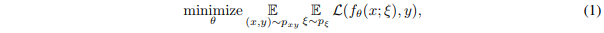

# 相关论文

## Learning with Pseudo-Ensembles

* https://arxiv.org/pdf/1412.4864.pdf

这是NIPS 2014年发表的工作，其提出了一个概念：pseudo-ensemble，一个 pseudo-ensemble 是一系列子模型（child model），这些子模型通过某种噪声过程（noise process）扰动父模型（parent model）得到。

> In pseudo ensemble terms, the source network is the parent model, each sampled subnetwork is a child model, and the noise process consists of sampling a node mask and using it to extract a subnetwork.

Pseudo-ensemble 与其他的有关扰动的方法的区别在于：其他的方法只考虑在输入空间的扰动，而 pseudo-ensemble 还考虑在模型空间（model space）上的扰动。**一个典型的 pseudo-ensemble 就是 Dropout**。

其有监督代价函数如下：

# 参考链接

* https://github.com/dkozlov/awesome-knowledge-distillation
