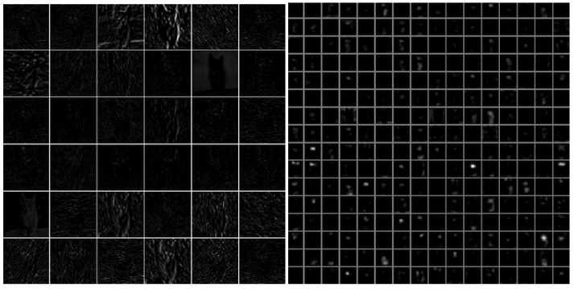
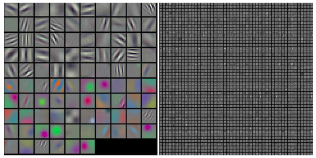
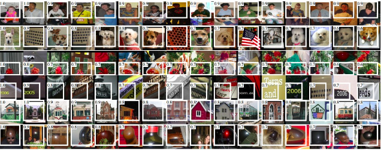
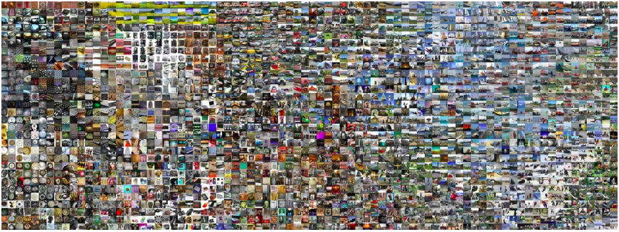
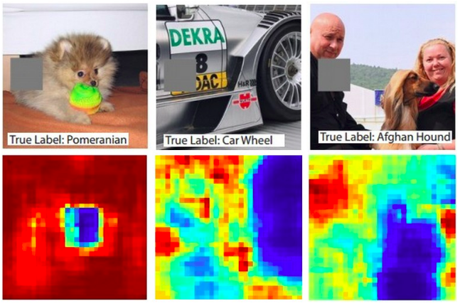
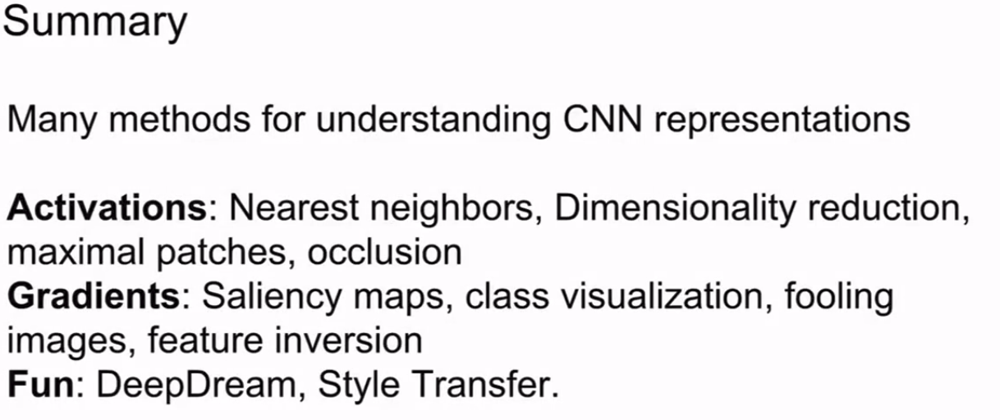

# 网络可视化

> https://blog.csdn.net/bea_tree/article/details/51533648

##  可视化激活值和第一层权重

### 激活值

最直接的可视化就是展示网络在向前传播时的激活值, ReLU 为激活函数的网络中开始时激活值一般是点状物比较多比较分散, 但是当训练后就会比较稀疏集中于局部了. 但是要注意如果有些激活值对很多不同的输入得到的是都全黑, 就可能意味着这是filters工作不正常或者学习速率太高.

下图是 AlexNet在“看”过一只猫之后第一层卷积层和第五层卷积层的典型展示. 每一个activation map 都对应着一些 filter神经元. 可以看出激活值是稀疏（大部分较黑）且分布较集中的.



### Conv/FC Filters.

另外一个可视化的方法就是将权重可视化, 第一层看原始图像的卷积层的权重weight还比较好理解, 但是也可以展示之后几层的权重, 一般来说训练较好的权重一般会有比较平滑的展现且没有或很少噪声, 如果噪声过大说明模型训练时间还不够或者惩罚因子过小导致过拟合.

下图是AlexNet典型的第一和第二层卷积层的权重. 可以看出第一层的权重展示很nice很平滑, 其中彩色和灰度特征是分别聚集的, 这是因为 AlexNet 包含两部分处理流, 一部分针对高频的灰度特征一部分针对低频的色彩信息,第二层的权重就没有这么直观的理解了, 但是可以看出他依然平滑没有噪声, 形状也不错.



## 寻找最中意的图片

还有一种方法是将大量不同的图片输入网络, 寻找哪一张图片可以让网络最激动, 得到最大的激励, 进而我们就可以知道神经元正在寻找什么样的receptive field, 下面这篇文章就做了类似的事情：[Rich feature hierarchies for accurate object detection and semantic segmentation by Ross Girshick et al](http://arxiv.org/abs/1311.2524).

下面的图片显示 AlexNet的第五个pooling层, 要知道第五层的神经元已经是可以看到图片中比较大的局部了. 可以看出有几个是对人的上半身情有独钟, 更奇葩的是有些对高光比较感兴趣, 那个人头的亮光竟然被打了满分真实满满的爱呀.



但是ReLU 神经单元似乎不能通过这些告诉我们什么, 我们可以认为 multiple ReLU神经元是有些图块的空间偏置向量 下面的文章做了相关的工作[Intriguing properties of neural networks by Szegedy et al](http://arxiv.org/abs/1312.6199).

## 使用t-SNE 嵌入图片

ConvNets逐渐的将不同的图片分类, 我们可以将不同的图片嵌入到二维的空间, 这样相似的图片就会在一起.有很多嵌入的方法, t-SNE 是很有名的一个. 我们可以从ConvNet中抽取cnn codes(例如在AlexNet中是分离器前的4096维向量)代入 t-SNE 得到了二维分布的图片, 图片间的距离也可以表现出在ConvNet中认为他们是否相似, 下图就是一例, 越近的图片在ConvNet的眼里他们长的越像.



## 挡住部分物体

我们还可以挡住图片的部分内容, 看对图片分类结果是否变化, 下图中是将图片挡住, 看对这类物体分类的概率, 概率(置信度)的变化体现在了热力图中.



可以看出如果挡住小狗的脸就不能分清小狗了(分类置信度降低), 这就说明网络对物体还是有比较正确的判断的.

## 其他一些关于将网络可视化的链接

Visualizing the data gradient and friends

Data Gradient.

[Deep Inside Convolutional Networks: Visualising Image Classification Models and Saliency Maps](http://arxiv.org/abs/1312.6034)

DeconvNet.

[Visualizing and Understanding Convolutional Networks](http://arxiv.org/abs/1311.2901)

Guided Backpropagation.

对于一个特定的图像,想要了解并选取神经网络中间层的一些中间神经元,输入图像的哪些部分,隐形了神经网络内部神经元的分值.可以通过显著图来计算神经元的分值,而不是计算相对于图像像素的类的分值,可以计算神经网络中的某些中间值相对于图像像素的梯度,这些值会告诉我们,输入图像中的哪些像素,会影响特定神经元的值.这将使用正常的反向传播.

但是事实上我们可以对这个反向传播进行一定的微调,最终得到一些稍微干净的图像,这来源于上面VUCN论文的传导式反向传播的思想.(这里似乎是用了梯度上升)

[Striving for Simplicity: The All Convolutional Net](http://arxiv.org/abs/1412.6806)

Reconstructing original images based on CNN Codes

[Understanding Deep Image Representations by Inverting Them](http://arxiv.org/abs/1412.0035)

How much spatial information is preserved?

[Do ConvNets Learn Correspondence?](http://papers.nips.cc/paper/5420-do-convnets-learn-correspondence.pdf) (tldr: yes)

Plotting performance as a function of image attributes

[ImageNet Large Scale Visual Recognition Challenge](http://arxiv.org/abs/1409.0575)

Fooling ConvNets

[Explaining and Harnessing Adversarial Examples](http://arxiv.org/abs/1412.6572)

Comparing ConvNets to Human labelers

[What I learned from competing against a ConvNet on ImageNet](http://karpathy.github.io/2014/09/02/what-i-learned-from-competing-against-a-convnet-on-imagenet/)



1. 基于激活值的方法:最近邻/降维/最大化图像块/遮挡
2. 基于梯度的方法:显著图/类可视化/愚弄图像/特征反演
3. 基于乐趣:deepdream/风格迁移

### 风格迁移

> 历史介绍:https://zhuanlan.zhihu.com/p/26746283

> 
>
> *图像风格迁移科技树*
>
> 在神经网络之前, 图像风格迁移的程序有一个共同的思路：分析某一种风格的图像, 给那一种风格建立一个数学或者统计模型, 再改变要做迁移的图像让它能更好的符合建立的模型. 这样做出来效果还是不错的, 比如下面的三张图中所示, 但一个很大的缺点：**一个程序基本只能做某一种风格或者某一个场景**. 因此基于传统风格迁移研究的实际应用非常有限.
>
> 
>
> [景色照片时间迁移](http://dl.acm.org/citation.cfm?id=2508419)
>
> 改变了这种现状的是两篇Gatys的论文, 在这之前让程序模仿任意一张图片画画是没法想象的.
>
> 
>
> 第一个基于神经网络的图像风格迁移算法, 生成时间：5-20分钟*
>
> 因为VGG19的优秀表现, 引起了很多兴趣和讨论, 但是VGG19具体内部在做什么其实很难理解, 因为每一个神经元内部参数只是一堆数字而已. 每个神经元有几百个输入和几百个输出, 一个一个去梳理清楚神经元和神经元之间的关系太难.
>
> 于是有人想出来一种办法：虽然我们不知道神经元是怎么工作的, 但是如果我们知道了它的**激活条件**, 会不会能对理解神经网络更有帮助呢？于是他们编了一个程序, (用的方法叫back propagation, 和训练神经网络的方法一样, 只是倒过来生成图片. )把每个神经元所对应的能激活它的图片找了出来, 之前的那幅特征提取示意图就是这么生成的. 有人在这之上又进一步, 觉得, 诶既然我们能找到一个神经元的激活条件, 那能不能把所有关于“狗’的神经元找出来, 让他们全部被激活, 然后看看对于神经网络来说”狗“长什么样子的？
>
> 长得其实是这样的：
>
> 
>
> *神经网络想象中的狗*.
>
> 这是神经网络想象中最完美的狗的样子, 非常迷幻, 感觉都可以自成一派搞个艺术风格出来了. 而能把任何图片稍作修改让神经网络产生那就是狗的幻觉的程序被称作deep dream.
>
> 基于神经网络的图像风格迁移在2015年由Gatys et al. 在两篇论文中提出：[Gatys et al., 2015a](http://papers.nips.cc/paper/5633-texture-synthesis-using-convolutional-neural-networks)和[Gatys et al., 2015b](https://arxiv.org/abs/1508.06576).
>
> 我们先说第一篇. 第一篇比起之前的纹理生成算法, 创新点只有一个：它给了一种用深度学习来给纹理建模的方法. 之前说到纹理生成的一个重要的假设是纹理能够通过局部统计模型来描述, 而手动建模方法太麻烦. 于是Gatys看了一眼隔壁的物体识别论文, 发现VGG19说白了不就是一堆局部特征识别器嘛. 他把事先训练好的网络拿过来一看, 发现这些识别器还挺好用的. 于是Gatys套了个Gramian matrix上去算了一下那些不同局部特征的相关性, 把它变成了一个统计模型, 于是就有了一个不用手工建模就能生成纹理的方法.
>
> 
>
> *基于神经网络的纹理生成算法*
>
> 从纹理到图片风格其实只差两步. 第一步也是比较神奇的, 是Gatys发现**纹理能够描述一个图像的风格**. 严格来说纹理只是图片风格的一部分, 但是不仔细研究纹理和风格之间的区别的话, 乍一看给人感觉还真差不多. 第二步是**如何只提取图片内容而不包括图片风格**. 这两点就是他的第二篇论文做的事情：Gatys又偷了个懒, 把物体识别模型再拿出来用了一遍, 这次不拿Gramian算统计模型了, 直接把局部特征看做近似的图片内容, 这样就得到了一个把图片内容和图片风格(说白了就是纹理)分开的系统, 剩下的就是把一个图片的内容和另一个图片的风格合起来. 合起来的方法用的正是之前提到的让神经网络“梦到”狗的方法, 也就是研究员们玩出来的Deep Dream, 找到能让合适的特征提取神经元被激活的图片即可.

#### 细节

> https://blog.csdn.net/qq_25737169/article/details/79192211

其中, 风格迁移算法的成功, 其主要基于以下两点：

> 1. 两张图像**经过预训练好的分类网络**, 若提取出的<u>高维特征($high−level$)之间的欧氏距离越小</u>, 则这两张图像内容越相似
> 2. 两张图像**经过预训练好的分类网络**, 若提取出的<u>低维特征($low−level$)在数值上基本相等</u>, 则这两张图像越相似, 换句话说, 两张图像相似等价于二者特征的Gram矩阵具有较小的弗罗贝尼乌斯范数.

> 設  為一個  階實矩陣,  階方陣 ![G=[g_{ij}]=A^TA](https://s0.wp.com/latex.php?latex=G%3D%5Bg_%7Bij%7D%5D%3DA%5ETA&bg=ffffff&fg=000000&s=0) 稱為 **Gramian 或 Gram 矩陣**, 也有人稱之為交互乘積 (cross-product) 矩陣. 考慮  的行向量表達式 , , 則
>
> ​	![G=A^TA=\begin{bmatrix}  \mathbf{a}_1^T\\    \mathbf{a}_2^T\\    \vdots\\    \mathbf{a}_n^T    \end{bmatrix}\begin{bmatrix}    \mathbf{a}_1&\mathbf{a}_2&\cdots&\mathbf{a}_n    \end{bmatrix}=\begin{bmatrix}    \mathbf{a}_1^T\mathbf{a}_1&\mathbf{a}_1^T\mathbf{a}_2&\cdots&\mathbf{a}_1^T\mathbf{a}_n\\    \mathbf{a}_2^T\mathbf{a}_1&\mathbf{a}_2^T\mathbf{a}_2&\cdots&\mathbf{a}_2^T\mathbf{a}_n\\    ~&~&~&~\\    \mathbf{a}_n^T\mathbf{a}_1&\mathbf{a}_n^T\mathbf{a}_2&\cdots&\mathbf{a}_n^T\mathbf{a}_n    \end{bmatrix}](https://s0.wp.com/latex.php?latex=G%3DA%5ETA%3D%5Cbegin%7Bbmatrix%7D++%5Cmathbf%7Ba%7D_1%5ET%5C%5C++++%5Cmathbf%7Ba%7D_2%5ET%5C%5C++++%5Cvdots%5C%5C++++%5Cmathbf%7Ba%7D_n%5ET++++%5Cend%7Bbmatrix%7D%5Cbegin%7Bbmatrix%7D++++%5Cmathbf%7Ba%7D_1%26%5Cmathbf%7Ba%7D_2%26%5Ccdots%26%5Cmathbf%7Ba%7D_n++++%5Cend%7Bbmatrix%7D%3D%5Cbegin%7Bbmatrix%7D++++%5Cmathbf%7Ba%7D_1%5ET%5Cmathbf%7Ba%7D_1%26%5Cmathbf%7Ba%7D_1%5ET%5Cmathbf%7Ba%7D_2%26%5Ccdots%26%5Cmathbf%7Ba%7D_1%5ET%5Cmathbf%7Ba%7D_n%5C%5C++++%5Cmathbf%7Ba%7D_2%5ET%5Cmathbf%7Ba%7D_1%26%5Cmathbf%7Ba%7D_2%5ET%5Cmathbf%7Ba%7D_2%26%5Ccdots%26%5Cmathbf%7Ba%7D_2%5ET%5Cmathbf%7Ba%7D_n%5C%5C++++%7E%26%7E%26%7E%26%7E%5C%5C++++%5Cmathbf%7Ba%7D_n%5ET%5Cmathbf%7Ba%7D_1%26%5Cmathbf%7Ba%7D_n%5ET%5Cmathbf%7Ba%7D_2%26%5Ccdots%26%5Cmathbf%7Ba%7D_n%5ET%5Cmathbf%7Ba%7D_n++++%5Cend%7Bbmatrix%7D&bg=ffffff&fg=000000&s=0)
>
> > https://ccjou.wordpress.com/2011/03/07/%E7%89%B9%E6%AE%8A%E7%9F%A9%E9%99%A3-14%EF%BC%9Agramian-%E7%9F%A9%E9%99%A3/(线代启示录)
>
> Frobenius 范数(弗罗贝尼乌斯范数), 简称F-范数, 是一种矩阵范数, 记为$||·||_F$. 矩阵A的Frobenius范数定义为矩阵A各项元素的绝对值平方的总和, 即

Gram矩阵实际上是矩阵的内积运算, 在风格迁移算法中, 其计算的是feature map之间的**偏心协方差**, 在feature map 包含着图像的特征, 每个数字表示特征的强度, **Gram矩阵代表着特征之间的相关性**, 因此, Gram矩阵可以用来表示图像的风格, 因此可以**通过Gram矩阵衡量风格的差异性**.


这里使用了Gram矩阵,而非协方差矩阵,实际上协方差矩阵也可以,就是运算成本更高.


#### 实现思路(cs231n)

##### 损失

We're going to compute the three components of our loss function now. The loss function is a weighted sum of three terms: content loss + style loss + total variation loss. 我们可以通过将两者结合在我们的损失函数中, 来生成反映一个图像的内容和另一个图像的样式的图像. 我们希望惩罚与内容图像内容的偏差以及与样式图像样式的偏差. 然后我们可以使用这种混合损失函数**在我们原始图像的像素值上**执行梯度下降.

1. content loss

   内容损失测量生成图像的特征图与源图像(内容图像)的特征图的差异程度. 我们只关心网络的一层(例如, 图层$\ell$)的内容表示, 它具有特征映射$A^\ell \in \mathbb{R}^{1 \times H_\ell \times W_\ell \times C_\ell}$.  $C_\ell$是图层$\ell$中滤镜/通道的数量, $H_\ell$和$W_\ell$是高度和宽度. 我们将使用这些特征映射的重新整形版本, 将所有空间位置组合成一个维度. 让$F^\ell \in \mathbb{R}^{M_\ell \times C_\ell}$成为当前图像(生成图像)的特征映射, $P^\ell \in \mathbb{R}^{M_\ell \times C_\ell}$是内容源图像的特征映射, 其中$M_\ell=H_\ell\times W_\ell$是每个特征映射中的元素数.  $F^\ell$或$P^\ell$的每一行代表特定滤波器的矢量化激活, 在图像的所有位置上卷积. 最后, 让$w_c$成为损失函数中内容丢失项的权重. 可以理解为$L_{ij}$表示第i个滤波器的第i个的结果,而这个"滤波器"维度是$C_{l}$.

   然后内容丢失由下式给出：

   $L_c = w_c \times \sum_{i,j} (F_{ij}^{\ell} - P_{ij}^{\ell})^2$

2. style loss

   现在我们可以解决风格损失. 对于给定的图层$\ell$, 定义如下：

   首先, 计算Gram矩阵G, 其**表示每个滤波器的响应之间的相关性**, 其中F如上所述.  Gram矩阵是协方差矩阵的近似值. 我们希望生成的图像的激活统计数据与我们的样式图像的激活统计数据相匹配, 并且匹配(近似), 协方差是一种方法.

   > 有多种方法可以做到这一点, 但Gram矩阵很好, 因为它易于计算, 并且在实践中显示出良好的结果.

   给定形状$(M_\ell, C_\ell)$的特征映射$F^\ell$, Gram矩阵具有形状$(C_\ell, C_\ell)$, 其元素由下式给出：

   $$G_{ij}^\ell  = \sum_k F^{\ell}_{ki} F^{\ell}_{kj}$$

   假设$G^\ell$是来自生成图像的特征映射的Gram矩阵, $A^\ell$是来自源样式图像的特征映射的Gram矩阵, $w_\ell$是标量权重项, 那么图层$\ell$的样式损失就是加权Euclidean两个Gram矩阵之间的距离：

   $$L_s^\ell = w_\ell \sum_{i, j} \left(G^\ell_{ij} - A^\ell_{ij}\right)^2$$

   在实践中, 我们通常在一组图层$\mathcal{L}$而不是单个图层$\ell$中计算样式损失;那么总风格损失是每层风格损失的总和：

   $$L_s = \sum_{\ell \in \mathcal{L}} L_s^\ell$$

3. total variation loss

   事实证明, 鼓励图像平滑也很有帮助. 我们可以通过在我们的损失中添加另一项来惩罚摆动或像素值中的“总方差”.

   您可以将“总方差”计算为彼此相邻(水平或垂直)的所有像素对的像素值差异的平方和. 在这里, 我们总结3个输入通道(RGB)图像的total variation loss, 总损失加权$w_t$：

   $L_{tv} = w_t \times \left(\sum_{c=1}^3\sum_{i=1}^{H-1}\sum_{j=1}^{W} (x_{i+1,j,c} - x_{i,j,c})^2 + \sum_{c=1}^3\sum_{i=1}^{H}\sum_{j=1}^{W - 1} (x_{i,j+1,c} - x_{i,j,c})^2\right)$

##### 代码

```python
def style_transfer(content_image, style_image, image_size, style_size, content_layer, content_weight,
                   style_layers, style_weights, tv_weight, init_random = False):
    """Run style transfer!

    Inputs:
    - content_image: filename of content image
    - style_image: filename of style image
    - image_size: size of smallest image dimension (used for content loss and generated image)
    - style_size: size of smallest style image dimension
    - content_layer: layer to use for content loss
    - content_weight: weighting on content loss
    - style_layers: list of layers to use for style loss
    - style_weights: list of weights to use for each layer in style_layers
    - tv_weight: weight of total variation regularization term
    - init_random: initialize the starting image to uniform random noise
    """
	# Extract features from the content image
    content_img = preprocess_image(load_image(content_image, size=image_size))
    feats = model.extract_features(model.image)
    content_target = sess.run(feats[content_layer],
                              {model.image: content_img[None]})

    # Extract features from the style image
    style_img = preprocess_image(load_image(style_image, size=style_size))
    style_feat_vars = [feats[idx] for idx in style_layers]
    style_target_vars = []
    # Compute list of TensorFlow Gram matrices
    for style_feat_var in style_feat_vars:
        style_target_vars.append(gram_matrix(style_feat_var))
    # Compute list of NumPy Gram matrices by evaluating the TensorFlow graph on the style image
    style_targets = sess.run(style_target_vars, {model.image: style_img[None]})

    # Initialize generated image to content image
    if init_random:
        img_var = tf.Variable(tf.random_uniform(content_img[None].shape, 0, 1), name="image")
    else:
        img_var = tf.Variable(content_img[None], name="image")

    # Extract features on generated image
    feats = model.extract_features(img_var)
    # Compute loss
    c_loss = content_loss(content_weight, feats[content_layer], content_target)
    s_loss = style_loss(feats, style_layers, style_targets, style_weights)
    t_loss = tv_loss(img_var, tv_weight)
    loss = c_loss + s_loss + t_loss
    ...
```

#### 参考

https://zhuanlan.zhihu.com/p/24383274(深度学习实践：使用Tensorflow实现快速风格迁移)

https://zhuanlan.zhihu.com/p/36238178

https://zhuanlan.zhihu.com/p/26913182

https://mp.weixin.qq.com/s/iV-OXiKF1jgAhSmX4QUIXw(图像风格化算法最全盘点 | 内附大量扩展应用)

### 特征反演

为了理解卷积网络学会识别的特征类型, 最近的一篇[论文][1]试图从其特征表示中重建图像. 我们可以使用来自预训练网络的图像梯度轻松实现这个想法.

现在, 如果将样式**权重设置全部为0**并**将起始图像初始化为随机噪声而不是内容源图像**, 则将从内容源图像的要素表示重建图像. 你是从总噪音开始的, 但你应该得到一些看起来有点像原始图像的东西.

同样, 如果将**内容权重设置为0**并**将起始图像初始化为随机噪声**, 则可以从头开始进行“纹理合成”.

[1]: Aravindh Mahendran, Andrea Vedaldi, "Understanding Deep Image Representations by Inverting them", CVPR 2015
