# 生成式模型(Generative Models)

这是无监督学习范畴下的一类模型.该任务中,在给定训练数据的情况下,我们的目标是,从相同的数据分布中生成新的样本.

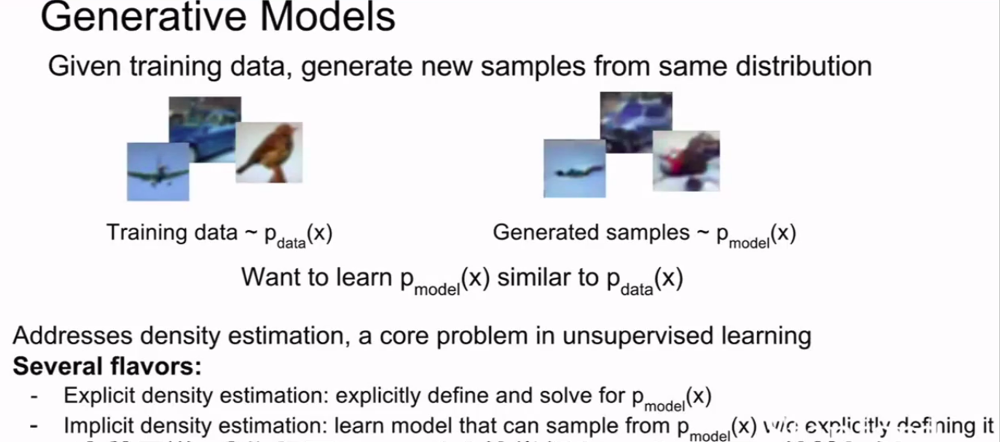

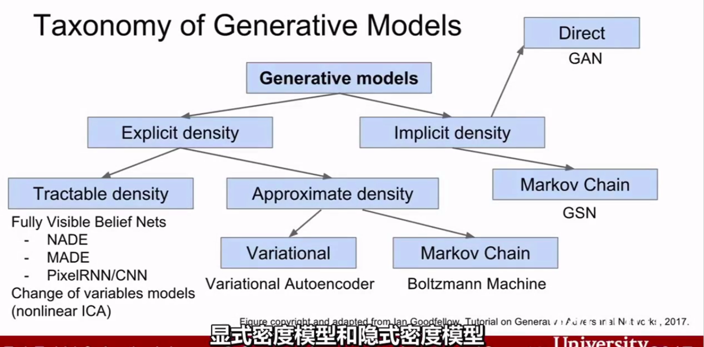

## pixelRNN&pixelCNN

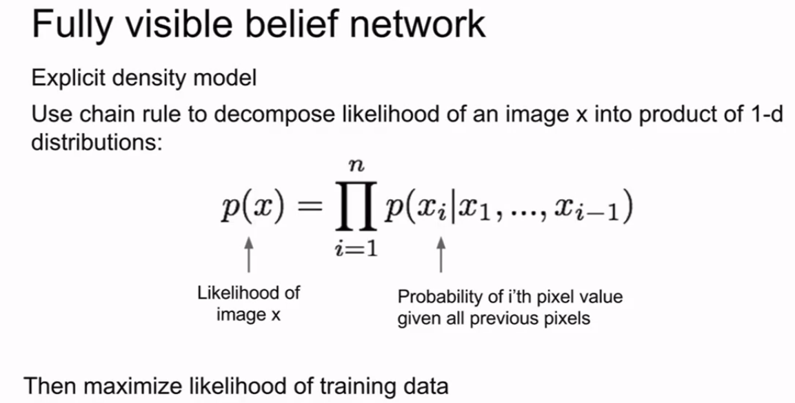

都属于全可见信念网络.计算分布是一个很复杂的问题,但是可以借助神经网络来表达这个复杂结构.

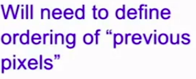

这里讲的是对于公式里的之前的x,该如何定义的问题.

那么该如何定义呢?

### PixelRNN(2016)

定义了初始化及优化这类问题的方法.

### PixelCNN(2016)

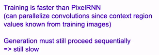

相较于PixelRNN而言,训练速度更快,因为训练图片的内容区域值已知,可以并行卷积.但是生成时必须序列处理.还是慢.

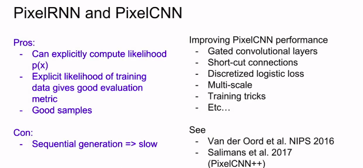

## Variational Autoencoders(VAE)

### 自编码器

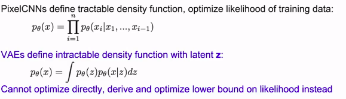

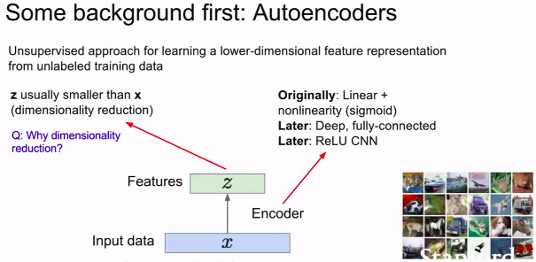

VAE和AE关系密切.这里的降维可以让z表示出更好的,更有价值的特征.

而且对于AE的编码器的结构,从开始的线性配合非线性激活,到后来的深度网络,全连接以及ReLU CNN,都开始有所使用.

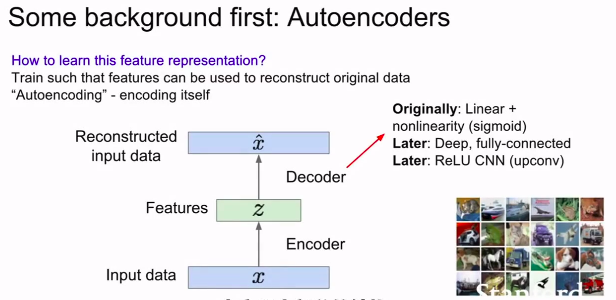

解码输出,对输入进行重构.

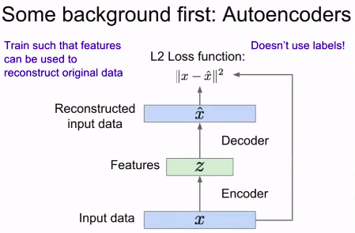

即便这里使用了一个L2损失,我们也没有使用外部的标签.

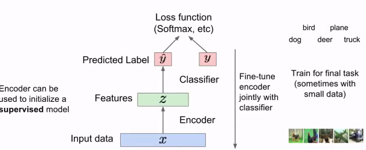

编码器可以用来初始化监督模型,来预测标签,和外部标签计算分类损失.

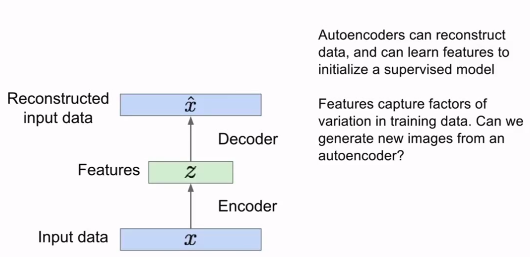

---

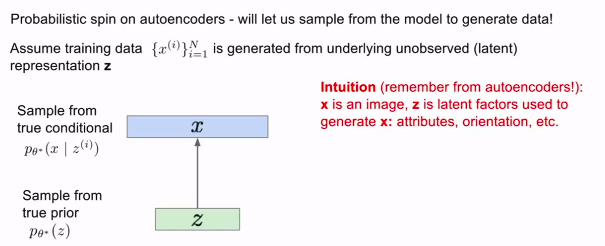

z是隐变量,用来生成x.

### 如何表达模型

### 如何训练模型

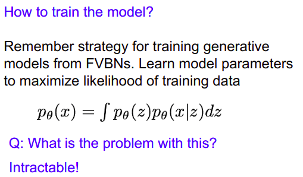

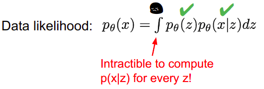

对于数据似然函数里的两项,一项可以定为Simple Gaussian prior,一项定为Decoder neural network,对于这个求解积分,要对于每个z进行计算网络,比较棘手.

后向概率也难算.

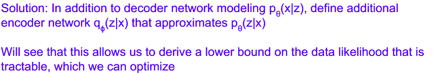

定义一个编码网络条件参数,来近似解码网络参数.

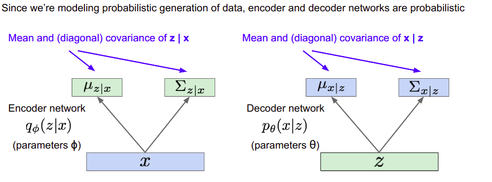

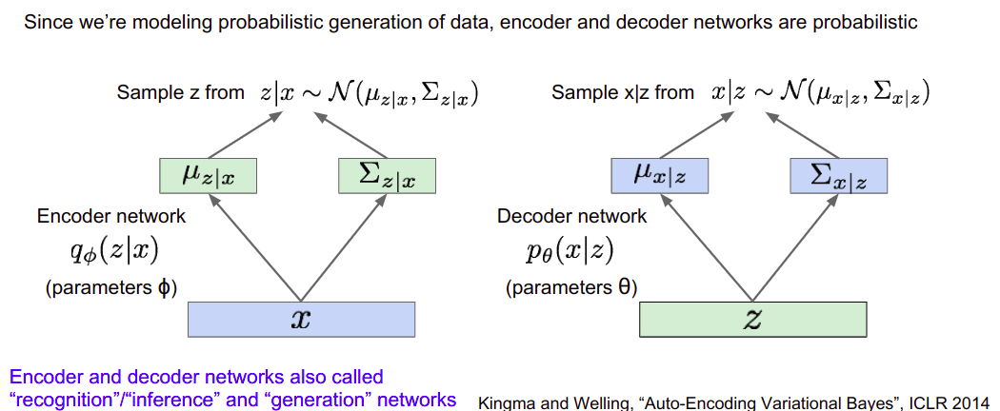

在有了编解码网络后,可以计算对数似然函数.

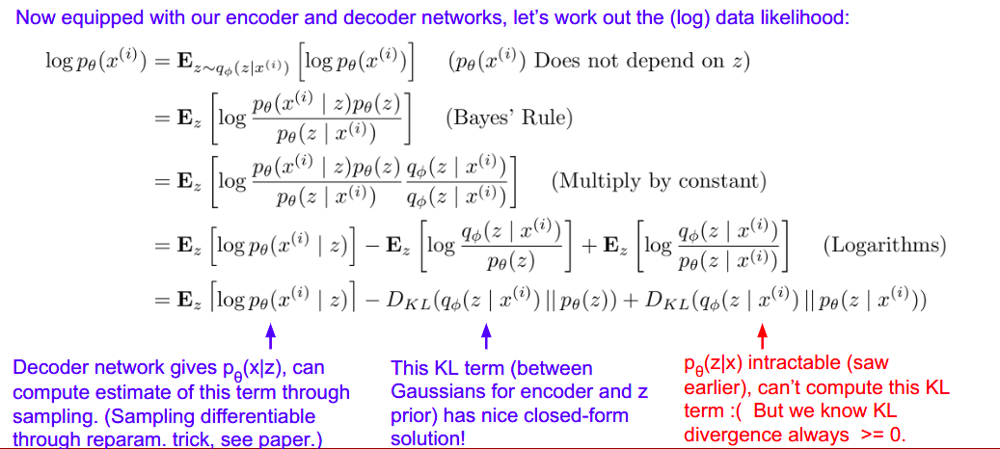

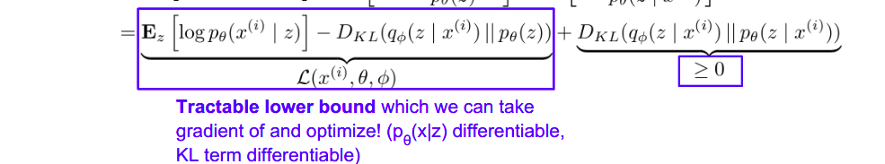

前两项可微.第一项重构了输入,第二项使用后向近似了前向.进而问题可以转化为下面的样子.

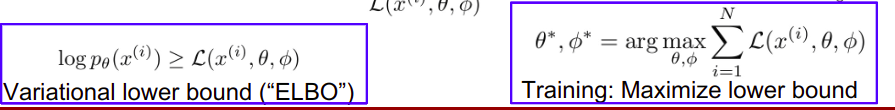

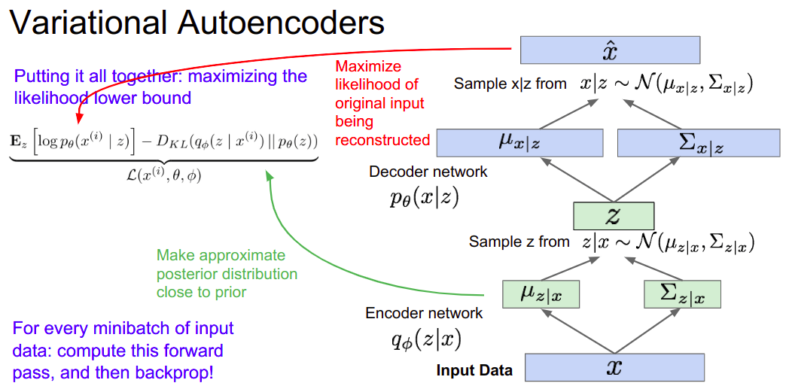

### 生成数据

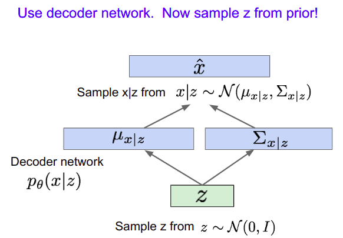

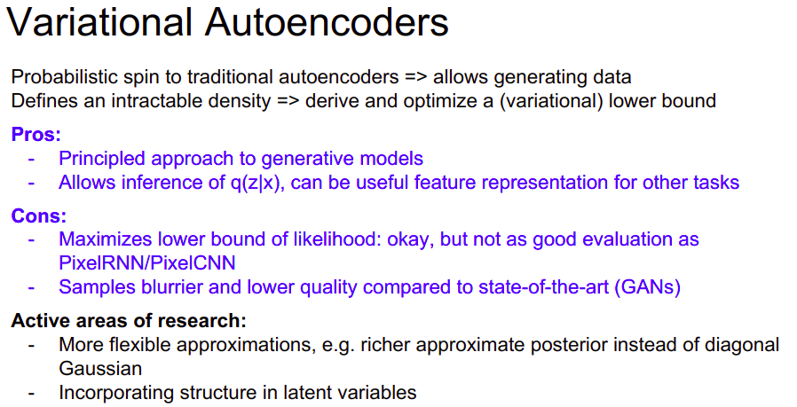

## Generative Adversarial Network(GAN)

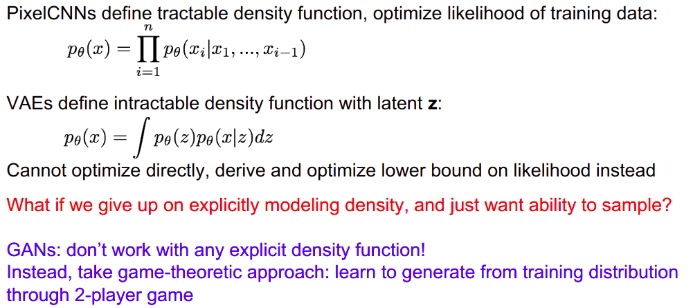

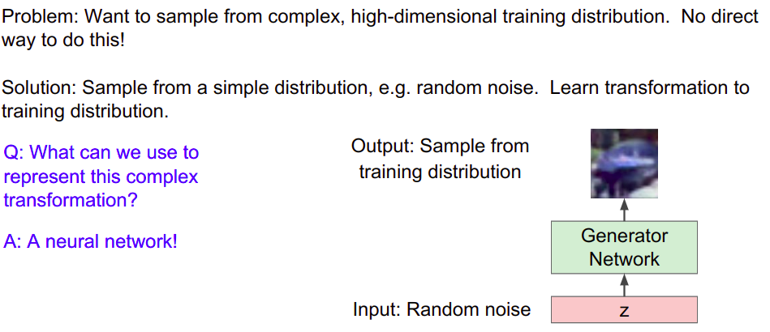

### 训练过程

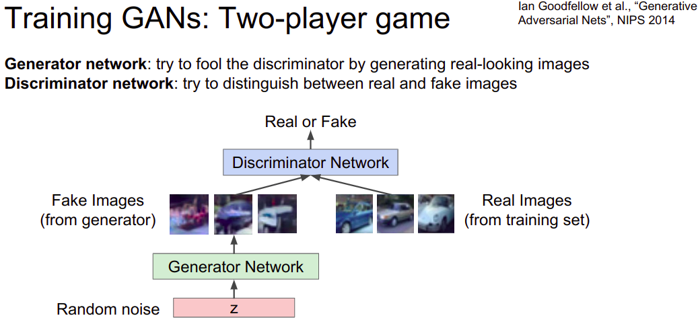

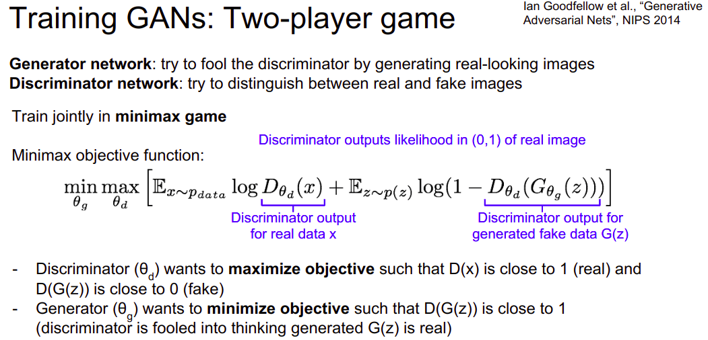

**这里实际上反映的是鉴别器正确的可能性.但是我们就是要它鉴别错误,所以实际上就是要最小化这个正确的可能.**

鉴别器要参数的最大化目标例如:真实数据输出(数据集)要接近于1,而对于生成器的输出的鉴别结果要接近0.

而生成器参数的最小化目标例如:鉴别器对生成器输出处理后的输出要接近1.(鉴别器被愚弄了,认为生成器生成的是真实的).

也就是要生成出来**可以以假乱真**的效果的结果.

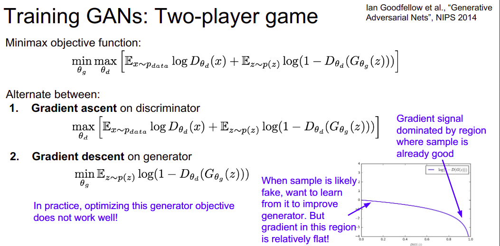

但是这里实际上计算生成器目标时,效果并不好,因为可以看右侧的梯度曲线图,横轴为$D(G(z))$纵轴为$log(1-D(G(z)))$.

可见这里的图像,当生成器的输出经过鉴别器后的结果越接近0,越需要改进生成器,但是此时对应的对数函数的梯度平缓,并不利于改进.当生成器结果被鉴别后的结果越是接近于1,此时梯度变化越快,由着已经很好的样本所主导.

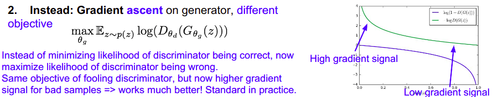

使用替代的梯度上升方法来处理.现在对于较差的样本,对应更高的梯度,这样工作更好.

> Aside: Jointly training two networks is challenging, can be unstable.  Choosing objectives with better loss landscapes helps training, is an active area of research.

### 训练算法

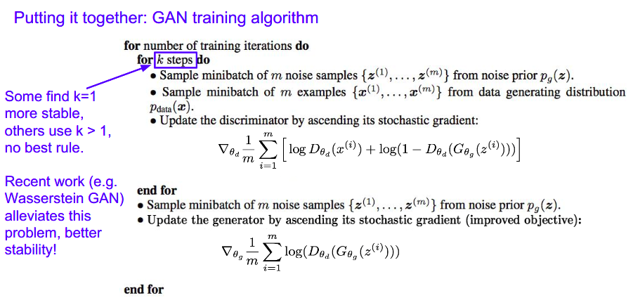

### 结果利用

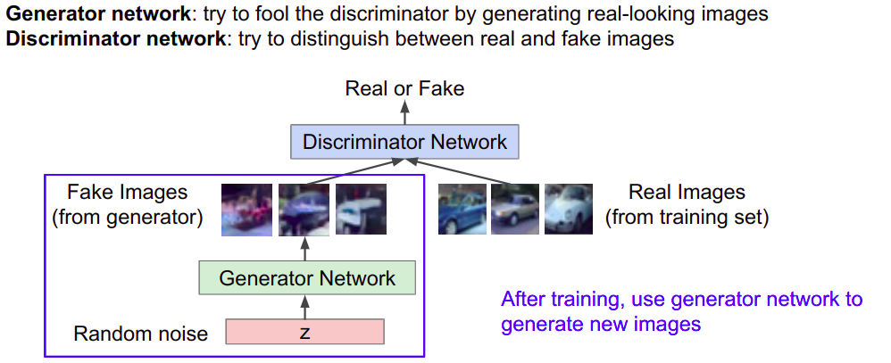

相当于是,训练出来一个生成网络,可以达到欺骗鉴别器网络的水平,从而利用这个生成网络来生成近似于真实的数据.

### 卷积架构

* Generator is an upsampling network with fractionally-strided convolutions(也就是转置卷积,上采样)
* Discriminator is a convolutional network

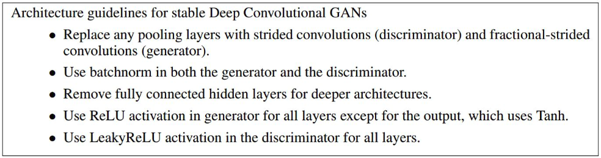

* 利用跨度卷积(鉴别器)和转置卷积(生成器),代替汇聚层.
* 生成器鉴别器都使用BN
* 深度架构中,不再使用全连接
* 在生成器所有层使用ReLU激活,但是输出使用Tanh激活.
* 在鉴别器中所有层使用Leaky ReLU激活

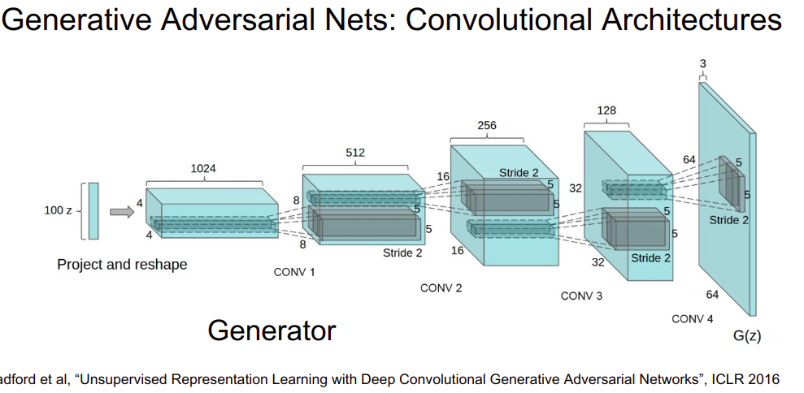

### 优缺点

## 总结

