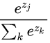

# 疑惑汇总(待整理)

## 关于正则化

batchnorm计算的是不同通道下本batch的所有样本的均值方差.

那输入应该是什么？对于一个batch, X([N, C, H, W]), 应该输入什么？

spring1718_assignment2_v2/BatchNormalization.ipynb中的这部分, 以随机样本进行计算, 如果对于图像而言, 真正的输入应该是什么样子的？

```python
np.random.seed(231)
# 可以理解为200张50*60*3的照片集合
N, D1, D2, D3 = 200, 50, 60, 3
# 输入的数据被归置到前两维度上面, 这里怎么理解？对于一副真实图像, 如何理解此处对应的X
X = np.random.randn(N, D1)
W1 = np.random.randn(D1, D2)
W2 = np.random.randn(D2, D3)
# affine-relu-affine
a = np.maximum(0, X.dot(W1)).dot(W2)

print('Before batch normalization:')
print_mean_std(a,axis=0)

# 这里为什么要使用D3来初始化长度, 可以从后面计算的过程中看出来, gamma也是针对各个特征有一个gamma, beta
gamma = np.ones((D3,))
beta = np.zeros((D3,))

# Means should be close to zero and stds close to one
print('After batch normalization (gamma=1, beta=0)')
a_norm, _ = batchnorm_forward(a, gamma, beta, {'mode': 'train'})
print_mean_std(a_norm,axis=0)

gamma = np.asarray([1.0, 2.0, 3.0])
beta = np.asarray([11.0, 12.0, 13.0])
# Now means should be close to beta and stds close to gamma
# 重构之后, 得到的均值标准差和theta,gamma相近
print('After batch normalization (gamma=', gamma, ', beta=', beta, ')')
a_norm, _ = batchnorm_forward(a, gamma, beta, {'mode': 'train'})
print_mean_std(a_norm,axis=0)
```

在layers.py文件中的batchnorm_forward函数中, 有这样的代码：

```python
mode = bn_param['mode']
eps = bn_param.get('eps', 1e-5)
momentum = bn_param.get('momentum', 0.9)

N, D = x.shape
running_mean = bn_param.get('running_mean', np.zeros(D, dtype=x.dtype))
running_var = bn_param.get('running_var', np.zeros(D, dtype=x.dtype))

out, cache = None, None

...

# 均值的计算, 是计算N方向上的, 也就是算的是所有样本对于同一特征的均值
sample_mean = np.mean(x, axis=0)
# 计算标准差（这之中使用了参数epsilon)
sample_var = np.var(x, axis=0)
# 动量方式滑动更新策略
running_mean = momentum * running_mean + (1 - momentum) * sample_mean
running_var = momentum * running_var + (1 - momentum) * sample_var
# 计算归一化值
x_normed = (x - sample_mean) / np.sqrt(sample_var + eps)
# 变换重构
out = gamma * x_normed + beta
# 保存参数
cache = (x, gamma, beta, x_normed, sample_mean, sample_var, eps)
```

从上面的过程来看, 应该是输入成二维的数据, 对于**批量的三维图像**而言, 可能会有转化为 [N,(H×W×C)]的一个二维输入. 看下后面在类里的使用方式：

```python
np.random.seed(231)
N, D, H1, H2, C = 2, 15, 20, 30, 10
X = np.random.randn(N, D)
y = np.random.randint(C, size=(N,))

# You should expect losses between 1e-4~1e-10 for W,
# losses between 1e-08~1e-10 for b,
# and losses between 1e-08~1e-09 for beta and gammas.
for reg in [0, 3.14]:
    print('Running check with reg = ', reg)
    model = FullyConnectedNet([H1, H2], input_dim=D, num_classes=C,
                              reg=reg, weight_scale=5e-2, dtype=np.float64,
                              normalization='batchnorm')

    loss, grads = model.loss(X, y)
    print('Initial loss: ', loss)

    for name in sorted(grads):
        f = lambda _: model.loss(X, y)[0]
        grad_num = eval_numerical_gradient(f, model.params[name], verbose=False, h=1e-5)
        print('%s relative error: %.2e' % (name, rel_error(grad_num, grads[name])))
    if reg == 0: print()
```

这里涉及到BN的用法和上面一样.

为了找到更实际的, 找到了这部分内容：

```python
np.random.seed(231)
# Try training a very deep net with batchnorm
hidden_dims = [100, 100, 100, 100, 100]

num_train = 1000
# data：
# X_train:  (49000, 3, 32, 32)
# y_train:  (49000,)
# X_val:  (1000, 3, 32, 32)
# y_val:  (1000,)
# X_test:  (1000, 3, 32, 32)
# y_test:  (1000,)
small_data = {
  'X_train': data['X_train'][:num_train],
  'y_train': data['y_train'][:num_train],
  'X_val': data['X_val'],
  'y_val': data['y_val'],
}
# X_train: (1000, 2, 32, 32)
# y_train: (1000, )
# ...

weight_scale = 2e-2

bn_model = FullyConnectedNet(hidden_dims, weight_scale=weight_scale, normalization='batchnorm')
bn_solver = Solver(bn_model, small_data,
                num_epochs=10, batch_size=50,
                update_rule='adam',
                optim_config={
                  	'learning_rate': 1e-3,
                },
                verbose=True,print_every=20)
bn_solver.train()

model = FullyConnectedNet(hidden_dims, weight_scale=weight_scale, normalization=None)
solver = Solver(model, small_data,
                num_epochs=10, batch_size=50,
                update_rule='adam',
                optim_config={
                  	'learning_rate': 1e-3,
                },
                verbose=True, print_every=20)
solver.train()
```

查看Solver类对应的model.loss()向调用的函数查找, 找到了：

fc_net.py中的全连接类的


```python
def loss(self, X, y=None):
    """
    Compute loss and gradient for a minibatch of data.
    Inputs:
    - X: Array of input data of shape (N, d_1, ..., d_k)
    - y: Array of labels, of shape (N,). y[i] gives the label for X[i].

    Returns:
    If y is None, then run a test-time forward pass of the model and return:
    - scores: Array of shape (N, C) giving classification scores, where
      scores[i, c] is the classification score for X[i] and class c.
    If y is not None, then run a training-time forward and backward pass and
    return a tuple of:
    - loss: Scalar value giving the loss
    - grads: Dictionary with the same keys as self.params, mapping parameter
      names to gradients of the loss with respect to those parameters.
    """
    scores = None
    ############################################################################
    # TODO: Implement the forward pass for the two-layer net, computing the    #
    # class scores for X and storing them in the scores variable.              #
    ############################################################################
    # affine_1 W1 input*hidden
    #  affine_1_out = X.dot(self.params['W1']) + self.params['b1']
    # relu_1
    #  relu_1_out = np.maximum(0, affine_1_out)
    # affine_2 W2 hidden*classes
    #  affine_2_out = relu_1_out.dot(self.params['W2']) + self.params['b2']
    # 最后的softmax不计算, 因为得分的计算计算到最后的分类之前即可
    #  scores = affine_2_out
    # 思路是上面的思路, 但是实际计算的时候需要注意具体的数据形式, 这里还是用已有
    # 的函数计算比较方便
    layer_1, cache_1 = affine_relu_forward(
        X, self.params['W1'], self.params['b1'])
    layer_2, cache_2 = affine_forward(
        layer_1, self.params['W2'], self.params['b2'])
    scores = layer_2
```
再看affine_relu_forward中调用了affine_forward, 找到了：

```python
N = x.shape[0]
# 将多维e的x归置到二维, 各个样本的数据都被压缩到一个维度
new_x = x.reshape([N, -1])
out = np.dot(new_x, w) + b
```
原来, 对于batchnorm而言, 得到的batch数据x是二维数据, N×D, D=H×W×C, 所以再看batchnorm_forward函数：

```python
sample_mean = np.mean(x, axis=0)
# 计算标准差(这之中使用了参数epsilon)
sample_var = np.var(x, axis=0)
# 动量方式滑动更新策略
running_mean = momentum * running_mean + (1 - momentum) * sample_mean
running_var = momentum * running_var + (1 - momentum) * sample_var
# 计算归一化值
x_normed = (x - sample_mean) / np.sqrt(sample_var + eps)
# 变换重构
out = gamma * x_normed + beta
# 保存参数
cache = (x, gamma, beta, x_normed, sample_mean, sample_var, eps)
```
得到的均值方差都是各个特征的对应的均值方差.

也就实际上是说, 对于batchnorm而言, 实际上是对一个batch而言, 求得各个特征的均值方差, 对各个特征进行归一化.

而对于layernorm而言, 实际上略有不同：

```python
# 因为layernorm是关于特征的处理, x到这里的时候, 已经是二维的了.
x_new = x.copy()
# 这里的计算均值方差, 是针对一个样本而言
sample_mean = np.mean(x_new, axis=1)
sample_var = np.var(x_new, axis=1)

# 这里是按照不同的样本进行的均值方差计算
x_new = x_new - sample_mean.reshape([-1, 1])
x_new = x_new / np.sqrt(sample_var.reshape([-1, 1]) + eps)
out = gamma * x_new + beta
cache = (x, gamma, beta, x_new, sample_mean, sample_var, eps)
```
可见这里的均值方差与batchnorm计算方向不同, 不过这里也使用了batch的方式来计算, 只是计算方向不同, 所以与N无关, 而batchnorm与N紧密关联.

而对于spatial_batchnorm_forward而言, 它的输入是四维的batch, 它是把四维里的除了C维度的三维压缩到一起.

```python
N, C, H, W = x.shape
# 调整x到 N×H×W × C 大小, 四维压缩到二维, 保留C维度
# np.transpose可以调整各维度的顺序, 对于二维而言也就是转置了
x_new = np.reshape(np.transpose(x, (0, 2, 3, 1)), (-1, C))

out, cache = batchnorm_forward(x_new, gamma, beta, bn_param)

# 调整out从(N, H, W, C)到(N, C, H, W)
out = np.transpose(np.reshape(out, (N, H, W, C)), (0, 3, 1, 2))
```
SBN运算相当于它是在C方向上划分了数据, 对于图像而言, 就是划分了三层, RGB各一层. 再进行BN运算.

原始的BN运算, 是在N方向上划分数据, 对于图像batch而言, 就是划分了多个样本, 一个样本一层.

对于作业中出现的spatial_groupnorm_forward而言, 它的输入是四维的, 但是在压缩调整的时候, 在C的方向上进行了分组, 分成G组, 一组也看做一个样本, 从而有N×G个样本, 再进行BN.

> C方向一般不是指代通道数目方向么？那一般不就是3么？
>
> 但是这个输入可能不是最一开始的输入,而是卷积后的输入,这会使得channel数目不再为3或者4.

```python
N, C, H, W = x.shape
# GroupNorm：将channel方向分group, 然后每个group内做归一化, 算(C//G)*H*W的均值
x = np.reshape(x, (N * G, C // G * H * W))

x = x.T
mu = np.mean(x, axis=0)
xmu = x - mu
sq = xmu ** 2
var = np.var(x, axis=0)

sqrtvar = np.sqrt(var + eps)
ivar = 1. / sqrtvar
xhat = xmu * ivar

xhat = np.reshape(xhat.T, (N, C, H, W))
out = gamma[np.newaxis, :, np.newaxis, np.newaxis] * \
    xhat + beta[np.newaxis, :, np.newaxis, np.newaxis]
cache = (xhat, gamma, xmu, ivar, sqrtvar, var, eps, G)
```

## 关于特征可视化

> 然而 的梯度有时仍然是有用的：比如**将神经网络所做的事情可视化便于直观理解的时候**, 就能用上.

怎么理解?怎么用?

## 关于白化

> **最右**：将“白化”后的数据进行显示. 其中144个维度中的方差都被压缩到了相同的数值范围. 然后144个白化后的数值通过乘以`U.transpose()[:144,:]`转换到图像像素基准上. 现在较低的频率(代表了大多数方差）可以忽略不计了, 较高的频率(代表相对少的方差）就被夸大了.

> “现在较低的频率(代表了大多数方差)可以忽略不计了, 较高的频率(代表相对少的方差)就被夸大了”这句话的含义？
>
> 为什么较低的频率代表了大多数的方差？又为什么可以忽略不计？
>
> 为什么较高的频率代表相对较少的方差？

## 关于神经网络权重小随机数初始化

> 因此, 权重初始值要非常接近0又不能等于0. 解决方法就是将权重初始化为很小的数值, 以此来*打破对称性*. 其思路是：如果神经元刚开始的时候是随机且不相等的, 那么它们将计算出不同的更新, 并将自身变成整个网络的不同部分.
>
> 小随机数权重初始化的实现方法是：`W = 0.01 * np.random.randn(D,H)`. **其中**`randn`**函数是基于零均值和标准差的一个高斯分布**(**译者注：国内教程一般习惯称均值参数为期望**)来生成随机数的. 根据这个式子, 每个神经元的权重向量都被初始化为一个随机向量, 而这些随机向量又服从一个多变量高斯分布, 这样在输入空间中, 所有的神经元的指向是随机的. 也可以使用均匀分布生成的随机数, 但是从实践结果来看, 对于算法的结果影响极小.
>
> **警告**. 并不是小数值一定会得到好的结果. 例如, 一个神经网络的层中的权重值很小, 那么在反向传播的时候就会计算出非常小的梯度(因为梯度与权重值是成比例的). 这就会很大程度上减小反向传播中的“梯度信号”, 在深度网络中, 就会出现问题.

> 如何理解“梯度与权重值是成比例的”？

## 关于在操作的特性模式中梯度检查

> 有一点必须要认识到：梯度检查是在参数空间中的一个特定(往往还是随机的)的单独点进行的. 即使是在该点上梯度检查成功了, 也不能马上确保全局上梯度的实现都是正确的.
>
> 还有, **一个随机的初始化可能不是参数空间最优代表性的点**, 这可能导致进入某种病态的情况, 即梯度看起来是正确实现了, 实际上并没有. 例如, SVM使用小数值权重初始化, 就会把一些接近于0的得分分配给所有的数据点, 而梯度将会在所有的数据点上展现出某种模式.

> “SVM使用小数值权重初始化, 就会把一些接近于0的得分分配给所有的数据点, 而梯度将会在所有的数据点上展现出某种模式”怎么理解？

## 关于超参数调优中随机搜索优于网格搜索

Bergstra和Bengio在文章[Random Search for Hyper-Parameter Optimization](http://www.jmlr.org/papers/volume13/bergstra12a/bergstra12a.pdf)中说“随机选择比网格化的选择更加有效”, 而且在实践中也更容易实现.


在 Random Search for Hyper-Parameter Optimization 中的核心说明图. 通常, 有些超参数比其余的更重要, 通过随机搜索, 而不是网格化的搜索, 可以让你更精确地发现那些比较重要的超参数的好数值.

> 何为网格化搜索？具体怎么实现？

## 关于神经网络评价的模型集成

>  在实践的时候, 有一个总是能提升神经网络几个百分点准确率的办法, 就是在训练的时候训练几个独立的模型, 然后在测试的时候平均它们预测结果. **集成的模型数量增加, 算法的结果也单调提升(但提升效果越来越少)**. 还有模型之间的差异度越大, 提升效果可能越好.

> 测试的时候平均预测结果？参数不是都不一样了么？可以平均么？
>
> 这个集成过程的详细流程是怎样的？
>

## 关于softmax的损失函数

> 在Softmax分类器中, 函数映射保持不变, 但将这些评分值视为每个分类的未归一化的对数概率, 并且将*折叶损失(hinge loss)*替换为**交叉熵损失**(**cross-entropy loss)**. 公式如下：
>
>  或等价的 
>
> 总的损失可以记为：$L=\frac{1}{N}\sum_iL_i$
>
> 其中函数被称作**softmax(柔性最大值) 函数**：其输入值是一个向量, 向量中元素为任意实数的评分值(中的, 也就是$z_j=\theta_j^Tx$), 函数对其进行压缩, 输出一个向量, 其中每个元素值在0到1之间, 且所有元素之和为1.
>
> **概率论解释**：先看下面的公式：
>
> 
>
> 可以解释为是给定图像数据, 以为参数, 分配给正确分类标签的归一化概率.
>
> 为了理解这点, 请回忆一下Softmax分类器将**输出向量中的评分值解释为没有归一化的对数概率**. 那么以这些数值做指数函数的幂就得到了没有归一化的概率, 而除法操作则对数据进行了归一化处理, 使得这些概率的和为1.
>
> 从概率论的角度来理解, 我们就是在最小化正确分类的负对数概率, 这可以看做是在进行*最大似然估计*(MLE).
>
> 该解释的另一个好处是, 损失函数中的正则化部分可以被看做是权重矩阵的高斯先验, 这里进行的是最大后验估计(MAP)而不是最大似然估计. 提及这些解释只是为了让读者形成直观的印象, 具体细节就超过本课程范围了.

> 这里并不理解, 为何可以看作是高斯先验？
>
> 为何进行的是最大后验估计？
>
> 最大后验估计最大似然估计如何判断？
