# 优化问题

## 第一部分

### 快速简介

在不诉诸大脑的类比的情况下，依然是可以对神经网络算法进行介绍的。在线性分类一节中，在给出图像的情况下，是使用来计算不同视觉类别的评分，其中是一个矩阵，是一个输入列向量，它包含了图像的全部像素数据。在使用数据库CIFAR-10的案例中，是一个[3072x1]的列向量，是一个[10x3072]的矩阵，所以输出的评分是一个包含10个分类评分的向量。

神经网络算法则不同，它的计算公式是。其中的含义是这样的：举个例子来说，它可以是一个[100x3072]的矩阵，其作用是将图像转化为一个100维的过渡向量。**函数是非线性的，它会作用到每个元素。**这个非线性函数有多种选择，后续将会学到。但这个形式是一个最常用的选择，它就是简单地设置阈值，将所有小于0的值变成0。最终，矩阵的尺寸是[10x100]，因此将得到10个数字，这10个数字可以解释为是分类的评分。注意非线性函数在计算上是至关重要的，如果略去这一步，那么两个矩阵将会合二为一，对于分类的评分计算将重新变成关于输入的线性函数。这个非线性函数就是*改变*的关键点。参数将通过随机梯度下降来学习到，他们的梯度在反向传播过程中，通过链式法则来求导计算得出。

一个三层的神经网络可以类比地看做，其中是需要进行学习的参数。中间隐层的尺寸是网络的超参数，后续将学习如何设置它们。现在让我们先从神经元或者网络的角度理解上述计算。

### 单个神经元建模

神经网络算法领域最初是被对生物神经系统建模这一目标启发，但随后与其分道扬镳，成为一个工程问题，并在机器学习领域取得良好效果。然而，讨论将还是从对生物系统的一个高层次的简略描述开始，因为神经网络毕竟是从这里得到了启发。

### 生物动机与连接

大脑的基本计算单位是**神经元（neuron）**。人类的神经系统中大约有860亿个神经元，它们被大约10^14-10^15个**突触（synapses）**连接起来。下面图表的左边展示了一个生物学的神经元，右边展示了一个常用的数学模型。每个神经元都从它的**树突**获得输入信号，然后沿着它唯一的**轴突（axon）**产生输出信号。轴突在末端会逐渐分枝，通过突触和其他神经元的树突相连。

在神经元的计算模型中，**沿着轴突传播的信号（比如）将基于突触的突触强度（比如），与其他神经元的树突进行乘法交互（比如）。**

其观点是，突触的强度（也就是权重），是可学习的且可以控制一个神经元对于另一个神经元的影响强度（还可以控制影响方向：使其兴奋（正权重）或使其抑制（负权重））。

在基本模型中，树突将信号传递到细胞体，信号在细胞体中相加。如果最终之和高于某个阈值，那么神经元将会*激活*，向其轴突输出一个峰值信号。在计算模型中，我们假设峰值信号的准确时间点不重要，是激活信号的频率在交流信息。基于这个*速率编码*的观点，将神经元的激活率建模为**激活函数（activation function）**，它表达了轴突上激活信号的频率。由于历史原因，激活函数常常选择使用**sigmoid函数**，该函数输入实数值（求和后的信号强度），然后将输入值压缩到0-1之间。在本节后面部分会看到这些激活函数的各种细节。

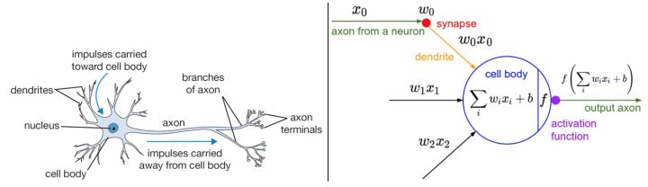

左边是生物神经元，右边是数学模型。

一个神经元前向传播的实例代码如下：

```python
class Neuron(object):
  # ... 
  def forward(inputs):
    """ 假设输入和权重是1-D的numpy数组，偏差是一个数字 """
  	cell_body_sum = np.sum(inputs * self.weights) + self.bias
    firing_rate = 1.0 / (1.0 + math.exp(-cell_body_sum)) # sigmoid激活函数
    return firing_rate
```

换句话说，每个神经元都对它的输入和权重进行点积，然后加上偏差，最后使用非线性函数（或称为激活函数）。本例中使用的是sigmoid函数。在本节的末尾部分将介绍不同激活函数的细节。

**粗糙模型**：要注意这个对于生物神经元的建模是非常粗糙的：在实际中，有很多不同类型的神经元，每种都有不同的属性。生物神经元的树突可以进行复杂的非线性计算。突触并不就是一个简单的权重，它们是复杂的非线性动态系统。很多系统中，输出的峰值信号的精确时间点非常重要，说明速率编码的近似是不够全面的。鉴于所有这些已经介绍和更多未介绍的简化，如果你画出人类大脑和神经网络之间的类比，有神经科学背景的人对你的板书起哄也是非常自然的。如果你对此感兴趣，可以看看这份[评论](https://link.zhihu.com/?target=https%3A//physics.ucsd.edu/neurophysics/courses/physics_171/annurev.neuro.28.061604.135703.pdf)或者最新的[另一份](https://link.zhihu.com/?target=http%3A//www.sciencedirect.com/science/article/pii/S0959438814000130)。

神经元模型的前向计算数学公式看起来可能比较眼熟。就像在线性分类器中看到的那样，神经元有能力“喜欢”（激活函数值接近1），或者不喜欢（激活函数值接近0）**输入空间中的某些线性区域**。因此，只要在神经元的输出端有一个合适的损失函数，就能让单个神经元变成一个线性分类器。

**二分类Softmax分类器**。举例来说，可以把看做其中一个分类的概率，其他分类的概率为，因为它们加起来必须为1。根据这种理解，可以得到交叉熵损失，这个在线性分类一节中已经介绍。然后将它最优化为二分类的Softmax分类器（也就是逻辑回归）。因为sigmoid函数输出限定在0-1之间，所以分类器做出预测的基准是神经元的输出是否大于0.5。

**二分类SVM分类器**。或者可以在神经元的输出外增加一个最大边界折叶损失（max-margin hinge loss）函数，将其训练成一个二分类的支持向量机。

**理解正则化**。在SVM/Softmax的例子中，正则化损失从生物学角度可以看做*逐渐遗忘*，因为它的效果是让所有突触权重在参数更新过程中逐渐向着0变化。

> 不断的学习过程就是对于一类知识不断强化其特征不断巩固的过程

### 常用激活函数

每个激活函数（或非线性函数）的输入都是一个数字，然后对其进行某种固定的数学操作。下面是在实践中可能遇到的几种激活函数：

---


左边是Sigmoid非线性函数，将实数压缩到[0,1]之间。右边是tanh函数，将实数压缩到[-1,1]。

#### Sigmoid

sigmoid非线性函数的数学公式是，函数图像如上图的左边所示。在前一节中已经提到过，它输入实数值并将其“挤压”到0到1范围内。更具体地说，很大的负数变成0，很大的正数变成1。在历史上，sigmoid函数非常常用，这是因为它对于神经元的激活频率有良好的解释：从完全不激活（0）到在求和后的最大频率处的完全饱和（**saturated**）的激活（1）。然而现在sigmoid函数已经不太受欢迎，实际很少使用了，这是因为它有两个主要缺点：

* *Sigmoid函数饱和使梯度消失*。sigmoid神经元有一个不好的特性，就是当神经元的激活在接近0或1处时会饱和：在这些区域，梯度几乎为0。回忆一下，在反向传播的时候，这个（局部）梯度将会与整个损失函数关于该门单元输出的梯度相乘（链式法则）。因此，如果局部梯度非常小，那么相乘的结果也会接近零，这会有效地“杀死”梯度，**几乎就没有信号通过神经元传到权重再到数据了**。还有，为了防止饱和，必须对于权重矩阵初始化特别留意。比如，<u>如果初始化权重过大，那么大多数神经元将会饱和，导致网络就几乎不学习了</u>。
* *Sigmoid函数的输出不是零中心的*。这个性质并不是我们想要的，因为在神经网络后面层中的神经元得到的数据将不是零中心的。这一情况将影响梯度下降的运作，因为如果**输入神经元的数据总是正数（比如在中每个元素都），那么关于的梯度（结果和x有关）在反向传播的过程中，将会要么全部是正数，要么全部是负数（具体依整个表达式而定）。**这将会导致梯度下降权重更新时出现z字型的下降。然而，<u>可以看到整个批量的数据的梯度被加起来后，对于权重的最终更新将会有不同的正负，这样就从一定程度上减轻了这个问题</u>。因此，该问题相对于上面的神经元饱和问题来说只是个小麻烦，没有那么严重。

#### Tanh

tanh非线性函数图像如上图右边所示。它将实数值压缩到[-1,1]之间。和sigmoid神经元一样，它也存在饱和问题，但是和sigmoid神经元不同的是，它的输出是零中心的。因此，在实际操作中，*tanh非线性函数比sigmoid非线性函数更受欢迎*。注意tanh神经元是一个简单放大的sigmoid神经元，具体说来就是：。

---

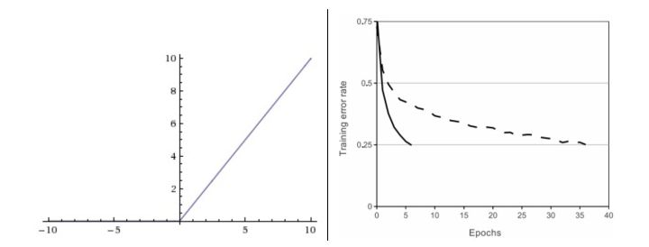

左边是ReLU（校正线性单元：Rectified Linear Unit）激活函数，当时函数值为0。当函数的斜率为1。右边是从 [Krizhevsky](https://link.zhihu.com/?target=http%3A//www.cs.toronto.edu/%7Efritz/absps/imagenet.pdf)等的论文中截取的图表，指明使用ReLU比使用tanh的收敛快6倍。

####  ReLU

在近些年ReLU变得非常流行。它的函数公式是。换句话说，这个激活函数就是一个关于0的阈值（如上图左侧）。使用ReLU有以下一些优缺点：

* 优点：相较于sigmoid和tanh函数，ReLU对于随机梯度下降的收敛有巨大的加速作用（ [Krizhevsky ](https://link.zhihu.com/?target=http%3A//www.cs.toronto.edu/%7Efritz/absps/imagenet.pdf)等的论文指出有6倍之多）。据称这是由它的线性，非饱和的公式导致的。
* 优点：sigmoid和tanh神经元含有指数运算等耗费计算资源的操作，而ReLU可以简单地通过对一个矩阵进行阈值计算得到。
* 缺点：在训练的时候，ReLU单元比较脆弱并且可能“死掉”。举例来说，当一个很大的梯度流过ReLU的神经元的时候，可能会导致梯度更新到一种特别的状态，在这种状态下神经元将无法被其他任何数据点再次激活。如果这种情况发生，那么从此所以流过这个神经元的梯度将都变成0。也就是说，这个ReLU单元在训练中将不可逆转的死亡，因为这导致了数据多样化的丢失。例如，如果学习率设置得太高，可能会发现网络中40%的神经元都会死掉（在整个训练集中这些神经元都不会被激活）。通**过合理设置学习率，这种情况的发生概率会降低。**

> 怎么理解诶？

#### Leaky ReLU

Leaky ReLU是为解决“ReLU死亡”问题的尝试。ReLU中当x<0时，函数值为0。而Leaky ReLU则是给出一个很小的负数梯度值，比如0.01。所以其函数公式为其中是一个小的常量。有些研究者的论文指出这个激活函数表现很不错，但是其效果并不是很稳定。

Kaiming He等人在2015年发布的论文[Delving Deep into Rectifiers](https://link.zhihu.com/?target=http%3A//arxiv.org/abs/1502.01852)中介绍了一种新方法PReLU，把负区间上的斜率当做每个神经元中的一个参数。然而该激活函数在在不同任务中均有益处的一致性并没有特别清晰。

#### Maxout

一些其他类型的单元被提了出来，它们对于权重和数据的内积结果不再使用函数形式。一个相关的流行选择是Maxout（最近由[Goodfellow](https://link.zhihu.com/?target=http%3A//www-etud.iro.umontreal.ca/%7Egoodfeli/maxout.html)等发布）神经元。Maxout是对ReLU和leaky ReLU的一般化归纳，它的函数是：。ReLU和Leaky ReLU都是这个公式的特殊情况（比如ReLU就是当的时候）。

* 这样Maxout神经元就拥有ReLU单元的所有优点（**线性操作和不饱和**），而没有它的缺点（**死亡的ReLU单元**）。
* 然而和ReLU对比，它每个神经元的参数数量增加了一倍，这就导致**整体参数的数量激增**。

---

以上就是一些常用的神经元及其激活函数。最后需要注意一点：<u>在同一个网络中混合使用不同类型的神经元是非常少见的，虽然没有什么根本性问题来禁止这样做。</u>

**一句话**：“*那么该用那种呢？*”

**用ReLU非线性函数。注意设置好学习率**，或许可以监控你的网络中死亡的神经元占的比例。如果单元死亡问题困扰你，就试试Leaky ReLU或者Maxout，不要再用sigmoid了。也可以试试tanh，但是其效果应该不如ReLU或者Maxout。

### 神经网络结构

#### 灵活地组织层

**将神经网络算法以神经元的形式图形化。**神经网络被建模成神经元的集合，神经元之间以无环图的形式进行连接。也就是说，一些神经元的输出是另一些神经元的输入。在网络中是不允许循环的，因为这样会导致前向传播的无限循环。通常神经网络模型中神经元是分层的，而不是像生物神经元一样聚合成大小不一的团状。对于普通神经网络，最普通的层的类型是**全连接层（fully-connected layer）**。全连接层中的神经元与其前后两层的神经元是完全成对连接的，但是在同一个全连接层内的神经元之间没有连接。下面是两个神经网络的图例，都使用的全连接层：（图中没有画出偏置单元）

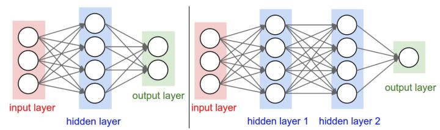

左边是一个2层神经网络，隐层由4个神经元（也可称为单元（unit））组成，输出层由2个神经元组成，输入层是3个神经元。右边是一个3层神经网络，两个含4个神经元的隐层。注意：层与层之间的神经元是全连接的，但是层内的神经元不连接。

#### 命名规则

**当我们说N层神经网络的时候，我们没有把输入层算入。**因此，单层的神经网络就是没有隐层的（输入直接映射到输出）。因此，有的研究者会说逻辑回归或者SVM只是单层神经网络的一个特例。研究者们也会使用*人工神经网络（Artificial Neural Networks 缩写ANN）*或者*多层感知器（Multi-Layer Perceptrons 缩写MLP）*来指代神经网络。很多研究者并不喜欢神经网络算法和人类大脑之间的类比，他们更倾向于用*单元（unit）*而不是神经元作为术语。

**输出层。**和神经网络中其他层不同，**输出层的神经元一般是不会有激活函数的（或者也可以认为它们有一个线性相等的激活函数）**。这是因为最后的输出层<u>大多用于表示分类评分值</u>，因此是任意值的实数，或者某种实数值的目标数（比如在回归中）。

> 如之前的代码：
>
> 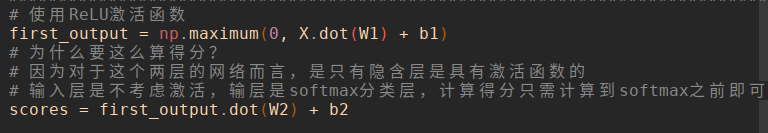

**确定网络尺寸。**用来度量神经网络的尺寸的标准主要有两个：一个是神经元的个数，另一个是参数的个数，用上面图示的两个网络举例：


* 第一个网络有4+2=6个神经元（输入层不算），[3x4]+[4x2]=20个权重，还有4+2=6个偏置权重，共26个可学习的参数。
* 第二个网络有4+4+1=9个神经元，[3x4]+[4x4]+[4x1]=32个权重，4+4+1=9个偏置权重，共41个可学习的参数。

为了方便对比，现代卷积神经网络能包含约1亿个参数，可由10-20层构成（这就是深度学习）。然而，*有效（effective）*连接的个数因为**参数共享**的缘故大大增多。在后面的卷积神经网络内容中我们将学习更多。

### 前向传播计算举例

*不断重复的矩阵乘法与激活函数交织*。将神经网络组织成层状的一个主要原因，就是这个结构让神经网络算法使用矩阵向量操作变得简单和高效。用上面那个3层神经网络举例，输入是[3x1]的向量。一个层所有连接的强度可以存在一个单独的矩阵中。


比如第一个隐层的权重**W1**是[4x3]，所有单元的偏置储存在**b1**中，尺寸[4x1]。这样，每个神经元的权重都在**W1**的一个行中，于是矩阵乘法`np.dot(W1, x)`就能计算该层中所有神经元的激活数据。类似的，**W2**将会是[4x4]矩阵，存储着第二个隐层的连接，**W3**是[1x4]的矩阵，用于输出层。完整的3层神经网络的前向传播就是简单的3次矩阵乘法，其中交织着激活函数的应用。

```python
# 一个3层神经网络的前向传播:
f = lambda x: 1.0/(1.0 + np.exp(-x)) # 激活函数(用的sigmoid)
x = np.random.randn(3, 1) # 含3个数字的随机输入向量(3x1)
h1 = f(np.dot(W1, x) + b1) # 计算第一个隐层的激活数据(4x1)
h2 = f(np.dot(W2, h1) + b2) # 计算第二个隐层的激活数据(4x1)
out = np.dot(W3, h2) + b3 # 神经元输出(1x1)
```

在上面的代码中，**W1，W2，W3，b1，b2，b3**都是网络中可以学习的参数。注意**x**并不是一个单独的列向量，而可以是一个批量的训练数据（其中每个输入样本将会是**x**中的一列），所有的样本将会被并行化的高效计算出来。注意神经网络**最后一层通常是没有激活函数**的（例如，在分类任务中它给出一个实数值的分类评分）。

> 全连接层的前向传播一般就是先进行一个矩阵乘法，然后加上偏置并运用激活函数。

### 表达能力

理解具有全连接层的神经网络的一个方式是：可以认为它们定义了一个由一系列函数组成的函数族，网络的权重就是每个函数的参数。如此产生的问题是：该函数族的表达能力如何？存在不能被神经网络表达的函数吗？

现在看来，拥有至少一个隐层的神经网络是一个*通用的近似器*。在研究（例如1989年的论文[Approximation by Superpositions of Sigmoidal Function](https://link.zhihu.com/?target=http%3A//www.dartmouth.edu/%257Egvc/Cybenko_MCSS.pdf)，或者[Michael Nielsen](https://link.zhihu.com/?target=http%3A//neuralnetworksanddeeplearning.com/chap4.html)的这个直观解释。）中已经证明，给出任意连续函数和任意，均存在一个至少含1个隐层的神经网络（并且网络中有合理选择的非线性激活函数，比如sigmoid），对于，使得。换句话说，神经网络可以近似任何连续函数。

**既然一个隐层就能近似任何函数，那为什么还要构建更多层来将网络做得更深？**

答案是：虽然一个2层网络在数学理论上能完美地近似所有连续函数，但在实际操作中效果相对较差。在一个维度上，虽然以为参数向量“指示块之和”函数也是通用的近似器，但是谁也不会建议在机器学习中使用这个函数公式。神经网络在实践中非常好用，是因为它们**表达出的函数不仅平滑，而且对于数据的统计特性有很好的拟合**。同时，网络通过最优化算法（例如梯度下降）能比较容易地学习到这个函数。类似的，虽然在理论上深层网络（使用了多个隐层）和单层网络的表达能力是一样的，但是就实践经验而言，深度网络效果比单层网络好。

另外，在实践中3层的神经网络会比2层的表现好，然而继续加深（做到4，5，6层）很少有太大帮助。

卷积神经网络的情况却不同，在卷积神经网络中，对于一个良好的识别系统来说，深度是一个极端重要的因素（比如数十(以10为量级)个可学习的层）。对于该现象的一种解释观点是：**因为图像拥有层次化结构（比如脸是由眼睛等组成，眼睛又是由边缘组成），所以多层处理对于这种数据就有直观意义**。

全面的研究内容还很多，近期研究的进展也很多。如果你对此感兴趣，我么推荐你阅读下面文献：

* [Deep Learning](https://link.zhihu.com/?target=http%3A//www.deeplearningbook.org/)的[Chapter6.4](https://link.zhihu.com/?target=http%3A//www.deeplearningbook.org/contents/mlp.html)，作者是Bengio等。
* [Do Deep Nets Really Need to be Deep?](https://link.zhihu.com/?target=http%3A//arxiv.org/abs/1312.6184)
* [FitNets: Hints for Thin Deep Nets](https://link.zhihu.com/?target=http%3A//arxiv.org/abs/1412.6550)

### 设置层的数量和尺寸

在面对一个具体问题的时候该确定网络结构呢？到底是不用隐层呢？还是一个隐层？两个隐层或更多？每个层的尺寸该多大？

首先，要知道当我们增加层的数量和尺寸时，网络的容量上升了。即神经元们可以合作表达许多复杂函数，所以表达函数的空间增加。例如，如果有一个在二维平面上的二分类问题。我们可以训练3个不同的神经网络，每个网络都只有一个隐层，但是每层的神经元数目不同：

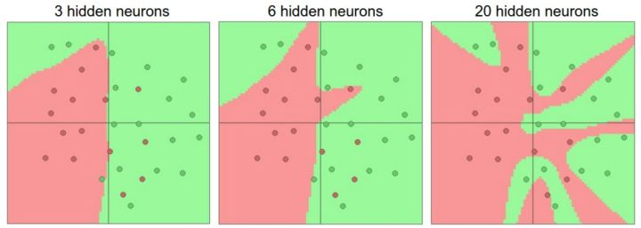

更大的神经网络可以表达更复杂的函数。数据是用不同颜色的圆点表示他们的不同类别，决策边界是由训练过的神经网络做出的。你可以在[ConvNetsJS demo](https://link.zhihu.com/?target=http%3A//cs.stanford.edu/people/karpathy/convnetjs/demo/classify2d.html)上练练手。

在上图中，可以看见有更多神经元的神经网络可以表达更复杂的函数。然而这既是优势也是不足，优势是可以分类更复杂的数据，不足是可能造成对训练数据的过拟合。<u>**过拟合（Overfitting）**是网络对数据中的噪声有很强的拟合能力，而没有重视数据间（假设）的潜在基本关系。</u>举例来说，有20个神经元隐层的网络拟合了所有的训练数据，但是其代价是把决策边界变成了许多不相连的红绿区域。而有3个神经元的模型的表达能力只能用比较宽泛的方式去分类数据。它将数据看做是两个大块，并把个别在绿色区域内的红色点看做噪声。在实际中，这样可以在测试数据中获得更好的**泛化（generalization）**能力。

基于上面的讨论，看起来如果数据不是足够复杂，则似乎小一点的网络更好，因为可以防止过拟合。然而并非如此，防止神经网络的过拟合有很多方法（**L2正则化，dropout和输入噪音等**），后面会详细讨论。在实践中，使用这些方法来控制过拟合比减少网络神经元数目要好得多。

不要减少网络神经元数目的主要原因在于小网络更难使用梯度下降等局部方法来进行训练：**虽然小型网络的损失函数的局部极小值更少，也比较容易收敛到这些局部极小值，但是这些最小值一般都很差，损失值很高。相反，大网络拥有更多的局部极小值，但就实际损失值来看，这些局部极小值表现更好，损失更小。**因为神经网络是非凸的，就很难从数学上研究这些特性。即便如此，还是有一些文章尝试对这些目标函数进行理解，例如[The Loss Surfaces of Multilayer Networks](https://link.zhihu.com/?target=http%3A//arxiv.org/abs/1412.0233)这篇论文。在实际中，你将发现如果训练的是一个小网络，那么最终的损失值将展现出多变性：某些情况下运气好会收敛到一个好的地方，某些情况下就收敛到一个不好的极值。从另一方面来说，如果你训练一个大的网络，你将发现许多不同的解决方法，但是最终损失值的差异将会小很多。这就是说，所有的解决办法都差不多，而且对于随机初始化参数好坏的依赖也会小很多。

重申一下，正则化强度是控制神经网络过拟合的好方法。看下图结果：


不同正则化强度的效果：每个神经网络都有20个隐层神经元，但是随着正则化强度增加，它的决策边界变得更加平滑。你可以在

ConvNetsJS demo上练练手。

需要记住的是：**不应该因为害怕出现过拟合而使用小网络。相反，应该进尽可能使用大网络，然后使用正则化技巧来控制过拟合。**

### 第一部分小结

* 介绍了生物神经元的粗略模型；
* 讨论了几种不同类型的激活函数，其中ReLU是最佳推荐；
* 介绍了**神经网络**，神经元通过**全连接层**连接，层间神经元两两相连，但是层内神经元不连接；
* 理解了分层的结构能够让神经网络高效地进行矩阵乘法和激活函数运算；
* 理解了神经网络是一个**通用函数近似器**，但是该性质与其广泛使用无太大关系。<u>之所以使用神经网络，是因为它们对于实际问题中的函数的公式能够某种程度上做出“正确”假设。</u>
* 讨论了更大网络总是更好的这一事实。<u>然而更大容量的模型一定要和更强的正则化（比如更高的权重衰减）配合，否则它们就会过拟合</u>。在后续章节中我们讲学习更多正则化的方法，尤其是dropout。

### 参考资料

* 使用Theano的[deeplearning.net tutorial](https://link.zhihu.com/?target=http%3A//www.deeplearning.net/tutorial/mlp.html)
* [ConvNetJS](https://link.zhihu.com/?target=http%3A//www.deeplearning.net/tutorial/mlp.html)
* [Michael Nielsen's tutorials](https://link.zhihu.com/?target=http%3A//neuralnetworksanddeeplearning.com/chap1.html)

---

## 第二部分 

### 设置数据和模型

在上一节中介绍了神经元的模型，它在计算内积后进行非线性激活函数计算，神经网络将这些神经元组织成各个层。这些做法共同定义了**评分****函数（score function）**的新形式，该形式是从前面线性分类章节中的简单线性映射发展而来的。具体来数据预处理

关于数据预处理我们有3个常用的符号，数据矩阵**X**，假设其尺寸是**[N x D]**（**N**是数据样本的数量，**D**是数据的维度）。

**均值减法（****Mean subtraction****）**是预处理最常用的形式。它对数据中每个独立*特征*减去平均值，从几何上可以理解为在每个维度上都将数据云的中心都迁移到原点。在numpy中，该操作可以通过代码**X -= np.mean(X, axis=0)**实现。而对于图像，更常用的是对所有像素都减去一个值，可以用**X -= np.mean(X)**实现，也可以在3个颜色通道上分别操作。说，神经网络就是进行了一系列的线性映射与非线性激活函数交织的运算。本节将讨论更多的算法设计选项，比如数据预处理，权重初始化和损失函数。

### 数据预处理

关于数据预处理我们有3个常用的符号，数据矩阵**X**，假设其尺寸是**[N x D]**（**N**是数据样本的数量，**D**是数据的维度）。

**均值减法（Mean subtraction）**是预处理最常用的形式。它<u>对数据中每个独立*特征*减去平均值，</u>从几何上可以理解为在每个维度上都将数据云的中心都迁移到原点。在numpy中，该操作可以通过代码`X -= np.mean(X, axis=0)`实现。而<u>对于图像，更常用的是对所有像素都减去一个值</u>，可以用**X -= np.mean(X)**实现，也可以在3个颜色通道上分别操作。

参考之前"ML与处理.md"文档的内容——

>### 自然灰度图像
>
>==均值消减->PCS/ZCA白化==
>
>灰度图像具有平稳特性，我们通常在第一步对每个数据样本分别做均值消减（即减去直流分量），然后采用 PCA/ZCA 白化处理，其中的 `epsilon` 要**足够大以达到低通滤波**的效果。 
>
>### 彩色图像
>
>==简单缩放->PCA/ZCA白化==
>
>对于彩色图像，<u>色彩通道间并不存在平稳特性</u>。因此我们通常首先对数据进行特征缩放（使像素值位于 [0,1] 区间），然后使用足够大的 `epsilon` 来做 PCA/ZCA。**注意**在进行 PCA 变换前需要对特征进行分量均值归零化。

这里对于彩色图像的处理和之前不同，亦是分通道后使用均值消减。

#### 归一化（Normalization）

是指将数据的所有维度都归一化，使其数值范围都近似相等。有两种常用方法可以实现归一化。

1. 第一种是先对数据做零中心化（zero-centered）处理，然后每个维度都除以其标准差，实现代码为**X /= np.std(X, axis=0)**。
2. 第二种方法是对每个维度都做归一化，使得每个维度的最大和最小值是1和-1。这个预处理操作只有在确信不同的输入特征有不同的数值范围（或计量单位）时才有意义，但要注意预处理操作的重要性几乎等同于学习算法本身。在图像处理中，由于像素的数值范围几乎是一致的（都在0-255之间），所以进行这个额外的预处理步骤并不是很必要。

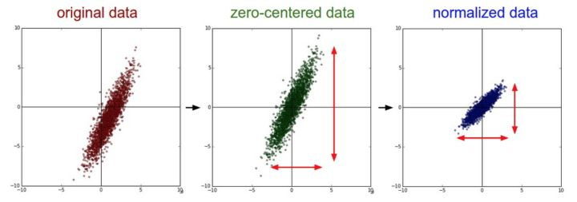

一般数据预处理流程：**左边：**原始的2维输入数据。**中间：**在每个维度上都减去平均值后得到零中心化数据，现在数据云是以原点为中心的。**右边：**每个维度都除以其标准差来调整其数值范围。红色的线指出了数据各维度的数值范围，在中间的零中心化数据的数值范围不同，但在右边归一化数据中数值范围相同。

#### PCA和白化（Whitening）

是另一种预处理形式。在这种处理中，先对数据（各个特征）进行零中心化处理，然后计算协方差矩阵，它展示了数据中的相关性结构。

```python
# 假设输入数据矩阵X的尺寸为[N x D]
X -= np.mean(X, axis = 0) # 对数据进行零中心化(重要)
cov = np.dot(X.T, X) / X.shape[0] # 得到数据的协方差矩阵
```

数据协方差矩阵的第(i, j)个元素是数据第i个和第j个维度的*协方差*。具体来说，该矩阵的对角线上的元素是方差。还有，<u>协方差矩阵是对称和[半正定](https://link.zhihu.com/?target=https%3A//en.wikipedia.org/wiki/Positive-definite_matrix%23Negative-definite.2C_semidefinite_and_indefinite_matrices)的</u>。我们可以对数据协方差矩阵进行SVD（奇异值分解）运算。

```python
U,S,V = np.linalg.svd(cov)
```

$U$的列是特征向量，$S$是装有奇异值的1维数组（因为cov是对称且半正定的，所以$S$中元素是特征值的平方）。为了去除数据相关性，将已经零中心化处理过的原始数据投影到特征基准上：

```python
Xrot = np.dot(X, U) # 对数据去相关性
```

注意$U$的列是标准正交向量的集合（范式为1，列之间标准正交），所以可以把它们看做标准正交基向量。

因此，投影对应x中的数据的一个旋转，旋转产生的结果就是新的特征向量。如果计算**Xrot**的协方差矩阵，将会看到它是对角对称的。**np.linalg.svd**的一个良好性质是在它的返回值$U$中，特征向量是按照特征值的大小排列的。我们可以利用这个性质来对数据降维，只要使用前面的小部分特征向量，丢弃掉那些包含的数据没有**方差**的维度。 这个操作也被称为主成分分析（ [Principal Component Analysis](https://link.zhihu.com/?target=http%3A//en.wikipedia.org/wiki/Principal_component_analysis) 简称PCA）降维：

```python
Xrot_reduced = np.dot(X, U[:,:100]) # Xrot_reduced 变成 [N x 100]
```

经过上面的操作，将原始的数据集的大小由[N x D]降到了[N x 100]，留下了数据中包含最大**方差**的100个维度。通常使用PCA降维过的数据训练线性分类器和神经网络会达到非常好的性能效果，同时还能节省时间和存储器空间。

最后一个在实践中会看见的变换是**白化（whitening）**。白化操作的输入是特征基准上的数据，然后对每个维度除以其特征值来对数值范围进行归一化。

**该变换的几何解释是：如果数据服从多变量的高斯分布，那么经过白化后，数据的分布将会是一个均值为零，且协方差相等的矩阵。**

该操作的代码如下：

```python
# 对数据进行白化操作:
# 除以特征值 
Xwhite = Xrot / np.sqrt(S + 1e-5)
```

*警告：夸大的噪声*。

注意分母中添加了1e-5（或一个更小的常量）来防止分母为0。该变换的一个缺陷是在变换的过程中可能会夸大数据中的噪声，这是因为它将所有维度都拉伸到相同的数值范围，这些维度中也包含了那些只有极少差异性(方差小)而大多是噪声的维度（导致分母过小）。在实际操作中，这个问题可以用更强的平滑来解决（例如：采用比1e-5更大的值）。


PCA/白化——左边是二维的原始数据。中间：经过PCA操作的数据。可以看出数据首先是零中心的，然后变换到了数据协方差矩阵的基准轴上。这样就对数据进行了解相关（协方差矩阵变成对角阵）。右边：每个维度都被特征值调整数值范围，将数据协方差矩阵变为单位矩阵。从几何上看，就是对数据在各个方向上拉伸压缩，使之变成服从高斯分布的一个数据点分布。

我们可以使用CIFAR-10数据将这些变化可视化出来。CIFAR-10训练集的大小是50000x3072，其中每张图片都可以拉伸为3072维的行向量。我们可以计算[3072 x 3072]的协方差矩阵然后进行奇异值分解（比较耗费计算性能），那么经过计算的特征向量看起来是什么样子呢？

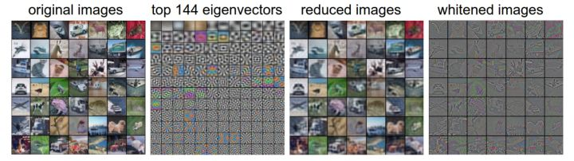

**最左**：一个用于演示的集合，含49张图片。

**左二**：3072个特征值向量中的前144个。靠前面的特征向量解释了数据中大部分的方差，可以看见它们与图像中较低的频率相关。

**第三张**是49张经过了PCA降维处理的图片，展示了144个特征向量。这就是说，展示原始图像是每个图像用3072维的向量，向量中的元素是图片上某个位置的像素在某个颜色通道中的亮度值。而现在每张图片只使用了一个144维的向量，其中每个元素表示了特征向量对于组成这张图片的贡献度。为了让图片能够正常显示，需要将144维度重新变成基于像素基准的3072个数值。因为U是一个旋转，可以通过乘以`U.transpose()[:144,:]`来实现，然后将得到的3072个数值可视化。可以看见图像变得有点模糊了，**这正好说明前面的特征向量获取了较低的频率**。然而，大多数信息还是保留了下来。

**最右**：将“白化”后的数据进行显示。其中144个维度中的方差都被压缩到了相同的数值范围。然后144个白化后的数值通过乘以`U.transpose()[:144,:]`转换到图像像素基准上。现在较低的频率（代表了大多数方差）可以忽略不计了，较高的频率（代表相对少的方差）就被夸大了。

> “现在较低的频率（代表了大多数方差）可以忽略不计了，较高的频率（代表相对少的方差）就被夸大了”这句话的含义？
>
> 为什么较低的频率代表了大多数的方差？又为什么可以忽略不计？
>
> 为什么较高的频率代表相对较少的方差？

#### 实践操作

在这个笔记中提到PCA和白化主要是为了介绍的完整性，实际上在卷积神经网络中并不会采用这些变换。然而对数据进行零中心化操作还是非常重要的，对每个像素进行归一化也很常见。

#### 常见错误

进行预处理很重要的一点是：任何预处理策略（比如数据均值）都<u>只能在训练集数据上进行计算</u>，算法训练完毕后再应用到验证集或者测试集上。

例如，如果先计算整个数据集图像的平均值然后每张图片都减去平均值，最后将整个数据集分成训练/验证/测试集，那么这个做法是错误的。**应该怎么做呢？应该先分成训练/验证/测试集，<u>只是从训练集中求图片平均值</u>，然后各个集（训练/验证/测试集）中的图像<u>再减去这个平均值</u>。**

### 权重初始化

我们已经看到如何构建一个神经网络的结构并对数据进行预处理，但是在开始训练网络之前，还需要初始化网络的参数。

#### 错误：全零初始化。

让我们从应该避免的错误开始。在训练完毕后，虽然不知道网络中每个权重的最终值应该是多少，但如果数据经过了恰当的归一化的话，就可以假设所有权重数值中大约一半为正数，一半为负数。这样，一个听起来蛮合理的想法就是把这些权重的初始值都设为0吧，因为在期望上来说0是最合理的猜测。这个做法错误的！因为如果网络中的每个神经元都计算出同样的输出，然后它们就会在反向传播中计算出同样的梯度，从而进行同样的参数更新。换句话说，<u>如果权重被初始化为同样的值，神经元之间就失去了不对称性的源头</u>。

#### 小随机数初始化

因此，权重初始值要非常接近0又不能等于0。解决方法就是将权重初始化为很小的数值，以此来*打破对称性*。其思路是：如果神经元刚开始的时候是随机且不相等的，那么它们将计算出不同的更新，并将自身变成整个网络的不同部分。

小随机数权重初始化的实现方法是：`W = 0.01 * np.random.randn(D,H)`。**其中**`randn`**函数是基于零均值和标准差的一个高斯分布**（**译者注：国内教程一般习惯称均值参数为期望**）来生成随机数的。根据这个式子，每个神经元的权重向量都被初始化为一个随机向量，而这些随机向量又服从一个多变量高斯分布，这样在输入空间中，所有的神经元的指向是随机的。也可以使用均匀分布生成的随机数，但是从实践结果来看，对于算法的结果影响极小。

**警告**。并不是小数值一定会得到好的结果。例如，一个神经网络的层中的权重值很小，那么在反向传播的时候就会计算出非常小的梯度（因为梯度与权重值是成比例的）。这就会很大程度上减小反向传播中的“梯度信号”，在深度网络中，就会出现问题。

> 如何理解“梯度与权重值是成比例的”？

#### 使用`1/sqrt(n)`校准方差

上面做法存在一个问题，随着输入数据量的增长，随机初始化的神经元的输出数据的分布中的方差也在增大。我们可以除以输入数据量的平方根来调整其数值范围，这样神经元输出的方差就归一化到1了。也就是说，建议将神经元的权重向量初始化为：`w = np.random.randn(n) / sqrt(n)`。**其中**n是输入数据的数量。

> 除以$\sqrt{n}$怎么理解？见后。
>
> 这是为了让有和输入一样的方差。

这样就保证了网络中所有神经元起始时有近似同样的输出分布。实践经验证明，这样做可以**提高收敛的速度**。上述结论的推导过程如下：假设权重和输入之间的内积为，这是还没有进行非线性激活函数运算之前的原始数值。我们可以检查的方差：


![\displaystyle =\sum^n_i[E(assets/equation-1536665549636)]^2Var(x_i)+E[(x_i)]^2Var(w_i)+Var(xIi)Var(w_i)](https://www.zhihu.com/equation?tex=%5Cdisplaystyle+%3D%5Csum%5En_i%5BE%28w_i%29%5D%5E2Var%28x_i%29%2BE%5B%28x_i%29%5D%5E2Var%28w_i%29%2BVar%28xIi%29Var%28w_i%29)

> 这里写错了，应该是$Var(x_i)$


> 这里主要使用的性质是：
>
> 第二步，因为不同i,j之间的结果不相关（这里应该是独立），所以协方差为0。
>
> 
>
> 
>
> 使用方差优先于其他分散度量的一个原因是不相关随机变量之和（或差异）的方差是它们方差的总和。
>
> 第三步：使用的是独立的情况
>
> * Product of independent variables
>
>   If two variables X and Y are [independent](https://en.wikipedia.org/wiki/Independence_(probability_theory)), the variance of their product is given by
>
>   ![{\begin{aligned}\operatorname {Var} (assets/78ba93b03d6960ae5d2a0bd47d027cd2354c9d36)&=[E(X)]^{2}\operatorname {Var} (Y)+[E(Y)]^{2}\operatorname {Var} (X)+\operatorname {Var} (X)\operatorname {Var} (Y).\end{aligned}}](https://wikimedia.org/api/rest_v1/media/math/render/svg/78ba93b03d6960ae5d2a0bd47d027cd2354c9d36)
>
>   Equivalently, using the basic properties of expectation, it is given by
>
>   ![\operatorname {Var} (assets/e431a2d861b74d8df6334564e9cdf79be994a6f8)=E(X^{2})E(Y^{2})-[E(X)]^{2}[E(Y)]^{2}.](https://wikimedia.org/api/rest_v1/media/math/render/svg/e431a2d861b74d8df6334564e9cdf79be994a6f8)
>
> * Product of statistically dependent variables
>
>   In general, if two variables are statistically dependent, the variance of their product is given by:
>
>   ![{\begin{aligned}\operatorname {Var} (assets/f69eebf38df8850d0a28086083d2791a159b0875)&=E[X^{2}Y^{2}]-[E(XY)]^{2}\\&=\operatorname {Cov} (X^{2},Y^{2})+E(X^{2})E(Y^{2})-[E(XY)]^{2}\\&=\operatorname {Cov} (X^{2},Y^{2})+(\operatorname {Var} (X)+[E(X)]^{2})(\operatorname {Var} (Y)+[E(Y)]^{2})-[\operatorname {Cov} (X,Y)+E(X)E(Y)]^{2}\end{aligned}}](https://wikimedia.org/api/rest_v1/media/math/render/svg/f69eebf38df8850d0a28086083d2791a159b0875)

在前两步，使用了[方差的性质](https://link.zhihu.com/?target=http%3A//en.wikipedia.org/wiki/Variance)。

在第三步，因为假设输入和权重的平均值都是0，所以![E[x_i]=E[w_i]=0](https://www.zhihu.com/equation?tex=E%5Bx_i%5D%3DE%5Bw_i%5D%3D0)。<u>注意这并不是一般化情况，比如在ReLU单元中均值就为正</u>。在最后一步，我们假设所有的都服从同样的分布。从这个推导过程我们可以看见，**如果想要有和输入一样的方差，那么在初始化的时候必须保证每个权重的方差是**。

> 为什么要使s有和输入x一样的方差？

又因为对于一个随机变量和标量，有，这就说明可以基于一个标准高斯分布的`X`($Var(X)=1$)，然后乘以，也就是运算($aX$)，使其方差为，于是得出：`w = np.random.randn(n) / sqrt(n)`。

Glorot等在论文[Understanding the difficulty of training deep feedforward neural networks](https://link.zhihu.com/?target=http%3A//jmlr.org/proceedings/papers/v9/glorot10a/glorot10a.pdf)中作出了类似的分析。在论文中，作者推荐初始化公式为，其中是在前一层和后一层中单元的个数。这是基于妥协和对反向传播中梯度的分析得出的结论。

该主题下最新的一篇论文是：[Delving Deep into Rectifiers: Surpassing Human-Level Performance on ImageNet Classification](https://link.zhihu.com/?target=http%3A//arxiv-web3.library.cornell.edu/abs/1502.01852)，作者是He等人。文中给出了一种针对ReLU神经元的特殊初始化，并给出结论：网络中神经元的方差应该是。代码为`w = np.random.randn(n) * sqrt(2.0/n)`。

这个形式是神经网络算法**使用ReLU神经元时的当前最佳推荐**。

#### 稀疏初始化（Sparse initialization）

另一个处理非标定方差的方法是将所有权重矩阵设为0，但是为了打破对称性，每个神经元**都同下一层固定数目的神经元随机连接**（其权重数值由一个小的高斯分布生成）。一个比较典型的连接数目是10个。

> 都说了“将所有权重矩阵设为0”，为什么还有“其权重数值由一个小的高斯分布生成”？

#### 偏置（biases）的初始化

通常将偏置初始化为0，这是因为随机小数值权重矩阵已经打破了对称性。对于ReLU非线性激活函数，有研究人员喜欢使用如0.01这样的小数值常量作为所有偏置的初始值，这是因为他们认为这样做能让所有的ReLU单元一开始就激活，这样就能保存并传播一些梯度。然而，这样做是不是总是能提高算法性能并不清楚（有时候实验结果反而显示性能更差），所以<u>通常还是使用0来初始化偏置参数</u>。

#### 实践操作

<u>当前的推荐是使用ReLU激活函数，并且使用`w = np.random.randn(n) * sqrt(2.0/n)`来进行权重初始化</u>，关于这一点，[这篇文章](https://link.zhihu.com/?target=http%3A//arxiv-web3.library.cornell.edu/abs/1502.01852)有讨论。

#### 批量归一化（Batch Normalization）

[批量归一化](https://link.zhihu.com/?target=http%3A//arxiv.org/abs/1502.03167)是loffe和Szegedy最近才提出的方法，该方法减轻了如何合理初始化神经网络这个棘手问题带来的头痛，其做法是让激活数据在训练开始前通过一个网络，网络处理数据使其服从标准高斯分布。因为归一化是一个简单可求导的操作，所以上述思路是可行的。在实现层面，应用这个技巧通常意味着全连接层（或者是卷积层，后续会讲）与激活函数之间添加一个**BatchNorm**层。对于这个技巧本节不会展开讲，因为上面的参考文献中已经讲得很清楚了，需要知道的是在神经网络中使用批量归一化已经变得非常常见。在实践中，<u>使用了批量归一化的网络对于不好的初始值有更强的鲁棒性</u>。最后一句话总结：<u>批量归一化可以理解为在网络的每一层之前都做预处理，只是这种操作以另一种方式与网络集成在了一起</u>。搞定！

### 正则化 Regularization

有不少方法是通过控制神经网络的容量来防止其过拟合的：

#### L2正则化

可能是最常用的正则化方法了。可以通过惩罚目标函数中所有参数的平方将其实现。即对于网络中的每个权重，向目标函数中增加一个，其中是正则化强度。前面这个很常见，是因为加上后，该式子关于梯度就是而不是了。

**L2正则化可以直观理解为它对于大数值的权重向量进行严厉惩罚，倾向于更加分散的权重向量。**

在线性分类章节中讨论过，由于输入和权重之间的乘法操作，这样就有了一个优良的特性：使网络更倾向于使用所有输入特征，而不是严重依赖输入特征中某些小部分特征。最后需要注意在梯度下降和参数更新的时候，使用L2正则化意味着所有的权重都以`w += -lambda * W`向着0线性下降。

#### L1正则化

是另一个相对常用的正则化方法。对于每个我们都向目标函数增加一个。

L1和L2正则化也可以进行组合：，这也被称作[Elastic net regularizaton](https://link.zhihu.com/?target=http%3A//web.stanford.edu/%257Ehastie/Papers/B67.2%2520%25282005%2529%2520301-320%2520Zou%2520%26%2520Hastie.pdf)。

L1正则化有一个有趣的性质，它会让权重向量在最优化的过程中变得稀疏（即非常接近0）。也就是说，使用L1正则化的神经元最后使用的是它们最重要的输入数据的稀疏子集，同时对于噪音输入则几乎是不变的了。相较L1正则化，L2正则化中的权重向量大多是分散的小数字。在实践中，**如果不是特别关注某些明确的特征选择，一般说来L2正则化都会比L1正则化效果好。**

#### 最大范式约束（Max norm constraints）

另一种形式的正则化是给每个神经元中权重向量的<u>量级设定上限</u>，并使用<u>投影梯度下降</u>来确保这一约束。在实践中，与之对应的是参数更新方式不变，然后要求神经元中的权重向量必须满足这一条件，一般值为3或者4。有研究者发文称在使用这种正则化方法时效果更好。这种正则化还有一个良好的性质，**即使在学习率设置过高的时候，网络中也不会出现数值“爆炸”，这是因为它的参数更新始终是被限制着的**。

#### 随机失活（Dropout）

是一个简单又极其有效的正则化方法。该方法由Srivastava在论文[Dropout: A Simple Way to Prevent Neural Networks from Overfitting](https://link.zhihu.com/?target=http%3A//www.cs.toronto.edu/%257Ersalakhu/papers/srivastava14a.pdf)中提出的，与L1正则化，L2正则化和最大范式约束等方法互为补充。在训练的时候，随机失活的实现方法是让神经元以超参数的概率被激活或者被设置为0。

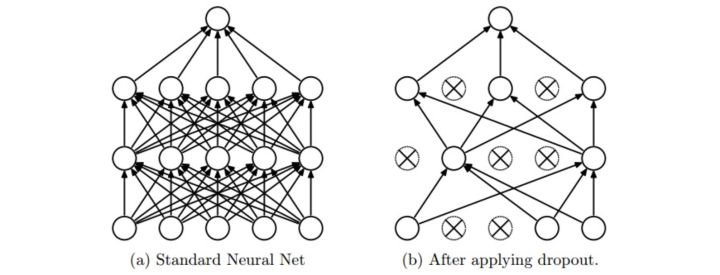

图片来源自[论文](https://link.zhihu.com/?target=http%3A//www.cs.toronto.edu/%7Ersalakhu/papers/srivastava14a.pdf)，展示其核心思路。在训练过程中，随机失活可以被认为是对完整的神经网络抽样出一些子集，每次基于输入数据只更新子网络的参数（然而，数量巨大的子网络们并不是相互独立的，因为它们都**共享参数**）。

> 如何共享参数？

在测试过程中不使用随机失活，可以理解为是对数量巨大的子网络们做了模型集成（model ensemble），以此来计算出一个平均的预测。

#### 普通随机失活

一个3层神经网络的普通版随机失活可以用下面代码实现：

```python
""" 普通版随机失活: 不推荐实现 (看下面笔记) """

p = 0.5 # 激活神经元的概率. p值更高 = 随机失活更弱，越容易保留神经元

def train_step(X):
  	""" X中是输入数据 """

 	# 3层neural network的前向传播
  	H1 = np.maximum(0, np.dot(W1, X) + b1) # 第一层输出
  	U1 = np.random.rand(*H1.shape) < p # 第一个随机失活遮罩，要失活的位置就是0，也就是值大于p的要失活
  	H1 *= U1 # drop!
  	H2 = np.maximum(0, np.dot(W2, H1) + b2) # 第二层输出
  	U2 = np.random.rand(*H2.shape) < p # 第二个随机失活遮罩
  	H2 *= U2 # drop!
  	out = np.dot(W3, H2) + b3 # 第三层输出 = 第三层输入
  	# 反向传播:计算梯度... (略)
  	# 进行参数更新... (略)

def predict(X):
  	# 前向传播时模型集成
  	H1 = np.maximum(0, np.dot(W1, X) + b1) * p # 注意：激活数据要乘以p
  	H2 = np.maximum(0, np.dot(W2, H1) + b2) * p # 注意：激活数据要乘以p
  	out = np.dot(W3, H2) + b3
```

在上面的代码中，**train_step**函数在第一个隐层和第二个隐层上进行了两次随机失活。在输入层上面进行随机失活也是可以的，为此需要为输入数据**X**创建一个二值的遮罩。反向传播保持不变，但是肯定需要将遮罩**U1**和**U2**加入进去。

**注意：**在**predict**函数中不进行随机失活，但是对于两个隐层的输出都要乘以，调整其数值范围。

这一点非常重要，因为在测试时所有的神经元都能看见它们的输入，因此我们想要神经元的输出与训练时的预期输出是一致的。以为例，在测试时神经元必须把它们的输出减半，这是因为在训练的时候它们的输出只有一半。

为了理解这点，先假设有一个神经元的输出，那么进行随机失活的时候，该神经元的输出就是，这是有的概率神经元的输出为0。

在测试时神经元总是激活的，就必须调整来保持同样的预期输出。

> 为什么在测试时神经元总是激活的？因为不进行随机失活。

在测试时会在所有可能的二值遮罩（也就是数量庞大的所有子网络）中迭代并计算它们的协作预测，进行这种减弱的操作也可以认为是与之相关的。

#### 反向随机失活

上述操作不好的性质是必须在测试时对激活数据要按照进行数值范围调整。既然测试性能如此关键，实际更倾向使用**反向随机失活（inverted dropout）**，它是<u>在训练时就进行数值范围调整</u>，从而让前向传播在测试时保持不变。**这样做还有一个好处，无论你决定是否使用随机失活，预测方法的代码可以保持不变**。反向随机失活的代码如下：

```python
""" 
反向随机失活: 推荐实现方式.
在训练的时候drop和调整数值范围，测试时不做任何事.
"""

p = 0.5 # 激活神经元的概率. p值更高 = 随机失活更弱

def train_step(X):
  	# 3层neural network的前向传播
  	H1 = np.maximum(0, np.dot(W1, X) + b1)
 	U1 = (np.random.rand(*H1.shape) < p) / p # 第一个随机失活遮罩. 注意/p!
  	H1 *= U1 # drop!
  	H2 = np.maximum(0, np.dot(W2, H1) + b2)
  	U2 = (np.random.rand(*H2.shape) < p) / p # 第二个随机失活遮罩. 注意/p!
  	H2 *= U2 # drop!
  	out = np.dot(W3, H2) + b3

  # 反向传播:计算梯度... (略)
  # 进行参数更新... (略)

def predict(X):
    # 前向传播时模型集成
    H1 = np.maximum(0, np.dot(W1, X) + b1) # 不用数值范围调整了
    H2 = np.maximum(0, np.dot(W2, H1) + b2)
    out = np.dot(W3, H2) + b3
```

在随机失活发布后，很快有大量研究为什么它的实践效果如此之好，以及它和其他正则化方法之间的关系。如果你感兴趣，可以看看这些文献：

* [Dropout paper](http://www.cs.toronto.edu/~rsalakhu/papers/srivastava14a.pdf) by Srivastava et al. 2014.
* [Dropout Training as Adaptive Regularization](http://papers.nips.cc/paper/4882-dropout-training-as-adaptive-regularization.pdf)：“我们认为：在使用费希尔信息矩阵（[fisher information matrix](https://en.wikipedia.org/wiki/Fisher_information_metric)）的对角逆矩阵的期望对特征进行数值范围调整后，再进行L2正则化这一操作，与随机失活正则化是一阶相等的。”

实际中，dropout层中的实现：

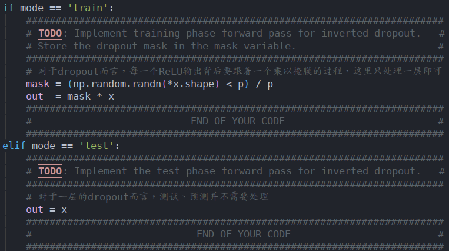

对于反向传播时，对应的实际代码：

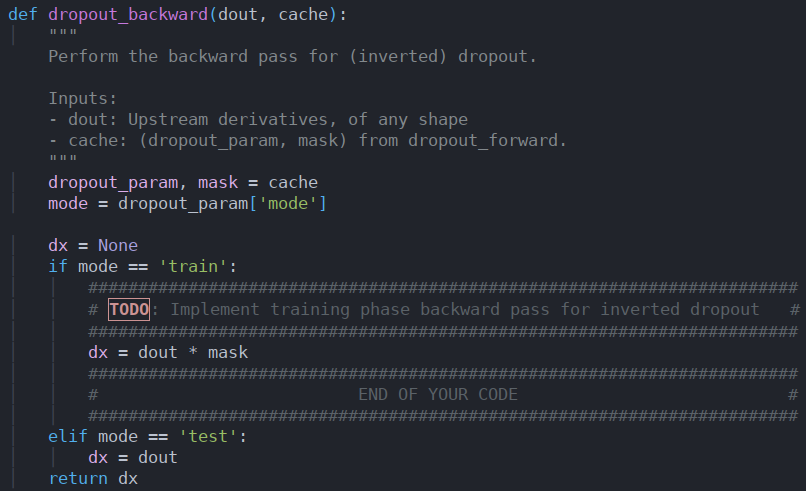

#### 其他内容

**前向传播中的噪音**

在更一般化的分类上，随机失活属于网络在前向传播中有随机行为的方法。测试时，通过*分析法*（在使用随机失活的本例中就是乘以）或*数值法*（例如通过抽样出很多子网络，随机选择不同子网络进行前向传播，最后对它们取平均）将噪音边缘化。在这个方向上的另一个研究是[DropConnect](http://cs.nyu.edu/~wanli/dropc/)，它在前向传播的时候，一系列权重被随机设置为0。提前说一下，卷积神经网络同样会吸取这类方法的优点，比如随机汇合（stochastic pooling），分级汇合（fractional pooling），数据增长（data augmentation）。我们在后面会详细介绍。

**偏置正则化** 

在线性分类器的章节中介绍过，对于偏置参数的正则化并不常见，**因为它们在矩阵乘法中和输入数据并不产生互动，所以并不需要控制其在数据维度上的效果**。

> 怎么理解？

然而在实际应用中（使用了合理数据预处理的情况下），对偏置进行正则化也很少会导致算法性能变差。这可能是因为相较于权重参数，偏置参数实在太少，所以分类器需要它们来获得一个很好的数据损失，那么还是能够承受的。

**每层正则化**

对于不同的层进行不同强度的正则化很少见（可能除了输出层以外），关于这个思路的相关文献也很少。

**实践**

* 通过交叉验证获得一个全局使用的L2正则化强度是比较常见的。
* 在使用L2正则化的同时在所有层后面使用随机失活也很常见。

值一般默认设为0.5，也可能在验证集上调参。

### 损失函数

我们已经讨论过损失函数的正则化损失部分，它可以看做是对模型复杂程度的某种惩罚。

损失函数的第二个部分是*数据损失*，它是一个有监督学习问题，用于衡量分类算法的预测结果（即分类评分）和真实标签结果之间的一致性。数据损失是对所有样本的数据损失求平均。也就是说，中，是训练集数据的样本数。让我们把神经网络中输出层的激活函数简写为，在实际中你可能需要解决以下几类问题：

1. 分类问题

   在该问题中，假设有一个装满样本的数据集，每个样本都有一个唯一的正确标签（是固定分类标签之一）。在这类问题中，一个最常见的损失函数就是SVM（是Weston Watkins 公式）：

   

   之前简要提起过，有些学者的论文中指出平方折叶损失（即使用）算法的结果会更好。

   第二个常用的损失函数是Softmax分类器，它使用交叉熵损失：

   

2. 问题：类别数目巨大

    当标签集非常庞大（例如字典中的所有英语单词，或者ImageNet中的22000种分类），就需要使用*分层Softmax（**Hierarchical Softmax**）*了（[参考文献](http://arxiv.org/pdf/1310.4546.pdf)）。分层softmax将标签分解成一个树。每个标签都表示成这个树上的一个路径，这个树的每个节点处都训练一个Softmax分类器来在左和右分枝之间做决策。树的结构对于算法的最终结果影响很大，而且一般需要具体问题具体分析。

    > 类似于霍夫曼树？

3. 属性（Attribute）分类

   上面两个损失公式的前提，都是假设每个样本只有一个正确的标签。但是如果是一个二值向量，每个样本可能有，也可能没有某个属性，而且属性之间**并不相互排斥**呢？比如在Instagram上的图片，就可以看成是被一个巨大的标签集合中的某个子集打上标签，一张图片上可能有多个标签。在这种情况下，一个明智的方法是为每个属性创建一个独立的二分类的分类器。例如，针对每个分类的二分类器会采用下面的公式：

   

   上式中，求和是对所有分类，的值为1或者-1，具体根据**第i个样本是否被第j个属性打标签**而定，当该类别**被正确预测并展示**的时候，分值向量为正，其余情况为负。

   可以发现，当一个正样本（分值向量为正）的得分小于+1，或者一个负样本（分值向量为负）得分大于-1（负样本，又没有被第j个属性打标签）的时候，算法就会累计损失值。

   另一种方法是对每种属性训练一个独立的逻辑回归分类器。二分类的逻辑回归分类器只有两个分类（0，1），其中对于分类1的概率计算为：

   

   > 这里为什么分母使用的是加一的形式？确实是加一，记错了。

   因为类别0和类别1的概率和为1，所以类别0的概率为：。

   这样，如果或者，那么样本就要被分类成为正样本（y=1）。然后损失函数最大化这个对数似然函数，问题可以简化为：

   

   上式中，假设标签非0即1，就是sigmoid函数。上面的公式看起来吓人，但是的梯度实际上非常简单：（你可以自己求导来验证）。

   > 之后在利用链式法则可以计算对于w和b的偏导数

4. 回归问题

   是预测实数的值的问题，比如预测房价，预测图片中某个东西的长度等。对于这种问题，通常是计算预测值和真实值之间的损失。然后用L2平方范式或L1范式度量差异。

   对于某个样本，**L2范式**计算如下：

   

   之所以在目标函数中要进行平方，是因为梯度算起来更加简单。因为**平方是一个单调运算，所以不用改变最优参数**。

   **L1范式**则是要将每个维度上的绝对值加起来：

   

   在上式中，如果有多个数量被预测了，就要对预测的所有维度的预测求和，即。观察第i个样本的第j维，用表示预测值与真实值之间的差异。

   关于该维度的梯度（也就是）能够轻松地通过被求导为L2范式的或。

   这就是说，评分值的梯度要么与误差中的差值直接成比例，要么是固定的并从差值中继承sign。

   > $$\delta_i^{(l)}=\frac{\partial J}{\partial f_i^{(l)}} $$

   *注意*：L2损失比起较为稳定的Softmax损失来，其**最优化过程要困难很多**。

   * 直观而言，它需要网络具备一个特别的性质，即对于每个输入（和增量）都要输出一个确切的正确值。而在Softmax中就不是这样，**每个评分的准确值并不是那么重要：只有当它们量级适当的时候，才有意义**。

   * 还有，L2损失鲁棒性不好，因为异常值可以导致很大的梯度。

   所以在面对一个回归问题时，**先考虑将输出变成二值化是否真的不够用**。例如，如果对一个产品的星级进行预测，使用5个独立的分类器来对1-5星进行打分的效果一般比使用一个回归损失要好很多。<u>分类还有一个额外优点，就是能给出关于回归的输出的分布，而不是一个简单的毫无把握的输出值</u>。

   > 怎么理解？

   如果确信分类不适用，那么使用L2损失吧，但是一定要谨慎：L2非常脆弱，**在网络中使用随机失活（尤其是在L2损失层的上一层）不是好主意**。

   > 当面对一个回归任务，首先考虑是不是必须这样。一般而言，尽量把你的输出变成二分类，然后对它们进行分类，从而变成一个分类问题。

5. 结构化预测（structured prediction）

   结构化损失是指**标签可以是任意的结构**，例如图表、树或者其他复杂物体的情况。

   通常这种情况还会**假设结构空间非常巨大，不容易进行遍历**。

   结构化SVM背后的基本思想就是**在正确的结构和得分最高的非正确结构之间画出一个边界**。

   解决这类问题，并不是像解决一个简单无限制的最优化问题那样使用梯度下降就可以了，而是需要设计一些特殊的解决方案，这样可以有效利用对于结构空间的特殊简化假设。我们简要地提一下这个问题，但是详细内容就超出本课程范围。

### 第二部分小结

小结如下：

* 推荐的预处理操作是对数据的每个特征都进行**零中心化**，然后将其数值范围都归一化到[-1,1]范围之内。

  > 具体见“ML预处理.md”

* 使用标准差为的高斯分布来**初始化权重**，其中是输入的神经元数。例如用numpy可以写作：`w = np.random.randn(n) \* sqrt(2.0/n)`。

* 使用**L2正则化**和**随机失活**的倒置版本。

* 使用**批量归一化**。

* 讨论了在实践中可能要面对的不同任务，以及每个任务对应的常用**损失函数**。

现在，我们预处理了数据，初始化了模型。在下一节中，我们将讨论算法的学习过程及其运作特性。

---

## 第三部分

### 学习过程

在前面章节中，我们讨论了神经网络的静态部分：如何创建网络的连接、数据和损失函数。本节将致力于讲解神经网络的动态部分，即神经网络学习参数和搜索最优超参数的过程。

### 梯度检查

理论上将进行梯度检查很简单，就是简单地把解析梯度和数值计算梯度进行比较。然而从实际操作层面上来说，这个过程更加复杂且容易出错。下面是一些提示、技巧和需要仔细注意的事情：

#### 使用中心化公式

在使用有限差值近似来计算数值梯度的时候，常见的公式是：


其中是一个很小的数字，在实践中近似为1e-5。在实践中证明，**使用*中心化*公式效果**更好：


该公式在检查梯度的每个维度的时候，会要求计算两次损失函数（所以计算资源的耗费也是两倍），但是梯度的近似值会准确很多。要理解这一点，对和使用泰勒展开，可以看到第一个公式的误差近似，第二个公式的误差近似（是个二阶近似）。**（译者注：泰勒展开相关内容可阅读《高等数学》第十二章第四节：函数展开成幂级数。）**

> 定理：设函数在点的某一邻域内只有各阶导数，则在该邻域内能展开成Taylor级数的充分条件是的Taylor公式中的余项当时的极限为零。
>
> 取时，称为函数的麦克劳林级数
>
> 函数展开成幂级数的方法
>
> 1．直接方法：
>
> （1）求的各阶导数
>
> （2）求
>
> （3）写出幂级数，且求出
>
> （4）考察余项是否趋于零？如趋于零，则在内的幂级数展开式为
>
> 
>
> 例如， 可用此法分别求出和的展开式：
>
> 
>
> 2．间接方法：利用幂级数可以逐项求导，逐项积分进行
>
> 例如，
>
> 注：必须熟记五个函数的幂级数展开式：
>
> **小结：**
>
> * 幂级数是函数项级数中最基本的一类。它的特点是在其收敛区间绝对收敛，且**幂级数在收敛区间内可逐项微分和积分**。由此第一次得到了一种函数的无限形式的表达式（即幂级数展开式），将函数展为幂级数无论在理论研究方面还是在应用方面都有着重大的意义。
>
> * 一个函数的幂级数展开式只依赖函数在展开点出的各阶导数，这是Taylor级数的优点。但从另一方面看，这又是它的缺点，因为求任意阶导数并不容易，而且许多函数难以满足这样强的条件。
>
> * 还应看到，若想取级数的前项和作为函数的近似值，则在离开展开点稍远一点的地方，取非常大才能使误差在所要求的限度内。
>
>   ​						 
>
> 
>
>

#### 使用相对误差来比较

比较数值梯度和解析梯度的细节有哪些？如何得知此两者不匹配？你可能会倾向于监测它们的差的绝对值或者差的平方值，<u>然后定义该值如果超过某个规定阈值，就判断梯度实现失败</u>。

然而该思路是**有问题的**。想想，假设这个差值是1e-4，如果两个梯度值在1.0左右，这个差值看起来就很合适，可以认为两个梯度是匹配的。然而如果梯度值是1e-5或者更低，那么1e-4就是非常大的差距，梯度实现肯定就是失败的了。因此，使用*相对误差*总是更合适一些：

上式考虑了差值占两个梯度绝对值的比例。

注意通常相对误差公式只包含两个式子中的一个（任意一个均可），但是我**更倾向取两个式子的最大值或者取两个式子的和**。这样做是为了防止在其中一个式子为0时，公式分母为0（这种情况，在ReLU中是经常发生的）。然而，还必须注意两个式子都为零且通过梯度检查的情况。在实践中：

* 相对误差>1e-2：通常就意味着梯度可能出错。
* 1e-2>相对误差>1e-4：要对这个值感到不舒服才行。
* 1e-4>相对误差：这个值的相对误差对于有不可导点的目标函数是OK的。但如果目标函数中没有kink（使用tanh和softmax），那么相对误差值还是太高。
* 1e-7或者更小：好结果，可以高兴一把了。

要知道的是网络的深度越深，相对误差就越高。所以如果你是在对一个10层网络的输入数据做梯度检查，那么1e-2的相对误差值可能就OK了，因为误差一直在累积。相反，如果一个可微函数的相对误差值是1e-2，那么通常说明梯度实现不正确。

#### 使用双精度

<u>一个常见的错误是使用单精度浮点数来进行梯度检查</u>。这样会导致即使梯度实现正确，相对误差值也会很高（比如1e-2）。在我的经验而言，出现过使用单精度浮点数时相对误差为1e-2，换成双精度浮点数时就降低为1e-8的情况。

#### 保持在浮点数的有效范围

建议通读《[What Every Computer Scientist Should Konw About Floating-Point Artthmetic](http://docs.oracle.com/cd/E19957-01/806-3568/ncg_goldberg.html)》一文，该文将阐明你可能犯的错误，促使你写下更加细心的代码。例如，在神经网络中，在一个批量的数据上对损失函数进行归一化是很常见的。但是，如果每个数据点的梯度很小，然后又用数据点的数量去除，就使得数值更小，这反过来会导致更多的数值问题。

这就是我为什么**总是会把原始的解析梯度和数值梯度数据打印出来**，确保用来比较的数字的值不是过小（**通常绝对值小于1e-10就绝对让人担心**）。

如果确实过小，**可以使用一个常数暂时将损失函数的数值范围扩展到一个更“好”的范围，在这个范围中浮点数变得更加致密。比较理想的是1.0的数量级上，即当浮点数指数为0时。**

#### 目标函数的不可导点（kinks）

在进行梯度检查时，一个导致不准确的原因是不可导点问题。

不可导点是指目标函数不可导的部分，由ReLU（）等函数，或SVM损失，Maxout神经元等引入。

考虑当的时，对ReLU函数进行梯度检查。因为，所以解析梯度在该点的梯度为0。然而，在这里数值梯度会突然计算出一个非零的梯度值，因为可能越过了不可导点(例如：如果)，导致了一个非零的结果。

你可能会认为这是一个极端的案例，但实际上这种情况很常见。例如，一个用CIFAR-10训练的SVM中，因为有50,000个样本，且根据目标函数每个样本产生9个式子（因为错误分类有九项），所以包含有450,000个式子。而一个用SVM进行分类的*神经网络*因为采用了ReLU，还会有更多的不可导点。

注意，在计算损失的过程中是可以知道不可导点有没有被越过的。在具有形式的函数中持续跟踪所有“赢家”的身份，就可以实现这一点。其实就是看在前向传播时，到底x和y谁更大。如果在计算和的时候，至少有一个“赢家”的身份变了，那就说明不可导点被越过了，数值梯度会不准确。

> 具体如何实现？

#### 使用少量数据点

解决上面的不可导点问题的一个办法是使用更少的数据点。因为含有不可导点的损失函数(例如：因为使用了ReLU或者边缘损失等函数)的数据点越少，不可导点就越少，所以在<u>计算有限差值近似时越过不可导点的几率就越小</u>。还有，如果你的梯度检查对2-3个数据点都有效，那么基本上对整个批量数据进行梯度检查也是没问题的。所以<u>使用很少量的数据点，能让梯度检查更迅速高效</u>。

#### 谨慎设置步长h

在实践中h并不是越小越好，因为当特别小的时候，就可能就会遇到数值精度问题。有时候如果梯度检查无法进行，可以试试将调到1e-4或者1e-6，然后突然梯度检查可能就恢复正常。这篇[维基百科文章](https://en.wikipedia.org/wiki/Numerical_differentiation)中有一个图表，其x轴为值，y轴为数值梯度误差。


#### 在操作的特性模式中梯度检查

有一点必须要认识到：梯度检查是在参数空间中的一个特定（往往还是随机的）的单独点进行的。即使是在该点上梯度检查成功了，也不能马上确保全局上梯度的实现都是正确的。

还有，**一个随机的初始化可能不是参数空间最优代表性的点**，这可能导致进入某种病态的情况，即梯度看起来是正确实现了，实际上并没有。例如，SVM使用小数值权重初始化，就会把一些接近于0的得分分配给所有的数据点，而梯度将会在所有的数据点上展现出某种模式。

> “SVM使用小数值权重初始化，就会把一些接近于0的得分分配给所有的数据点，而梯度将会在所有的数据点上展现出某种模式”怎么理解？

一个不正确实现的梯度也许依然能够产生出这种模式，但是不能泛化到更具代表性的操作模式，比如在一些的得分比另一些得分更大的情况下就不行。因此为了安全起见，最好让网络学习（“预热”）一小段时间，<u>等到损失函数开始下降的之后再进行梯度检查</u>。**在第一次迭代就进行梯度检查的危险就在于，此时可能正处在不正常的边界情况，从而掩盖了梯度没有正确实现的事实**。

#### 不要让正则化吞没数据

通常损失函数是数据损失和正则化损失的和（例如L2对权重的惩罚）。需要注意的危险是正则化损失可能吞没掉数据损失，在这种情况下**梯度主要来源于正则化部分**（正则化部分的梯度表达式通常简单很多）。这样就<u>会掩盖掉数据损失梯度的不正确实现</u>。

因此，**推荐先关掉正则化对数据损失做单独检查，然后对正则化做单独检查**。

对于正则化的单独检查可以是修改代码，去掉其中数据损失的部分，也可以提高正则化强度，确认其效果在梯度检查中是无法忽略的，这样不正确的实现就会被观察到了。

#### 记得关闭随机失活（dropout）和数据扩张（augmentation）

在进行梯度检查时，记得关闭网络中任何不确定的效果的操作，比如随机失活，随机数据扩展等。不然它们会在计算数值梯度的时候**导致巨大误差**。

关闭这些操作不好的一点是**无法对它们进行梯度检查**（例如随机失活的反向传播实现可能有错误）。

因此，一个更好的解决方案就是在计算和前强制增加一个特定的随机种子，在计算解析梯度时也同样如此。

> 如何实现？

#### 检查少量的维度

在实际中，梯度可以有上百万的参数，在这种情况下**只能检查其中一些维度然后假设其他维度是正确**的。

**注意**：确认在所有不同的参数中都抽取一部分来梯度检查。在某些应用中，为了方便，人们将所有的参数放到一个巨大的参数向量中。在这种情况下，例如偏置就可能只占用整个向量中的很小一部分，所以不要随机地从向量中取维度，一定要把这种情况考虑到，确保所有参数都收到了正确的梯度。

> 意思是偏置也应该抽取到

### 学习之前：合理性检查的提示与技巧

在进行费时费力的最优化之前，最好进行一些合理性检查：

* **寻找特定情况的正确损失值。**在**使用小参数进行初始化**时，确保得到的损失值与期望一致。最好先单独检查数据损失（让正则化强度为0）。

  例如，对于一个跑CIFAR-10的**Softmax分类器**，一般期望它的初始损失值是2.302，这是因为初始时预计每个类别的概率是0.1（因为有10个类别），然后Softmax损失值正确分类的负对数概率：-ln(0.1)=2.302。

  对于**Weston Watkins SVM**，假设所有的边界都被越过（因为所有的**分值都近似为零**），所以损失值是9（因为**对于每个错误分类，边界值是1**）。如果没看到这些损失值，那么初始化中就可能有问题。

  > 一般而言，深度学习中使用的SVM损失函数是基于 [Weston and Watkins 1999 (pdf)](https://www.elen.ucl.ac.be/Proceedings/esann/esannpdf/es1999-461.pdf) 。 
  > 其损失函数如下：
  >
  > $ Li=∑_{j≠y_i}max(0,f_j−f_{y_i}+Δ) $
  >
  > 在实际使用中，$Δ$ 的值一般取1，代表间隔。

* 第二个合理性检查：提高正则化强度时导致损失值变大。

* **对小数据子集过拟合。**最后也是最重要的一步，在整个数据集进行训练之前，尝试在一个很小的数据集上进行训练（比如20个数据），然后确保能到达0的损失值。

  进行这个实验的时候，最好让正则化强度为0，不然它会阻止得到0的损失。除非能通过这一个正常性检查，不然进行整个数据集训练是没有意义的。但是注意，能对小数据集进行过拟合并不代表万事大吉，依然有可能存在不正确的实现。

  比如，因为某些错误，数据点的特征是随机的，这样算法也可能对小数据进行过拟合，但是在整个数据集上跑算法的时候，就没有任何泛化能力。

### 检查整个学习过程

在训练神经网络的时候，应该跟踪多个重要数值。这些数值输出的图表是观察训练进程的一扇窗口，是直观理解不同的超参数设置效果的工具，从而知道如何修改超参数以获得更高效的学习过程。

在下面的图表中，x轴通常都是表示**周期（epochs）**单位，该单位衡量了**在训练中每个样本数据都被观察过次数的期望（一个周期意味着每个样本数据都被观察过了一次）**。相较于迭代次数（iterations），**一般更倾向跟踪周期，**这是因为迭代次数与数据的批尺寸（batchsize）有关，而批尺寸的设置又可以是任意的。

#### 损失函数

训练期间第一个要跟踪的数值就是**损失值**，它在前向传播时对每个独立的批数据进行计算。下图展示的是随着损失值随时间的变化，尤其是曲线形状会给出关于学习率设置的情况：


左图展示了不同的学习率的效果。过低的学习率导致算法的改善是线性的。高一些的学习率会看起来呈几何指数下降，更高的学习率会让损失值很快下降，但是接着就停在一个不好的损失值上（绿线）。**这是因为最优化的“能量”太大，参数在混沌中随机震荡，不能最优化到一个很好的点上。**

> 这里描述的有点玄乎

右图显示了一个典型的随时间变化的损失函数值，在CIFAR-10数据集上面训练了一个小的网络，这个损失函数值曲线看起来比较合理（虽然可能学习率有点小，但是很难说），而且指出了<u>批数据的数量可能有点太小</u>（因为损失值的噪音很大）。（这里可以参见Andrew Ng的机器学习课程中大规模机器学习的随机梯度下降收敛及学习率选择的部分）

**损失值的震荡程度和批尺寸（batch size）有关**，当批尺寸为1，震荡会相对较大。当批尺寸就是整个数据集时震荡就会最小，因为每个梯度更新都是单调地优化损失函数（除非学习率设置得过高）。

有的研究者喜欢**用对数域对损失函数值作图**。因为学习过程一般都是采用指数型的形状，图表就会看起来更像是能够直观理解的直线，而不是呈曲棍球一样的曲线状。

还有，如果**多个交叉验证模型在一个图上同时输出图像**，它们之间的差异就会比较明显。

有时候损失函数看起来很有意思：[lossfunctions.tumblr.com](http://lossfunctions.tumblr.com/)。

#### 训练集和验证集准确率

在训练分类器的时候，需要跟踪的第二重要的数值是**验证集和训练集的准确率**。这个图表<u>能够展现知道模型过拟合的程度</u>：


在训练集准确率和验证集准确率中间的空隙指明了模型过拟合的程度。

在图中，**蓝色的验证集曲线显示相较于训练集，验证集的准确率低了很多**，这就说明模型有很强的过拟合（过度帖和训练集）。遇到这种情况，就应该增大正则化强度（更强的L2权重惩罚，更多的随机失活等）或收集更多的数据。

另一种可能就是**验证集曲线和训练集曲线如影随形**，这种情况说明你的模型容量还不够大：应该通过增加参数数量让模型容量更大些。

#### 权重更新比例

最后一个应该跟踪的量是**权重中更新值的数量和全部值的数量之间的比例**。注意：是*更新的*，而不是原始梯度（比如，在<u>普通sgd中就是梯度乘以学习率</u>）。需要对每个参数集的更新比例进行单独的计算和跟踪。**一个经验性的结论是这个比例应该在1e-3左右**。如果更低，说明学习率可能太小，如果更高，说明学习率可能太高。

下面是具体例子：

```python
# 这里跟踪的是范式
# 假设参数向量为W，其梯度向量为dW
# 返回得到L2范数——2-norm
param_scale = np.linalg.norm(W.ravel())
# 首先声明两者所要实现的功能是一致的（将多维数组降位一维）。
# 两者的区别在于返回拷贝（copy）还是返回视图（view）
# numpy.flatten()返回一份拷贝，对拷贝所做的修改不会影响（reflects）原始矩阵
# 而numpy.ravel()返回的是视图（view，也颇有几分C/C++引用reference的意味），会影响（reflects）原始矩阵
# 两者默认均是行序优先。
update = -learning_rate*dW # 简单SGD更新
update_scale = np.linalg.norm(update.ravel())
W += update # 实际更新
print update_scale / param_scale # 要得到1e-3左右
```

相较于跟踪最大和最小值，有研究者更喜欢**计算和跟踪梯度的范式及其更新**。这些矩阵通常是相关的，也能得到近似的结果。

#### 每层的激活数据及梯度分布

一个不正确的初始化可能让学习过程变慢，甚至彻底停止。

还好，这个问题可以比较简单地诊断出来。

其中一个方法是**输出网络中所有层的激活数据和梯度分布的柱状图**。直观地说，就是如果看到任何奇怪的分布情况，那都不是好兆头。比如，<u>对于使用tanh的神经元，我们应该看到激活数据的值在整个[-1,1]区间中都有分布</u>。如果看到神经元的输出全部是0，或者全都饱和了往-1和1上跑，那肯定就是有问题了。

#### 第一层可视化

最后，如果数据是图像像素数据，那么把第一层特征可视化会有帮助：

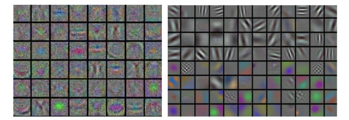

将神经网络第一层的权重可视化的例子。

**左图**中的特征充满了噪音，这暗示了网络可能出现了问题：网络没有收敛，学习率设置不恰当，正则化惩罚的权重过低。

**右图**的特征不错，**平滑**，**干净**而且**种类繁多**，说明训练过程进行良好。

### 参数更新

一旦能使用反向传播计算解析梯度，梯度就能被用来进行参数更新了。进行参数更新有好几种方法，接下来都会进行讨论。

深度网络的最优化是现在非常活跃的研究领域。本节将重点介绍一些公认有效的常用的技巧，这些技巧都是在实践中会遇到的。我们将简要介绍这些技巧的直观概念，但不进行细节分析。对于细节感兴趣的读者，我们提供了一些拓展阅读。

#### 随机梯度下降及各种更新方法

##### 普通更新

最简单的更新形式是沿着负梯度方向改变参数（因为**梯度指向的是上升方向**，但是我们通常希望最小化损失函数）。假设有一个参数向量**x**及其梯度**dx**，那么最简单的更新的形式是：

```python
# 普通更新
x += - learning_rate * dx
```

其中learning_rate是一个超参数，它是一个固定的常量。当在整个数据集上进行计算时，只要学习率足够低，总是能在损失函数上得到非负的进展。

##### 动量（Momentum）更新

是另一个方法，*这个方法在深度网络上几乎总能得到更好的收敛速度*。该方法可以看成是从物理角度上对于最优化问题得到的启发。损失值可以理解为是山的高度（因此高度势能是，所以有）。用随机数字初始化参数等同于在某个位置给质点设定初始速度为0。**这样最优化过程可以看做是模拟参数向量（即质点）在地形上滚动的过程。**

因为作用于质点的力与梯度的潜在能量（）有关，质点**所受的力**就是损失函数的**（负）梯度**。还有，因为，所以在这个观点下（负）梯度与质点的加速度是成比例的。

注意这个理解和上面的随机梯度下降（SDG）是不同的，在普通版本中，梯度直接影响位置。而在这个版本的更新中，物理观点建议<u>梯度只是影响速度，然后速度再影响位置</u>：

```python
# 动量更新
v = mu * v - learning_rate * dx # 与速度融合
x += v # 与位置融合
```

在这里引入了一个初始化为0的变量$v$和一个超参数$\mu$。

说得不恰当一点，这个变量（$\mu$）在最优化的过程中被看做*动量*（一般值设为0.9），但其物理意义与摩擦系数更一致。这个变量有效地抑制了速度，降低了系统的动能，不然质点在山底永远不会停下来。

通过交叉验证，这个参数通常设为**[0.5,0.9,0.95,0.99]**中的一个。和学习率随着时间退火（下文有讨论）类似，**动量随时间变化的设置有时能略微改善最优化的效果**，其中动量在学习过程的后阶段会上升。一个典型的设置是刚开始将动量设为0.5而在后面的多个**周期（epoch）**中慢慢提升到0.99。

> 通过动量更新，参数向量会在任何有持续梯度的方向上增加速度。（下山的方向）

**Nesterov动量**与普通动量有些许不同，最近变得比较流行。在理论上对于凸函数它能得到更好的收敛，在实践中也确实比标准动量表现更好一些。

Nesterov动量的核心思路是，当参数向量位于某个位置**x**时，观察上面的动量更新公式可以发现，动量部分（忽视带梯度的第二个部分）会通过`mu * v`稍微改变参数向量。因此，如果要计算梯度，那么可以将未来的近似位置`x + mu * v`看做是“向前看”，这个点在我们一会儿要停止的位置附近。因此，计算`x + mu * v`的梯度而不是“旧”位置`x`的梯度就有意义了。

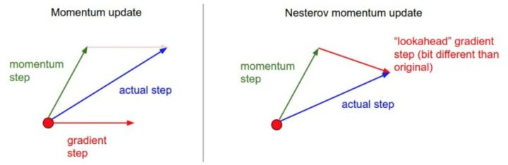

Nesterov动量。既然我们知道动量将会把我们带到绿色箭头指向的点，我们就不要在原点（红色点）那里计算梯度了。使用Nesterov动量，我们就**在这个“向前看”的地方计算梯度**。

> 要整体看，不要只限于某一个特征，可以从多个参数的角度上来理解整体所作的运算，因为梯度下降实际上对于各个多个维度都有更新。

也就是说，添加一些注释后，实现代码如下：

```python
x_ahead = x + mu * v
# 计算dx_ahead(在x_ahead处的梯度，而不是在x处的梯度)
v = mu * v - learning_rate * dx_ahead
x += v # 在自身的基础上移动
```

然而在实践中，人们更喜欢和普通SGD或上面的动量方法一样简单的表达式。通过对`x_ahead = x + mu * v`使用变量变换进行改写是可以做到的，然后用**x_ahead**而不是**x**来表示上面的更新。也就是说，实际存储的参数向量总是向前一步的那个版本。

**x_ahead**的公式（将其重新命名为**x**）就变成了：

```python
v_prev = v # 存储备份
v = mu * v - learning_rate * dx # 速度更新保持不变
x += -mu * v_prev + (1 + mu) * v # 位置更新变了形式
```

> 这里的代码的含义？

对于NAG（Nesterov's Accelerated Momentum）的来源和数学公式推导，我们推荐以下的拓展阅读：

* Yoshua Bengio的[Advances in optimizing Recurrent Networks](http://arxiv.org/pdf/1212.0901v2.pdf)，Section 3.5。
* [Ilya Sutskever's thesis](http://www.cs.utoronto.ca/~ilya/pubs/ilya_sutskever_phd_thesis.pdf) (pdf)在section 7.2对于这个主题有更详尽的阐述。

##### 学习率退火

在训练深度网络的时候，让学习率随着时间退火通常是有帮助的。

可以这样理解：如果学习率很高，系统的动能就过大，*参数向量就会无规律地跳动，不能够稳定到损失函数更深更窄的部分去*。知道什么时候开始衰减学习率是有技巧的：慢慢减小它，可能在很长时间内只能是浪费计算资源地看着它混沌地跳动，实际进展很少。但如果快速地减少它，系统可能过快地失去能量，不能到达原本可以到达的最好位置。

通常，实现学习率退火有3种方式：

* **随步数衰减**。<u>每进行几个周期就根据一些因素降低学习率</u>。典型的值是每过5个周期就将学习率减少一半，或者每20个周期减少到之前的0.1。这些数值的设定是严重依赖具体问题和模型的选择的。在实践中可能看见这么一种经验做法：**使用一个固定的学习率来进行训练的同时观察验证集错误率，每当验证集错误率停止下降，就乘以一个常数（比如0.5）来降低学习率**。
* **指数衰减**。数学公式是，其中是超参数，是迭代次数（也可以使用周期作为单位）。
* **1/t衰减**。数学公式是，其中是超参数，t是迭代次数。（此处的设定，类似于Andrew Ng机器学习课程的大规模机器学习的随机梯度下降

在实践中，我们发现随步数衰减的随机失活（dropout）更受欢迎，因为它使用的超参数（衰减系数和以周期为时间单位的步数）比更有解释性。最后，如果你有足够的计算资源，可以让衰减更加缓慢一些，让训练时间更长些。

#### 二阶方法

在深度网络背景下，第二类常用的最优化方法是基于[牛顿法](https://en.wikipedia.org/wiki/Newton%27s_method_in_optimization)的，其迭代如下：

![\displaystyle x\leftarrow x-[Hf(assets/equation-1536806990479)]^{-1}\nabla f(x)](http://www.zhihu.com/equation?tex=%5Cdisplaystyle+x%5Cleftarrow+x-%5BHf%28x%29%5D%5E%7B-1%7D%5Cnabla+f%28x%29)

这里是[Hessian矩阵](https://en.wikipedia.org/wiki/Hessian_matrix)，它是函数的二阶偏导数的平方矩阵。是梯度向量，这和梯度下降中一样。直观理解上，**Hessian矩阵描述了损失函数的局部曲率**，从而使得可以进行更高效的参数更新。具体来说，就是乘以Hessian转置矩阵可以让最优化过程在曲率小的时候大步前进，在曲率大的时候小步前进。需要重点注意的是，**在这个公式中是没有学习率这个超参数的**，这相较于一阶方法是一个巨大的优势。

> ~~因为对于海森矩阵的运算这里多了一项倒数~~这里是矩阵求逆，那该如何理解？应该是类似的理解方式，矩阵求逆和倒数有一定的相似性。

然而上述更新方法很难运用到实际的深度学习应用中去，这是因为计算（以及求逆）Hessian矩阵操作非常耗费时间和空间。举例来说，假设一个有一百万个参数的神经网络，其Hessian矩阵大小就是[1,000,000 x 1,000,000]，将占用将近3,725GB的内存。这样，各种各样的*拟*-牛顿法就被发明出来用于近似转置Hessian矩阵。在这些方法中最流行的是[L-BFGS](https://en.wikipedia.org/wiki/Limited-memory_BFGS)，该方法使用**随时间的梯度中的信息来隐式地近似**（也就是说整个矩阵是从来没有被计算的）。

然而，即使解决了存储空间的问题，**L-BFGS应用的一个巨大劣势是需要对整个训练集进行计算**，而整个训练集一般包含几百万的样本。和小批量随机梯度下降（mini-batch SGD）不同，让L-BFGS在小批量上运行起来是很需要技巧，同时也是研究热点。

#### 实践

在深度学习和卷积神经网络中，使用L-BFGS之类的二阶方法并不常见。相反，基于（Nesterov的）动量更新的各种随机梯度下降方法更加常用，因为它们更加简单且容易扩展。

参考资料：

* [Large Scale Distributed Deep Networks](http://research.google.com/archive/large_deep_networks_nips2012.html) 一文来自谷歌大脑团队，比较了在大规模数据情况下L-BFGS和SGD算法的表现。
* [SFO](http://arxiv.org/abs/1311.2115)算法想要把SGD和L-BFGS的优势结合起来。

### 逐参数适应学习率方法

前面讨论的所有方法都是对学习率进行全局地操作，并且对所有的参数都是一样的。学习率调参是很耗费计算资源的过程，所以很多工作投入到发明能够适应性地对学习率调参的方法，甚至是逐个参数适应学习率调参。很多这些方法依然需要其他的超参数设置，但是其观点是这些方法对于更广范围的超参数比原始的学习率方法有更良好的表现。在本小节我们会介绍一些在实践中可能会遇到的常用适应算法：

#### Adagrad

是一个由[Duchi等](http://jmlr.org/papers/v12/duchi11a.html)提出的适应性学习率算法

```python
# 假设有梯度和参数向量x
cache += dx**2
x += - learning_rate * dx / (np.sqrt(cache) + eps)
```

注意，变量**cache**的尺寸和梯度矩阵的尺寸是一样的，还跟踪了每个参数的梯度的平方和。这个一会儿将用来归一化参数更新步长，归一化是逐元素进行的。

注意，接收到**高梯度值的权重更新的效果被减弱**，而接收到**低梯度值的权重的更新效果将会增强**。有趣的是平方根的操作非常重要，如果去掉，算法的表现将会糟糕很多。（梯度大的地方更新的更为谨慎缓慢，梯度小的地方更新更为迅速激进）

用于平滑的式子**eps**（一般设为1e-4到1e-8之间）是防止出现除以0的情况。

Adagrad的一个缺点是，在深度学习中单调的学习率被证明通常过于激进且过早停止学习。

#### RMSprop

是一个非常高效，但没有公开发表的适应性学习率方法。有趣的是，每个使用这个方法的人在他们的论文中都引用自Geoff Hinton的Coursera课程的[第六课的第29页PPT](http://www.cs.toronto.edu/~tijmen/csc321/slides/lecture_slides_lec6.pdf)。这个方法用一种很简单的方式修改了Adagrad方法，让它不那么激进，单调地降低了学习率。具体说来，就是它**使用了一个梯度平方的滑动平均**：

```python
cache =  decay_rate * cache + (1 - decay_rate) * dx**2
x += - learning_rate * dx / (np.sqrt(cache) + eps)
```

在上面的代码中，decay_rate是一个超参数，常用的值是`[0.9,0.99,0.999]`。其中`x +=`和Adagrad中是一样的，但是**cache**变量是不同的。因此，RMSProp仍然是基于梯度的大小来对每个权重的学习率进行修改，这同样效果不错。但是和Adagrad不同，其更新不会让学习率单调变小。

#### Adam

[Adam](http://arxiv.org/abs/1412.6980)是最近才提出的一种更新方法，它看起来像是RMSProp的动量版。简化的代码是下面这样：

```python
m = beta1*m + (1-beta1)*dx
v = beta2*v + (1-beta2)*(dx**2)
x += - learning_rate * m / (np.sqrt(v) + eps)
```

注意这个更新方法看起来真的和RMSProp很像，除了**使用的是平滑版的梯度m（以及平滑版的梯度平方）**，而不是用的原始梯度向量**dx**。论文中推荐的参数值**eps=1e-8, beta1=0.9, beta2=0.999**。

在实际操作中，我们**推荐Adam作为默认的算法，一般而言跑起来比RMSProp要好一点。但是也可以试试SGD+Nesterov动量**。完整的Adam更新算法也包含了一个偏置*（bias）矫正*机制，因为**m,v**两个矩阵初始为0，在没有完全热身之前存在偏差，需要采取一些补偿措施。建议读者可以阅读论文查看细节，或者课程的PPT。

拓展阅读：

* [Unit Tests for Stochastic Optimization](http://arxiv.org/abs/1312.6055)一文展示了对于随机最优化的测试。

 

上面的动画可以帮助你理解学习的动态过程。

**左边**是一个损失函数的等高线图，上面跑的是不同的最优化算法。注意基于动量的方法出现了射偏了的情况，使得最优化过程看起来像是一个球滚下山的样子。

**右边**展示了一个马鞍状的最优化地形，其中对于不同维度它的曲率不同（一个维度下降另一个维度上升）。注意SGD很难突破对称性，一直卡在顶部。而RMSProp之类的方法能够看到马鞍方向有很低的梯度。因为在RMSProp更新方法中的分母项，算法提高了在该方向的有效学习率，使得RMSProp能够继续前进。

图片版权：[Alec Radford](https://twitter.com/alecrad)。

### 超参数调优

我们已经看到，训练一个神经网络会遇到很多超参数设置。神经网络最常用的设置有：

* 初始学习率。
* 学习率衰减方式（例如一个衰减常量）。
* 正则化强度（L2惩罚，随机失活强度）。

但是也可以看到，还有很多相对不那么敏感的超参数。比如在逐参数适应学习方法中，对于动量及其时间表的设置等。在本节中将介绍一些额外的调参要点和技巧：

#### 实现

更大的神经网络需要更长的时间去训练，所以调参可能需要几天甚至几周。记住这一点很重要，因为这会影响你设计代码的思路。一个具体的设计是用**仆程序**持续地随机设置参数然后进行最优化。在训练过程中，**仆程序**会对每个周期后验证集的准确率进行监控，然后向文件系统写下一个模型的记录点（记录点中有各种各样的训练统计数据，比如随着时间的损失值变化等），这个文件系统最好是可共享的。在文件名中最好包含验证集的算法表现，这样就能方便地查找和排序了。然后还有一个**主程序**，它可以启动或者结束计算集群中的**仆程序**，有时候也可能根据条件查看**仆程序**写下的记录点，输出它们的训练统计数据等。

#### 比起交叉验证最好使用一个验证集

在大多数情况下，一个尺寸合理的验证集可以让代码更简单，不需要用几个数据集来交叉验证。你可能会听到人们说他们“交叉验证”一个参数，但是大多数情况下，他们实际是使用的一个验证集。

#### 超参数范围

在对数尺度上进行超参数搜索。例如，一个典型的学习率应该看起来是这样：`learning_rate = 10 ** uniform(-6, 1)`。也就是说，我们从标准分布中随机生成了一个数字，然后让它成为10的阶数。对于正则化强度，可以采用同样的策略。直观地说，这是因为学习率和正则化强度都对于训练的动态进程有乘的效果。

例如：当学习率是0.001的时候，如果对其固定地增加0.01，那么对于学习进程会有很大影响。然而当学习率是10的时候，影响就微乎其微了。这就是因为学习率乘以了计算出的梯度。

> 这里怎么理解？可以这样理解：因为加减特定的值，由于学习率本身的尺度，会使得影响效果不同，而乘法除法就没有这样的问题。

因此，比起加上或者减少某些值，思考学习率的范围是乘以或者除以某些值更加自然。但是有一些参数（比如随机失活）还是在原始尺度上进行搜索（例如：`dropout = uniform(0,1)`）。

#### 随机搜索优于网格搜索

Bergstra和Bengio在文章[Random Search for Hyper-Parameter Optimization](http://www.jmlr.org/papers/volume13/bergstra12a/bergstra12a.pdf)中说“随机选择比网格化的选择更加有效”，而且在实践中也更容易实现。


在 Random Search for Hyper-Parameter Optimization 中的核心说明图。通常，有些超参数比其余的更重要，通过随机搜索，而不是网格化的搜索，可以让你更精确地发现那些比较重要的超参数的好数值。

> 何为网格化搜索？具体怎么实习？

#### 对于边界上的最优值要小心

这种情况一般发生在你在一个不好的范围内搜索超参数（比如学习率）的时候。比如，假设我们使用`learning_rate = 10 ** uniform(-6,1)`来进行搜索。<u>一旦我们得到一个比较好的值，一定要确认你的值不是出于这个范围的边界上，不然你可能错过更好的其他搜索范围</u>。

#### 从粗到细地分阶段搜索

在实践中，先进行初略范围（比如`10 ** [-6, 1]`）搜索，**然后根据好的结果出现的地方，缩小范围进行搜索**。进行粗搜索的时候，**让模型训练一个周期就可以**了，因为很多超参数的设定会让模型*没法学习*，或者突然就*爆出很大的损失值*。第二个阶段就是对一个更小的范围进行搜索，这时可以让模型**运行5个周期**，而最后一个阶段就在最终的范围内进行仔细搜索，**运行很多次周期**。

#### 贝叶斯超参数最优化

是一整个研究领域，主要是研究在超参数空间中更高效的**导航算法**。其核心的思路是**在不同超参数设置下查看算法性能时，要在探索和使用中进行合理的权衡**。基于这些模型，发展出很多的库，比较有名的有： [Spearmint](https://github.com/JasperSnoek/spearmint), [SMAC](http://www.cs.ubc.ca/labs/beta/Projects/SMAC/), 和[Hyperopt](http://jaberg.github.io/hyperopt/)。

然而，在卷积神经网络的实际使用中，比起上面介绍的先认真挑选的一个范围，然后在该范围内随机搜索的方法，这个方法还是差一些。[这里](http://nlpers.blogspot.com/2014/10/hyperparameter-search-bayesian.html)有更详细的讨论。

### 评价

#### 模型集成

在实践的时候，有一个总是能提升神经网络几个百分点准确率的办法，就是在训练的时候训练几个独立的模型，然后在测试的时候平均它们预测结果。**集成的模型数量增加，算法的结果也单调提升（但提升效果越来越少）**。还有模型之间的差异度越大，提升效果可能越好。

> 测试的时候平均预测结果？参数不是都不一样了么？可以平均么？
>
> 这个集成过程的详细流程是怎样的？

进行集成有以下几种方法：

* **同一个模型，不同的初始化**。使用交叉验证来得到最好的超参数，然后**用最好的参数**来训练不同初始化条件的模型。这种方法的<u>风险在于多样性只来自于不同的初始化条件</u>。
* **在交叉验证中发现最好的模型**。使用交叉验证来得到最好的超参数，然后**取其中最好的几个（比如10个）模型来进行集成**。这样就提高了集成的多样性，但<u>风险在于可能会包含不够理想的模型</u>。在实际操作中，这样操作起来比较简单，在交叉验证后就不需要额外的训练了。
* **一个模型设置多个记录点**。如果训练非常耗时，那就在不同的训练时间对网络留下记录点（比如每个周期结束），然后用它们来进行模型集成。很显然，<u>这样做多样性不足，但是在实践中效果还是不错的，这种方法的优势是代价比较小</u>。
* **在训练的时候跑参数的平均值**。和上面一点相关的，还有一个也能得到1-2个百分点的提升的小代价方法，这个方法就是在训练过程中，**如果损失值相较于前一次权重出现指数下降时，就在内存中对网络的权重进行一个备份**。这样你就**对前几次循环中的网络状态进行了平均**。你会发现这个“平滑”过的版本的权重总是能得到更少的误差。直观的理解就是目标函数是一个碗状的，你的网络在这个周围跳跃，所以对它们平均一下，就更可能跳到中心去。

模型集成的一个**劣势就是在测试数据的时候会花费更多时间**。最近Geoff Hinton在“[Dark Knowledge](https://www.youtube.com/watch?v=EK61htlw8hY)”上的工作很有启发：其思路是通过将集成似然估计纳入到修改的目标函数中，从一个好的集成中抽出一个单独模型。

### 第三部分总结

训练一个神经网络需要：

* 利用小批量数据对实现进行**梯度检查**，还要注意各种错误。
* 进行**合理性检查**，确认初始损失值是合理的，在小数据集上能得到100%的准确率。
* 在训练时，**跟踪损失函数值，训练集和验证集准确率**，如果愿意，还可以**跟踪更新的参数量相对于总参数量的比例**（一般在1e-3左右），然后如果是对于*卷积神经网络*，可以将第一层的**权重可视化**。
* 推荐的两个**更新方法**是SGD+Nesterov动量方法，或者Adam方法。
* 随着训练进行**学习率衰减**。比如，在固定多少个周期后让学习率减半，或者当验证集准确率下降的时候。
* 使用**随机搜索**（不要用网格搜索）来搜索最优的超参数。分阶段从粗（比较宽的超参数范围训练1-5个周期）到细（窄范围训练很多个周期）地来搜索。
* 进行**模型集成**来获得额外的性能提高。

### 拓展阅读

* Leon Bottou的《[SGD要点和技巧](http://research.microsoft.com/pubs/192769/tricks-2012.pdf)》。
* Yann LeCun的《[Efficient BackProp](http://yann.lecun.com/exdb/publis/pdf/lecun-98b.pdf)》。
* Yoshua Bengio的《[Practical Recommendations for Gradient-Based Training of Deep Architectures](http://arxiv.org/pdf/1206.5533v2.pdf)》。